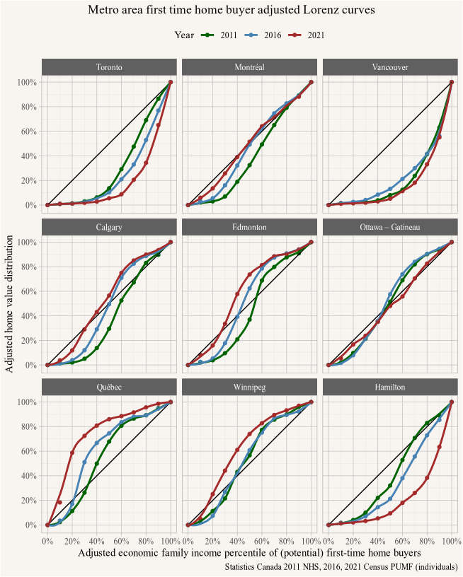
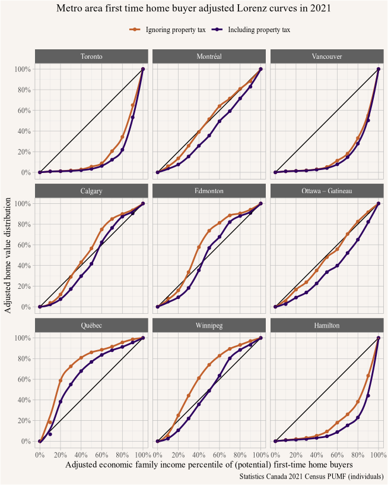
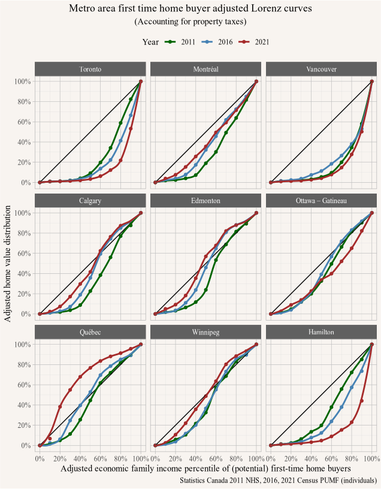
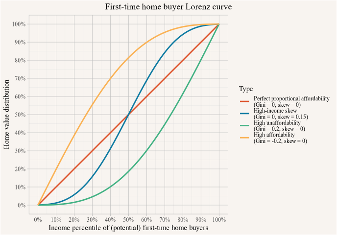
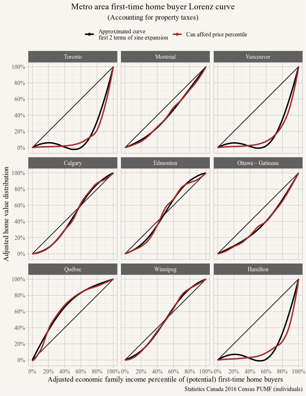
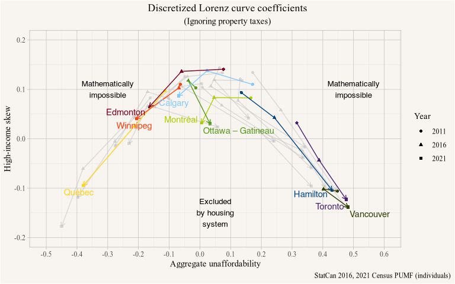

Three years ago we [wrote a post on First Time Buyer Lorenz Curves](https://doodles.mountainmath.ca/blog/2020/09/28/first-time-buyer-lorenz-curves/), looking at what share of homes are in principle available to first-time home buyers.[^1] That post continues to be a more popular one, so we thought it would be good to update it with more recent data and expand some of the ideas further.

[^1]: We define first-time home buyers as members economic families with non-student primary household maintainers between the ages of 25 and 64 that are currently renting.

**In this post we want to update this with 2021 data that has now become available, consider the effect of property taxes on affordability that we previously neglected, and introduce a new discretized version of this measure that condenses the information into two parameters, making is easier to digest and compare across different housing markets and allows the tracing of change over time.**

Different families have different housing needs, to simplify this we decided to base our affordability measure on adjusted after-tax family income deciles, which is a person-based measure that assigns each person the after tax family income divided by the square root of the number of members in the family unit. This is a standard Statistics Canada concept, based on the idea that when family members share a household and other expenses there are synergies that make the family unit more efficient than the sum of its parts, with efficiency factor roughly given by the square root of the size of the family unit. In short, a couple making a \$100k and and person living alone making \$71k have similar standards of living $\left(\frac{100}{\sqrt{2}} \approx \frac{71}{\sqrt{1}}\right)$. 

An added advantage is this gives us a person-based measure, so instead of assessing the affordability of family units, where e.g. a single person gets compared to a family of four, we are comparing people and how they are affected by affordability. This is particularly important due to the composition of family types across metropolitan areas not being the same.

On the housing side, we showed we can similarly divide home prices by the square root of the number of bedrooms to get a stable measure of home prices that is comparable across different home sizes, as measured by number of bedrooms. Like the family example above, a \$900k 5 bedroom house is considered to "cost" the same as a \$400k 1 bedroom apartment $\left(\frac{900}{\sqrt{5}} \approx \frac{400}{\sqrt{1}}\right)$. A potentially better measure for scaling would likely be square footage, but that is not available in the census.

The *adjusted Gini curve* is then a visual representation of affordability of persons in first-time buyer family units. We believe this measure is useful to give an indication of how accessible ownership is in different housing markets. In particular this [avoides the pitfalls of using household-based measures](https://doodles.mountainmath.ca/blog/2023/08/17/housing-outcomes/) that are plaguing much of our housing discussions. Family units are the right kind of decision making units when it comes to buying (or renting) housing, so it's family income that matters.


## First-time home buyer Lorenz curves in 2021


::: {.cell}

```{.r .cell-code}
pumf_2011 <- get_pumf("Census","2011") |>
  label_pumf_data(rename_columns = FALSE) %>%
  setNames(toupper(names(.))) |> 
  mutate(ef_lower=case_when(EFINC=="Under $2,000" ~ 0,
                         TRUE ~ as.numeric(gsub("\\$|,","",str_extract(as.character(EFINC),"^\\$[\\d,]+")))),
         ef_upper=case_when(EFINC=="$250,000 and over" ~ 350000,
                         TRUE~as.numeric(gsub("\\$ *|,","",str_extract(as.character(EFINC),"\\$ *[\\d,]+$"))))) %>%
  mutate(ef_income=(ef_lower+ef_upper)/2) |>
  mutate(CMA=fct_recode(CMA,"Greater Sudbury – Thunder Bay"="Greater Sudbury / Grand Sudbury – Thunder Bay",
                        "Kelowna – Abbotsford-Mission"="Kelowna – Abbotsford"))

pumf_2016 <- get_pumf("Census","2016") |>
  label_pumf_data(rename_columns = FALSE) %>%
  set_names(names(.) %>% toupper) %>%
  mutate(CMA=fct_recode(CMA,"Greater Sudbury – Thunder Bay"="Greater Sudbury / Grand Sudbury – Thunder Bay",
                        "Kelowna – Abbotsford-Mission"="Kelowna – Abbotsford")) %>%
  mutate(ef_lower=case_when(EFINC=="Under $2,000" ~ 0,
                         TRUE ~ as.numeric(gsub("\\$|,","",str_extract(as.character(EFINC),"^\\$[\\d,]+")))),
         ef_upper=case_when(EFINC=="$250,000 and over" ~ 350000,
                         TRUE~as.numeric(gsub("\\$|,","",str_extract(as.character(EFINC),"\\$[\\d,]+$"))))) %>%
  mutate(ef_income=(ef_lower+ef_upper)/2) |>
  mutate(across(c(SHELCO,VALUE),as.numeric))

pumf_2021 <- get_pumf("Census","2021") |>
  label_pumf_data(rename_columns = FALSE) |>
  mutate(ef_lower=case_when(EFINC=="Under $2,000" ~ 0,
                         TRUE ~ as.numeric(gsub("\\$|,","",str_extract(as.character(EFINC),"^\\$[\\d,]+")))),
         ef_upper=case_when(EFINC=="$250,000 and over" ~ 350000,
                         TRUE~as.numeric(gsub("\\$|,","",str_extract(as.character(EFINC),"\\$[\\d,]+$"))))) %>%
  mutate(ef_income=(ef_lower+ef_upper)/2)


large_cmas <- pumf_2016 %>% 
  count(CMA) %>% 
  filter(CMA!="Other census metropolitan areas, census agglomerations and other geographies") %>%
  top_n(9,n) %>% 
  arrange(-n) %>% 
  pull(CMA)


census_dates <- as.Date(c("2011-05-01","2016-05-01","2021-05-01"))
mortgage_rates <- cansim::get_cansim("34-10-0145") |>
  filter(Date %in% census_dates) |>
  mutate(Year=strftime(Date,"%Y")) |>
  select(Year,mortgage_rate=val_norm) |>
  mutate(mortgage_rate=mortgage_rate-0.01) # 1% below posted rates

# live data
mortgage_data <- bind_rows(
  cansim::get_cansim("10-10-0006-01") |>
    select(Date, Components, `Unit of measure`, val_norm) |>
    pivot_wider(names_from = `Unit of measure`, values_from = val_norm) |>
    filter(Components %in% c("Total, funds advanced, residential mortgages, insured",
                             "Total, funds advanced, residential mortgages, uninsured")),
  cansim::get_cansim("10-10-0006-01") |>
    select(Date, Components, `Unit of measure`, val_norm) |>
    pivot_wider(names_from = `Unit of measure`, values_from = val_norm) |>
    filter(Components %in% c("Total, funds advanced, residential mortgages, insured",
                             "Total, funds advanced, residential mortgages, uninsured")) |>
    group_by(Date) |>
    summarise("Interest rate"=weighted.mean(`Interest rate`, Dollars),
              Dollars=sum(Dollars)) |>
    mutate(Components="Total, funds advanced, residential mortgages") |>
    ungroup()
) |>
  arrange(Date,Components) |>
  filter(strftime(Date,"%m")=='05') |>
  mutate(Year=strftime(Date,"%Y")) |>
  filter(Date %in% census_dates,
         Components=="Total, funds advanced, residential mortgages")


bank_dates <- census_dates |>
  lapply(\(x)x+seq(0,6)) |>
  unlist() |>
  as.Date()

bank_rates <- cansim::get_cansim_vector("v80691310") |>
  filter(Date %in% bank_dates) |>
  mutate(Year=strftime(Date,"%Y")) |>
  select(Year,rate=val_norm)|>
  mutate(rate=rate/100)

#interest_rate <- 0.0225
mortgage_term <- 25
mortgage_term2 <- 30
percentiles <- seq(0,1,0.1)
potential_buyers_age <- c("20 to 24 years", "25 to 29 years", "30 to 34 years", 
                          "35 to 39 years", "40 to 44 years", "45 to 49 years")


# Winnipeg https://wowa.ca/taxes/winnipeg-property-tax
property_taxes_w <- tibble(Year=c(2011,2016,2021),
                         tax_rate=c(3.176,2.7214,2.7755)/100,
                         CMA="Winnipeg")
property_taxes_v <- tibble(Year=c(2011,2016,2021),
                         tax_rate=c(4.17998,3.16567,2.92)/100,
                         CMA="Vancouver")
property_taxes_c <- tibble(Year=c(2011,2016,2021),
                         tax_rate=c(0.00605,0.0061738,0.0074068)/100,
                         CMA="Calgary")

# https://www.saskatoon.ca/sites/default/files/documents/asset-financial-management/finance-supply/Altus_Group_Canadian_Property_Tax_Benchmark_Report_2022%20%284%29.pdf
property_taxes_2021 <- tibble(Year="2021",
                              tax_rate=c(2.92,7.41,9.59,9.72,11.07,11.95,6.11,11.16,8.70,10.09,11.89)/1000,
                              CMA=c("Vancouver","Calgary","Edmonton","Saskatoon","Regina","Winnipeg","Toronto",
                                    "Ottawa – Gatineau","Montréal","Québec","Halifax"))

# https://www.prosperityedmonton.com/wp-content/uploads/2018/07/2017-Cdn-Property-Tax-Rate-Benchmark-Report.pdf
property_taxes_2016 <- tibble(Year="2016",
                              tax_rate=c(3.17,6.17,8.00,9.29,10.01,11.78,6.88,10.52,9.89,12,12.08)/1000,
                              CMA=c("Vancouver","Calgary","Edmonton","Saskatoon","Regina","Winnipeg","Toronto",
                                    "Ottawa – Gatineau","Montréal","Québec","Halifax"))

property_taxes_2011 <- tibble(Year="2011",
                              tax_rate=c(4.17998,6.05,7.50,15.05,17,14,7.8,13,13,14,15)/1000,
                              CMA=c("Vancouver","Calgary","Edmonton","Saskatoon","Regina","Winnipeg","Toronto",
                                    "Ottawa – Gatineau","Montréal","Québec","Halifax"))

property_taxes <- bind_rows(property_taxes_2011,property_taxes_2016,property_taxes_2021) 
```
:::


::: {.cell}

```{.r .cell-code}
pumf_income_data <- bind_rows(
  pumf_2011 |> 
    mutate(Year="2011") |>
    filter(PRIHM=="Person is primary maintainer", # count households only once
           ATTSCH=="Did not attend school", # filter out students
           !(SUBSIDY %in% c("Yes, a subsidized dwelling", "Not available")),
           !(MOB1 %in% c("External migrants", "Not available")),  #Remove 1st year external migrants
           AGEGRP %in% potential_buyers_age, 
           ef_income>0,
           EFSIZE!="Not available",
           TENUR=="Rented or Band housing") |>
    mutate(ef_group=case_when(EFSIZE=="Person not in an economic family" ~ 1,
                              TRUE ~ substr(EFSIZE,1,1) |> as.integer())) |>
    select(Year,CMA,ef_income,ef_group),
  pumf_2016 |> 
    mutate(Year="2016") |>
    filter(PRIHM=="Person is primary maintainer", # count households only once
           ATTSCH=="Did not attend school", # filter out students
           !(SUBSIDY %in% c("Yes, a subsidized dwelling", "Not available")),
           !(MOB1 %in% c("External migrants", "Not available")),  #Remove 1st year external migrants
           AGEGRP %in% potential_buyers_age, 
           ef_income>0,
           EFSIZE!="Not available",
           TENUR=="Rented or Band housing") %>%
    mutate(ef_group=case_when(EFSIZE=="Person not in an economic family" ~ 1,
                              TRUE ~ as.numeric(substr(EFSIZE,1,1)))) |>
    select(Year,CMA,ef_income,ef_group),
    pumf_2021 |> 
    mutate(Year="2021") |>
    filter(PRIHM=="Person is primary maintainer", # count households only once
           ATTSCH=="Did not attend school", # filter out students
           !(SUBSIDY %in% c("Subsidized", "Not available")),
           !(MOB1 %in% c("External migrants", "Not available")),  #Remove 1st year external migrants
           AGEGRP %in% potential_buyers_age, 
           ef_income>0,
           EFSIZE!="Not available",
           TENUR=="Renter or Dwelling provided by the local government, First Nation or Indian band") %>%
    mutate(ef_group=case_when(EFSIZE=="Person not in an economic family" ~ 1,
                              TRUE ~ as.numeric(substr(EFSIZE,1,1)))) |>
    select(Year,CMA,ef_income,ef_group)
)

pumf_homeprice_data <- bind_rows(
  pumf_2011 |>
    mutate(Year="2011") |>
  mutate(across(c(OMP,VALUE),as.numeric)) |>
    filter(PRIHM=="Person is primary maintainer", # count households only once
         OMP>0,
         VALUE>1,
         VALUE<88888888,
         TENUR=="Owned by a member of the household",
         BEDRM!="Not available") %>%
  mutate(brm_group=case_when(BEDRM=="No bedroom" ~ 1, # count bachelor as 1
                             TRUE ~ as.numeric(substr(BEDRM,1,1)))) |>
    select(Year,CMA,brm_group,VALUE),
  pumf_2016 |>
    mutate(Year="2016") |>
  filter(PRIHM=="Person is primary maintainer", # count households only once
         SHELCO>0, 
         VALUE>1,
         VALUE<88888888,
         TENUR=="Owned by a member of the household",
         BEDRM!="Not available",
         DTYPE!= "Not available") %>%
  mutate(brm_group=case_when(BEDRM=="No bedroom" ~ 1, # count bachelor as 1
                             TRUE ~ as.numeric(substr(BEDRM,1,1)))) |>
    select(Year,CMA,brm_group,VALUE),
  pumf_2021 |>
    mutate(Year="2021") |>
  filter(PRIHM=="Person is primary maintainer", # count households only once
         SHELCO>0, 
         VALUE>1,
         VALUE<88888888,
         TENUR=="Owner",
         BEDRM!="Not available",
         DTYPE!= "Not available") %>%
  mutate(brm_group=case_when(BEDRM=="No bedroom" ~ 1, # count bachelor as 1
                             TRUE ~ as.numeric(substr(BEDRM,1,1)))) |>
    select(Year,CMA,brm_group,VALUE) 
) |>
    left_join(mortgage_rates,by="Year") |>
    left_join(property_taxes,by=c("Year","CMA"))
```
:::


::: {.cell}

```{.r .cell-code}
adj_ef_income <- pumf_income_data |>
  summarize(Income=quantile(ef_income/sqrt(ef_group), percentiles),percentile=percentiles, cases=n(),.by=c(CMA,Year)) %>%
  mutate(`Max shelter cost`=0.3*Income)

adj_ef_home_price <- pumf_homeprice_data |>
  mutate(tax_rate=coalesce(tax_rate,0.01)) |>
  mutate(`Annual mortgage cost`= 12*pmt(r=(mortgage_rate/12),pv=-0.99*VALUE/sqrt(brm_group), n=mortgage_term*12, fv=0)) %>%
  mutate(`Annual mortgage cost w/ property tax`= 12*pmt(r=(mortgage_rate/12), pv=-0.99*VALUE/sqrt(brm_group), n=mortgage_term*12, fv=0) +
           tax_rate*VALUE/sqrt(brm_group)) %>%
  left_join(adj_ef_income |>
              summarize(max_income=max(Income),.by=c(CMA,Year)),
            by=c("CMA","Year")) %>%
    mutate(`Annual mortgage cost`=pmin(`Annual mortgage cost`,0.3*max_income)) 


adj_ef_lorenz_data <- adj_ef_income %>%
  group_by(CMA,Year) %>%
  group_modify(function(d,g){
    hp <- adj_ef_home_price %>%
      filter(CMA==g$CMA,Year==g$Year)
    d %>% 
      mutate(`Can afford price percentile`= ecdf(hp$`Annual mortgage cost`)(`Max shelter cost`),
             `Can afford price percentile w/ property tax`= ecdf(hp$`Annual mortgage cost w/ property tax`)(`Max shelter cost`))
    }) |>
    mutate(`Can afford price percentile`=ifelse(percentile==0,0,`Can afford price percentile`),
           `Can afford price percentile w/ property tax`=ifelse(percentile==0,0,`Can afford price percentile w/ property tax`)) |>
    mutate(`Can afford price percentile`=ifelse(percentile==1,1,`Can afford price percentile`),
           `Can afford price percentile w/ property tax`=ifelse(percentile==1,1,`Can afford price percentile w/ property tax`)) |>
  filter(!grepl("Other",CMA))
```
:::


::: {.cell}

```{.r .cell-code}
lorenz_theme <- function(step=0.1){
  list(
    geom_point(),
    geom_line(data=tibble(x=c(0,1),y=c(0,1)),aes(x=x,y=y),linetype="solid",colour="black"),
    geom_smooth(se=FALSE, span=0.5,formula = y ~ x, method = 'loess'),
    #theme_minimal(),
    scale_y_continuous(labels=scales::percent,breaks=seq(0,1,step)),
    scale_x_continuous(labels=scales::percent,breaks=seq(0,1,step)),
    labs(title = "Metro area first-time home buyer Lorenz curve",
         caption = "Statistics Canada 2021 Census PUMF (individuals)",
         x="Adjusted economic family income percentile of (potential) first-time home buyers",
       y="Adjusted home value distribution"),
  coord_fixed()
  )
}


year_colours <- c("2011"="darkgreen","2016"="steelblue","2021"="brown")


lorenz_theme2 <- function(step=0.1){
  list(
    geom_point(),
    geom_line(data=tibble(x=c(0,1),y=c(0,1)),aes(x=x,y=y),linetype="solid",colour="black"),
    geom_smooth(se=FALSE, span=0.5,formula = y ~ x, method = 'loess'),
    #theme_minimal(),
    theme(legend.position = "top"),
    scale_color_manual(values=year_colours),
    scale_y_continuous(labels=scales::percent,breaks=seq(0,1,step)),
    scale_x_continuous(labels=scales::percent,breaks=seq(0,1,step)),
    labs(title = "Metro area first-time home buyer Lorenz curve",
         caption = "Statistics Canada 2011 NHS, 2016, 2021 Census PUMF (individuals)",
         x="Adjusted economic family income percentile of (potential) first-time home buyers",
       y="Adjusted home value distribution"),
     coord_fixed()
  )
}
```
:::


Let's take a look what such a Lorenz curve for potential first-time buyers (essentially renters aged 20 through 49) looks like. To remind us we show the Lorenz curve for Calgary in 2021.


::: {.cell crop='true'}

```{.r .cell-code}
calgary_ftbs <-adj_ef_lorenz_data %>%
  filter(CMA =="Calgary",Year=="2021") %>% 
  mutate(a=`Can afford price percentile`)
calgary_ftbs %>%
  mutate(label=paste0(scales::percent(percentile,accuracy=0.1)," of first-time buyers\ncan afford ", 
                      scales::percent(`Can afford price percentile`,accuracy=0.1)," of homes")) %>%
  ggplot(aes(x=percentile, y=`Can afford price percentile`,colour=Year)) +
  lorenz_theme2(0.1) +
  theme(legend.position = "none") +
  ggrepel::geom_text_repel(data=~filter(.,abs(percentile-0.2)<0.01),aes(label=label),hjust=-0.2,vjust=1,size=3) +
  ggrepel::geom_text_repel(data=~filter(.,abs(percentile-0.3)<0.01),aes(label=label),hjust=-0.5,vjust=0,size=3) +
  ggrepel::geom_text_repel(data=~filter(.,abs(percentile-0.7)<0.01),aes(label=label),hjust=1,vjust=-1,size=3) +
  labs(title = "Metro Calgary first-time home buyer adjusted Lorenz curve",
       caption = "Statistics Canada 2021 Census PUMF (individuals)") 
```

::: {.cell-output-display}

:::
:::


In Calgary, potential first-time buyers at the bottom end of the renter income can't afford any of the homes. Someone at the 20th income percentile of potential first-time buyers can only afford 12% of Calgary homes. But after that things pick up fast and someone at the 60th percentile can afford 75%, at which point things even out and the Lorenz curve hugs the diagonal.

This says nothing about what kind of home someone can afford, or where in the metro area an affordable home may be. It also skirts the discussion about "starter homes" or more generally the question if there is a mismatch between homes first-time buyers are buying and the overall distribution of homes in the metro area in terms of quality or size. Or if there should be such a distinction. What this does is it gives a rough matchup between incomes of (potential) first-time buyers and home values.

With this we can update our Lorenz curves by showing both the 2016 and the new 2021 in the same plot, and adding in 2011 data for good measure, enabling us to see how the affordability distribution has shifted over the last 10 years.


::: {.cell crop='true'}

```{.r .cell-code}
adj_ef_lorenz_data %>%
  filter(CMA %in% large_cmas) %>%
  mutate(CMA=factor(CMA,large_cmas)) %>%
  ggplot(aes(x=percentile, y=`Can afford price percentile`,colour=Year)) +
  lorenz_theme2(0.2) +
  facet_wrap("CMA") +
  labs(x="Adjusted economic family income percentile of (potential) first-time home buyers",
       y="Adjusted home value distribution",
       title="Metro area first time home buyer adjusted Lorenz curves") 
```

::: {.cell-output-display}

:::
:::


This reveals that first time buyer affordability has shifted in different ways. The already largely unaffordable markets of Vancouver and Toronto have become further unaffordable. Hamilton shows the worst deterioration of affordability, as measured by the area between the 2016 and 2021 curve. On the other hand, Québec City has become more affordable.

It's important to note that the 2021 census using 2020 income data, and especially low income people benefited from pandemic CERB payments that have lifted them up and explains some of the affordability improvements for the lower income percentiles. We note that this effect is only visible in some metro area, in others increasing home prices have more than offset the temporary pandemic income boost

## Property taxes


::: {.cell}

```{.r .cell-code}
#q_home_value_bump_1 <- -pv.perpetuity(r=interest_rate, pmt=0.007)
q_home_value_bump_2 <- -pv.perpetuity(r=filter(mortgage_rates,Year=="2021")$mortgage_rate, pmt=0.007)
q_home_value_bump_3 <- -pv(r=filter(mortgage_rates,Year=="2021")$mortgage_rate, n=mortgage_term*12, pmt=0.007)
```
:::


This view might be overly optimistic, our affordability metric does not include property taxes and utilities. Cost of utilities are fairly uniform across Canada and don't change much over time, but property taxes certainly do. And this matters to affordability, for example Québec City's property tax rates are around 1% of the property value, compared to around 0.3% in Vancouver. Correspondingly people in Vancouver can afford higher-priced homes than people in Québec City on the same income.

Adjusting our affordability metric to include property taxes, for this exercise taken from an [Altus report](https://www.saskatoon.ca/sites/default/files/documents/asset-financial-management/finance-supply/Altus_Group_Canadian_Property_Tax_Benchmark_Report_2022%20%284%29.pdf), shows this effect on affordability quite clearly.


::: {.cell crop='true'}

```{.r .cell-code}
adj_ef_lorenz_data %>%
  filter(CMA %in% large_cmas) %>%
  mutate(CMA=factor(CMA,large_cmas)) %>%
  rename(`Ignoring property tax`=`Can afford price percentile`,`Including property tax`=`Can afford price percentile w/ property tax`) |>
  pivot_longer(cols=matches("property tax"),names_to="affordability",values_to="value") %>%
  filter(Year=="2021") |>
  ggplot(aes(x=percentile, y=value,colour=affordability)) +
  lorenz_theme(0.2) +
  facet_wrap(~CMA) +
  theme(legend.position = "top") +
  scale_colour_manual(values=sanzo::duos$c103) +
  labs(x="Adjusted economic family income percentile of (potential) first-time home buyers",
       y="Adjusted home value distribution",
       colour=NULL,
       title="Metro area first time home buyer adjusted Lorenz curves in 2021") 
```

::: {.cell-output-display}

:::
:::


In Vancouver, with it's relatively low property tax rate, this does not make much of a difference, whereas in other metro areas the difference is substantial.

This should not be taken to mean that property taxes have a causal effect on affordability in the sense that lowering property taxes will increase affordability of first-time buyers. This is because prices are highly endogenous to property taxes, if Québec City's property tax rates were the same as Vancouver's the net present value of a home in Québec would be around 31% higher, and exogenously changing property tax rates would cause prices to adjust to reflect that to a large extent. In Canada property tax rates are set by the ratio of aggregate home values to municipal budgets, so prices impact property tax rates. On the other hand, property tax rates impact home prices in the same way that interest rates do, with lower property tax rates leading to higher prices.

With this insight we continue by including property taxes in our affordability metric, with an updated graph for all years and metro areas.


::: {.cell crop='true'}

```{.r .cell-code}
adj_ef_lorenz_data %>%
  filter(CMA %in% large_cmas) %>%
  mutate(CMA=factor(CMA,large_cmas)) %>%
  ggplot(aes(x=percentile, y=`Can afford price percentile w/ property tax`,colour=Year)) +
  lorenz_theme2(0.2) +
  facet_wrap("CMA") +
  labs(x="Adjusted economic family income percentile of (potential) first-time home buyers",
       y="Adjusted home value distribution",
       subtitle="(Accounting for property taxes)",
       title="Metro area first time home buyer adjusted Lorenz curves") 
```

::: {.cell-output-display}

:::
:::


## Condensing the Lorenz curve into a discrete metric

An obvious candidate for a discrete metric is the Gini coefficient. The Gini coefficient is just the area between the Lorenz curve and the diagonal. This gives a broad measure of affordability in a metro area, a positive coefficient means housing is less affordable, a negative coefficient means housing is more affordable. Perfect proportional affordability is where every potential first time buyer can access housing up to the percentile that corresponds to their percentile in the income distribution.

High unaffordability is characterized by the Lorenz curve staying under the diagonal, high affordability by a curve staying above the diagonal. In many cases we see curves exhibiting high-income skew where they are crossing the diagonal somewhere in the middle of the income spectrum, with lower income people unable to afford homes corresponding to their income percentile while higher income people able to afford homes above their income percentile.


::: {.cell crop='true'}

```{.r .cell-code}
perfect_affordability <- as_tibble(seq(0,1,0.001)) %>%
  transmute(percentile=value) %>%
  mutate(`Can afford price percentile`= case_when(percentile==0 ~ 0,
                                                  TRUE ~ 1), 
         Type="Perfect affordability\n(Gini = -1, skew = 0)")

proportional_affordability <- as_tibble(seq(0,1,0.001)) %>%
  transmute(percentile=value) %>%
  mutate(`Can afford price percentile`= percentile,
         Type="Perfect proportional affordability\n(Gini = 0, skew = 0)")

perfect_unaffordability <- as_tibble(seq(0,1,0.001)) %>%
  transmute(percentile=value) %>%
  mutate(`Can afford price percentile`= case_when(percentile==1 ~ 1,
                                                  TRUE ~ 0), 
         Type="Perfect unaffordability\n(Gini = 1, skew = 0)")

zero_Gini <- as_tibble(seq(0,1,0.001)) %>%
  transmute(percentile=value) %>%
  mutate(`Can afford price percentile`= percentile-0.15*sin(percentile*2*pi), 
         Type="Proportional affordability\n(Gini = 0, skew = 0)")


unequal_0 <- as_tibble(seq(0,1,0.001)) %>%
  transmute(percentile=value) %>%
  mutate(`Can afford price percentile`= percentile-0.15*sin(percentile*2*pi), 
         Type="High-income skew\n(Gini = 0, skew = 0.15)")

unaffordable <- as_tibble(seq(0,1,0.001)) %>%
  transmute(percentile=value) %>%
  mutate(`Can afford price percentile`= percentile-pi/10*sin(percentile*pi), 
         Type="High unaffordability\n(Gini = 0.2, skew = 0)")
affordable <- as_tibble(seq(0,1,0.001)) %>%
  transmute(percentile=value) %>%
  mutate(`Can afford price percentile`= percentile+pi/10*sin(percentile*pi), 
         Type="High affordability\n(Gini = -0.2, skew = 0)")


example <- rbind(#perfect_affordability, 
                 proportional_affordability,
                 unequal_0, #perfect_unaffordability,
                 unaffordable,affordable) %>%
  mutate(Type=factor(Type,levels=unique(Type)))

ggplot(example, aes(x=percentile, y=`Can afford price percentile`, col=Type))+
  geom_line(linewidth=1) +
    scale_y_continuous(labels=scales::percent,breaks=seq(0,1,0.1)) + 
    scale_x_continuous(labels=scales::percent,breaks=seq(0,1,0.1)) +
    labs(title = "First-time home buyer Lorenz curve",
         x="Income percentile of (potential) first-time home buyers",
         y="Home value distribution") +
  scale_colour_manual(values=MetBrewer::met.brewer("Egypt",4)) +
  coord_fixed()
```

::: {.cell-output-display}

:::
:::


But there are several problems, the first time buyer Lorenz curves can also take values above the diagonal, and for example the two curves show above with zero Gini coefficient are qualitatively quite different. The *high-income skew* curve models a housing market like Calgary in 2021, where lower income potential first time buyers can't afford housing corresponding to their income percentile, whereas higher income potential first time buyers can access more housing than corresponds to their income percentile. The Gini coefficient can't distinguish between these two cases, both have a Gini of zero, but they represent distinct distributions of (un-)affordability.For analysis and policy making, it is important our metrics summarizing the Lorenz curve retains this information.

Intuitively we can think of the two model cases of high (un)affordability and high-income skew as the first two harmonics relative to the diagonal representing perfect proportional affordability. More formally we discretize the Lorenz curves by taking the first two terms of the Fourier expansion of their difference from the diagonal, the *perfect proportional affordability* Lorenz curve . A sine expansion will capture these reasonably well with just a few terms, where the first term is a good approximation of the (scaled) Gini coefficient representing the **aggregate unaffordability** and the second term gives the strength of the main oscillation around the diagonal, interpreted as **high-income skew**.


::: {.cell crop='true'}

```{.r .cell-code}
calculate_sine_expansion <- function(data,afford_column,order=2){
  df<-data |>
    mutate(y=!!as.name(afford_column)-percentile)
  
  #fit <- lowess(df$percentile,df$y,f=0.5)
  
  d<- approx(df$percentile,df$y,xout=seq(0,1,1/1023)) |>
    as_tibble() |>
    set_names(c("percentile","y"))  %>%
    #mutate(y=predict(fit,new_data=.))
    mutate(y=ifelse(percentile %in% c(0,1),0,y))
  
  d_dct <- gsignal::dst(d$y,n=nrow(d))*2/length(d$y)
  
  d_dct[seq(1,order)]
}

sine_expansion <- function(coeffs){
  function(x){
    r <- 0
    for(i in seq(1,length(coeffs))){
      r <- r + coeffs[i] * sin(i*x*pi)
    }
    r
  }
  
}

adj_ef_lorenz_data %>%
  filter(CMA %in% large_cmas,Year=="2021") %>%
  mutate(CMA=factor(CMA,large_cmas)) |>
  mutate(y=`Can afford price percentile w/ property tax`-percentile) |>
  group_by(CMA,Year) %>%
  group_map(\(.x,.y).x %>% mutate(yy=(calculate_sine_expansion(.,afford_column = "Can afford price percentile w/ property tax",order=2) |> 
                                     sine_expansion())(percentile),
                               Year=.y$Year,
                               CMA=.y$CMA) )|>
  bind_rows() |>
  ungroup() |>
  mutate(`Approximated curve`=yy+percentile) |>
  pivot_longer(c(`Can afford price percentile w/ property tax`,`Approximated curve`),names_to="type",values_to="value") |>
  ggplot(aes(x=percentile,y=value,colour=type)) +
  geom_point(data=~filter(.,type=="Can afford price percentile"))  +
  geom_line(data=tibble(x=c(0,1),y=c(0,1)),aes(x=x,y=y),colour="black")  +
  geom_smooth(se=FALSE, span=0.5,formula = y ~ x, method = 'loess') +
  scale_y_continuous(labels=scales::percent,breaks=seq(0,1,0.2)) +
  scale_x_continuous(labels=scales::percent,breaks=seq(0,1,0.2)) +
    labs(title = "Metro area first-time home buyer Lorenz curve",
         caption = "Statistics Canada 2016 Census PUMF (individuals)",
         subtitle="(Accounting for property taxes)",
         x="Adjusted economic family income percentile of (potential) first-time home buyers",
         colour=NULL,
       y="Adjusted home value distribution") +
  coord_fixed() +
  scale_colour_manual(values=c("Approximated curve"="black","Can afford price percentile w/ property tax"="brown"),
                      labels=c("Approximated curve"="Approximated curve\nfirst 2 terms of sine expansion",
                               "Can afford price percentile w/ property tax"="Can afford price percentile")) +
  #geom_smooth(se=FALSE,span=0.5) +
  facet_wrap(~CMA) +
  theme(legend.position = "top")
```

::: {.cell-output-display}

:::
:::


Except for the highly unaffordable metro areas of Vancouver, Toronto and Hamilton the first two (sine) Fourier coefficients capture the curve quite well, for Vancouver, Toronto and Hamilton the approximation struggles to properly capture how long the curve stays flat and how late it rises. This is yet another way how these city's affordability, or the lack thereof, is extreme compared to the other metro areas.

We can now take these two coefficients and plot their movement over time.


::: {.cell}

```{.r .cell-code}
coeffs <- adj_ef_lorenz_data %>%
  mutate(y=`Can afford price percentile w/ property tax`-percentile) |>
  group_by(CMA,Year) %>%
  group_map(\(.x,.y).y |> mutate(coeffs=list(calculate_sine_expansion(.x,afford_column="Can afford price percentile w/ property tax",order=2) |> set_names("1","2")))) |>
  bind_rows() |>
  unnest_longer(coeffs)


cutoffs_clean <- coeffs |>
  pivot_wider(names_from=coeffs_id,values_from=coeffs) |>
  rename(Gini=`1`,oscillation=`2`) |>
  mutate(Gini=-Gini)
cutoffs_d <- cutoffs_clean |>
  pivot_wider(names_from=Year,values_from=c(Gini,oscillation)) 


examples <- tibble(skew=c(-0.1),
                   unaffordability=c(0.3))

example_curve <- seq(1,nrow(examples)) |>
  map_df(\(i){
    row=examples[i,]
    tibble(x=seq(0,1,0.01),
           y=row$unaffordability*sin(1*x*pi)+row$skew*sin(2*x*pi))
  })
  
#ggplot(example_curve,aes(x=x,y=y+x)) + geom_line()


highlighted_cmas <- c(large_cmas)

cma_colours <- setNames(ggthemes::calc_pal()(9) |> rev(),highlighted_cmas)

ggplot(cutoffs_clean,aes(x=Gini,y=-oscillation,colour=fct_rev(CMA))) +
  geom_point(data=~ filter(.,!(CMA %in% highlighted_cmas)),
             aes(shape=Year),colour="grey",alpha=0.5) +
  geom_point(data=~ filter(.,CMA %in% highlighted_cmas),aes(shape=Year)) +
  geom_segment(data=cutoffs_d |>  filter(!(CMA %in% highlighted_cmas)), colour="grey",alpha=0.5,
            aes(y=-oscillation_2011,yend=-oscillation_2016,x=Gini_2011,xend=Gini_2016)) +
  geom_segment(data=cutoffs_d |>  filter(!(CMA %in% highlighted_cmas)), colour="grey",alpha=0.5,
            aes(y=-oscillation_2016,yend=-oscillation_2021,x=Gini_2016,xend=Gini_2021),
            arrow = arrow(length = unit(0.2, "cm"))) +
  geom_segment(data=cutoffs_d |>  filter(CMA %in% highlighted_cmas),
            aes(y=-oscillation_2011,yend=-oscillation_2016,x=Gini_2011,xend=Gini_2016)) +
  geom_segment(data=cutoffs_d |>  filter(CMA %in% highlighted_cmas),
            aes(y=-oscillation_2016,yend=-oscillation_2021,x=Gini_2016,xend=Gini_2021),
            arrow = arrow(length = unit(0.2, "cm"))) +
  #expand_limits(x=c(0,1),y=c(-0.5,0.5)) +
  scale_colour_manual(values = cma_colours, guide="none") +
  #scale_x_continuous(labels=scales::percent,breaks=seq(0,1,0.1)) +
  ggrepel::geom_text_repel(data=~filter(.,Year=="2021",CMA %in% highlighted_cmas),
                           aes(y=-oscillation,x=Gini,label=CMA),
                           hjust=0,vjust=0,
                           segment.color="black") +
  annotate("text",data=tibble(x=1),x=-0.3,y=0.1,label="Mathematically\nimpossible",
           colour="black",size=3.5) +
  annotate("text",data=tibble(x=1),x=0.5,y=0.1,label="Mathematically\nimpossible",
           colour="black",size=3.5) +
  annotate("text",data=tibble(x=1),x=0.05,y=-0.15,label="Excluded\nby housing\nsystem",
           colour="black",size=3.5) +
  labs(title="Discretized Lorenz curve coefficients",
       y="High-income skew",
        subtitle="(Accounting for property taxes)",
      x="Aggregate unaffordability",
       caption="StatCan 2016, 2021 Census PUMF (individuals)") +
  expand_limits(x=c(-0.5,0.6),y=c(-0.2,0.2)) +
  scale_x_continuous(breaks=seq(-0.5,0.6,0.1))
```

::: {.cell-output-display}

:::
:::


This graph shows that Vancouver, Toronto and Hamilton are in a league of there own when it comes to housing affordability. They exhibit quite similar aggregate unaffordability and high-income skew. Vancouver has been doing quite poorly for the entire decade covered here, whereas Toronto and in particular Hamilton have see their housing affordability radically worsen over the past decade. Ottawa-Gatineau and Montréal are in mildly unaffordable territory, while Calgary, Edmonton and Winnipeg are fairly neutral in terms of affordability. Québec City is the most affordable market considered here, and its affordability has improved significantly.

We note that the values taken by the CMAs follow a rough frown shape. This is not coincidence, not all values in the range shown can be attained. Values in the lower left and lower right aren't mathematically possible because the Lorenz curves are monotonic. Values in the top middle correspond to scenarios where lower income families have access to a higher share of housing than their position in the income distribution, whereas higher income households have access to a lower portion of housing. This is not how the housing system works.

## Property tax effects

We can revisit what this would look like if we did not account for differences in property tax rates.


::: {.cell}

```{.r .cell-code}
coeffs2 <- adj_ef_lorenz_data %>%
  mutate(y=`Can afford price percentile`) |>
  group_by(CMA,Year) %>%
  group_map(\(.x,.y).y |> mutate(coeffs=list(calculate_sine_expansion(.x,afford_column="Can afford price percentile",order=2) |> set_names("1","2")))) |>
  bind_rows() |>
  unnest_longer(coeffs) 


cutoffs2_clean <- coeffs2 |>
  pivot_wider(names_from=coeffs_id,values_from=coeffs) |>
  rename(Gini=`1`,oscillation=`2`) |>
  mutate(Gini=-Gini)
cutoffs2_d <- cutoffs2_clean |>
  pivot_wider(names_from=Year,values_from=c(Gini,oscillation)) 


highlighted_cmas <- c(large_cmas)

ggplot(cutoffs2_clean,aes(x=Gini,y=-oscillation,colour=fct_rev(CMA))) +
  geom_point(data=~ filter(.,!(CMA %in% highlighted_cmas)),
             aes(shape=Year),colour="grey",alpha=0.5) +
  geom_point(data=~ filter(.,CMA %in% highlighted_cmas),aes(shape=Year)) +
  geom_segment(data=cutoffs2_d |>  filter(!(CMA %in% highlighted_cmas)), colour="grey",alpha=0.5,
            aes(y=-oscillation_2011,yend=-oscillation_2016,x=Gini_2011,xend=Gini_2016)) +
  geom_segment(data=cutoffs2_d |>  filter(!(CMA %in% highlighted_cmas)), colour="grey",alpha=0.5,
            aes(y=-oscillation_2016,yend=-oscillation_2021,x=Gini_2016,xend=Gini_2021),
            arrow = arrow(length = unit(0.2, "cm"))) +
  geom_segment(data=cutoffs2_d |>  filter(CMA %in% highlighted_cmas),
            aes(y=-oscillation_2011,yend=-oscillation_2016,x=Gini_2011,xend=Gini_2016)) +
  geom_segment(data=cutoffs2_d |>  filter(CMA %in% highlighted_cmas),
            aes(y=-oscillation_2016,yend=-oscillation_2021,x=Gini_2016,xend=Gini_2021),
            arrow = arrow(length = unit(0.2, "cm"))) +
  #expand_limits(x=c(0,1),y=c(-0.5,0.5)) +
  annotate("text",data=tibble(x=1),x=-0.3,y=0.1,label="Mathematically\nimpossible",
           colour="black",size=3.5) +
  annotate("text",data=tibble(x=1),x=0.5,y=0.1,label="Mathematically\nimpossible",
           colour="black",size=3.5) +
  annotate("text",data=tibble(x=1),x=0.05,y=-0.15,label="Excluded\nby housing\nsystem",
           colour="black",size=3.5) +
  scale_colour_manual(values = cma_colours, guide="none") +
  #scale_x_continuous(labels=scales::percent,breaks=seq(0,1,0.1)) +
  ggrepel::geom_text_repel(data=~filter(.,Year=="2021",CMA %in% highlighted_cmas),
                           aes(y=-oscillation,x=Gini,label=CMA),
                           hjust=0,vjust=0,
                           segment.color="black") +
  labs(title="Discretized Lorenz curve coefficients",
       y="High-income skew",
        subtitle="(Ignoring property taxes)",
      x="Aggregate unaffordability",
       caption="StatCan 2016, 2021 Census PUMF (individuals)") +
  expand_limits(x=c(-0.5,0.6),y=c(-0.2,0.2)) +
  scale_x_continuous(breaks=seq(-0.5,0.6,0.1))
```

::: {.cell-output-display}

:::
:::


Omitting property taxes decreases aggregate unaffordability, but it also changes the relative position of the cities. For example, when not accounting for property taxes, Vancouver has slightly higher aggregate unaffordability and slightly stronger high-income skew than Toronto, but this reverses after accounting for property taxes.

## Upshot

This expands on our previous work on Lorenz curves and derived Gini index by adding in 2021 data, and adding the discretization into two metrics, the **aggregate unaffordability** that approximates the Gini index, and the **high-income skew** that captures the degree to which lower income earners do worse than higher income earners. We also included property taxes, as rates differ across metro areas and across time, and this makes a significant difference. Property tax rates were taken from the central municipalities, this could use refinement in future iterations.

This could be expanded on by using higher frequency data like home transactions and the Canadian Income Survey to allow closer monitoring of first time buyer affordability.


As usual, the code for this post is [available on GitHub](https://github.com/mountainMath/doodles/blob/master/content/posts/2024-01-16-first-time-buyer-lorenz-curves-revisited/index.Rmarkdown) for anyone to reproduce or adapt for their own purposes.

<details><summary>Reproducibility receipt</summary>

::: {.cell}

```{.r .cell-code}
## datetime
Sys.time()
```

::: {.cell-output .cell-output-stdout}

```
[1] "2025-07-14 23:36:32 PDT"
```


:::

```{.r .cell-code}
## repository
git2r::repository()
```

::: {.cell-output .cell-output-stdout}

```
Local:    main /Users/jens/R/mountain_doodles
Remote:   main @ origin (https://github.com/mountainMath/mountain_doodles.git)
Head:     [f53e665] 2025-07-08: update text about wartime housing shortage
```


:::

```{.r .cell-code}
## Session info
sessionInfo()
```

::: {.cell-output .cell-output-stdout}

```
R version 4.5.1 (2025-06-13)
Platform: aarch64-apple-darwin20
Running under: macOS Sequoia 15.5

Matrix products: default
BLAS:   /Library/Frameworks/R.framework/Versions/4.5-arm64/Resources/lib/libRblas.0.dylib 
LAPACK: /Library/Frameworks/R.framework/Versions/4.5-arm64/Resources/lib/libRlapack.dylib;  LAPACK version 3.12.1

locale:
[1] en_US.UTF-8/en_US.UTF-8/en_US.UTF-8/C/en_US.UTF-8/en_US.UTF-8

time zone: America/Vancouver
tzcode source: internal

attached base packages:
[1] stats     graphics  grDevices utils     datasets  methods   base     

other attached packages:
 [1] canpumf_0.3.0   patchwork_1.3.1 FinCal_0.6.3    lubridate_1.9.4
 [5] forcats_1.0.0   stringr_1.5.1   dplyr_1.1.4     purrr_1.0.4    
 [9] readr_2.1.5     tidyr_1.3.1     tibble_3.3.0    ggplot2_3.5.2  
[13] tidyverse_2.0.0

loaded via a namespace (and not attached):
 [1] gtable_0.3.6              jsonlite_2.0.0           
 [3] compiler_4.5.1            Rcpp_1.0.14              
 [5] tidyselect_1.2.1          git2r_0.36.2             
 [7] bitops_1.0-9              scales_1.4.0             
 [9] yaml_2.3.10               fastmap_1.2.0            
[11] plyr_1.8.9                R6_2.6.1                 
[13] generics_0.1.4            knitr_1.50               
[15] htmlwidgets_1.6.4         pillar_1.10.2            
[17] RColorBrewer_1.1-3        tzdb_0.5.0               
[19] rlang_1.1.6               stringi_1.8.7            
[21] xfun_0.52                 timechange_0.3.0         
[23] cli_3.6.5                 withr_3.0.2              
[25] magrittr_2.0.3            mountainmathHelpers_0.1.4
[27] digest_0.6.37             grid_4.5.1               
[29] rstudioapi_0.17.1         hms_1.1.3                
[31] lifecycle_1.0.4           vctrs_0.6.5              
[33] evaluate_1.0.4            glue_1.8.0               
[35] farver_2.1.2              RCurl_1.98-1.17          
[37] reshape2_1.4.4            rmarkdown_2.29           
[39] tools_4.5.1               pkgconfig_2.0.3          
[41] htmltools_0.5.8.1        
```


:::
:::

</details>
