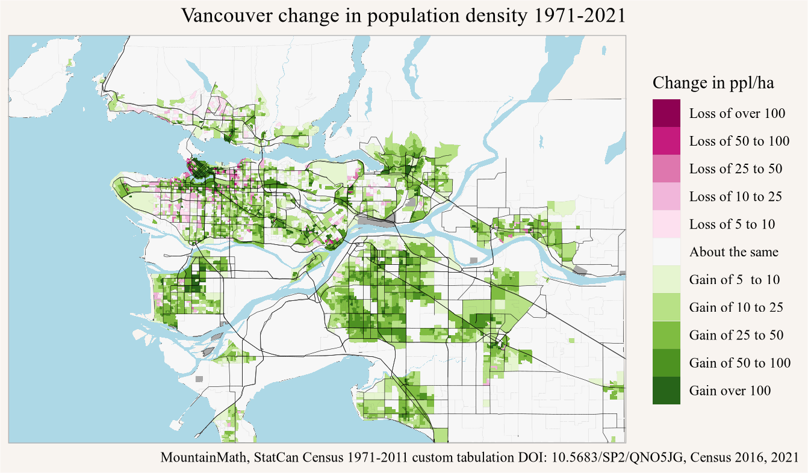

Several years ago we did a post on long population timelines in Vancouver and Toronto. The underlying data came from a semi-custom tabulation of 1971 through 2011 census profile data on a uniform 2016 geography [@statcan_census_1971-2011], which then could easily be joined with 2016 census data to map long timelines at fine geographies. For Vancouver we further refined this by mixing in [Metro Vancouver Land Use data](https://open-data-portal-metrovancouver.hub.arcgis.com/datasets/28de9170a9434974bffc24c119261310_1/explore?location=49.263389%2C-123.037293%2C15.72) to cut out underpopulated areas and make the map visually more appealing.

Since then we got new data from the 2021 census, and the Metro Vancouver land use data updated too. So we are overdue to update the post. One complication is that the 2021 data comes on 2021 geographies, but that problem is fairly easy to overcome using our TongFen package that automates the process to make geographic data comparable across census (and other) geographies. [@tongfen] And since in this case we are only looking at population data we can go a step further and use 2021 census blocks to match against 2016 dissemination areas.

# Toronto

To keep things easy we start with Toronto. We express the change in terms of the change in population density, concretely the change in people per hectare, between 1971 and 2021. The change of population density gives a nice way to normalize the data without getting into small denominator problems that come up when e.g. looking at the percentage change in population.


::: {.cell crop='true'}

```{.r .cell-code}
breaks <- c(-Inf,-100,-50,-25,-10,-5,5,10,25,50,100,Inf)
labels <- c("Loss of over 100", "Loss of 50 to 100",
            "Loss of 25 to 50", "Loss of 10 to 25", "Loss of 5 to 10", "About the same",
            "Gain of 5  to 10", "Gain of 10 to 25", "Gain of 25 to 50", "Gain of 50 to 100",
            "Gain over 100")
colors <- RColorBrewer::brewer.pal(length(labels),"PiYG")
toronto_city <- get_census("CA16",regions=list(CSD="3520005"),geo_format = 'sf',quiet = TRUE)
toronto_data <- get_census("CA16CT",regions=list(CMA="35535"),
                   vectors=c("1971"="v_CA1971x16_1","2016"="v_CA16_1"),
                   level="DA",geo_format='sf',quiet = TRUE) %>%
  mutate(area=`Shape Area`*100) %>%
  mutate(change=`2016`-coalesce(`1971`,0)) %>%
  mutate(change_h=change/area) %>%
  mutate(change_d=cut(change_h,breaks=breaks,labels=labels))

toronto_2021 <- get_census("2021",regions=list(CMA="35535"),level="DB",quiet = TRUE)
toronto_2016 <- get_census("2016",regions=list(CMA="35535"),level="DB",quiet = TRUE)

db_correspondence<-tongfen:::get_single_correspondence_ca_census_for("2021","DB") |>
  inner_join(toronto_2021 |> filter(Population>0) |> select(DBUID2021=GeoUID),by="DBUID2021") |>
  inner_join(toronto_2016 |> select(DBUID2016=GeoUID,DAUID2016=DA_UID),by="DBUID2016") |>
  select(DBUID2021,DAUID2016) |>
  tongfen:::get_tongfen_correspondence()

combined_data <- toronto_data |>
  left_join(db_correspondence |> select(DAUID2016,TongfenID) |> unique(),by=c("GeoUID"="DAUID2016")) |>
  group_by(TongfenID) |>
  summarize(across(c(`1971`,`2016`,Population,area),\(x)sum(x,na.rm=TRUE)),
            .groups="drop") |>
  full_join(toronto_2021 |> 
              inner_join(db_correspondence |> 
                           select(DBUID2021,TongfenID) |> 
                           unique(),
                         by=c("GeoUID"="DBUID2021")) |> 
              summarize(`2021`=sum(Population,na.rm=TRUE),.by=TongfenID),
            by="TongfenID") |>
  #mutate(area=st_area(geometry) |> as.numeric()) |>
  mutate(change=`2021`-coalesce(`1971`,0)) |>
  mutate(change_h=change/area) |>
  mutate(change_d=cut(change_h,breaks=breaks,labels=labels))

bbox=sf::st_bbox(toronto_city %>% st_transform(st_crs(combined_data))) 

combined_data |>
  filter(`2021`>10|`1971`>10) |>
  ggplot() +
  geom_sf(data=get_census("2021",regions=list(CMA="35535"),geo_format="sf",quiet = TRUE),
          fill="darkgrey") +
  geom_sf(linewidth=0.01,aes(fill=change_d)) +
  geom_water(tile_size_px=2048) +
  geom_roads(transform=\(d) d|> filter(kind %in% c("highway","major_road")),tile_size_px=2048) +
  scale_fill_manual(values=colors,na.value="grey") +
  labs(title="Toronto change in population density 1971-2021",
       caption=caption,
       fill="Change in ppl/ha") +
   coord_sf(datum=NA, xlim=c(bbox$xmin,bbox$xmax), ylim=c(bbox$ymin,bbox$ymax))
```

::: {.cell-output-display}
{width=672}
:::
:::


The map looks quite similar to the [1971 to 2016 map from the previous post](https://doodles.mountainmath.ca/posts/2019-06-15-census-custom-timelines/index.html), which should not surprise since it only adds another 5 years of change on top of the previous 45 year time span. Just out of interest we quickly map the 2016 to 2021 change on the same colour scale.


::: {.cell crop='true'}

```{.r .cell-code}
combined_data |>
  mutate(change=`2021`-coalesce(`2016`,0)) |>
  mutate(change_h=change/area) |>
  mutate(change_d=cut(change_h,breaks=breaks,labels=labels)) |>
  filter(`2021`>10|`2016`>10) |>
  ggplot() +
  geom_sf(data=get_census("2021",regions=list(CMA="35535"),geo_format="sf",quiet = TRUE),
          fill="darkgrey") +
  geom_sf(linewidth=0.01,aes(fill=change_d)) +
  geom_water(tile_size_px=1024) +
  geom_roads(transform=\(d) d|> filter(kind %in% c("highway","major_road")),tile_size_px=1024) +
  scale_fill_manual(values=colors,na.value="grey") +
  labs(title="Toronto change in population density 2016-2021",
       caption=caption,
       fill="Change in ppl/ha") +
   coord_sf(datum=NA, xlim=c(bbox$xmin,bbox$xmax), ylim=c(bbox$ymin,bbox$ymax)) 
```

::: {.cell-output-display}
{width=672}
:::
:::


# Vancouver

Next we turn to Vancouver. The population decline that's visible in Toronto's centrally located low-density neighbourhoods is muted in Vancouver, likely due secondary suites and laneway houses becoming legalized earlier in the central parts of the region.


::: {.cell}

```{.r .cell-code}
data_2021 <- get_census("2021",regions=list(CMA="59933"),level="DB",quiet = TRUE)
data_2016 <- get_census("2016",regions=list(CMA="59933"),level="DB",quiet = TRUE)

db_correspondence<-tongfen:::get_single_correspondence_ca_census_for("2021","DB") |>
  inner_join(data_2021 |> filter(Population>0) |> select(DBUID2021=GeoUID),by="DBUID2021") |>
  inner_join(data_2016 |> select(DBUID2016=GeoUID,DAUID2016=DA_UID),by="DBUID2016") |>
  select(DBUID2021,DAUID2016) |>
  tongfen:::get_tongfen_correspondence()

tongfen_geos <- get_census("2016", regions=list(CMA="59933"), 
                           level="DA", geo_format="sf",quiet = TRUE) |>
  left_join(db_correspondence |>
              select(DAUID2016,TongfenID),by=c("GeoUID"="DAUID2016")) |>
  group_by(TongfenID) |>
  summarize(area_old=sum(`Shape Area`,na.rm=TRUE)*100,.groups="drop") 


years=c(1971,seq(1981,2011,5))
old_vectors <- years %>% map(function(y)paste0("v_CA",y,"x16_1")) %>% unlist %>% set_names(years)
pop_data <- get_census("CA16CT",regions=list(CMA="59933"),
                   vectors=c(old_vectors,c("2016"="v_CA16_1")),level="DA",quiet = TRUE) %>%
  select_at(c("GeoUID",years %>% as.character,"2016")) %>%
  mutate(GeoUID=recode(GeoUID,"59150062"="59153402")) |>
  group_by(GeoUID) %>%
  summarise_all(sum,na.rm=TRUE) 

combined_data <- pop_data |>
  left_join(db_correspondence |> select(DAUID2016,TongfenID) |> unique(),by=c("GeoUID"="DAUID2016")) |>
  group_by(TongfenID) |>
  summarize(across(matches("^\\d{4}$"),\(x)sum(x,na.rm=TRUE)),.groups="drop") |>
  full_join(data_2021 |> 
              inner_join(db_correspondence |> 
                           select(DBUID2021,TongfenID) |> 
                           unique(),
                         by=c("GeoUID"="DBUID2021")) |> 
              summarize(`2021`=sum(Population,na.rm=TRUE),.by=TongfenID),
            by="TongfenID")
```
:::

::: {.cell crop='true'}

```{.r .cell-code}
tongfen_geos %>%
  mutate(area=st_area(.) |> as.numeric()) |>
  mutate(area=area/10000) |>
  left_join(combined_data,by="TongfenID") |>
  mutate(change=`2021`-coalesce(`1971`,0)) |>
  mutate(change_h=change/area) |>
  mutate(change_d=cut(change_h,breaks=breaks,labels=labels)) |>
  filter(`2021`>10|`1971`>10) |>
  ggplot() +
  geom_sf(data=get_census("2021",regions=list(CMA="59933"),geo_format="sf",quiet = TRUE),
          fill="darkgrey") +
  geom_sf(linewidth=0.01,aes(fill=change_d)) +
  geom_water(tile_size_px=1024) +
  geom_roads(transform=\(d) d|> filter(kind %in% c("highway","major_road")),tile_size_px=1024) +
  scale_fill_manual(values=colors,na.value="grey") +
  labs(title="Vancouver change in population density 1971-2021",
       caption=caption,
       fill="Change in ppl/ha") +
  coord_bbox(metro_van_bbox('tight')) 
```

::: {.cell-output-display}
{width=672}
:::
:::


# Finer geographies

For Vancouver we again want to cut down the census geographies by land use, removing parks and industrial areas and other parts where nobody lives. This is a bit of a challenge as some people still live in e.g. agricultural areas, and getting too aggressive might lead to distortions.

This time we will take a slightly different route than what we did in the previous post and leave in agricultural areas next to areas with explicit residential land use. On the other hand, we will divide by the resulting cut down areas for density estimates as opposed to using the area of the broader census geographies for normalization, which makes things more spiky. So there are some different design choices than the previous version.


::: {.cell}

```{.r .cell-code}
lu_data <- get_metro_vancouver_land_use_data()
residential_land_uses <- lu_data |> 
  filter(grepl("^Residential|Mixed Residential|Agricu|Rooming Houses",Descriptio)) |> 
  pull(LU_Code) |> 
  unique()

cut_to_land_use <- function(data,land_uses){
  crs_orig <- st_crs(data)
  lu <- land_uses |> st_make_valid() |> st_union() |> st_collection_extract("POLYGON") |> st_make_valid()
  d1 <- data |>
    st_transform(st_crs(lu)) |>
    st_make_valid() |>
    st_intersection(lu) |>
    st_collection_extract("POLYGON") |>
    st_make_valid() %>%
    filter(!st_is_empty(.)) 
  d2 <- data |>
    filter(!(TongfenID %in% unique(d1$TongfenID))) |>
    st_transform(st_crs(lu))
  bind_rows(d1,d2) |> st_transform(crs_orig) |>
  st_make_valid() 
}

tongfen_geos_lu <- tongfen_geos |> 
  cut_to_land_use(lu_data |> filter(LU_Code %in% residential_land_uses))%>%
  mutate(area=st_area(.) |> as.numeric()) |>
  mutate(area=area/10000) 

geo_data <- tongfen_geos_lu |>
  mutate(area=round(area,2)) |>
  rmapshaper::ms_simplify(keep = 0.75,keep_shapes = TRUE) %>%
  left_join(combined_data,by="TongfenID") 


success <- sf_to_s3_gzip(geo_data %>% select(c(area,matches("^\\d{4}$"))),
                         s3_bucket = "mountainmath",
                         s3_path = "yvr_timeline/yvr_pop_timeline_2021.geojson.gz")
```
:::


To better deal with the spikiness of the data we again turn to a separate interactive 3D visualization for the population data, showing both population density as well as change in population density.

<a href="/html/yvr_pop_timeline_2021.html" target="_blank"></a>

<a class="btn btn-primary" href="/html/yvr_pop_timeline_2021.html" target="_blank">Explore interactive population change map</a>

# Conclusion

Unfortunately we only have the historic census data back to 1971 for the Vancouver and Toronto areas, there would be a lot of value in getting electronic census data at comparable geographies for all of Canada, or at least the major metropolitan areas. Using TongFen we can emulate that at a loss of geographic granularity, this is easy to do going back to 2001 and can be extended to 1996 which based on geographic matching with enumeration areas. StatCan now does make census data available in electronic form back to 1981, but 1976 and 1971 data is still not available. And census geographies in electronic form for the old censuses is also problematic.

The semi-custom tabulation we have been using solves a lot of these issues, at this point it would probably be a lot more valuable if instead of continuing to release older census data on their original census geographies StatCan were to release the older census data on geographies based on the more modern system of geographies introduced with the 2001 census, or even better, just using 2021 geographies.

As usual, the code for this post is [available on GitHub](https://github.com/mountainMath/mountain_doodles/blob/main/posts/2024-04-23-population-timelines-update/index.qmd) for anyone to reproduce or adapt for their own purposes.

<details><summary>Reproducibility receipt</summary>

::: {.cell}

```{.r .cell-code}
## datetime
Sys.time()
```

::: {.cell-output .cell-output-stdout}

```
[1] "2024-04-23 23:11:08 PDT"
```


:::

```{.r .cell-code}
## repository
git2r::repository()
```

::: {.cell-output .cell-output-stdout}

```
Local:    main /Users/jens/R/mountain_doodles
Remote:   main @ origin (https://github.com/mountainMath/mountain_doodles.git)
Head:     [b392429] 2024-04-24: cleanup
```


:::

```{.r .cell-code}
## Session info
sessionInfo()
```

::: {.cell-output .cell-output-stdout}

```
R version 4.3.2 (2023-10-31)
Platform: aarch64-apple-darwin20 (64-bit)
Running under: macOS Sonoma 14.4.1

Matrix products: default
BLAS:   /Library/Frameworks/R.framework/Versions/4.3-arm64/Resources/lib/libRblas.0.dylib 
LAPACK: /Library/Frameworks/R.framework/Versions/4.3-arm64/Resources/lib/libRlapack.dylib;  LAPACK version 3.11.0

locale:
[1] en_US.UTF-8/en_US.UTF-8/en_US.UTF-8/C/en_US.UTF-8/en_US.UTF-8

time zone: America/Vancouver
tzcode source: internal

attached base packages:
[1] stats     graphics  grDevices utils     datasets  methods   base     

loaded via a namespace (and not attached):
 [1] vctrs_0.6.5               cli_3.6.2                
 [3] knitr_1.45                rlang_1.1.3              
 [5] xfun_0.41                 generics_0.1.3           
 [7] jsonlite_1.8.8            glue_1.7.0               
 [9] colorspace_2.1-0          git2r_0.33.0             
[11] htmltools_0.5.7           mountainmathHelpers_0.1.4
[13] scales_1.3.0              fansi_1.0.6              
[15] rmarkdown_2.25            grid_4.3.2               
[17] munsell_0.5.0             evaluate_0.23            
[19] tibble_3.2.1              fastmap_1.1.1            
[21] yaml_2.3.7                lifecycle_1.0.4          
[23] compiler_4.3.2            dplyr_1.1.4              
[25] htmlwidgets_1.6.4         pkgconfig_2.0.3          
[27] rstudioapi_0.15.0         digest_0.6.33            
[29] R6_2.5.1                  tidyselect_1.2.0         
[31] utf8_1.2.4                pillar_1.9.0             
[33] magrittr_2.0.3            tools_4.3.2              
[35] gtable_0.3.4              ggplot2_3.5.0            
```


:::
:::

</details>
