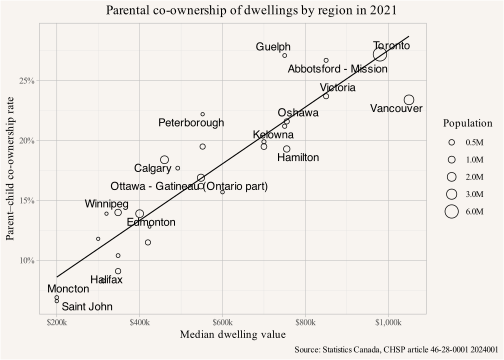
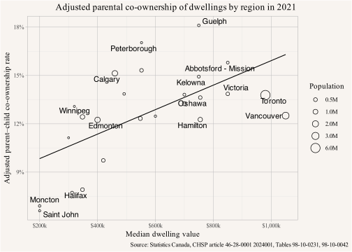
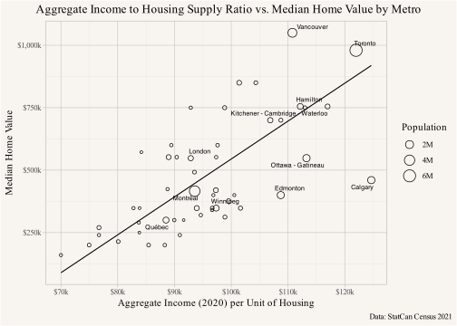
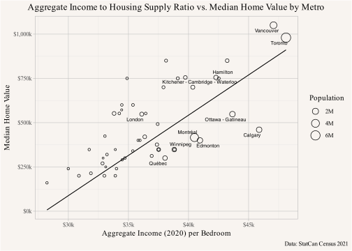
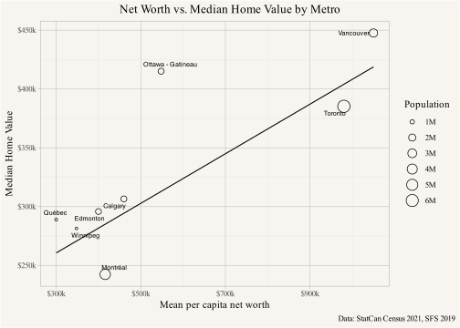
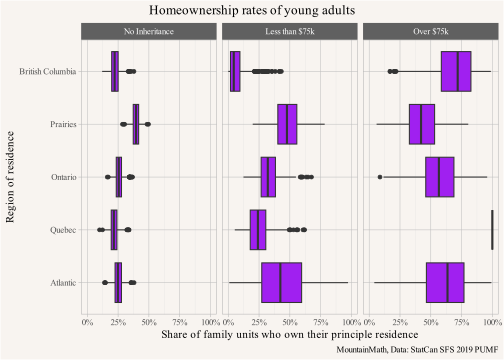

<p style="text-align:center;"><i>(Joint with Nathan Lauster and cross-posted at <a href="https://homefreesociology.com/2024/05/09/parental-help-in-property-ownership/" target="_blank">HomeFreeSociology</a>)</i></p>


Young adults are increasingly relying upon parental help to navigate Canada's difficult housing market. Here we have a look at how this manifests within co-ownership trends, as described by a recent CHSP release, with a special focus on variation across more and less expensive housing markets. We round this out with contextual data on other ways parents are helping and a brief consideration of how they all fit together.

The recent CHSP release on intergenerational housing outcomes in Canada [@intergenerational-housing-outomes-in-canada.2024] builds on the previous related report [@parents-and-children-in-the-canadian-housing-market.2023] to add some interesting data on parent-child co-ownership of housing across (much of) Canada. The sample includes children born in the 1990s able to be linked to their parents by tax records and assessed by property in 2021. In the regions included in CHSP about 17% of properties (1 in 6) owned by the sample (age 21-31) were co-owned by their parents. Of these, about half were owned by children who did not own any other homes while the parents also owned properties elsewhere. Based upon residential patterns ascertained by the study, most of this type of co-ownership (3 in 10 co-owned properties overall) likely represented parents assisting children by co-signing mortgages. Another third of co-owned properties were the only properties owned by children and parents, likely representing multigenerational households or facilitated inheritance plans. The remaining co-ownership cases include properties where the child owned more than one residence.

It's good to see this data, which quantifies the importance of family ties to property ownership within Canada. We have been quite interested in understanding how properties are used [@how-are-condos-used.2018; @basement-confidential-vancouver-s-informal-housing-stock.2021] and the interaction between housing supply, housing prices and rents, and impacts on household and family formation. [@tumbling-turnover.2022; @estimating-suppressed-household-formation.2022; @still-short-suppressed-households-in-2021.2022; @housing-outcomes.2023] Which is why we are excited about this release.

The kind of assistance parents provide by co-signing appears to be increasingly normal for Canadians, and parents also often help in other ways too, as noted by the study. We document this further below. But for immigrants whose parents did not come with them to Canada (not included in the sample studied), this kind of assistance has become increasingly fraught, penalized, or outright banned, as we've noted elsewhere [@housing_nationalism.2023], by Foreign Buyer Bans, related taxes, and surrounding rhetoric. Here we set this issue aside for the moment to explore the spatial variation in the present data.

As laid out in the CHSP article, the rates of parent-child co-ownership vary widely across metro areas, in a pattern highly correlated with home prices.


::: {.cell}

```{.r .cell-code}
tables <- read_html("https://www150.statcan.gc.ca/n1/pub/46-28-0001/2024001/article/00002-eng.htm") %>%
  html_table()

data <- tables[[2]]
n <- data[1,]
n[1]="Region"
data <- data |>
  setNames(n) |>
  slice(-1) |>
  filter(!grepl("^Note: ",Region)) |>
  mutate(`Median dwelling value (dollars)`=gsub(",","",`Median dwelling value (dollars)`) |> as.numeric(),
         `Parent–child co-ownership rate (percent)`=as.numeric(`Parent–child co-ownership rate (percent)`)/100)

regions <- list_census_regions("2021") |>
  filter(level=="CMA") |>
  mutate(Region=gsub(" \\(.+","",name)) |>
  select(Region,pop) |>
  bind_rows(tibble(Region="Ottawa - Gatineau (Ontario part)",pop=1135014)) |>
  mutate(Region=gsub(" / .+| - Quinte West","",Region))

pd <- data |>
  mutate(Region=gsub("–"," - ",Region)) |>
  left_join(regions,by="Region") 

shown_regions <- c("Halifax","Guelph","Abbotsford - Mission","Victoria","Oshawa","Kelowna",
                   "Moncton","Saint John","Peterborough",
                   filter(regions,pop>750000)$Region)

ggplot(pd,aes(x=`Median dwelling value (dollars)`,y=`Parent–child co-ownership rate (percent)`)) +
  geom_point(shape=21,aes(size=pop)) +
  geom_smooth(method="lm",se=FALSE,formula=y~x,colour="black",linewidth=0.5) +
  ggrepel::geom_text_repel(data=~filter(.,Region %in% shown_regions),
    aes(label=Region)) +
  scale_y_continuous(labels=scales::percent) +
  scale_size_continuous(labels=\(x)scales::comma(x,scale=10^-6,suffix="M"),breaks=c(500000,1000000,2000000,3000000,6000000)) +
  scale_x_continuous(labels=\(x)scales::dollar(x,scale=10^-3,suffix="k")) +
  labs(title="Parental co-ownership of dwellings by region in 2021",
       x="Median dwelling value",
       size="Population",
       y="Parent–child co-ownership rate",
       caption="Source: Statistics Canada, CHSP article 46-28-0001 2024001") 
```

::: {.cell-output-display}
{#fig-home-price-co-ownership fig-pos='H'}
:::
:::


This correlation is quite strong, but it is not clear how to interpret the data. The rate is parent co-owned properties divided by all owner properties for tracked adults (age 21-31) able to be linked to parents within the sample. There are a number of underlying processes that could drive the correlation. For instance:

-   In expensive markets parents may be more likely to help their children into ownership housing, driving up the numerator of the co-ownership rate.
-   In expensive markets young adults may be less likely to form households and those that do form households are less likely to be owners of their homes, driving down the denominator of the co-ownership rate.
-   Connected to the previous channel, in expensive markets young adults may be more likely to live with their parents, driving up the numerator of the co-ownership rate.
-   In expensive markets parents have experienced significant wealth appreciation in their homes and might add children on title for estate planning purposes at higher rates.
-   Home prices correlate strongly with incomes, and of course also with wealth, and parents in high home price markets may have more resources and thus be more able to help their children into ownership housing, driving up the numerator of the co-ownership rate.
-   Cultural differences in parent-child relations may vary by metro area in ways that correlate with home prices, reflecting varying preferences for multi-generational households for instance, driving up the numerator of the co-ownership rate.

These processes are difficult to disentangle, but for the purpose of interpreting how co-ownership varies across metro areas it's probably useful to look into the potential effect sizes of at least some of these channels. Unfortunately the CHSP data release does not break down the different ownership arrangements by metro area, which could have helped to disentangle some of this. But we can still take a look at potential impacts of some of these drivers.

# Suppressed (owner) household formation

We start with suppressed shares of young adults who are owners. This combines two processes, suppressed household formation [@estimating-suppressed-household-formation.2022; @still-short-suppressed-households-in-2021.2022] and changes in homeownership rates among households that did form. For this we take *young adults* to mean those aged 20 to 29 in 2021, so born between 1991 and 2001. That is a slightly different birth cohort than what was used in the CHSP report and is chosen to line up with readily available data. How does the proportion of young adults who own their own homes within a metro area vary by median dwelling value? 


::: {.cell}

```{.r .cell-code}
maintainers_2021 <- get_cansim_sqlite("98-10-0231") |>
  filter(`Structural type of dwelling (10)`=="Total - Structural type of dwelling",
         `Condominium status (3)`=="Total - Condominium status",
         `Household type including census family structure (16)`=="Total - Household type including census family structure",
         `Statistics (3C)`=="Number of private households") |>
  select(GeoUID,Age=`Age of primary household maintainer (15)`,Tenure=`Tenure (4)`,Value=VALUE) |>
  collect_and_close()

ages <- maintainers_2021 |> filter(!grepl("Total - ",Age)) |> pull(Age) |> unique()

all_2021 <- get_cansim_sqlite("98-10-0042") |>
  filter(`Gender (3)`=="Total - Gender",
         `Structural type of dwelling (9)`=="Total - Structural type of dwelling") |>
  select(GeoUID,Name=GEO,Age=`Age (20)`,Value=VALUE) |>
  collect_and_close() |>
  mutate(Year="2021") 

maintainer_data <- inner_join(all_2021 |> rename(age_count=Value),
           maintainers_2021 |> rename(maintainer_count=Value),
           by=c("GeoUID","Age")) 


dwelling_values <- get_census("2021",regions=list(C="01"),level="CMA",vectors=c(dw_value="v_CA21_4311",
                                                                                multi_gen="v_CA21_549")) |>
  mutate(Region=`Region Name` |> gsub(" \\([DBK]\\)$","",x=_) |> gsub(" / partie.+\\)$",")",x=_)) |>
  select(Region,dw_value,multi_gen,Households,Population)

all_data <- maintainer_data |>
  mutate(Region=gsub(" \\(CA\\).+| \\(CMA\\).+","",Name)) |>
  filter(Age %in% young_adult) |>
  filter(Tenure=="Owner") |>
  summarize(across(c(maintainer_count,age_count),sum),.by=c(GeoUID,Name,Region)) |>
  inner_join(pd,by="Region") |>
  inner_join(dwelling_values,by="Region") |>
  mutate(owner_share=maintainer_count/age_count) 

all_data |>
  ggplot(aes(y=owner_share,x=dw_value)) +
  geom_point(shape=21,aes(size=pop)) +
  geom_smooth(method="lm",se=FALSE,formula=y~x,colour="black",linewidth=0.5) +
  ggrepel::geom_text_repel(data=~filter(.,Region %in% shown_regions),
    aes(label=Region)) +
  scale_y_continuous(labels=scales::percent) +
  scale_size_continuous(labels=\(x)scales::comma(x,scale=10^-6,suffix="M"),breaks=c(500000,1000000,2000000,3000000,6000000)) +
  scale_x_continuous(labels=\(x)scales::dollar(x,scale=10^-3,suffix="k")) +
  labs(title="Homeownership of young adults by region in 2021",
       x="Median dwelling value",
       size="Population",
       y="Share of 20 to 29 year olds who are\nhousehold maintainers in owner households",
       caption="Source: StatCan Census 2021, Tables 98-10-0231, 98-10-0042") 
```

::: {.cell-output-display}
{#fig-home-price-owner-maintainer-rates fig-pos='H'}
:::
:::


This shows how owner-maintainer shares drop with increasing dwelling values. This is unsurprising, insofar as it becomes more difficult for young people to save up for a downpayment and service a mortgage when prices are higher. If we set median dwelling value across Canada to that of Moncton, we would expect to see a lot more young homeowners, boosting our denominators for rates of co-ownership with parents. If we further assume that most of the hypothetical owner households that would have formed if prices had been at Moncton levels would not have been co-owned with parents, we can "adjust" observed rates in @fig-home-price-co-ownership for the suppressed owner shares. The results of doing so are shown in @fig-home-price-co-ownership-adjusted-rates.


::: {.cell}

```{.r .cell-code}
owner_share_model <- lm(owner_share ~ dw_value,data=all_data)

all_data %>%
  mutate(predicted_owner_share=predict(owner_share_model,newdata=.),
         neutral_owner_share=predict(owner_share_model,newdata=mutate(.,dw_value=min(dw_value)))) |>
  mutate(adjustment_pp = (neutral_owner_share-predicted_owner_share)) |>
  mutate(adjustemnet_rate=1+adjustment_pp/owner_share) |> # translate pp incrase into rate increase
  mutate(adjusted_coonership_rate = `Parent–child co-ownership rate (percent)`/adjustemnet_rate) |>
  ggplot(aes(x=`Median dwelling value (dollars)`,y=adjusted_coonership_rate)) +
  geom_point(shape=21,aes(size=pop)) +
  geom_smooth(method="lm",se=FALSE,formula=y~x,colour="black",linewidth=0.5) +
  ggrepel::geom_text_repel(data=~filter(.,Region %in% shown_regions),
    aes(label=Region)) +
  scale_y_continuous(labels=scales::percent) +
  scale_size_continuous(labels=\(x)scales::comma(x,scale=10^-6,suffix="M"),breaks=c(500000,1000000,2000000,3000000,6000000)) +
  scale_x_continuous(labels=\(x)scales::dollar(x,scale=10^-3,suffix="k")) +
  labs(title="Adjusted parental co-ownership of dwellings by region in 2021",
       x="Median dwelling value",
       size="Population",
       y="Adjusted parent–child co-ownership rate",
       caption="Source: Statistics Canada, CHSP article 46-28-0001 2024001, Tables 98-10-0231, 98-10-0042") 
```

::: {.cell-output-display}
{#fig-home-price-co-ownership-adjusted-rates fig-pos='H'}
:::
:::


This significantly weakens the relationship originally observed in @fig-home-price-co-ownership, with lower coefficient and higher variance, suggesting that a good portion of the relationship may be driven by suppressed household formation and suppressed home ownership rates due to elevated prices. Put differently, imagine a distillery where alcohol represents co-owned properties. Co-ownership is present in all metro areas. But rising median values boil away more of the non-co-owned properties, reducing the denominator so that higher concentrations of co-owned properties are what remains leftover. This distilling effect doesn't account for all of the relationship between median dwelling values and co-ownership rates, but likely explains a lot of it.

# Inter-generational households

The changes in owner-maintainer rates are connected to, but do not account for, higher prices also driving up the share of inter-generational households. This impacts the numerator of co-ownership shares. To look at this we don't have data on age and tenure easily available, but we can still examine overall trends of the prevalence of multi-generational households by dwelling values across Canada.


::: {.cell}

```{.r .cell-code}
all_data |>
  ggplot(aes(y=multi_gen/Households,x=dw_value)) +
  geom_point(shape=21,aes(size=pop)) +
  geom_smooth(method="lm",se=FALSE,formula=y~x,colour="black",linewidth=0.5) +
  ggrepel::geom_text_repel(data=~filter(.,Region %in% shown_regions),
    aes(label=Region)) +
  scale_y_continuous(labels=scales::percent) +
  scale_size_continuous(labels=\(x)scales::comma(x,scale=10^-6,suffix="M"),breaks=c(500000,1000000,2000000,3000000,6000000)) +
  scale_x_continuous(labels=\(x)scales::dollar(x,scale=10^-3,suffix="k")) +
  labs(title="Multi-generational households vs dwelling values by region in 2021",
       x="Median dwelling value",
       size="Population",
       y="Share of multi-generational households",
       caption="Source: StatCan Census 2021") 
```

::: {.cell-output-display}
{#fig-inter-generational-households fig-pos='H'}
:::
:::


Moreso than when looking at suppressed households, culture also likely plays an important role here. That is, the propensity to live together with adult children (especially after they couple) really differs by immigration status and country of origin. On this broad view this indicates a potentially significant impact on numerators, but without better data on ownership and age it is difficult to estimate these effects. Again, finer data from CHSP on the breakdown of co-ownership types by region, especially if linked to broader census variables with information on relevant culture indicators, would be very helpful here.

# Incomes

Incomes are also an important factor in understanding the variation of dwelling prices. They may also predict the support parents are able to provide to children. A simple way to get at incomes' effects on prices is to aggregate incomes and divide by dwellings units. Aggregate incomes per dwelling unit generally predict dwelling values well, although supply elasticity and factors like overall attractiveness of a region also matter and impact the relationship, as does the relative quality and makeup of the housing stock.


::: {.cell}

```{.r .cell-code}
pd <- get_census("2021",region=list(C="01"),level="CMA",
           vectors=c(med_home_value="v_CA21_4311",income_base="v_CA21_602",average_income="v_CA21_605",
                     avg_hh_inc="v_CA21_915",avg_dw_value="v_CA21_4312",med_hh_inc="v_CA21_906",
                     b0="v_CA21_4245",b1="v_CA21_4246",b2="v_CA21_4247",b3="v_CA21_4248",b4="v_CA21_4249")) |>
  filter(!grepl("Ottawa",`Region Name`) | GeoUID=="505") |>
  filter(Population>=75000) |>
  mutate(Name=gsub(" \\(.+\\)$","",`Region Name`)) |>
  mutate(bedrooms=0.8*b0+b1+2*b2++3*b3+4*b4) |>
  mutate(aipd=average_income*income_base/Dwellings,
         aipb=average_income*income_base/bedrooms)

pd |>
  ggplot(aes(x=aipd,y=med_home_value)) +
  geom_point(shape=21,aes(size=Population)) +
  scale_x_continuous(labels=\(x)scales::dollar(x,scale=10^-3,suffix="k")) +
  scale_y_continuous(labels=\(x)scales::dollar(x,scale=10^-3,suffix="k")) +
  scale_size_continuous(labels=\(x)scales::comma(x,scale=10^-6,suffix="M")) +
  ggrepel::geom_text_repel(aes(label=Name),size=2.5,
                           data=~filter(.,Population>500000)) +
  geom_smooth(method="lm",formula=y~x,aes(weight=Population),se=FALSE,colour="black",linewidth=0.5) +
  labs(x="Aggregate Income (2020) per Unit of Housing",y="Median Home Value",
       title="Aggregate Income to Housing Supply Ratio vs. Median Home Value by Metro",
       caption="Data: StatCan Census 2021")
```

::: {.cell-output-display}
{#fig-aggregate-income-dwelling-values fig-pos='H'}
:::
:::


While this relationship is strong, it also looks heteroskedastic, and care should be taken when interpreting @fig-aggregate-income-dwelling-values. As pointed out above, the measure of dwellings is rather crude and does not account for quality. This may bias comparisons. For example Vancouver has a relatively high share of 1 bedroom apartments, whereas Calgary's dwelling stock is dominated by single-detached houses. We can account for some of this variation in type of dwelling stock by crudely estimating the number of bedrooms in each region and normalizing the income effect by that measure rather than dwelling units, as shown in @fig-aggregate-income-bedroom-dwelling-values.


::: {.cell}

```{.r .cell-code}
pd |>
  ggplot(aes(x=aipb,y=med_home_value)) +
  geom_point(shape=21,aes(size=Population)) +
  scale_x_continuous(labels=\(x)scales::dollar(x,scale=10^-3,suffix="k")) +
  scale_y_continuous(labels=\(x)scales::dollar(x,scale=10^-3,suffix="k")) +
  scale_size_continuous(labels=\(x)scales::comma(x,scale=10^-6,suffix="M")) +
  ggrepel::geom_text_repel(aes(label=Name),size=2.5,
                           data=~filter(.,Population>500000)) +
  geom_smooth(method="lm",formula=y~x,aes(weight=Population),se=FALSE,colour="black",linewidth=0.5) +
  labs(x="Aggregate Income (2020) per Bedroom",y="Median Home Value",
       title="Aggregate Income to Housing Supply Ratio vs. Median Home Value by Metro",
       caption="Data: StatCan Census 2021")
```

::: {.cell-output-display}
{#fig-aggregate-income-bedroom-dwelling-values fig-pos='H'}
:::
:::


Here we see that income chasing bedrooms predicts median home value more consistently than income per dwelling, highlighting the usefulness of incorporating some of the variation in type of housing stock. We note that this does not speak to the question of whether housing supply is adequate or not. Rather it simply measures how income chasing bedrooms relates to median values. More income boosts values. Could adding more bedrooms drive down values? Would developers add enough to do so? Measures that compare prices and rents to minimum profitable construction cost are more suitable to determine the adequacy of the housing supply. [@glaeser2018; @housing-targets.2023] Furthermore using aggregate incomes ignores distributional effects. [@first-time-buyer-lorenz-curves-revisited.2024] Nonetheless, the strong relationship highlights the importance of taking incomes into account when trying to understand drivers of parental co-ownership with children. More income can boost both dwelling values overall and the resources available for parents to assist children. Ideally accounting for the latter effects is done at the individual instead of the aggregate level.


# Wealth

Net worth is another factor that interacts with home values, although the direction of causation remains more ambiguous than for incomes. Net worth increases housing consumption, but rising home values also increase net worth. Indeed, housing is the largest source of wealth for most owner-occupiers of dwellings. And owner-occupied housing can also serve as collateral for further investments - including for parents looking to help children buy their own dwellings. The SFS has data on net worth, although the level of geographic detail is limited and only a handful of metro areas are broken out in standard release data.


::: {.cell}

```{.r .cell-code}
sfs_data <- get_cansim("11-10-0049") |>
  filter(nchar(GeoUID)==3,
         `Assets and debts`=="Net worth (total assets less total debt)",
         Statistics=="Total values",
         `Confidence intervals`=="Estimate",
         `Net worth quintiles`=="Total, all net worth quintiles",
         REF_DATE=="2019")

sfs_data |>
  mutate(Region=gsub(", .+","",GEO) |> gsub("-"," - ",x=_)) |>
  select(Region,net_worth=val_norm) |>
  inner_join(dwelling_values,by="Region") |>
ggplot(aes(x=dw_value,y=net_worth/Population)) +
  geom_point(shape=21,aes(size=Population)) +
  scale_x_continuous(labels=\(x)scales::dollar(x,scale=10^-3,suffix="k")) +
  scale_y_continuous(labels=\(x)scales::dollar(x,scale=10^-3,suffix="k")) +
  scale_size_continuous(labels=\(x)scales::comma(x,scale=10^-6,suffix="M")) +
  ggrepel::geom_text_repel(aes(label=Region),size=2.5,
                           data=~filter(.,Population>500000)) +
  geom_smooth(method="lm",formula=y~x,aes(weight=Population),se=FALSE,colour="black",linewidth=0.5) +
  labs(x="Mean per capita net worth",y="Median Home Value",
       title="Net Worth vs. Median Home Value by Metro",
       caption="Data: StatCan Census 2021, SFS 2019")
```

::: {.cell-output-display}
{#fig-net-worth-dwelling-values fig-pos='H'}
:::
:::


# Taxation

Differences in wealth may also be related to various tax strategies involving co-ownership. These include estate planning in a broad sense, where children may be put on title as vehicle to pass along properties and avoid probate fees and have implications on other taxes, e.g. capital gains. The value of estate planning strategies, and thus its application, correlates with dwelling values and may add skew to cross-metro comparisons.

Property tax rates also vary by metro area. These affect the affordability of home ownership and can introduce significant bias to the relationship between incomes and dwelling values if ignored. [@first-time-buyer-lorenz-curves-revisited.2024] We don't have good comprehensive data on property taxes at the metro level, but testing on the few larger metros where we have data, at least for the central cities, suggests that including property taxes reduces variance and lowers the slope of the relation in @fig-aggregate-income-dwelling-values. This is important insofar as, returning to a theme, income and wealth can affect both dwelling values and parental resources for assisting children with co-ownership.


Overall we don't have quite enough contextual information to fully interpret the strong relationship between dwelling value and rates of parent-child co-ownership of properties we see in [@intergenerational-housing-outomes-in-canada.2024]. But we can see a variety of potential mechanisms by which it might work. It would be great to join this up with the other information we have about how parents assist their children in homebuying. Do we see the same strong relationship between parental assistance with downpayments and median dwelling value? With inheritance and median dwelling value? As we'll see, the data so far is pretty limited.


# Downpayment financing


::: {.cell}

```{.r .cell-code}
sfs_2019 <-get_pumf("SFS",pumf_version = "2019",layout_mask="EFAM_PUMF") %>%
  label_pumf_data() %>%
  rename(PEFAMID=`Family unit: economic families and persons not in economic families.`,
         PWEIGHT=`Survey weights - PUMF`)

sfs_bsweights <- get_pumf("SFS",pumf_version = "2019",layout_mask="bsweights",file_mask="BSWEIGHTS")

first_upcase <- function(s){
  lapply(s,function(d)paste0(toupper(substr(d,1,1)),substr(d,2,nchar(d)))) |>
    unlist()
}
```
:::


The Survey of Financial Security (SFS) has information about inheritances as well as how home owners financed their downpayments. Unfortunately this data source does not break down co-ownership of properties with parents. Moreover, the SFS PUMF only has broad geographic grouping and does not allow us to identify metro areas. We can break out provinces for BC, Ontario, and Quebec, compared to Prairie and Atlantic regions. This lumps together rural areas with the large metros in provinces with the highest dwelling values, likely reducing a good chunk of any effect there may be. But we can still compare how young adults financed their downpayment in different regions, and also get a look at how downpayments may be financed by several different sources.


::: {.cell}

```{.r .cell-code}
sfs_2019 %>%
  mutate(region=case_when(`Region of residence of the family unit` %in% c("British Columbia" ,"Ontario") ~ "BC/ON",
                          TRUE ~ "Other")) |>
  mutate(region=`Region of residence of the family unit`) |>
  left_join(sfs_bsweights %>% select(-PWEIGHT),by="PEFAMID") %>%
  filter(`Principal residence ownership status.` %in% c("Own without mortgage", "Own with mortgage")) %>%
  filter(`Age of the major income earner in the family unit.` %in% young_adult) |>
  pivot_longer(matches("Down Payment",ignore.case = FALSE),names_to="DP_type",values_to = "DP_value") %>%
  group_by(DP_type,DP_value,region) %>%
  summarise(across(matches("PWEIGHT|^BSW_"),sum),.groups="drop") %>%
  pivot_longer(matches("PWEIGHT|^BSW_"),names_to="Weight") %>%
  filter(DP_value!="Valid skip") %>%
  group_by(Weight,  DP_type,region) %>%
  mutate(share=value/sum(value)) %>%
  filter(DP_value=="Yes") %>%
  mutate(DP_type=gsub("Down Payment - ","",DP_type) |> first_upcase()) |>
  mutate(DP_type=factor(DP_type,levels=c("Money in bank account",
                                         "Previous home",
                                         "Investments",
                                         "Borrowing",
                                         "Other source"))) |>
  ggplot(aes(y=fct_rev(DP_type),
             fill=region,
             x=share)) +
  geom_boxplot() +
  scale_x_continuous(labels=scales::percent) +
  theme(legend.position = "bottom") +
  labs(title="How young adult owner-occupiers financed their down payment",
       y="Source for downpayment", fill="Region",
       x="Share of owner-occupied homes homes",
       caption="MountainMath, Data: StatCan SFS 2019 PUMF")
```

::: {.cell-output-display}
{#fig-downpayment-sfs fig-pos='H'}
:::
:::


The categories for source of downpayment remain rough. Here *investments* include RRSP or TFSA withdrawals or sale of other assets, borrowing can be from friends and family as well as from financial institutions, and *other* includes inheritances and gifts. We can get glimpses of some of the variation, but nothing solid. Overall, the SFS is unfortunately not thick enough to allow for useful differentiation between regions for young adult owner households.

# Inheritance

Money is fungible, and even if inheritance does not directly flow into a downpayment, it offers a larger financial cushion that can flow indirectly into a downpayment. Looking at homeownership rates by inheritance status and age, those who do receive inheritances - especially large inheritances - at a young age are much more likely to be owners than their non or lower inheritance receiving counterparts.


::: {.cell}

```{.r .cell-code}
inheritance_share <- sfs_2019 %>%
  mutate(Tenure=case_when(`Principal residence ownership status.` %in% c("Own without mortgage", "Own with mortgage") ~ "Owner",
                          `Principal residence ownership status.`=="Do not own" ~ "Renter",
                          TRUE ~ "NA")) %>%
  filter(Tenure!="NA") %>%
  left_join(sfs_bsweights %>% select(-PWEIGHT),by="PEFAMID") %>%
  mutate(have_inheritance=case_when(is.na(`Total value of inheritances received in 2016 constant dollars`) | 
           `Total value of inheritances received in 2016 constant dollars`==0 ~ "No Inheritance",
           `Total value of inheritances received in 2016 constant dollars`<75000 ~ "Less than $75k",
           TRUE ~ "Over $75k") %>%
           factor(levels=c("No Inheritance","Less than $75k","$50k to $100k","Over $75k"))) %>%
  mutate(Age=`Age of the major income earner in the family unit.`) %>%
  group_by(Tenure,Age,have_inheritance) %>%
  summarise(across(matches("PWEIGHT|BSW_"),sum),.groups="drop") %>%
  pivot_longer(matches("^BSW_"),names_to="Weight") %>%
  group_by(have_inheritance,Age,Weight) %>%
  mutate(share=value/sum(value))


inheritance_share %>%
  filter(Tenure=="Owner") %>%
ggplot(aes(x=Age,y=share)) +
  geom_boxplot(fill="purple") +
  coord_flip() +
  facet_wrap(~have_inheritance) +
  scale_y_continuous(labels=scales::percent) +
  labs(title="Homeownership rates",
       y="Share of family units who own their principle residence",
       x="Age of the major income earner in the family unit",
       caption="MountainMath, Data: StatCan SFS 2019 PUMF")
```

::: {.cell-output-display}
{#fig-homeownership-rates-by-inherticance-status-age fig-pos='H'}
:::
:::


We can break these patterns out by region, as per above, and also focus in on young adults. Here we see that the effect of receiving a large inheritance is fairly uniform, offering a large boost to home ownership rates. But there is some variation, with lower cost Prairie and Atlantic provinces showing a substantial effect for even lower value inheritances, while for Quebec the effects of higher inheritances are much stronger than elsewhere.


::: {.cell}

```{.r .cell-code}
inheritance_share <- sfs_2019 %>%
  mutate(Tenure=case_when(`Principal residence ownership status.` %in% c("Own without mortgage", "Own with mortgage") ~ "Owner",
                          `Principal residence ownership status.`=="Do not own" ~ "Renter",
                          TRUE ~ "NA")) %>%
  filter(Tenure!="NA") %>%
  filter(`Age of the major income earner in the family unit.` %in% young_adult) %>%
  left_join(sfs_bsweights %>% select(-PWEIGHT),by="PEFAMID") %>%
  mutate(have_inheritance=case_when(is.na(`Total value of inheritances received in 2016 constant dollars`) | 
           `Total value of inheritances received in 2016 constant dollars`==0 ~ "No Inheritance",
           `Total value of inheritances received in 2016 constant dollars`<75000 ~ "Less than $75k",
           TRUE ~ "Over $75k") %>%
           factor(levels=c("No Inheritance","Less than $75k","$50k to $100k","Over $75k"))) %>%
  mutate(`Region of residence of the family unit`) %>%
  group_by(Tenure,`Region of residence of the family unit`,have_inheritance) %>%
  summarise(across(matches("PWEIGHT|BSW_"),sum),.groups="drop") %>%
  pivot_longer(matches("^BSW_"),names_to="Weight") %>%
  group_by(have_inheritance,`Region of residence of the family unit`,Weight) %>%
  mutate(share=value/sum(value))


inheritance_share %>%
  filter(Tenure=="Owner") %>%
ggplot(aes(x=`Region of residence of the family unit`,y=share)) +
  geom_boxplot(fill="purple") +
  coord_flip() +
  facet_wrap(~have_inheritance) +
  scale_y_continuous(labels=scales::percent) +
  labs(title="Homeownership rates of young adults",
       y="Share of family units who own their principle residence",
       x="Region of residence",
       caption="MountainMath, Data: StatCan SFS 2019 PUMF")
```

::: {.cell-output-display}
{#fig-homeownership-rates-by-inherticance-status fig-pos='H'}
:::
:::


Inheritance of course strongly correlates with parental (and grand-parental) wealth, which can boost homeownership through other channels, so the difference in frequencies observed in @fig-homeownership-rates-by-inherticance-status-age and @fig-homeownership-rates-by-inherticance-status should not be interpreted as the direct effect of inheritance but viewed as at least partially reflecting broader effects of parental wealth.

# Conclusion

Overall, it's not surprising that parents are attempting to help their adult children. This help can be crucial to young adults' ability to purchase a home, especially in tight housing markets. Moreover, property owning parents have often benefited from the tightness of housing markets, accruing great wealth through home equity. In this sense, parental help can contribute to intergenerational equity. At the same time, not everyone has parents willing or able to help. This can drive inequality within generations.

Either way, it's great to get a high level look at some of the mechanisms by which parental help might be operating. These include direct assistance, as we see with co-ownership, including co-signing mortgages and helping with downpayments, as well as indirect assistance, as we see with inheritances. The CHSP report adds important information on the prevalence of co-ownership between parents and children, confirming this can operate as an important path for parental help. It even helps identify how often this represents co-signing. 

What about the strong correlation between parental co-ownership and median housing value? What drives the relationship? In general, mechanisms suggest this relationship may be incidental (e.g. fewer children becoming owners in high cost markets overall, leaving those with parental help overrepresented) or adaptive (e.g. with more parents motivated to help children in higher cost markets). But we need more context and data to better understand which mechanisms are operating and where. To understand this better it would be nice to have data tables on co-ownership by metro area, age, and co-ownership type, as well as where children and parents live in relation to co-owned properties. Together with some measure of confidence intervals on these estimates. Determining all of this from administrative data has its pitfalls. At the end of the day it will be difficult to understand the underlying processes without access to individual level data, and hopefully there will be deeper research from CHSP on these questions.

While mechanisms linking parental help and dwelling values appear to be mostly incidental or adaptive, it is possible the relationship also becomes recursive; where parental help simply introduces more money into markets chasing the same number of dwelling units or bedrooms. In this case, more parental help results in a further rise in housing values, in much the same way we see income working in @fig-aggregate-income-dwelling-values and @fig-aggregate-income-bedroom-dwelling-values. How would we break this cycle? We probably don't want to forbid parents from helping their children. What we need is to add a lot more housing, so any additional money parents are adding is chasing more dwelling units and bedrooms. 

In effect, supply elasticity - insuring the supply of dwellings and bedrooms keeps pace with the money chasing it - is key to making sure parental help remains a positive force in the market. Here we see echoes of many other phenomena, like investment in rental housing, which can look like potential threats to market affordability, but tend to obscure the underlying issue, which is that we're not building enough housing relative to the people who want it and all the money being spent in chasing it.

We'll put in our usual plug here for investing in housing subsidies and non-market housing, which can help those without high incomes or parental assistance. But we also offer the reminder that removing housing from market distribution doesn't solve underlying shortage issues (see, for instance, the recent Guardian piece noting 18 to 19 year waits to get into the sizable social housing stock in large Dutch cities [@guardian-netherlands-housing-waitlist.2024]).

When it comes to parental help for children in tight housing markets, there are lots of mechanisms by which it can work, and most of them seem fine, but however they're working we should make sure policy responds by enabling and encouraging a lot more supply to loosen those markets up again.

As usual, the code for this post is [available on GitHub](https://github.com/mountainMath/mountain_doodles/blob/main/posts/2024-05-09-parental-help-in-property-ownership/index.qmd) for anyone to reproduce or adapt for their own purposes.


<details>

<summary>Reproducibility receipt</summary>


::: {.cell}

```{.r .cell-code}
## datetime
Sys.time()
```

::: {.cell-output .cell-output-stdout}

```
[1] "2024-05-09 18:01:48 PDT"
```


:::

```{.r .cell-code}
## repository
git2r::repository()
```

::: {.cell-output .cell-output-stdout}

```
Local:    main /Users/jens/R/mountain_doodles
Remote:   main @ origin (https://github.com/mountainMath/mountain_doodles.git)
Head:     [cf74463] 2024-05-05: fix nav bar code hover colour
```


:::

```{.r .cell-code}
## Session info
sessionInfo()
```

::: {.cell-output .cell-output-stdout}

```
R version 4.4.0 (2024-04-24)
Platform: aarch64-apple-darwin20
Running under: macOS Sonoma 14.4.1

Matrix products: default
BLAS:   /Library/Frameworks/R.framework/Versions/4.4-arm64/Resources/lib/libRblas.0.dylib 
LAPACK: /Library/Frameworks/R.framework/Versions/4.4-arm64/Resources/lib/libRlapack.dylib;  LAPACK version 3.12.0

locale:
[1] en_US.UTF-8/en_US.UTF-8/en_US.UTF-8/C/en_US.UTF-8/en_US.UTF-8

time zone: America/Vancouver
tzcode source: internal

attached base packages:
[1] stats     graphics  grDevices utils     datasets  methods   base     

other attached packages:
 [1] canpumf_0.2.0   cansim_0.3.17   cancensus_0.5.7 rvest_1.0.4    
 [5] lubridate_1.9.3 forcats_1.0.0   stringr_1.5.1   dplyr_1.1.4    
 [9] purrr_1.0.2     readr_2.1.5     tidyr_1.3.1     tibble_3.2.1   
[13] ggplot2_3.5.1   tidyverse_2.0.0

loaded via a namespace (and not attached):
 [1] gtable_0.3.5              xfun_0.43                
 [3] ggrepel_0.9.5             lattice_0.22-6           
 [5] tzdb_0.4.0                bitops_1.0-7             
 [7] vctrs_0.6.5               tools_4.4.0              
 [9] generics_0.1.3            curl_5.2.1               
[11] parallel_4.4.0            RSQLite_2.3.6            
[13] fansi_1.0.6               blob_1.2.4               
[15] pkgconfig_2.0.3           Matrix_1.7-0             
[17] dbplyr_2.5.0              lifecycle_1.0.4          
[19] git2r_0.33.0              compiler_4.4.0           
[21] farver_2.1.1              munsell_0.5.1            
[23] mountainmathHelpers_0.1.4 codetools_0.2-20         
[25] htmltools_0.5.8.1         RCurl_1.98-1.14          
[27] yaml_2.3.8                pillar_1.9.0             
[29] crayon_1.5.2              cachem_1.0.8             
[31] nlme_3.1-164              tidyselect_1.2.1         
[33] digest_0.6.35             stringi_1.8.4            
[35] reshape2_1.4.4            labeling_0.4.3           
[37] splines_4.4.0             fastmap_1.1.1            
[39] grid_4.4.0                colorspace_2.1-0         
[41] cli_3.6.2                 magrittr_2.0.3           
[43] utf8_1.2.4                withr_3.0.0              
[45] scales_1.3.0              bit64_4.0.5              
[47] timechange_0.3.0          rmarkdown_2.26           
[49] httr_1.4.7                bit_4.0.5                
[51] hms_1.1.3                 FinCal_0.6.3             
[53] memoise_2.0.1             evaluate_0.23            
[55] knitr_1.46                mgcv_1.9-1               
[57] rlang_1.1.3               Rcpp_1.0.12              
[59] glue_1.7.0                DBI_1.2.2                
[61] xml2_1.3.6                rstudioapi_0.16.0        
[63] vroom_1.6.5               jsonlite_1.8.8           
[65] plyr_1.8.9                R6_2.5.1                 
```


:::
:::


</details>


