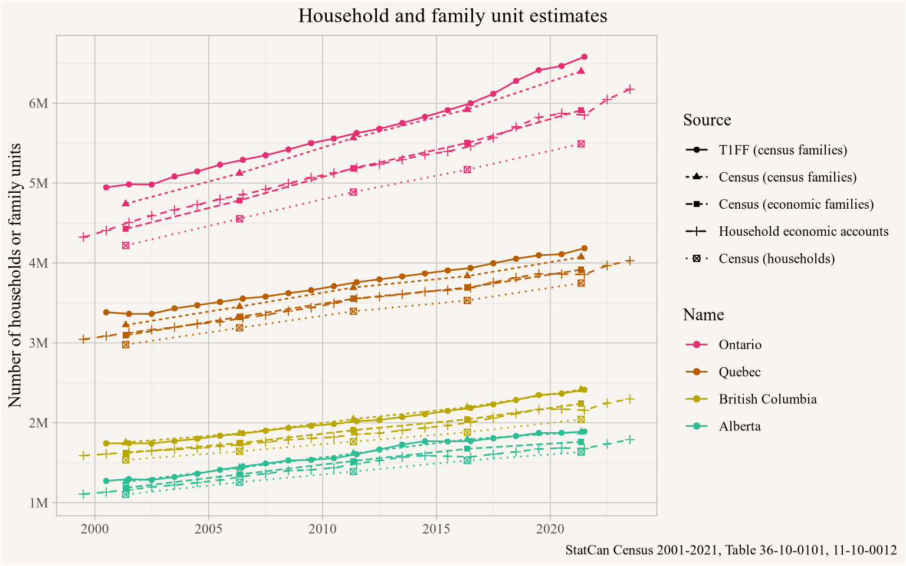
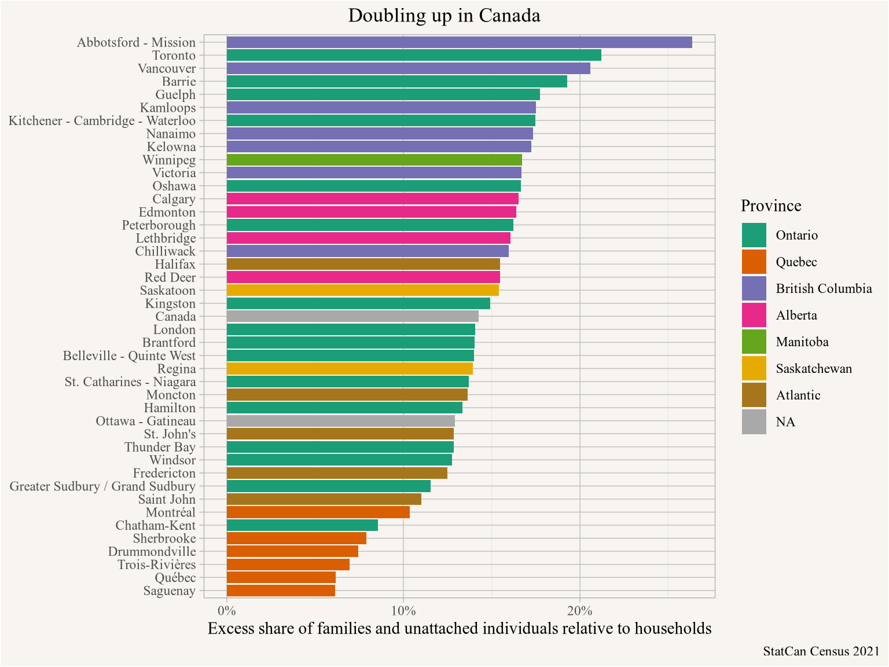
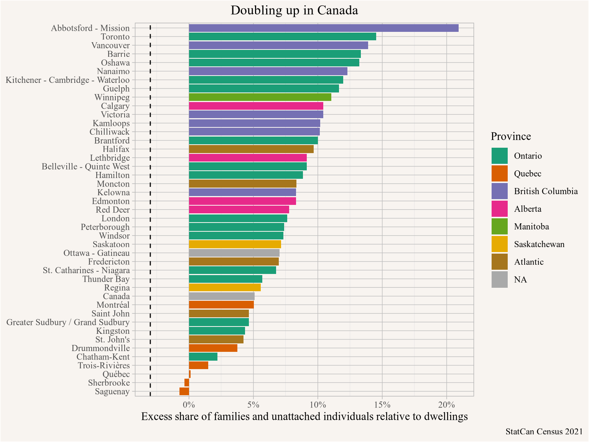
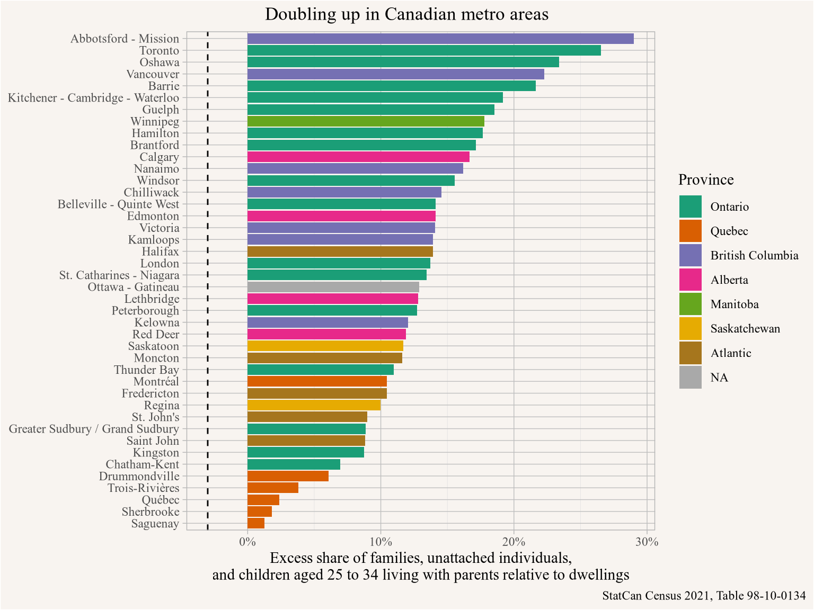

<p style="text-align:center;"><i>(Joint with Nathan Lauster and cross-posted at <a href="https://homefreesociology.com/2024/06/04/doubling-up-distinguishing-families-and-households/" target="_blank">HomeFreeSociology</a>)</i></p>


The concepts of *family* and *household* frequently get mixed up in the broader housing discourse. We have attempted to explain how these concepts differ, their various statistical constructions, and why it matters in the past. But these explanations can quickly turn quite abstract, so we wanted to complement them by talking about *doubling up*. This is a very simple way of demonstrating why families and households should not be viewed as interchangeable. We're also hoping to provide an important reminder that households are malleable and should not be used as the basic unit to analyze housing needs.


# Households

In Canadian data [households are generally defined as](https://www12.statcan.gc.ca/census-recensement/2021/ref/dict/az/definition-eng.cfm?ID=households-menage007) "a person or group of persons who occupy the same dwelling and do not have a usual place of residence elsewhere in Canada or abroad." In short, a household is just an occupied dwelling unit. This is a very broad definition, and includes a wide range of living arrangements, as explained in detail previously. [@what-s-a-household.2017; @housing-outcomes.2023]

There are specific cases where we can find different definitions of household. In particular, the household concept in the National Household Economic Accounts series from Statistics Canada [uses the OECD definition of households](https://www150.statcan.gc.ca/n1/pub/13-607-x/2016001/926-eng.htm) that only counts people as living in the same household if they share some non-housing expenses, for example for food and transportation. Here more than one household can share the same dwelling. We have looked into the difference between these two concepts before. [@first-peek-at-population-and-household-data-during-covid-caveats.2021]

# Families (and unattached indvididuals) {#sec-families}

To make things complicated, Statistics Canada also has several definitions of family, in particular that of [*economic family*](https://www12.statcan.gc.ca/census-recensement/2021/ref/dict/az/Definition-eng.cfm?ID=fam011) and of [*census family*](https://www12.statcan.gc.ca/census-recensement/2021/ref/dict/az/Definition-eng.cfm?ID=fam004). By definition, everyone identified within a census family is also part of an economic family, but the reverse may not be true (e.g. a two-person household with two siblings living together would qualify as an economic family, but not a census family). Either type of family is a subset of a household, but households may contain several families, or additionally house other non-family members, or consist entirely of non-family members. As a corollary to this, census or economic families can occupy at most one dwelling unit.[^1]

[^1]: This relates to the [usual place of residence concept](https://www12.statcan.gc.ca/census-recensement/2021/ref/dict/az/Definition-eng.cfm?ID=pop126#) that will count family members who temporarily live elsewhere, be it for work or for study purposes, at their *usual place of residence* instead of their current place of residence where they are counted as *temporarily present persons*.

# Datasets

Families and households are also defined differently across different datasets, and there are also some variations within datasets over time.[^2] The Census attempts to capture all individuals in Canada at a specific point in time, the "Census day" in the second week of May, by tracking possible residences, enabling the division of residents into households and families by response. Tax data attempts to capture individuals through tax-filings, assembling them into households and families over the tax year by addresses around April (tax filing day) in the following year, and cross-referenced exemptions claimed. Economic Accounts data draws upon modelling with several inputs. All are known to have undercount issues, but in different ways. We have looked at these coverage issues in detail before. [@first-peek-at-population-and-household-data-during-covid-caveats.2021] The T1FF taxfiler data draws upon the Census Family concept, while the Economic Accounts match up to the OECD Household concept.

[^2]: We'll mostly set historical variations in definitions aside, but see [Census Reference Materials](https://www12.statcan.gc.ca/census-recensement/2021/ref/98-500/002/98-500-x2021002-eng.cfm) for details. Keeping track of these changes can be consequential for making historical comparisons.

# Comparing different ways to count households and families

So how do these different conceptualizations of households and families stack up? We can compare different concepts across different data sources. National Economic Accounts data is only available at the provincial geography, so that's what we choose as the basis of comparison.


::: {.cell}

```{.r .cell-code}
hec_data <- get_cansim_sqlite("36-10-0101",auto_refresh = TRUE) %>% 
  collect_and_normalize(disconnect = TRUE)


census_households <- c("CA01","CA06","CA11","CA16","CA21") %>%
  lapply(function(ds) 
    get_census(ds,regions=list(PR=c("48","59","24","35"))) %>%
      mutate(Year=paste0("20",substr(ds,3,4)))) %>%
  bind_rows() %>%
  select(Name=`Region Name`,GeoUID,Year,Households,Dwellings) %>%
  mutate(Name=gsub("| \\/.+$| \\(.+$","",Name)) %>%
  group_by(Name) %>%
  mutate(Change=(Households/lag(Households,order_by = Year))^(1/5))

t1ff <- get_cansim_sqlite("11-10-0012",auto_refresh = TRUE) %>%
  filter(GEO %in% c("Ontario","Quebec","Alberta","British Columbia"),
         `Age of older adult`=="Total all ages",
         `Family income`=="All income groups",
         `Family type` %in% c("Couple families","Lone-parent families","Persons not in census families")) %>%
  collect_and_normalize(disconnect = TRUE) %>%
  group_by(Year=REF_DATE,Name=GEO) %>%
  summarize(Households=sum(val_norm),.groups="drop")


ef <-  list("CA21"=c(fam="v_CA21_989",ind="v_CA21_1001"),
           "CA16"=c(fam="v_CA16_4993",ind="v_CA16_5005"),
           "CA11"=c(fam="v_CA11N_2455",ind="v_CA11N_2479"),
           "CA06"=c(fam="v_CA06_1729",ind="v_CA06_1829"),
           "CA01"=c(fam="v_CA01_1609",ind="v_CA01_1613"))


cf <- list("CA21"=c(fam="v_CA21_499",ind="v_CA21_531"),
           "CA16"=c(fam="v_CA16_484",ind="v_CA16_501"),
           "CA11"=c(fam="v_CA11F_110",ind="v_CA11F_148"),
           "CA06"=c(fam="v_CA06_50",ind="v_CA06_86"),
           "CA01"=c(fam="v_CA01_53",ind="v_CA01_84"))

census_families <- c("CA01","CA06","CA11","CA16","CA21") %>%
  lapply(function(ds){
    get_census(ds,regions=list(PR=c("48","59","24","35")),vectors=cf[[ds]]) %>%
      mutate(Year=paste0("20",substr(ds,3,4)))
    }) %>%
  bind_rows() %>%
  select(Name=`Region Name`,GeoUID,Year,Households,fam,ind) %>%
  mutate(Name=gsub("| \\/.+$| \\(.+$","",Name)) %>%
  mutate(Households=fam+ind) |>
  group_by(Name) %>%
  mutate(Change=(Households/lag(Households,order_by = Year))^(1/5)) |>
  mutate(Source="Census (census families)")

economic_families <- c("CA01","CA06","CA11","CA16","CA21") %>%
  lapply(function(ds){
    get_census(ds,regions=list(PR=c("48","59","24","35")),vectors=ef[[ds]]) %>%
      mutate(Year=paste0("20",substr(ds,3,4)))
    }) %>%
  bind_rows() %>%
  select(Name=`Region Name`,GeoUID,Year,Households,fam,ind) %>%
  mutate(Name=gsub("| \\/.+$| \\(.+$","",Name)) %>%
  mutate(Households=fam+ind) |>
  group_by(Name) %>%
  mutate(Change=(Households/lag(Households,order_by = Year))^(1/5)) |>
  mutate(Source="Census (economic families)")


pd <- bind_rows(hec_data %>% 
                  filter(grepl(", households",`Socio-demographic characteristics`),
                         grepl("Alberta|British|Ontario|Quebec",`Socio-demographic characteristics`),
                         Quintile=="All quintiles") %>%
                  group_by(`Socio-demographic characteristics`) %>%
                  mutate(Change=val_norm/lag(val_norm,order_by = Date))  %>% 
                  mutate(Year=strftime(Date,"%Y")) %>%
                  select(Name=`Socio-demographic characteristics`,Households=val_norm,Change,Year,Date) %>%
                  mutate(Name=gsub(", households","",Name),
                         Source="Household economic accounts"),
                census_households %>% 
                  mutate(Source="Census (households)",
                         Date=as.Date(paste0(Year,"-05-10"))),
                t1ff %>% mutate(Source="T1FF (census families)",
                              Date=as.Date(paste0(Year,"-07-01"))),
                census_families |> mutate(Date=as.Date(paste0(Year,"-05-10"))),
                economic_families |> mutate(Date=as.Date(paste0(Year,"-05-10")))) |>
    mutate(Source=factor(Source,levels=c("Census (households)","Household economic accounts",
                                         "Census (economic families)","Census (census families)",
                                         "T1FF (census families)"))) |>
  mutate(Name=factor(Name,levels=c("Ontario","Quebec","British Columbia","Alberta")))


ggplot(pd,aes(x=Date,y=Households,colour=Name,
             group=interaction(Name,Source),
             shape=fct_rev(Source),linetype=fct_rev(Source))) +
  geom_point() +
  scale_y_continuous(labels=function(d)scales::comma(d,scale=10^-6,suffix="M")) +
  scale_colour_manual(values=sanzo::quads$c252) +
  geom_line() +
  labs(title="Household and family unit estimates",
       y="Number of households or family units",
       x=NULL,
       linetype="Source",
       shape="Source",
       caption="StatCan Census 2001-2021, Table 36-10-0101, 11-10-0012")
```

::: {.cell-output-display}
{#fig-households-families-timeline-comparison width=768}
:::
:::


@fig-households-families-timeline-comparison shows how these different sources compare over time at the provincial level. As expected, there are more census family units than economic families or OECD households, and more OECD households than census households. There are also generally more T1FF census family units than seen in the Census, though this varies by province.^[This tracks with T1FF estimates generally running a little higher than census estimates. Variations from T1FF to Census may reflect in part the later date benchmarking of T1FF data, but can also be determined by varying coverage rates, see [more details from Statistics Canada](https://www150.statcan.gc.ca/n1/pub/72-212-x/2023001/sect1-eng.htm)]. We can compare how varying estimates of families and household compare to the underlying estimate for number of dwellings, keeping in mind that households, by definition, cannot exceed dwellings.


::: {.cell}

```{.r .cell-code}
pd |>
  filter(Year %in% seq(2001,2021,5),
         Source != "Household economic accounts" | strftime(Date,"%m")=="07") %>%
  left_join((.) |> filter(Source=="Census (households)") |> select(Name,Year,CensusDwellings=Dwellings),
            by=c("Name","Year")) |>
  mutate(ratio=Households/CensusDwellings) |>
ggplot(aes(x=Year,y=ratio-1,
             fill=fct_rev(Source))) +
  geom_bar(stat="identity",position="dodge") +
  scale_y_continuous(labels=scales::percent) +
  scale_fill_manual(values=MetBrewer::met.brewer("Egypt",5)) +
  facet_wrap(~Name)+
  labs(title="Household and family unit estimates in excess of census dwelling counts",
       y="Excess percentage over census dwelling counts",
       x=NULL,
       fill="Source",
       caption="StatCan Census 2001-2021, Table 36-10-0101, 11-10-0012")
```

::: {.cell-output-display}
{#fig-households-families-ratio-comparison width=768}
:::
:::


For census years @fig-households-families-ratio-comparison takes the dwelling counts as a baseline and checks how these measures of households and families and unattached individuals differ from the census dwelling counts. There are differences in the timing during the year these estimates are taken, which may cause some variation. But overall we still get a good overview of how these measures differ, and a pointer toward how simple metrics that compare households to dwellings might fall short.


# Metro level data

Housing is inherently local, so it's useful to take these estimates to the metro level. The Household Economic Accounts don't break down their estimates at the metro level, so we will have to drop the estimates of OECD households. Moreover, metro areas change over time which makes clean temporal comparisons more complicated, and we will skip historical variation in the following analysis by focusing in on data from the 2021 Census, with the understanding that this misses census under-counts. This is also the most recent data available. The T1FF data for 2022 will become available later this summer, but isn't out yet. Sticking with the census has the added advantage of providing ready dwelling and household estimates.

## Families (and unattached individuals) vs households

A simple measure of the difference between family units and households is the ratio of families and unattached individuals to households. As [discussed above](#sec-families) this ratio can't be less than 1 since by census definition no family unit can live in more than one household. This ratio measures the amount of *doubling up* in a region; i.e. how many family units are sharing residence where we might expect them not to?

Families may also encode some kinds of doubling up, for example adult children still living with parents are generally counted as being part of the census family. Families may also use more than one dwelling unit, for example when family members temporarily occupy dwelling units in other jurisdictions for work purposes. We set these issues aside for now, but will revisit adult children living with parents later.


::: {.cell}

```{.r .cell-code}
census_family_children <- get_cansim_sqlite("98-10-0134") |>
  filter(GEO=="Canada",
         `Gender (3a)`=="Total - Gender",
         `Household type of person (10)`=="Total - Household type of person",
         `Census family status and household living arrangements (11)`=="Children in census families") |>
  collect_and_normalize(disconnect=TRUE) |>
  select(GeoUID,GEO,Year=`Census year (3)`,Age=`Age group (11)`,Value=VALUE) |>
  filter(Age %in% c("25 to 34 years", "35 to 44 years"))

doubling_data_canada <- get_census("2021",regions=list(C="01"),
                            vectors=c(Families="v_CA21_499",Individuals="v_CA21_531"))
```
:::


Importantly, this is not meant to be a prescriptive measure. From the perspective of people living together, *doubling up* may be desirable, tolerated, or stressful. There's nothing to keep people from living together when it's desirable for them to do so. But for those at best tolerating *doubling up* with others, it is useful to keep track of prevalence. Canada wide there are 14,978,941 households vs 10,262,925 census families and 6,850,005 unattached individuals, so on average there are 2,133,989 (14%) more families and unattached individuals than households. Additionally in 2021 in Canada there were 1,253,600 children between the ages of 25 and 44 living with their parents.


::: {.cell}

```{.r .cell-code}
provinces <- list_census_regions("2021") |> filter(level=="PR")
province_levels <- provinces |> arrange(-pop) |> pull(name)
doubling_data <- get_census("2021",regions=list(C="01"),level="CMA",
                            vectors=c(Families="v_CA21_499",Individuals="v_CA21_531")) |>
  mutate(Name=gsub(" \\(.+\\)$","",`Region Name`)) |>
  mutate(PR_UID=case_when(nchar(GeoUID)==5 ~ substr(GeoUID,1,2),
         TRUE ~ NA)) |>
  left_join(provinces |> select(PR_UID=region,Province=name),by="PR_UID") |>
  mutate(Province=factor(Province,levels=province_levels)) |>
  mutate(Province=fct_recode(Province,"Atlantic"="Prince Edward Island",
                             "Atlantic"="Newfoundland and Labrador",
                             "Atlantic"="New Brunswick",
                             "Atlantic"="Nova Scotia",
                             ))
doubling_data_canada <- get_census("2021",regions=list(C="01"),level="Regions",
                            vectors=c(Families="v_CA21_499",Individuals="v_CA21_531")) |>
  mutate(Name=gsub(" \\(.+\\)$","",`Region Name`))

doubling_data |>
  bind_rows(doubling_data_canada) |>
  filter(Population>100000,!grepl("part",`Region Name`)) |>
  mutate(gap=(Families+Individuals)/Households-1) |>
  #pivot_longer(c(Families,Individuals)) |>
ggplot(aes(y=reorder(Name,gap),x=gap,fill=Province)) +
  geom_bar(stat="identity") +
  scale_fill_brewer(palette="Dark2",na.value="darkgrey") +
  scale_x_continuous(labels=scales::percent) +
  labs(title="Doubling up in Canada",
       x="Excess share of families and unattached individuals relative to households",
       y=NULL,
       caption="StatCan Census 2021") 
```

::: {.cell-output-display}
{#fig-census-household-families width=768}
:::
:::


Our *doubling up* measure here, excess families and unattached individuals to households, is highest in Abbotsford, Toronto, and Vancouver, and lowest across Quebec. But this need not be the only measure we use. Rather than looking at households to benchmark measures of doubling up, we can also look directly at housing stock. That is, what's the ratio of census families and unattached individuals to dwellings? This misses things like frictional vacancies, which are necessary for residential mobility, and it also glosses over temporarily occupied homes when people work in a different location for some time, or other kinds of vacancies like vacation homes. This also does not take into account census under-counts, which [was estimated at about 1,201,000, or 3.25% of the population, in the 2021 census](https://www.statcan.gc.ca/en/hp/estima) and typically skews toward unattached individuals (suggesting we're still likely underestimating doubling up). But it offers a more direct measure of *doubling up* as it might relate to housing shortages.


::: {.cell}

```{.r .cell-code}
doubling_data |>
  bind_rows(doubling_data_canada) |>
  filter(Population>100000,!grepl("part",`Region Name`)) |>
  mutate(gap=(Families+Individuals)/Dwellings-1) |>
  ggplot(aes(y=reorder(Name,gap),x=gap,fill=Province)) +
  geom_bar(stat="identity") +
  geom_vline(xintercept=-0.03,linetype="dashed") +
  scale_fill_brewer(palette="Dark2",na.value="darkgrey") +
  scale_x_continuous(labels=scales::percent) +
  labs(title="Doubling up in Canada",
       x="Excess share of families and unattached individuals relative to dwellings",
       y=NULL,
       caption="StatCan Census 2021") 
```

::: {.cell-output-display}
{#fig-census-dwellings-families width=768}
:::
:::


Once again, Abbotsford, Toronto, and Vancouver top the doubling up measure, while Quebec rounds out the bottom. Here we added a dashed line indicating the *doubling up* measure we would expect to see if every family and unattached individual lived on their own and each metro area had a (fairly tight) 3% rate of homes being vacant.^[While the choice of the vacant home rate at 3% was influenced by the observation that a 3% rental vacancy rate as measured by CMHC is generally viewed as balanced, associated with flat real rents, [@vacancy-rate-and-rent-change.2018; @vacancy-rates-and-rent-change-2021-update.2022] the rental vacancy rate does not include homes that are vacant but rented out and not moved in yet, or still rented but already moved out. A more realistic overall rate of vacant homes at a fixed point in time for a balanced market is [generally taken considerably higher](https://www.lincolninst.edu/publications/policy-focus-reports/empty-house-next-door).] It should not surprise that no region achieves that expectation. After all, it is likely that some people find it desirable to double up, preferring to e.g. live with roommates even if they had the option to live alone. But we may still be missing a lot of people who would prefer to live alone. Let us return to adult children living with parents.

## Adult children living with parents

Adult children living with parents are still considered part of census families, but we might want to break them out, on the assumption that they too may be only tolerating (at best) their housing situation. We restrict ourselves to adult children aged 25 to 34. This is the age range when adult children most clearly attain adulthood (and an expectation of independence), as opposed to those under 25, for instance, who might still be attending school or just starting in their careers. By contrast, adult children living with parents at later ages (35+) might start to reflect caretaking situations where elderly parents move back in with their children. These cutoffs are chosen to be conservative in our expectations, but extending to e.g. include 35-39 year olds living with parents won't move things much as the share of children living with parents drops off quickly with age. For comparison with closely related academic concepts, see @ermisch1985minimal, or our discussion elsewhere concerning the Canadian context. [@housing-outcomes.2023] If we include adult children 25 to 34 living with parents in our measure of doubling up, what does it look like?


::: {.cell}

```{.r .cell-code}
adult_children <- get_cansim_sqlite("98-10-0134") |>
  filter(`Gender (3a)`=="Total - Gender",
         `Census year (3)`=="2021",
         `Age group (11)` %in% c("25 to 34 years"),
         `Census family status and household living arrangements (11)`=="Children in census families",
         `Household type of person (10)`=="Total - Household type of person") |>
  collect_and_normalize(disconnect=TRUE) |>
  select(short_id=GeoUID,GEO,Children=VALUE)


doubling_data |>
  bind_rows(doubling_data_canada) |>
  mutate(short_id=substr(GeoUID,nchar(GeoUID)-2,nchar(GeoUID))) |>
  inner_join(adult_children,by="short_id") |>
  filter(Population>100000,!grepl("part",`Region Name`)) |>
  mutate(gap=(Families+Individuals+Children)/Dwellings-1) |>
  ggplot(aes(y=reorder(Name,gap),x=gap,fill=Province)) +
  geom_bar(stat="identity") +
  geom_vline(xintercept=-0.03,linetype="dashed") +
  scale_fill_brewer(palette="Dark2",na.value="darkgrey") +
  scale_x_continuous(labels=scales::percent) +
  labs(title="Doubling up in Canadian metro areas",
       x="Excess share of families, unattached individuals,\nand children aged 25 to 34 living with parents relative to dwellings",
       y=NULL,
       caption="StatCan Census 2021, Table 98-10-0134") 
```

::: {.cell-output-display}
{#fig-census-dwellings-families-adult-children width=768}
:::
:::


The addition of children 25-34 living with parents increases our estimates of doubling up substantially, and also slightly rearranges our ordering. In particular, Oshawa sidles up next to Toronto in between Abbotsford and Vancouver at the top. More movements can be observed in the middle, where, e.g. Calgary surpasses Nanaimo. But Quebec still rounds out the bottom, with the least amount of doubling up.

We might ask ourselves what causes these variations in doubling up. An obvious candidate is the cost of housing. In particular, we would expect a lot more people who don't desire *doubling up* to nevertheless adopt it as a strategy in places with severe housing shortages. @fig-rent-doubling-up explores this by plotting doubling-up rates against Census data on average rents.


::: {.cell}

```{.r .cell-code}
rent_data <- get_census("2021",regions=list(C="01"),level="CMA",
                        vectors=c(median_rent="v_CA21_4317",average_rent="v_CA21_4318"))

dd<-doubling_data |>
  bind_rows(doubling_data_canada) |>
  mutate(short_id=substr(GeoUID,nchar(GeoUID)-2,nchar(GeoUID))) |>
  inner_join(adult_children,by="short_id") |>
  filter(Population>100000,!grepl("part",`Region Name`)) |>
  mutate(gap=(Families+Individuals+Children)/Dwellings-1) |>
  left_join(rent_data |> select(GeoUID,matches("rent")),by="GeoUID") |>
  mutate(excess=Families+Individuals+Children-Dwellings)

fit.lm=lm(log(gap)~log(average_rent),data=dd)

dd |>
  ggplot(aes(y=gap+1,x=average_rent,colour=Province)) +
  geom_point() +
  ggrepel::geom_text_repel(aes(label=Name),colour="black",
                           min.segment.length=0.001,
                           data=~filter(.,grepl("Toronto|Vancouver|Montr|Qué|Cal|Edmon|Otta",Name))) +
  geom_smooth(method="lm",formula=y~x,color="black") +
  scale_y_continuous(labels=\(x)scales::percent(x-1),trans="log") +
  scale_x_continuous(labels=scales::dollar,trans="log") +
  #ggConvexHull::geom_convexhull(aes(fill=Province),alpha=0.25,colour=NA) +
  labs(title="Doubling up in Canadian metro areas",
       y="Excess share of families, unattached individuals,\nand children aged 25 to 34 living with parents\nrelative to dwellings (log scale)",
       x="Average rent (log scale)",
       caption="StatCan Census 2021, Table 98-10-0134") 
```

::: {.cell-output-display}
![Comparison of average rents to doubling up rates in Canadian metro areas. Doubling up rates are estimated as the excess ratio of families and unattached individuals, plus adult children aged 25 to 34 living with parents to dwellings.^[On the y-axis we plot the log of the ratio, but label it as excess percentage.]](index_files/figure-html/fig-rent-doubling-up-1.png){#fig-rent-doubling-up width=768}
:::
:::


This confirms that there is indeed a strong relationship. In particular, we're likely picking up the relationship to housing cost for those people doubling up as an adaptive response (rather than a strong desire). More people tolerate (and experience stress from) *doubling up* as housing markets become more expensive.

But there are also some noticeable outliers that suggest that other factors are at play too. Income is one factor we're not controlling for here, and possibly distinct cultural preferences is another. There could be important variation in who finds doubling up desirable. A more careful analysis would also look at turnover rents instead of overall stock rents, as turnover rents are more important in preventing household formation. Trying to control for other features of rental units, e.g. number of bedrooms and ideally location within the metro area, would also be useful.

Unfortunately, more sophisticated approaches quickly run into data availability issues and also complicate the analysis. At this point the simple relationship is a good starting point. And we believe it is informative regarding the main causal mechanism behind differences in doubling up rates across Canadian metro areas. This somewhat naive but broadly informative relationship suggests that a 1% increase in rents leads to a roughly 2.4% increase in doubling up rates. It likely also leads to an increase in net out-migration, but the size of this effect is difficult to identify.

An interesting question is how this relationship has evolved over time, and we have a working paper on this topic we hope to release soon.

# Conclusion

In the context of housing discussions in Canada (and elsewhere) households are often assumed as fixed. But households are malleable. Given underlying familial relationships, how people distribute into households is impacted by prevailing housing pressures. Understanding the interplay between rents (or prices) and household formation gives important insights:

-   Household-based measures of housing stress, like core housing need or shelter cost to household income ratios, paint a biased picture of housing pressures and need to be treated cautiously when informing policy. In particular, these metrics are ill-suited for housing targets aimed at undoing harms of housing scarcity insofar as they are blind to doubling up (and to housing-induced changes in migration).
-   There is no path to lower rents without building more housing to accommodate the households that would form in response. This also visualizes an important part of what it means to slide down the demand curve as supply increases: New households form in response to lower prices and rents. Many of these new households will form out of pre-existing households, moving out of doubled up situations. Others, not fully addressed here, will form from in-movers, or simply remain from families and individuals who otherwise would have left the region.
-   As a more general point we regularly return to, this provides another example of how and why it's important to pay close attention to the metrics used, and to carefully examine how they fit into one's conceptual and explanatory frameworks.


As usual, the code for this post is [available on GitHub](https://github.com/mountainMath/mountain_doodles/blob/main/posts/2024-06-04-doubling-up-distinguishing-families-from-households/index.qmd) for anyone to reproduce or adapt for their own purposes.


<details>

<summary>Reproducibility receipt</summary>


::: {.cell}

```{.r .cell-code}
## datetime
Sys.time()
```

::: {.cell-output .cell-output-stdout}

```
[1] "2024-06-04 15:32:57 PDT"
```


:::

```{.r .cell-code}
## repository
git2r::repository()
```

::: {.cell-output .cell-output-stdout}

```
Local:    main /Users/jens/R/mountain_doodles
Remote:   main @ origin (https://github.com/mountainMath/mountain_doodles.git)
Head:     [fe95f6d] 2024-06-04: fix link to nathan
```


:::

```{.r .cell-code}
## Session info
sessionInfo()
```

::: {.cell-output .cell-output-stdout}

```
R version 4.4.0 (2024-04-24)
Platform: aarch64-apple-darwin20
Running under: macOS Sonoma 14.5

Matrix products: default
BLAS:   /Library/Frameworks/R.framework/Versions/4.4-arm64/Resources/lib/libRblas.0.dylib 
LAPACK: /Library/Frameworks/R.framework/Versions/4.4-arm64/Resources/lib/libRlapack.dylib;  LAPACK version 3.12.0

locale:
[1] en_US.UTF-8/en_US.UTF-8/en_US.UTF-8/C/en_US.UTF-8/en_US.UTF-8

time zone: America/Vancouver
tzcode source: internal

attached base packages:
[1] stats     graphics  grDevices utils     datasets  methods   base     

other attached packages:
 [1] cansim_0.3.17   cancensus_0.5.7 lubridate_1.9.3 forcats_1.0.0  
 [5] stringr_1.5.1   dplyr_1.1.4     purrr_1.0.2     readr_2.1.5    
 [9] tidyr_1.3.1     tibble_3.2.1    ggplot2_3.5.1   tidyverse_2.0.0

loaded via a namespace (and not attached):
 [1] gtable_0.3.5              xfun_0.43                
 [3] htmlwidgets_1.6.4         ggrepel_0.9.5            
 [5] lattice_0.22-6            tzdb_0.4.0               
 [7] vctrs_0.6.5               tools_4.4.0              
 [9] generics_0.1.3            curl_5.2.1               
[11] parallel_4.4.0            fansi_1.0.6              
[13] RSQLite_2.3.6             blob_1.2.4               
[15] pkgconfig_2.0.3           Matrix_1.7-0             
[17] RColorBrewer_1.1-3        dbplyr_2.5.0             
[19] lifecycle_1.0.4           git2r_0.33.0             
[21] compiler_4.4.0            farver_2.1.2             
[23] munsell_0.5.1             mountainmathHelpers_0.1.4
[25] htmltools_0.5.8.1         yaml_2.3.8               
[27] pillar_1.9.0              crayon_1.5.2             
[29] cachem_1.0.8              nlme_3.1-164             
[31] tidyselect_1.2.1          rvest_1.0.4              
[33] digest_0.6.35             stringi_1.8.4            
[35] splines_4.4.0             labeling_0.4.3           
[37] fastmap_1.1.1             grid_4.4.0               
[39] colorspace_2.1-0          cli_3.6.2                
[41] magrittr_2.0.3            utf8_1.2.4               
[43] withr_3.0.0               scales_1.3.0             
[45] bit64_4.0.5               timechange_0.3.0         
[47] rmarkdown_2.26            httr_1.4.7               
[49] bit_4.0.5                 sanzo_0.1.0              
[51] hms_1.1.3                 memoise_2.0.1            
[53] evaluate_0.23             knitr_1.46               
[55] mgcv_1.9-1                rlang_1.1.3              
[57] Rcpp_1.0.12               glue_1.7.0               
[59] DBI_1.2.2                 xml2_1.3.6               
[61] rstudioapi_0.16.0         vroom_1.6.5              
[63] jsonlite_1.8.8            MetBrewer_0.2.0          
[65] R6_2.5.1                 
```


:::
:::


</details>


