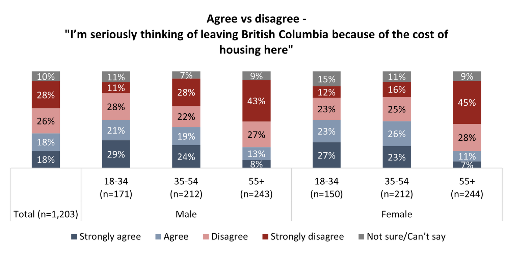
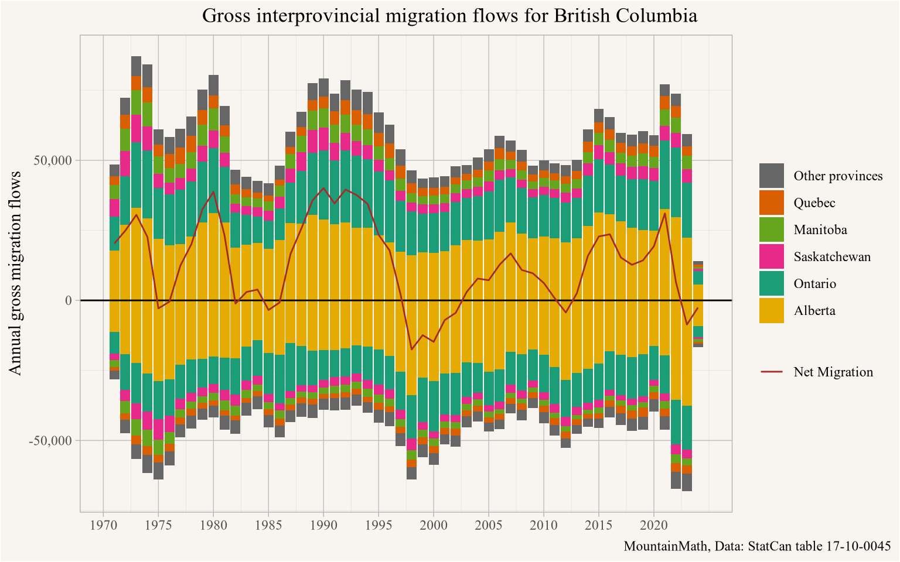
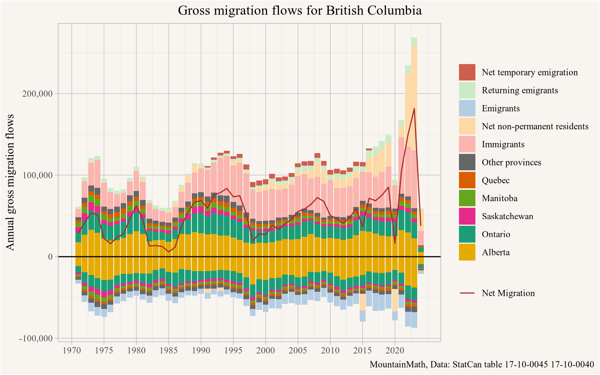
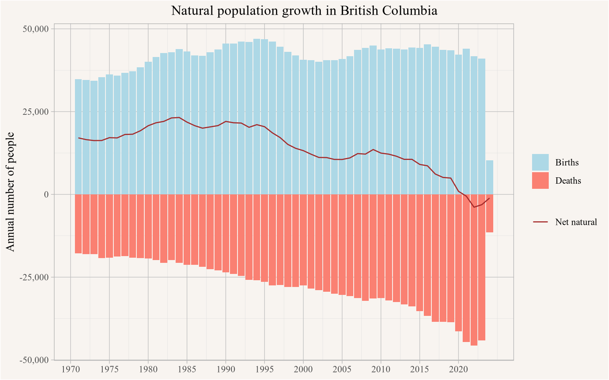
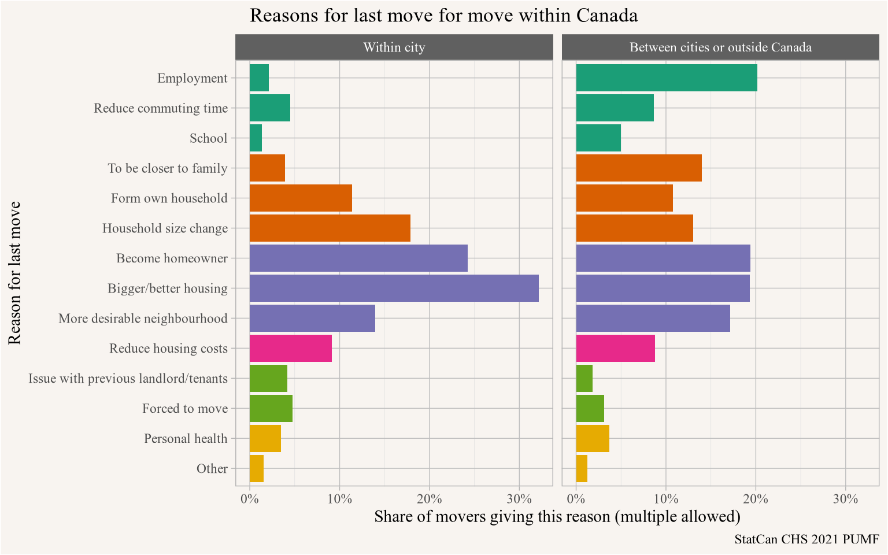
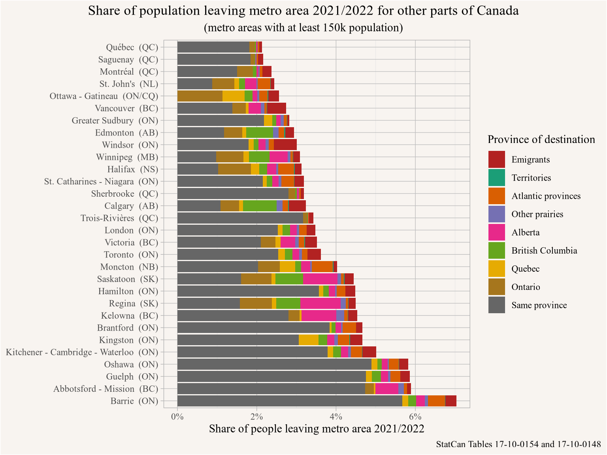
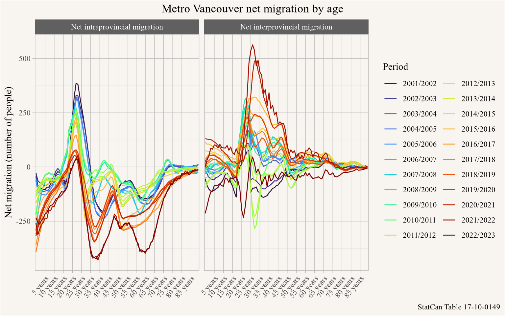

<p style="text-align:center;"><i>(Joint with Nathan Lauster and cross-posted at <a href="https://homefreesociology.com/2024/06/11/migration-and-housing-costs/" target="_blank">HomeFreeSociology</a>)</i></p>


New data supports a common theme: Housing costs seem to be increasingly important as a determinant of long-distance migration, adding to their traditional importance within short-distance moves. But there are still some interesting caveats. We have a look at the data, compare it to what we know of flows, and think through some of its perhaps unexpected implications.

# Leaving BC

We have become used to an endless stream of news about people leaving (or wanting to leave) Vancouver. Mostly because of housing costs. But what about BC writ large? The latest news comes in the form of an [Angus Reid survey](https://angusreid.org/bc-investment-migration-housing/)^[Following an increasingly common practice, the survey was directed at a "representative randomized sample" of members of the [Angus Reid Forum](https://www.angusreidforum.com/en-ca/FAQ), an opt-in set of "engaged adults" organized by demographic criteria and regularly solicited for their opinions in exchange for making their voices "count" and also awards, like [beer money](https://www.reddit.com/r/beermoney/comments/l66jqp/canadians_anyone_use_angus_reid_forum/). We take these results in good faith, but there are [reasonable concerns about data from these kind of panels](https://www.pewresearch.org/short-reads/2024/03/05/online-opt-in-polls-can-produce-misleading-results-especially-for-young-people-and-hispanic-adults/).] on people's intention to leave British Columbia because of housing costs, with this sentiment dropping off for people 55 or older.



The age relationship makes sense insofar as older people move less and are more likely settled in their housing. Strikingly, when broken out by geography the numbers are lower for Metro Vancouver than the (cheaper) parts to the East, with fewer people agreeing or strongly agreeing that they are seriously thinking of leaving the province because of housing costs. 


Part of the difference might be explained simply by proximity to Alberta. Leaving the province isn't such a big a deal when the border is nearby anyway. This fits with the idea that housing related moves are mostly local. There may also be some selection insofar as people looking to leave Metro Vancouver because of housing costs consider other parts of the province too, whereas people in those other parts concerned about housing costs likely won't consider Metro Vancouver as a feasible alternative. We're going to return to thinking about these metropolitan differences.

But first, the article also points out that:

|   "In 2023, the province lost 8,000 more residents to other provinces than it gained, an inter-provincial net loss not seen in B.C. since 2012."


::: {.cell}

```{.r .cell-code}
internal_data <- get_cansim("17-10-0045") %>%
    mutate(Date=Date %m+% months(1) %m+% days(14))
pd <- internal_data$`Geography, province of destination` %>% levels
po <- internal_data$GEO %>% unique %>% gsub(", province of origin","",.)
provinces <- c("Alberta","British Columbia","Ontario","Saskatchewan","Manitoba","Quebec","Other provinces")

external_data <- get_cansim("17-10-0040") %>%
  mutate(Date=Date %m+% months(1) %m+% days(14)) #%>%
  #filter(GEO==prov) %>%
  #mutate(value=case_when(`Components of population growth`=="Emigrants" ~ -val_norm, TRUE ~ val_norm))

natural_data <- get_cansim("17-10-0059")  %>%
  mutate(Date=Date %m+% months(1) %m+% days(14)) |>
  filter(Estimates %in% c("Births","Deaths"))


internal_migration_data_for <- function(internal_data,
                                        province,
                                        province_count=5,
                                        level_date=as.Date("2010-01-01")){
  internal <- internal_data %>%
    mutate(Origin=factor(gsub(", province of origin","",GEO),levels=po)) %>%
    mutate(Destination=fct_recode(`Geography, province of destination`,
                                  !!!setNames(pd,po))) %>%
    filter(Origin==province|Destination==province) %>%
    mutate(Name=case_when(Origin==province ~ Destination, TRUE ~ Origin)) 
  
  province_levels <- internal %>% 
    filter(Date>=level_date) %>%
    group_by(Name) %>%
    summarise(Value=sum(val_norm),.groups="drop") %>%
    slice_max(order_by = Value,n=province_count,with_ties = FALSE) %>%
    arrange(-Value) %>%
    pull(Name) %>%
    as.character() %>%
    c("Other provinces")
  
  internal %>%
    mutate(Name=case_when(Name %in% province_levels ~ as.character(Name), 
                          TRUE ~ "Other provinces")) %>%
    mutate(Name=factor(Name,levels=province_levels)) %>%
    mutate(Migration=ifelse(Origin==province,"Out-migration","In-migration")) %>%
    mutate(value=ifelse(Migration=="Out-migration",-val_norm,val_norm)) %>%
    group_by(Date,Name,Migration) %>%
    summarise(value=sum(value),.groups="drop") %>%
    bind_rows(group_by(.,Date) %>% summarize(value=sum(value)) %>% mutate(Migration="Net migration")) %>%
    mutate(Province=province)
}

migration_graph <- function(internal,
                            migration_colours=setNames(RColorBrewer::brewer.pal(8,"Dark2"),
                              c("Ontario", "Quebec", "British Columbia", "Saskatchewan", "Manitoba",
                                "Alberta", "Nova Scotia", "Other provinces"))){
  
  missing_colours <- setdiff(internal$Name %>% levels,names(migration_colours))
  if (length(missing_colours)>0) {
    migration_colours <- c(migration_colours,
                           setNames(MetBrewer::met.brewer("Juarez",length(missing_colours)),missing_colours))
  }
  migration_colours <- migration_colours[levels(internal$Name)]
  ggplot(internal,aes(x=Date,y=value,fill=fct_rev(Name))) +
    geom_bar(stat="identity",data=~filter(.,Migration!="Net migration")) +
    geom_hline(yintercept = 0) +
    geom_line(data=~filter(.,Migration=="Net migration") ,
              aes(x=Date,y=value,colour=Province),inherit.aes = FALSE) +
    scale_y_continuous(labels=scales::comma) +
    scale_colour_manual(values="brown",labels="Net Migration") +
  scale_x_date(breaks="2 year",date_labels = "%Y") +
    scale_fill_manual(values=migration_colours) +
    labs(title=paste0("Gross interprovincial migration flows for ",unique(internal$Province)),
         fill=NULL,x=NULL,y="Quarterly gross migration flows",colour=NULL,
         caption="MountainMath, Data: StatCan table 17-10-0045")
}

all_migration_data_for <- function(internal_data,external_data,
                                        province,
                                        province_count=5,
                                        level_date=as.Date("2010-01-01")){
  internal <- internal_data %>%
    mutate(Origin=factor(gsub(", province of origin","",GEO),levels=po)) %>%
    mutate(Destination=fct_recode(`Geography, province of destination`,
                                  !!!setNames(pd,po))) %>%
    filter(Origin==province|Destination==province) %>%
    mutate(Name=case_when(Origin==province ~ Destination, TRUE ~ Origin)) 
  
  province_levels <- internal %>% 
    filter(Date>=level_date) %>%
    group_by(Name) %>%
    summarise(Value=sum(val_norm),.groups="drop") %>%
    slice_max(order_by = Value,n=province_count,with_ties = FALSE) %>%
    arrange(-Value) %>%
    pull(Name) %>%
    as.character() %>%
    c("Other provinces")
  
  external <- external_data |>
                filter(GEO==province) |>
    filter(!(`Components of population growth` %in% c("Non-permanent residents, inflows",  "Non-permanent residents, outflows","Net emigration"))) |>
                mutate(Name=`Components of population growth`,
                       Origin="External") |>
                select(Date,Name,Origin,val_norm) |>
    filter(!is.na(val_norm))
  
  internal %>%
    mutate(Name=case_when(Name %in% province_levels ~ as.character(Name), 
                          TRUE ~ "Other provinces")) %>%
    mutate(Name=factor(Name,levels=province_levels)) %>%
    bind_rows(external) |>
    filter(Date>=pmax(min(internal$Date),min(external$Date))) |>
    mutate(Migration=ifelse(Origin==province | Name=="Emigrants","Out-migration","In-migration")) %>%
    mutate(value=ifelse(Migration=="Out-migration",-val_norm,val_norm)) %>%
    group_by(Date,Name,Migration) %>%
    summarise(value=sum(value),.groups="drop") %>%
    bind_rows(group_by(.,Date) %>% summarize(value=sum(value)) %>% mutate(Migration="Net migration")) %>%
    mutate(Province=province)
}

all_migration_graph <- function(migration,
                                internal_colours=setNames(RColorBrewer::brewer.pal(8,"Dark2"),
                              c("Ontario", "Quebec", "British Columbia", "Saskatchewan", "Manitoba",
                                "Alberta", "Nova Scotia", "Other provinces")),
                              external_colours = setNames(RColorBrewer::brewer.pal(5,"Pastel1"),
                                                          c("Immigrants", "Emigrants",  "Returning emigrants",
                                                            "Net temporary emigrants", "Net non-permanent residents"))) {

  
  missing_colours <- setdiff(migration$Name %>% levels,names(c(internal_colours,external_colours)))
  if (length(missing_colours)>0) {
    internal_colours <- c(internal_colours,
                           setNames(MetBrewer::met.brewer("Juarez",length(missing_colours)),missing_colours))
  }
  internal_colours <- internal_colours[setdiff(levels(migration$Name),names(external_colours))]


ggplot(migration,aes(x=Date,y=value,fill=fct_rev(Name))) +
    geom_bar(stat="identity",data=~filter(.,Migration!="Net migration")) +
    geom_hline(yintercept = 0) +
    geom_line(data=~filter(.,Migration=="Net migration") ,
              aes(x=Date,y=value,colour=Province),inherit.aes = FALSE) +
    scale_y_continuous(labels=scales::comma) +
  scale_x_date(breaks="2 year",date_labels = "%Y") +
    scale_colour_manual(values="brown",labels="Net Migration") +
    scale_fill_manual(values=c(internal_colours,external_colours)) +
    labs(title=paste0("Gross migration flows for ",unique(migration$Province)),
         fill=NULL,x=NULL,y="Quarterly gross migration flows",colour=NULL,
         caption="MountainMath, Data: StatCan table 17-10-0045 17-10-0040")
}

bc_annual_flows <- internal_migration_data_for(internal_data,"British Columbia") |>
  filter(Date>=as.Date("2001-01-01")) |>
  mutate(Year=as.numeric(format(Date,"%Y"))) |>
  summarize(value=sum(value),.by=c(Year,Migration)) 
bc_2023_flows <- bc_annual_flows |> filter(Year==2023)

bc_annual_external_flows_detail <- external_data |>
  filter(GeoUID=="59") |>
  mutate(Year=as.integer(strftime(Date,"%Y"))) |>
  filter(Year>=2022) |>
  rename(Components=`Components of population growth`) |>
  filter(Components%in% c("Immigrants","Emigrants","Returning emigrants",
                                                 "Net temporary emigration","Non-permanent residents, inflows",
                                                 "Non-permanent residents, outflows")) |>
  mutate(value=ifelse(Components %in% c("Emigrants","Non-permanent residents, outflows"),
                     -val_norm,val_norm)) |>
  summarize(value=sum(value,na.rm=TRUE),.by=c(Year,Components))

bc_annual_external_flows <- bc_annual_external_flows_detail |>
  mutate(Migration=case_when(Components %in% c("Emigrants","Non-permanent residents, outflows") ~ "Out-migration",
                             TRUE ~ "In-migration")) |>
  summarize(value=sum(value,na.rm=TRUE),.by=c(Year,Migration)) %>%
  bind_rows(summarize(.,value=sum(value),.by=Year) |> mutate(Migration="Net migration"))
bc_2023_external_flows <- bc_annual_external_flows |> filter(Year==2023)

bc_annual_all_flows <- all_migration_data_for(internal_data,external_data,"British Columbia") |>
  filter(Date>=as.Date("2001-01-01")) |>
  mutate(Year=as.numeric(format(Date,"%Y"))) |>
  summarize(value=sum(value),.by=c(Year,Migration)) 
bc_2023_all_flows <- bc_annual_all_flows |> filter(Year==2023)

bc_2023_all_flows_detail <- bc_annual_external_flows_detail |> filter(Year==2023)
```
:::


Glossing over some minor issues with this statement^[StatCan estimated that 8,624 more people left BC for other parts of Canada than it gained, which does not round to 8,000. Angus Reid likely took their estimate from annual net inter-provincial migration estimates and did not understand that these are pegged from July 1st 2022 to July 1st 2023, and thus not the same as estimates for the calendar year.], this does not directly relate to the question of people leaving the province. To understand this we need to take a more detailed look at the data.


# Provincial Flow Data
Net interprovincial flows subtract leavers from those arriving. Gross flows can be plotted to look at both streams together and break them out by region as shown in @fig-bc-interprovincial-migration.


::: {.cell}

```{.r .cell-code}
internal_migration_data_for(internal_data,"British Columbia") |>
  #filter(Date>=as.Date("2001-01-01")) |>
  mutate(Year=as.numeric(format(Date,"%Y"))) |>
  summarize(value=sum(value),.by=c(Year,Migration,Name,Province)) |>
  mutate(Date=as.Date(paste0(Year,"-01-01"))) |>
  migration_graph() +
  labs(y="Annual gross migration flows") +
  scale_x_date(breaks=as.Date(paste0(seq(1970,2020,5),"-01-01")),date_labels = "%Y")
```

::: {.cell-output-display}
{#fig-bc-interprovincial-migration width=768}
:::
:::


Interprovincial flows for BC are almost always dominated by what's happening in Alberta (and usually more about oil prices than housing prices).

When looking more broadly at gross out-flows, we can also incorporate out-flows to other countries. StatCan estimated that 67,994 left BC for other provinces in 2023, with another whopping 134,257 leaving BC for other countries, 115,381 of which were non-permanent residents and 18,876 people emigrated. That's a lot of people leaving, but there are also a lot of people moving to BC. And those international outflows are more than offset by international inflows as illustrated in @fig-bc-interprovincial-external-migration. For simplicity, and for data availability, we are condensing the non-permanent resident flows into net flows.


::: {.cell}

```{.r .cell-code}
bc_annual_all_miration_data <- all_migration_data_for(internal_data,external_data,"British Columbia") |>
  mutate(Year=strftime(Date,"%Y"))%>%
  summarize(value=sum(value),.by=c(Year,Migration,Name,Province)) |>
  mutate(Date=as.Date(paste0(Year,"-01-01")))

bc_annual_simple <- bc_annual_all_miration_data |>
  mutate(Migration=case_when(value<0 ~ "Out-migration",
                             TRUE ~ "In-migration")) |>
  summarize(value=sum(value),.by=c(Year,Migration)) %>%
  bind_rows(summarize(.,value=sum(value),.by=Year) |> mutate(Migration="Net migration"))

bc_2023_simple <- bc_annual_simple |> filter(Year==2023)

bc_annual_all_miration_data |>
  all_migration_graph() +
  labs(y="Annual gross migration flows") +
  scale_x_date(breaks=as.Date(paste0(seq(1970,2020,5),"-01-01")),date_labels = "%Y")
```

::: {.cell-output-display}
{#fig-bc-interprovincial-external-migration width=768}
:::
:::

::: {.cell}

```{.r .cell-code}
natural_data <- get_cansim("17-10-0059") |>
  filter(GEO=="British Columbia",Estimates %in% c("Births","Deaths")) |> 
  mutate(Year=as.numeric(strftime(Date,"%Y")))  |>
  summarize(value=sum(val_norm),.by=c(Year,Estimates)) |>
  mutate(value=case_when(Estimates=="Births" ~ value,
                         TRUE ~ -value)) %>%
  bind_rows(summarize(.,value=sum(value),.by=Year) |> mutate(Estimates="Net natural")) |>
    mutate(Date=as.Date(paste0(Year,"-01-01"))) 

natural_data_2023 <- natural_data |> filter(Year=="2023")
```
:::


The pandemic effect and subsequent boom in non-permanent resident population^[There is a lot of misunderstanding about the nature of the increase in non-permanent residents out there, net non-permanent residents acts very differently from e.g. increases in immigration. The data generation process for net non-permanent residents act essentially like a derivative and tends to zero absent of policy changes, but can temporarily rise (or fall) when hiring caps or student visa policies are changed.], as well as changes to permanent resident quotas, come out much more strongly here. So in total 450,106 people moved to BC in 2023, and 86,870 left BC, for a net increase due to migration of 363,236 people. Rounding this out, because population change is the sum of net migration + births - deaths, we can see that even more 41,019 people were born in BC at the same time that -44,122 died. Looking at only births and deaths leaves us with a net decrease of  3,103. In other words, the "natural population growth" we would see without net migration turned negative in the last couple of years, as shown in @fig-natural-population-growth.


::: {.cell}

```{.r .cell-code}
natural_data |>
  filter(Year>1970) |>
  ggplot(aes(x=Date,y=value)) +
  geom_bar(stat="identity",aes(fill=Estimates),
           data = ~filter(.,Estimates!="Net natural")) +
  geom_line(aes(colour=Estimates),
           data = ~filter(.,Estimates=="Net natural")) +
  scale_colour_manual(values=c("Net natural"="brown")) +
  scale_fill_manual(values=c("Births"="lightblue","Deaths"="salmon")) +
  scale_y_continuous(labels=scales::comma) +
  labs(title="Natural population growth in British Columbia",
       y="Annual number of people",
       fill=NULL,colour=NULL,x=NULL) +
   scale_x_date(breaks=as.Date(paste0(seq(1970,2020,5),"-01-01")),date_labels = "%Y")
```

::: {.cell-output-display}
{#fig-natural-population-growth width=768}
:::
:::


# Housing as a Reason for Move

Back to housing and moves! Housing has long been one of the most important reasons that people make local moves. But it's less often considered a reason for longer-distance moves, especially between regions or provinces. We can get a glimpse of this pattern with the "reason for move" data from the Canada Housing Survey. @fig-reason-for-last-move shows the reasons people gave for moving within or between cities.^[While municipalities are sometimes similar to metro areas, e.g. Calgary, Edmonton, or Winnipeg, there are important examples where they differ substantially and moves between municipalities are happening at high rates within the same metro area, e.g. Vancouver, Toronto, or Montréal.] Using municipal boundaries isn't ideal for distinguishing between short moves and long-distance migration, insofar as some metro areas contain lots of municipalities (e.g. Vancouver), mixing short distance moves into our "between city" figure. But we can see the split emerging, with employment a leading reason for "between city" moves, while housing definitely dominates for "within city" moves. 


::: {.cell}

```{.r .cell-code}
chs_2021 <- get_pumf("CHS","2021") |>
  label_pumf_data(rename = FALSE)

var_labels <- read_pumf_var_labels(chs_2021) |>
  filter(grepl("PPAC_45",name))

reasons <- var_labels$label |>
  gsub("^.+ - ","",x=_) |>
  lapply(\(n)paste0(toupper(substr(n,1,1)),substr(n,2,nchar(n)))) |>
  unlist()

reasons_order <- c("Employment"="Cat1",
  "Reduce commuting time"="Cat1",
  "School"="Cat1",
  "To be closer to family"="Cat2",
  "Form own household"="Cat2",
  "Household size change"="Cat2",
  "Become homeowner"="Cat3",
  "Bigger/better housing"="Cat3",
  "More desirable neighbourhood"="Cat3",
  "Reduce housing costs"="Cat4",
  "Issue with previous landlord/tenants"="Cat5",
  "Forced to move"="Cat5",
  "Personal health"="Cat6",
  "Other"="Cat6")

chs_2021 |> 
  filter(PPAC_10 %in% c("In different city/town..., Indian reserve or outside Canada",
                        "In same city/town/village/township.../Indian reserve")) |>
  mutate(PPAC_10=fct_recode(PPAC_10,
                            "Within city"="In same city/town/village/township.../Indian reserve",
                            "Between cities or outside Canada"="In different city/town..., Indian reserve or outside Canada")) |>
  #filter(!grepl("^Outside| - |Territories|Newfoundland and Labrador|Prince Edward Island",PGEOGR)) |>
  filter(PPAC_45C!="Not stated") |>
  pivot_longer(matches("PPAC_45")) |>
  summarise(count=sum(PFWEIGHT),.by=c(name,value,PPAC_10)) |>
  mutate(Share=count/sum(count),.by=c(name,PPAC_10)) |>
  filter(value=="Yes") |>
  mutate(nn=setNames(reasons,var_labels$name)[name] |> gsub(".+ - ","",x=_)) |>
  mutate(cat=reasons_order[nn]) |>
  mutate(nn=factor(nn,levels=rev(names(reasons_order))),
         cat=factor(cat,levels=unique(reasons_order))) |>
  #filter(grepl("employment|homeowner|bigger",nn)) |>
  ggplot(aes(x=Share,y=nn,fill=cat)) +
  geom_bar(stat="identity",position="dodge",show.legend = FALSE) +
  scale_x_continuous(labels=scales::percent) +
  facet_wrap(~PPAC_10) +
  scale_fill_brewer(palette="Dark2") +
  labs(title="Reasons for last move for move within Canada",
       x="Share of movers giving this reason (multiple allowed)",
       y="Reason for last move",
       caption = "StatCan CHS 2021 PUMF") 
```

::: {.cell-output-display}
{#fig-reason-for-last-move width=768}
:::
:::


It's worth noting here that moves are pretty common, and mostly positive. That is, people mostly move to somewhere they want to be more than where they used to live. When this flips (as with forced moves) is when we become concerned. Moving to "reduce housing costs" is a bit of an edge case in this categorization.

Interestingly, when we look at the specifics of moving to "reduce housing costs", the prevalence as a reason for move is similar for within city and between city moves. But it's important to note that reasons for move clearly overlap (and people could choose multiple reasons for their move). For a given budget, people could think of themselves as moving to a cheaper place both because it offered "homeownership" opportunities, "bigger/better housing" and/or "reduced housing costs". Overall we get some support for the idea that housing matters for short distance moves and increasingly also for longer-distance ones - even if not quite to the same level. That said, if we focus only on why people chose one particular place to live, we can miss why they didn't choose other places. Thinking about this at a provincial level, we know lots of people are thinking of leaving BC because of housing costs, but we don't have good data (beyond anecdotal) about how many people are avoiding coming to BC because of housing costs. We do know, thanks to a [CBC/Maru study](https://www.cbc.ca/news/canada/calgary/poll-canadians-comfortable-living-1.6302361) from December of 2021, that BC is most often identified as a province where Canadians would feel "comfortable" living.^[The [survey of Maru Voice Canada members](https://www.marugroup.net/public-opinion-polls/canada/living-comfortably-elsewhere) is structured similarly to the Angus Reid Forum, drawing upon an opt-in on-line panel in a manner meant to reflect the Canadian population as a whole] That suggests a lot of untapped interest in moving to BC. We're really interested in how much perceived housing costs inhibit people from making the move, and this underlies a great deal of the uncertainty regarding our ability to forecast into the future. How many people would come to BC if we made housing cheaper?

# Metro Areas

Ultimately, people mostly don't move because they want to live in a particular province. You don't move to live in BC, but instead to live in or near Vancouver, or Victoria, or Kelowna. Correspondingly, what we're really interested in when we look at longer distance migration is the metropolitan level. 

We've actually looked at various claims of people leaving Metro Vancouver a lot over the years [@lifeblood.2016; @lifeblood.2017; @millennials-redux.2017] which were mostly the result of poor understanding of data and demographics, and we have also quantified the in and outflows of people from Vancouver and other metro areas. [@gross-migration.2018; @keeping-the-leavers.2020; @there-is-no-brain-drain-but-there-might-be-zombies.2019]. But the notion that lots of people are fleeing Vancouver is remarkably persistent, and often housing costs are thought to be behind the imagined exodus. The recent Angus Reid survey results return us to this notion, but also provide seemingly surprising evidence against it. That is, Metro Vancouver is not the place in BC where most people are thinking of leaving the province over housing costs.

So how does Metro Vancouver compare to other Census Metropolitan Areas (CMAs) in terms of its outflows? Do we see a larger proportion of the population leaving each year than elsewhere? We start by looking at outflows to other parts of Canada, adding in emigrants as a separate category but suppressing the more volatile non-permanent residents.


::: {.cell}

```{.r .cell-code}
pop <- get_cansim_sqlite("17-10-0135",auto_refresh =TRUE) |>
  filter(Sex=="Both sexes",`Age group`=="All ages") |>
  collect_and_normalize(disconnect = TRUE) |>
  select(GeoUID,pop=val_norm,Year=REF_DATE)

pop_new <- get_cansim_sqlite("17-10-0148",auto_refresh =TRUE) |>
  filter(Gender=="Total - gender",`Age group`=="All ages") |>
  collect_and_normalize(disconnect = TRUE) |>
  select(GeoUID,pop=val_norm,Year=REF_DATE)


main_provinces <- c("Ontario","Quebec","British Columbia","Alberta")
other_prairies <- c("Saskatchewan","Manitoba")
atlantic <- c("Newfoundland and Labrador","Nova Scotia","New Brunswick","Prince Edward Island")

outflows_new <- get_cansim_sqlite("17-10-0154",auto_refresh =TRUE) |>
  #summarize(VALUE=sum(VALUE),.by=c(GeoUID,GEO,REF_DATE)) |>
  collect_and_normalize(disconnect = TRUE) %>%
  left_join(select(.,`Destination GeoUID`=GeoUID,`Geography of destination`=GEO) |>
              unique(),
            by="Geography of destination") |>
  mutate(OPR=gsub(".+, ","",GEO),
         DPR=gsub(".+, ","",`Geography of destination`)) %>%
  bind_rows(filter(.,grepl("/",DPR)) |> mutate(DPR=gsub(".+/","",DPR),VALUE=VALUE/2)) %>%
  bind_rows(filter(.,grepl("/",DPR)) |> mutate(DPR=gsub("/.+","",DPR),VALUE=VALUE/2)) |>
  filter(!grepl("/",DPR)) |>
  mutate(d=case_when(OPR==DPR ~ "Same province",
                     DPR %in% main_provinces ~ DPR,
                     DPR %in% other_prairies ~ "Other prairies",
                     DPR %in% atlantic ~ "Atlantic provinces",
                     TRUE ~ "Territories")) |>
  mutate(d=factor(d,levels=c("Same province",main_provinces,"Other prairies","Atlantic provinces","Territories","Emigrants")))

outflows <- get_cansim_sqlite("17-10-0141",auto_refresh =TRUE) |>
  #summarize(VALUE=sum(VALUE),.by=c(GeoUID,GEO,REF_DATE)) |>
  collect_and_normalize(disconnect = TRUE) %>%
  left_join(select(.,`Destination GeoUID`=GeoUID,`Geography of destination`=GEO) |>
              unique(),
            by="Geography of destination") |>
  mutate(OPR=gsub(".+, ","",GEO),
         DPR=gsub(".+, ","",`Geography of destination`)) %>%
  bind_rows(filter(.,grepl("/",DPR)) |> mutate(DPR=gsub(".+/","",DPR),VALUE=VALUE/2)) %>%
  bind_rows(filter(.,grepl("/",DPR)) |> mutate(DPR=gsub("/.+","",DPR),VALUE=VALUE/2)) |>
  filter(!grepl("/",DPR)) |>
  mutate(d=case_when(OPR==DPR ~ "Same province",
                     DPR %in% main_provinces ~ DPR,
                     DPR %in% other_prairies ~ "Other prairies",
                     DPR %in% atlantic ~ "Atlantic provinces",
                     TRUE ~ "Territories")) |>
  mutate(d=factor(d,levels=c("Same province",main_provinces,"Other prairies","Atlantic provinces","Territories","Emigrants")))


components <- get_cansim_sqlite("17-10-0136",auto_refresh = TRUE) |>
  filter(`Age group`=="All ages", Sex=="Both sexes") |>
  select(-`Age group`,-Sex) |>
  collect_and_normalize(disconnect = TRUE) |>
  mutate(value=case_when(`Components of population growth` %in% c("Emigrants","Deaths") ~ -val_norm,
                         TRUE ~ val_norm)) 

components_new <- get_cansim_sqlite("17-10-0149",auto_refresh = TRUE) |>
  filter(`Age group`=="All ages", Gender=="Total - gender") |>
  select(-`Age group`,-Gender) |>
  collect_and_normalize(disconnect = TRUE) |>
  mutate(value=case_when(`Components of population growth` %in% c("Emigrants","Deaths") ~ -val_norm,
                         TRUE ~ val_norm)) 


components_summary <- components |>
  filter(!grepl("part, ",GEO),!is.na(GeoUID)) |>
  mutate(Year=substr(REF_DATE,1,4)) |>
  filter(Year %in% seq(2016,2020)) |>
  inner_join(pop,by=c("GeoUID","Year")) |>
  summarise(value=mean(value/pop),
            pop=mean(pop),
            .by=c(GEO,GeoUID,`Components of population growth`)) |>
  filter(pop>150000,!grepl("^All|^Area|^Canada",GEO)) |>
  mutate(total=sum(value),.by=GEO) |>
  mutate(Name=gsub("\\(.+","",GEO))

components_new_summary <- components_new |>
  filter(!grepl("part, ",GEO),!is.na(GeoUID)) |>
  mutate(Year=substr(REF_DATE,1,4)) |>
  filter(Year %in% seq(2021,2022)) |>
  inner_join(pop_new,by=c("GeoUID","Year")) |>
  mutate(value=value/pop) |>
  mutate(lpop=last(pop,order_by=Year),
            .by=c(GEO,GeoUID,`Components of population growth`)) |>
  filter(lpop>150000,!grepl("^All|^Area|^Canada",GEO)) |>
  mutate(total=sum(value),.by=GEO) |>
  mutate(Name=gsub("\\(.+","",GEO))

components_colours <- setNames(c(RColorBrewer::brewer.pal(8,"Dark2") |> rev(),"firebrick"),outflows_new$d |> levels())
```
:::


@fig-metro-leaving-rates_2021 shows the latest available data, for the July 2021 to 2022 time frame (using 2021 CMA boundaries).


::: {.cell}

```{.r .cell-code}
outflows_new |>
  bind_rows(components_new |> 
              filter(`Components of population growth`=="Emigrants") |>
              filter(GeoUID %in% unique(outflows_new$GeoUID)) |>
              filter(substr(REF_DATE,1,4) %in% substr(unique(outflows_new$REF_DATE),1,4)) |>
              mutate(d=factor("Emigrants"))) |>
  filter(!is.na(GeoUID)) |>
  summarise(VALUE=sum(VALUE),.by=c(REF_DATE,d,GEO,GeoUID)) |>
  mutate(Year=substr(REF_DATE,1,4)) |>
  inner_join(pop_new,by=c("GeoUID","Year")) |>
  filter(!grepl("part, ",GEO)) |>
  mutate(leaving_rate=VALUE/pop) |>
  summarize(leaving_rate=weighted.mean(leaving_rate,w=pop),
            across(c(pop,VALUE),mean),
            .by=c(GEO,d)) |>
  mutate(total=sum(leaving_rate),.by=c(GEO)) |>
  filter(pop>150000) |>
  mutate(province=gsub(".+, ","",GEO)) |>
  mutate(Province=c(cansim:::short_prov.en,"Ontario/Quebec"="ON/CQ")[province]) |>
  mutate(Name=gsub("\\(.+","",GEO)) |>
  mutate(Name=paste0(Name," (",Province,")")) |>
  ggplot(aes(y=reorder(Name,-total),x=leaving_rate,fill=fct_rev(d))) +
  geom_bar(stat="identity") +
  scale_x_continuous(labels=scales::percent) +
  scale_fill_manual(values=components_colours) +
  labs(title="Share of population leaving metro area 2021/2022 for other parts of Canada",
       subtitle="(metro areas with at least 150k population)",
       y=NULL,
       fill="Province of destination",
       x="Share of people leaving metro area 2021/2022",
       caption="StatCan Tables 17-10-0154 and 17-10-0148")
```

::: {.cell-output-display}
{#fig-metro-leaving-rates_2021 width=768}
:::
:::


Metro Vancouver rounds out the major metropolitan areas with the lowest proportion of their populations joining an outflow, at less than 3%. By contrast, other BC metropolitan areas show up in the middle of the distribution (Victoria) and among the most outwardly mobile, exceeding 4% (Abbotsford - Mission and Kelowna). In effect, the cheaper places tend to see more people leave. Single year fluctuations can mask longer trends, so it's good to also check 5-year averages to smooth out annual bumps. Overall, the July 2016 to 2021 averages (on 2016 CMA boundaries) look quite similar, as shown in @fig-metro-leaving-rates..


::: {.cell}

```{.r .cell-code}
outflows |>
  bind_rows(components |> 
              filter(`Components of population growth`=="Emigrants") |>
              filter(GeoUID %in% unique(outflows$GeoUID)) |>
              filter(substr(REF_DATE,1,4) %in% substr(unique(outflows$REF_DATE),1,4)) |>
              mutate(d=factor("Emigrants"))) |>
  filter(!is.na(GeoUID)) |>
  summarise(VALUE=sum(VALUE),.by=c(REF_DATE,d,GEO,GeoUID)) |>
  mutate(Year=substr(REF_DATE,1,4)) |>
  inner_join(pop,by=c("GeoUID","Year")) |>
  filter(!grepl("part, ",GEO)) |>
  mutate(leaving_rate=VALUE/pop) |>
  summarize(leaving_rate=weighted.mean(leaving_rate,w=pop),
            across(c(pop,VALUE),mean),
            .by=c(GEO,d)) |>
  mutate(total=sum(leaving_rate),.by=c(GEO)) |>
  filter(pop>150000) |>
  mutate(province=gsub(".+, ","",GEO)) |>
  mutate(Province=c(cansim:::short_prov.en,"Ontario/Quebec"="ON/CQ")[province]) |>
  mutate(Name=gsub("\\(.+","",GEO)) |>
  mutate(Name=paste0(Name," (",Province,")")) |>
  ggplot(aes(y=reorder(Name,-total),x=leaving_rate,fill=fct_rev(d))) +
  geom_bar(stat="identity") +
  scale_x_continuous(labels=scales::percent) +
  scale_fill_manual(values=components_colours) +
  labs(title="Share of population leaving metro area each year for other parts of Canada and emigrants",
       subtitle="(metro areas with at least 150k population)",
       y=NULL,
       fill="Province of destination",
       x="Share of people leaving metro area (2016-2021 average)",
       caption="StatCan Tables 17-10-0141 and 17-10-0135")
```

::: {.cell-output-display}
{#fig-metro-leaving-rates width=768}
:::
:::


Even averaged over the long-term, people leave Vancouver at relatively low rates compared to other metro areas. Indeed, Vancouver moves into the second spot in terms of retaining its residents, just after Montréal. And if we ignored emigrants Vancouver would take the top spot. This might seem counter-intuitive at first. Why do we hear so much about people leaving Vancouver over housing if so few people are leaving? 

Importantly, the people that show up here have generally already found some sort of housing. They might not be happy with it. But Vancouver overall is a nice place to live, so people don't want to leave. And generally speaking, they don't. But when they do leave, they make sure we hear about it. And it's probably increasingly because of housing.


# Migration by age group

Unhappiness with housing in Vancouver tracks pretty well with age. Migration and mobility track with age as well. Unfortunately we don't have the age breakdown for gross migration flows, but we can look at net migration by age group. @fig-metro-van-net-migration-age looks at intra- and inter-provincial net migration for Metro Vancouver. 


::: {.cell}

```{.r .cell-code}
d<-get_cansim_sqlite("17-10-0149") 

ages <- get_cansim_column_categories("17-10-0149","Age group") |>
  filter(`Parent Member ID`!="1",!is.na(`Parent Member ID`)) |>
  pull(`Member Name`)

d |>
  filter(GeoUID=="933") |>
  filter(Gender=="Total - gender",
         `Age group` %in% ages) |>
  filter(`Components of population growth` %in% c("Net interprovincial migration","Net intraprovincial migration")) |>
  collect_and_normalize(disconnect=TRUE) |>
  ggplot(aes(x=`Age group`,y=val_norm,colour=REF_DATE,group=REF_DATE)) +
  #geom_point(shape=21) +
  geom_line() +
  scale_colour_viridis_d(option="turbo") +
  facet_wrap(~fct_rev(`Components of population growth`)) +
  scale_x_discrete(breaks=ages[seq(1,length(ages),5)][-1]) +
  theme(axis.text.x = element_text(angle = 50, hjust = 1)) +
  labs(title="Metro Vancouver net migration by age",
       x=NULL,
       colour="Period",
       y="Net migration (number of people)",
       caption="StatCan Table 17-10-0149")
```

::: {.cell-output-display}
{#fig-metro-van-net-migration-age width=768}
:::
:::


For intraprovincial migration we see a clear trend of declining net migration across all age groups, with on net increasingly more people leaving than arriving from other parts of the province. Metro Vancouver still (just barely) absorbs more young people of university age from around the province than it sends back out. But in all other age ranges, more people leave for other parts of the province than arrive from those parts. The inter-provincial patterns are more volatile, and more driven by economic conditions between the provinces. Looking back at our reasons for moving data, with housing being more important for more local moves and employment related reasons more important for longer distance moves, this is consistent with the notion that housing is increasingly interfering with people's movements across regions.

Lastly, @fig-metro-age-migration compares net migration patterns by age across selected metro areas for recent time periods.


::: {.cell}

```{.r .cell-code}
components_age_new_summary |>
  summarize(value=mean(value,na.rm=TRUE),.by=c(`Age group`,Period,`Components of population growth`,Name)) |>
ggplot(aes(y=`Age group`,x=value,
           fill=fct_rev(`Components of population growth`))) +
  geom_bar(stat="identity") +
  facet_grid(Period~fct_rev(Name)) +
  theme(legend.position="bottom") +
  scale_x_continuous(labels=scales::percent) +
  scale_fill_manual(values=cat_colours) +
  labs(title="Components of population growth",
       y=NULL,
       fill=NULL,
       x="Mean annual share of population",
       caption="StatCan Tables 17-10-0136 and 17-10-0135")
```

::: {.cell-output-display}
{#fig-metro-age-migration width=768}
:::
:::


Here we averaged over (roughly) 5 year periods to smooth out the data and simplify the presentation. Different metro areas show distinct migration patterns, with e.g. Toronto, Vancouver and Montréal showing significant net intra-provincial out-migration (in green), acting as *arrival cities* for their provinces. All three CMAs also show an increase in net intraprovincial out-migration over time, only somewhat suppressed for young adults ages, likely by the strong pull of their universities.

# Takeaway

It's great to see more data on housing costs as a factor in people's thinking about moves, especially for longer distances. That said the data can still be tricky to interpret, and "moving to another province", as in the Angus Reid survey, doesn't constitute a long move for those living near borders. In conjunction with data on actual moves and reasons given for moves, we can see some support for the idea that housing costs are increasingly driving migration patterns. On the other hand, high housing costs also reflect migration and indicate that people want to live in a place.

Even though really expensive regions, like Metro Vancouver, don't see that much out-migration, many of the people who do leave likely do so in part for housing reasons. But there are a lot of reasons people move. We should also keep an eye on net migration patterns, insofar as many of the people who would like to come to places like Metro Vancouver are probably feeling shut out by housing costs. It's hard to get at this directly insofar as we seldom ask everyone about where they'd like to be. But when we do, Canadians often say BC. 

And we agree. BC, and particularly Metro Vancouver, is a nice place to live. It'd be even nicer if it was a little more welcoming. Adding more housing is how we get there.

As usual, the code for this post is [available on GitHub](https://github.com/mountainMath/mountain_doodles/blob/main/posts/2024-06-11-migration-and-housing-costs/index.qmd) for anyone to reproduce or adapt for their own purposes.


<details>

<summary>Reproducibility receipt</summary>


::: {.cell}

```{.r .cell-code}
## datetime
Sys.time()
```

::: {.cell-output .cell-output-stdout}

```
[1] "2024-06-11 19:15:57 PDT"
```


:::

```{.r .cell-code}
## repository
git2r::repository()
```

::: {.cell-output .cell-output-stdout}

```
Local:    main /Users/jens/R/mountain_doodles
Remote:   main @ origin (https://github.com/mountainMath/mountain_doodles.git)
Head:     [a7ec969] 2024-06-12: leaving vancouver post
```


:::

```{.r .cell-code}
## Session info
sessionInfo()
```

::: {.cell-output .cell-output-stdout}

```
R version 4.4.0 (2024-04-24)
Platform: aarch64-apple-darwin20
Running under: macOS Sonoma 14.5

Matrix products: default
BLAS:   /Library/Frameworks/R.framework/Versions/4.4-arm64/Resources/lib/libRblas.0.dylib 
LAPACK: /Library/Frameworks/R.framework/Versions/4.4-arm64/Resources/lib/libRlapack.dylib;  LAPACK version 3.12.0

locale:
[1] en_US.UTF-8/en_US.UTF-8/en_US.UTF-8/C/en_US.UTF-8/en_US.UTF-8

time zone: America/Vancouver
tzcode source: internal

attached base packages:
[1] stats     graphics  grDevices utils     datasets  methods   base     

other attached packages:
 [1] cansim_0.3.17   canpumf_0.2.0   lubridate_1.9.3 forcats_1.0.0  
 [5] stringr_1.5.1   dplyr_1.1.4     purrr_1.0.2     readr_2.1.5    
 [9] tidyr_1.3.1     tibble_3.2.1    ggplot2_3.5.1   tidyverse_2.0.0

loaded via a namespace (and not attached):
 [1] gtable_0.3.5              xfun_0.44                
 [3] htmlwidgets_1.6.4         tzdb_0.4.0               
 [5] vctrs_0.6.5               tools_4.4.0              
 [7] generics_0.1.3            curl_5.2.1               
 [9] parallel_4.4.0            fansi_1.0.6              
[11] RSQLite_2.3.6             blob_1.2.4               
[13] pkgconfig_2.0.3           dbplyr_2.5.0             
[15] RColorBrewer_1.1-3        lifecycle_1.0.4          
[17] git2r_0.33.0              compiler_4.4.0           
[19] farver_2.1.2              munsell_0.5.1            
[21] mountainmathHelpers_0.1.4 htmltools_0.5.8.1        
[23] yaml_2.3.8                pillar_1.9.0             
[25] crayon_1.5.2              cachem_1.1.0             
[27] tidyselect_1.2.1          rvest_1.0.4              
[29] digest_0.6.35             stringi_1.8.4            
[31] labeling_0.4.3            fastmap_1.2.0            
[33] grid_4.4.0                colorspace_2.1-0         
[35] cli_3.6.2                 magrittr_2.0.3           
[37] utf8_1.2.4                withr_3.0.0              
[39] scales_1.3.0              bit64_4.0.5              
[41] timechange_0.3.0          rmarkdown_2.27           
[43] httr_1.4.7                bit_4.0.5                
[45] hms_1.1.3                 memoise_2.0.1            
[47] evaluate_0.23             knitr_1.47               
[49] viridisLite_0.4.2         rlang_1.1.4              
[51] glue_1.7.0                DBI_1.2.2                
[53] xml2_1.3.6                rstudioapi_0.16.0        
[55] vroom_1.6.5               jsonlite_1.8.8           
[57] MetBrewer_0.2.0           R6_2.5.1                 
```


:::
:::


</details>


