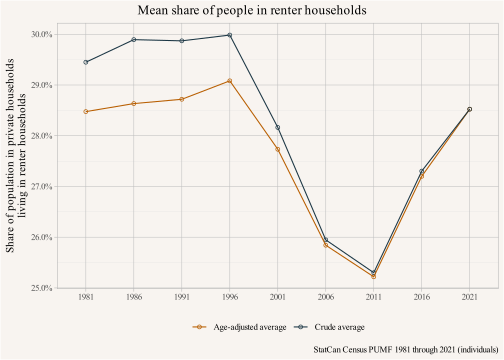
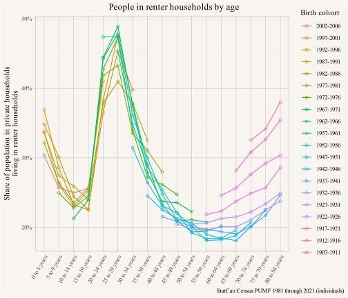
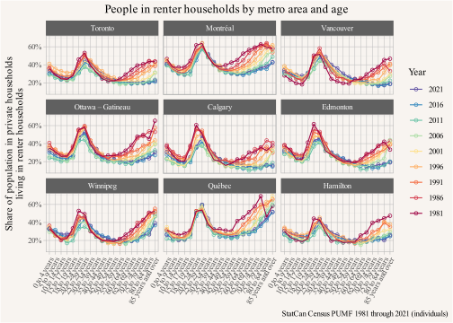
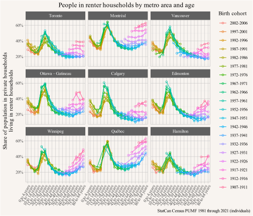
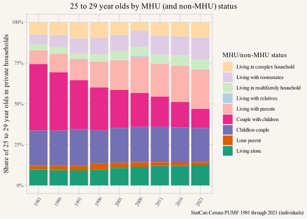
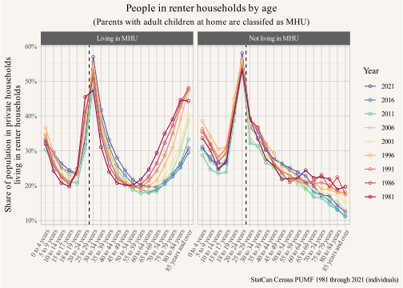
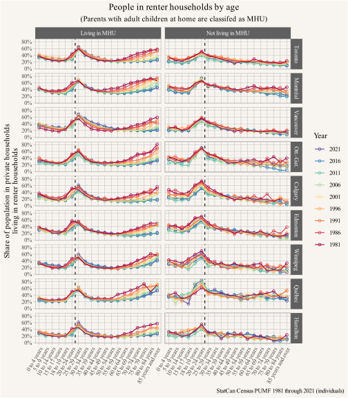
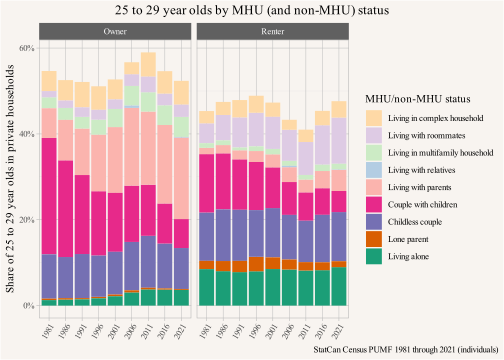
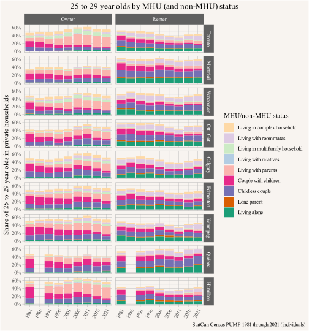
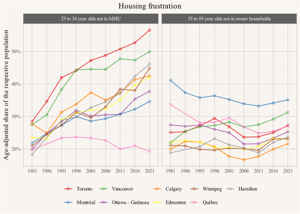

<p style="text-align:center;"><i>(Joint with Nathan Lauster and cross-posted at <a href="https://homefreesociology.com/2024/07/11/tenure-and-household-independence-across-the-life-course-1981-2021/" target="_blank">HomeFreeSociology</a>)</i></p>


How does owning or renting relate to household independence across the life course? How have these relationships changed over recent history? We use Census data from 1981-2021 to check in on historical relationships between age, tenure, and household composition. From these we develop a couple of preliminary demographic metrics of housing frustration. Patterns suggest that frustration abounds.

In previous posts we have looked in detail how Canadians distribute into households, and have focused in on Minimum Household Units, and how individuals move through different living arrangements across their lives. [@housing-outcomes.2023; @what-s-a-household.2017] In this post we want to add another dimension into the picture: tenure.

# Tenure trajectories

It's customary in demographic approaches to housing to divide tenure from peoples' household types (i.e. who they live together with), and to treat both as distinct choices people make. But this isn't quite right, of course. People's tenure arrangements and who they live tend to be ordered in terms of what is culturally valued versus what is stigmatized. Both also speak to questions of power in interesting ways that we can even consider feudal (who is "head" of the household, and who is lord of their land, i.e. the landlord). Perhaps more importantly for our purposes, both also speak to constraints. The harder it is to transition into ownership as a head of household, the more people may be frustrated by less-than-ideal alternatives.

On the flip side, policy also treats these statuses quite differently, and the reality in Canada is that we don't have tenure neutrality. Property rights receive far greater protections than those granted through Canada's rental tenancy acts, though these vary by province. Our tax and incentive system also heavily favours owners, first and foremost through the non-taxation of imputed rent, and secondly through the non-taxation of capital gains on principal residences, in addition to various other breaks like BC's home owner grant against property taxes. Non-taxation of capital gains has increasingly gained in importance as we have allowed home prices to rise much faster than inflation. Relatedly, we have seen rents rising faster than inflation, decreasing security of tenure for renters and increasing incentives for renters to become owners and lock in their housing costs.

Ultimately this returns us to choice. Not everyone has a choice, which can cause a lot of frustration. For those who do, rental and ownership housing offer different advantages and disadvantages to people. Renting offers more flexibility and has lower moving friction, but less security and control over the living environment. And importantly, it does not require a down-payment, other than a security deposit. This all works out across the life course so that, after leaving their parental home, most people start out their housing journey as renters and then at some later point potentially transition into ownership.


We have looked at tenure in other contexts in the past, in particular in conjunction with mobility. [@tumbling-turnover.2022; @residential-mobility-in-canada.2022] But we have also looked at [tenure by age group in Canadian metro area](https://x.com/vb_jens/status/1067664674194317312) several years back using 2011 data, which is more similar to where we are going with this post.


::: {.cell}

```{.r .cell-code}
year_colours <- setNames(RColorBrewer::brewer.pal(11,"Spectral")[c(1:5,8:11)],as.character(seq(1981,2021,5)))

pd <- mhu_pumf_combined |>
  filter(AGEGRP != "Not available",!is.na(AGEGRP)) |>
  summarize(n=sum(n),.by=c(TENUR,Year,AGEGRP)) |>
  mutate(Share=n/sum(n),.by=c(Year,AGEGRP)) |>
  mutate(diff=Share-lag(Share,order_by=Year),.by=AGEGRP) |>
  mutate(Year=factor(Year)) |>
  mutate(diff=coalesce(diff,0)) 
```
:::


Indeed, when looking at the share of the population (in private households) living in renter households by age group in @fig-canada-renter-share-age, we see children generally living in owner households (with their parents), and the prevalence of living in owner households increasing with age as parents might have rented when the child was young and then transitioned into ownership. That changes once children reach the age of 18, at what point they start to live in renter households at much higher rates, peaking at almost half living in renter households at the age 25 to 29 years.

Then follows a steady trend of transition to homeownership, with peak home ownership being somewhere between the ages of 50 to 70, with the peak age group over time increasing. After that the share of renters increases again. 


::: {.cell}

```{.r .cell-code}
pd |>
  filter(TENUR=="Renter") |>
  ggplot(aes(x=AGEGRP,y=Share,colour=fct_rev(Year),group=fct_rev(Year))) +
  geom_point(shape=21) +
  geom_line() +
  scale_y_continuous(labels=\(x)scales::percent(x)) +
  guides(fill=guide_legend(reverse=TRUE)) +
  theme(axis.text.x = element_text(angle = 60, hjust = 1)) +
  scale_colour_manual(values=year_colours) +
  labs(title="People in renter households by age",
       x=NULL,y="Share of population in private households\nliving in renter households",
       colour="Year",
       caption="StatCan Census PUMF 1981 through 2021 (individuals)")
```

::: {.cell-output-display}
{#fig-canada-renter-share-age fig-pos='H'}
:::
:::


To understand the development of renter share over time @fig-canada-renter-share-summary shows the (crude) average share of people in renter households, as well as an age adjusted average, using the 2021 population distribution by age as a baseline. Age adjustment here helps account for how the early years of our timeline, in particular, included a lot of young Baby Boomers, who re-weighted the balance between owning and renting for the population as a whole as they moved through their life course.


::: {.cell}

```{.r .cell-code}
pop_weights <- pd |>
  filter(Year=="2021") |>
  summarize(n=sum(n),.by=c(AGEGRP)) |>
  mutate(age_share=n/sum(n)) |>
  select(AGEGRP,age_share) 

pd |>
  left_join(pop_weights,by="AGEGRP") |>
  summarize(`Age-adjusted average`=weighted.mean(Share,w=age_share),
            n=sum(n),.by=c(TENUR,Year)) |>
  mutate(`Crude average`=n/sum(n),.by=Year) |>
  filter(TENUR=="Renter") |>
  pivot_longer(c(`Age-adjusted average`,`Crude average`),names_to="Type",values_to="Share") |>
  ggplot(aes(x=Year,y=Share,group=Type,colour=Type)) +
  geom_point(shape=21) +
  geom_line() +
  scale_y_continuous(labels=\(x)scales::percent(x)) +
  theme(legend.position = "bottom") +
  scale_colour_manual(values=sanzo::duos$c033) +
  labs(title="Mean share of people in renter households",
       x=NULL,y="Share of population in private households\nliving in renter households",
       colour=NULL,
       caption="StatCan Census PUMF 1981 through 2021 (individuals)")
```

::: {.cell-output-display}
{#fig-canada-renter-share-summary fig-pos='H'}
:::
:::


Overall the share of people in renter households was fairly constant between 1981 to 1996, then dropped quite rapidly until 2011 and increased since then with the age-adjusted renter share climbing back up to 1981 levels in 2021 but staying below the 1996 high point. Age structure hasn't been much of a factor in accounting for tenure mix since at least 2006.


But this is just looking at age groups in single years, how much of this is really due to people changing tenure vs people aging and bringing their old tenure forward? Demographers also try to be attentive to these kind of cohort effects. @fig-canada-renter-share-age-chohort shows the same information by age cohort instead of census year, which makes it easier to disentangle this.


::: {.cell}

```{.r .cell-code}
pd |>
  mutate(AGEGRP=fct_recode(AGEGRP,"15 to 19 years"="15 to 17 years","15 to 19 years"="18 to 19 years")) |>
  summarize(n=sum(n),.by=c(TENUR,Year,AGEGRP)) |>  
  mutate(Share=n/sum(n),.by=c(Year,AGEGRP)) |>
  mutate(Lower_age=as.numeric(str_extract(AGEGRP,"^\\d+"))) |>
  mutate(upper_b=as.integer(as.character(Year))-as.integer(Lower_age)) |>
  mutate(Cohort=paste0(upper_b-4,"-",upper_b)) |>
  mutate(Cohort=fct_reorder(Cohort,upper_b)) |>
  filter(AGEGRP != "85 years and over") |>
  filter(upper_b>=1910,upper_b<2010) |>
  filter(TENUR=="Renter") |>
  ggplot(aes(x=AGEGRP,y=Share,colour=fct_rev(Cohort),group=fct_rev(Cohort))) +
  geom_point(shape=21) +
  geom_line() +
  #scale_fill_manual(values=MetBrewer::met.brewer("Egypt",5)) +
  scale_y_continuous(labels=\(x)scales::percent(x)) +
  guides(fill=guide_legend(reverse=TRUE)) +
  theme(axis.text.x = element_text(angle = 60, hjust = 1)) +
  labs(title="People in renter households by age",
       x=NULL,y="Share of population in private households\nliving in renter households",
       colour="Birth cohort",
       caption="StatCan Census PUMF 1981 through 2021 (individuals)")
```

::: {.cell-output-display}
{#fig-canada-renter-share-age-chohort fig-pos='H'}
:::
:::


This shows that the peak homeownership age is much more consistently between 55 to 69 years, and what looked like dramatic increases in renter share for people at older ages is largely driven by cohort effects with each age cohort starting at higher homeownership rates, although there remains a tendency to transition from ownership to rental for seniors. (Making the reasonable assumption that owners don't die at faster rates then renters.)   


But housing is local, and national average can mask diverging local trends. @fig-canada-renter-share-age breaks this down to metro geographies. For all metro areas, the biggest historical pattern remains the declining share of seniors renting, which as we have noted, is largely (though not entirely) a cohort effect. But other patterns vary by metro area, including renter shares overall, with Montréal having by far the highest rates of renters, and Calgary having the lowest. Another pattern that starts to become visible is the dramatic slowing of pathways into home ownership through middle age for Metro Vancouver. In 1981, most transitions into ownership were well underway by age 35-39, with less than a quarter in that age group still renting. By 2021, the age gradient of ownership was far more gradual, with 40% of those age 35-39 were still renting. Not surprisingly, a similar transition shows up for older children (age 10-17), likely matching parents remaining renters for longer as they aged. While this pattern of steadily delayed transition into ownership through middle age is most apparent in Vancouver, there is also evidence of it elsewhere, particularly Winnipeg and Hamilton.


::: {.cell}

```{.r .cell-code}
pd2<-mhu_pumf_combined |>
  filter(AGEGRP != "Not available",!is.na(AGEGRP)) |>
  summarize(n=sum(n),.by=c(TENUR,Year,AGEGRP,CMA)) |>
  mutate(Share=n/sum(n),.by=c(Year,AGEGRP,CMA)) |>
  mutate(diff=Share-lag(Share,order_by=Year),.by=c(AGEGRP,CMA)) |>
  mutate(Year=factor(Year)) |>
  mutate(diff=coalesce(diff,0)) 

cma_selection <- pd2$CMA |> levels() |> head(10) |> setdiff("Other")
cma_colours <- setNames(RColorBrewer::brewer.pal(length(cma_selection),"Set1"),cma_selection)

pd2 |>
  filter(TENUR=="Renter") |>
  filter(CMA %in% cma_selection) |>
  ggplot(aes(x=AGEGRP,y=Share,colour=fct_rev(Year),group=fct_rev(Year))) +
  geom_point(shape=21) +
  geom_line() +
  scale_y_continuous(labels=\(x)scales::percent(x)) +
  guides(fill=guide_legend(reverse=TRUE)) +
  scale_colour_manual(values=year_colours) +
  facet_wrap(~CMA) +
  theme(axis.text.x = element_text(angle = 60, hjust = 1)) +
  labs(title="People in renter households by metro area and age",
       x=NULL,y="Share of population in private households\nliving in renter households",
       colour="Year",
       caption="StatCan Census PUMF 1981 through 2021 (individuals)")
```

::: {.cell-output-display}
{#fig-metro-renter-share-age fig-pos='H'}
:::
:::


Once again, slicing the data by cohorts in @fig-metro-renter-share-age-cohort shows that much of the shift we see, both in declining rentership for seniors, and delayed ownership for those middle-aged (in select metros) is due to cohort effects. Successive cohorts of seniors starting out with lower renter shares than their predecessors and kept these shares as they aged. In Vancouver, successive cohorts of those entering middle-age stayed renters longer before transitioning into ownership.


::: {.cell}

```{.r .cell-code}
pd3<-pd2 |>
  filter(AGEGRP != "Not available",!is.na(AGEGRP)) |>
  mutate(AGEGRP=fct_recode(AGEGRP,"15 to 19 years"="15 to 17 years","15 to 19 years"="18 to 19 years")) |>
  summarize(n=sum(n),.by=c(TENUR,Year,AGEGRP,CMA)) |>
  mutate(Share=n/sum(n),.by=c(Year,AGEGRP,CMA)) |>
  mutate(Lower_age=as.numeric(str_extract(AGEGRP,"^\\d+"))) |>
  mutate(upper_b=as.integer(as.character(Year))-as.integer(Lower_age)) |>
  mutate(Cohort=paste0(upper_b-4,"-",upper_b)) |>
  mutate(Cohort=fct_reorder(Cohort,upper_b))


pd3 |>
  filter(CMA %in% cma_selection) |>
  filter(TENUR=="Renter") |>
  filter(AGEGRP != "85 years and over") |>
  filter(upper_b>=1910,upper_b<2010) |>
  ggplot(aes(x=AGEGRP,y=Share,colour=fct_rev(Cohort),group=fct_rev(Cohort))) +
  geom_point(shape=21) +
  geom_line() +
  scale_y_continuous(labels=\(x)scales::percent(x)) +
  guides(fill=guide_legend(reverse=TRUE)) +
  facet_wrap(~CMA) +
  theme(axis.text.x = element_text(angle = 60, hjust = 1)) +
  labs(title="People in renter households by metro area and age",
       x=NULL,y="Share of population in private households\nliving in renter households",
       colour="Birth cohort",
       caption="StatCan Census PUMF 1981 through 2021 (individuals)")
```

::: {.cell-output-display}
{#fig-metro-renter-share-age-cohort fig-pos='H'}
:::
:::


What about young adults? Here the patterns are more complicated. The sharp spike in renting across young adulthood we can see in 1981, both at the national level and for metro areas, has become lower and shifted later. To understand this pattern better requires mixing back in household composition. 

# Mixing in household composition
Interpreting tenure composition at the younger ages is complicated by household living arrangements. For example dropping renter shares for 30 year olds could be indicative of people in their thirties transitioning into homeownership faster than previous generations, but it could also be due to people in their thirties remaining longer in their parent household which tend to be owner-occupied. These provide diverging interpretations of the data with very different housing outcomes for people in their thirties, so it's important to try and separate these.

In previous posts we have worked with the concept of Minimum Household Unit (MHU) to address this [@housing-outcomes.2023] and we can split the population, and our renter shares, into two groups, those living in MHU and those outside of MHU. One problem is that we can't cleanly separate out MHUs in the case of adult children living with parents. We can identify the children, and assign them to non-MHU households, but with the PUMF data we can't separate out the parents, so they will still be counted as living in MHUs even with adult children at home. If we take a "frustration" approach to understanding housing goals, this is probably fine for our purposes. In particular, we may want to think of parents with adult children living at home as within MHU, insofar as they may feel like their particular housing and household situation is fine. At the same time, we may want to think of their children as being outside of MHU, insofar as they may feel frustrated in their housing and household situation. We acknowledge there may be some complexity here, including "failure to launch" situations where parents are more frustrated than children, but overall we feel ok about assigning most of the frustration concerning housing access to adult children rather than their parents.

@fig-mhu-age gives a quick overview of the share of the population living in Minimum Household Units by age group. The vertical dashed line between the 20 to 24 and 25 to 29 year old age groups indicates where we switched from considering children living with parents as being "dependent" children, and those still living in MHU if they live with parents, to no longer being in MHU if they still live with their parents. That cutoff is partially informed by census coding and the "usual place of residence" concept that might code post-secondary students as living with their parents, even though the live elsewhere for most of the year.


::: {.cell}

```{.r .cell-code}
pd_mhu<-mhu_pumf_combined |>
  filter(AGEGRP != "Not available",!is.na(AGEGRP)) |>
  summarize(n=sum(n),.by=c(Year,AGEGRP,MHU)) |>
  mutate(Share=n/sum(n),.by=c(Year,AGEGRP)) 

pd_mhu |>
  filter(MHU=="Living in MHU") |>
  ggplot(aes(x=AGEGRP,y=Share,colour=fct_rev(Year),group=fct_rev(Year))) +
  geom_point(shape=21) +
  geom_line() +
  geom_vline(xintercept=which(levels(pd_mhu$AGEGRP)=="20 to 24 years")+0.5,linetype="dashed") +
  scale_y_continuous(labels=\(x)scales::percent(x)) +
  guides(fill=guide_legend(reverse=TRUE)) +
  theme(axis.text.x = element_text(angle = 60, hjust = 1)) +
  scale_colour_manual(values=year_colours) +
  labs(title="People in minimum household units by age",
       subtitle="(Parents with adult children at home are classifed as MHU)",
       x=NULL,y="Share of population in private households\nliving in minimum household units",
       colour="Year",
       caption="StatCan Census PUMF 1981 through 2021 (individuals)")
```

::: {.cell-output-display}
{#fig-mhu-age fig-pos='H'}
:::
:::


The big pattern here is the dramatic drop in the proportion of young adults living in MHU from 1981 to 2021. Meanwhile, older adults became increasingly likely up from 1981-2001 to live in MHU, before the pattern reversed somewhat from 2001-2021 except for all but the most senior (age 80+). On the other side of the lifespan, young children follow similar patterns as adults in their 30s and 40s - increasingly likely their parents. Insofar as the drop in the share of young adults in their late 20s living in MHUs is particularly pronounced, we zoom into this group in @fig-mhu-25-29 to highlight how this drop is driven by fewer couple with children households. Young people are delaying coupling and childbearing. This is made up for by an increase of children living with parents and to a somewhat lesser extent an increase in living with roommates, leading non-MHU situations (in pastel colours). In terms of MHU situations, those living alone also rose over time, but not nearly enough to make up for the decline in those living as couples with children. Those living as single parents rose and then dropped again and those living as part of childless couples remained stable, rounding out our MHU categories.


::: {.cell}

```{.r .cell-code}
pd_mhu<-mhu_pumf_combined |>
  filter(AGEGRP != "Not available",!is.na(AGEGRP)) |>
  summarize(n=sum(n),.by=c(Year,AGEGRP,MHU_full)) |>
  mutate(Share=n/sum(n),.by=c(Year,AGEGRP)) 


pd_mhu |>
  filter(AGEGRP=="25 to 29 years") |>
  ggplot(aes(x=Year,y=Share,fill=fct_rev(MHU_full))) +
  geom_bar(stat="identity") +
  scale_y_continuous(labels=\(x)scales::percent(x)) +
  theme(axis.text.x = element_text(angle = 60, hjust = 1)) +
  scale_fill_manual(values=mhu_colours,
                    labels=mhu_labels) +
  labs(title="25 to 29 year olds by MHU (and non-MHU) status",
       x=NULL,y="Share of 25 to 29 year olds in private households",
       fill="MHU/non-MHU status",
       caption="StatCan Census PUMF 1981 through 2021 (individuals)")
```

::: {.cell-output-display}
{#fig-mhu-25-29 fig-pos='H'}
:::
:::


Armed with this understanding of Minimum Household Units we proceed to look at the share of MHU (and non-MHU) households by tenure in @fig-mhu-tenure-canada. We again mark the age group below which we count children living with parents as being in MHU. Here we can see how living in MHU and renting are complementary strategies. Renting is generally an important strategy for people hoping to achieve some form of household independence. Renting is less common for those outside of MHU, except for the youngest group, where renting with roommates (a non-MHU household) is especially common.


::: {.cell}

```{.r .cell-code}
pd4<-mhu_pumf_combined |>
  filter(AGEGRP != "Not available",!is.na(AGEGRP)) |>
  summarize(n=sum(n),.by=c(TENUR,Year,AGEGRP,MHU)) |>
  mutate(Share=n/sum(n),.by=c(Year,AGEGRP,MHU)) |>
  mutate(diff=Share-lag(Share,order_by=Year),.by=c(AGEGRP,MHU)) |>
  mutate(Year=factor(Year)) |>
  mutate(diff=coalesce(diff,0)) 

pd4 |>
  filter(TENUR=="Renter") |>
  ggplot(aes(x=AGEGRP,y=Share,colour=fct_rev(Year),group=fct_rev(Year))) +
  geom_vline(xintercept=which(levels(pd_mhu$AGEGRP)=="20 to 24 years")+0.5,linetype="dashed") +
  geom_point(shape=21) +
  geom_line() +
  scale_y_continuous(labels=\(x)scales::percent(x)) +
  guides(fill=guide_legend(reverse=TRUE)) +
  theme(axis.text.x = element_text(angle = 60, hjust = 1)) +
  scale_colour_manual(values=year_colours) +
  facet_wrap(~MHU) +
  labs(title="People in renter households by age",
       subtitle="(Parents with adult children at home are classifed as MHU)",
       x=NULL,y="Share of population in private households\nliving in renter households",
       colour="Year",
       caption="StatCan Census PUMF 1981 through 2021 (individuals)")
```

::: {.cell-output-display}
{#fig-mhu-tenure-canada fig-pos='H'}
:::
:::


Overall it seems clear that rental housing plays an important role at enabling young adults to live in MHU, and from there they tend to transition into ownership as they age, with transitions taking progressively longer over time. Renting has also enabled aging adults to maintain the independence of an MHU household, whether in the face of unexpected relationship dissolution, or moving to a desirable retirement destination. But this has become less important over historical time, as older adults have become more likely to obtain and hold onto both independence and home ownership. Remaining in non-MHU status (especially living with parents, but also living with roommates) offers a more linear path out of renting in terms of how it relates to age. Indeed, the seniors in non-MHU households are, in many cases, likely the owners of homes they share with their adult children.

@fig-mhu-tenure-cma breaks this down by major metro area. The patterns are broadly similar between metro areas, with some, in particular Edmonton, showing an earlier peak in MHU households already at the 20 to 24 year old age.


::: {.cell}

```{.r .cell-code}
pd5<-mhu_pumf_combined |>
  filter(AGEGRP != "Not available",!is.na(AGEGRP)) |>
  summarize(n=sum(n),.by=c(TENUR,Year,AGEGRP,MHU,CMA)) |>
  mutate(Share=n/sum(n),.by=c(Year,AGEGRP,MHU,CMA)) |>
  mutate(diff=Share-lag(Share,order_by=Year),.by=c(AGEGRP,MHU,CMA)) |>
  mutate(Year=factor(Year)) |>
  mutate(diff=coalesce(diff,0)) 

pd5 |>
  filter(CMA %in% cma_selection) |>
  mutate(CMA=fct_recode(CMA,"Ott.–Gat."="Ottawa – Gatineau")) |>
  filter(TENUR=="Renter") |>
  ggplot(aes(x=AGEGRP,y=Share,colour=fct_rev(Year),group=fct_rev(Year))) +
  geom_vline(xintercept=which(levels(pd_mhu$AGEGRP)=="20 to 24 years")+0.5,linetype="dashed") +
  geom_point(shape=21) +
  geom_line() +
  scale_y_continuous(labels=\(x)scales::percent(x)) +
  guides(fill=guide_legend(reverse=TRUE)) +
  theme(axis.text.x = element_text(angle = 60, hjust = 1)) +
  scale_colour_manual(values=year_colours) +
  facet_grid(CMA~MHU) +
  labs(title="People in renter households by age",
       subtitle="(Parents wtih adult children at home are classifed as MHU)",
       x=NULL,y="Share of population in private households\nliving in renter households",
       colour="Year",
       caption="StatCan Census PUMF 1981 through 2021 (individuals)")
```

::: {.cell-output-display}
{#fig-mhu-tenure-cma fig-pos='H'}
:::
:::


In @fig-mhu-25-29-tenure we come back to the detailed look at 25 to 29 year olds and split them by MHU status and tenure. Roughly half of 25-29 year olds show up in each tenure status. In 1981, owners are dominated by those in MHU, especially couples with children, but we can see this status declining dramatically, even as living with parents rises. The same pattern unfolds for renters, but not nearly to the same extent. Moreover, living with roommates plays a much bigger role in the rise of non-MHU households for renters. Even so, by 2021 fewer owners are in MHU than renters in this age range, mostly reflecting more 25-29 year olds living in their parents' (owned) homes. Overall, it appears renting became a more prevalent route to MHU households than owning for young adults over the past 40 years.


::: {.cell}

```{.r .cell-code}
pd_mhu_tenure<-mhu_pumf_combined |>
  filter(AGEGRP != "Not available",!is.na(AGEGRP)) |>
  summarize(n=sum(n),.by=c(Year,AGEGRP,MHU_full,TENUR)) |>
  mutate(Share=n/sum(n),.by=c(Year,AGEGRP))

pd_mhu_tenure |>
  filter(AGEGRP=="25 to 29 years") |>
  ggplot(aes(x=Year,y=Share,fill=fct_rev(MHU_full))) +
  geom_bar(stat="identity") +
  facet_wrap(~TENUR) +
  scale_y_continuous(labels=\(x)scales::percent(x)) +
  theme(axis.text.x = element_text(angle = 60, hjust = 1)) +
  scale_fill_manual(values=mhu_colours,
                    labels=c("MHU1"="Living alone",
                             "MHU2"="Lone parent",
                             "MHU3"="Childless couple",
                             "MHU4"="Couple with children")) +
  labs(title="25 to 29 year olds by MHU (and non-MHU) status",
       x=NULL,y="Share of 25 to 29 year olds in private households",
       fill="MHU/non-MHU status",
       caption="StatCan Census PUMF 1981 through 2021 (individuals)")
```

::: {.cell-output-display}
{#fig-mhu-25-29-tenure fig-pos='H'}
:::
:::


The national trends obscure, to some extent, how the same historical transformation took place even more quickly within the big metros where rental stock was more prevalent. There, 25-29 years were always more likely to rent, and renting was even more associated with being in MHU status than ownership, remaining so over the years, even as more renters took on roommates. By contrast, many mid-size metros (e.g. Calgary, Edmonton, and Ottawa) saw a bump in 2006 and 2011 where owner-occupied households were as likely in MHU as renters, before renters began to outpace in MHU status once more.


::: {.cell}

```{.r .cell-code}
pd_mhu_tenure_cma<-mhu_pumf_combined |>
  filter(AGEGRP != "Not available",!is.na(AGEGRP)) |>
  summarize(n=sum(n),.by=c(Year,AGEGRP,MHU_full,TENUR,CMA)) |>
  mutate(Share=n/sum(n),.by=c(Year,AGEGRP,CMA))

pd_mhu_tenure_cma |>
  filter(AGEGRP=="25 to 29 years") |>
  filter(CMA %in% cma_selection) |>
  mutate(CMA=fct_recode(CMA,"Ott.–Gat."="Ottawa – Gatineau")) |>
  ggplot(aes(x=Year,y=Share,fill=fct_rev(MHU_full))) +
  geom_bar(stat="identity") +
  facet_grid(CMA~TENUR) +
  scale_y_continuous(labels=\(x)scales::percent(x)) +
  theme(axis.text.x = element_text(angle = 60, hjust = 1)) +
  scale_fill_manual(values=mhu_colours,
                    labels=c("MHU1"="Living alone",
                             "MHU2"="Lone parent",
                             "MHU3"="Childless couple",
                             "MHU4"="Couple with children")) +
  labs(title="25 to 29 year olds by MHU (and non-MHU) status",
       x=NULL,y="Share of 25 to 29 year olds in private households",
       fill="MHU/non-MHU status",
       caption="StatCan Census PUMF 1981 through 2021 (individuals)")
```

::: {.cell-output-display}
{#fig-mhu-25-29-tenure-cma fig-pos='H'}
:::
:::


# Housing Frustration?

We can think about age relationships to MHU status and renter status in a different way if we consider them in terms of age-normative aspirations. While many people are open to alternative ways of sharing their living space, it can also be frustrating to find one's self living with parents or roommates past a certain age. Similarly, it can be frustrating to rent when a person really desires ownership. We can align this frustration with expectations associated with age in a simple way by setting aside age 25-34 as a time when people want to head up their own MHU household, i.e. with or without a partner and children. Similarly we can imagine those age 35-59 as wanting to move into home ownership. Living outside of these statuses over these age ranges could be taken as a measure of housing frustration. Let's consider these kinds of frustration separately, first by looking at age standardized proportions frustrated as measured historically.


::: {.cell}

```{.r .cell-code}
pd_frustration_1<-mhu_pumf_combined |>
  filter(AGEGRP != "Not available",!is.na(AGEGRP)) |>
  filter(AGEGRP %in% c("25 to 29 years","30 to 34 years")) |>
  summarize(n=sum(n),.by=c(Year,MHU,AGEGRP)) |>
  mutate(Share=n/sum(n),.by=c(Year,AGEGRP)) |>
  filter(MHU=="Not living in MHU")

pd_frustration_2<-mhu_pumf_combined |>
  filter(AGEGRP != "Not available",!is.na(AGEGRP)) |>
  filter(AGEGRP %in% c("35 to 39 years","40 to 44 years","45 to 49 years","50 to 54 years","55 to 59 years")) |>
  summarize(n=sum(n),.by=c(Year,TENUR,AGEGRP)) |>
  mutate(Share=n/sum(n),.by=c(Year,AGEGRP)) |>
  filter(TENUR=="Renter")

bind_rows(pd_frustration_1 |> mutate(Type="25 to 34 year olds not in MHU"),
          pd_frustration_2 |> mutate(Type="35 to 59 year olds not in owner households")) |>
  left_join(pop_weights,by="AGEGRP") |>
  summarise(Share=weighted.mean(Share,w=age_share),.by=c(Year,Type)) |>
  ggplot(aes(x=Year,y=Share,colour=Type,group=Type)) +
  geom_point(shape=21) +
  geom_line() +
  scale_colour_manual(values=sanzo::duos$c071) +
  scale_y_continuous(labels=scales::percent) +
  theme(legend.position="bottom") +
  labs(title="Housing frustration",
       colour="Frustration measure",
       x=NULL,
       y="Age-adjusted share of the respective population")
```

::: {.cell-output-display}
{fig-pos='H'}
:::
:::


We can see that the potential frustration of young adults (25-34) has risen most strongly over time, likely reflecting more and more young people finding themselves unable to head up MHU households. By contrast, the potential frustration of middle-aged renters (35-59) has risen, fallen, then risen again, but never quite equalled the potential frustrations of the young since 1981. We can usefully pull these trends out by metro area.


::: {.cell}

```{.r .cell-code}
pd_frustration_1_cma<-mhu_pumf_combined |>
  filter(AGEGRP != "Not available",!is.na(AGEGRP)) |>
  filter(AGEGRP %in% c("25 to 29 years","30 to 34 years")) |>
  summarize(n=sum(n),.by=c(Year,MHU,AGEGRP,CMA)) |>
  mutate(Share=n/sum(n),.by=c(Year,AGEGRP,CMA)) |>
  filter(MHU=="Not living in MHU")

pd_frustration_2_cma<-mhu_pumf_combined |>
  filter(AGEGRP != "Not available",!is.na(AGEGRP)) |>
  filter(AGEGRP %in% c("35 to 39 years","40 to 44 years","45 to 49 years","50 to 54 years","55 to 59 years")) |>
  summarize(n=sum(n),.by=c(Year,TENUR,AGEGRP,CMA)) |>
  mutate(Share=n/sum(n),.by=c(Year,AGEGRP,CMA)) |>
  filter(TENUR=="Renter")

bind_rows(pd_frustration_1_cma |> mutate(Type="25 to 34 year olds not in MHU"),
          pd_frustration_2_cma |> mutate(Type="35 to 59 year olds not in owner households")) |>
  left_join(pop_weights,by="AGEGRP") |>
  summarise(Share=weighted.mean(Share,w=age_share),.by=c(Year,Type,CMA)) |>
  filter(CMA %in% cma_selection) |>
  ggplot(aes(x=Year,y=Share,colour=CMA,group=CMA)) +
  geom_point(shape=21) +
  geom_line() +
  facet_wrap(~Type) +
  scale_color_manual(values=cma_colours) +
  scale_y_continuous(labels=scales::percent) +
  theme(legend.position="bottom") +
  labs(title="Housing frustration",
       colour=NULL,
       x=NULL,
       y="Age-adjusted share of the respective population")
```

::: {.cell-output-display}
{fig-pos='H'}
:::
:::


Perhaps not surprisingly, Toronto and Vancouver lead the housing frustrations of young adults unable to head up MHU households. But all metros have seen a gradual rise in the housing frustrations of the young, save for Québec City. By contrast, Québec metro areas lead for our measure of those still renting in middle age, even though the share renting there declines over time. This may not reflect frustration, in this case, so much as a different and changing set of norms. Renting through the life course has historically been more common in Québec, but has nevertheless been on the decline, mirroring a rise in access to home ownership for those desiring it. If people were frustrated about their access to ownership before (an open question), that frustration may have eased a bit over recent history. Anglophone metro areas tend to exhibit more of a wave pattern, with stable or rising shares renting from 1981, to a decline in 2006, and a rise in renting share since. We're possibly seeing a bit of an effect from the Great Recession here, where ownership became harder to achieve as both mortgage rules and supply tightened through the Great Recession. By this measure, frustration in Vancouver was rising most quickly prior to 2001, and if it eased somewhat prior to the Great Recession, it has since returned with a vengeance, likely reflecting a middle-aged population feeling increasingly locked out from home ownership.


Focusing in on the 25 through 34 year olds we look at their changing living arrangements, showing how they distribute into MHU (left) and non-MHU (right) categories by metro area in @fig-mhu-status-cma. Pay special attention to the dividing line between magenta and pastel orange (share of 25-34 years in MHU couple with children households versus share in non-MHU living with their parents households). 


::: {.cell}

```{.r .cell-code}
pd_frustration_full_cma<-mhu_pumf_combined |>
  filter(AGEGRP != "Not available",!is.na(AGEGRP)) |>
  filter(AGEGRP %in% c("25 to 29 years","30 to 34 years")) |>
  summarize(n=sum(n),.by=c(Year,MHU,MHU_full,AGEGRP,CMA)) |>
  mutate(Share=n/sum(n),.by=c(Year,AGEGRP,CMA)) 

pd_frustration_full_cma |>
  filter(CMA %in% cma_selection) |>
  summarize(years=sum(Share)*5,.by=c(CMA,MHU_full,Year)) |>
  mutate(Total=sum(years),.by=CMA) |>
  ggplot(aes(y=Year,x=years,fill=fct_rev(MHU_full))) +
  geom_bar(stat="identity",position="stack") +
  scale_x_continuous(labels=scales::comma) +
  theme(legend.position="bottom") +
  facet_wrap(~CMA) +
  guides(fill=guide_legend(reverse=TRUE,ncol=3)) +
  scale_fill_manual(values=mhu_colours, labels=mhu_labels) +
  labs(title="Household living arrangements of 25 to 34 year olds by census year",
       fill=NULL,
       y=NULL,
       x="Average number of years in living arrangement during 10 year timespan")
```

::: {.cell-output-display}
{#fig-mhu-status-cma fig-pos='H'}
:::
:::


All areas saw a strong decline in time spent in couple with children households over this time period. In Metro Québec this was made up for by an increase of time spent living alone and by childless couples, so that MHU households overall remained stable. A similar but less pronounced replacement of couple with children households by other MHU households occurred in Montréal. Elsewhere, in more Anglophone metro areas, there was little change from the left (in the time spent living alone and in childless couple relationships) to compensate for the decline in time spent in couple with children households. Mostly, young adults increasingly found themselves in the non-MHU household situations on the right, especially continuing to live with their parents, a pattern especially pronounced in Vancouver and Toronto.

To round this up we slice this by birth cohorts in order to separate out cohort effects and directly compare the experience of different birth cohorts over time. Unfortunately we need full cohorts for this approach, akin to shifting from Total Fertility Rate to Cohort Fertility Rates to describe childbearing. So this does effectively reduce the timeliness of the estimates. But in exchange we get something closer to the completed experience of historical cohorts. The results are shown in @fig-mhu-status-cma-cohort.


::: {.cell}

```{.r .cell-code}
pd_frustration_full_cma<-mhu_pumf_combined |>
  filter(AGEGRP != "Not available",!is.na(AGEGRP)) |>
  filter(AGEGRP %in% c("25 to 29 years","30 to 34 years")) |>
  summarize(n=sum(n),.by=c(Year,MHU,MHU_full,AGEGRP,CMA)) |>
  mutate(Share=n/sum(n),.by=c(Year,AGEGRP,CMA)) |>
  mutate(Lower_age=as.numeric(str_extract(AGEGRP,"^\\d+"))) |>
  mutate(upper_b=as.integer(as.character(Year))-as.integer(Lower_age)) |>
  mutate(Cohort=paste0(upper_b-4,"-",upper_b)) |>
  mutate(Cohort=fct_reorder(Cohort,upper_b))  |>
  mutate(count=n(),.by=c(CMA,MHU_full,Cohort))

pd_frustration_full_cma |>
  filter(CMA %in% cma_selection) |>
  filter(count==2) |>
  summarize(years=sum(Share)*5,.by=c(CMA,MHU_full,Cohort)) |>
  mutate(Total=sum(years),.by=CMA) |>
  ggplot(aes(y=Cohort,x=years,fill=fct_rev(MHU_full))) +
  geom_bar(stat="identity",position="stack") +
  scale_x_continuous(labels=scales::comma) +
  guides(fill=guide_legend(reverse=TRUE,ncol=3)) +
  theme(legend.position="bottom") +
  facet_wrap(~CMA) +
  scale_fill_manual(values=mhu_colours,labels=mhu_labels) +
  labs(title="living arrangements of 25 to 34 year olds by birth cohort",
       fill=NULL,
       y=NULL,
       x="Average number of years in living arrangement during 10 year timespan")
```

::: {.cell-output-display}
{#fig-mhu-status-cma-cohort fig-pos='H'}
:::
:::


The results are quite similar to the previous figure, with less variation across time, indicating that some of the variation between years in the previous graph stems from cohort effects. The difference between metro areas, in particular Québec and to a lesser extent Montréal vs the other areas, remains quite stark.

Some of this variation may be due to shifting normative expectations driven by changes in cultural makeup. Indeed, Metro Québec stands out in being culturally quite homogeneous compared to other Canadian metro areas. We attempt to look at this more in-depth in work currently under review. But the majority of the effect we are seeing can be attributed to differences in rent.

# Upshot
Tenure choice is an important and interesting dimension of housing to watch in Canada. In many places, tenure choice is also likely a source of increasing frustration. Given the strong government subsidies for homeownership we expect people to aspire to home ownership. And indeed home ownership increased 1981 through 2006, a time period where incomes rose and baby boomers and, to a lesser extent Gen X, managed to outrun rising housing pressures and costs, with these cohorts sliding through with relatively high home ownership rates.

In terms of housing pressures, we can also consider tenure in conjunction with whether individuals, either on their own or jointly with a partner, are able to head up a household of their own. This ultimately remains a more expressive metric of housing frustration, be it household maintainer rates or more refined measures like the population in minimum household units (MHU), or elaborated across more detailed living arrangements. Here we see worsening housing outcomes throughout the forty year timeframe explored (1981-2021), in particular in high-cost areas. Monitoring changes in household living arrangements of people during their prime household formation years, 25 to 34 year olds, potentially allows demographers to track housing pressures in near real time. 

As usual, the code for this post is [available on GitHub](https://github.com/mountainMath/mountain_doodles/blob/main/posts/2024-07-11-tenure-and-household-independence-across-the-life-course-1981-2021/index.qmd) for anyone to reproduce or adapt for their own purposes.


<details>

<summary>Reproducibility receipt</summary>


::: {.cell}

```{.r .cell-code}
## datetime
Sys.time()
```

::: {.cell-output .cell-output-stdout}

```
[1] "2024-07-11 16:17:48 PDT"
```


:::

```{.r .cell-code}
## repository
git2r::repository()
```

::: {.cell-output .cell-output-stdout}

```
Local:    main /Users/jens/R/mountain_doodles
Remote:   main @ origin (https://github.com/mountainMath/mountain_doodles.git)
Head:     [f15e1f6] 2024-06-26: remove unnecessary images
```


:::

```{.r .cell-code}
## Session info
sessionInfo()
```

::: {.cell-output .cell-output-stdout}

```
R version 4.4.0 (2024-04-24)
Platform: aarch64-apple-darwin20
Running under: macOS Sonoma 14.5

Matrix products: default
BLAS:   /Library/Frameworks/R.framework/Versions/4.4-arm64/Resources/lib/libRblas.0.dylib 
LAPACK: /Library/Frameworks/R.framework/Versions/4.4-arm64/Resources/lib/libRlapack.dylib;  LAPACK version 3.12.0

locale:
[1] en_US.UTF-8/en_US.UTF-8/en_US.UTF-8/C/en_US.UTF-8/en_US.UTF-8

time zone: America/Vancouver
tzcode source: internal

attached base packages:
[1] stats     graphics  grDevices utils     datasets  methods   base     

other attached packages:
 [1] cansim_0.3.17   lubridate_1.9.3 forcats_1.0.0   stringr_1.5.1  
 [5] dplyr_1.1.4     purrr_1.0.2     readr_2.1.5     tidyr_1.3.1    
 [9] tibble_3.2.1    ggplot2_3.5.1   tidyverse_2.0.0

loaded via a namespace (and not attached):
 [1] utf8_1.2.4                generics_0.1.3           
 [3] xml2_1.3.6                stringi_1.8.4            
 [5] hms_1.1.3                 digest_0.6.35            
 [7] magrittr_2.0.3            evaluate_0.23            
 [9] grid_4.4.0                timechange_0.3.0         
[11] RColorBrewer_1.1-3        fastmap_1.2.0            
[13] rprojroot_2.0.4           jsonlite_1.8.8           
[15] httr_1.4.7                rvest_1.0.4              
[17] fansi_1.0.6               scales_1.3.0             
[19] codetools_0.2-20          cli_3.6.3                
[21] crayon_1.5.2              rlang_1.1.4              
[23] bit64_4.0.5               munsell_0.5.1            
[25] sanzo_0.1.0               withr_3.0.0              
[27] yaml_2.3.8                parallel_4.4.0           
[29] tools_4.4.0               tzdb_0.4.0               
[31] colorspace_2.1-0          here_1.0.1               
[33] vctrs_0.6.5               R6_2.5.1                 
[35] git2r_0.33.0              lifecycle_1.0.4          
[37] bit_4.0.5                 vroom_1.6.5              
[39] pkgconfig_2.0.3           pillar_1.9.0             
[41] gtable_0.3.5              glue_1.7.0               
[43] xfun_0.44                 tidyselect_1.2.1         
[45] rstudioapi_0.16.0         knitr_1.47               
[47] farver_2.1.2              htmltools_0.5.8.1        
[49] labeling_0.4.3            rmarkdown_2.27           
[51] mountainmathHelpers_0.1.4 compiler_4.4.0           
```


:::
:::


</details>


