Determining the exact location of data points comes with measurement errors, in particular when geographic locations is derived from geocoding. Data that gets aggregated by geographic areas relies on geocoding to determine which area each data point belongs to.

Geocoding is the process of converting addresses into geographic coordinates, which can then be used to determine which area each data point belongs to. However, geocoding is not perfect, and the resulting location can have errors. When aggregating data to polygons those errors can lead to data points being assigned to the wrong polygon.

If all data was geocoded with the same process, as for example using single year census data, this does not matter much, it might just shift the relative composition of variables at small geographies but data associated with housing and the people therein is kept intact. But when looking at multi-year census data, with data being geocoded with separate processes in each census year, this can lead to problems.

As an example, consider the 1971 through 2011 semi-custom tabulation on 2016 dissemination area geographies [@statisticscanada-long-census-timelines.2019] that we have worked with extensively in the past. StatCan geocodes building by *block face*, which is based on their road network file with attached block level civic numbers. In some areas, especially when roads did not exist in earlier census years or were substantially changed since then, the geocoding was done inconsistently and will lead to counts being incorrectly attributed to neighbouring areas in some cases and census years. One solution to this is to join neighbouring regions across which data has been misattributed, resulting in a slightly coarser geography but with consistent data over time. 

# Tongfen

Before we dive into details and examples, we want to situate this problem within a broader set of problems of making data comparable through time. Our [Tongfen package](https://mountainmath.github.io/tongfen/index.html) addresses a large set of use cases where temporal data comes on different yet congruent geographies by creating a least *common denominator geography* and re-aggregating data accordingly. [@vonbergmann2020] This stands in contrast with other approach that estimate data based on areal or dasymetric interpolation that has been shown to lead to significant errors. [@logan2016] This becomes problematic because the errors typically correlate with changes in density, which in turn often correlates with variables of interest, which can introduce systematic bias in analysis. [@tongfen.2020; @toward-universal-tongfen-change-in-polling-district-voting-patterns.2020]

Our current problem faces similar issues in that inconsistent geocoding over time is often associated with significant changes to the built environment, and thus the very regions we are most interested in and that are likely be responsible for a significant portion of effect sizes in analysis.

We think of the correction of geocoding errors by joining adjacent regions as an extension of the Tongfen functionality and will, after some more testing and refinements, incorporate this into the package.

# Census timelines

The semi-custom tabulation of census profile data for Toronto and Vancouver to 2016 dissemination areas will serve as our main example. In @fig-pop-timeline-toronto we replicated the work from the previous post to take the 1971 through 2011 cross tabulation on 2016 dissemination areas, augment it with the 2016 data, and use TongFen to extend it to 2021. [@population-timelines-update.2024]


::: {.cell crop='true'}

```{.r .cell-code}
all_years <- c(1971,seq(1981,2021,by=5))
breaks <- c(-Inf,-100,-50,-25,-10,-5,5,10,25,50,100,Inf)
labels <- c("Loss of over 100", "Loss of 50 to 100",
            "Loss of 25 to 50", "Loss of 10 to 25", "Loss of 5 to 10", "About the same",
            "Gain of 5  to 10", "Gain of 10 to 25", "Gain of 25 to 50", "Gain of 50 to 100",
            "Gain over 100")
change_colors <- RColorBrewer::brewer.pal(length(labels),"PiYG")

data_2021 <- get_census("2021",regions=list(CMA="35535"),level="DB",quiet = TRUE)
data_2016 <- get_census("2016",regions=list(CMA="35535"),level="DB",quiet = TRUE)

db_correspondence<-tongfen:::get_single_correspondence_ca_census_for("2021","DB") |>
  inner_join(data_2016 |> select(DBUID2016=GeoUID,DAUID2016=DA_UID),by="DBUID2016") |>
  full_join(data_2021 |> filter(Population>0) |> select(DBUID2021=GeoUID),by="DBUID2021") |>
  select(DBUID2021,DAUID2016) |>
  tongfen:::get_tongfen_correspondence()

tongfen_geos <- get_census("2016", regions=list(CMA="35535"), 
                           level="DA", geo_format="sf",quiet = TRUE) |>
  left_join(db_correspondence |>
              select(DAUID2016,TongfenID) |> unique(),by=c("GeoUID"="DAUID2016")) |>
  group_by(TongfenID) |>
  summarize(area=sum(`Shape Area`,na.rm=TRUE)*100,.groups="drop") 

years=c(1971,seq(1981,2011,5))
old_vectors <- years %>% lapply(\(y)paste0("v_CA",y,"x16_1")) |> unlist() |> set_names(years)
pop_data <- get_census("CA16CT",regions=list(CMA="35535"),
                   vectors=c(old_vectors,c("2016"="v_CA16_1")),level="DA",quiet = TRUE) %>%
  select_at(c("GeoUID",years %>% as.character,"2016")) %>%
  group_by(GeoUID) %>%
  summarise_all(sum,na.rm=TRUE) 

combined_data <- pop_data |>
  left_join(db_correspondence |> select(DAUID2016,TongfenID) |> unique(),by=c("GeoUID"="DAUID2016")) |>
  group_by(TongfenID) |>
  summarize(across(matches("^\\d{4}$"),\(x)sum(x,na.rm=TRUE)),.groups="drop") |>
  full_join(data_2021 |> 
              inner_join(db_correspondence |> 
                           select(DBUID2021,TongfenID) |> 
                           unique(),
                         by=c("GeoUID"="DBUID2021")) |> 
              summarize(`2021`=sum(Population,na.rm=TRUE),.by=TongfenID),
            by="TongfenID")

geo_data <- tongfen_geos |>
  mutate(area=round(area,2)) |>
  rmapshaper::ms_simplify(keep = 0.75,keep_shapes = TRUE) %>%
  left_join(combined_data,by="TongfenID") 

toronto_city <- get_census("CA16",regions=list(CSD="3520005"),
                           geo_format = 'sf',quiet = TRUE)
bbox=sf::st_bbox(toronto_city %>% st_transform(st_crs(geo_data))) 

geo_data |>
  mutate(change=`2021`-`1971`) |>
  mutate(change_h=change/area) |>
  mutate(change_d=cut(change_h,breaks=breaks,labels=labels)) |>
  ggplot(aes(fill=change_d)) +
  geom_sf(linewidth=0.1) +
  scale_fill_manual(values=change_colors) +
  geom_water() +
  coord_bbox(bbox) +
  labs(title="Population change 1971-2021 in Toronto",
       fill="Change per hectare",
       caption="StatCan Census 1971 - 2021")
```

::: {.cell-output-display}
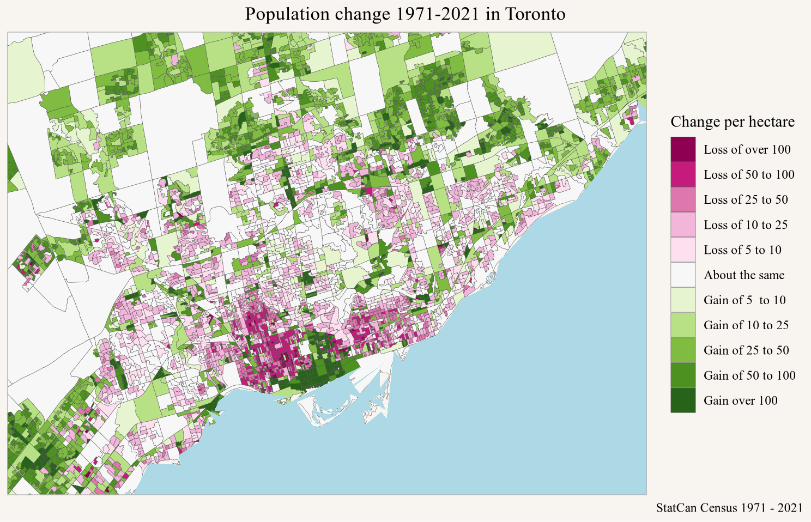{#fig-pop-timeline-toronto width=768}
:::
:::


The [interactive map](https://doodles.mountainmath.ca/html/yyz_pop_timeline_2021.html) makes it possible to browse the data in more detail. And it makes it possible to identify quirks likely due to geocoding problems. But what do these geocoding problems look like? Time for a concrete example.

## Crescent Town

A particular example, which also provided much of the motivation for this work, was flagged to me by Tai Huynh from [The Local](https://thelocal.to), who has been using this data to look in more detail at neighbourhood change in Toronto. Here the population jumped in erratic ways in the early census years as visualized in @fig-crescent-towm-density-change-map.


::: {.cell crop='true'}

```{.r .cell-code}
data_nb <- poly2nb(geo_data,row.names=geo_data$TongfenID,queen=TRUE)

id_example <- "35204370001"
id0 <- id_example

new_ids <- attr(data_nb,"region.id")[data_nb[[which(attr(data_nb,"region.id")==id0)]]]

cr_bbox <- geo_data |> filter(TongfenID %in% c(id0,new_ids)) |> st_bbox()


geo_data |>
  st_filter(cr_bbox |> st_as_sfc()) |>
  pivot_longer(matches("^\\d{4}$"),names_to="Year") |>
  mutate(pop=value/area) |>
  mutate(pop_d=pretty_cut(value,breaks=c(-Inf,0,50,100,200,500,1000,2000,3000,Inf),
                          format=scales::comma)) |>
  mutate(pop_d=fct_recode(pop_d,"0"="< 0")) |>
  ggplot(aes(fill=pop_d)) +
  geom_sf() +
  scale_fill_viridis_d() +
  coord_bbox(cr_bbox) +
  facet_wrap(~Year) +
  labs(title="Population density in Crescent Town",
       fill="Number of people",
       caption="StatCan Census 1971 - 2021")
```

::: {.cell-output-display}
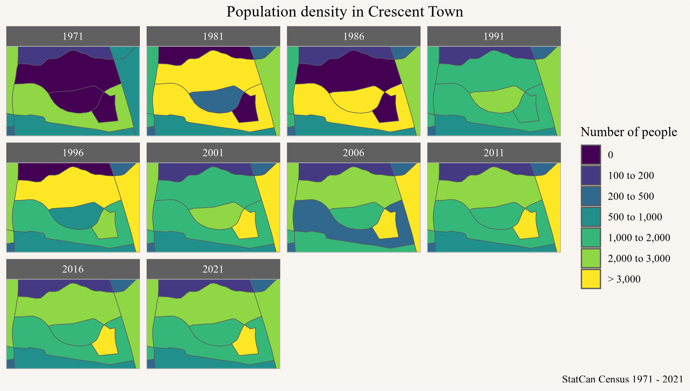{#fig-crescent-towm-density-change-map width=768}
:::
:::


We see the central moon-shaped area starting out with zero population in 1971, growing to very high population in 1986, but then dropping back to low levels in 1996. At the same time, some of the surrounding areas are showing opposite patterns.

In @fig-crescent-towm-density-change-graph we highlight the population timelines of the moon-shaped central area and the surrounding ones in a line graph.


::: {.cell}

```{.r .cell-code}
cr_colours <- setNames(c("black",RColorBrewer::brewer.pal(length(new_ids),"Dark2")),
                       c(id0,new_ids))

combined_data |> 
  filter(TongfenID %in% c(id0,new_ids)) |>
  pivot_longer(-TongfenID,names_to="Year") |>
  ggplot(aes(x=as.integer(Year),y=value,colour=TongfenID)) +
  scale_color_manual(values=cr_colours) +
  geom_point(shape=21) +
  geom_line() +
  geom_line(data=~filter(.,TongfenID==id0),linewidth=1) +
  scale_x_continuous(breaks=all_years) +
  scale_y_continuous(labels=scales::comma) +
  labs(title="Population timelines in candidate and neighbouring regions",
       x=NULL,y="Number of people")
```

::: {.cell-output-display}
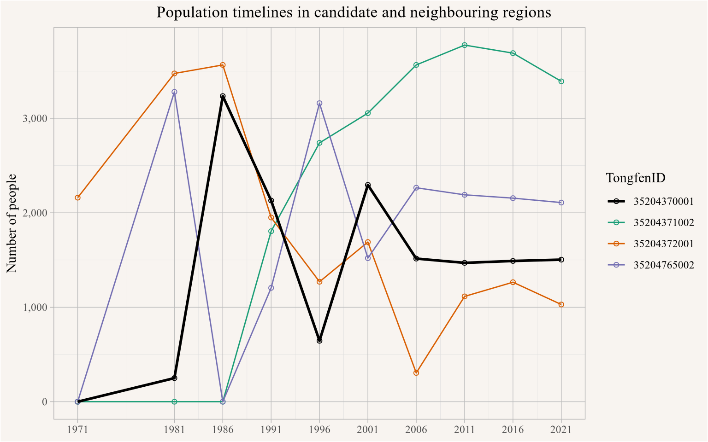{#fig-crescent-towm-density-change-graph width=768}
:::
:::


@fig-crescent-towm-tongfenid-graph shows the regions shown here on a map for added context.


::: {.cell crop='true'}

```{.r .cell-code}
geo_data |>
  st_filter(cr_bbox |> st_as_sfc()) |>
  pivot_longer(matches("^\\d{4}$"),names_to="Year") |>
  mutate(pop=value/area) |>
  mutate(pop_d=pretty_cut(value,breaks=c(-Inf,0,50,100,200,500,1000,2000,3000,Inf),
                          format=scales::comma)) |>
  mutate(pop_d=fct_recode(pop_d,"0"="< 0")) |>
  filter(Year=="2021") |>
  ggplot() +
  geom_sf(data=~filter(.,!(TongfenID %in% c(id0,new_ids))),fill="grey") +
  geom_sf(aes(fill=TongfenID),show.legend = FALSE,
          data=~filter(.,TongfenID %in% c(id0,new_ids))) +
  geom_sf_label(aes(label=TongfenID),
                data=~filter(.,TongfenID %in% c(id0,new_ids))) +
  scale_fill_manual(values=cr_colours,guide='none') +
  coord_bbox(cr_bbox) +
  labs(title="Crescent Town geographic region identifiers",
       fill="Number of people", x=NULL,y=NULL,
       caption="StatCan Census 2016 dissemination areas")
```

::: {.cell-output-display}
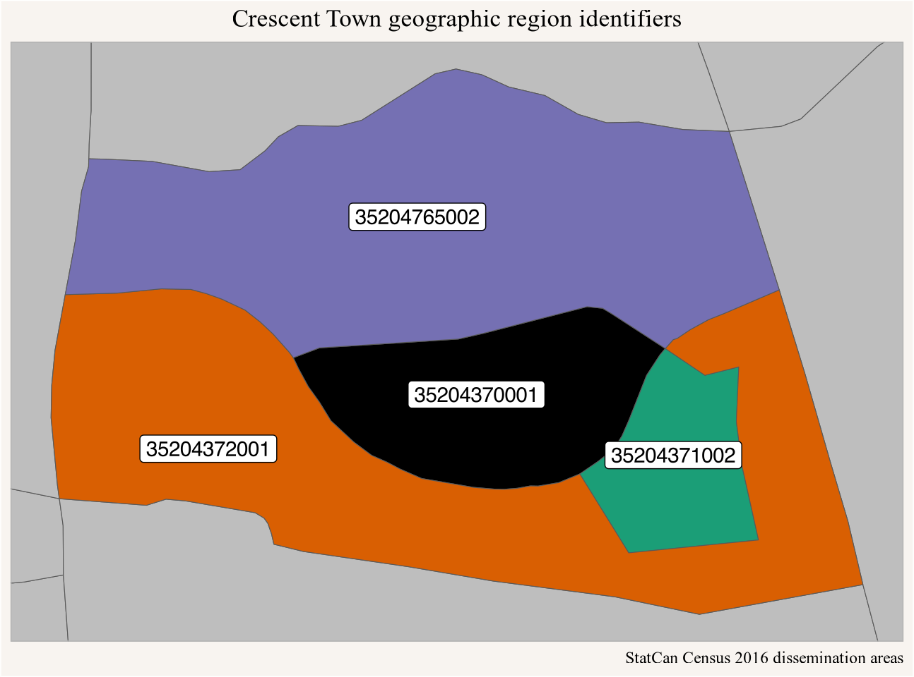{#fig-crescent-towm-tongfenid-graph width=768}
:::
:::


The erratic behaviour of the timelines in the individual regions is quite striking, especially regions with zero population at the start point to development in previously undeveloped (for housing) areas that might come along with reconfiguration of streets that trigger geocoding inconsistencies, and population dropping from high values to zero is a red flag. But if we squint long enough at the data we notice that among those regions there are two pairs with complementary and partially cancelling patterns. @fig-crescent-towm-density-change-graph-combined shows what happens when we combine join the region, and the corresponding populations.


::: {.cell}

```{.r .cell-code}
id2 <- "35204372001"

id2 <- "35204765002"

combined_data |> 
  filter(TongfenID %in% c(id0,new_ids)) |>
  pivot_longer(matches("^\\d{4}$"),names_to="Year") |>
  mutate(Type="Original") |>
  mutate(group=ifelse(TongfenID %in% c(id0,"35204765002"),"Group 1","Group 2")) %>%
  bind_rows((.) |> 
              summarize(value=sum(value),
                        TongfenID=paste0(unique(TongfenID),collapse="_"),
                        .by=c(Year,group)) |>
              mutate(Type="Combined") ) |>
  ggplot(aes(x=as.integer(Year),y=value,colour=TongfenID,linetype=grepl("_",TongfenID))) +
  geom_point(shape=21) +
  geom_line(data=~filter(.,!grepl("_",TongfenID))) +
  facet_wrap(~group) +
  scale_colour_manual(values=cr_colours) +
  scale_x_continuous(breaks=all_years) +
  scale_y_continuous(labels=scales::comma) +
  scale_linetype_manual(values=c("TRUE"="solid","FALSE"="dashed"),
                        labels=c("TRUE"="Combined","FALSE"="Original")) +
  geom_line(data=~filter(.,grepl("_",TongfenID)),linewidth=1,colour="firebrick") +
  labs(title="Population timelines in candidate and neighbouring regions",
       linetype=NULL,
       x=NULL,y="Number of people")
```

::: {.cell-output-display}
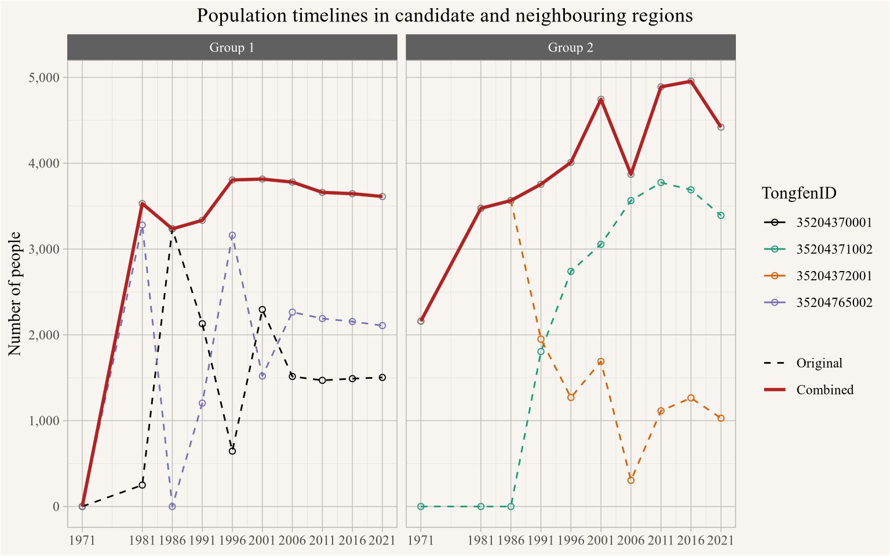{#fig-crescent-towm-density-change-graph-combined width=768}
:::
:::


The lines in red showing the populations of the combined regions are much more stable and don't exhibit the drastic population changes that the individual regions do. This gives us fairly high confidence that the dramatic population changes in the individual regions were caused by geocoding errors, and that combining the regions fixes this (at the expense of moving to a slightly coarser geography). @fig-crescent-towm-density-change-graph-combined-map shows the resulting timeline on the combined geographic regions.


::: {.cell crop='true'}

```{.r .cell-code}
geo_data |>
  st_filter(cr_bbox |> st_as_sfc()) |>
  mutate(TongfenID=ifelse(TongfenID != id2 & TongfenID %in% c(id0,new_ids),"Combined",TongfenID)) |>
  pivot_longer(matches("^\\d{4}$"),names_to="Year") |>
  group_by(TongfenID,Year) |>
  summarize(value=sum(value),area=sum(area),.groups="drop") |>
  mutate(pop=value/area) |>
  mutate(pop_d=pretty_cut(value,breaks=c(-Inf,0,50,100,200,500,1000,2000,3000,5000,7500,Inf),
                          format=scales::comma)) |>
  mutate(pop_d=fct_recode(pop_d,"0"="< 0")) |>
  ggplot(aes(fill=pop_d)) +
  geom_sf() +
  scale_fill_viridis_d() +
  coord_bbox(cr_bbox) +
  facet_wrap(~Year) +
  labs(title="Population density in Crescent Town",
       fill="Number of people",
       caption="StatCan Census 1971 - 2021")
```

::: {.cell-output-display}
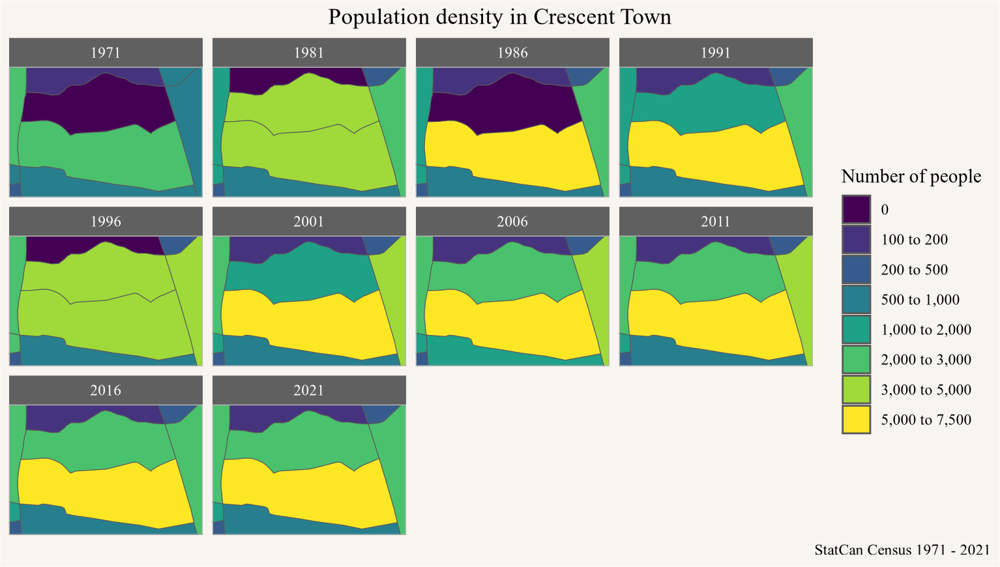{#fig-crescent-towm-density-change-graph-combined-map width=768}
:::
:::


Hopefully this example has made the problem clear, and also shown, at least in principle, how to fix this problem. But this becomes a daunting task when we have to do this for all 7,518 regions in Metro Toronto. We need a way to automate this process.

# Automating the process

Automation comes with risks of missing regions that should be combined, and on the flip side it risks of being too aggressive and joining regions with suspicious population changes that aren't due to geocoding but to real processes on the ground. And these risks vary by region and by type of data considered. We need a process that is flexible enough to be adapted to a range of situations, and that can be calibrated based on use cases and tolerance for type 1 vs type 2 errors.

## Identifying potential geocoding problems

As a first step we have to draw up a list of candidate regions that might have geocoding problems. Intuitively we are looking regions with "surprising" jumps in population. But what makes a population change "surprising"? We have looked a similar problem before [@surprise.2017], to determine surprise we have to first build an expectation of what the population change might look like and then look for significant deviations from this expectation.

Do build and expectation of population change we have to understand the data generation process. Generally, we expect population change to be gradual, with possibly large increases when new residential development occurs. Strong decreases in population are less common, but they could occur e.g. during a large scale fire or natural disaster. Based on this we formulate our expectation fairly broadly as "significant population decreases over relatively short periods of time are surprising". This will constitute our first round of candidate areas for geocoding problems.

What constitutes "significant" or "surprising" change is context dependent, @fig-surprise-yyz gives an overview of the distribution of the negative absolute and relative population changes in the data.


::: {.cell}

```{.r .cell-code}
combined_data |>
  pivot_longer(matches("^\\d{4}$"),names_to="Year") |>
  arrange(Year) |>
  mutate(`Absolute change`=value-lag(value,order_by = Year),
         `Relative change`=value/lag(value,order_by = Year)-1,
         .by=TongfenID) |>
  mutate(Period=paste0(lag(Year,order_by=Year),"-",Year),.by=TongfenID) |>
  filter(Year>min(Year)) |>
  pivot_longer(matches("change"),values_to="change") |>
  filter(change<0) |>
  ggplot(aes(x=change,fill=Period)) +
  geom_histogram() +
  facet_wrap(~name,scales="free_x") +
  scale_y_continuous(labels=scales::comma) +
  labs(title="Distribution of negative population changes",
       x="Population change",
       y="Number of regions and periods")
```

::: {.cell-output-display}
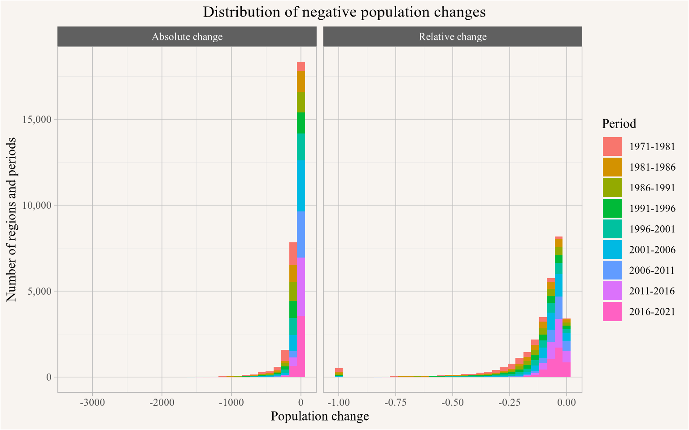{#fig-surprise-yyz width=768}
:::
:::


Based on this we somewhat heuristically and conservatively take a population drop of at least 100 people and at least 20% between two census periods as starting to be a "surprising" change and formalize this by modelling the amount of "surprise" with an inverse exponential distribution with a "surprise" value of 0 at 0 population change and a "surprise" value of 0.5 at 0.25 and 100 relative and absolute population change respectively. We then estimate the total surprise by multiplying the relative and absolute surprise values, with our candidate regions being those with a total surprise of at least 0.25, so just capturing a case where a region's population decreased by 0.25% and 100 people. @fig-total-surprise-yyz shows the distribution of total surprise.


::: {.cell}

```{.r .cell-code}
rel_surprise <- function(x){
  r <- as.integer(x<=0 & !is.na(x) & is.finite(x))
  r[r==1] <-  1-dexp(x[r==1]*log(0.5)/0.25, rate=1)
  r
}

abs_surprise <- function(x){
  r <- as.integer(x<=0 & !is.na(x) & is.finite(x))
  r[r==1] <- 1-dexp(x[r==1]*log(0.5)/200, rate=1)
  r
}

add_surprise <- function(data,base_field="value") {
  data |>
    arrange(Year) |>
    mutate(`Absolute change`=value-lag(value,order_by = Year),
           `Relative change`=`Absolute change`/lag(!!as.name(base_field),order_by = Year),
           .by=TongfenID) |>
    # mutate(surprise=1-(1-rel_surprise(`Relative change`))*(1-abs_surprise(`Absolute change`))) |>
    mutate(surprise=(rel_surprise(`Relative change`))*(abs_surprise(`Absolute change`))) |> # we want both!
    
    mutate(Period=paste0(lag(Year,order_by=Year),"-",Year),.by=TongfenID) |>
    mutate(surprise_count=sum(surprise>0.75,na.rm=TRUE),.by=TongfenID)
}


combined_data |>
  pivot_longer(matches("^\\d{4}$"),names_to="Year") |>
  add_surprise() |>
  filter(surprise>0) |>
  filter(Year!=min(Year)) |>
  ggplot(aes(x=surprise,fill=Period)) +
  geom_histogram() +
  scale_y_continuous(labels=scales::comma) +
  labs(title="Distribution of surprising population changes",
       x="Surprise",
       y="Number of regions and periods")
```

::: {.cell-output-display}
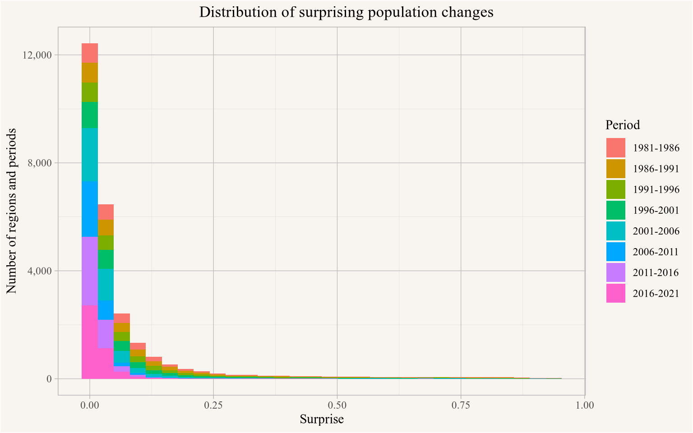{#fig-total-surprise-yyz width=768}
:::
:::


To get a better view of the regions we are most interested in we zoom in a bit and only show regions with a total surprise of at least 0.15 in @fig-total-surprise-yyz-zoomed.


::: {.cell}

```{.r .cell-code}
combined_data |>
  pivot_longer(matches("^\\d{4}$"),names_to="Year") |>
  add_surprise() |>
  filter(surprise>0) |>
  filter(Year!=min(Year)) |>
  filter(surprise>0.15) |>
  ggplot(aes(x=surprise,fill=Period)) +
  geom_histogram() +
  scale_y_continuous(labels=scales::comma) +
  labs(title="Distribution of surprising population changes",
       x="Surprise",
       y="Number of regions and periods")
```

::: {.cell-output-display}
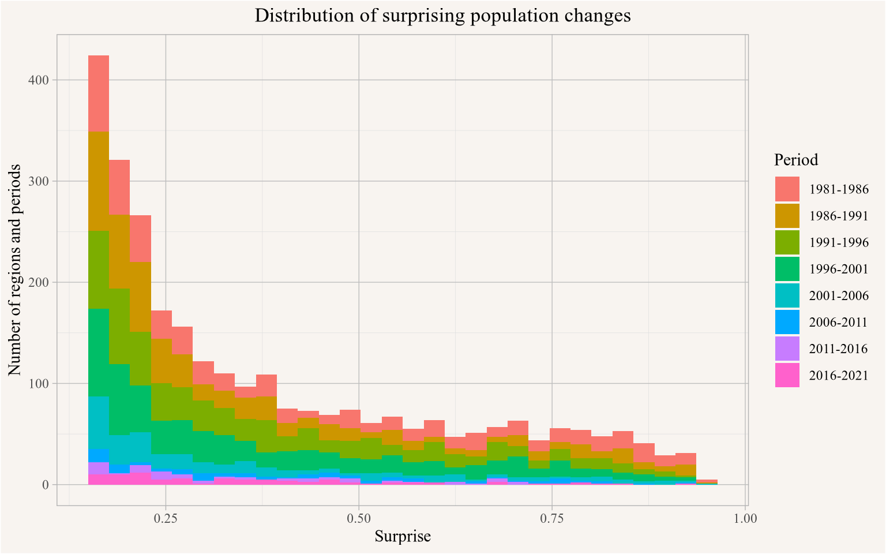{#fig-total-surprise-yyz-zoomed width=768}
:::
:::


We note that the candidates lean heavy toward the earlier periods, which is expected when looking for geocoding errors, but also consistent with this being a time period of slower growth, and possibly stronger declines in some areas that reflects real conditions on the ground. But as mentioned above, not all these surprising population changes are due to geocoding errors. And geocoding errors can also lead to strong increases in population. To account for this we take the first round candidates and consider the neighbouring regions for each of these to look for complementary patterns with population boosts in years where we see surprising population drops.

To implement this we make this more precise. Ideally we would look at the joint distribution of pairs (or higher order combinations) of regions and estimate the surprise and reduction in surprise at that level, but for exploratory as well as practical considerations regarding the computational intensity of such an approach we settle for a more pedestrian approach. At this point this is still somewhat heuristic, we plan on refining this and settling on a principled and parsimonious approach. At this point, we proceed as follows. We rank all regions by *total surprise* by taking the $L^p$ norm across years, with $p$ chosen to be 4 in this case, but retaining the ability to tune this further in order to trade off between only considering the maximum surprise across years ($p=\infty$) and simply taking the sum of all the individual surprises ($p=1$) across years.

Guided by our example case we will look for neighbouring regions that, when combined with the candidate region, result in a significant drop in our *surprise* metric when joining the regions. To estimate the reduction in surprise we remain mindful that surprise decreases when we simply add a region with flat population as that increases the denominators in our relative surprise measure. To avoid this effect and measure the reduction in surprise in a comparable way we keep the original denominators but the take the combined change in population as new numerators when evaluating the change in surprise. When then combine the regions if the relative or absolute reduction in surprise passes a specified threshold that we deemed significant enough. We repeat this process until we don't see any significant reductions in surprise anymore.


::: {.cell}

```{.r .cell-code}
get_match_list <- function(geo_data2,
                           cutoff_fact = 0.6,total_surprise_cutoff = 0.75, 
                           surprise_reduction_const=0.15, sum_fact = 0.7,p=4) {
  
  data_nb <- poly2nb(geo_data2, row.names=geo_data2$TongfenID, queen=TRUE)

  summarize_surprise <- function(data,fields="surprise"){
    data |>
      summarize(across(all_of(fields),list(count= ~sum(.x>0.15),
                                           total= ~(sum(.x^p))^(1/p))),
                .by=TongfenID) |>
      arrange(!!as.name(paste0(fields[1],"_count")),!!as.name(paste0(fields[1],"_total")))
  }
  
  long_data2 <- geo_data2 |>
    st_drop_geometry() |>
    select(TongfenID,matches("^\\d{4}$")) |>
    pivot_longer(matches("^\\d{4}$"),names_to="Year") |>
    add_surprise()
  
  candidate_list <- long_data2 |>
    summarize_surprise() |>
    map_df(rev) |>
    filter(surprise_count>0,surprise_total > total_surprise_cutoff)
  
  match_list <- tibble(TongfenID=NA_character_,TongfenID_original=NA_character_) |>
    slice(-1)

  if (nrow(candidate_list)==0) return(match_list)

  
  
  for (i in 1:nrow(candidate_list)) {
    id0 <- candidate_list$TongfenID[i]
    
    if (id0 %in% match_list$TongfenID_original) next
    
    neighbour_ids <- attr(data_nb,"region.id")[data_nb[[which(attr(data_nb,"region.id")==id0)]]]
    
    if (length(neighbour_ids)==0) next
    
    od <- long_data2 |>
      filter(TongfenID %in% c(id0))
    
    original <-od |>
      summarize_surprise()

    reductions <- long_data2 |>
      filter(TongfenID %in% c(neighbour_ids)) |>
      left_join(od |> select(Year,ov=value),by="Year") |>
      mutate(value=value+ov) |>
      add_surprise(base_field="ov") |>
      rename(surprise_ov=surprise) |>
      add_surprise() |>
      summarize_surprise(c("surprise_ov","surprise")) |>
      slice(1)  |> 
      rename(TongfenID2=TongfenID) |>
      mutate(TongfenID1=original$TongfenID,.before=TongfenID2) |>
      mutate(TongfenID=paste0(TongfenID1,"_",TongfenID2))
    
    if (reductions$TongfenID2 %in% c(match_list$TongfenID_original)) next
    
    pre_sum <- long_data2 |>
      filter(TongfenID %in% c(reductions$TongfenID1,reductions$TongfenID2)) |>
      summarize_surprise()
    
    if (reductions$surprise_ov_total < cutoff_fact*original$surprise_total | 
        original$surprise_total - reductions$surprise_ov_total > surprise_reduction_const | 
        reductions$surprise_ov_total < cutoff_fact * sum_fact * sum(pre_sum$surprise_total)) {
      match_list <- bind_rows(match_list,
                              reductions  |>
                                pivot_longer(c(TongfenID1,TongfenID2),values_to="TongfenID_original"))
    }
  }
  match_list
}

iterate_geo_match_joins <- function(geo_data2, debug_level=0,...) {

  stop_looking <- FALSE

  while (!stop_looking) {
    
    match_list <- get_match_list(geo_data2,...)
    
    if (nrow(match_list)==0) {
      stop_looking <- TRUE
      next
    }
    
    if (debug_level>0) print(paste0("combining ",nrow(match_list)/2," region pairs..."))
    
    if (debug_level>1) {
      dm <- match_list |>
        mutate(n=str_split(TongfenID_original,"_") |> lapply(length) |> unlist()) |>
        filter(n>1)
      if (nrow(dm)>0) {
        print(paste0(nrow(dm)," multi-matches:"))
        1:nrow(dm) |> lapply(\(x)print(paste0(dm$TongfenID_original[x], " -- ",dm$TongfenID[x]))) |> unlist()
      }
    }
    
    stopifnot(match_list |> filter(duplicated(TongfenID_original)) |> nrow() ==0) # sanity check
    
    g1 <- geo_data2 |>
      rename(TongfenID_original=TongfenID) |>
      inner_join(match_list |> select(TongfenID,TongfenID_original),
                 by="TongfenID_original",
                 relationship = "many-to-one") |>
      mutate(TongfenID=coalesce(TongfenID,TongfenID_original)) |>
      select(-TongfenID_original) |>
      group_by(TongfenID) |>
      summarize(across(matches("area|\\d{4}"),sum), .groups="drop") |>
      st_make_valid()
    
    g2 <- geo_data2 |>
      filter(!(TongfenID %in% match_list$TongfenID_original)) 
    
    geo_data2 <- bind_rows(g1,g2)
  }
  geo_data2
}

geo_data2 <- iterate_geo_match_joins(geo_data,total_surprise_cutoff=0.4)


join_count <- nrow(geo_data)-nrow(geo_data2)
```
:::


The automated process performed 976 region joins, reducing the total number of regions from 7,518 to 6,542 to arrive at a slightly coarser geography. 


Checking back in with our motivating example of Crescent Town we see in @fig-crescent-town-check that the automatic process resulted in the same grouping that we had identified manually. 


::: {.cell}

```{.r .cell-code}
data_nb2 <- poly2nb(geo_data2,row.names = geo_data2$TongfenID, queen=TRUE)

id02 <- attr(data_nb2,"region.id")[grepl(id_example,attr(data_nb2,"region.id"))]

neighbour_ids2 <- attr(data_nb2,"region.id")[data_nb2[[which(attr(data_nb2,"region.id")==id02)]]]

main_ids <- geo_data2 |> 
  st_drop_geometry() |>
  filter(TongfenID %in% c(id02,neighbour_ids2)) |>
  select(TongfenID,matches("area|\\d{4}")) |>
  pivot_longer(matches("\\d{4}"),names_to="Year",values_to="value") |>
  mutate(n=strsplit(TongfenID,"_") |> 
           lapply(length) |> 
           unlist()) |>
  filter(n==2) |>
  select(TongfenID_new=TongfenID) |>
  mutate(TongfenID=str_split(TongfenID_new,"_")) |>
  unnest_longer(TongfenID) |>
  distinct()

geo_data |>
  st_drop_geometry() |>
  pivot_longer(matches("^\\d{4}$"),names_to="Year") |>
  inner_join(main_ids,by="TongfenID") |>
  mutate(Type="Original") %>%
  bind_rows(summarize(.,value=sum(value),.by=c(Year,TongfenID_new)) |>
              mutate(TongfenID=TongfenID_new,
                     Type="Combined")) |>
  ggplot(aes(x=as.integer(Year),y=value,colour=Type,group=TongfenID)) +
  #scale_color_manual(values=cr_colours2) +
  geom_point(shape=21) +
  geom_line() +
  facet_wrap(~TongfenID_new) +
  scale_x_continuous(breaks=all_years) +
  scale_y_continuous(labels=scales::comma) +
  scale_color_manual(values=c("brown","steelblue")) +
  geom_line(data=~filter(.,grepl("_",TongfenID)),linewidth=1) +
  labs(title="Population timelines in candidate and neighbouring regions",
       x=NULL,y="Number of people")
```

::: {.cell-output-display}
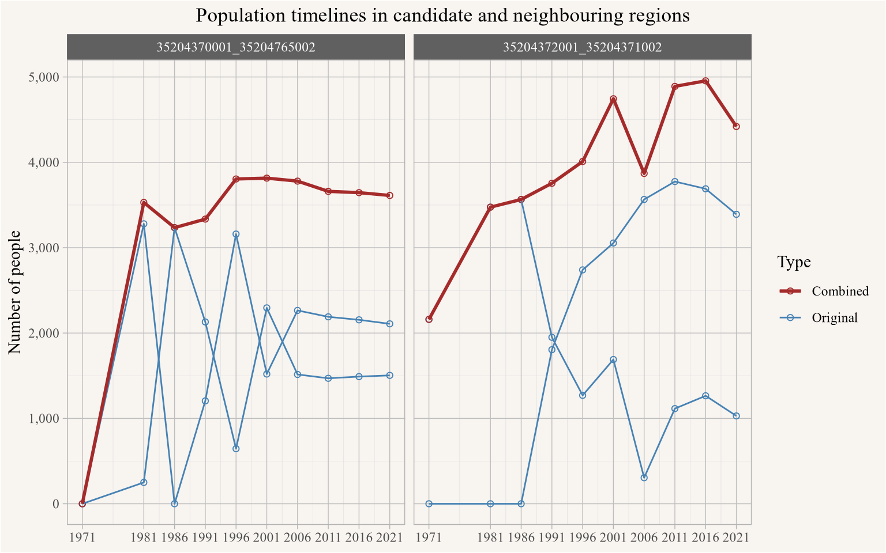{#fig-crescent-town-check width=768}
:::
:::


## Vancouver version

We can perform the same operations on the Vancouver data and identify possibly geocoding problems there, the resulting cumulative population change is shown in @fig-yvr-pop-change-map.


::: {.cell crop='true'}

```{.r .cell-code}
yvr_data_2021 <- get_census("2021",regions=list(CMA="59933"),level="DB",quiet = TRUE)
yvr_data_2016 <- get_census("2016",regions=list(CMA="59933"),level="DB",quiet = TRUE)

yvr_db_correspondence<-tongfen:::get_single_correspondence_ca_census_for("2021","DB") |>
  inner_join(yvr_data_2016 |> select(DBUID2016=GeoUID,DAUID2016=DA_UID),by="DBUID2016") |>
  full_join(yvr_data_2021 |> filter(Population>0) |> select(DBUID2021=GeoUID),by="DBUID2021") |>
  select(DBUID2021,DAUID2016) |>
  tongfen:::get_tongfen_correspondence()

yvr_tongfen_geos <- get_census("2016", regions=list(CMA="59933"), 
                           level="DA", geo_format="sf",quiet = TRUE) |>
  left_join(yvr_db_correspondence |>
              select(DAUID2016,TongfenID) |> unique(),by=c("GeoUID"="DAUID2016")) |>
  group_by(TongfenID) |>
  summarize(area=sum(`Shape Area`,na.rm=TRUE)*100,.groups="drop") 


years=c(1971,seq(1981,2011,5))
old_vectors <- years %>% lapply(\(y)paste0("v_CA",y,"x16_1")) |> unlist() |> set_names(years)
yvr_pop_data <- get_census("CA16CT",regions=list(CMA="59933"),
                   vectors=c(old_vectors,c("2016"="v_CA16_1")),level="DA",quiet = TRUE) %>%
  select_at(c("GeoUID",years %>% as.character,"2016")) %>%
  group_by(GeoUID) %>%
  summarise_all(sum,na.rm=TRUE) 

yvr_combined_data <- yvr_pop_data |>
  left_join(yvr_db_correspondence |> select(DAUID2016,TongfenID) |> unique(),by=c("GeoUID"="DAUID2016")) |>
  group_by(TongfenID) |>
  summarize(across(matches("^\\d{4}$"),\(x)sum(x,na.rm=TRUE)),.groups="drop") |>
  full_join(yvr_data_2021 |> 
              inner_join(yvr_db_correspondence |> 
                           select(DBUID2021,TongfenID) |> 
                           unique(),
                         by=c("GeoUID"="DBUID2021")) |> 
              summarize(`2021`=sum(Population,na.rm=TRUE),.by=TongfenID),
            by="TongfenID")

yvr_geo_data <- yvr_tongfen_geos |>
  mutate(area=round(area,2)) |>
  rmapshaper::ms_simplify(keep = 0.75,keep_shapes = TRUE) %>%
  left_join(yvr_combined_data,by="TongfenID") 


yvr_geo_data |>
  mutate(change=`2021`-`1971`) |>
  mutate(change_h=change/area) |>
  mutate(change_d=cut(change_h,breaks=breaks,labels=labels)) |>
  ggplot(aes(fill=change_d)) +
  geom_sf(linewidth=0.1) +
  scale_fill_manual(values=change_colors) +
  geom_water() +
  coord_bbox(metro_van_bbox('tight')) +
  labs(title="Population change 1971-2021 in Vancouver",
       fill="Change per hectare",
       caption="StatCan Census 1971 - 2021")
```

::: {.cell-output-display}
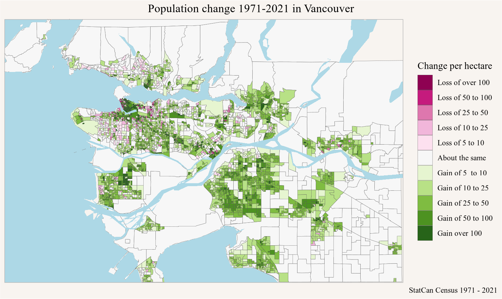{#fig-yvr-pop-change-map width=768}
:::
:::

Based on this we again look for surprising population changes, the distribution shown in @fig-yvr-surprise-distribution looks quite similar to the Toronto version.


::: {.cell}

```{.r .cell-code}
yvr_geo_data |>
  st_drop_geometry() |>
  pivot_longer(matches("^\\d{4}$"),names_to="Year") |>
  add_surprise() |>
  filter(surprise>0) |>
  filter(Year!=min(Year)) |>
  filter(surprise>0.15) |>
  ggplot(aes(x=surprise,fill=Period)) +
  geom_histogram() +
  scale_y_continuous(labels=scales::comma) +
  labs(title="Distribution of surprising population changes",
       x="Surprise",
       y="Number of regions and periods")
```

::: {.cell-output-display}
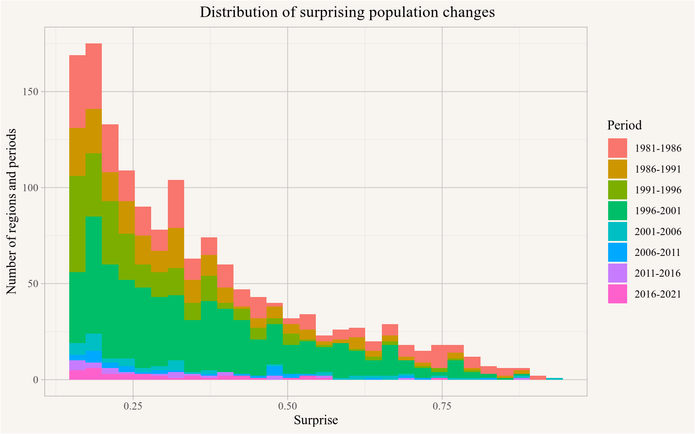{#fig-yvr-surprise-distribution width=768}
:::
:::

::: {.cell}

```{.r .cell-code}
yvr_geo_data2 <- iterate_geo_match_joins(yvr_geo_data,total_surprise_cutoff=0.4)


yvr_join_count <- nrow(yvr_geo_data)-nrow(yvr_geo_data2)
```
:::


Repeating the procedure with the same parameters as in Toronto results in 416 region matches and correspondingly slightly coarser geographies.


Once this is automated it's simple to apply this to other regions or other types of data. But it's generally a good idea to take a more detailed look at how it performs on some examples.

## Little Mountain

One danger of employing this procedure is that we might lose information of localized population declines that are real. Strong real population declines are rare, population change tends to be slow and dramatic declines rarely manifest themselves over a single 5 year inter-census period. But there are some examples where we can see *surprising* population declines that correspond to real process, Little Mountain in Vancouver provides a prominent example, with plenty of [good news coverage with background information](https://vancouversun.com/news/local-news/vancouvers-little-mountain-the-money-and-the-sad-history-behind-a-long-stalled-project). This was a social housing development that got sold off by the province to private developers and most tenants were evicted in 2009 and buildings were subsequently torn down, with planned replacement housing on the site mostly stalled since then. This lead to a *surprising* drop in population in those areas between the 2006 and 2011 censuses as can be seen when looking at census timelines of the two corresponding dissemination areas. @fig-little-mountain-map shows the population change 2006 to 2011 in the two regions covering the Little Mountain development, as well as the surrounding regions.


::: {.cell crop='true'}

```{.r .cell-code}
little_mountain <- st_as_sf(data.frame(x=-123.104,y=49.238),crs=4326,coords=c("x","y")) 
yvr_data_nb <- poly2nb(yvr_geo_data,row.names=yvr_geo_data$TongfenID,queen=TRUE)

little_mountain_ids <- yvr_geo_data |> st_filter(little_mountain |> st_buffer(50)) |> pull(TongfenID)


little_mountain_neighbour_ids <-
  attr(yvr_data_nb,"region.id")[unlist(yvr_data_nb[which(grepl(paste0(little_mountain_ids,collapse="|"),
                                                   attr(yvr_data_nb,"region.id")))])]

yvr_geo_data |> 
  filter(TongfenID %in% c(little_mountain_ids,little_mountain_neighbour_ids))|>
  ggplot(aes(fill=`2011`/`2006`-1)) +
  geom_sf(linewidth=1) +
  geom_sf(data=~filter(.,TongfenID %in% little_mountain_ids),linewidth=2,color="firebrick") +
  geom_sf_label(data=~filter(.,TongfenID %in% little_mountain_ids),
                aes(label=TongfenID),colour="white") +
  scale_fill_gradient2(labels=scales::percent) +
  geom_water() +
  geom_roads() +
  coord_sf(datum=NA) +
  labs(title="Population change 2006 to 2011 in Little Mountain and neighbouring regions",
       fill="Change\n2006-2011",
       x=NULL,y=NULL,
       caption="StatCan Census 2006 - 2011")
```

::: {.cell-output-display}
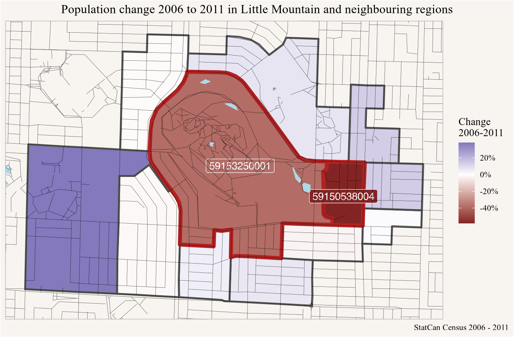{#fig-little-mountain-map width=768}
:::
:::


The two areas that overlap the Little Mountain site also include neighbouring regions, but the drop in population is noticeable for both.

@fig-little-mountain-timelines shows the full timelines of the regions, we note that neighbouring regions don't exhibit complementary patterns that suggest that this drop was due to geocoding errors. 


::: {.cell}

```{.r .cell-code}
yvr_geo_data |> 
  filter(TongfenID %in% c(little_mountain_ids,little_mountain_neighbour_ids))|>
  pivot_longer(matches("^\\d{4}$"),names_to="Year") |>
  mutate(little_mountain=TongfenID %in% little_mountain_ids) |>
  ggplot(aes(x=as.integer(Year),y=value,colour=TongfenID,linetype=little_mountain)) +
  geom_line() +
  geom_line(data=~filter(.,TongfenID %in% little_mountain_ids),linewidth=1) +
  geom_point(data=~filter(.,TongfenID %in% little_mountain_ids)) +
  scale_x_continuous(breaks=all_years) +
  scale_y_continuous(labels=scales::comma) +
  scale_linetype_manual(values=c("TRUE"="solid","FALSE"="dashed"),
                        labels=c("TRUE"="Little Mountain","FALSE"="Neighbouring regions")) +
  labs(title="Population timelines in Little Mountain and neighbouring regions",
       linetype=NULL,
       x=NULL,y="Number of people")
```

::: {.cell-output-display}
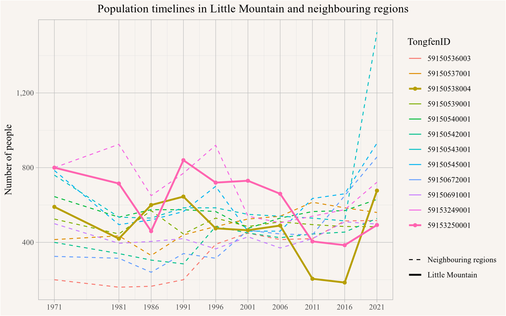{#fig-little-mountain-timelines width=768}
:::
:::


While the algorithm does flag the regions as *possible candidates* for geocoding errors, it does not find enough evidence that this is due to patterns consistent with geocoding problems because of the lack of complementary patterns in neighbouring regions. Considering examples like this can help calibrate the sensitivity of the algorithm.


# Conclusion

The current implementation is useful and effective in detecting and dealing with geocoding problems where data gets misattributed to neighbouring regions. Dealing with this is important as these errors tend to happen precisely in regions that have experienced significant change and thus correlate with changes in density, which has a high chance of biasing analysis. The process of joining regions across boundaries that were subject to geocoding problems solves this problem in a similar way that Tongfen solves the problem of changing census geographies across time, and most importantly it does so in a way that avoids biasing the analysis.

The downside is the loss of control over the exact geographic regions used to aggregate the data and a resulting slightly coarser geography. In applications where it is important to retain the given geographies one has to find other solutions to solve this problem.

In the near future we plan to integrate this functionality in the Tongfen package to make it easier to use, and also to tie into existing functionality to re-aggregate data on joint geographies.


As usual, the code for this post is [available on GitHub](https://github.com/mountainMath/mountain_doodles/blob/main/posts/2024-07-26-geocoding-errors-in-aggregate-data/index.qmd) for anyone to reproduce or adapt for their own purposes.


<details>

<summary>Reproducibility receipt</summary>


::: {.cell}

```{.r .cell-code}
## datetime
Sys.time()
```

::: {.cell-output .cell-output-stdout}

```
[1] "2024-07-26 10:01:26 PDT"
```


:::

```{.r .cell-code}
## repository
git2r::repository()
```

::: {.cell-output .cell-output-stdout}

```
Local:    main /Users/jens/R/mountain_doodles
Remote:   main @ origin (https://github.com/mountainMath/mountain_doodles.git)
Head:     [cfd8e12] 2024-07-25: updated image in md
```


:::

```{.r .cell-code}
## Session info
sessionInfo()
```

::: {.cell-output .cell-output-stdout}

```
R version 4.4.0 (2024-04-24)
Platform: aarch64-apple-darwin20
Running under: macOS Sonoma 14.5

Matrix products: default
BLAS:   /Library/Frameworks/R.framework/Versions/4.4-arm64/Resources/lib/libRblas.0.dylib 
LAPACK: /Library/Frameworks/R.framework/Versions/4.4-arm64/Resources/lib/libRlapack.dylib;  LAPACK version 3.12.0

locale:
[1] en_US.UTF-8/en_US.UTF-8/en_US.UTF-8/C/en_US.UTF-8/en_US.UTF-8

time zone: America/Vancouver
tzcode source: internal

attached base packages:
[1] stats     graphics  grDevices utils     datasets  methods   base     

other attached packages:
 [1] cancensus_0.5.8           mountainmathHelpers_0.1.4
 [3] spdep_1.3-5               spData_2.3.1             
 [5] tongfen_0.3.6             sf_1.0-16                
 [7] lubridate_1.9.3           forcats_1.0.0            
 [9] stringr_1.5.1             dplyr_1.1.4              
[11] purrr_1.0.2               readr_2.1.5              
[13] tidyr_1.3.1               tibble_3.2.1             
[15] ggplot2_3.5.1             tidyverse_2.0.0          

loaded via a namespace (and not attached):
 [1] tidyselect_1.2.1   farver_2.1.2       fastmap_1.2.0      lazyeval_0.2.2    
 [5] digest_0.6.35      timechange_0.3.0   lifecycle_1.0.4    geojsonio_0.11.3  
 [9] magrittr_2.0.3     compiler_4.4.0     rlang_1.1.4        tools_4.4.0       
[13] utf8_1.2.4         yaml_2.3.8         knitr_1.47         labeling_0.4.3    
[17] htmlwidgets_1.6.4  bit_4.0.5          sp_2.1-4           classInt_0.4-10   
[21] curl_5.2.1         RColorBrewer_1.1-3 KernSmooth_2.23-22 httpcode_0.3.0    
[25] withr_3.0.0        rmapzen_0.5.1      grid_4.4.0         fansi_1.0.6       
[29] git2r_0.33.0       e1071_1.7-14       colorspace_2.1-0   scales_1.3.0      
[33] crul_1.4.2         tinytex_0.51       cli_3.6.3          rmarkdown_2.27    
[37] crayon_1.5.2       generics_0.1.3     rstudioapi_0.16.0  geojson_0.3.5     
[41] httr_1.4.7         tzdb_0.4.0         DBI_1.2.3          proxy_0.4-27      
[45] assertthat_0.2.1   parallel_4.4.0     s2_1.1.6           vctrs_0.6.5       
[49] V8_4.4.2           boot_1.3-30        jsonlite_1.8.8     geojsonsf_2.0.3   
[53] hms_1.1.3          bit64_4.0.5        magick_2.8.3       rmapshaper_0.5.0  
[57] units_0.8-5        glue_1.7.0         codetools_0.2-20   stringi_1.8.4     
[61] gtable_0.3.5       deldir_2.0-4       munsell_0.5.1      pillar_1.9.0      
[65] htmltools_0.5.8.1  R6_2.5.1           jqr_1.3.3          wk_0.9.1          
[69] vroom_1.6.5        evaluate_0.23      lattice_0.22-6     class_7.3-22      
[73] Rcpp_1.0.12        xfun_0.44          pkgconfig_2.0.3   
```


:::
:::


</details>


