<p style="text-align:center;"><i>(Joint with Nathan Lauster and cross-posted at <a href="https://homefreesociology.com/2024/08/12/distributional-effects-of-adding-housing/" target="_blank">HomeFreeSociology</a>)</i></p>


Who would benefit from dramatically expanding the supply of housing in the market? How would such an expansion address housing need? What non-market interventions would still be required to meet remaining need? How would it influence household formation and migration? This post is picking up where we left off on our housing targets post [@housing-targets.2023], grappling with the distributional effects of adding new housing to the market. To recap: one way of setting housing targets is to figure out how much housing municipalities would have if they weren't actively restricting its construction. We can do that by estimating how much additional housing would be profitable to build. Setting that amount of housing as a target works to enable market mechanisms to bring housing supply in line with demand.

Our version of housing targets sets a (high) overall target number for net new housing, and that's it. There are other versions of targets that attempt to more finely tailor numbers, keyed for instance to specific income bands. Here we explain why we think starting with an overall number is the right approach, insofar as adding housing has distributional effects across the entire system. It is generally understood that increasing the housing supply lowers prices of existing housing, all else being equal. What's less clear are the systemic effects of adding housing and how even expensive new housing helps address underlying housing need. These broad distributional effects of reaching housing targets are what we want to address here.

# TL;DR


::: {.cell}

```{.r .cell-code}
pumf_2021 <- get_pumf("Census","2021") |>
  label_pumf_data(rename_columns = FALSE) |>
  mutate(hh_lower=case_when(HHINC=="Under $2,000" ~ 0,
                         TRUE ~ as.numeric(gsub("\\$|,","",str_extract(as.character(HHINC),"^\\$[\\d,]+")))),
         hh_upper=case_when(HHINC=="$250,000 and over" ~ 350000,
                         TRUE~as.numeric(gsub("\\$|,","",str_extract(as.character(HHINC),"\\$[\\d,]+$"))))) %>%
  mutate(hh_income=(hh_lower+hh_upper)/2) |>
  mutate(max_rent=hh_income*0.3) |>
  mutate(max_rent2=hh_income*0.5) |>
  mutate(gap=pmax(SHELCO*12-max_rent,0)) |>
  mutate(gap2=pmax(SHELCO*12-max_rent2,0)) |>
  mutate(TENUR=fct_recode(TENUR,"Renter"="Renter or Dwelling provided by the local government, First Nation or Indian band")) |>
  mutate(CMA=fct_recode(CMA,"Other"="Other census metropolitan areas, census agglomerations and other geographies")) |>
  mutate(Year="2021")

pumf_2016 <- get_pumf("Census","2016") |>
  label_pumf_data(rename_columns = FALSE) |>
  mutate(hh_lower=case_when(HHINC=="Under $2,000" ~ 0,
                         TRUE ~ as.numeric(gsub("\\$|,","",str_extract(as.character(HHINC),"^\\$[\\d,]+")))),
         hh_upper=case_when(HHINC=="$250,000 and over" ~ 350000,
                         TRUE~as.numeric(gsub("\\$|,","",str_extract(as.character(HHINC),"\\$[\\d,]+$"))))) %>%
  mutate(across(c(TOTINC,SHELCO),as.numeric)) %>%
  mutate(TOTINC=ifelse(TOTINC>=88888888,NA,TOTINC)) |>
  mutate(hh_income=(hh_lower+hh_upper)/2) |>
  mutate(max_rent=hh_income*0.3) |>
  mutate(max_rent2=hh_income*0.5) |>
  mutate(gap=pmax(SHELCO*12-max_rent,0)) |>
  mutate(gap2=pmax(SHELCO*12-max_rent2,0)) |>
  mutate(TENUR=fct_recode(TENUR,"Renter"="Rented or Band housing","Owner"="Owned by a member of the household")) |>
  mutate(CMA=fct_recode(CMA,"Other"="Other census metropolitan areas, census agglomerations and other geographies",
                        "Greater Sudbury – Thunder Bay"="Greater Sudbury / Grand Sudbury – Thunder Bay",
                        "Kelowna – Abbotsford-Mission"="Kelowna – Abbotsford"))  |>
  mutate(Year="2016")

pumf_2011 <- get_pumf("Census","2011") |>
  label_pumf_data(rename_columns = FALSE) |>
  mutate(hh_lower=case_when(HHINC=="Under $2,000" ~ 0,
                         TRUE ~ as.numeric(gsub("\\$|,","",str_extract(as.character(HHINC),"^\\$[\\d,]+")))),
         hh_upper=case_when(HHINC=="$250,000 and over" ~ 350000,
                         TRUE~as.numeric(gsub("\\$|,","",str_extract(as.character(HHINC),"\\$[\\d,]+$"))))) %>%
  mutate(TENUR=fct_recode(TENUR,"Renter"="Rented or Band housing","Owner"="Owned by a member of the household")) |>
  mutate(across(c(TOTINC,GROSRT,OMP),as.numeric)) %>%
  mutate(TOTINC=ifelse(TOTINC>=88888888,NA,TOTINC),
         GROSRT=ifelse(GROSRT>=8888,NA,GROSRT),
         OMP=ifelse(OMP>=8888,NA,OMP)) |>
  mutate(SHELCO=coalesce(GROSRT,OMP)) |>
  mutate(hh_income=(hh_lower+hh_upper)/2) |>
  mutate(max_rent=hh_income*0.3) |>
  mutate(max_rent2=hh_income*0.5) |>
  mutate(gap=pmax(SHELCO*12-max_rent,0)) |>
  mutate(gap2=pmax(SHELCO*12-max_rent2,0)) |>
  mutate(CMA=fct_recode(CMA,"Other"="Other census metropolitan areas, census agglomerations and other geographies",
                        "Greater Sudbury – Thunder Bay"="Greater Sudbury / Grand Sudbury – Thunder Bay",
                        "Kelowna – Abbotsford-Mission"="Kelowna – Abbotsford"))  |>
  mutate(Year="2011")


pumf_selects <- c("CMA","AGEGRP","PRIHM","TENUR","HCORENEED_IND","SHELCO",
                  "BEDRM","MOB1","MOB5","TOTINC","EFDECILE","SUBSIDY",
                  "hh_income","max_rent","max_rent2",
                  "gap","gap2","Year","WEIGHT")

pumf_data <- bind_rows(pumf_2011 |> select(any_of(pumf_selects)),
                       pumf_2016 |> select(any_of(pumf_selects)),
                       pumf_2021 |>  select(any_of(pumf_selects))) |>
  mutate(Year=factor(Year)) |>
  mutate(EFDECILE=fct_recode(EFDECILE,
                             !!!setNames(pumf_2021$EFDECILE |> levels(),
                                         pumf_2016$EFDECILE |> levels())),
         SUBSIDY=fct_recode(SUBSIDY,
                             !!!setNames(c("Not subsidized", "Subsidized", "Not available", "Not applicable"),
                                         c("No, not a subsidized dwelling", "Yes, a subsidized dwelling", "Not available", "Not applicable" ))))

pd1 <- pumf_data |>
  filter(CMA=="Vancouver",Year!="2011") |>
  filter(!is.na(gap),TENUR!="Not available",PRIHM != "Not applicable") |>
  mutate(cw=ifelse(gap>0,WEIGHT,0),
         cw2=ifelse(gap2>0,WEIGHT,0))

tenure_colours <- setNames(sanzo::duos$c071,c("Renter","Owner"))

price_fact <- 0.7
pd2 <- pumf_data |>
  mutate(fact=ifelse(TENUR=="Owner",1,price_fact)) |>
  mutate(gap=pmax(SHELCO*12*fact-max_rent,0)) |>
  mutate(gap2=pmax(SHELCO*12*fact-max_rent2,0)) |>
  filter(!is.na(gap),PRIHM != "Not applicable",TENUR!="Not available") |>
  mutate(cw=ifelse(gap>0,WEIGHT,0),
         cw2=ifelse(gap2>0,WEIGHT,0)) |>
  filter(CMA=="Vancouver",Year!="2011") |>
  mutate(cw=ifelse(gap>0,WEIGHT,0),
         cw2=ifelse(gap2>0,WEIGHT,0))

effect_colours <- setNames(sanzo::duos$c070,c("Actual","Successful\nhousing target"))

inflation <- get_cansim_vector("v41690973") |>
  filter(strftime(Date,"%m")=="05") |>
  mutate(Year=strftime(Date,"%Y")) |>
  filter(Year %in% levels(pumf_data$Year)) |>
  mutate(Year=factor(Year, levels=levels(pumf_data$Year))) |>
  mutate(CPI=VALUE/last(VALUE,order_by=Year)) |>
  select(Year,CPI)


summary_data <- bind_rows(pd2 |> mutate(Type="Successful\nhousing target"),
                          pd1|> mutate(Type="Actual")) |>
  mutate(Type=factor(Type,levels=names(effect_colours))) |>
  filter(TENUR=="Renter") |>
  filter(PRIHM=="Person is primary maintainer") |>
  filter(gap>0) |>
  summarize(Households=sum(WEIGHT),
            gap=sum(gap*WEIGHT),
            .by=c(Type,TENUR,HCORENEED_IND,Year)) 

summary_data_people <- bind_rows(pd2 |> mutate(Type="Successful\nhousing target"),
                                 pd1|> mutate(Type="Actual")) |>
  mutate(Type=factor(Type,levels=names(effect_colours))) |>
  filter(TENUR=="Renter") |>
  filter(gap>0) |>
  summarize(People=sum(WEIGHT),
            gap=sum(gap*WEIGHT),
            .by=c(Type,TENUR,HCORENEED_IND,Year)) 

total_change <- summary_data |> 
  #filter(Year=="2021") |>
  summarize(Households=sum(Households),
            .by=c(Year,Type)) |>
  pivot_wider(names_from=Type,values_from=Households) |>
  mutate(difference=`Actual`-`Successful\nhousing target`,
         pct_change=difference/`Actual`) |>
  janitor::clean_names() |>
  mutate(year=droplevels(year))

total_change_chn <- summary_data |> 
  filter(HCORENEED_IND=="In core need") |>
  #filter(Year=="2021") |>
  summarize(Households=sum(Households),
            .by=c(Year,Type)) |>
  pivot_wider(names_from=Type,values_from=Households) |>
  mutate(difference=`Actual`-`Successful\nhousing target`,
         pct_change=difference/`Actual`) |>
  janitor::clean_names() |>
  mutate(year=droplevels(year))

total_change2 <- summary_data |> 
  #filter(Year=="2021") |>
  summarize(gap=sum(gap),
            .by=c(Year,Type)) |>
  pivot_wider(names_from=Type,values_from=gap) |>
  mutate(difference=`Actual`-`Successful\nhousing target`,
         pct_change=difference/`Actual`) |>
  left_join(inflation,by="Year")  |>
  janitor::clean_names() |>
  mutate(year=droplevels(year)) |>
  mutate(real_successful_housing_target=successful_housing_target/cpi,
         real_actual=actual/cpi)

total_change3 <- summary_data_people |> 
  #filter(Year=="2021") |>
  summarize(People=sum(People),
            .by=c(Year,Type)) |>
  pivot_wider(names_from=Type,values_from=People) |>
  mutate(difference=`Actual`-`Successful\nhousing target`,
         pct_change=difference/`Actual`) |>
  janitor::clean_names() |>
  mutate(year=droplevels(year))
```
:::


Housing is good, and adding a lot more of it in the places people want to live would have broadly beneficial effects. Even if new housing tends to house (slightly) higher income households, the vacancy chain moves these households set in motion have systemic effects, freeing up housing all across the income spectrum. To illustrate, our housing targets are set to reduce the price of new housing by roughly 30% in Metro Vancouver. We estimate this would reduce rents by an equivalent amount, and holding households constant we can further estimate this would reduce the population experiencing Core Housing Need by around 35%. The annual monetary subsidy necessary to make housing affordable for all Metro Vancouver households would drop from $1.48bn to $0.68bn. We further refine this estimate by relaxing the assumption that households would remain constant, considering the effects of meeting housing targets on new household formation and net migration. Our estimates of Core Housing Need still decline, but not by as much. We also consider the effects of rent control on who benefits from a boost to housing supply. Finally we consider the implications of these distributional effects. Finely tailored housing targets can be misleading and counterproductive when they fail to account for distributional effects of adding supply overall.

# Introduction and Overview

In this post we want to achieve a number of things:

1.  quickly review what's known about filtering through vacancy chains as the main mechanism by why effects of adding new, generally expensive, housing are transmitted throughout the housing system
2.  outline results from the literature on how filtering works at the scale of the housing market depending on the scarcity of housing
3.  take a look at some empirical data and studies on the impact of adding housing on rents at different points in the rent spectrum
4.  estimate the effect of adding new housing on lifting households out of core housing need, and more generally out of housing unaffordability (taken as shelter cost to income ratio exceeding 30%), assuming households as fixed, following similar work by [@corinth2023] in the US context
5.  drop the assumption of fixed households and estimate the effect on household formation, which likely will increase the number of people in core housing need or unaffordable housing.
6.  drop the assumption of fixed population and add a rough estimate of the effect on in-migration.
7.  tie this back into the broader discussion around housing targets, and explain why creating targets for market housing based on household income bands does not make sense and can do more harm than good.

By way of an overview, adding new (generally expensive) housing to the market has positive effects throughout the housing spectrum as new housing acts as "priming the pump" on chains of moves, enabling people to better match their housing preferences, lowering prices and rents throughout. There are some complexities, but adding housing is broadly progressive and results in a net transfer of income from existing landlords to tenants. On a system level, housing tends to filter down the income distribution as it ages if the housing market has adequate supply, but it filters up if housing is constrained and in high demand.

Places in the US that saw high rates of apartment construction saw rents fall through the spectrum, with particularly steep declines at the lower end of the spectrum. Data from New Zealand indicates that their upzoning lowered rents at the upper and the lower spectrum more than it did in the middle. This leads us to believe that the effects of new housing on prices and rents are transmitted broadly through the system, and we follow [@corinth2023] to assume a (simplified) uniform prices effect throughout. This means that e.g. achieving the housing targets estimates we did for Metro Vancouver would reduce rents by about 30%, and keeping households fixed, this would lift about 35% of the households out of core housing need, and about 38% out of housing unaffordability. In effect, even if new housing brought to market doesn't go directly to households most in need, it can still benefit households most in need because housing is a system.

To follow a good metaphor, our housing system operates like a game of musical chairs. Just like taking away chairs results in more losers, adding chairs results in more winners. Just like the slowest may benefit the most from adding more chairs, those most in need can benefit the most from adding more housing. But there's a catch: our housing system operates like a game of musical chairs where people can share a chair. In the housing system, we talk about those sharing a chair as a household. All too often (as in common measures of housing need) we imagine households are fixed. In fact, those most in need are often stuck sharing chairs with others. If there were more chairs, they could get one of their own. The willingness of those sharing a chair to sprint for a new chair, if one was added, speeds up the game for everyone.

Here we note that households are malleable and our current rates of doubling up and suppressed households are the result of high housing costs. Conversely the desperation of people to change their current living situation and the compromises they make financially and socially are expressed in high housing costs. Modelling the resulting household formation of young adults moving out of their parent's place or roommate households will undo some of the gains in our affordability metrics, with e.g. a young adult moving from a highly affordable arrangement of living with parents into a place of their own where they might be financially stressed. While it is important to model these effects on the affordability metrics, it's also prudent to point out that these are choice moves and the young adults in question have, from their perspective, generally improved their housing outcomes.

Relating this back to targets that attempt to fix new housing brought to market to specific household income bands, they tend to ignore: a) the systemic effects of adding new housing throughout the spectrum; b) that households (and their incomes) are malleable and a very important part of housing policy is to enable household formation; and c) that there is no decent allocation mechanism to allocate market housing to specific income bands, making policy solutions impractical. Policies that aim to create new housing at specific household income bands are generally well-meaning, but where designed poorly may act to reduce the overall amount of housing produced, with regressive effects on the population.

The place where targeting housing to (family, not household) income bands makes sense, and indeed is necessary, is in housing distributed by need outside of markets. Like most around the world, Canada's housing system is hybrid, with a relatively small segment of housing distributed by waitlists and other means. There are plenty of arguments for boosting this segment further, but chief among these is often the argument that markets aren't meeting housing needs. Here we want to know not just how much need currently remains unaddressed by markets, but also how much need would continue to remain unaddressed if we added (or subtracted) to the housing supply distributed within the market. Estimating need that can not be met within market has to take into consideration the effects of new market housing, and can be derived from our distributional estimates that also consider household formation and family composition.

Our findings illustrate how non-market and market housing are complementary at meeting need within our hybrid systems, rather than in competition. Returning to the musical chairs metaphor, some chairs could be reserved and assigned by something other than speed. But how many chairs you would need to insure everyone had a seat would remain constant regardless of how they were distributed.

# Vacancy (or moving) chains

Vacancy chains, or how people move between our musical chairs, is a large topic, and we will approach this slowly. First we should appreciate that people move. A lot.

## Movers


::: {.cell}

```{.r .cell-code}
get_movers_data <- function(refresh=FALSE) {
  movers_data_path <- here::here("data/movers_data.rds")
  if (refresh | !file.exists(movers_data_path)) {
    pumf_data <- canpumf::get_pumf("Census","2021 (hierarchical)") |>
      label_pumf_data(rename_columns = FALSE)
    movers_data <- pumf_data |> 
      filter(PRIHM=="Person is primary household maintainer") |>
      summarize(WEIGHT=sum(WEIGHT),.by=c(MOB1,MOB5,AGEGRP,TENUR,BUILT,DTYPE,CMA))
    saveRDS(movers_data, movers_data_path)
  } else {
    movers_data <- readRDS(movers_data_path)
  }
  return(movers_data)
}

movers_data <- get_movers_data()

total_movers1 <- movers_data |>
  filter(MOB1!="Not available") |>
  filter(MOB1 != "Not applicable") |>
  summarize(Count=sum(WEIGHT),.by=c(MOB1)) |>
  mutate(Share=Count/sum(Count)) |>
  filter(MOB1 != "Non-movers") |>
  pull(Share) |> 
  sum()

total_movers5 <- movers_data |>
  summarize(Count=sum(WEIGHT),.by=c(MOB5)) |>
  mutate(Share=Count/sum(Count)) |>
  filter(MOB5 != "Non-movers") |>
  pull(Share) |> 
  sum()

new_movers <- movers_data |>
  filter(BUILT != "Not available") |>
  filter(MOB5 != "Non-movers") |>
  mutate(new_housing= BUILT == "2016 to 2021") |>
  summarize(Count=sum(WEIGHT),.by=c(new_housing)) |>
  mutate(Share=Count/sum(Count)) 

new_built <- movers_data |>
  filter(BUILT != "Not available") |>
  summarize(Count=sum(WEIGHT),.by=c(BUILT)) |>
  mutate(Share=Count/sum(Count)) |>
  filter(BUILT == "2016 to 2021") |>
  pull(Share) |> 
  sum()

mob_colours <- setNames(MetBrewer::met.brewer("Egypt",6),setdiff(levels(movers_data$MOB5),"Not applicable"))
```
:::


11% of Canada's households[^1] lived at a different address on census day in 2021 than a year prior, identifying them as movers. And comparing addresses enables StatCan to identify the start and end points of moves, as @fig-movers-mob1-status shows, with a little over half of all movers moving within the same municipality or CSD. StatCan labels these movers "non-migrants" to compare to migrants, with the latter including those moving between municipalities, either within the same census district; between census districts within the same province; or between provinces. There are some complications due to geography (e.g. Vancouver has lots of municipalities in its census district while the City of Toronto is it's own census district), but generally moves further down the figure represent moves across greater distances, and the data speak to a common pattern: most moves are local.

[^1]: Technically not households but Canada's household reference persons. We'll definitely be returning to how this distinction matters.


::: {.cell}

```{.r .cell-code}
movers_data |>
  filter(MOB1!="Not available") |>
  summarize(Count=sum(WEIGHT),.by=c(MOB1)) |> 
  mutate(Share=Count/sum(Count)) |>
  filter(MOB1 != "Non-movers") |>
  ggplot(aes(y=fct_rev(MOB1),x=Share,fill=MOB1)) +
  geom_bar(stat="identity") +
  scale_x_continuous(labels=scales::percent_format(accuracy=1)) +
  scale_fill_manual(values=mob_colours,guide="none") +
  labs(title="Share of movers by 1-year mobility status",
    y="Place of residence 1 year prior",
    x="Share of households",
    caption="StatCan Census 2021 PUMF (hierarchical)"
  ) 
```

::: {.cell-output-display}
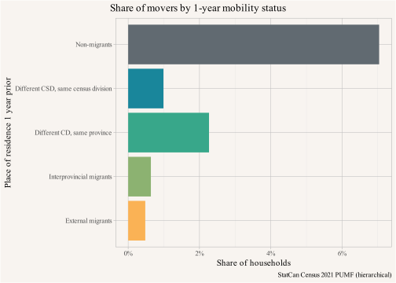{#fig-movers-mob1-status fig-pos='H'}
:::
:::


Lengthening our view of how often people move, we can look at 5-year mobility data. Based on 2021 data, we can estimate that nearly 2 in 5 people (38% of the population) will move across a 5-year period.[^2] That's substantially less than one might naively expect from extrapolating the 1-year mover share, but some people move several times in a 5-year period. In particular, those making big moves, e.g. between regions, may also subsequently make more small moves afterwards, as they adjust their housing based on accumulation of local knowledge. This can help explain why 5-year address change data shows an overrepresentation of big moves relative to the more local moves dominating 1-year address change comparisons, insofar as all the little moves that frequent movers make only show up as one address change across the 5-years recorded by census data. @fig-movers-mob5-status gives the corresponding breakdown for 5-year mover status.

[^2]: Notably, 2021 felt the effects of the COVID pandemic, which may have boosted mobility rates above usual levels. But overall mobility rates in 2016 and 2021 were quite similar, so while the pandemic might have changed where people move, it had only a minimal effect on the overall amount of mobility.


::: {.cell}

```{.r .cell-code}
movers_data |>
  summarize(Count=sum(WEIGHT),.by=c(MOB5)) |> 
  mutate(Share=Count/sum(Count)) |>
  filter(MOB5 != "Non-movers") |>
  ggplot(aes(y=fct_rev(MOB5),x=Share,fill=MOB5)) +
  geom_bar(stat="identity") +
  scale_x_continuous(labels=scales::percent_format(accuracy=1)) +
  scale_fill_manual(values=mob_colours,guide="none") +
  labs(title="Share of movers by 5-year mobility status",
    y="Place of residence 5 years prior",
    x="Share of households",
    caption="StatCan Census 2021 PUMF (hierarchical)"
  )
```

::: {.cell-output-display}
{#fig-movers-mob5-status fig-pos='H'}
:::
:::


What kind of housing did these movers move into? Only 6.8% of Canada's (occupied) housing stock was built January 2016 to May 2021, so the majority moved into old housing. In @fig-movers-mob-status-year-built we make that more precise by looking at mobility status by year the housing was built.


::: {.cell}

```{.r .cell-code}
movers_data |>
  filter(BUILT != "Not available") |>
  summarize(Count=sum(WEIGHT),.by=c(MOB5,BUILT)) |> 
  mutate(Share=Count/sum(Count),.by=BUILT) |>
  filter(MOB5 != "Non-movers") |>
  ggplot(aes(x=BUILT,y=Share,fill=MOB5)) +
  geom_bar(stat="identity") +
  scale_y_continuous(labels=scales::percent_format(accuracy=1)) +
  scale_fill_manual(values=mob_colours) +
  theme(axis.text.x = element_text(angle = 30, hjust = 1)) +
  labs(title="Share of movers by year housing was built",
       x="Period housing was built",
       fill="Place of residence 5 years prior",
       y="Share of households in particular period housing was built",
       caption="StatCan Census 2021 PUMF (hierarchical)")
```

::: {.cell-output-display}
{#fig-movers-mob-status-year-built fig-pos='H'}
:::
:::


New housing, of course, mostly contains new movers insofar as people generally don't live on construction sites (though there are some mismatches in age of housing and timing of move, which explain why we don't reach 100%). With the exception of housing built in 2016 to 2021, people move at pretty comparable rates regardless of when the housing was built and only around 16% of all households that moved did so into new housing while around 84% moved into old housing. Are there big differences in who moves into new versus old housing in Canada?

In @fig-movers-income-year-built we check directly into the income deciles, adjusted for family size, of those moving into new housing versus those moving into old housing. We will do this for both the 2016 and 2021 years, remaining mindful that 2021 was an odd year, in particular with regard to the 2020 incomes reported in the Census. Pandemic impacts reduced incomes for some while at the same time Covid supports boosted incomes for a partially overlapping segment. For this comparison we also conservatively removed recent movers to avoid cases where low census incomes (reported from the previous year) were least likely to reflect current income to housing situations (e.g. when people had recently left school and moved for a new job). 

Comparing both census years, we can see that there are some differences between new and old housing, with those moving into new housing being slightly overrepresented in higher income deciles relative to those moving into older housing. This pattern was stronger in 2016 than 2021. By 2021, the median mover into new housing is in the sixth income decile, while the median mover into old housing is in the fifth. Importantly, and across both Census years, both old and new housing contain all adjusted family income deciles. We can see that even without filtering effects, new housing directly houses even the lowest income households. 


::: {.cell}

```{.r .cell-code}
pumf_data_income <- mountainmathHelpers::simpleCache(
  bind_rows(
    get_pumf("Census","2021 (hierarchical)") |>
      label_pumf_data(rename_columns = FALSE) |>
      mutate(Year="2021"),
    get_pumf("Census","2016 (hierarchical)") |>
      label_pumf_data(rename_columns = FALSE) |>
      mutate(Year="2016")
  )|>
    filter(BUILT != "Not available") |>
    filter(MOB5 != "Non-movers") |>
    filter(MOB1=="Non-movers") |>
    filter(MOB5 != "Not applicable") |>
    filter(EFDECILE!="Not available") |>
    mutate(new_housing_status=ifelse(BUILT %in% c("2016 to 2021","2011 to 2016"),
                                     "New housing","Old housing")) |>
    summarize(Count=sum(WEIGHT),.by=c(MOB5,new_housing_status,EFDECILE,CMA,SUBSIDY,Year)) |>
    mutate(SUBSIDY=fct_recode(SUBSIDY,
                              "Subsidized"="A subsidized dwelling",
                              "Not subsidized"="Not a subsidized dwelling")),
  "pumf_2021_movers_income_new_housing.rds",
  here::here("data"),refresh=FALSE)

pumf_data_income |>
  # filter(CMA=="Vancouver") |>
  summarize(Count=sum(Count),.by=c(new_housing_status,EFDECILE,Year)) |>
  mutate(Share=Count/sum(Count),.by=Year) |>
  ggplot(aes(x=new_housing_status,y=Share,fill=fct_rev(EFDECILE))) +
  geom_bar(stat="identity",position="fill") +
  scale_y_continuous(labels=scales::percent_format(accuracy=1)) +
  scale_fill_viridis_d(direction = -1) +
  facet_wrap(~Year) +
  labs(title="Income of movers into new vs old housing",
       subtitle="Share of population who moved in past 5 years but not during past year into housing built ",
       x=NULL,
       fill="Adjusted family\nincome decile",
       y="Share of population moving into new and old housing",
       caption="StatCan Census 2016, 2021 PUMF (hierarchical)")
```

::: {.cell-output-display}
{#fig-movers-income-year-built fig-pos='H'}
:::
:::


To put it differently, every 3-4 new dwellings could be expected to house roughly the same number of families in the bottom adjusted income decile as every 2 old dwellings. So where new dwellings markedly add to supply (rather than simply replacing old dwellings), they will probably house more, not fewer, lower income households as they're added. As a cross-check, let's look at old and new housing by sector. @fig-movers-income-year-built-subsidy separates out private or market rental (unsubsidized) and non-market rental housing (subsidized) from owner-occupied to highlight that the share of lower income people moving into new housing is not due to any recent burst of new non-market housing. There (unfortunately) simply isn't enough of it to skew those numbers. 


::: {.cell}

```{.r .cell-code}
pumf_data_income |>
  # filter(CMA=="Vancouver") |>
  summarize(Count=sum(Count),.by=c(new_housing_status,EFDECILE,SUBSIDY,Year)) |>
  filter(SUBSIDY!="Not available") |>
  mutate(SUBSIDY=fct_recode(SUBSIDY,
                            "Market rental"="Not subsidized",
                            "Non-market or \ncash supports"="Subsidized",
                            "Owner"="Not applicable")) |>
  mutate(Share=Count/sum(Count),.by=Year) |>
  ggplot(aes(x=new_housing_status,y=Share,fill=fct_rev(EFDECILE))) +
  geom_bar(stat="identity",position="fill") +
  scale_y_continuous(labels=scales::percent_format(accuracy=1)) +
  scale_fill_viridis_d(direction = -1) +
  facet_grid(SUBSIDY~Year) +
  labs(title="Income of movers into new vs old housing",
       subtitle="Share of population who moved in past 5 years but not during past year into housing built ",
       x=NULL,
       fill="Adjusted family\nincome decile",
       y="Share of population moving into new and old housing",
       caption="StatCan Census 2016, 2021 PUMF (hierarchical)")
```

::: {.cell-output-display}
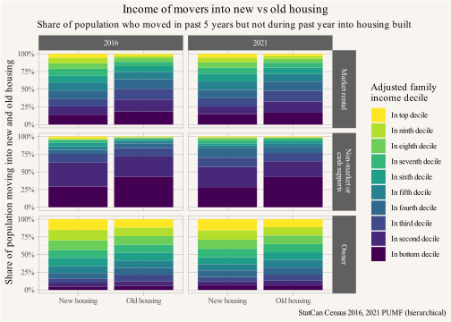{#fig-movers-income-year-built-subsidy fig-pos='H'}
:::
:::


The split highlights that in non-market housing the share of lower income households is, predictably, a lot higher than in what we typically think of as market housing. Interpreting variation between sectors, it is good to remember that a fair share of private housing gets allocated by non-market means, for example inheritance of homes, parents buying properties for their children, or other forms of non-market rentals. Empty Homes Tax and Speculation and Vacancy Tax data indicate that a not insignificant portion of the secondary rental market consists of non-arms length rentals. More on this topic in a previous post. [@commodity-and-keeping-it-in-the-family.2021].

Despite differences between sectors, the general pattern holds across sectors: new housing provides homes to people across the income spectrum, with the median occupants having incomes either the same or just slightly higher than for residents of older housing. But let's return to the additional positive filtering effects new housing produces by way of vacancy chains.

## Moving vacancies

With some base understanding of mobility the next step is to look for moving vacancies. In keeping with the previous section, we focus on household reference persons to simplify the discussion.

We can come at this from two angles, for a household to move somewhere there first has to be a vacant unit they can move in to.[^3] How do we get vacant units? Essentially there are two ways; either the unit has been newly built, or it's left behind after being vacated by its previous occupants.

[^3]: There are cases where someone might move in with other people that already live in the unit, for example someone who moves in with their partner, or a roommate household where one roommate moved out and the person moves in to take their spot. Or a child moves back in with their parent. Here we gloss over these subtleties and focus on household reference persons, which does not completely avoid these issues but is a suitable simplification.

On the flip side, when someone moves into a unit they often leave a vacant dwelling unit behind. Here we have to be a little more careful, the household reference person in the new dwelling unit may not have been a household reference person in the previous dwelling unit, in which case they do not leave a vacancy behind. Examples include children moving out of their parents' place, or a couple or roommate household splitting up with only part of the household moving out. In some cases they can leave multiple vacancies behind, for example when two single households combine and move into a new place. One other question is where the vacancy gets created; in some cases it's in a different part of the country or a different country altogether, which is of limited use when trying to understand local housing markets. Overall, these moving vacancies are essential to enabling mobility. We often leave vacancies behind as well as filling vacancies when moving. These vacancies, and moves between them, can chain together to form *moving chains* or *vacancy chains*.

These vacancy chains have been studied for quite some time. Groundbreaking studies establishing housing as a dominant reason for mobility began at least as early as @rossi_1955, but @kristof_1965 was one of the first to think through chained moves, and @lansing_1969 did a large empirical study to understand vacancy chains, finding that vacancy chains were on average 3.5 moves long and most moves were moves up in the housing spectrum. This field has seen a modern revival, partially motivated by rising *supply skepticism*, with more modern data approaches pioneered by @magnusson_turner_2008 using administrative data to track moves and @mast_2019 using commercially available data tracking people's addresses to study vacancy chains in the US context. To date possibly the best study was carried out in Finland by Bratu [@bratu2023].

All these studies consistently find that moving chains exist, they are longer when initial housing units are near the upper end of the housing spectrum, and a good proportion of vacancies reach into the lower part of the housing spectrum. If moving chains start lower down, for example by building new non-market housing, moving chains are shorter but a higher proportion and absolute number reach into the lower end of the housing spectrum.

Vacancy chains operate as the primary mechanism by which price and rent signals are transmitted throughout the housing spectrum. And given how often people move this information exchange happens relatively quickly.

# Filtering

Filtering usually refers to the process by which units become available to people lower down the income spectrum as the housing units age. The mechanism by which is this happens is that buildings depreciate and generally newer buildings are higher quality. That means that older buildings tend to move down the quality spectrum of the building stock, so they tend to rent or sell for less than newer buildings. There are some caveats here of course. For example, if old buildings are in more desirable locations than newer buildings then this might not happen, and increasing investment in renovations may move old buildings back up the quality spectrum.

But just because older buildings tend to move down the quality spectrum does not mean they become available to lower income family units. Here the systemic effects of housing kick in. Research in several settings has shown that if the overall housing supply manages to keep up with (or exceed) demand growth, then older units filter down the income spectrum. Conversely, where supply lags behind demand growth, older units have been found to filter up the income spectrum. [@tsur_filtering.2001; @tsure_filtering_supply.2003; @myers_filtering.2020] In that case lower income families and individuals get squeezed, and are generally forced to either: a) pay a higher share of their income on housing; b) move away; or c) double up to form more complex households to share housing costs. Historically this last option has often involved taking in boarders or lodgers [@harris1992end], but doubling up as a response to shortage has evolved and we can now identify those doing so as "suppressed" or "concealed" households. In Vancouver and Toronto in particular we have shown how these kinds of doubled-up households have increased since the 1970s and detailed the corresponding shift in household living arrangements. [@estimating-suppressed-household-formation.2022; @still-short-suppressed-households-in-2021.2022; @housing-outcomes.2023] The rise in doubling up in Vancouver and Toronto indicates that housing supply has failed to keep up with demand and older units have likely filtered up over the past 5 decades.

# Impact of new market housing on rents {#sec-rent-impacts}

Given the broad theory and data around vacancy chains and filtering, how much do rents move at different points in the spectrum in response to adding new housing to markets? One challenge to answering this question has been finding high demand locations that have experienced the addition of a lot of housing. Auckland in New Zealand underwent a series of upzonings, a small one in 2013 followed by a larger one in 2016. These resulted in large supply bumps in response. @nz_rents.2024 carefully estimate the effect of these upzonings on rents, finding that the upzoning reduced rents by between 20% to 35%. This is based on average rents, but here we are particularly interested in the distributional effects. To assess if there were differential effects we take [rental bond data from the New Zealand Tenancy Services branch](https://www.tenancy.govt.nz/about-tenancy-services/data-and-statistics/rental-bond-data/) that [we have looked at before](https://x.com/vb_jens/status/1723401648930980207) and that splits out rents by quartile. @fig-auckland-rent-quartiles shows seasonally adjusted monthly quartile rents, deflated by full time equivalent average weekly earnings, since 2013, indexed to 2016. We note that all quartiles move quite similarly, with the upper and lower quartile dropping below the median.


::: {.cell}

```{.r .cell-code}
tbats_trend <- function(value,frequency,date) {
  year <-date |> strftime("%Y") |> as.integer() |> min()
  ts <- ts(value,frequency=frequency,start=year)
  fit <- forecast::tbats(ts)
  components <- forecast::tbats.components(fit)
  out <- components |>
    as.data.frame() %>%
    as_tibble()
  
  result <- out$level
  if (!is.null(fit$lambda))
    result <- forecast::InvBoxCox(result,fit$lambda)
  result
}

get_nz_earnings_data <- function() {
  read_csv(here::here("data/QEM557301_20240715_121904_79.csv"),skip=4,col_names = c("Quarter","Earnings")) |>
  filter(!is.na(Earnings)) |>
  mutate(Date=lubridate::yq(gsub("Q",".",Quarter)) |> as.Date()) |>
  mutate(Date=Date %m+% months(1))
}

get_nz_rent_data <- function(refresh=FALSE){
  path <- here::here("data/nz_rents.rds")
  if (!file.exists(path)||refresh) {
  rents <- read_csv("https://www.tenancy.govt.nz/assets/Uploads/Tenancy/Rental-bond-data/Detailed-Monthly-May-2024-Rental-bond-data-TLA.csv",col_types=cols(.default="c")) |>
    mutate(Date=as.Date(`Time Frame`),.after=`Time Frame`)
  
  earnings <- get_nz_earnings_data()   |>
    complete(Date=unique(rents$Date)) |>
    arrange(Date) |>
    mutate(Earnings=zoo::na.approx(Earnings,na.rm=FALSE)) |>
    select(Date,Earnings) |>
    fill(Earnings,.direction="down")
    
    rents |>
      left_join(earnings,by="Date") |>
      saveRDS(path)
  }
  readRDS(path)
}

rents <- get_nz_rent_data()

rent_pd <- rents |>
  filter(Location=="Auckland") |>
  pivot_longer(matches("Median|Quartile")) |>
  mutate(value=as.numeric(value)) |>
  mutate(v=value/Earnings) |>
  mutate(trend=tbats_trend(v,12,Date),.by=c(name,`Location Id`)) %>%
  left_join(filter(.,Date=="2016-01-01") |> select(`Location Id`,name,base=trend),by=c("name","Location Id"))
```
:::

::: {.cell}

```{.r .cell-code}
rent_pd |>
  filter(Date>=as.Date("2010-01-01")) |>
  ggplot(aes(x=Date,y=trend/base,color=name)) +
  geom_line() +
  geom_vline(xintercept = as.Date(c("2013-01-01","2016-01-01")),linetype="dashed") +
  scale_colour_manual(values=sanzo::trios$c149) +
  scale_x_date(breaks="year",date_labels="%Y") +
  scale_y_continuous(trans="log",breaks=seq(0.5,2,0.1),labels=\(x)scales::comma(x*100)) +
  labs(title="Rent trends in Auckland",y="Seasonally adjusted index, deflated by FTE weekly average earnings\n(2016=100, log scale)",
       x=NULL,colour="Rent quartile",
       caption="Rental bond data, NZ Tenancy Services, NZ Stats QEM")
```

::: {.cell-output-display}
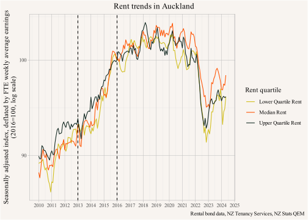{#fig-auckland-rent-quartiles fig-pos='H'}
:::
:::


Overall rent increases relative to earnings slowed starting around the 2016 reforms until they reversed and dipped quite strongly in 2022, recovering somewhat in 2023. Lower quartile and median rents rose faster than upper quartile rents pre-2016, but post-2016 both upper and lower quartile rents decreased faster than median rents, even as the sample changed over time as new rental homes mostly add to the top quartile. This broadly aligns with economic theory that predicts a compression of the rent spectrum when housing is scarce. With additions to housing supply the opposite happens, but the rents at the top see more downward pressure because they are the closest substitute to the added new housing. Most importantly for our analysis, these differences are rather small compared to the overall rent movements, and they give us some confidence that not much will be lost if we simplify the analysis to assume that rents across the spectrum move in lockstep. Similar observations have been made about [US apartment rents](https://www.realpage.com/analytics/class-b-c-rent-cuts-2024/) in areas that added a lot of supply.

# Impact of new market housing on core housing need

Putting the pieces together we can now use micro data to simulate what might happen as we increase the supply of housing. In particular, we want to compare our current housing system with where we would be if we met our housing targets (where municipalities stopped restricting housing). Much of this section follows similar work done in the US context [@corinth2023], adapted to the Canadian setting. This is also continuation on earlier work we did on housing targets that estimated the amount of market housing needed in Metro Vancouver to drive what's also known as the "zoning tax" - the difference between the price of market housing and the marginal social cost to produce it - to zero. [@housing-targets.2023] In that post we focused only on market housing and promised to integrate the question about the need for non-market housing or cash subsidies at a later time. We will get to that in this post.

The idea is quite simple. Picking up from our previous post we assume enough housing has been built to meet our housing targets, and average prices for new housing have effectively dropped to the price of profitable production, declining by about 30%. Here uncertainties in demand elasticity estimates only affect the amount of housing needed to meet our targets (competing the zoning tax away), but not the average price and rent effects, which makes this part a little more straight-forward.

We follow @corinth2023 in assuming that the price and rent effects of new supply distribute fairly uniformly throughout the housing spectrum. Our observations in @sec-rent-impacts confirms that this is quite reasonable -- possibly rent effects are even stronger at the lower end which makes our assumptions conservative. We also need to estimate the cross-elasticity of rental and ownership housing. This can be tricky (e.g. involving assumptions about things like carrying costs, tax treatment, etc), and there are various estimates in the literature (see @corinth2023 for a summary of US related studies), but for this post we will assume that cross-elasticity is 1, so the rent-to-price ratio remains unchanged. Armed with these assumptions, it's time to do some work. 


### Step 1) How much need currently exists?

The first step in this follows [@corinth2023] to estimate the effect of rent changes on Vancouver household's current rent burden, keeping households fixed. We start by estimating the gap each household faces in getting their shelter costs to no more than 30% of total household income, if any. This is the amount of cash subsidy needed to ensure that the current housing situation of all households meets the 30% affordability criterion.

In @fig-cash-supports we split this by tenure and by Core Housing Need status and show the distribution of cash subsidies needed to lift households out of unaffordable housing. As a reminder, Canadians are considered to have their Core Housing Need met (*"Not in core need"*) when their housing is affordable (\<30% income), suitable (has enough bedrooms for resident mix), and adequate (in good repair), or their income would allow them to afford other housing locally that would meet their needs. Those considered to be in Core Housing Need (*"In core need"*) are households who fail this test. Except that some households are excluded from this measure (*"Not available"*), including those with shelter cost higher than income, as well as some non-family student households. As we can see there remain households deemed not to be in Core Housing Need who still have shelter costs higher than 30% of income. Here the CMHC assumes their income suffices to pay the median rent of alternative local housing that would meet their needs (i.e. they are likely choosing to pay more in rent because of amenities).


::: {.cell}

```{.r .cell-code}
pd1 |>
  filter(gap>0) |>
  filter(PRIHM=="Person is primary maintainer") |>
  ggplot(aes(x=gap,weight=WEIGHT,fill=fct_rev(TENUR))) +
  geom_histogram(binwidth = 2500) +
  scale_x_continuous(
    breaks=c(2500,seq(20000,100000,20000))-2500, 
    labels = \(x)scales::dollar(x+2500)
    ) +
  facet_grid(Year~HCORENEED_IND) +
  theme(legend.position = "bottom") +
  scale_fill_manual(values=tenure_colours) +
  #scale_x_continuous(labels=\(x)scales::dollar(x+2500)) +
  scale_y_continuous(labels=scales::comma) +
  labs(title="Actual cash supports needed so that every Metro Vancouver household\nspends at most 30% of income on shelter costs",
       subtitle="(keeping shelter costs and households fixed)",
       y="Number of households",
       x="Annual mean cash supplement per household",
       fill="Tenure",
       caption="Data: StatCan Census 2016, 2021 PUMF (individuals)")
```

::: {.cell-output-display}
{#fig-cash-supports fig-pos='H'}
:::
:::

::: {.cell inlude='false'}

```{.r .cell-code}
pd1 |>
  filter(gap>0) |>
  filter(PRIHM=="Person is primary maintainer") |>
  mutate(cat=case_when(gap<2500 ~ "$1-$2,500",
                       gap<5000 ~ "$2,500-$5,000",
                       gap<10000 ~ "$5,000-$10,000",
                       gap<10000 ~ "$10,000-$15,000",
                       gap<10000 ~ "$15,000-$20,000",
                       gap<10000 ~ "$20,000-$25,000",
                       gap<10000 ~ "$25,000-$50,000",
                       TRUE ~ "$50,000+")) |>
  summarize(count=sum(WEIGHT),.by=c(TENUR,cat,Year,HCORENEED_IND)) |>
  ggplot(aes(y=count,x=cat,fill=fct_rev(TENUR))) +
  #geom_histogram(bins = 30) +
  geom_bar(stat="identity") +
  facet_grid(Year~HCORENEED_IND) +
  theme(legend.position = "bottom") +
  scale_fill_manual(values=tenure_colours) +
  #scale_x_continuous(labels=scales::dollar) +
  scale_y_continuous(labels=scales::comma) +
  labs(title="Cash supports needed so that every Vancouver household spends\nat most 30% of income on shelter costs",
       subtitle="(keeping shelter costs and households fixed)",
       y="Number of households",
       x="Annual mean cash supplement per household",
       fill="Tenure",
       caption="Data: StatCan Census 2016, 2021 PUMF (individuals)")
```
:::


For the purpose of this post we will track all three of these Core Housing Need categories, recognizing that distinct interpretations apply to these housing situations. Even if households living in unaffordable housing but determined not be in "Not in core need" are often understood as trading off affordability against other preferences, we suspect that these households have better information about their particular situation than the measure allows for, and we want to avoid dismissing their current unaffordability as a simple matter of choice.

Households not assessed for Core Housing Need are more difficult to deal with in this framework. They defy the shelter-cost-to-income calculus and include a wide variety of scenarios, starting from the mundane, where they are created by the temporal mismatch of previous year's incomes and current year's shelter cost measurements. For example a recent university graduate beginning a new job may well be able to comfortably afford their current housing on their current income, but not based on their previous year's income while they were still in university. Other examples include situations where income is primarily derived from capital gains or RRSP withdrawals, which are not included in standard StatCan total income metrics. But this category also includes households in dire financial situations, maybe trying to bridge a job loss by drawing down savings or taking on debt while holding onto existing housing.

We note that owner households in unaffordable housing face very different situations compared to renter households as they often have equity in their home, allowing them to transform their current situation into that of a wealthy renter. For this reason we will narrow down most of our analysis so it will be focused on need for renter households only, as shown in @fig-cash-supports2. As is evident, much need remains despite existing rental subsidy programs. For comparison's sake, the current BC Rental Assistance Program, targeted at families with children, together with related subsidy programs, is made available to about 35,000 low-income households, and provides mean-tested rent subsidies that are generally well below the program maximum of around $12,000 per year ($1,000/mo), varying by location. [@bc_housing_2023]


::: {.cell}

```{.r .cell-code}
pd1 |> 
  filter(gap>0,TENUR=="Renter") |>
  ggplot(aes(x=gap,weight=WEIGHT,fill=fct_rev(TENUR))) +
  geom_histogram(binwidth = 2500,show.legend = FALSE) +
  scale_x_continuous(
    breaks=c(2500,seq(20000,100000,20000))-2500, 
    labels = \(x)scales::dollar(x+2500)
    ) +
  facet_grid(Year~HCORENEED_IND) +
  theme(legend.position = "bottom") +
  scale_fill_manual(values=tenure_colours) +
  # scale_x_continuous(labels=scales::dollar) +
  scale_y_continuous(labels=scales::comma) +
  labs(title="Actual cash supports needed so that every Metro Vancouver renter household\nspends at most 30% of income on shelter costs",
       subtitle="(keeping shelter costs and households fixed)",
       y="Number of households",
       x="Annual mean cash supplement per household",
       fill="Tenure",
       caption="Data: StatCan Census 2016, 2021 PUMF (individuals)")
```

::: {.cell-output-display}
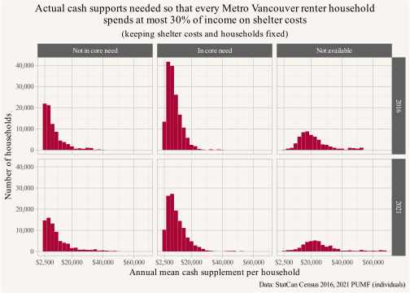{#fig-cash-supports2 fig-pos='H'}
:::
:::


### Step 2) How much need would still exist if we successfully met housing targets?

The question we ask is how many of these households would still be in unaffordable housing if we met our housing targets, building enough housing to drop prices and rents of (new) housing by 30%, a figure well in reach based on work by CMHC [@gensey_condos.2018] and explained in our previous post on housing targets. [@housing-targets.2023] Dropping prices and rents won't alter the affordability situation of existing owner households, but it will make a difference for existing renters that we can easily simulate in the data as shown in @fig-cash-supports3.


::: {.cell}

```{.r .cell-code}
pd2 |>
  filter(gap>0) |>
  filter(TENUR=="Renter") |>
  filter(PRIHM=="Person is primary maintainer") |>
  ggplot(aes(x=gap,weight=WEIGHT,fill=fct_rev(TENUR))) +
  geom_histogram(binwidth = 2500,show.legend = FALSE) +
  scale_x_continuous(
    breaks=c(2500,seq(20000,100000,20000))-2500, 
    labels = \(x)scales::dollar(x+2500)
    ) +
  facet_grid(Year~HCORENEED_IND) +
  theme(legend.position = "bottom") +
  #scale_x_continuous(labels=scales::dollar) +
  scale_fill_manual(values=tenure_colours) +
  scale_y_continuous(labels=scales::comma) +
  labs(title="Successful housing target cash supports needed so that every\n Metro Vancouver household spends at most 30% of income on shelter costs",
       subtitle="(assuming supply effects lower shelter costs by 30%, keeping households fixed)",
       y="Number of households",
       x="Annual mean cash supplement per household",
       fill="Tenure",
       caption="Data: StatCan Census 2016, 2021 PUMF (individuals)")
```

::: {.cell-output-display}
{#fig-cash-supports3 fig-pos='H'}
:::
:::


### Step 3) How would successfully meeting housing targets affect need estimates?

@fig-cash-supports4 summarizes the previous two figures, and compares the actual vs counter factual cash supports needed to lift all renter households out of unaffordable housing.


::: {.cell}

```{.r .cell-code}
summary_data |>
  ggplot(aes(y=fct_rev(HCORENEED_IND),x=gap,fill=Type)) +
  geom_bar(stat="identity",position="dodge") +
  scale_x_continuous(labels=\(x)scales::dollar(x,scale=10^-6,suffix="M")) +
  scale_fill_manual(values=effect_colours) +
  facet_wrap(~Year) +
  labs(title="Metro Vancouver cash supports needed to lift all renter households out of unaffordable housing",
       x="Annual total cash supplement needed to ensure that\nall households pay no more than 30% of income on shelter costs",
       y=NULL,
       fill="Scenario",
       caption="Data: StatCan Census 2016, 2021 PUMF (individuals)") 
```

::: {.cell-output-display}
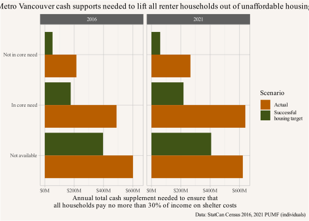{#fig-cash-supports4 fig-pos='H'}
:::
:::


The comparison demonstrates the sizable reduction in the cash supports needed to lift people out of unaffordable housing if we successfully met our housing targets, especially in the categories of people considered for Core Housing Need. In @fig-cash-supports5 we slice this comparison differently by looking at how many people and households successfully meeting housing targets would lift out of unaffordable housing relative to what we observe now.


::: {.cell}

```{.r .cell-code}
library(patchwork)
g1<-summary_data |>
  ggplot(aes(y=fct_rev(HCORENEED_IND),x=Households,fill=Type)) +
  geom_bar(stat="identity",position="dodge") +
  scale_x_continuous(labels=\(x)scales::comma(x,scale=10^-3,suffix="k")) +
  scale_fill_manual(values=effect_colours) +
  theme(legend.position = 'bottom') +
  facet_wrap(~Year) +
  labs(title="Households in unaffordable housing",
       x="Households paying >30% of income",
       y=NULL,
       #caption="Data: StatCan Census 2016, 2021 PUMF (individuals)",
       fill="Scenario") 
g2<-summary_data_people |>
  ggplot(aes(y=fct_rev(HCORENEED_IND),x=People,fill=Type)) +
  geom_bar(stat="identity",position="dodge") +
  scale_x_continuous(labels=\(x)scales::comma(x,scale=10^-3,suffix="k")) +
  scale_fill_manual(values=effect_colours) +
  facet_wrap(~Year) +
  theme(legend.position = 'none',axis.text.y=element_blank()) +
  labs(title="People in unaffordable housing",
       x="People in households paying >30% of income",
       y=NULL,
       #caption="Data: StatCan Census 2021 PUMF (individuals)",
       fill="Scenario") 

(g1+g2) + 
  (plot_layout(guides = "collect") & theme(legend.position = "bottom")) + 
  plot_annotation(title="Metro Vancouver renters (households and people) in unaffordable housing\nby Actual vs successful housing targets and Core Housing Need",
                  caption="Data: StatCan Census 2016, 2021 PUMF (individuals)") 
```

::: {.cell-output-display}
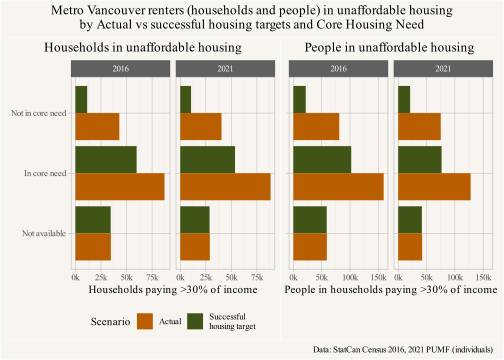{#fig-cash-supports5 fig-pos='H'}
:::
:::


Again, this comparison shows that meeting housing targets would lead to large reductions in the numbers of people and households stuck in unaffordable housing, both for those in Core Housing Need and whose needs are currently considered met. By contrast, meeting housing targets does next to nothing for people excluded from the Core Housing Need measure. This is not surprising insofar as these are situations where income tends to be the largest factor for reasons explained above.

### In summary: 

Using 2016 and 2021 benchmarks, keeping (existing) households fixed, meeting housing targets, and thereby increasing the Metro Vancouver housing stock to drop the price and rent of (new) housing by 30%, would lift between 59,000 and 65,000 renter households out of unaffordable housing. This would reduce the total number of renter households in unaffordable housing by 35.7% and 41.1% in 2016 and 2021, respectively. Meeting housing targets would reduce the annual supplements required to lift all renter households out of unaffordable housing by $678M and $842M, a reduction by 52% and 55% in 2016 and 2021, respectively. Switching from households to people in unaffordable housing, meeting targets would result in a reduction of 117k and 106k people in need, a reduction by 39% and 43% in 2016 and 2021, respectively.

These changes are sizable, but not the only benefits. Renters throughout the spectrum would see their shelter costs reduced and their options to better match their living arrangements to their personal preferences improved. Building more market housing has very large redistributive effects of income from current landlords to renters, as we have explained in the past. [@what-if-recent-apartment-buildings-in-vancouver-were-20-taller.2024].

This serves well as a simple estimate of the positive effects of meeting our housing targets. But we note that this would not lift all renter households out of unaffordable housing. Rent supplements or dedicated non-market housing would still be needed. Our estimates show that, assuming households as fixed and remaining in their current housing units, even after the supply shock from meeting targets 106,000 and 93,000 renter households would still be in unaffordable housing, requiring a total annual subsidy of $625M and $684M annually to lift them to the 30% shelter-cost-to-income threshold in 2016 and 2021, respectively. Just focusing on the households in Core Housing Need the supply shock would reduce the number of renter households in Core Housing Need paying more than 30% of income on shelter costs from 87,000 and 88,000 to 60,000 and 54,000 in 2016 and 2021, respectively. This gives an estimate of the total remaining unmet need for non-market housing or related rent supports after municipalities hit our targets (i.e. stop restricting the addition of housing to markets).

But as we stated at the outset, there are several further caveats. On one hand these estimates are likely conservative: even keeping households fixed but allowing them to move housing units, a reduction in prices and rents across the spectrum will likely trigger some households to move and upgrade their current housing. This would open up more lower cost housing for people to move into if they wish to reduce their housing cost and further depress the share of the population in Core Housing Need. On the other hand, we know households aren't fixed. In fact, they're quite malleable, and many people respond to high housing costs by doubling up. We look into that below. It's also the case that rent control for existing tenants means that some households (usually the renters with the longest tenancies) will derive less direct benefit from a 30% reduction in market rents. We will return to this point in @sec-rent-control and try to estimate the impact of rent control on our estimates. Overall we see that households reaping large benefits from rent control have lower rates of unaffordable shelter costs, but they still benefit indirectly by seeing increased options to change their living arrangements.

# Impact of new housing on household formation

In order to better understand what is going on with households, we need to take another look at the processes that allowed rents to fall. We are modelling changes after prices and rents dropped by about 30%, and in our previous post on housing targets we estimated that to achieve this change in market prices and rents requires roughly 250k to 300k net new dwelling units in Metro Vancouver. [@housing-targets.2023] This takes time to build, which is roughly in line with our assumption of veering not too far off of a stationary market equilibrium for the allocation of housing (and requires even more housing to account for demand growth during this time). New housing will lead to new households getting formed, some by households who currently live outside of the region and some by people already in the region forming new households. This violates our initial assumption of keeping households fixed.

To adjust for this we need to

-   estimate how many new households would form from the existing population, and their likely shelter-cost-to-income mismatch, and
-   estimate how many households would form from people moving into the region, and their distribution of incomes and shelter costs.

Both of these are difficult, but we can give a rough estimate. The second one is particularly challenging to model directly. Here we will model the change in net migration as a residual via the difference of the new number of dwelling units, discounted by an assumed natural vacancy rate, and new household formation by existing dwelling units. This can introduce sizable errors and needs to be treated with caution. We then estimate the share of households in Core Housing Need or with shelter-cost-to-income mismatch by assuming that the overall makeup of the population moving into the region is comparable to the ones already in the region.[^4] We then anchor these estimates by estimating the relationship between metro level prevailing rents and Core Housing Need or shelter-cost-to-income mismatch separately, introducing an alternative method to estimate the overall distribution of households struggling with shelter costs that include both households made up of the existing population as well as newcomers.

[^4]: This is somewhat conservative insofar as in-migrants, when adjusted by age, usually have higher (adjusted) family incomes than incumbent residents.


Accounting for new household formation of existing residents is also complex. We have previously looked at changes in household composition across metro areas in Canada [@housing-outcomes.2023], and have been working on extending this to tie household formation patterns directly to rents and incomes. [@mhu.2024] In future work we are planning to cast this explicitly in household formation elasticities to prevailing rent levels.

Many of the resulting households forming in response to changing rents would likely be near the 30% affordability cutoff, and introduce new households in unaffordable housing. In general, we know that single person households and single parent with children households are overrepresented in Core Housing Need. In part, this is because single incomes are simply more volatile than two-income households, and we know from longitudinal CMHC research that showing up in Core Housing Need is only temporary for most households. [@cmhc_2021] But importantly, these single income households are also more likely to form as people currently sharing housing with others due to housing costs become newly able to split off and live on their own.

Overall, the share of households in Core Housing Need in Vancouver has not increased over the past 15 years [@housing-outcomes.2023] even though we have a lot of evidence that housing outcomes have gotten worse over this time period. This suggests caution that measuring Core Housing Need while holding households constant is the right approach. On the flip side, improvements in housing outcomes may not be reflected in Core Housing Needs either. In particular, enabling households to split up in favour of obtaining more privacy and reducing conflict is, in itself, arguably meeting an important need. Cheaper, more plentiful housing will be helping people if it also allows more people to strike out on their own with a single income, and even if those single income households are ultimately at higher risk paying more than 30% of their income on housing, potentially placing them into Core Housing Need.

To explore this further, let's start out by looking at the ecological level relationship between rents and households struggling with housing costs.

## Prevailing rents vs housing pressures {#sec-rents-housing-pressures}

In @fig-core-housing-need-rents we show the relationship of rents to the share of the population in Core Housing Need across metro areas for some indication of how a supply shock decreasing rents might play out. As expected, as rents go up, the share of people in Core Housing Need also goes up. Correspondingly, bringing rents down could be expected to reduce Core Housing Need, providing broad confirmation for our results above.


::: {.cell}

```{.r .cell-code}
movers <- c("Non-migrants","Different CSD, same census division","Different CD, same province",   "Interprovincial migrants" ,  "External migrants") 


rent <- pumf_data |>
  #filter(Age %in% c("25 to 29 years","30 to 34 years")) |>
  filter(BEDRM=="2 bedrooms") |>
  filter(!(MOB1 %in% c("Not available","Not applicable"))) |>
  filter(MOB1 %in% movers) |>
  #filter(`Household size`=="1 person") |>
  filter(TENUR=="Renter") |>
  summarize(Rent=weighted.mean(SHELCO,w=WEIGHT),
            .by=c(CMA,Year)) |>
  left_join(inflation,by="Year") |>
  mutate(real_rent=Rent/CPI) 

montreal_vancouver_rent_ratio <- rent |> 
  filter(CMA %in% c("Vancouver","Montréal")) |> 
  select(name=CMA,Year,value=real_rent) |> 
  pivot_wider() |> 
  mutate(ratio=Montréal/Vancouver-1)

old_rent <- pumf_data |>
  #filter(Age %in% c("25 to 29 years","30 to 34 years")) |>
  filter(BEDRM=="2 bedrooms") |>
  filter(MOB5 =="Non-movers") |>
  #filter(`Household size`=="1 person") |>
  filter(TENUR=="Renter") |>
  summarize(`Old rent`=weighted.mean(SHELCO,w=WEIGHT),
            .by=c(CMA,Year)) |>
  left_join(inflation,by="Year") |>
  mutate(real_old_rent=`Old rent`/CPI) 

pd3<-pumf_data |>
  #filter(PRIHM=="Person is primary maintainer") |>
  #filter(HCORENEED_IND != "Not available") |>
  summarise(Count=sum(WEIGHT),
            Income=mean(TOTINC,na.rm = TRUE),
            .by=c(CMA,
                  HCORENEED_IND,
                  AGEGRP,
                  Year)) |>
  left_join(rent,by=c("CMA","Year")) |>
  mutate(Share=Count/sum(Count),
         Income_gap=Income/(sum(Income)-Income),
         SCI=12*Rent/Income,
         .by=c(CMA,AGEGRP))

metro_grep_string <- "Toronto|Vancouver|Montr|Qu|Calg|Edmon"
```
:::

::: {.cell}

```{.r .cell-code}
pd4 <- pd3 |>
  summarize(Count=sum(Count),Rent=first(Rent),real_rent=first(real_rent),.by=c(CMA,HCORENEED_IND,Year)) |>
  mutate(Share=Count/sum(Count),.by=CMA) |>
  filter(HCORENEED_IND=="In core need",Year!="2011") 

response <- pumf_data$Year |>
  levels() |>
  setdiff("2011") |>
  map_df(\(y){
    chn.fit <- glm(Share~log(real_rent),
                   family=quasibinomial(link="logit"),
                   data=pd4 |> filter(Year==y))
    
    comparison_rent <- (rent |> 
                          filter(CMA %in% c("Vancouver"),
                                 Year==y) |>
                          pull(real_rent)) * c(0.7,1)

    modelsummary::modelplot(chn.fit,draw=FALSE,coef_omit="Intercept") |>
      mutate(Year=y) |>
      mutate(rent_effect= marginaleffects::avg_comparisons(chn.fit,variables=list(real_rent=comparison_rent))$estimate,
             base_share=pd4 |> filter(Year==y,CMA %in% c("Vancouver")) |> pull(Share)) |>
      mutate(rent_effect_pct=rent_effect/base_share)
    #tibble(Year=y,rent=coef(chn.fit)[['log(real_rent)']])
  }) |>
  mutate(Year=factor(Year,levels=levels(pumf_data$Year) |> setdiff("2011")))

pd4 |>
  ggplot(aes(y=Share,x=real_rent)) +
  geom_smooth(method="lm",formula=y~x,colour="black",linetype="dashed",linewidth=0.5) +
  geom_point(data=~filter(.,!grepl(metro_grep_string,CMA)),
             shape=21) +
  geom_point(data=~filter(.,grepl(metro_grep_string,CMA))) +
  scale_colour_discrete(guide='none') +
  theme(legend.position = "bottom") +
  facet_wrap(~Year) +
  ggrepel::geom_text_repel(aes(label=CMA),
                           data=~filter(.,grepl(metro_grep_string,CMA))) +
  scale_shape_discrete(guide="none") +
  scale_x_continuous(labels=\(x)scales::dollar(x,scale=10^-3,suffix="k"),trans="log",
                     breaks=seq(600,2400,200)) +
  scale_y_continuous(labels=scales::percent,trans="logit",
                     breaks=seq(0.025,0.15,0.025)) +
  labs(title="Core Housing Need by metro area",
       y="Share of people in Core Housing Need (logit scale)",
       x="Average rent of 2-bedroom units moved in during the past year in metro area (log scale)",
       caption="StatCan Census 2016, 2021 PUMF (individuals)")
```

::: {.cell-output-display}
{#fig-core-housing-need-rents fig-pos='H'}
:::
:::


But how much would reducing rents matter? Here we get somewhat different estimates, varying even by the year we use. It's worth noting that the 2021 data looks quite different from the 2016 data, with a much steeper slope. Places where rents were already lower in 2016 show a fairly pronounced drop in the share of people in Core Housing Need in 2021, whereas areas with high rents show much less movement. But 2021, using 2020 incomes, was hardly a normal census year and heavily impacted by the pandemic, with CERB payments likely lifting several households, and the people within them, out of core housing need. This effect seems most pronounced in places where rents were comparatively low and CERB payments go a long way.

Maybe we can go further back to better place 2021 results in context. The 2011 PUMF data is missing the Core Housing Need indicator, but we probably want to move away from Core Housing Need as the key metric here anyway. So here we'll simply look at people in households with high shelter cost to income ratios, i.e. households with shelter costs exceeding 30% of total household income. @fig-unaffordable-housing-need-rents plots the share of people in households with high shelter costs to income ratios with 2011 data included.


::: {.cell}

```{.r .cell-code}
pd5 <- pumf_data |> 
  mutate(HSC=12*SHELCO > max_rent) |>
  summarise(Count=sum(WEIGHT),
            Income=mean(TOTINC,na.rm = TRUE),
            .by=c(CMA,
                  HSC,
                  Year)) |>
  left_join(rent,by=c("CMA","Year")) |>
  mutate(Share=Count/sum(Count),.by=CMA) |>
  filter(HSC) 


response5 <- pumf_data$Year |>
  levels() |>
  map_df(\(y){
    chn.fit <- glm(Share~log(real_rent),
                   data=pd5 |> filter(Year==y),
                   family=quasibinomial(link="logit"))
    
    comparison_rent <- (rent |> 
                          filter(CMA %in% c("Vancouver"),
                                 Year==y) |>
                          pull(real_rent)) * c(0.7,1)
    
    modelsummary::modelplot(chn.fit,draw=FALSE,coef_omit="Intercept") |>
      mutate(Year=y) |>
      mutate(rent_effect= marginaleffects::avg_comparisons(chn.fit,variables=list(real_rent=comparison_rent))$estimate,
             base_share=pd5 |> filter(Year==y,CMA %in% c("Vancouver")) |> pull(Share)) |>
      mutate(rent_effect_pct=rent_effect/base_share)
    #tibble(Year=y,rent=coef(chn.fit)[['log(real_rent)']])
  }) |>
  mutate(Year=factor(Year,levels=levels(pumf_data$Year))) |>
  filter(Year %in% c("2011","2016")) |>
  mutate(Year=droplevels(Year))


pd5 |>
  ggplot(aes(y=Share,x=real_rent)) +
  geom_smooth(method="lm",formula=y~x,colour="black",linetype="dashed",linewidth=0.5) +
  geom_point(data=~filter(.,!grepl(metro_grep_string,CMA)),
             shape=21) +
  geom_point(data=~filter(.,grepl(metro_grep_string,CMA))) +
  scale_colour_discrete(guide='none') +
  theme(legend.position = "bottom") +
  facet_wrap(~Year) +
  ggrepel::geom_text_repel(aes(label=CMA),
                           data=~filter(.,grepl(metro_grep_string,CMA))) +
  scale_shape_discrete(guide="none") +
  scale_x_continuous(labels=\(x)scales::dollar(x,scale=10^-3,suffix="k"),trans="log",
                     breaks=seq(600,2400,200)) +
  scale_y_continuous(labels=scales::percent,trans="logit",
                     breaks=seq(0.025,0.15,0.025)) +
  labs(title="High shelter cost by metro area",
       y="Share of people in households paying >30% of income on shelter costs\n(logit scale)",
       x="Average real rent of 2-bedroom units moved in during the past year in metro area\n(2021 dollars, log scale)",
       caption="StatCan Census 2011 NHS, 2016, 2021 PUMF (individuals)")
```

::: {.cell-output-display}
{#fig-unaffordable-housing-need-rents fig-pos='H'}
:::
:::


The relationship between rents and high shelter costs was quite similar between 2011 and 2016, with the important difference that the real rent spectrum expanded at the upper end. This led to the slope of the relationship already becoming steeper in 2016, but driven increasing unaffordability in some high rent metros (e.g. Vancouver and Toronto) rather than CERB payments especially benefiting those in low cost areas. Ultimately this makes it more clear that 2021 was likely an outlier, and we should be careful basing our expectations of how decrease in rent would affect core housing need estimates on that year. The 2016 data likely offers a better guide.

Just for completeness we shift from people to households with high shelter cost in @fig-unaffordable-housing-need-rents2. We see the relationship looks quite similar.


::: {.cell}

```{.r .cell-code}
pd6 <- pumf_data |>
  filter(PRIHM=="Person is primary maintainer") |>
  mutate(HSC=12*SHELCO > max_rent) |>
  summarise(Count=sum(WEIGHT),
            Income=mean(TOTINC,na.rm = TRUE),
            .by=c(CMA,
                  HSC,
                  Year)) |>
  left_join(rent,by=c("CMA","Year")) |>
  mutate(Share=Count/sum(Count),.by=CMA) |>
  filter(HSC) 

response6 <- pumf_data$Year |>
  levels() |>
  map_df(\(y){
    chn.fit <- glm(Share~log(real_rent),
                   family=quasibinomial(link="logit"),
                   data=pd6 |> filter(Year==y))
    comparison_rent <- (rent |> 
                          filter(CMA %in% c("Vancouver"),
                                 Year==y) |>
                          pull(real_rent)) * c(0.7,1)
    
    modelsummary::modelplot(chn.fit,draw=FALSE,coef_omit="Intercept") |>
      mutate(Year=y) |>
      mutate(rent_effect= marginaleffects::avg_comparisons(chn.fit,variables=list(real_rent=comparison_rent))$estimate,
             base_share=pd6 |> filter(Year==y,CMA %in% c("Vancouver")) |> pull(Share)) |>
      mutate(rent_effect_pct=rent_effect/base_share)
    #tibble(Year=y,rent=coef(chn.fit)[['log(real_rent)']])
  }) |>
  mutate(Year=factor(Year,levels=levels(pumf_data$Year))) |>
  filter(Year %in% c("2011","2016")) |>
  mutate(Year=droplevels(Year))

pd6 |>
  ggplot(aes(y=Share,x=real_rent)) +
  geom_smooth(method="lm",formula=y~x,colour="black",linetype="dashed",linewidth=0.5) +
  geom_point(data=~filter(.,!grepl(metro_grep_string,CMA)),
             shape=21) +
  geom_point(data=~filter(.,grepl(metro_grep_string,CMA))) +
  scale_colour_discrete(guide='none') +
  theme(legend.position = "bottom") +
  facet_wrap(~Year) +
  ggrepel::geom_text_repel(aes(label=CMA),
                           data=~filter(.,grepl(metro_grep_string,CMA))) +
  scale_shape_discrete(guide="none") +
  scale_x_continuous(labels=\(x)scales::dollar(x,scale=10^-3,suffix="k"),trans="log",
                     breaks=seq(600,2400,200)) +
  scale_y_continuous(labels=scales::percent,trans="logit",
                     breaks=seq(0.025,0.15,0.025)) +
  labs(title="High shelter cost by metro area",
       y="Share of households paying >30% of income on shelter costs\n(logit scale)",
       x="Average real rent of 2-bedroom units moved in during the past year in metro area\n(2021 dollars, log scale)",
       caption="StatCan Census 2011 NHS, 2016, 2021 PUMF (individuals)")
```

::: {.cell-output-display}
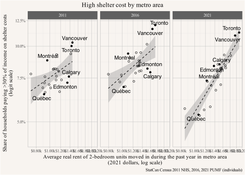{#fig-unaffordable-housing-need-rents2 fig-pos='H'}
:::
:::


Results suggest that for a 30% decrease in rents, which would bring Vancouver's market rents close to Montréal's levels (which were around 35% lower than Vancouver for the last three censuses), we would expect to see a roughly 17% and 21% reduction in the overall share of the population paying more than 30% of income on shelter costs in 2011 and 2016. In terms of households, this would translate to a 12% and 14% reduction in the overall share paying more than 30% of income on shelter costs in 2011 and 2016, bringing Metro Vancouver close to the Canadian average, including newly formed households by existing as well as new residents.

These reductions in the share of households paying more than 30% of income on shelter costs are significantly lower than the estimates we found in the previous section where we (naively) held households fixed. Why the discrepancy? This brings us to the next section that tries to understand new household formation due to lower rents in more detail.

## Household formation and rents

Households are malleable, and who decides to live together or strike out on their own responds to rents. In previous work we have looked in detail how household formation varies across metro areas and across time. [@estimating-suppressed-household-formation.2022; @still-short-suppressed-households-in-2021.2022; @housing-outcomes.2023], and we will have more to say about this soon where we model individual level decision making in how households are formed. [@mhu.2024]

Here we briefly recap the building blocks for this analysis: Minimal Household Units (MHU). Ermisch and Overton introduced the concept of Minimal Household Units (MHU) to better understand household formation. [@ermisch1985minimal] The idea is to define elemental building blocks of households, which may be combined to form “complex” households. They start with single adults, parent-child, and couple relationships where we typically assume people want to live together, leaving four basic building blocks for households as:

-   Adult individuals (MHU1)
-   Lone parents with dependent children (MHU2)
-   Childless married (or common law) couples (MHU3)
-   Married (or common law) couples with dependent children (MHU4)

People obviously aren't limited to living in these MHU forms of household, and may desire to live in other arrangements as well. But where we find people living in other arrangements, we shouldn't assume they find them optimal. It's at least as possible that people find themselves forced to live in non-MHU arrangements due to housing costs. To return to our musical chairs metaphor, MHU households are where people are most likely to keep sharing a chair even if more chairs were made available. Correspondingly, MHU analysis enables a peek at where housing costs produce households that would likely split apart if conditions were cheaper. This is perfect for our purposes here, and we have played around enough with this concept in past work, including identifying where it may fall short, to feel comfortable applying MHU analysis here. [@housing-outcomes.2023]

To start with, let's take a look at Core Housing Need status by MHU Status, both for Canada as a whole, and for Metro Vancouver in particular, as per @fig-mhu-status-by-chn. As noted above, we can clearly see that single person adult households and single adult with children households are overrepresented within the Core Housing Need category, as well as within the group of households excluded from the measurement. By contrast, couples, and couples with kids are much more dominant within the set of households NOT considered in Core Housing Need.


::: {.cell}

```{.r .cell-code}
mhu_cats_2021 <- c("Married spouse or common-law partner without children",
                   "Married spouse or common-law partner with children",
                   "Parent in a one-parent family","Person living alone")

mhu_hh_cats_2021<- c(
  "One-census-family household without additional persons: Couple without children",
  "One-census-family household without additional persons: Couple with children",
  "One-census-family household without additional persons: one-parent family",
  "Non-census-family household: one-person household")

mhu_2016_recodes <- c(
  "Non-census-family household: one-person household"="Non-census-family households One person household",
  "One-census-family household without additional persons: one-parent family"="One-census-family household without additional persons: Lone parent family",
  "One-census-family household with additional persons: one-parent family"="One-census-family household with additional persons: Lone parent family",
  "Non-census-family household: two-or-more-person non-census-family household"="Non-census-family household: Two or more person non-census-family household"
)

cfstat_2016_recodes <- c(
  "Parent in a one-parent family"="Lone parent",
  "Child of a parent in a one-parent family"="Child of a lone parent",
  "Person not in a census family living with non-relatives only"="Person living with non-relatives only"
)

fam_grep_string <- "common-law|married|spouse|partner|Comlaw|Commlaw|husband|wife"

mhu4_cats_2021 <- c("Married spouse or common-law partner with children")


mhu_data <- bind_rows(pumf_2021,
                      pumf_2016 |> 
                        mutate(across(c(CHDBN,CQPPB,CAPGN,CHLDC,EICBN,EMPIN,GOVTI,GTRFS,INCTAX,INVST,MRKINC,
                                        OASGI,OTINC,RETIR,SEMPI,TOTINC_AT,VALUE,WAGES),
                                      as.numeric)) |>
                        mutate(HHTYPE=fct_recode(HHTYPE,!!!mhu_2016_recodes)) |>
                        mutate(CFSTAT=fct_recode(CFSTAT,!!!cfstat_2016_recodes))) |>
  mutate(across(c(TOTINC,VALUE),\(x)ifelse(x>=88888888,NA,x)))  |>
  mutate(child=AGEGRP %in% c("0 to 4 years","5 to 6 years", "7 to 9 years", "10 to 11 years","12 to 14 years",
                             "15 to 17 years","18 to 19 years")) |>
  mutate(MHU_CFSTAT=CFSTAT %in% mhu_cats_2021 | 
           (CFSTAT %in% c("Child of a couple","Child of a parent in a one-parent family") & child)) |>
  mutate(MHU_HHTYPE=HHTYPE %in% mhu_hh_cats_2021) |>
  mutate(MHU_hhcf=MHU_CFSTAT&MHU_HHTYPE) |>
  mutate(MHU4=CFSTAT %in% mhu4_cats_2021 | 
           (CFSTAT %in% c("Child of a couple") & child)) |>
  mutate(GROSRT=SHELCO) |>
  mutate(HHCLASS="Private household") |>
  mutate(SEX=fct_recode(GENDER,"Female"="Woman+","Male"="Man+")) |>
  mutate(HHSIZE=fct_recode(HHSIZE,NULL = "Not available")) |>
  mutate(CFSIZE=fct_recode(CFSIZE,"1 person"="Person not in a census family",NULL = "Not available")) |>
  mutate(HHSIZE_n=as.numeric(substr(HHSIZE,1,2) |> gsub(" |\\+","",x=_))) |>
  mutate(CFSIZE_n=as.numeric(substr(CFSIZE,1,2) |> gsub(" |\\+","",x=_))) |>
  #mutate(CFSIZE_n=ifelse(CFSIZE=="Non-family person",1,CFSIZE_n)) |>
  mutate(MHU_size=case_when(is.na(CFSIZE_n)|is.na(HHSIZE_n) ~ NA,
                            CFSIZE_n==HHSIZE_n ~ TRUE,
                            CFSIZE_n>=HHSIZE_n ~ NA,
                            CFSIZE_n<HHSIZE_n ~ FALSE,
                            TRUE ~ NA)) |>
  mutate(MHU_size=coalesce(MHU_size & (!grepl("Child of a",CFSTAT) | child),
                           (!grepl("Child of a",CFSTAT) | child))) |>
  mutate(MHU=coalesce(MHU_size&MHU_hhcf,MHU_hhcf)) |>
  mutate(MHU1=MHU&(!is.na(CFSIZE_n) & CFSIZE_n==1 | 
                     is.na(CFSIZE_n) & CFSTAT %in% c("Person living alone","NCFPL Living alone"))) |>
  mutate(MHU2=MHU & (grepl("lone parent|lone-parent|Lonepar|one-parent",CFSTAT,ignore.case = TRUE) |
                       HHTYPE=="One-family only households: Lone parents")) |>
  mutate(MHU3=MHU&(!is.na(CFSIZE) & CFSIZE_n==2 & grepl(fam_grep_string,CFSTAT,ignore.case = TRUE) |
                     is.na(CFSIZE_n) & HHTYPE %in% c("One-census-family household without additional persons: Couple without children",
                                                     "One-family only households: Married couples or common-law partners without children"))) |>
  mutate(MHU4=MHU&(!is.na(CFSIZE) & CFSIZE_n>2 & grepl(fam_grep_string,CFSTAT,ignore.case = TRUE) |
                     is.na(CFSIZE_n) & HHTYPE %in% c("Fam-Oneh-Cou-NowM-wNMSD-woAP",
                                                     "One-census-family household without additional persons: Couple with children",
                                                     "One-family only households: Married couples or common-law partners with children") | (CFSTAT %in% c("Child of a couple") & child) )) |>
  mutate(MHU_cat=case_when(
    MHU1 ~ "Single adult (MHU1)",
    MHU2 ~ "Single with kid(s) (MHU2)",
    MHU3 ~ "Couple adult (MHU3)",
    MHU4 ~ "Couple with kid(s) (MHU4)",
    TRUE ~ "Non-MHU",
  )) |>
  mutate(MHU_cat=factor(MHU_cat,levels=c("Single adult (MHU1)","Single with kid(s) (MHU2)","Couple adult (MHU3)","Couple with kid(s) (MHU4)","Non-MHU"))) |>
  mutate(school=case_when(is.na(ATTSCH) | ATTSCH == "Not available" ~ "Not available",
                          ATTSCH %in% c("Not applicable","Not applicable (< 15 years)") ~ "Not applicable",
                          ATTSCH %in% c("Did not attend in past 9 mths.",
                                        "NotAttendPast8Months",
                                        "Did not attend school",
                                        "Do not attend",
                                        "Not attending school") ~ "Not attending school", 
                          TRUE ~ "Attending school")) |>
  mutate(NMHU_cat = case_when(
    MHU ~ "MHU",
    HHTYPE == "Non-census-family household: two-or-more-person non-census-family household" ~ "Living with roommates",
    HHTYPE == "Multiple-census-family household" ~ "Living in multifamily household",
    CFSTAT =="Person not in a census family but living with other relatives" ~ "Living with relatives",
    CFSTAT %in% c("Child of a couple","Child of a parent in a one-parent family") & 
      AGEGRP %in% c("25 to 29 years",    "30 to 34 years",    "35 to 39 years") ~ "Young adult 25 to 39 living with parents",
    CFSTAT %in% c("Child of a couple","Child of a parent in a one-parent family") & 
      AGEGRP %in% c("20 to 24 years") ~ "20 to 24 year old living with parents",
    CFSTAT %in% c("Child of a couple","Child of a parent in a one-parent family") & 
      AGEGRP %in% c("40 to 44 years",    "45 to 49 years",    "50 to 54 years") ~ "Older adult 40+ living with parents",
    HHTYPE %in% c("One-census-family household with additional persons: Couple without children",
                  "One-census-family household with additional persons: Couple with children",
                  "One-census-family household with additional persons: one-parent family")  ~ "Living in complex household",
    Year=="2006" & HHTYPE %in% c("One family, common-law couple",
                                 "One family, lone parent family",
                                 "One family, married couple") ~ "Living in complex household",
    TRUE ~ "Other"
  )) |>
  mutate(NMHU_cat=factor(NMHU_cat,
                         levels=c("20 to 24 year old living with parents",
                                  "Young adult 25 to 39 living with parents",
                                  "Older adult 40+ living with parents",
                                  "Living in multifamily household",
                                  "Living with roommates","Living with relatives",
                                  "Living in complex household","Other","MHU"))) |>
  mutate(MHU_full=case_when(
    MHU ~ MHU_cat,
    TRUE ~ NMHU_cat
  )) |>
  mutate(MHU_full=factor(MHU_full,setdiff(c(levels(MHU_cat),levels(NMHU_cat)),c("MHU","Non-MHU")))) |>
  mutate(Maintainer=case_when(PRIHM %in% c("Yes","Primary household maintainer","PrimaryHhldMaintainr",
                                           "Person is primary maintainer")~ "Maintainer",
                              PRIHM %in% c("No","Not primary hhld. maintainer","NoPrimryHhldMaintain",
                                           "Not primary household maintainer","Person is not primary maintainer")~ "Not a maintainer",
                              PRIHM=="Not applicable"~ "Not applicable",
                              TRUE ~ "Other")) |>
    mutate(EFDECILE=fct_recode(EFDECILE,
                             !!!setNames(pumf_2021$EFDECILE |> levels(),
                                         pumf_2016$EFDECILE |> levels())),
         SUBSIDY=fct_recode(SUBSIDY,
                             !!!setNames(c("Not subsidized", "Subsidized", "Not available", "Not applicable"),
                                         c("No, not a subsidized dwelling", "Yes, a subsidized dwelling", "Not available", "Not applicable" ))))

mhu_full_colours <- setNames(c(RColorBrewer::brewer.pal(5,"YlGn")[2:5] |> rev(),
                               RColorBrewer::brewer.pal(9,"OrRd")[2:9] |> rev()),
                             mhu_data$MHU_full |> levels())


mhu_data |> 
  #filter(PRIHM=="Person is primary maintainer") |>
  summarize(Count=sum(WEIGHT),
            .by=c(MHU_full,HCORENEED_IND,Year)) |>
  mutate(CMA=factor("Canada")) |>
  bind_rows(mhu_data |> 
              #filter(PRIHM=="Person is primary maintainer") |>
              summarize(Count=sum(WEIGHT),
                        .by=c(MHU_full,HCORENEED_IND,CMA,Year)) |>
              filter(CMA %in% c("Vancouver"#,"Calgary","Toronto","Montréal","Québec"
              )))  %>%
  mutate(CMA=factor(CMA,levels=summarize(.,Count=sum(Count),.by=CMA) |> arrange(-Count) |> pull(CMA))) |>
  ggplot(aes(y=fct_rev(HCORENEED_IND),x=Count,fill=fct_rev(MHU_full)))+
  geom_bar(stat="identity",position="fill") +
  # scale_x_continuous(labels = \(x)scales::comma(x,scale=10^-3,suffix="k")) +
  scale_x_continuous(labels = scales::percent) +
  scale_fill_manual(values=mhu_full_colours) +
  facet_grid(Year~CMA,scales="free_x") +
  guides(fill=guide_legend(reverse = TRUE)) +
  labs(title="Population in private households by Minimum Household Unit status",
       subtitle="(counting parents of adult children as in MHU)",
       y=NULL,
       fill="Status",
       x="Share of people",
       caption="Data: StatCan Census 2021 PUMF (individuals)")
```

::: {.cell-output-display}
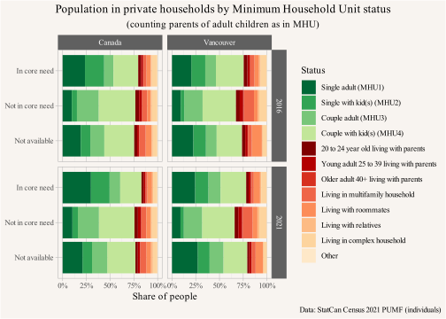{#fig-mhu-status-by-chn fig-pos='H'}
:::
:::


Most households overall, both within and outside of Core Housing Need, are in our MHU (Minimal Household Unit) categories. But comparing horizontally, we can see a greater proportion of complicated households in the non-MHU categories are showing up in pricey Vancouver than across Canada as whole. In general, these non-MHU households mostly show up as Not in Core Housing Need. This is one of our indicators that people respond to high housing costs by doubling up. Once they double up, their combined incomes better enable them to spend less than 30% of their income on shelter costs. But residents of these doubled up households might not consider their living arrangements as optimal. Instead, their household types often reflect their unmet need.

Let's look more specifically at people living in non-MHU households, and break them out by age, as per @fig-non-mhu. We're pulling the 20 to 24 year olds out from the broader category of other young adults living with their parents primarily because their status as adults is more malleable, as is how their residency is recorded within the Census (post-secondary students are often recorded as living with their parents, even if they spend most of the year away at school).


::: {.cell}

```{.r .cell-code}
mhu_data |> 
  filter(NMHU_cat!="MHU") |> 
  summarize(Count=sum(WEIGHT),
            .by=c(NMHU_cat,AGEGRP,Year)) |>
  mutate(CMA=factor("Canada")) |>
  bind_rows(mhu_data |> 
  filter(NMHU_cat!="MHU") |> 
  summarize(Count=sum(WEIGHT),
            .by=c(NMHU_cat,CMA,AGEGRP,Year)) |>
    filter(CMA %in% c("Vancouver"#,"Calgary","Toronto","Montréal","Québec"
                      )))  %>%
  mutate(CMA=factor(CMA,levels=summarize(.,Count=sum(Count),.by=CMA) |> arrange(-Count) |> pull(CMA))) |>
  mutate(AGEGRP=droplevels(AGEGRP)) |>
  ggplot(aes(y=fct_rev(NMHU_cat),x=Count,fill=fct_rev(AGEGRP)))+
  geom_bar(stat="identity") +
  scale_x_continuous(labels = \(x)scales::comma(x,scale=10^-3,suffix="k")) +
  facet_grid(Year~CMA,scales="free_x") +
  guides(fill=guide_legend(reverse = TRUE)) +
  labs(title="Population in private households not in Minimum Household Units",
       subtitle="(not counting parents of adult children)",
       y=NULL,
       fill="Age",
       x="Number of people",
       caption="Data: StatCan Census 2021 PUMF (individuals)")
```

::: {.cell-output-display}
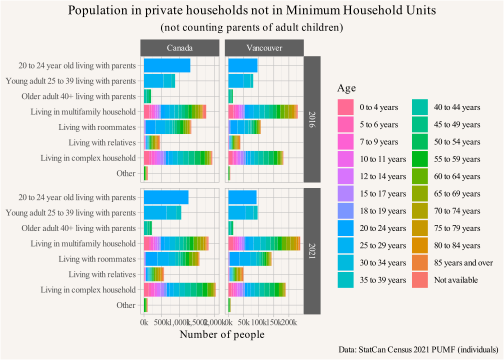{#fig-non-mhu fig-pos='H'}
:::
:::


Overall there is a fair amount of diversity in non-MHU household arrangements, including lots of single adults living with their parents, but also lots of multigenerational families, where parents live with their coupled children and/or grandchildren. Living with roommates is also common, especially for young adults. Complex households, including for instance unrelated adults living with couples, remain complex. To emphasize a point, many of these households might choose to live together even if they weren't forced to do so by housing costs. But housing costs are probably a major reason for their shared arrangements, and if rent got cheaper, there's a decent chance these households would fissure.

This helps understand how people adapt to our current housing shortage by doubling up, and we have traced out elsewhere how this changed over time and how shares of doubling up vary across metro areas. [@housing-outcomes.2023; @tenure-and-household-independence-across-the-life-course-1981-2021.2024] But how does doubling up relate to prevailing rent levels, and how many more households can we expect to form if rents drop? @fig-mhu-share-rent shows the relationship between metro area share of the population not in minimum household units and prevailing rents.


::: {.cell}

```{.r .cell-code}
mhu_model_data <- mhu_data %>%
  mutate(CMA=factor(CMA,levels=summarize(.,Count=sum(WEIGHT),.by=CMA) |> arrange(-Count) |> pull(CMA))) |>
  summarize(Count=sum(WEIGHT),
            .by=c(MHU,CMA,Year)) |>
  mutate(Share=Count/sum(Count),.by=c(CMA,Year)) |>
  filter(!MHU) |>
  left_join(rent,by=c("CMA","Year")) 

model_years <- c("2016","2021")
all_years <- c("2011","2016","2021")
year_colours <- setNames(sanzo::trios$c142 |> rev(),all_years)

mhu.fit <- prihm.fit <- expand.grid(Year=factor(model_years)) |> 
  group_by(Year) |>
  group_modify(~ {.x |> 
      mutate(fit=list(glm(Share ~ log(real_rent),data=mhu_model_data |> filter(Year==.y$Year),
                          family=quasibinomial(link="logit")))) |>
      mutate(rent=coef(unlist(fit,recursive=FALSE))["log(real_rent)"] |> as.numeric())
      }) 

mhu.fit <- model_years |>
  lapply(\(y) glm(Share ~ log(real_rent),data=mhu_model_data |> filter(Year==y),
                          family=quasibinomial(link="logit"))) |>
  setNames(model_years)

mhu.coeffs <- mhu.fit |>
  modelsummary::modelplot(draw=FALSE,coef_omit="Intercept") 

mhu.effect <- model_years |>
  lapply(\(y) marginaleffects::avg_comparisons(mhu.fit[[y]],
                                               variables=list(real_rent=(mhu_model_data |> 
                                                                           filter(CMA %in% c("Vancouver"),
                                                                                  Year==y) |>
                                                                           arrange(-real_rent) |>
                                                                           pull(real_rent))*c(1,0.7)))) |>
  setNames(model_years)

mhu.effect_vancouver_0.3 <- mhu.effect |>
  lapply(\(me)me$estimate) 

mhu_model_data |>
  ggplot(aes(y=Share,x=real_rent,colour=Year))+
  geom_smooth(method="lm",formula=y~x) +
  geom_point(shape=21) +
  geom_point(data=~filter(.,CMA %in% c("Vancouver","Montréal")),show.legend = FALSE) +
  ggrepel::geom_label_repel(data=~filter(.,CMA %in% c("Vancouver","Montréal")),aes(label=CMA),
                            fill="#ffffff88",show.legend = FALSE) +
  scale_colour_manual(values=year_colours) +
  scale_x_continuous(labels = \(x)scales::dollar(x,scale=10^-3,suffix="k"),trans="log") +
  scale_y_continuous(labels = scales::percent,trans="logit",
                     breaks=seq(0.05,30,0.05)) +
  labs(title="Population in private households not in Minimum Household Units",
       subtitle="(not counting parents of adult children)",
       y="Share of population not in MHU (logit scale)",
       x="Average real 2-bedroom rent of recent movers (2021 dollars, log scale)",
       caption="Data: StatCan Census 2021 PUMF (individuals)")
```

::: {.cell-output-display}
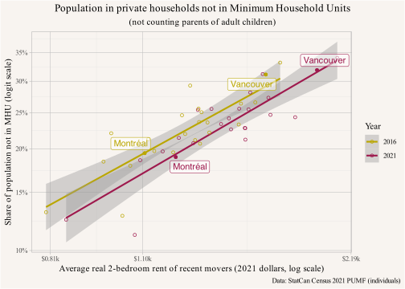{#fig-mhu-share-rent fig-pos='H'}
:::
:::


There are some caveats for interpreting this relationship causally. The simplified linear plot is missing some important confounders, in particular income, couple status, and some measure of cultural openness to non-MHU living arrangements. The outlier in the lower left, Metro Québec, has high incomes and a comparatively homogeneous cultural makeup. We investigate this in more detail elsewhere [@mhu.2024] to show that even after accounting for these (and other) factors the relationship between rents and MHU status remains of similar strength and there is good reason to interpret it causally. Taking this graph at face value it suggests that a 30% reduction in rents leads to a 9 percentage point reduction in the share of the population not in MHU, bringing Vancouver close to Montréal's share.


Reversing this interpretation and using a slightly different measure, we can look at primary household maintainer rates (also known as household headship rates). Statistics Canada defines this as the first person listed in the household roster who contributes to paying rent, mortgage, or other shared household costs, so only one person is identified as the primary maintainer for every household. This isn't quite as neat a measure as MHU status, insofar as, e.g., a two-person household containing a couple, two roommates, or a parent and adult child would all have the same maintainer rate (0.5), even though we're probably only safe in assuming the couple would continue living together if a free apartment was offered (and even this might be debated!) But household maintainer rates are easier to calculate than MHU status, and provide us with another check on the underlying relationship to rent. @fig-prihm-share-rent provides a look at this relationship, which largely replicates the MHU analysis above. As rents go up, household maintainer rates go down.


::: {.cell}

```{.r .cell-code}
prihm_model_data_age <- mhu_data |>
  filter(!(AGEGRP %in% c("0 to 4 years","5 to 6 years","7 to 9 years","10 to 11 years","12 to 14 years"))) %>%
  mutate(CMA=factor(CMA,levels=summarize(.,Count=sum(WEIGHT),.by=CMA) |> arrange(-Count) |> pull(CMA))) |>
  summarize(Count=sum(WEIGHT),
            .by=c(PRIHM,CMA,Year,AGEGRP)) |>
  mutate(Share=Count/sum(Count),.by=c(CMA,Year,AGEGRP))

age_model_data <- mhu_data |>
  filter(AGEGRP !="Not available",Year=="2021") %>%
  mutate(CMA=factor(CMA,levels=summarize(.,Count=sum(WEIGHT),.by=CMA) |> arrange(-Count) |> pull(CMA))) |>
  summarize(Pop=sum(WEIGHT),
            .by=c(AGEGRP)) 


prihm_model_data <- prihm_model_data_age |>
  inner_join(age_model_data,by=c("AGEGRP")) |>
  summarize(Share=weighted.mean(Share,Pop),
            Count=sum(Count),
            .by=c(CMA,Year,PRIHM)) |>
  mutate(naiveShare=Count/sum(Count),.by=c(CMA,Year)) |>
  left_join(rent,by=c("CMA","Year"))  |>
  filter(PRIHM=="Person is primary maintainer") 

prihm.fit <- expand.grid(Year=factor(model_years)) |> 
  group_by(Year) |>
  group_modify(~ {.x |> 
      mutate(fit=list(glm(Share ~ log(real_rent),data=prihm_model_data |> filter(Year==.y$Year),
             family=quasibinomial(link='logit')))) |>
      mutate(rent=coef(unlist(fit,recursive=FALSE))["log(real_rent)"] |> as.numeric()) |>
      mutate(fit2=list(glm(log(naiveShare) ~ log(real_rent),data=prihm_model_data |> filter(Year==.y$Year)))) |>
      mutate(rent2=coef(unlist(fit2,recursive=FALSE))["log(real_rent)"] |> as.numeric())
      }) 

prihm.fit <- model_years |>
  lapply(\(y) glm(Share ~ log(real_rent),data=prihm_model_data |> filter(Year==y),
                          family=quasibinomial(link="logit"))) |>
  setNames(model_years)

  
prihm.effect <- model_years |>
  lapply(\(y) 
         marginaleffects::avg_comparisons(prihm.fit[[y]],
                                          variables=list(real_rent=(mhu_model_data |> 
                                                                      filter(CMA %in% c("Vancouver"),
                                                                             Year==y) |>
                                                                      arrange(-real_rent) |>
                                                                      pull(real_rent))*c(1,0.7))
         )) |>
  setNames(model_years)

prihm.effect_vancouver_0.3 <- prihm.effect |>
  lapply(\(me)me$estimate) 


prihm_model_data |>
  ggplot(aes(y=Share,x=real_rent,colour=Year))+
  geom_smooth(method="lm",formula=y~x) +
  geom_point(shape=21) +
  geom_point(data=~filter(.,CMA %in% c("Vancouver","Montréal")),show.legend = FALSE) +
  ggrepel::geom_label_repel(data=~filter(.,CMA %in% c("Vancouver","Montréal")),aes(label=CMA),
                            fill="#ffffff88",show.legend = FALSE) +
  scale_colour_manual(values=year_colours) +
  scale_x_continuous(labels = \(x)scales::dollar(x,scale=10^-3,suffix="k"),trans="log") +
  scale_y_continuous(labels = scales::percent,trans="logit",
                     breaks=seq(0.05,30,0.05)) +
  labs(title="Household maintainer rates of the population 15 years or over in private households",
       subtitle="(Age-adjusted to 2021 Canada population)",
       y="Age-adjusted household maintainer rate (logit scale)",
       x="Average real 2-bedroom rent of recent movers (2021 dollars, log scale)",
       caption="Data: StatCan Census 2021 PUMF (individuals)")
```

::: {.cell-output-display}
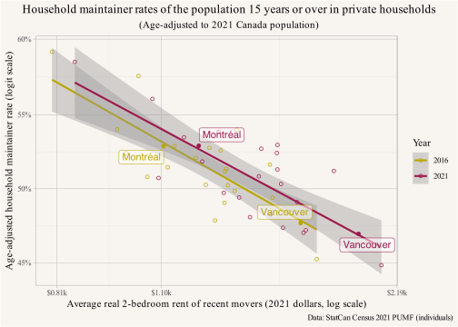{#fig-prihm-share-rent fig-pos='H'}
:::
:::


Interpreted causally this suggests that a 30% reduction in rent leads to a 5 percentage point higher household maintainer rate, which translates into 9% more households just from the population that already lives in the region and not accounting for fewer people leaving the region or more moving there if rents were 30% lower. Of course we don't have an additional 9% housing units for these households to form, and that pent-up demand provides a very tangible reason why rents aren't 30% lower.

This affects different age groups differently. Young adults stand to benefit most from rent reduction by increasing household formation. @fig-prihm-share-rent-age shows this much higher sensitivity compared to the overall population.


::: {.cell}

```{.r .cell-code}
prihm_model_age_groups <-c("25 to 29 years","30 to 34 years","35 to 39 years")

prihm_model_data_age_clean <- prihm_model_data_age |>
  left_join(rent,by=c("CMA","Year")) |>
  filter(PRIHM=="Person is primary maintainer") |>
  filter(AGEGRP %in% prihm_model_age_groups) 

prihm.fit <- expand.grid(AGEGRP=factor(prihm_model_age_groups,
                                       levels=prihm_model_data_age_clean$AGEGRP |>
                                         levels()),Year=factor(model_years)) |> 
  group_by(AGEGRP,Year) |>
  group_modify(~ {
    m<-glm(Share ~ log(real_rent),
           data=prihm_model_data_age_clean |>
             filter(AGEGRP==.y$AGEGRP,Year==.y$Year),
           family=quasibinomial(link='logit'))
    r <- (prihm_model_data_age_clean |> 
            filter(CMA %in% c("Vancouver"),
                   AGEGRP==.y$AGEGRP,Year==.y$Year) |>
            arrange(-real_rent) |>
            pull(real_rent))*c(1,0.7)
    .x |> 
      mutate(fit=list(m)) |>
      mutate(rent=coef(unlist(fit,recursive=FALSE))["log(real_rent)"] |> as.numeric()) |>
      mutate(rent_effect=marginaleffects::avg_comparisons(m,variables=list(real_rent=r))$estimate)
  }) |> 
  ungroup() |> 
  left_join(prihm_model_data_age_clean |>
              filter(CMA=="Vancouver") |>
              select(AGEGRP,Year,Share),
            by=c("AGEGRP","Year")) |>
  mutate(pct_effect=rent_effect/Share) 
      
prihm.effect_age_vancouver_0.3<- prihm.fit |>
  summarize(rent_effect=mean(rent_effect),
            pct_effect=mean(pct_effect),.by=AGEGRP) 
  
prihm_model_data_age_clean  |>
  ggplot(aes(y=Share,x=real_rent,colour=Year))+
  geom_smooth(method="lm",formula=y~x) +
  geom_point(shape=21) +
  # geom_point(data=~filter(.,CMA %in% c("Vancouver","Montréal")),show.legend = FALSE) +
  # ggrepel::geom_label_repel(data=~filter(.,CMA %in% c("Vancouver","Montréal")),aes(label=CMA),
  #                           fill="#ffffff88",show.legend = FALSE) +
  scale_x_continuous(labels = \(x)scales::dollar(x,scale=10^-3,suffix="k"),trans="log") +
  scale_y_continuous(labels = scales::percent,trans="logit",
                     breaks=seq(0.05,30,0.05)) +
  scale_colour_manual(values=year_colours) +
  facet_wrap(~AGEGRP,scales="free_y") +
  labs(title="Household formation by age and prevailing rents",
       y="Household maintainer rate (logit scale)",
       x="Average 2-bedroom rent of recent movers (log scale)",
       caption="Data: StatCan Census 2021 PUMF (individuals)")
```

::: {.cell-output-display}
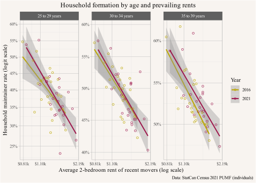{#fig-prihm-share-rent-age fig-pos='H'}
:::
:::


This shows a 30% decrease in rents leads to a 8, 5, and 4 percentage points higher household formation rate, translating into 25%, 11%, and 9% more households, for the age groups 25 to 29 years, 30 to 34 years, and 35 to 39 years, respectively.

To summarize, more housing would lead to lower rents, which in turn would still lead to a lower share of households in core housing need. But lower rents would also lead to more households overall, even if we held the population constant. And that's because high rents suppress household formation by forcing people to live together who would otherwise prefer to live apart. Even though we expect Core Housing Need to decrease overall as estimated in @sec-rents-housing-pressures, many of the new households created would be at higher risk of core need than the non-MHU households they left behind, pointing to some of the complexities of Core Housing Need measurement as well as its underlying churn. Nevertheless, we can also see how more housing would have broad benefits extending beyond the Core Housing Need measure. And this also ties back to our earlier observation that Core Housing Need, as well as shelter-cost-to-income ratio affordability measures, have significant shortfalls when housing shortages impact household formation, as we have discussed before. [@housing-outcomes.2023]

What about if we don't hold population constant?

## Triangulating migration effects

We're not worried about all sources population change (i.e. births, deaths, and migration). Births tend to take place within household contexts without much effect on the number of households. More broadly, changes in births and deaths tend to be slow moving, and don't adjust much to housing availability. The same cannot be said of migration. If housing in Vancouver was cheaper, more people would probably move here, and fewer people would move away.

Migration effects are difficult to estimate, but we can approximate them by considering the gap between impacts on household formation rates and our general understanding of demand elasticities to price. General econometric estimates suggest that for each 1% increase in housing stock we expect a roughly 2% decrease in prices and rents.[^5] Or conversely, to a achieve a 30% decrease in rents we would need to increase housing stock by about 15%. In the previous section we estimated that this would increase household formation by about 9%, and if tuned specifically to Vancouver this increases to 10%. The remaining 5% of housing growth needed to achieve our 30% rent reduction can mostly be interpreted as filling demand from increased net in-migration. These are the people being held back from living in Vancouver due to high rents, but who would move (or stay) here if rents were cheaper.

[^5]: These estimates come with considerable uncertainties, and using them to triangulate effects as we do here pushes the limits of what these kind of estimates can be used for. Our purpose here is to show that these estimates are generally consistent with our household formation estimates and leave room for migration effects. Demand elasticity estimates are generally thought to vary across metro areas, but precise region-specific elasticities are difficult to estimate. Additionally, a 30% rediction in rents is a large change that puts us far from the current housing situation, and it is not clear that elasticity estimates adequately model the functional relationship to allow extrapolation over such a broad range.

This assumes that households generally occupy just one dwelling, setting aside vacation homes and other long-term vacancies. Setting these aside seems to be a pretty safe assumption in Vancouver, given what we know from Empty Homes Tax and Speculation and Vacancy Tax data, but it might not hold everywhere.[@three-years-svt.2021] More importantly, these kind of estimates by triangulation of estimates of quantities using different methods are error prone. They should be taken with a grain of salt, but they give us at least some idea of how these different demand components, suppressed household formation and suppressed migration, might split if housing costs were cheaper in Vancouver. We expect different methods would come up with different splits, and we would also expect the splits to vary by metropolitan area. But while further triangulation, or better, a way to directly estimate migration effects, would be helpful, this provides a start at linking an expected demographic response to a big supply increase.


# Other considerations

The above provides a decent summarization of the distributional effects we expect. But there are are a couple of other things we want to consider that may factor into further refinements of our projections. In particular, just as rent control can partially insulate long-term tenants from rapid rise in market rents, it also potentially insulates long-term tenants from the benefits of a drop in market rents, so we want to take a look at possible rent control effects. We also want to think a little more about the other side of our affordability metrics: incomes. Should we really be holding them constant? 

## Rent control {#sec-rent-control}

British Columbia has rent control tied to tenancies (not to units). The province controls the amount that landlords can raise rents for existing tenants. By contrast, landlords can set rents for new tenants at turnover to whatever they think the market will bear. As a result, long-term tenants tend to have much lower rents than new tenants. Currently there is a protective effect of rent control if long-term tenants stay put, but they lose this effect if they wish to move. This protective effect means that long-term tenants may not benefit as much from new supply. We can estimate the protective effect of rent control as a *Moving Penalty*, that is how much more in rent a sitting 2-bedroom tenant might pay if they had to move and rent an equivalent 2-bedroom unit at market rates. Working with census data to get some sense of long-term tenancy benefits, we compare rents of households who did not move in the past 5 years to those who moved in the past year as shown in @fig-moving-penalty.


::: {.cell}

```{.r .cell-code}
mp <- rent |>
  inner_join(old_rent,by=c("CMA","Year")) |>
  mutate(`Moving penalty`=real_rent/real_old_rent-1) %>%
  mutate(CMA=factor(CMA,levels=filter(.,Year=="2021") |> arrange(`Moving penalty`) |> pull(CMA))) 

mp |>
  filter(CMA!="Other") |>
  ggplot(aes(y=CMA,x=`Moving penalty`,fill=Year))+
  geom_bar(stat="identity",position="dodge") +
  scale_fill_manual(values=year_colours ) +
  guides(fill=guide_legend(reverse = TRUE)) +
  scale_x_continuous(labels = scales::percent) +
  labs(title="Moving penalty for people renting 2 bedroom units\nfor more than 5 years",
       y=NULL,
       x="Ratio of rents of people who did not move in previous 5 years to those who moved in previous year.",
       caption="StatCan Census 2011 NHS, 2016, 2021 PUMF (individuals)")
```

::: {.cell-output-display}
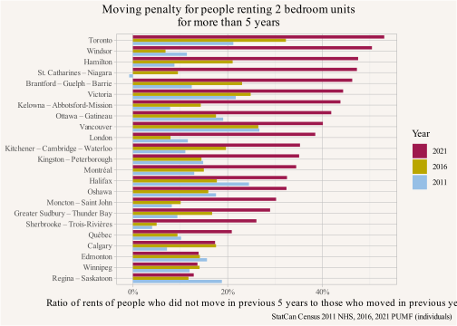{#fig-moving-penalty fig-pos='H'}
:::
:::


There are some caveats to this simple measure of the moving penalty. It does not control for unit quality or location, and recent movers skew toward new buildings. Moreover, 2021 was also a special year with many provinces implementing rent freezes in the wake of the COVID pandemic. But the effects shown are sizable and stable when cross-checking against the thinner and more volatile hierarchical PUMF data (allowing for slicing by building age as an additional control). If we take non-rent controlled Calgary, Edmonton and Regina - Saskatoon as a baseline, then a 10% to 15% moving penalty might be considered *normal* in the absence of rent control. This also shows that there is no clear boundary between regions with rent control and regions without. Moderate rent control in areas that allow for a lot of new housing or don't see much demand growth may not be very binding (e.g. Québec). But a large Moving Penalty indicates strongly binding rent control.


::: {.cell}

```{.r .cell-code}
yvr_mp <- mp |>filter(CMA=="Vancouver",Year=="2021") |> pull(`Moving penalty`)

mov_share <- pumf_data |>
  #filter(Age %in% c("25 to 29 years","30 to 34 years")) |>
  filter(!(MOB5 %in% c("Not available","Not applicable"))) |>
  #filter(`Household size`=="1 person") |>
  filter(TENUR=="Renter") |>
  mutate(moved=MOB5 !="Non-movers") |>
  summarize(Count=sum(WEIGHT),
            .by=c(CMA,Year,moved)) |>
  mutate(Share=Count/sum(Count),.by=c(CMA,Year)) |>
  filter(!moved)

mov_share <- pumf_data |>
  #filter(Age %in% c("25 to 29 years","30 to 34 years")) |>
  filter(!(MOB5 %in% c("Not available","Not applicable"))) |>
  #filter(`Household size`=="1 person") |>
  filter(TENUR=="Renter") |>
  mutate(moved=MOB5 !="Non-movers") |>
  summarize(Count=sum(WEIGHT),
            .by=c(CMA,Year,moved)) |>
  mutate(Share=Count/sum(Count),.by=c(CMA,Year)) |>
  filter(!moved)


yvr_moved <- mov_share |>filter(CMA=="Vancouver",Year=="2021") |> pull(Share)
```
:::


Vancouver has a 40% moving penalty, meaning long-term tenants have a lot of protection against market rent-setting. As a result, our projected 30% market rent decrease doesn't do much to lower rent for long-term tenants who want to stay put. While renters move more often than owners, long-term tenants are still a sizeable group, including 35% of Vancouver renter households who have not moved in the previous 5 years. But even if their rents likely won't decrease, long-term tenants still benefit from the increased choice opened up by a much lower moving penalty, consequent reductions in doubling up, and potentially lower eviction pressure, especially in the secondary rental market.

This does add a caveat on some of our estimates of how many people may be lifted out of unaffordable housing by the reduction in market rent. In particular, where we hold households constant, as in @fig-cash-supports5, we know that a number of these households are probably long-time tenants. When take this into account and sum up across categories of beneficiaries, as in @fig-chn-reduction-movers, we see that the majority of the drop in those experiencing unaffordable housing comes from recent movers, not long-time tenants. But taking long-time tenants into account, the drop overall would not be as large as predicted.


::: {.cell}

```{.r .cell-code}
summary_data_people_mob <- bind_rows(pd2 |> mutate(Type="Successful\nhousing target"),
                                 pd1|> mutate(Type="Actual")) |>
  mutate(Type=factor(Type,levels=names(effect_colours))) |>
  filter(TENUR=="Renter") |>
  filter(gap>0) |>
  filter(!(MOB5 %in% c("Not available","Not applicable"))) |>
  mutate(moved=MOB5 !="Non-movers") |>
  summarize(People=sum(WEIGHT),
            gap=sum(gap*WEIGHT),
            .by=c(Type,TENUR,HCORENEED_IND,Year,moved)) 

summary_data_people_mob |>
  ggplot(aes(y=Type,x=People,fill=moved)) +
  geom_bar(stat="identity",position="stack") +
  scale_x_continuous(labels=\(x)scales::comma(x,scale=10^-3,suffix="k")) +
  scale_fill_manual(values=sanzo::duos$c103,
                    labels=c("TRUE"="Moved in\npervious 5 years",
                             "FALSE"="Did not move in\npervious 5 years")) +
  facet_wrap(~Year) +
  labs(title="",
       x="Number of people in households paying more than 30% of income on shelter costs",
       y=NULL,
       fill=NULL,
       caption="Data: StatCan Census 2021 PUMF (individuals)") 
```

::: {.cell-output-display}
{#fig-chn-reduction-movers fig-pos='H'}
:::
:::


This effect is less clearly an issue for our estimates where we break out household formation and net in-migration effects in addition to the decline in unaffordable housing, insofar as other metro areas with rent control (e.g. Montréal) are part of the predictor for how much unaffordable housing would remain in Vancouver with much lower rents, but we could still expect the specific forms of rent control to matter. 

## Income

Turning to incomes, so far we have held these constant, but we know they matter enormously in affordability metrics, and indeed we've seen how the income boosts from Covid supports affected 2021 estimates. Should we hold incomes constant where we project a large boost in housing supply? We have seen that adding housing increases both household formation of existing households as well as net in-migration. Net in-migration results in an increase in labour supply that may not be fully off-set by an increase in labour demand resulting from said in-migration. @corinth2023 assume a net downward pressure on income, which may slow the fairly strong growth in income Metro Vancouver has seen in the past. Lower incomes would worsen affordability metrics, even if they reflected greater accessibility for those previously feeling locked out of the area. At the same time, it's not clear to us that labour demand would fail to keep pace with, or even exceed, incoming supply. In particular, constructing so much housing would, itself, put an enormous amount of pressure on labour markets. Moreover, we would expect productivity gains due to increases in agglomeration effects, as well as due to small effects of shifting some consumer spending away from housing to more productive uses. Rising incomes would result in fewer people in unaffordable housing. Overall, we know incomes matter enormously for affordability, and a supply shock of the sort we're modeling here would likely also affect income distributions, but the direction and effects are difficult to fully predict.

# Dos and Don'ts of housing targets

Finally, we want to return to a discussion of housing targets. We set our target as a big overall number of net new dwellings we want to hit. But that's not how everyone approaches the matter. The broad distributional effects of hitting our target are why we think our approach is the right one. Here we want to turn to consideration of the problems with some of the alternatives.

Housing targets are generally seen as the way out of our current housing shortage. Ideally we would not need targets but reshape our housing system in a way that it would broadly allow people to build housing. But everything is path dependent, and housing targets might be a bridge to get us from our current regulatory framework to a different equilibrium point where the price of housing does not climb above the marginal social cost to produce it. In other words, we could treat housing as a societal good, rather than a nuisance to be regulated away.

But how should we structure housing targets? We have pointed out that housing targets strongly depend on values. [@simple-metrics-for-deciding-if-you-have-enough-housing.2019] If you’re already comfortably housed, but concerned about physical changes to your neighbourhood and value that over the desires of other people to live close to jobs and amenities, you might be inclined to set low (or even negative) housing targets. If you believe that housing is good, actually, you might set your minimum targets at the number of dwelling units the market would provide if it were not constrained by regulation like zoning. This latter is the value we chose when estimating housing targets for Metro Vancouver. [@housing-targets.2023]

Additionally, some approaches to housing targets try to set targets based on household income bands, number of bedrooms, structural type of housing (e.g. ground oriented vs apartment), or tenure. These approaches tend to ignore the broad systemic effects of adding any kind of new housing, which we detail above. A lot of other assumptions are also left implicit in these approaches, generally crafted around the ideas that: a) net in-migration is exogenous to housing costs, b) the current household mix is exogenous to housing costs, c) some set of housing needs can be readily fitted to different types of households, and d) some set of preferences can be read from current arrangements. We believe the first two assumptions are simply wrong, as we show above (see also [@housing-outcomes.2023]). Measures like Core Housing Need are directly derived from the third notion that we can fit needs to different types of households, and are fine where explicit. But from our analysis above we can already see all of the complexity of making Core Housing Needs work (where it does so), and the gaps where it doesn't work at all. The final assumption, that preferences can be read from current arrangements, tends to ignore the constraints placed on people living under housing shortage, and cycles back to why the first two assumptions are wrong. People move. Distributions of people into dwellings under current housing shortages may not transfer to distributions where housing shortages are relieved. We will consider the main approaches to target housing to specific households and briefly discuss the problems that arise when ignoring distributional effects of adding housing.

## Income

Some approaches are asking for new market housing to be built to specific income bands. This is probably well-meaning, but fundamentally misunderstands the systemic nature of how housing works. As we have seen, most moves are moves into old housing, but supply effects from new housing propagate throughout the housing system. As a result, the main purpose of new housing from an affordability perspective is to make old housing more affordable, as well as to prime the pump on moving chains that improve housing outcomes by allowing people to better match their preferences to their housing. 

Moreover, households are outcomes of systemic housing pressures. Current households and their income and shelter cost tell us something about how people are coping with the current housing market, but they are of limited use to tell us how people would distribute over households in a situation where we had more housing as imagined when setting housing targets. This requires simulating distributional effects of adding housing, both for rents and for household formation. Holding them fixed introduces significant collier bias.

Additionally structuring housing targets to income bands runs into the technical problem that there is no decent allocation mechanism to ensure that market housing targeted at specific income bands gets allocated to households in these income bands. Waitlists can supplement, or replace market allocation, of course. But then the housing simply becomes non-market housing. While there's nothing wrong with setting high targets for non-market housing, such targets shouldn't be narrowly tailored or configured to hold back additional housing from the market. As we show above, market and non-market approaches complement one another in meeting need. 

Where designed poorly, aiming housing policy only at small sub-segments of new housing runs a high risk of reducing the overall amount of housing created, to the detriment of meeting overall need. A productive way to account for the needs of those unable to find adequate housing in the market, even after housing targets are met, is to estimate the distribution of housing pressures in the counter-factual scenario where housing targets are met, and develop a strategy to address these needs with a mixture of measures like cash supports and dedicated non-market housing of various types, as we attempt to show above.

## Bedrooms or structural type

Setting targets by structural type or number of bedrooms is generally thought of as needed to better align housing production with people's preferences. For example, bedroom targets are often justified by pointing out that the market produces a lot of small 1-bedroom units, while people "prefer" larger units with more bedrooms, and there is a lack of appropriately sized housing options for families. But it's not clear why the market is thought to work against people's preferences or where the market failure lies. On the contrary, we know that in Vancouver rents per square foot are significantly higher for smaller units, giving clear evidence that people trade smaller units for the ability to live on their own. This is also reflected in our analysis of doubling up and household living arrangements, where we see that people are making tradeoffs to pool their income and share a larger unit vs living on their own in a smaller unit.

Similarly, the focus on *ground oriented* housing is often tied to housing for families, based on implicit assumptions that families can't or won't be served by apartments. [@lauster.2016] However, it is not clear what market failure exists that needs correcting when forcing housing of specific types. In fact, holding the number of bedrooms constant there is little evidence that structural type has a significant influence on how housing is used in Vancouver. [@a-bedroom-is-a-bedroom.2019] A related issue is that of minimum unit size regulation, which can work against people's preference to trade privacy for smaller spaces. While these policies are often justified as pertaining to livability concerns, it's not clear who should set the standards for livability, especially when those standards often lead to adaptive doubling up or exclusion altogether. [@lauster2019s] We should also keep in mind that households themselves are adaptive, and may not conform to planner expectations (e.g. households of grumpy roommates who wish they had their own place may come to fill the 2BR units built to attract or retain families with children).

There may be a case for forcing developers to build more 2 and 3 bedroom units, or build more *ground oriented* housing, or build larger dwellings than they would if otherwise left to respond to where they saw demand, but these cases do not come without tradeoffs, and the tradeoffs should be made explicit. This is especially the case where part of the tradeoff involves a reduction in housing overall. 

For instance, a case could be made that diversity in housing types is, itself, an important quality to bring to neighbourhoods, better promoting inclusion and enabling people to age in place. Note these are two different goals! The strongest application of such a case would be to low-density suburbs, currently the most homogenous of neighbourhoods in terms of housing typologies. Diversification of housing types in low-density neighbourhoods could increase the overall number of dwellings, resulting in the distributional benefits we discuss above and promoting greater inclusion overall as well as enabling more people to age in place. But in higher density neighbourhoods some forms of diversification might suggest a reduction in the overall number of dwellings. Here more scrutiny should be placed on the costs. Diversification in the name of greater inclusion in high demand places runs up against the potential exclusion generated by producing less housing overall. Turning to our other goal of enabling people to age in place, we may want to weigh this idea against the mobility we observe and how it is usually associated with upward moves in housing quality. Maybe it's actually not such an important goal, especially when weighed against other neighbourhood goals, like ensuring inclusion, or enabling as many people to live close to transit as possible,  or enabling neighbourhoods to develop qualitatively different scenes. 

## Tenure

Lastly, setting targets by tenure (e.g. purpose-built rental vs. condominium) comes with risks too, and is likely to do more harm than good if implemented based on naive observations of current tenure frequencies. Tenure choice is ultimately downstream of housing pressures. Many people rent simply because they can't afford ownership rather than any perceived benefits, like the flexibility of being a tenant. If housing were cheaper, many such renters would likely become owners.[^6] Hence, once again, we would likely see distributional effects of increasing housing supply overall on giving more people a real choice in tenure, shifting the balance of renters to owners. 

[^6]: One could argue that here we really do see market failures, with [subsidies for ownership housing vastly exceeding those for rental housing in Canada](https://www.torontomu.ca/centre-urban-research-land-development/blog/blogentry49/), even if this is better addressed directly. Some work in that direction has recently been done with the federal government eliminating GST on rental housing and most provinces following suit and eliminating corresponding provincial taxes. This effectively treats rental housing preferentially to ownership housing where these taxes still apply and reduces the overall tax imbalance.

Producing more flexible forms of housing (e.g. condominium) that can readily switch between supporting renters or owners could better enable people to switch between tenures. But there's a catch, insofar as the very flexibility of condominium housing relative to purpose-built rental can produce less stable tenure for tenants. Setting targets for purpose-built rental housing can be aimed at providing greater security for renters than can be found in the secondary rental market. Some of that is priced in, with primary market rental renting at a premium over comparable secondary rentals, but some benefits likely remain when shifting the overall balance in the rental market. That said, the greater security of purpose-built rental housing is, in part, also a result of rent control policies that are easier to evade in the secondary rental market (where owner use enables a readier justification for eviction). As we see in our consideration of the moving penalty, this protective effect of rent control is less important when there is greater overall housing supply. 

Overall setting housing targets by tenure, which effectively pushes housing production toward one tenure or another, may be justifiable but should be carefully justified. Existing tenure-based targets are sometimes based on concerns about affordability[^7] that actively ignore the endogeneity of tenure choice. Such policies can work against people's preferences and do harm, especially if they bring down the total amount of housing constructed.

[^7]: Sometimes in this context it is argued that purpose-built rental housing is more "affordable" than secondary market condo rentals, which is flat-out false. Consumer surveys, as well as observational data, show that rents are higher in purpose-built rental units compared to condo rentals of similar quality and location. The increased security of tenure and professional management is of value and at least partially priced in.

# Conclusion

Understanding distributional effects of new housing is essential when thinking about housing policy. People move around a lot and housing acts a system. Limits on the overall amount of housing creates pressure within this system, and the households people form are in part a response to this pressure. 

We have previously estimated ambitious but attainable overall housing targets. [@housing-targets.2023] Hitting our housing targets would lead to cheaper housing, and filtering via vacancy chains would spread these effects across all sectors of the market. Cheaper housing would lead to fewer people in Core Housing Need, fewer suppressed households, and more net in-migrants, and we can at least roughly estimate how those effects might break out. To recap our results above, we expect that expanding housing by 15% would lead to a decrease in prices and rents of about 30%. This would result in about 9% more households formed from the existing population as those doubled up move apart, and an additional 5% more households from increased net in-migration, with some uncertainty especially around the split between household formation and migration components. Accounting for these new households we project the total share of the population in households spending more than 30% of their income on shelter cost would still drop by 19% with a reduction of 35% of the population in Core Housing Need due to high shelter costs. This still leaves a sizable role for non-market housing or related subsidies to meet remaining housing need.

Given the importance of distributional effects, we make the case that housing targets should first and foremost be aimed at increasing housing supply overall, and raise concerns about more narrowly designed formulations of targets. We can see how all of these outcomes flow from adding a lot more supply to the housing market. The converse also holds. Not building enough housing leads to more doubled up households, less net in-migration, and more households spending too much on rent. Moreover, these are systemic effects, rather than tied specifically to the residents moving into new housing. This is why we argue that overall housing targets are more important than attempting to micromanage what kinds of new housing get built.

Methodologically, this post takes a first stab at estimating distributional effects. Our use of PUMF data is well-suited for our estimations, enabling us to simulate how policy changes could translate throughout the system. That said, some of the models should probably continue to be refined. In particular, we have stuck mostly to estimating effects at the aggregate level, but PUMF data allows a much better understanding of the processes that affect household formation and how people live together in housing. We have undertaken more refined modelling of the household formation processes underlying distributional effects in forthcoming work [@mhu.2024], but there is a lot of room for further refinement and tailoring estimates to specific policy questions.


As usual, the code for this post is [available on GitHub](https://github.com/mountainMath/mountain_doodles/blob/main/posts/2024-08-14-distributional-effects-of-adding-housing/index.qmd) for anyone to reproduce or adapt for their own purposes.


<details>

<summary>Reproducibility receipt</summary>


::: {.cell}

```{.r .cell-code}
## datetime
Sys.time()
```

::: {.cell-output .cell-output-stdout}

```
[1] "2024-08-14 11:43:40 PDT"
```


:::

```{.r .cell-code}
## repository
git2r::repository()
```

::: {.cell-output .cell-output-stdout}

```
Local:    main /Users/jens/R/mountain_doodles
Remote:   main @ origin (https://github.com/mountainMath/mountain_doodles.git)
Head:     [9d71db5] 2024-08-14: distributional effects post
```


:::

```{.r .cell-code}
## Session info
sessionInfo()
```

::: {.cell-output .cell-output-stdout}

```
R version 4.4.1 (2024-06-14)
Platform: aarch64-apple-darwin20
Running under: macOS Sonoma 14.6.1

Matrix products: default
BLAS:   /Library/Frameworks/R.framework/Versions/4.4-arm64/Resources/lib/libRblas.0.dylib 
LAPACK: /Library/Frameworks/R.framework/Versions/4.4-arm64/Resources/lib/libRlapack.dylib;  LAPACK version 3.12.0

locale:
[1] en_US.UTF-8/en_US.UTF-8/en_US.UTF-8/C/en_US.UTF-8/en_US.UTF-8

time zone: America/Vancouver
tzcode source: internal

attached base packages:
[1] stats     graphics  grDevices utils     datasets  methods   base     

loaded via a namespace (and not attached):
 [1] vctrs_0.6.5               cli_3.6.3                
 [3] knitr_1.47                rlang_1.1.4              
 [5] xfun_0.44                 generics_0.1.3           
 [7] jsonlite_1.8.8            glue_1.7.0               
 [9] colorspace_2.1-0          git2r_0.33.0             
[11] htmltools_0.5.8.1         mountainmathHelpers_0.1.4
[13] scales_1.3.0              fansi_1.0.6              
[15] rmarkdown_2.27            grid_4.4.1               
[17] munsell_0.5.1             evaluate_0.23            
[19] tibble_3.2.1              fastmap_1.2.0            
[21] yaml_2.3.8                lifecycle_1.0.4          
[23] compiler_4.4.1            dplyr_1.1.4              
[25] pkgconfig_2.0.3           rstudioapi_0.16.0        
[27] digest_0.6.35             R6_2.5.1                 
[29] tidyselect_1.2.1          utf8_1.2.4               
[31] pillar_1.9.0              magrittr_2.0.3           
[33] tools_4.4.1               gtable_0.3.5             
[35] ggplot2_3.5.1            
```


:::
:::


</details>


