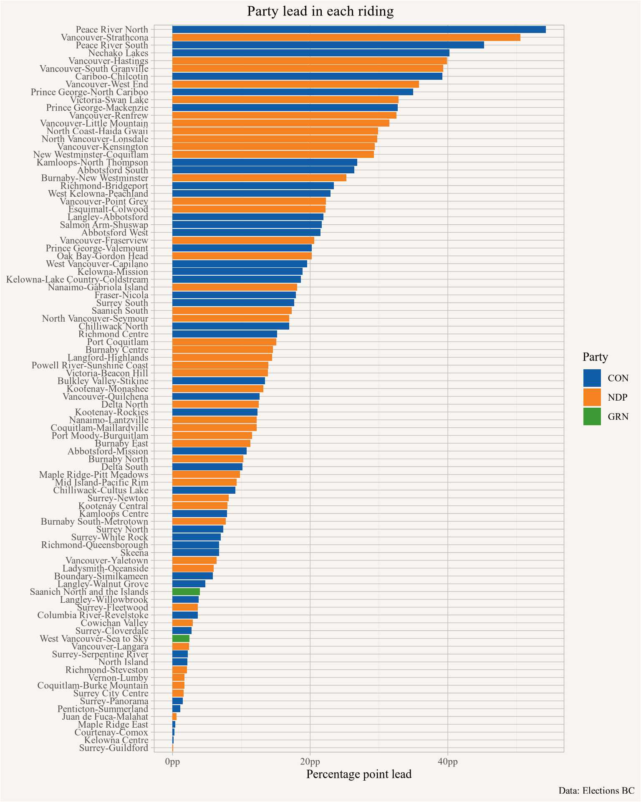
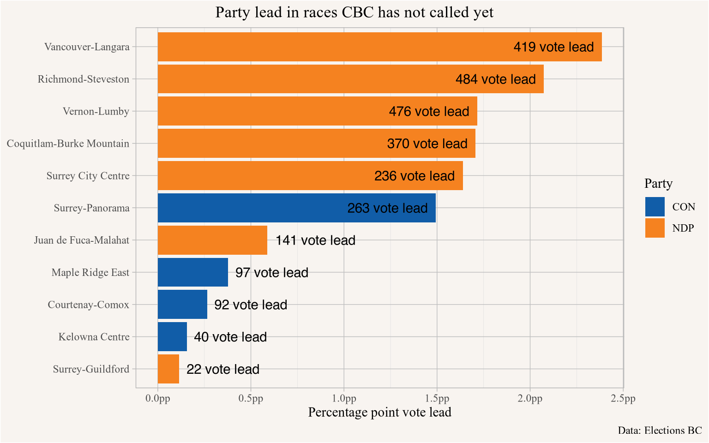

We don't yet have the final results for the 2024 BC provincial election, we are still waiting on the count of the vote-by-mail ballots that have not arrived yet. Some ridings are still in limbo, as is the overall outcome and who will form government.

But most ridings have been called and we wanted to take this opportunity to replicate a map highlighting the difference between land and people as we have done for earlier federal elections, following the idea [implemented for the 2016 US presidential elections](https://observablehq.com/@karimdouieb/try-to-impeach-this-challenge-accepted) by [Karim Douïeb](http://twitter.com/karim_douieb). [@elections-fun.2019; @elections-fun-2021-edition.2021]

As opposed to last time, we can now render the animation live within this blog, thanks quarto's direct support for [observable js](https://observablehq.com/documentation/cells/observable-javascript). All it takes is a little bit of data prep, where we grab the electoral district boundaries, cut out water features and simplify the polygons. And then scrape the election results from Elections BC. (It's 2024 and they probably have an actual data feed, but they sure make it hard to find.) Then we assemble a list of ridings that have not been called by hand, we will update that as more results come in.


::: {.cell}

```{.r .cell-code}
library(tidyverse)
library(mountainmathHelpers)
library(sf)

bc_geo <- cancensus::get_statcan_geographies("2021","PR") |>
  filter(PRUID=="59") |>
  rmapshaper::ms_simplify() |>
  st_make_valid()

district_boundaries <- read_sf("~/Downloads/BCGW_7113060B_1729362546577_9396/EBC_ELECTORAL_DISTS_BS11_SVW/EBC_ED_23_polygon.shp") |>
  select(ED_ID,ED_ABBREV,ED_NAME,geometry) %>%
  rmapshaper::ms_simplify() %>%
  st_intersection(st_transform(bc_geo,st_crs(.))) %>%
  rmapshaper::ms_simplify() %>%
  st_make_valid() %>%
  st_cast("MULTIPOLYGON") |>
  mutate(x=st_coordinates(st_centroid(geometry))[,1],y=st_coordinates(st_centroid(geometry))[,2]) %>%
  arrange(-y) |>
  mutate(rank = row_number()) |>
  st_cast("POLYGON") |>
  mutate(area=st_area(geometry) |> as.numeric()) %>%
  mutate(mainShape=area==max(area),.by=ED_ID)

upload_result <- district_boundaries |>
  select(ED_ID,ED_NAME,x,y,rank,mainShape,geometry) |>
  sf_to_s3_gzip("mountainmath","bc_2024_elections/district_boundaries.geojson")


results_raw <- rvest::read_html("https://electionsbcenr.blob.core.windows.net/electionsbcenr/Results_7097_GE-2024-10-19_Candidate.html") |>
  rvest::html_nodes("table#tblReport") |>
  rvest::html_table() |>
  first() |>
  select(ED_NAME=`Electoral District`,Candidate=`Candidate's Ballot Name`,Party=Affiliation,Votes=`Total Valid Votes`,Share=`% of Votes`) |>
  mutate(ED_NAME = na_if(ED_NAME,"")) |>
  fill(ED_NAME,.direction = "down") %>%
  mutate(across(c(Candidate,Party), \(x)if_else(.$Candidate=="" & .$Party=="","Total",x))) |>
  mutate(Party=if_else(Party=="","Unaffiliated",Party)) |>
  mutate(Votes=gsub(",","",Votes) |> as.numeric(),
         Share=as.numeric(gsub("\\%","",Share))/100) 


close_races <- c(
  "Coquitlam-Burke Mountain",
  "Courtenay-Comox",
  "Juan de Fuca-Malahat",
  "Kelowna Centre",
  "Maple Ridge East",
  "Richmond-Steveston",
  "Surrey City Centre",
  "Surrey-Guildford",
  "Surrey-Panorama",
  "Vancouver-Langara",
  "Vernon-Lumby"
)

results <- results_raw |>
  filter(!grepl("Advance voting ballot boxes|Final Voting Day ballot boxes|Out-of-district ballots",ED_NAME)) |>
  left_join(district_boundaries |> st_drop_geometry() |> select(ED_NAME,ED_ID) |> unique(),by=c("ED_NAME"="ED_NAME")) |>
  mutate(called=!(ED_NAME %in% close_races))

tmp <- tempfile(fileext = ".csv")
cleaned_results <- results |> 
  filter(Party!="Total") |>
  mutate(Party=recode(Party,"BC NDP"="NDP","BC Green Party"="GRN","Conservative Party"="CON","Independent"="IND",
                      "Freedom Party of BC"="FP","Libertarian"="LTN","Christian Heritage Party of B.C."="CHP",
                      "Communist Party of BC"="COM" ))
cleaned_results |>
  select(ED_ID,Candidate,Party,Votes,called) |> 
  write_csv( tmp)
upload_result <- file_to_s3_gzip(tmp,
                                 "mountainmath",
                                 "bc_2024_elections/results.csv")
```
:::


With the data in hand^[We placed the data separately online to not interfere with page loading, and load it separately in via javascript.] we can on observable to draw our map. Regions that have not yet been called are coloured in a lighter shade of the party that is currently in the lead. The tooltip on hover shows the full riding results.


:::{.cell}

```{.js .cell-code code-fold="undefined" startFrom="111" source-offset="0"}
vote_map_animation = {
  const height = width*ratio ;
  
  const tooltip = d => [
        `${d.properties.ED_NAME}`,
        (d.properties.called ? `Winner: ` : `Leading: `) + `${d.properties.winner.Candidate} - (${d.properties.winner.Party})`,
        `Margin: ${format.comma(d.properties.results[0].Votes - d.properties.results[1].Votes)} (${format.percent((d.properties.results[0].Votes - d.properties.results[1].Votes)/d.properties.Total)})`,
        "",
        ...d.properties.results.map(p => `${p.Candidate} - (${p.Party}): ${format.comma(p.Votes)} (${format.percent(p.Votes/d.properties.Total)})`)
        ].join("\n")

  
  const svg = d3.select(DOM.svg(width, height))
      .attr("viewBox", "0 0 960 600")
      .style("width", "100%")
      .style("height", "auto");
  
  // render map
  const path = d3.geoPath(projection)

   svg.append("g")
     .selectAll("path")
     .data(districts)
     .enter().append("path")
     .attr("class", "bcDistrict")
     .attr("fill", district => district.properties.called ? party_colors[district.properties.winner.Party] : party_colors2[district.properties.winner.Party])  
     .attr("d", path)
     .attr("stroke", "white")
     .attr("stroke-width", 0.5)
     .append("title")
     .text(tooltip) 
   
  setInterval(() => {
    svg.selectAll(".bcDistrict")
      .transition()
      .delay(d => d.properties.rank*20)
      .duration(5000)
      .attrTween('d', function(d, i) {
        return flubber.toCircle(path(d), d.x, d.y, d.properties.radius, {maxSegmentLength: 2});
      })

    svg.selectAll(".bcDistrict")
      .transition()
      .delay(d => 10000 + d.properties.rank*20)
      .duration(5000)
      .attrTween('d', function(d, i) {
        return flubber.fromCircle(d.x, d.y, d.properties.radius, path(d), {maxSegmentLength: 2});
      })
  }, 25000)

  return svg.node();
}
```

:::{#fig-land-vs-people .cell-output .cell-output-display}

:::{#ojs-cell-1 nodetype="declaration"}
:::
Land does not vote, people do
:::
:::


The animation interpolates between the geographies of the ridings, and bubbles for each riding of size proportional to the total vote count. This visualizes the degree to which the map view over-emphasizes rural areas, which predominantly went to the Conservatives, whereas electoral districts with high population density and consequently lower area were predominantly won by the NDP.


::: {.cell}

```{.r .cell-code}
lead_results <- cleaned_results |> 
  group_by(ED_ID) |>
  arrange(-Votes) |>
  mutate(lead=Votes-lead(Votes),
         Total=sum(Votes)) |>
  slice_max(Votes,n=1) |>
  ungroup() |>
  mutate(lead_share=lead/Total) 

tightest_race <- lead_results |> slice_min(lead_share,n=1) 
```
:::


Some ridings had a clear winner with a large lead, others are still quite tight. @fig-party-lead-by-riding we give an overview over the vote share lead in each riding, the tightest race right now is Juan de Fuca-Malahat, where the NDP currently holds a 23 vote (0.1 percentage point) lead.


::: {.cell}

```{.r .cell-code}
party_colours <- c(
  CON="#115DA8",
    NDP="#F58220",
    IND="#676767",
    GRN="#3D9B35"
)
party_colours2 <- c(
  CON="#83ACF5",
    NDP="#FFB38D",
    IND="#FFCBB8",
    GRN="#84DA80"
)


lead_results |>
  ggplot(aes(x=lead_share,y=reorder(ED_NAME,lead_share),fill=Party))  +
  geom_bar(stat="identity") +
  geom_bar(stat="identity", data=~filter(.,!called,Party=="NDP"),fill=party_colours2["NDP"]) +
  geom_bar(stat="identity", data=~filter(.,!called,Party=="CON"),fill=party_colours2["CON"]) +
  scale_fill_manual(values=party_colours) +
  scale_x_continuous(labels=\(d)scales::percent(d,suffix="pp")) +
  labs(title="Party lead in each riding",
       x="Percentage point lead",
       y=NULL,
       caption="Data: Elections BC")
```

::: {.cell-output-display}
{#fig-party-lead-by-riding width=768}
:::
:::


## Update (Oct 23, 2024)

Elections BC is still regularly updating vote counts, for convenience we added a graph with just the 11 races that CBC has not yet called. We will updated this regularly as updated voting results come in.


::: {.cell}

```{.r .cell-code}
lead_results |>
  filter(!called) |>
  ggplot(aes(x=lead_share,y=reorder(ED_NAME,lead_share),fill=Party))  +
  geom_bar(stat="identity") +
  geom_text(aes(label=scales::comma(lead,suffix=" vote lead"),hjust=ifelse(lead_share>0.01,1.1,-0.1))) +
  scale_fill_manual(values=party_colours2) +
  scale_x_continuous(labels=\(d)scales::percent(d,suffix="pp")) +
  labs(title="Party lead in races CBC has not called yet",
       x="Percentage point vote lead",
       y=NULL,
       caption="Data: Elections BC")
```

::: {.cell-output-display}
{width=768}
:::
:::


<details>
<summary>Remaining Observable code</summary>


:::{.cell}

```{.js .cell-code code-fold="undefined" startFrom="237" source-offset="0"}
applySimulation = (nodes) => {
  const simulation = d3.forceSimulation(nodes)
    .force("cx", d3.forceX().x(d => width / 2).strength(0.02))
    .force("cy", d3.forceY().y(d => width * (5/8) / 2).strength(0.02))
    .force("x", d3.forceX().x(d => projection([d.properties.x,d.properties.y])[0]).strength(0.3))
    .force("y", d3.forceY().y(d => projection([d.properties.x,d.properties.y])[1]).strength(0.3))
    .force("charge", d3.forceManyBody().strength(-1))
    .force("collide", d3.forceCollide().radius(d => d.properties.radius + nodePadding).strength(1))
    .stop()

  let i = 0; 
  while (simulation.alpha() > 0.01 && i < 250) {
    simulation.tick(); 
    i++;
    //console.log(`${Math.round(100*i/200)}%`)
  }

  return simulation.nodes();
}
```

:::{.cell-output .cell-output-display}

:::{#ojs-cell-2 nodetype="declaration"}
:::
:::
:::

:::{.cell}

```{.js .cell-code code-fold="undefined" startFrom="259" source-offset="0"}
spreadDistricts = applySimulation(districts)
```

:::{.cell-output .cell-output-display}

:::{#ojs-cell-3 nodetype="declaration"}
:::
:::
:::

:::{.cell}

```{.js .cell-code code-fold="undefined" startFrom="263" source-offset="0"}
maxRadius = 15
```

:::{.cell-output .cell-output-display}

:::{#ojs-cell-4 nodetype="declaration"}
:::
:::
:::

:::{.cell}

```{.js .cell-code code-fold="undefined" startFrom="267" source-offset="0"}
ratio = 1
```

:::{.cell-output .cell-output-display}

:::{#ojs-cell-5 nodetype="declaration"}
:::
:::
:::

:::{.cell}

```{.js .cell-code code-fold="undefined" startFrom="271" source-offset="0"}
nodePadding = 0.3
```

:::{.cell-output .cell-output-display}

:::{#ojs-cell-6 nodetype="declaration"}
:::
:::
:::

:::{.cell}

```{.js .cell-code code-fold="undefined" startFrom="275" source-offset="0"}
party_colors = {
  return {
    CON:"#115DA8",
    NDP:"#F58220",
    IND:"#676767",
    GRN:"#3D9B35"
  }
}
```

:::{.cell-output .cell-output-display}

:::{#ojs-cell-7 nodetype="declaration"}
:::
:::
:::

:::{.cell}

```{.js .cell-code code-fold="undefined" startFrom="286" source-offset="0"}
party_colors2 = {
  return {
    CON:"#83ACF5",
    NDP:"#FFB38D",
    IND:"#FFCBB8",
    GRN:"#84DA80"
  }
}
```

:::{.cell-output .cell-output-display}

:::{#ojs-cell-8 nodetype="declaration"}
:::
:::
:::

:::{.cell}

```{.js .cell-code code-fold="undefined" startFrom="299" source-offset="0"}
format = ({
  density: (x) => x > 1000 ? d3.format(".2s")(x) : d3.format(".3r")(x),
  percent: d3.format(".1%"),
  comma: d3.format(",.0f")
})
```

:::{.cell-output .cell-output-display}

:::{#ojs-cell-9 nodetype="declaration"}
:::
:::
:::

:::{.cell}

```{.js .cell-code code-fold="undefined" startFrom="307" source-offset="0"}
projection = d3.geoIdentity().reflectY(true).fitSize([960, 600], {type: "FeatureCollection", features: districts})
```

:::{.cell-output .cell-output-display}

:::{#ojs-cell-10 nodetype="declaration"}
:::
:::
:::

:::{.cell}

```{.js .cell-code code-fold="undefined" startFrom="311" source-offset="0"}
districts = bc_districts.features
```

:::{.cell-output .cell-output-display}

:::{#ojs-cell-11 nodetype="declaration"}
:::
:::
:::

:::{.cell}

```{.js .cell-code code-fold="undefined" startFrom="315" source-offset="0"}
bc_districts = { 
  const url = "https://mountainmath.s3.ca-central-1.amazonaws.com/bc_2024_elections/district_boundaries.geojson";
  const bc_districts = await d3.json(url);
  const bc_results_all = await d3.csv("https://mountainmath.s3.ca-central-1.amazonaws.com/bc_2024_elections/results.csv")
    
    
  const bc_results =  [...new Set(bc_results_all.map(d => d.ED_ID))]
    .reduce((hash, elem) => {
      const rs = bc_results_all.filter(r => r.ED_ID === elem)
        .map(d=> {d.Votes=parseInt(d.Votes);
                  return(d)})
        .sort((a,b) => b.Votes-a.Votes)
      hash[elem] = {results:rs,
                    Total:d3.sum(rs, d => d.Votes),
                    called:rs[0].called==="TRUE",
                    winner:rs[0]}
      return hash
          }, {})
  
  const voteMax = d3.max(Object.keys(bc_results), d => bc_results[d].Total)
  const radiusScale = d3.scaleSqrt()
      .domain([0, voteMax])
      .range([1, maxRadius]) 
  
  bc_districts.features.forEach(d => {
    const rp = bc_results[d.properties.ED_ID.toString()]
      d.properties = {
        ...d.properties,
        ...rp,
        radius: d.properties.mainShape ? radiusScale(rp.Total) : 0
      }
  })
  return bc_districts;
}
```

:::{.cell-output .cell-output-display}

:::{#ojs-cell-12 nodetype="declaration"}
:::
:::
:::

:::{.cell}

```{.js .cell-code code-fold="undefined" startFrom="353" source-offset="0"}
d3 = require("d3@5")
```

:::{.cell-output .cell-output-display}

:::{#ojs-cell-13 nodetype="declaration"}
:::
:::
:::

:::{.cell}

```{.js .cell-code code-fold="undefined" startFrom="357" source-offset="0"}
turf = require("@turf/turf@5")
```

:::{.cell-output .cell-output-display}

:::{#ojs-cell-14 nodetype="declaration"}
:::
:::
:::

:::{.cell}

```{.js .cell-code code-fold="undefined" startFrom="361" source-offset="0"}
flubber = require('https://unpkg.com/flubber')
```

:::{.cell-output .cell-output-display}

:::{#ojs-cell-15 nodetype="declaration"}
:::
:::
:::


</details>

As usual, the code for this post is [available on GitHub](https://github.com/mountainMath/mountain_doodles/blob/main/posts/2024-10-20-bc-election-2024/index.qmd) for anyone to reproduce or adapt for their own purposes.


<details>

<summary>Reproducibility receipt</summary>


::: {.cell}

```{.r .cell-code}
## datetime
Sys.time()
```

::: {.cell-output .cell-output-stdout}

```
[1] "2024-10-24 18:26:52 PDT"
```


:::

```{.r .cell-code}
## repository
git2r::repository()
```

::: {.cell-output .cell-output-stdout}

```
Local:    main /Users/jens/R/mountain_doodles
Remote:   main @ origin (https://github.com/mountainMath/mountain_doodles.git)
Head:     [dbd12aa] 2024-10-24: updated post with extra graph
```


:::

```{.r .cell-code}
## Session info
sessionInfo()
```

::: {.cell-output .cell-output-stdout}

```
R version 4.4.1 (2024-06-14)
Platform: aarch64-apple-darwin20
Running under: macOS 15.0.1

Matrix products: default
BLAS:   /Library/Frameworks/R.framework/Versions/4.4-arm64/Resources/lib/libRblas.0.dylib 
LAPACK: /Library/Frameworks/R.framework/Versions/4.4-arm64/Resources/lib/libRlapack.dylib;  LAPACK version 3.12.0

locale:
[1] en_US.UTF-8/en_US.UTF-8/en_US.UTF-8/C/en_US.UTF-8/en_US.UTF-8

time zone: America/Vancouver
tzcode source: internal

attached base packages:
[1] stats     graphics  grDevices utils     datasets  methods   base     

other attached packages:
 [1] sf_1.0-16                 mountainmathHelpers_0.1.4
 [3] lubridate_1.9.3           forcats_1.0.0            
 [5] stringr_1.5.1             dplyr_1.1.4              
 [7] purrr_1.0.2               readr_2.1.5              
 [9] tidyr_1.3.1               tibble_3.2.1             
[11] ggplot2_3.5.1             tidyverse_2.0.0          

loaded via a namespace (and not attached):
 [1] tidyselect_1.2.1    farver_2.1.2        R.utils_2.12.3     
 [4] fastmap_1.2.0       promises_1.3.0      cancensus_0.5.8    
 [7] digest_0.6.37       timechange_0.3.0    mime_0.12          
[10] lifecycle_1.0.4     processx_3.8.4      magrittr_2.0.3     
[13] compiler_4.4.1      rlang_1.1.4         tools_4.4.1        
[16] utf8_1.2.4          yaml_2.3.10         knitr_1.48         
[19] labeling_0.4.3      htmlwidgets_1.6.4   bit_4.0.5          
[22] sp_2.1-4            classInt_0.4-10     curl_5.2.2         
[25] aws.signature_0.6.0 xml2_1.3.6          KernSmooth_2.23-24 
[28] websocket_1.4.1     withr_3.0.1         R.oo_1.26.0        
[31] grid_4.4.1          fansi_1.0.6         git2r_0.33.0       
[34] e1071_1.7-14        colorspace_2.1-0    scales_1.3.0       
[37] cli_3.6.3           rmarkdown_2.28      crayon_1.5.2       
[40] generics_0.1.3      rstudioapi_0.16.0   httr_1.4.7         
[43] tzdb_0.4.0          DBI_1.2.3           chromote_0.2.0     
[46] proxy_0.4-27        rvest_1.0.4         parallel_4.4.1     
[49] selectr_0.4-2       base64enc_0.1-3     vctrs_0.6.5        
[52] V8_4.4.2            jsonlite_1.8.8      geojsonsf_2.0.3    
[55] hms_1.1.3           bit64_4.0.5         rmapshaper_0.5.0   
[58] units_0.8-5         glue_1.8.0          ps_1.7.6           
[61] stringi_1.8.4       gtable_0.3.5        later_1.3.2        
[64] aws.s3_0.3.21       munsell_0.5.1       pillar_1.9.0       
[67] htmltools_0.5.8.1   R6_2.5.1            vroom_1.6.5        
[70] evaluate_1.0.0      lattice_0.22-6      R.methodsS3_1.8.2  
[73] class_7.3-22        Rcpp_1.0.13         xfun_0.47          
[76] pkgconfig_2.0.3    
```


:::
:::


</details>


