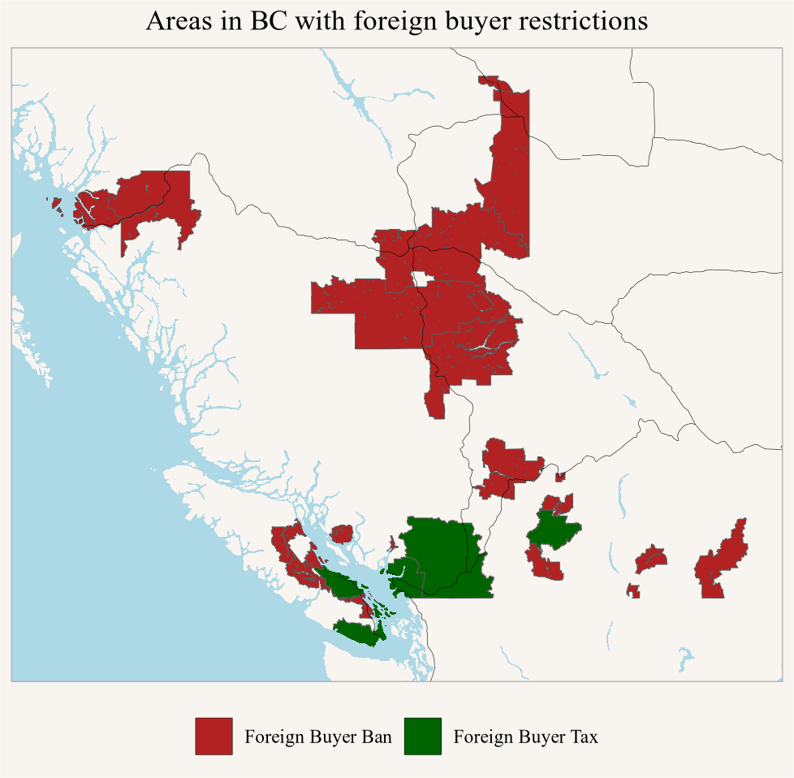

::: {.cell}

```{.r .cell-code}
ppt_datasetes <- bcdata::bcdc_search("Property Transfer Tax")

titles <- lapply(ppt_datasetes,\(x)x$title)

provincial_monthly_ids <- ppt_datasetes[grepl("property transfer tax data",titles,ignore.case = TRUE)] |>
  map_df(\(x)x$resource_df |> 
           filter(grepl("PROVINCIAL_MONTHLY_\\d{4}|PROVINCIAL MONTHLY \\d{4}|provincialmonthly\\d{4}",name,ignore.case=TRUE),
                  format=="csv"))

provincial_monthly <- provincial_monthly_ids |>
  rowwise() |>
  group_map(~read_csv(.x$url,col_types=cols(.default="c"))) |>
  bind_rows() |>
  filter(!is.na(Year)) |>
  mutate(Date=as.Date(paste0(Year,"-",Month,"-15"))) |>
  mutate_at(vars(-one_of("Date","Year","Month")),as.numeric)
```
:::


Today the Globe and Mail published an [opinion piece about continued flows of "foreign money" in B.C. real estate](https://www.theglobeandmail.com/real-estate/vancouver/article-foreign-money-continues-to-flow-into-bc-real-estate/). Broadly this is a topic that has been discussed in BC for over a decade now and regularly pops up in the news. We've written extensively about the slipperiness of the "foreign money" discourse in our paper on Canada's turn toward Housing Nationalism [@housing_nationalism.2023] ([ungated version here](https://open.library.ubc.ca/soa/cIRcle/collections/facultyresearchandpublications/52383/items/1.0438798)). There are a number of conceptualizations of "foreign" in the public discussion, as well as in data sources, policy and law as it applies to real estate holdings and purchases. Our paper describes how the flexible use and application of the "foreign" label plays an integral role in keeping anti-foreign narratives and sentiments alive. 

The G&M article continues this pattern, not just mixing and matching concepts but outright misrepresenting the groups targeted by the federal Foreign Buyer Ban and the BC Foreign Buyer Tax. Moreover, it leads with the claim of a "spike" in the value of foreign buying, continuing to push the narrative that our housing problems are driven by foreign origins. We will leave it to our article on Housing Nationalism to criticize this broader framing. For now we will demonstrate that the claim about a spike is wrong, and seems to be based on an error in summing across months in BC data.

In support of the idea there's been a recent spike in foreign buying, the G&M article claims:

>   Using property transfer tax data provided by the B.C. government, Simon Fraser University associate professor Andy Yan showed that residential purchases categorized as “foreign involvement transactions” had a total dollar value of nearly \$664-million from January to September, 2020. In that same period this year, 834 foreign involvement residential transactions added up to nearly \$824-million. The dollar value of foreign residential transactions in 2023 was \$744.5-million. The total number of foreign transactions, including commercial, increased from 1,018 in 2023 to 1,020 in 2024.

The dollar values for 2023 and 2024 appear correct. However the dollar value for 2020 is plainly wrong. @tbl-fbt-first-9-months are the actual numbers for the first 9 months in every year since 2017.


::: {#tbl-fbt-first-9-months .cell}

```{.r .cell-code}
provincial_monthly |>
  filter(Month %in% seq(1,9)) |>
  summarize(across(c(add_tax_paid,sum_FMV_foreign_res,sum_FMV_foreign),sum),.by=Year) |>
  arrange(Year) |>
  mutate(add_tax_paid=scales::dollar(add_tax_paid,scale=10^-6,suffix="M"),
         across(c(sum_FMV_foreign_res,sum_FMV_foreign),~scales::dollar(.x,scale=10^-9,suffix="bn"))) |>
  rename(`Total market value with foreign involvement`=sum_FMV_foreign,
         `Total residential market value with foreign involvement`=sum_FMV_foreign_res,
         `Total Foreign Buyer Tax`=add_tax_paid,
         `First 9 months of year`=Year) |>
  tinytable::tt(caption="BC Open Data",
                note="Here \"foreign\" refers to non-citizen, non-PR, non-provincial nominees")
```

::: {.cell-output-display}


```{=html}
<!-- preamble start -->

    <script>
      function styleCell_o1e0et02vzcdg5jk3p17(i, j, css_id) {
        var table = document.getElementById("tinytable_o1e0et02vzcdg5jk3p17");
        table.rows[i].cells[j].classList.add(css_id);
      }
      function insertSpanRow(i, colspan, content) {
        var table = document.getElementById('tinytable_o1e0et02vzcdg5jk3p17');
        var newRow = table.insertRow(i);
        var newCell = newRow.insertCell(0);
        newCell.setAttribute("colspan", colspan);
        // newCell.innerText = content;
        // this may be unsafe, but innerText does not interpret <br>
        newCell.innerHTML = content;
      }
      function spanCell_o1e0et02vzcdg5jk3p17(i, j, rowspan, colspan) {
        var table = document.getElementById("tinytable_o1e0et02vzcdg5jk3p17");
        const targetRow = table.rows[i];
        const targetCell = targetRow.cells[j];
        for (let r = 0; r < rowspan; r++) {
          // Only start deleting cells to the right for the first row (r == 0)
          if (r === 0) {
            // Delete cells to the right of the target cell in the first row
            for (let c = colspan - 1; c > 0; c--) {
              if (table.rows[i + r].cells[j + c]) {
                table.rows[i + r].deleteCell(j + c);
              }
            }
          }
          // For rows below the first, delete starting from the target column
          if (r > 0) {
            for (let c = colspan - 1; c >= 0; c--) {
              if (table.rows[i + r] && table.rows[i + r].cells[j]) {
                table.rows[i + r].deleteCell(j);
              }
            }
          }
        }
        // Set rowspan and colspan of the target cell
        targetCell.rowSpan = rowspan;
        targetCell.colSpan = colspan;
      }
window.addEventListener('load', function () { styleCell_o1e0et02vzcdg5jk3p17(0, 0, 'tinytable_css_id28xkiwedxo60shvowtit') })
window.addEventListener('load', function () { styleCell_o1e0et02vzcdg5jk3p17(0, 1, 'tinytable_css_id28xkiwedxo60shvowtit') })
window.addEventListener('load', function () { styleCell_o1e0et02vzcdg5jk3p17(0, 2, 'tinytable_css_id28xkiwedxo60shvowtit') })
window.addEventListener('load', function () { styleCell_o1e0et02vzcdg5jk3p17(0, 3, 'tinytable_css_id28xkiwedxo60shvowtit') })
window.addEventListener('load', function () { styleCell_o1e0et02vzcdg5jk3p17(9, 0, 'tinytable_css_idtbjottv1qqom0vlfspou') })
window.addEventListener('load', function () { styleCell_o1e0et02vzcdg5jk3p17(9, 1, 'tinytable_css_idtbjottv1qqom0vlfspou') })
window.addEventListener('load', function () { styleCell_o1e0et02vzcdg5jk3p17(9, 2, 'tinytable_css_idtbjottv1qqom0vlfspou') })
window.addEventListener('load', function () { styleCell_o1e0et02vzcdg5jk3p17(9, 3, 'tinytable_css_idtbjottv1qqom0vlfspou') })
    </script>

    <style>
    .table td.tinytable_css_id28xkiwedxo60shvowtit, .table th.tinytable_css_id28xkiwedxo60shvowtit {  border-bottom: solid 0.1em #d3d8dc; }
    .table td.tinytable_css_idtbjottv1qqom0vlfspou, .table th.tinytable_css_idtbjottv1qqom0vlfspou {  text-align: left; }
    </style>
    <div class="container">
      <table class="table table-borderless" id="tinytable_o1e0et02vzcdg5jk3p17" style="width: auto; margin-left: auto; margin-right: auto;" data-quarto-disable-processing='true'>
        <thead>
        <caption>BC Open Data</caption>
              <tr>
                <th scope="col">First 9 months of year</th>
                <th scope="col">Total Foreign Buyer Tax</th>
                <th scope="col">Total residential market value with foreign involvement</th>
                <th scope="col">Total market value with foreign involvement</th>
              </tr>
        </thead>
        <tfoot><tr><td colspan='4'>Here "foreign" refers to non-citizen, non-PR, non-provincial nominees</td></tr></tfoot>
        <tbody>
                <tr>
                  <td>2017</td>
                  <td>$159.15M</td>
                  <td>$2.82bn</td>
                  <td>$3.34bn</td>
                </tr>
                <tr>
                  <td>2018</td>
                  <td>$127.98M</td>
                  <td>$2.04bn</td>
                  <td>$3.09bn</td>
                </tr>
                <tr>
                  <td>2019</td>
                  <td>$89.90M </td>
                  <td>$1.19bn</td>
                  <td>$1.71bn</td>
                </tr>
                <tr>
                  <td>2020</td>
                  <td>$77.76M </td>
                  <td>$1.02bn</td>
                  <td>$1.64bn</td>
                </tr>
                <tr>
                  <td>2021</td>
                  <td>$71.89M </td>
                  <td>$1.34bn</td>
                  <td>$1.64bn</td>
                </tr>
                <tr>
                  <td>2022</td>
                  <td>$57.39M </td>
                  <td>$1.22bn</td>
                  <td>$1.70bn</td>
                </tr>
                <tr>
                  <td>2023</td>
                  <td>$30.84M </td>
                  <td>$0.74bn</td>
                  <td>$1.23bn</td>
                </tr>
                <tr>
                  <td>2024</td>
                  <td>$24.24M </td>
                  <td>$0.82bn</td>
                  <td>$1.42bn</td>
                </tr>
        </tbody>
      </table>
    </div>
<!-- hack to avoid NA insertion in last line -->
```


:::
:::


We were able to replicate the dollar values for 2020 when we only summed up the first six months (rather than the first nine) of 2020, and it seems likely this is the source of the error. Importantly, it's a pretty big error, and when it's corrected the idea of a recent spike in foreign involved purchases disappears. 

The errors in adding across months continue to reverberate in subsequent passages:

>   B.C.’s foreign buyer tax revenues ranged from \$51-million in 2020 to a high of \$71-million in 2021, to \$24-million in 2024.

Again, as this is not correct as can be seen from  @tbl-fbt-first-9-months. Maybe more usefully, @fig-fbt-monthly-res shows the monthly tax revenue from the FBT, with annual means shown for added context.


::: {.cell}

```{.r .cell-code}
provincial_monthly |>
  mutate(share=n_foreign_res/n_res_trans) |>
  mutate(share2=sum_FMV_foreign_res/sum_FMV_res) |>
  mutate(Name="British Columbia") |>
  ggplot(aes(x=Date,y=add_tax_paid)) + 
  geom_line() +
  scale_y_continuous(labels=~scales::dollar(.x,scale=10^-6,suffix="M")) +
  geom_smooth(method="lm",formula=y~1,aes(group=Year),se=FALSE) +
  scale_x_date(date_breaks="1 year",date_labels="%Y") +
  labs(title="BC Foreign buyer tax revenue",
       y="Monthly tax revenue",x=NULL,caption="BC Open Data")
```

::: {.cell-output-display}
{#fig-fbt-monthly-res width=768}
:::
:::


Though the article does not mention this, BC's Foreign Buyer Tax does not apply everywhere in BC, so this misses purchases with foreign involvement outside of the FBT areas. The article is also mum on the federal Foreign Buyer Ban not applying everywhere but only in another subset in BC as shown in @fig-foreign-buyer-restriction-goes, and applying to a different set of people than the Foreign Buyer Tax.


::: {.cell crop='true'}

```{.r .cell-code}
rds <- bcdc_get_data("b66ed992-16c9-4527-b363-0ae4827d103b")
geos <- get_census(2021,regions=list(PR="59"),level="CMA",geo_format = "sf") |>
  mutate(Type="Foreign Buyer Ban")
pr <- get_census(2021,regions=list(PR="59")) 

fb_rds <- rds |> filter(grepl("Capital|Fraser Valley|Metro Vancouver|Central Okanagan|Nanaimo",REGIONAL_DISTRICT_NAME)) |>
  mutate(Type="Foreign Buyer Tax")

ggplot(geos,aes(fill=Type)) +
  geom_sf() +
  geom_sf(data=fb_rds) +
  scale_fill_manual(values=c("Foreign Buyer Ban"="firebrick",
                             "Foreign Buyer Tax"="darkgreen")) +
  geom_roads() +
  geom_water() +
  theme(legend.position = "bottom") +
  coord_sf(datum=NA) +
  labs(title="Areas in BC with foreign buyer restrictions",
       fill=NULL)
```

::: {.cell-output-display}
{#fig-foreign-buyer-restriction-goes width=768}
:::
:::


The article puts a lot of emphasis on the value of transactions involving foreign buyers, so not just the value attributed to foreign buyers based on ownership share. This is shown in @fig-fb-value-monthly-res.


::: {.cell}

```{.r .cell-code}
provincial_monthly |>
  ggplot(aes(x=Date,y=sum_FMV_foreign_res)) + 
  geom_line() +
  scale_y_continuous(labels=~scales::dollar(.x,scale=10^-6,suffix="M")) +
  geom_smooth(method="lm",formula=y~1,aes(group=interaction(Year)),se=FALSE) +
  scale_x_date(date_breaks="1 year",date_labels="%Y") +
  labs(title="Value of residential property transactions involving foreign buyers",
       y="Total fair market value",x=NULL,caption="BC Open Data")
```

::: {.cell-output-display}
{#fig-fb-value-monthly-res width=768}
:::
:::


In @fig-fb-value-monthly-all we include non-residential properties to get the total market value of all properties with foreign involvement.


::: {.cell}

```{.r .cell-code}
provincial_monthly |>
  ggplot(aes(x=Date,y=sum_FMV_foreign)) + 
  geom_line() +
  scale_y_continuous(labels=~scales::dollar(.x,scale=10^-6,suffix="M")) +
  geom_smooth(method="lm",formula=y~1,aes(group=interaction(Year)),se=FALSE) +
  scale_x_date(date_breaks="1 year",date_labels="%Y") +
  labs(title="Value of all property transactions involving foreign buyers",
       y="Total fair market value",x=NULL,caption="BC Open Data")
```

::: {.cell-output-display}
{#fig-fb-value-monthly-all width=768}
:::
:::


Looking at this the opening claim in the article that "foreign buying in British Columbia spiked in dollar value this year" is untenable and directly contradicted by the data, undermining the entire narrative of the piece.

Of note, the article continues by helpfully reminding us that "people shouldn’t confuse foreign buyers with immigrants", only to continue by using the slippery concept of "foreign money" and applying it to immigrants, as well as some citizens where the "foreign" component might be a spouse working abroad or immigrants not "anglicizing" their first name upon landing.

We now have a lot of data: data on foreign buyers, estimates on non-resident investment, estimates of problematic vacancies, etc. We have found this data useful and drawn extensively on it in our own work trying to understand local patterns. But it's crucial that data analysis is performed carefully and thoughtfully with respect to impact. Hopefully this piece will be corrected, and the missimpressions created by its framing will be fixed by G&M.


As usual, the code for this post is [available on GitHub](https://github.com/mountainMath/mountain_doodles/blob/main/posts/2024-11-08-no-spike-in-foreign-buying/index.qmd) for anyone to reproduce or adapt for their own purposes.


<details>

<summary>Reproducibility receipt</summary>


::: {.cell}

```{.r .cell-code}
## datetime
Sys.time()
```

::: {.cell-output .cell-output-stdout}

```
[1] "2024-11-08 17:15:12 PST"
```


:::

```{.r .cell-code}
## repository
git2r::repository()
```

::: {.cell-output .cell-output-stdout}

```
Local:    main /Users/jens/R/mountain_doodles
Remote:   main @ origin (https://github.com/mountainMath/mountain_doodles.git)
Head:     [7e6f473] 2024-11-09: foreign buyer sredux post
```


:::

```{.r .cell-code}
## Session info
sessionInfo()
```

::: {.cell-output .cell-output-stdout}

```
R version 4.4.1 (2024-06-14)
Platform: aarch64-apple-darwin20
Running under: macOS 15.1

Matrix products: default
BLAS:   /Library/Frameworks/R.framework/Versions/4.4-arm64/Resources/lib/libRblas.0.dylib 
LAPACK: /Library/Frameworks/R.framework/Versions/4.4-arm64/Resources/lib/libRlapack.dylib;  LAPACK version 3.12.0

locale:
[1] en_US.UTF-8/en_US.UTF-8/en_US.UTF-8/C/en_US.UTF-8/en_US.UTF-8

time zone: America/Vancouver
tzcode source: internal

attached base packages:
[1] stats     graphics  grDevices utils     datasets  methods   base     

loaded via a namespace (and not attached):
 [1] vctrs_0.6.5               cli_3.6.3                
 [3] knitr_1.48                rlang_1.1.4              
 [5] xfun_0.47                 generics_0.1.3           
 [7] jsonlite_1.8.8            glue_1.8.0               
 [9] colorspace_2.1-0          git2r_0.33.0             
[11] htmltools_0.5.8.1         mountainmathHelpers_0.1.4
[13] scales_1.3.0              fansi_1.0.6              
[15] rmarkdown_2.28            grid_4.4.1               
[17] munsell_0.5.1             evaluate_1.0.0           
[19] tibble_3.2.1              fastmap_1.2.0            
[21] yaml_2.3.10               lifecycle_1.0.4          
[23] compiler_4.4.1            dplyr_1.1.4              
[25] htmlwidgets_1.6.4         pkgconfig_2.0.3          
[27] rstudioapi_0.16.0         digest_0.6.37            
[29] R6_2.5.1                  tidyselect_1.2.1         
[31] utf8_1.2.4                pillar_1.9.0             
[33] magrittr_2.0.3            tools_4.4.1              
[35] gtable_0.3.5              ggplot2_3.5.1            
```


:::
:::


</details>


