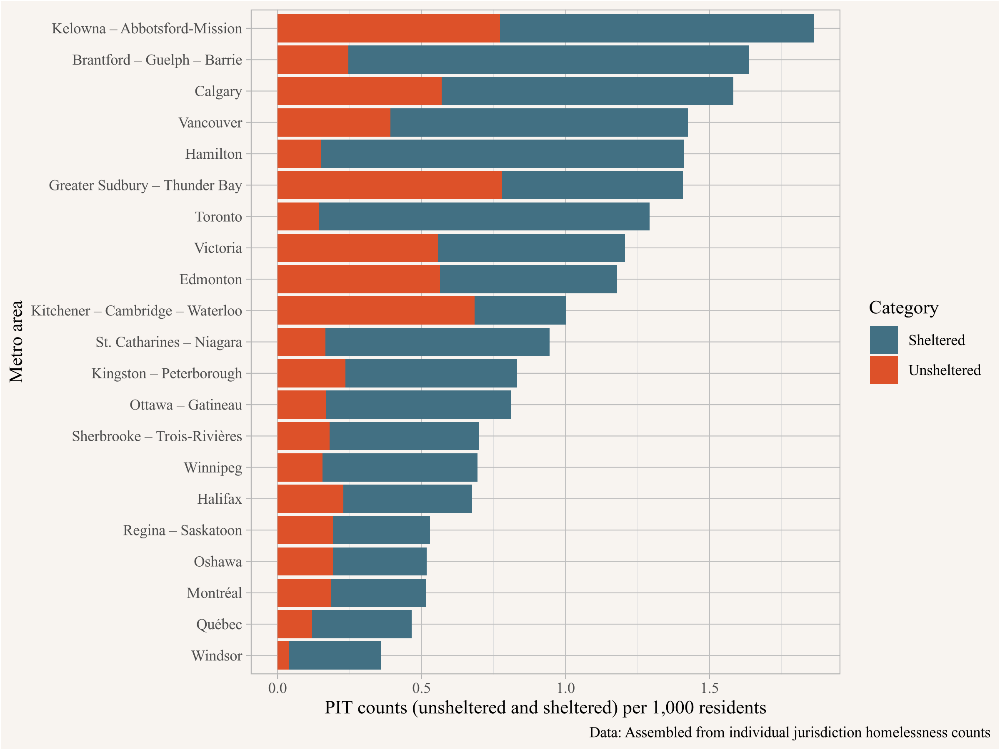
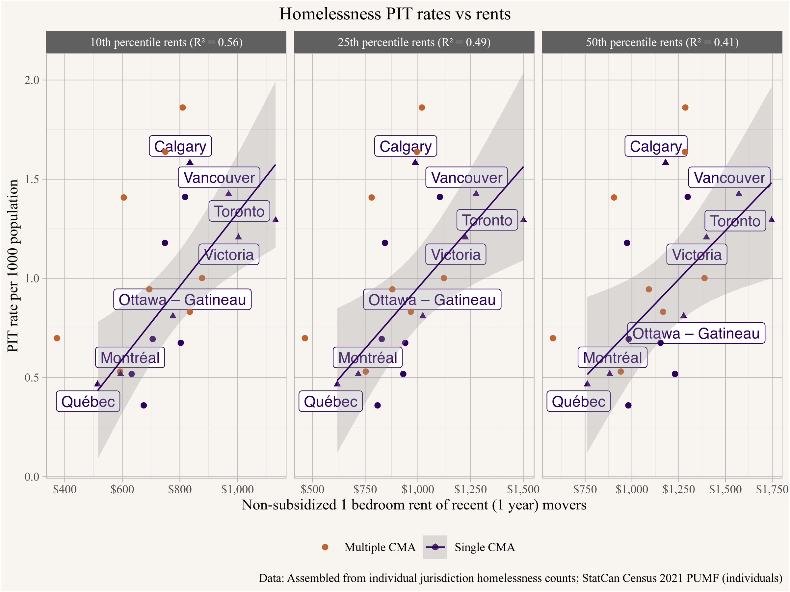

<p style="text-align:center;"><i>(Joint with Nathan Lauster and cross-posted at <a href="https://homefreesociology.com/2025/01/16/homelessness-and-rents-in-canada/" target="_blank">HomeFreeSociology</a>)</i></p>


::: {.cell}

```{.r .cell-code}
library(tidyverse)
library(cancensus)
library(canpumf)
library(cansim)
library(mountainmathHelpers)
library(rvest)
library(patchwork)
extrafont::loadfonts()
source(here::here("R/census_import.R"))

child_ages <- c("0 to 4 years","5 to 9 years","10 to 14 years","15 to 17 years","18 to 19 years")
year_colours <- setNames(sanzo::trios$c157,seq(2011,2021,5) |> rev())

highlight_metros <- c("Vancouver","Victoria","Québec","Montréal","Calgary",
                      "Ottawa – Gatineau","Toronto")
```
:::

::: {.cell}

```{.r .cell-code}
homelessness_data_manual <- read_csv(here::here("data/Shared_PIT_Homeless_Count_CMA_Revised.csv"),
                                     col_types = cols(.default="c")) |>
  mutate(Name=recode(Name,
                     "Kelowna-Abbotsford-Mission"="Kelowna – Abbotsford-Mission",
                     "Regina-Saskatoon"="Regina – Saskatoon",
                     "Brantford-Guelph-Barrie"="Brantford – Guelph – Barrie",
                     "Greater Sudbury-Thunder Bay"="Greater Sudbury – Thunder Bay",
                     "Kingston-Peterborough"="Kingston – Peterborough",
                     "Kitchener-Cambridge-Waterloo"="Kitchener – Cambridge – Waterloo",
                     "Moncton-Saint John"="Moncton – Saint John",
                     "Montreal"="Montréal",
                     "Ottawa-Gatineau"="Ottawa – Gatineau",
                     "Quebec City"="Québec",
                     "Sherbrooke-Trois-Rivieres"="Sherbrooke – Trois-Rivières",
                     "St. Catherines-Niagara"="St. Catharines – Niagara")) |>
  mutate(across(-c(Name,Likely_Count_Geography,Notes,
                   matches("^Year"),matches("Count_Source"),matches("Pop_Source")),as.numeric)) |>
  mutate(Name=fct_reorder(Name,Absolute_Rate_Likely_Geography)) |>
  mutate(pop_source=ifelse(Absolute_Rate_CMA==Absolute_Rate_Likely_Geography,"CMA","CSD")) |>
  mutate(CMA_pop2=ifelse(Likely_Count_Geography=="Region",Region_pop,CMA_pop)) |>
  mutate(Population=ifelse(pop_source=="CMA",CMA_pop2,CSD_pop)) |>
  mutate(single_cma=!grepl(" – ",Name)|grepl("Ottawa",Name)) |>
  mutate(PIT_rate=Absolute/Population*1000)


pumf_data <- get_harmonized_pumf(names(year_colours))  

cpi <- simpleCache(cansim::get_cansim_vector("v41690973") |>
  filter(strftime(Date,"%m")=="05") |>
  mutate(Year=strftime(Date,"%Y")) |>
  select(Year,CPI=val_norm) |>
  filter(Year<=2021) |>
  mutate(CPI=CPI/last(CPI,order_by=Year)),
  key="cpi_series.Rda",path=here::here("data"))

mover_rents <- pumf_data |>
  filter(TENUR=="Renter") |>
  filter(BEDRM %in% c("1 bedroom","2 bedrooms")) |>
  # filter(PRIHM=="Person is primary maintainer") |>
  filter(HHSIZE!="Not available") |>
  filter(!(MOB1 %in% c("Non-movers" ,"Not applicable", "Not available"))) |>
  filter(SUBSIDY!="Subsidized") |>
  left_join(cpi,by="Year") |>
  mutate(real_rent=GROSRT/CPI)  |>
  #filter(real_rent>400) |>
  mutate(m=spatstat.univar::weighted.quantile(real_rent,WEIGHT/HHSIZE_n,probs=0.5),
         .by=c(CMA,BEDRM,Year)) %>%
  mutate(CMA=factor(CMA,levels=filter(.,BEDRM=="1 bedroom",Year=="2021") |> 
                      select(CMA,m) |> unique() |> arrange(m) |> pull(CMA)))

all_rents <- pumf_data |>
  filter(TENUR=="Renter") |>
  filter(BEDRM %in% c("1 bedroom","2 bedrooms")) |>
  # filter(PRIHM=="Person is primary maintainer") |>
  filter(HHSIZE!="Not available") |>
  #filter(!(MOB1 %in% c("Non-movers" ,"Not applicable", "Not available"))) |>
  filter(SUBSIDY!="Subsidized") |>
  left_join(cpi,by="Year") |>
  mutate(real_rent=GROSRT/CPI)  |>
  #filter(real_rent>400) |>
  mutate(m=spatstat.univar::weighted.quantile(real_rent,WEIGHT/HHSIZE_n,probs=0.5),
         .by=c(CMA,BEDRM,Year)) %>%
  mutate(CMA=factor(CMA,levels=filter(.,BEDRM=="1 bedroom",Year=="2021") |> 
                      select(CMA,m) |> unique() |> arrange(m) |> pull(CMA)))


rents <- pumf_data |>
  filter(TENUR=="Renter") |>
  filter(BEDRM %in% c("1 bedroom","2 bedrooms")) |>
  # filter(PRIHM=="Person is primary maintainer") |>
  filter(HHSIZE!="Not available") |>
  filter(!(MOB1 %in% c("Non-movers" ,"Not applicable", "Not available"))) |>
  filter(SUBSIDY!="Subsidized") |>
  summarize(rent=list(spatstat.univar::weighted.quantile(GROSRT,w=WEIGHT/HHSIZE_n,
                                                         probs=c(0.1,0.25,0.5,0.75,0.9),na.rm=TRUE)),
            cases=n(),
            .by=c(CMA,BEDRM,Year)) |>
  unnest_longer(rent,indices_to="quantile") |>
  left_join(cpi,by="Year") |>
  mutate(real_rent=rent/CPI) 

d1_rents <- rents |> filter(BEDRM=="1 bedroom",quantile=="10%") |>
  select(CMA,Year,real_rent) 
q1_rents <- rents |> filter(BEDRM=="1 bedroom",quantile=="25%") |>
  select(CMA,Year,real_rent) 
m_rents <- rents |> filter(BEDRM=="1 bedroom",quantile=="50%") |>
  select(CMA,Year,real_rent) 
```
:::


Evidence suggests a clear correlation between rents and rates of homelessness in the USA. The simplest interpretation is that housing shortages drive rents higher and leave more people falling through the cracks of our systems for distributing housing. That is, [homelessness is a housing problem](https://homelessnesshousingproblem.com/). 

Do we also see this relationship in Canada?
And if so, just how does it work? 

Here we'll attempt to pull together some Canadian data to address the first question and also look into the second.

Speaking to the second question, we think there are lots of mechanisms by which the relationship works, but we're motivated in part by a recent piece by Salim Furth wrote titled [*Why housing shortages cause homelessness* for *Works in Progress*](https://worksinprogress.co/issue/why-housing-shortages-cause-homelessness/). We think this piece offers a potentially useful addition to current housing debates, thinking through a particular mechanism linking shortage of spare bedrooms to homelessness. Adding to our repertoire of explanatory mechanisms is great. But we also think Furth is too quick to foreclose on alternative mechanisms (including the simplest) and we have a few other quibbles with the details that we think are worth laying out in an effort to further discussion of mechanisms.

# Canadian Homeless Count Data

Our first step is to pull some Canadian data on homeless counts.

Canadian Point-in-Time (PIT) Homeless Count data has been growing in volume and become increasingly standardized in recent years, and StatCan and [Infrastrucure Canada](https://housing-infrastructure.canada.ca/homelessness-sans-abri/resources-ressources/point-in-time-denombrement-ponctuel-eng.html) are actively working toward improvement. The [Homeless Hub](https://homelesshub.ca/community_profile/calgary/) has attempted to collect recent PIT homeless counts for communities profiled across the country. We started our analysis by scraping recent count data from this source. Unfortunately the geographies don't quite match the ones we want to work with, but some other problems also quickly emerged from our exploration of count data. Closer investigation, starting with a comparison of Victoria and Vancouver results, revealed some big differences in PIT count procedures and resourcing between locations. Through a subsequent survey of homeless counts, we found challenges to comparability were widespread. Also issues with geographic matching and outdated data remain. Overall the Homeless Hub data provides a good starting point, but we found in necessary to dive into the PIT homeless count reports directly to establish more comparable estimates. 


What we want to establish are 1) PIT counts derived from common definitions, 2) applied to correct geographic denominators for establishing risk, but reflective of extracted CMA geographies, 3) updated to be as recent as possible. From here on out we limited ourselves to counts from 2020 or beyond (see @kneebone2021local for investigation into limited access 2018 count data). We provide a dataset in CSV form of our count data broken down by category [here](/data/Shared_PIT_Homeless_count_CMA_Revised.csv), with links to sources for each count and for underlying population paired to count geographies and matched to years as best we can figure out. Here we roughly match geographies of counts to Census CMAs, often joined together as extractable from PUMF data (e.g. Kelowna - Abbotsford-Mission), while attempting to preserve the integrity of underlying populations subject to count attempts for denominators. Where possible we looked to expand counts from cities to broader metropolitan areas, but we note imperfect division into metros within the PUMF data and imperfect mapping of geographies between homeless counts and CMAs (for instance, Oshawa here actually represents results from Durham County). We've attempted to minimize these issues in our matching, with instructions included in the file linked above, but uncertainties remain. 

Returning to our first issue, authorities administering PIT counts employ different methodologies to count and tally up various categories of homelessness. In particular, those temporarily housed (e.g. in various kinds of transitional housing, sometimes including hotels), within institutional settings (e.g. hospitals and jails), and those with no-fixed-address (e.g. couch-surfing) are often defined and tabulated differently within different homeless counts, and in many cases not tabulated at all. These categories are also often (though not always) considered "provisionally housed" in order to distinguish them from the "absolute homelessness" of people spending the night in homeless shelters (usually including domestic violence shelters), or without shelter (in public, within encampments or vehicles not meant for permanent shelter). Diving into tabulations directly, @fig-pit-overview pulls out distinct categories to illustrate the differences between counts in who gets counted.


::: {.cell}

```{.r .cell-code}
homlessness_categories <- c("Unsheltered", "Sheltered", "Couch_surfing",
                            "Public_system","Transitional","Unknown")
homlessness_category_colours <- setNames(c(MetBrewer::met.brewer("Egypt",5),"darkgrey"),
                                         gsub("_"," ",homlessness_categories))
homelessness_data_manual |>
  pivot_longer(all_of(homlessness_categories),names_to="category") |>
  mutate(category=gsub("_"," ",category)) |>
  mutate(category=factor(category,levels=gsub("_"," ",homlessness_categories))) |>
  mutate(PIT_rate=value/Population*1000) |>
  filter(!is.na(PIT_rate)) |>
  ggplot(aes(y=Name,x=PIT_rate,fill=fct_rev(category))) + 
  geom_bar(stat="identity") +
  scale_fill_manual(values=homlessness_category_colours) +
  labs(title="Homeless counts per 1,000 residents",
       x="PIT counts per 1,000 residents",
       y="Metro area",
       fill="Category",
       caption="Data: Assembled from individual jurisdiction homelessness counts")
```

::: {.cell-output-display}
{#fig-pit-overview fig-pos='H'}
:::
:::


By comparing categories of counts, we can see that some jurisdictions just count a lot more people as homeless. Reading through the Capital Region of Victoria's homeless count methods, for instance, reveals a very inclusive definition applied to provisionally housed categories, at its broadest including people as homeless if they don't have stable housing arranged for the next three years. Other counts use much narrower time frames, ranging from 30 days to one year, or don't include provisionally housed categories (e.g. transitional, public system, and couch surfing) at all. Various inclusion of people as homeless when their location during the count remained unknown represents a further difficulty.

In order to ensure counts are comparable, we can strip out the provisional categories where people are often counted differently and compare just the absolute categories, where methods tend to be similar (see also @kneebone2021local). It's important to remember this is simply a choice we're making for comparability purposes - we're not attempting to redefine who should count here - and in all cases, PIT counts are broadly recognized as undercounts. One useful way of thinking about this approach is that common methods to count unsheltered and sheltered groups likely undercount in a similar fashion. Using this as a base both enables comparison and allows the potential to predict what results of different metros might look like if they adopted similar count standards. For instance, insofar as differences in methods drive much of the variation, one could attempt to use absolute homelessness tabulations to predict what counts across Canada would look like if everyone employed Victoria's relatively inclusive procedures. For our purposes here, focusing in on "unsheltered" and "sheltered" populations but excluding provisional categories provides us comparable results as shown in @fig-homelessness-rate-best-guess. 


::: {.cell}

```{.r .cell-code}
homelessness_data_manual |>
  pivot_longer(all_of(homlessness_categories),names_to="category") |>
  mutate(category=gsub("_"," ",category)) |>
  filter(category %in% c("Unsheltered","Sheltered")) |>
  mutate(category=factor(category,levels=gsub("_"," ",homlessness_categories))) |>
  mutate(PIT_rate=value/Population*1000) |>
  ggplot(aes(y=Name,x=PIT_rate,fill=fct_rev(category))) + 
  geom_bar(stat="identity") +
  scale_fill_manual(values=homlessness_category_colours) + 
  labs(tittle="Manually adjusted homlessness rate",
       y="Metro area",
       fill="Category",
       x="PIT counts (unsheltered and sheltered) per 1,000 residents",
       caption = "Data: Assembled from individual jurisdiction homelessness counts")
```

::: {.cell-output-display}
{#fig-homelessness-rate-best-guess fig-pos='H'}
:::
:::


Of note, while we stick to recent (2020 onward) counts, we recognize the dramatic changes on the ground in terms of Covid contexts and policies. In particular, most Ontario counts took place in 2021, often during acute phases of the epidemic. Other counts mostly occurred later (except for the Kelowna portion of the joint Kelowna - Abbotsford CMA below), for example through Quebec's provincial counts in 2022. Counts were also carried out at different times of the year, making comparisons between sheltered and unsheltered populations especially unstable. In other words, even our efforts at carefully establishing comparable counts remain subject to lots of caveats.

# The correlation between rents and homelessness in Canada

Once we have more comparable PIT counts, we can return to our starting questions. We see a strong correlation between rents and homelessness in the USA. Do we see a similarly strong correlation in Canada? To get comparable rents, we pull data from the 2021 Census. Because housing stock varies broadly across regions (more on this below) we focus on 1BR rents for consistent comparability. We also recognize that rents for all tenants reported in the Census are often misleading concerning the housing stock actually available for rent. Policies like rent control can really favour long-term renters maintaining existing contracts, and the rents they pay are often far below current market rents. So here we focus on turnover rents. That is, what is the median rent charged for those moving into a 1BR dwelling within the last year? And how does it relate to PIT homeless count rates? The result is shown in @fig-rent-homelessness-canada.


::: {.cell}

```{.r .cell-code}
pd0 <- homelessness_data_manual |>
  left_join(rents |> filter(Year=="2021") ,by=c("Name"="CMA"))

bedrooms <- unique(pd0$BEDRM) |> sort()
  
quantiles <- unique(pd0$quantile) |> sort()

d<-quantiles |>
  lapply(\(q){
    lm(PIT_rate ~ real_rent,
       data=pd0 |> filter(BEDRM=="1 bedroom",quantile==q))
  }) |>
  setNames(quantiles)

r2 <- lapply(d,\(m)summary(m)$r.squared) |> unlist()
r2_labels <- names(r2) |>
  lapply(\(n)paste0(gsub("%","th percentile rent",n)," (R² = ",round(r2[n],2),")")) |>
  unlist() |>
  setNames(names(r2))

pd0 |>
  filter(BEDRM=="1 bedroom") |>
  filter(quantile=="50%") |>
  ggplot(aes(x=real_rent,y=PIT_rate)) +
  geom_smooth(method="lm",formula=y~x,colour="black") +
  ggrepel::geom_label_repel(aes(label=Name),colour="black",show.legend = FALSE,
                            data=~filter(.,Name %in% highlight_metros)) +
  geom_point(data=~filter(.,!(Name %in% highlight_metros))) +
  geom_point(data=~filter(.,Name %in% highlight_metros),shape=17) +
  scale_x_continuous(labels=scales::dollar) +
  labs(title=paste0("Homelessness rates vs prevailing median rents (R² = ",round(r2["50%"],2),")"),
       x="2021 median 1-bedroom rents of recent movers (1 year)",
       y="PIT counts (unsheltered and sheltered) per 1,000 residents")
```

::: {.cell-output-display}
{#fig-rent-homelessness-canada fig-pos='H'}
:::
:::


As noted above, many of Canada's smaller metropolitan areas are combined in the PUMF release we're using for rents, even when they're not near one another. This creates potential comparability issues which can cause problems when examining the joint rent distribution, as well as combining homelessness counts. Sure enough, we note that combined metros are often outliers in the figure above. In @fig-rent-homelessness-canada_single we exclude multiple-CMA regions from the regression, which shrinks the sample even further but yields a better fit, suggesting an even stronger relationship between rent and PIT count homelessness rates.


::: {.cell}

```{.r .cell-code}
fit_single <- lm(PIT_rate ~ real_rent,
       data=pd0 |> filter(BEDRM=="1 bedroom",quantile=="50%",single_cma))
r2_single <- summary(fit_single)$r.squared

pd0 |>
  filter(BEDRM=="1 bedroom") |>
  filter(quantile=="50%") |>
  ggplot(aes(x=real_rent,y=PIT_rate,colour=single_cma)) +
  geom_smooth(method="lm",formula=y~x,data=~filter(.,single_cma)) +
  ggrepel::geom_label_repel(aes(label=Name),show.legend = FALSE,
                            data=~filter(.,Name %in% highlight_metros)) +
  geom_point(data=~filter(.,!(Name %in% highlight_metros))) +
  geom_point(data=~filter(.,Name %in% highlight_metros),shape=17) +
  scale_colour_manual(values=sanzo::duos$c103 , labels=c("TRUE"="Single CMA","FALSE"="Multiple CMA")) +
  scale_x_continuous(labels=scales::dollar) +
  theme(legend.position="bottom") +
  labs(title=paste0("Homelessness rates vs prevailing median rents (R² = ",round(r2_single,2),")"),
       x="2021 median 1-bedroom rents of recent movers (1 year)",
       colour=NULL,
       y="PIT counts (unsheltered and sheltered) per 1,000 residents")
```

::: {.cell-output-display}
{#fig-rent-homelessness-canada_single fig-pos='H'}
:::
:::


Overall, we see a pretty strong correlation, similar to that found in the USA. This also roughly matches @kneebone2021local findings from 2018 matching rents to counts. There's still a lot of unexplained variation. But the figure emphasizes interconnection between how the housing system operates in terms of rental markets and the prevalence of homelessness. That interconnectedness is, itself, an important takeaway: housing is a system! Overall, the simplest interpretation is that housing shortages drive high rents, which in turn exclude more people from being able to afford housing, producing more homelessness. Correspondingly, adding more housing could reduce rents and significantly reduce homelessness.

But is this right? And if so, just how does it work? We have a correlation, so let's dive into mechanisms.

# How does it work?

Furth's piece is helpful in trying think through the mechanisms behind the rent and homelessness relationship.
His article tries to bridge two well-known stylized facts:

1. Metro area level homelessness rates correlate with prevailing rent levels.
2. Many low-income adults can't afford median rents, even in low-rent cities that have low rates of homelessness.

The first fact links rents to homelessness, and suggests that building more (market) housing to lower rents should alleviate homelessness. The second fact calls this mechanism into question since many low-income people won't be able to afford median rents even in low-rent cities, so lowering rents won't reach those most in danger of becoming homeless.

To resolve this disconnect Furth points us toward considering doubled-up living arrangements. Furth writes:

>   Housing costs and individual risk factors both matter – and the puzzle piece that links them is the role of family and friends. When housing is cheap, relatives and friends tend to have more space in their homes, enabling them to keep someone at risk of homelessness off the street and on their medications. When space is tight, the people forced out are those who are hardest to live with.

Compellingly, Furth also dives into examples.

>   Unlike Diona’s mom, Sherman’s parents had extra space. That’s very common among homeowning, empty-nest parents, meaning that a great deal of vacant housing is in the hands of the two people who are most likely to love and forgive an adult child in dire circumstances. But in more expensive regions, fewer parents (or other loving figures) have that resource, either because they couldn’t afford to buy a house in the first place or because there are demands from multiple family members to share the legacy residence.

We think these observations are useful, and calling attention to how relationships matter to housing outcomes is well worthwhile (one of us is a sociologist, after all). But we believe this interpretation tends to be overstated, and requires some additional nuance to fully understand. Here, as we'll explain, diving into Canadian data can actually help.


# Rent distribution
Among things worth pushing back on, it's worth remembering that medians are just summaries for underlying distributions of rents. Median rents are imperfect stand-ins for the availability of low-end housing, but they can still indicate such availability, both in market and non-market forms. 

We can get a fuller glimpse at how well median rents do by displaying them alongside upper and lower quartiles (bounding the yellow boxes) and top and bottom decile range (here represented as whiskers) for larger metro areas in Canada, as in @fig-rent-distribution1 below. Note we also subdivide into 1BR and 2BR rentals, and exclude dedicated non-market or otherwise subsidized housing (we will return to this portion of systems for housing distribution later). Crucially we also distinguish between turnover rents available for recent movers (in past year) and all non-subsidized rents. On the left, the low end of the distribution of turnover rents offers probably the best estimate of what kind of market housing is generally available for those with low incomes. But on the right, the distribution of all rents can still be useful for understanding the situations current renters face. 


::: {.cell}

```{.r .cell-code}
rent_dist_data <- bind_rows(
  mover_rents |> mutate(sample="Recent (1 year) movers"),
  all_rents |> mutate(sample="All non-subsidized"),
) |>
  filter(Year=="2021") |>
  mutate(sample=factor(sample, levels=c("Recent (1 year) movers","All non-subsidized"))) |>
  summarize(y10=spatstat.univar::weighted.quantile(real_rent,WEIGHT/HHSIZE_n,probs=c(0.1)),
            y25=spatstat.univar::weighted.quantile(real_rent,WEIGHT/HHSIZE_n,probs=c(0.25)),
            y50=spatstat.univar::weighted.quantile(real_rent,WEIGHT/HHSIZE_n,probs=c(0.5)),
            y75=spatstat.univar::weighted.quantile(real_rent,WEIGHT/HHSIZE_n,probs=c(0.75)),
            y90=spatstat.univar::weighted.quantile(real_rent,WEIGHT/HHSIZE_n,probs=c(0.9)),
            .by=c(CMA,BEDRM,sample,Year)) %>%
  mutate(CMA=factor(CMA,levels=filter(.,BEDRM=="1 bedroom",sample=="Recent (1 year) movers",Year=="2021") |> select(CMA,y50) |> unique() |> arrange(y50) |> pull(CMA)))

rent_dist_data |>
  ggplot(aes(x=(CMA),ymin=y10,lower=y25,middle=y50,upper=y75,ymax=y90)) +
  geom_boxplot(stat="identity",fill="gold") +
  #scale_fill_manual(values=c("All non-subsidized"="azure","Recent (1 year) movers"="gold")) +
  scale_fill_manual(values="gold") +
  facet_grid(BEDRM~sample) +
  expand_limits(x=0) +
  theme(legend.position = "bottom") +
  scale_y_continuous(labels=\(x)scales::dollar(x,scale=10^-3,suffix="k",accuracy=0.1)) +
  coord_flip() +
  # scale_x_continuous(labels=\(x)scales::dollar(x,scale=10^-3,suffix="k",accuracy=0.1),
  #                    trans="log", breaks=c(500,1000,1500,2500)) +
  labs(title="Rent distributions in non-subsidized housing in Canadian CMAs",
       x="Rent in non-subsidized housing",
       fill="Sample",
       y=NULL,
       caption="StatCan Census 2011-2016 PUMF (individuals)")
```

::: {.cell-output-display}
{#fig-rent-distribution1 fig-pos='H'}
:::
:::


We can see by the ordering of metros that median rents don't fully capture what's going on in the bottom quartile of the housing market, much less the lowest rents on offer (which also captures varying degrees of non-arms length rentals). For instance, Victoria's 1-bedroom rents at the lowest decile are above Vancouver's, and at the 25th percentile are relatively near to Vancouver's, despite Victoria having median rents far below Vancouver's. Furth is right that it's these lower rents that really matter and we can do better to measure them directly instead of relying upon medians. Still, overall median rents generally do ok at predicting these lower rents, and it's an error to dismiss their predictive power on the basis of their unaffordability to the poor.^[For analysis rents are generally modelled on a log-normal distribution, which better approximates the rent distributions we see empirically. The median generally not being centred in 25th to 75th quartile range, and the upper whiskers in the plot being longer than the lower ones, speak to that.]

We can also see that turnover rents at the lowest decile of the market are indeed generally lower than overall median rents, making them more affordable to those with very low incomes, but they are still relatively well predicted by median rents. We highlight this in @fig-rents-med-vs-lower-decidle, where we plot lower decile rents rents of recently available units against median overall rents.


::: {.cell}

```{.r .cell-code}
bind_rows(
  all_rents |> 
    summarize(value=spatstat.univar::weighted.quantile(real_rent,WEIGHT/HHSIZE_n,probs=0.5),.by=c(CMA,BEDRM,Year)) |>
    mutate(sample="Median non-subsidized"),
  mover_rents |> 
    summarize(value=spatstat.univar::weighted.quantile(real_rent,WEIGHT/HHSIZE_n,probs=0.1),.by=c(CMA,BEDRM,Year)) |>
    mutate(sample="Lower decile recent (1 year) movers"),
) |>
  filter(BEDRM=="1 bedroom") |>
  pivot_wider(names_from=sample,values_from=value) |>
  ggplot(aes(x=`Median non-subsidized`,y=`Lower decile recent (1 year) movers`,colour=Year)) +
  geom_point() +
  geom_smooth(method="lm",formula=y~x,alpha=0.2) +
  scale_colour_manual(values=year_colours) +
  scale_x_continuous(labels=scales::dollar) +
  scale_y_continuous(labels=scales::dollar) +
  labs(title="Rent distributions in non-subsidized housing in Canadian CMAs",
       x="Median non-subsidized real rent (2021 dollars)",
       y="Lower decile recent (1 year) movers non-subsidized real rent",
       caption="StatCan Census 2011-2016 PUMF (individuals)")
```

::: {.cell-output-display}
{#fig-rents-med-vs-lower-decidle fig-pos='H'}
:::
:::


Of note, rents at the lower end of the market generally reflect some combination of poorer quality, rent controlled, and worse located housing. But there are also lots of intermediate forms of 'non-arm's length' rentals that fit pretty well in Furth's "people don’t become homeless when they run out of money, they become homeless when they run out of relationships" framing. The share of households moving into non-arms length rentals varies across metro areas, in Metro Vancouver it seems to be around 10%. [@tumbling-turnover.2022] 

Non-arm's length rents can still be related to prevailing market rents. For instance, in cheaper markets, the landlord of an apartment that might otherwise filter out of the housing stock altogether, for instance because of its low quality, might more readily be persuaded to provide it to a friend or acquaintance at extremely low rent instead. On the flip side, those without access to extra housing units to rent out below market rates can and do at times provide cash transfers to help friends and family access market housing. Such help can also assist those with low incomes afford market housing, even if paying prevailing rents remains beyond their own incomes. In other words, and for lots of reasons, it is not necessarily the case that Furth's point 2 challenges his point 1.

To further emphasize this objection, in @fig-homelessness-rents we plot PIT homelessness rates against prevailing metro area rents, taken at various percentiles, comparing median rents to those at the bottom 25th percentile and the bottom 10th percentile. We continue to focus on the single-CMA regions to understand the relationship.


::: {.cell}

```{.r .cell-code}
pd <- rents |> 
  filter(BEDRM=="1 bedroom") |>
  filter(Year=="2021") |>
  filter(quantile %in% c("10%","25%","50%")) |>
  inner_join(homelessness_data_manual |> select(Name,PIT_rate,single_cma),by=c("CMA"="Name")) |>
  filter(!is.na(PIT_rate)) 

quantiles <- pd$quantile |> 
  unique() |>
  sort()

pit.fits <- quantiles |>
  lapply(\(q)lm(PIT_rate ~ real_rent,data=pd |> filter(single_cma,quantile==q,))) |>
  setNames(quantiles)
  
r2 <- pit.fits |> 
  lapply(\(x)summary(x)$r.squared) |> 
  unlist() |>
  round(digits=2) |>
  enframe(name="quantile",value="R2")

pd |>
  left_join(r2,by="quantile") |>
  rowwise() |>
  mutate(q=paste0(gsub("%","th percentile rents",quantile)," (R² = ",R2,")")) |>
  ungroup() |>
  ggplot(aes(x=real_rent,y=PIT_rate,colour=single_cma)) +
  ggrepel::geom_label_repel(aes(label=CMA),show.legend = FALSE,
                            data=~filter(.,CMA %in% highlight_metros)) +
  geom_point(data=~filter(.,!(CMA %in% highlight_metros))) +
  geom_point(data=~filter(.,CMA %in% highlight_metros),shape=17) +
  geom_smooth(method="lm",formula = y ~ x, alpha=0.3,linewidth=0.5,
              data=~filter(.,single_cma)) +
  scale_x_continuous(labels=scales::dollar) +
  scale_colour_manual(values=sanzo::duos$c103 , labels=c("TRUE"="Single CMA","FALSE"="Multiple CMA")) +
  theme(legend.position = "bottom") +
  facet_wrap(~q,scales="free_x") +
  labs(title="Homelessness PIT rates vs rents",
       x="Non-subsidized 1 bedroom rent of recent (1 year) movers",
       y="PIT rate per 1000 population",
       shape="PIT method",
       colour=NULL,
       caption="Data: Assembled from individual jurisdiction homelessness counts; StatCan Census 2021 PUMF (individuals)") 
```

::: {.cell-output-display}
{#fig-homelessness-rents fig-pos='H'}
:::
:::


Without trying to over-interpret inherently messy data, we note that the relationship becomes stronger if we focus on the lower end of the rent spectrum. This fits with our expectations that the lower end is what really matters. At the same time, the difference between what's happening at the low end and at the median isn't all that big and the relationship to homelessness doesn't shift much. Medians do a decent job of capturing distributions, even if they're not perfect. 

Broadening the view to take into account the whole distribution of rents can go a long way to explaining how lowering market rents can help people stay housed. And acknowledging that people often double up, pooling low incomes to make things work, further narrows the gap between people's incomes and rents at the lower end of the market. [@distributional-effects-of-adding-housing.2024] 


# Relationships are complex
To offer another critique, Furth's examples also tend to draw upon a beneficent view of relationships. This follows a larger trend in social sciences to think of relationships mostly in terms of their usefulness, e.g. as social capital. But as most people quickly grasp, relationships can also be toxic (see, e.g. [Britney Spears 2003](https://www.youtube.com/watch?v=LOZuxwVk7TU) and [since](https://www.nytimes.com/2024/04/26/arts/music/britney-spears-jamie-spears-legal-fees-conservatorship.html)). That is, it's often the relationships themselves that drive people out of shared living situations. This can be witnessed within the homeless count data itself, where surveys often ask people the reason they became homeless. Where tabulated, the top 5 reasons for homelessness always include high rents and low incomes, providing further support for the idea that market rents matter in a direct way. But conflict with family members is also a top reason people provide for why they became homeless, as e.g. in [Halifax](https://downtownhalifax.ca/sites/default/files/2022-10/2022%20Point-in-Time%20Count%20_FINAL.pdf#page=12), [Kelowna](https://homelesshub.ca/wp-content/uploads/2024/04/COF_PiT_Report_2020_R7.pdf#page=5),  [Regina](https://flowcommunityprojects.ca/wp-content/uploads/2022/04/Regina-Point-in-Time-Count-2021-Electronic-Copy.pdf#page=91), [The Niagara Region](https://pub-niagararegion.escribemeetings.com/filestream.ashx?DocumentId=16848#page=11),  [Vancouver](https://hsa-bc.ca/_Library/2023_HC/2023_Homeless_Count_for_Greater_Vancouver.pdf#page=43),  [Victoria](https://www.crd.bc.ca/docs/default-source/housing-pdf/housing-planning-and-programs/2023-point-in-time-count-report.pdf#page=21), [Winnipeg](https://endhomelessnesswinnipeg.ca/wp-content/uploads/2022-Winnipeg-Street-Census-Final-Report.pdf#page=14), and [across Quebec](https://www.msss.gouv.qc.ca/inc/documents/ministere/salle-de-presse/Fiche_technique_Resultats_denombrement_2022_23-09-01_VF.pdf#page=4).

This rubs against Furth's view of familial relationships as generally beneficial, as if it's only the lack of bedrooms that might prevent parents and children (or former partners) from remaining together. It's not much considered, for instance, how factors aside from space might be influencing Diona's eviction from her mother's home. More broadly, family trauma is often behind a variety of the reasons people become homeless. A bedroom door provides only a limited degree of privacy within a household riven by conflict. People still have to live with one another. In many and perhaps most cases, the presence of extra bedrooms makes little difference.


# Bedrooms are not actually housing
Because bedroom doors provide only a very limited degree of privacy, an extra bedroom door does not equate to housing. Instead it equates to membership within an existing household. Furth blurs this distinction when conceptualizing spare bedrooms as "decommodified housing." Decommodified housing generally refers to housing traded or allocated through other-than-market mechanisms. [@commodity-and-keeping-it-in-the-family.2021] Offering up a spare bedroom to someone involves the sharing of private space, and is treated differently as an aspect of daily living as well as in law. For instance, zoning regulations often closely patrol the placement of doors and possibilities for household members to split up a residence into multiple separate residences. Through their daily living routines, people joined as part of a household generally impose the burden of relationships upon one another and the corresponding possibilities for toxicity. More broadly, household membership challenges assumptions about independence, and this matters.

Of note, the distinction between bedrooms and housing has also been recognized in how we think about homelessness, with people in shelters, even if provided individual sleeping rooms, being counted as homeless. Similarly, people moving between households of others (as with Diona) are often termed "couch-surfers" and considered as experiencing another type of homelessness (and one that's especially difficult for point-in-time homeless counts to catch). In valorizing spare bedrooms, it may be Furth is simply drawing too sharp a distinction between couch-surfers provided a temporary bedroom and those literally given a couch. Of note, such distinctions also show up in the Census, where people provided only a room of their own in a stable institutional setting are understood as living in collective households rather than private households. In short, we can think of privacy as joining stability as a key element of housing. It's not clear Furth makes this distinction.


# Confounders 
We can get much deeper into the weeds by thinking about Furth's mechanism in terms of causal analysis. Furth positions empty bedrooms as open to sharing (or as we often think of it, doubling up). He envisions the causal structure as:

<!--
"high rents" -> "few spare bedrooms" -> "more homelessness"
-->


::: {.cell crop='true'}
::: {.cell-output-display}

:::
:::


where the first mechanism is theorized as high rents inducing people to "right-size" housing, leaving few spare bedrooms, and the second is thought of as few spare bedrooms generating fewer opportunities and more friction for family and friends to offer informal housing (or, more accurately, household membership) to otherwise (potentially) homeless people. 

While this particular chain of mechanisms is intriguing, a broader view should also consider potential confounding relationships likely to bias any observed relationship we see between the variables above. We consider a few of these below.


# Low opportunity
Flipping the causal chain around, Furth also makes the argument that: 

<!--
"low rents" -> "more spare bedrooms" -> "less homelessness, conditional on being poor"
-->


::: {.cell crop='true'}
::: {.cell-output-display}

:::
:::


To get there, Furth finds the housed poor through IPUMS Census data, and sees they are overrepresented in cities with low rents. He then re-weights them to match the demographic characteristics of the homeless population, roughly following methods and findings he derives from an [NBER study](https://www.nber.org/system/files/working_papers/w32323/w32323.pdf) using administrative data. The re-weighted sample appears to offer a counterfactual (what would happen if poor people in high rent cities were instead located in low rent cities?) that even more strongly supports the claim that low rents are linked to less homelessness, conditional on being poor. 

While this is interesting, conditioning on being poor raises some potential problems in terms of selection. In particular, rents are set by both supply and demand, and low demand stemming from low economic opportunity is often the story behind low rents. What else does low economic opportunity likely create? More poor people. And crucially, the poor created by low economic opportunity are selected for differently than in places with high economic opportunity.

<!--
"more (and different) poor people" <- "low economic opportunity" -> "low rents"
-->


::: {.cell crop='true'}
::: {.cell-output-display}

:::
:::


This potentially confounds any observation of the relationship between low rents and the risk of homelessness given being poor. That is, it's not necessarily the case that housed poor people would be unhoused poor people in a place with higher costs, challenging Furth's counterfactual. It could instead be that housed poor people would be housed people with higher incomes in a place with better opportunities.

This confounding also comes up in the graphs showing the share of the population that is single, housed, and poor among working age adults, and contrasting this against rents. Generally, the share of the working age population that is single and housed does not vary much across metro areas, the main variation in the graph comes from the variation in prevalence of poverty. So really, it's not a statement about housing but mostly just (anti-) correlating prevailing rents with regional poverty levels.

The confounding can also extend to bedroom figures. Low economic opportunity can also generate out-migration, especially of motivated young adults. As young adults leave, they generate more empty bedrooms, but these may not be the kind of bedrooms likely to take in the poor. Returning to our causal diagram:

<!--
"more empty bedrooms" <- "low economic opportunity" -> "low rents"
-->


::: {.cell crop='true'}
::: {.cell-output-display}

:::
:::


Overlooking how economic opportunity works can be a real problem for Furth's arguments.


# The role of the housing stock (and doubling up)
Furth's logic also underplays the important role of variation in housing stock. That is, there's real variation in how housing stock structures the number of housing options available to people by bedrooms. A lot of this relates to various planning and bylaw constraints, but it can also relate to market conditions, both present and past. Old cities tend to have lots more apartments. Newer cities tend to have lots more houses, often with more bedrooms. Looking forward, the only way to add more housing is through densification of our existing cities, or sprawl. Planning constraints often allow densification within only a very limited number of lots made available for rezoning. In areas with existing housing shortages these lots come at high cost and and often get developed intensively (e.g. studio and 1BR apartments) to satisfy high demand for privacy of people who might otherwise end up in doubled-up households. By contrast, more bedrooms can often be added under existing zoning, by simply replacing a small house with a large one, and more houses can be produced by sprawling outward. This creates a potential policy takeaway from Furth that more big houses (likely to have spare bedrooms) are preferable for addressing homelessness than adding a lot more small apartments. 

We don't think this logic holds up, and it mostly has to do with the interrelationships between living independently and occupying a spare bedroom. 

While we don't want to completely dismiss the "right-sizing" explanation, we believe the main mechanisms don't function as Furth suggests. To explain this, first consider what causes empty bedrooms. Empty bedrooms are the difference between the number of bedrooms and the household size, possibly discounted by couples sharing bedrooms, and possibly further discounted by some children sharing bedrooms along the lines of the [National Occupancy Standard (NOS)](https://www.cmhc-schl.gc.ca/professionals/industry-innovation-and-leadership/industry-expertise/affordable-housing/provincial-territorial-agreements/investment-in-affordable-housing/national-occupancy-standard). In aggregate, the number of bedrooms is given by the distribution of the housing stock, and the household size is given by the family structure of a region plus the pigeonhole principle: If there are more families and unattached individuals than housing units in a region (and that's almost always the case) then some have to double-up and fill empty bedrooms (or crowd into already occupied bedrooms).

This observation leads us to the following conceptualization of the underlying mechanisms:

<!--
"few spare bedrooms" <- "high rates of doubling up" <- "high rents" -> "homelessness"
-->


::: {.cell crop='true'}
::: {.cell-output-display}

:::
:::


In other words, spare bedrooms and homelessness are both caused by high rents, with the "high rents" -> "doubling up" channel capturing people priced out of the market who are making things work by pooling income in roommate situations or doubling up with family and friends, and the "high rents" -> "homelessness" channel capturing those who fall through the cracks. There is a not insignificant third channel of financial help, either in form of non-arms length rental agreements or cash transfers from family members to enable independent living, which goes a lot further when rent is lower. Additionally the makeup of the housing stock, in particular the distribution by number of bedrooms, also impacts the number of spare bedrooms, or formally: "dwelling stock" -> "spare bedrooms".

To make that a little more precise we check into how the involved concepts of bedrooms, couple status, number of children, and doubling up break down by metro area.

## Bedrooms

Let's take a look at the data to understand how the mechanisms work. We'll start by looking at the distribution of bedrooms in the occupied housing stock in large Canadian CMAs shown in @fig-bedrooms. 


::: {.cell}

```{.r .cell-code}
pumf_data |>
  filter(Year=="2021") |>
  filter(HHSIZE != "Not available",
         BEDRM!="Not available") |>
  summarise(Count=sum(WEIGHT/HHSIZE_n),.by=c(CMA,BEDRM,Year)) |>
  mutate(BEDRM=recode(BEDRM,"No bedroom"="Studio")) |>
  ggplot(aes(y=fct_rev(CMA),x=Count,fill=fct_rev(BEDRM))) +
  geom_bar(stat="identity",position="fill") +
  scale_x_continuous(labels=scales::percent) +
  labs(title="Occupied housing stock by number of bedrooms in large Canadian CMAs",
       x="Share of occupied housing stock",
       y=NULL,
       fill="Number of bedrooms",
       caption="StatCan Census 2021 PUMF (individuals)") 
```

::: {.cell-output-display}
{#fig-bedrooms fig-pos='H'}
:::
:::


There is a fair bit of variation, with Oshawa showing a higher share of homes with many bedrooms, with Calgary and Edmonton not far behind. At the other end of the spectrum are Vancouver, Victoria, Montréal and the Québec CMA, which all show up with a relatively high share of studio, one and two bedroom units. These low-bedroom units can be viewed as enabling independent living or alternatively as constraining the ability of people to double up. Here is where the real variation in housing stock across Canada helps provide information to test the "spare bedroom" mechanism proposed by Furth.


In @fig-spare-bedrooms we look at "spare bedrooms", which we here define as the number of bedrooms in a home minus the number of people living in it, except that we discount households containing a married or common law couple by assuming they share a bedroom. 


::: {.cell}

```{.r .cell-code}
spare_bedrooms <- pumf_data |>
  #filter(Year=="2021") |>
  filter(HHSIZE != "Not available",
         BEDRM!="Not available") |>
  mutate(bedrooms = case_when(BEDRM=="No bedroom" ~ "1", TRUE ~ substr(BEDRM,1,1)) |> as.numeric()) |>
  mutate(HHSIZE_nf=ifelse(CFSTAT %in% c("Married spouse or common-law partner without children",
                                       "Married spouse or common-law partner with children"), HHSIZE_n-1,HHSIZE_n)) |>
  mutate(spare_bedrooms=(bedrooms-HHSIZE_nf)) |>
  summarise(Count=sum(WEIGHT/HHSIZE_n),.by=c(CMA,spare_bedrooms,Year)) |>
  mutate(Share=Count/sum(Count),.by=c(CMA,Year)) 

spare_bedrooms |>
  filter(spare_bedrooms>0) |>
  filter(Year=="2021") |>
  ggplot(aes(y=fct_rev(CMA),x=Share,fill=fct_rev(factor(spare_bedrooms)))) +
  geom_bar(stat="identity",position="stack") +
  scale_x_continuous(labels=scales::percent) +
  labs(title="Occupied housing stock by number of spare bedrooms in large Canadian CMAs",
       subtitle="(Affording each person a separate bedroom, except couples who share a bedroom)",
       x="Share of occupied housing stock",
       y=NULL,
       fill="Number of\nspare bedrooms",
       caption="StatCan Census 2021 PUMF (individuals)") 
```

::: {.cell-output-display}
{#fig-spare-bedrooms fig-pos='H'}
:::
:::


We note that metro areas that have a lot of 4 or 5+ bedroom homes also tend to have more empty bedrooms. But there are other things going on too; for example the Québec City CMA does not fit that pattern.

## Couple structure and number of children
Couple structure and number of children could also impact spare bedrooms, so let's explore how these vary.

In @fig-couple-single-adults we contrast this by looking at the demographic structure in each metro area and their broad preferences for living in separate dwelling units as encoded by Ermisch's Minimal Household Units (MHU) concept [@ermisch1985minimal]. We discuss the concept in much greater detail elsewhere [@housing-outcomes.2023; @housing_shortages_doubled_up_households.2024], but the basic idea is that most couples and parents with younger children would all choose to continue living together even if offered a spare dwelling. It's less clear this would hold for most other households, where we would expect much greater splitting apart if more dwellings were available. 


::: {.cell}

```{.r .cell-code}
pumf_data |>
  filter(Year=="2021") |>
  filter(AGEGRP != "Not available") |>
  filter(!(AGEGRP %in% child_ages)) |>
  mutate(couple=CFSTAT %in% c("Married spouse or common-law partner without children", "Married spouse or common-law partner with children")) |>
  mutate(cpl_weight=case_when(couple ~ 0.5, TRUE ~ 1)) |>
  summarise(Count=sum(WEIGHT),.by=c(CMA,Year,couple)) |>
  ggplot(aes(y=fct_rev(CMA),x=Count,fill=couple)) +
  geom_bar(stat="identity",position="fill") +
  scale_x_continuous(labels=scales::percent) +
  scale_fill_manual(labels=c("TRUE"="In couple\nrelationship","FALSE"="Single adult"),
                    values = sanzo::duos$c047) +
  labs(title="Couple status among people 20 years and over in large Canadian CMAs",
       x="Share of married or in common law people",
       y=NULL,
       fill="Status",
       caption="StatCan Census 2021 PUMF (individuals)") 
```

::: {.cell-output-display}
{#fig-couple-single-adults fig-pos='H'}
:::
:::


Here we see relatively little variation in coupling up by metro area, certainly a lot smaller than the variation in bedroom mix. Given this, one might expect that the number of spare bedrooms is mostly driven by the overall bedroom mix, but the share of the population under the age of 20, which is what we here chose to count as "dependent" children, has a small impact too as seen in @fig-child-share.


::: {.cell}

```{.r .cell-code}
pumf_data |>
  filter(Year=="2021") |>
  filter(AGEGRP != "Not available") |>
  mutate(child=(AGEGRP %in% child_ages)) |>
  mutate(living_with_parents=CFSTAT %in% c("Child of a parent in a one-parent family",
                                           "Child of a couple","Child of a lone parent",
                                           "Person not in a census family but living with other relatives")) |>
  mutate(child_at_home=child & living_with_parents) |>
  summarise(Count=sum(WEIGHT),.by=c(CMA,Year,child_at_home)) |>
  ggplot(aes(y=fct_rev(CMA),x=Count,fill=child_at_home)) +
  geom_bar(stat="identity",position="fill") +
  scale_x_continuous(labels=scales::percent) +
  scale_fill_manual(labels=c("TRUE"="Child living with parents","FALSE"="Adult"),
                    values = sanzo::duos$c033) +
  labs(title="Children under the age of 20 living with parents in Canadian CMAs",
       x="Share of population",
       y=NULL,
       fill="Status",
       caption="StatCan Census 2021 PUMF (individuals)") 
```

::: {.cell-output-display}
{#fig-child-share fig-pos='H'}
:::
:::


## Doubling up
Neither couple structure nor share of the population that are children exhibit enough variation to have a meaningful impact on spare bedrooms. The more important variation however is the rate of doubling up, which we can measure by the share of Minimal Household Units to actual households, focusing on the population 20 years and over as done in @fig-mhu-hh-ratio. This does not include households formed by people under the age of 20.


::: {.cell}

```{.r .cell-code}
mhu_ratio <- pumf_data |>
  filter(AGEGRP != "Not available") |>
  filter(!(AGEGRP %in% child_ages)) |>
  filter(Maintainer != "Not applicable" ) |>
  mutate(couple=CFSTAT %in% c("Married spouse or common-law partner without children", "Married spouse or common-law partner with children")) |>
  mutate(cpl_weight=case_when(couple ~ 0.5, TRUE ~ 1)) |>
  mutate(hh_weight=case_when(Maintainer=="Maintainer" ~ 1, TRUE ~ 0)) |>
  summarise(MHU=sum(WEIGHT*cpl_weight),Houesholds=sum(WEIGHT*hh_weight),.by=c(CMA,Year)) |>
  mutate(ratio=MHU/Houesholds) 


mhu_ratio |>
  #left_join(m_rents,by=c("CMA","Year")) %>%
  #mutate(CMA=factor(CMA,levels=filter(.,Year=="2021") |> arrange(-real_rent) |> pull(CMA))) |>
  #filter(Year=="2021") |>
  ggplot(aes(y=fct_rev(CMA),x=ratio-1,fill=Year)) +
  geom_bar(stat="identity",position="dodge") +
  scale_x_continuous(labels=scales::percent) +
  scale_fill_manual(values=year_colours) +
  labs(title="Minimal Household Units vs Households among people 20 years and over in Canadian CMAs",
       x="Excess Minimal Household Units over Households",
       y=NULL,
       caption="StatCan Census 2011, 2016 2021 PUMF (individuals)") 
```

::: {.cell-output-display}
{#fig-mhu-hh-ratio fig-pos='H'}
:::
:::


The variation in doubling up is significant, and is much stronger than the variation in couple structure, which is encoded here in the Minimum Household Units, and the variation in share of children. This, together with the somewhat smaller variation in bedroom mix, drives the variation in spare bedrooms. As we have argued in other places, the variation in doubling up is primarily driven by prevailing rents, and @fig-mhu-rents gives another view into this using our shorthand of taking the population 20 years and over.


::: {.cell}

```{.r .cell-code}
mhu_ratio |>
  left_join(m_rents,by=c("CMA","Year")) |>
  ggplot(aes(x=real_rent,y=ratio-1,colour=Year)) +
  geom_point() +
  geom_smooth(method="lm",formula=y~x,alpha=0.2) +
  scale_colour_manual(values = year_colours) +
  labs(title="Minimal Household Units vs Households among people 20 years and over in Canadian CMAs",
       x="Median real rent for recent (1 year) movers in non-subsidized 1 bedroom apartments (2021 dollars)",
       y="Excess Minimal Household Units over Households",
       caption="StatCan Census 2011, 2016 2021 PUMF (individuals)")
```

::: {.cell-output-display}
{#fig-mhu-rents fig-pos='H'}
:::
:::


So rents drive doubling up directly. Does doubling up, in turn, drive variation in spare bedrooms?

<!--
"high rents" -> "high rates of doubling up" -> "few spare bedrooms"
-->


::: {.cell crop='true'}
::: {.cell-output-display}

:::
:::


To relate back to spare bedrooms, we count up all spare bedrooms per metro area and order the metro areas by their prevailing (median) 1-bedroom rent levels using recent movers as a proxy for recently available units. Additionally, we check whether those empty bedrooms can be found in homes occupied by Minimal Household Units, so homes without any doubling up, or in doubled-up homes as shown in @fig-rent-spare-bedrooms.


::: {.cell}

```{.r .cell-code}
all_bedrooms <- pumf_data |>
  #filter(Year=="2021") |>
  filter(HHSIZE != "Not available",
         BEDRM!="Not available") |>
  mutate(bedrooms = case_when(BEDRM=="No bedroom" ~ "1", TRUE ~ substr(BEDRM,1,1)) |> as.numeric()) |>
  summarise(bedrooms=sum(bedrooms*WEIGHT/HHSIZE_n),.by=c(CMA,Year)) 


combined_data <- spare_bedrooms |>
  filter(spare_bedrooms>0) |>
  summarize(spare_bedrooms=sum(spare_bedrooms*Count),.by=c(CMA,Year)) |>
  left_join(all_bedrooms,by=c("CMA","Year")) |>
  mutate(share_empty=spare_bedrooms/bedrooms) |>
  left_join(mhu_ratio,by=c("CMA","Year")) |>
  left_join(rents |> filter(quantile=="50%",BEDRM=="1 bedroom"),by=c("CMA","Year")) 

spare_bedrooms_mhu <- pumf_data |>
  #filter(Year=="2021") |>
  filter(HHSIZE != "Not available",
         BEDRM!="Not available") |>
  mutate(bedrooms = case_when(BEDRM=="No bedroom" ~ "1", TRUE ~ substr(BEDRM,1,1)) |> as.numeric()) |>
  mutate(HHSIZE_nf=ifelse(CFSTAT %in% c("Married spouse or common-law partner without children",
                                       "Married spouse or common-law partner with children"), HHSIZE_n-1,HHSIZE_n)) |>
  mutate(spare_bedrooms=(bedrooms-HHSIZE_nf)) |>
  filter(spare_bedrooms>0) |>
  summarise(spare_bedrooms=sum(spare_bedrooms*WEIGHT/HHSIZE_n),.by=c(CMA,Year,MHU)) 

all_bedrooms_mhu <- pumf_data |>
  #filter(Year=="2021") |>
  filter(HHSIZE != "Not available",
         BEDRM!="Not available") |>
  mutate(bedrooms = case_when(BEDRM=="No bedroom" ~ "1", TRUE ~ substr(BEDRM,1,1)) |> as.numeric()) |>
  summarise(bedrooms=sum(bedrooms*WEIGHT/HHSIZE_n),.by=c(CMA,Year,MHU)) 


combined_data_mhu <- spare_bedrooms_mhu |>
  left_join(all_bedrooms_mhu,by=c("CMA","Year","MHU")) |>
  mutate(share_empty=spare_bedrooms/bedrooms) |>
  left_join(mhu_ratio |> rename(MHUs=MHU),by=c("CMA","Year")) |>
  left_join(rents |> filter(quantile=="50%",BEDRM=="1 bedroom"),by=c("CMA","Year")) |>
  mutate(MHU=case_when(MHU ~ "MHU",TRUE ~ "Non-MHU")) |>
  bind_rows(combined_data |> mutate(MHU="Combined"))


combined_data_mhu |>
  filter(Year=="2021") %>%
  mutate(CMA=factor(CMA,levels=filter(.,MHU=="Combined") |> arrange(share_empty) |> pull(CMA))) |>
  ggplot(aes(y=fct_rev(CMA),x=share_empty,fill=MHU)) +
  geom_bar(stat="identity",position="dodge") +
  scale_fill_manual(values=MetBrewer::met.brewer("Egypt",3)) +
  #geom_smooth(aes(group=MHU),method="lm") +
  scale_x_continuous(labels=scales::percent) +
  labs(title="Spare bedrooms by MHU status",
       y=NULL,
       x="Share of spare bredrooms",
       fill="MHU status",
       caption="StatCan Census 2021 PUMF (individuals)")
```

::: {.cell-output-display}
{#fig-rent-spare-bedrooms fig-pos='H'}
:::
:::


Not surprisingly, the share of spare bedroom differs widely between MHU and non-MHU (doubled up) households. MHU have more spare bedrooms. But there remains a correlation between the two, with lower share of empty bedrooms in MHU households generally corresponding to lower share of empty bedrooms in non-MHU households.

@fig-spare-bedroom-rents relates these shares to prevailing rent levels to understand how rents might be driving the variation.


::: {.cell}

```{.r .cell-code}
combined_data_mhu |>
  filter(Year=="2021") %>%
  mutate(CMA=factor(CMA,levels=filter(.,MHU=="Combined") |> arrange(-real_rent) |> pull(CMA))) |>
  ggplot(aes(x=real_rent,y=share_empty,colour=MHU)) +
  geom_point() +
  geom_smooth(aes(group=MHU),method="lm", formula=y~x,alpha=0.3) +
  scale_colour_manual(values=MetBrewer::met.brewer("Egypt",3)) +
  scale_y_continuous(labels=scales::percent) +
  scale_x_continuous(labels=scales::dollar) +
  labs(title="Spare bedrooms vs rent by MHU status",
       x="Median non-subsidized 1-bedroom rent of recent (1 year) movers",
       y="Share of spare bredrooms",
       fill="MHU status",
       caption="StatCan Census 2021 PUMF (individuals)")
```

::: {.cell-output-display}
{#fig-spare-bedroom-rents fig-pos='H'}
:::
:::


The correlation is clear, but there is sizable variation in the data. The slope for the *Combined* category is steeper than that when MHU and non-MHU households are taken separately, suggesting that the variation in the overall share of spare bedrooms is driven by underlying variation in doubling up. In other words, there's a strong case for:

<!--
"high rents" -> "high rates of doubling up" -> "few spare bedrooms"
-->


::: {.cell crop='true'}
::: {.cell-output-display}

:::
:::


What about the case Furth's case for few spare bedrooms driving homeless counts?

To some extent, the relationship between doubling up and spare bedrooms supports Furth's argument. Most of the cases of people he tracks living with parents or roommates are simply people we would consider doubled up. But doubling up is widespread as a response to high rents, rather than simply a last stop before homelessness. It probably works well for some people, but not so well for others. 

To wrap this up let's return to PIT homelessness rates and directly explore their relationships with rents, MHU, and spare bedrooms as done in @fig-homelessness-rents-mhu-brm. 


::: {.cell}

```{.r .cell-code}
pit_rent.fit <- lm(PIT_rate ~ real_rent,data=pd |>
  filter(Year=="2021") |>
  filter(quantile=="10%"))
r2_rent <- summary(pit_rent.fit)$r.squared |>
  round(digits=2) 

pd2 <- combined_data_mhu |> 
  filter(Year=="2021",MHU=="Combined") |>
  select(CMA,share_empty) |>
  inner_join(homelessness_data_manual |> select(Name,PIT_rate),by=c("CMA"="Name")) |>
  filter(!is.na(PIT_rate))

pit_brm.fit <- lm(PIT_rate ~ share_empty,data=pd2)
r2_brm <- summary(pit_brm.fit)$r.squared |>
  round(digits=2) 


g_brm<-pd2 |>
  ggplot(aes(x=share_empty,y=PIT_rate)) +
  ggrepel::geom_label_repel(aes(label=CMA),colour="black",show.legend = FALSE,
                            data=~filter(.,CMA %in% highlight_metros)) +
  geom_point(data=~filter(.,!(CMA %in% highlight_metros))) +
  geom_point(data=~filter(.,CMA %in% highlight_metros),shape=17) +
  geom_smooth(method="lm",formula = y ~ x,alpha=0.3,colour="black",linewidth=0.5) +
  scale_x_continuous(labels=scales::percent) +
  labs(title="Homelessness PIT rates vs spare bedrooms",
       x="Share of spare bedrooms",
       y="PIT rate per 1000 population",
       shape="PIT method",
       caption="Data: Assembled from individual jurisdiction homelessness countsl StatCan Census 2021 PUMF (individuals)") 

pd3 <- mhu_ratio |> 
  filter(Year=="2021") |>
  select(CMA,ratio) |>
  inner_join(homelessness_data_manual |> select(Name,PIT_rate),
             by=c("CMA"="Name")) |>
  filter(!is.na(PIT_rate))

pit_mhu.fit <- lm(PIT_rate ~ (ratio),data=pd3)

r2_mhu <- summary(pit_mhu.fit)$r.squared |>
  round(digits=2) 


g_mhu<-pd3 |>
  ggplot(aes(x=ratio,y=PIT_rate)) +
  ggrepel::geom_label_repel(aes(label=CMA),colour="black",show.legend = FALSE,
                            data=~filter(.,CMA %in% highlight_metros)) +
  geom_point(data=~filter(.,!(CMA %in% highlight_metros))) +
  geom_point(data=~filter(.,CMA %in% highlight_metros),shape=17) +
  geom_smooth(method="lm",formula = y ~ x,alpha=0.3,colour="black",linewidth=0.5) +
  scale_x_continuous(labels=\(x)scales::percent(x-1)) +
  labs(title="Homelessness PIT rates vs excess MHU",
       x="Excess MHU over households",
       y="PIT rate per 1000 population",
       shape="PIT method",
       caption="Data: Assembled from individual jurisdiction homelessness counts; StatCan Census 2021 PUMF (individuals)") 

g_rents <- pd |>
  filter(Year=="2021") |>
  filter(quantile=="10%") |>
  ggplot(aes(x=real_rent,y=PIT_rate)) +
  ggrepel::geom_label_repel(aes(label=CMA),colour="black",show.legend = FALSE,
                            data=~filter(.,CMA %in% highlight_metros)) +
  geom_point(data=~filter(.,!(CMA %in% highlight_metros))) +
  geom_point(data=~filter(.,CMA %in% highlight_metros),shape=17) +
  geom_smooth(method="lm",formula = y ~ x,alpha=0.3,colour="black",linewidth=0.5) +
  scale_x_continuous(labels=scales::dollar) +
  labs(title="Homelessness PIT rates vs rents",
       x="Non-subsidized 1 bedroom rent of recent (1 year) movers",
       y="PIT rate per 1000 population",
       shape="PIT method",
       caption="Data: Assembled from individual jurisdiction homelessness counts; StatCan Census 2021 PUMF (individuals)") 

(g_rents + labs(title=paste0("R² = ",r2_rent),
                caption=NULL,x="10th percentile rents") + 
    expand_limits(y=c(0,2))) +
  (g_mhu + labs(title=paste0("R² = ",r2_mhu),
                caption=NULL,x="Excess MHU",y=NULL)+ theme(axis.text.y = element_blank()) +
    expand_limits(y=c(0,2))) +
  (g_brm  + labs(title=paste0("R² = ",r2_brm),caption=NULL,x="Spare bedrooms",y=NULL) + 
     theme(axis.text.y = element_blank()) + 
    expand_limits(y=c(0,2))) +
  plot_annotation(title="PIT rates vs housing indicators",
                  caption="Data: Assembled from individual jurisdiction homelessness counts; StatCan Census 2021 PUMF (individuals)")
```

::: {.cell-output-display}
{#fig-homelessness-rents-mhu-brm fig-pos='H'}
:::
:::


Drawing upon Canadian data, we can replicate the basic finding that high rents are positively related to high rates of homelessness. By contrast, we cannot replicate Furth's findings that spare bedrooms have a strong negative relationship to homelessness rates. Rates of doubling up (excess MHU relative to households) seem to relate to homelessness in a similar way as rents (not so surprising following much of our recent work establishing the strong relationship between rents and doubling up). This analysis of Canadian data so far suggests rent may be driving both doubling up and homelessness, but other factors, including housing stock, also drive spare bedrooms.

For completeness @fig-homelessness-rents-mhu-brm_single shows the results when multiple-CMA regions are excluded from the regression.


::: {.cell}

```{.r .cell-code}
pit_rent.fit <- lm(PIT_rate ~ real_rent,data=pd |>
  filter(Year=="2021") |>
  filter(quantile=="10%",single_cma))
r2_rent <- summary(pit_rent.fit)$r.squared |>
  round(digits=2) 

pd2 <- combined_data_mhu |> 
  filter(Year=="2021",MHU=="Combined") |>
  select(CMA,share_empty) |>
  inner_join(homelessness_data_manual |> select(Name,PIT_rate,single_cma),by=c("CMA"="Name")) |>
  filter(!is.na(PIT_rate))

pit_brm.fit <- lm(PIT_rate ~ share_empty,data=pd2 |> filter(single_cma))
r2_brm <- summary(pit_brm.fit)$r.squared |>
  round(digits=2) 


g_brm<-pd2 |>
  ggplot(aes(x=share_empty,y=PIT_rate,colour=single_cma)) +
  ggrepel::geom_label_repel(aes(label=CMA),colour="black",show.legend = FALSE,
                            data=~filter(.,CMA %in% highlight_metros)) +
  geom_point(data=~filter(.,!(CMA %in% highlight_metros))) + 
  geom_point(data=~filter(.,(CMA %in% highlight_metros)),shape=17) + 
  geom_smooth(method="lm",formula = y ~ x,alpha=0.3,linewidth=0.5, data=~filter(.,single_cma),show.legend = FALSE) +
  scale_x_continuous(labels=scales::percent) +
  scale_colour_manual(values=sanzo::duos$c103 , labels=c("TRUE"="Single CMA","FALSE"="Multiple CMA")) +
  theme(legend.position = "bottom") +
  labs(title="Homelessness PIT rates vs spare bedrooms",
       x="Share of spare bedrooms",
       y="PIT rate per 1000 population",
       shape="PIT method",
       colour=NULL,
       caption="Data: Assembled from individual jurisdiction homelessness countsl StatCan Census 2021 PUMF (individuals)") 

pd3 <- mhu_ratio |> 
  filter(Year=="2021") |>
  select(CMA,ratio) |>
  inner_join(homelessness_data_manual |> select(Name,PIT_rate,single_cma),
             by=c("CMA"="Name")) |>
  filter(!is.na(PIT_rate))

pit_mhu.fit <- lm(PIT_rate ~ (ratio),data=pd3 |> filter(single_cma))

r2_mhu <- summary(pit_mhu.fit)$r.squared |>
  round(digits=2) 


g_mhu<-pd3 |>
  ggplot(aes(x=ratio,y=PIT_rate,colour=single_cma)) +
  ggrepel::geom_label_repel(aes(label=CMA),colour="black",show.legend = FALSE,
                            data=~filter(.,CMA %in% highlight_metros)) +
  geom_point(data=~filter(.,!(CMA %in% highlight_metros))) + 
  geom_point(data=~filter(.,(CMA %in% highlight_metros)),shape=17) + 
  geom_smooth(method="lm",formula = y ~ x,alpha=0.3,linewidth=0.5,data=~filter(.,single_cma),show.legend = FALSE) +
  scale_x_continuous(labels=\(x)scales::percent(x-1)) +
  scale_colour_manual(values=sanzo::duos$c103 , labels=c("TRUE"="Single CMA","FALSE"="Multiple CMA")) +
  theme(legend.position = "bottom") +
  labs(title="Homelessness PIT rates vs excess MHU",
       x="Excess MHU over households",
       y="PIT rate per 1000 population",
       shape="PIT method",
       colour=NULL,
       caption="Data: Assembled from individual jurisdiction homelessness counts; StatCan Census 2021 PUMF (individuals)") 

g_rents <- pd |>
  filter(Year=="2021") |>
  filter(quantile=="10%") |>
  ggplot(aes(x=real_rent,y=PIT_rate,colour=single_cma)) +
  ggrepel::geom_label_repel(aes(label=CMA),colour="black",show.legend = FALSE,
                            data=~filter(.,CMA %in% highlight_metros)) +
  geom_point(data=~filter(.,!(CMA %in% highlight_metros))) + 
  geom_point(data=~filter(.,(CMA %in% highlight_metros)),shape=17) + 
  geom_smooth(method="lm",formula = y ~ x,alpha=0.3,linewidth=0.5, data=~filter(.,single_cma), show.legend=FALSE) +
  scale_x_continuous(labels=scales::dollar) +
  scale_colour_manual(values=sanzo::duos$c103 , labels=c("TRUE"="Single CMA","FALSE"="Multiple CMA")) +
  theme(legend.position = "bottom") +
  labs(title="Homelessness PIT rates vs rents",
       x="Non-subsidized 1 bedroom rent of recent (1 year) movers",
       y="PIT rate per 1000 population",
       colour=NULL,
       shape="PIT method",
       caption="Data: Assembled from individual jurisdiction homelessness counts; StatCan Census 2021 PUMF (individuals)") 

(g_rents + labs(title=paste0("R² = ",r2_rent),
                caption=NULL,x="10th percentile rents") + 
    expand_limits(y=c(0,2))) +
  (g_mhu + labs(title=paste0("R² = ",r2_mhu),
                caption=NULL,x="Excess MHU",y=NULL)+ theme(axis.text.y = element_blank()) +
    expand_limits(y=c(0,2))) +
  (g_brm  + labs(title=paste0("R² = ",r2_brm),caption=NULL,x="Spare bedrooms",y=NULL) + 
     theme(axis.text.y = element_blank()) + 
    expand_limits(y=c(0,2))) +
  plot_annotation(title="PIT rates vs housing indicators",
                  caption="Data: Assembled from individual jurisdiction homelessness counts; StatCan Census 2021 PUMF (individuals)") + plot_layout(guides = "collect") & theme(legend.position = "bottom") 
```

::: {.cell-output-display}
{#fig-homelessness-rents-mhu-brm_single fig-pos='H'}
:::
:::


As we saw earlier, removing smaller Census-joined CMAs from the analysis significantly strengthens the relationship of PIT counts with rents. The relationships with MHU and Spare Bedrooms are also slightly stronger, but neither is significantly different from zero (a flat line). Relative to rents they exhibit very little explanatory power.

# Other possible determinants

The simplest interpretation for the correlation between rents and homelessness is that housing shortages drive rents higher and leave more people falling through the cracks of our systems for distributing housing. Diverse mechanisms explain how people fall through the cracks, but as those reached by homeless counts note, simply not being to afford rents is pretty important in its own right. In other words, yes, homelessness is largely a housing problem. Rents might not fully cover the range of mechanisms by which people fall through the cracks, but they're not a bad proxy for the size of the cracks.

What other measures might we consider? Low income is an important risk factor but we won't dive into this in this post. Aggregate income metrics vary much less between metro areas than rents, rendering it less informative than rents at the metro level. Additionally, income data around the time many of our homelessness PIT counts were taken is complicated by one-time pandemic support payments, which matters especially at the bottom of the income distribution that is relevant in this context. Rental vacancy rates around the time of the homelessness counts also suffer from pandemic shocks.

The relationship with non-market housing is a priori less clear. Non-market housing can offer both safety nets preventing homelessness and a direct solution for those experiencing homelessness. In other words, it's an important way to fill in the cracks, and this has mostly been its role within Canada. This isn't true everywhere. In many places, non-market housing contributes a sizable portion of the housing stock, directly contributing to reducing shortages. But in the Canadian context, non-market housing has been quite modest in its contribution. Insofar as filling in the cracks has become non-market housing's primary role within Canadian systems for distributing housing, it is difficult to track its beneficial impact via metropolitan comparison. After all, it is often added in response to high rates of homelessness. @fig-homlessness-subsidized shows that in Canada there is a slight negative correlation between the share of households in subsidized housing and homelessness PIT counts, although with high uncertainty and not significantly different from zero.


::: {.cell}

```{.r .cell-code}
non_market <- pumf_data |>
  filter(TENUR %in% c("Owner","Renter")) |>
  mutate(SUBSIDY = recode(SUBSIDY,"No, not a subsidized dwelling"="Not subsidized",
                          "Yes, a subsidized dwelling"="Subsidized")) |>
  mutate(subsidized=case_when(TENUR=="Owner"~"Owner",
                              SUBSIDY=="Subsidized"~"Subsidized renter",
                              SUBSIDY=="Not subsidized"~"Market renter",
                              TRUE ~ "Other")) |>
  filter(subsidized !="Other") |>
  mutate(subsidized=factor(subsidized,levels=c("Owner","Market renter","Subsidized renter"))) |>
  #filter(PRIHM=="Person is primary maintainer") |>
  summarize(cases=n(),Count=sum(WEIGHT/HHSIZE_n,na.rm=TRUE),.by=c(CMA,subsidized,Year)) |>
  mutate(Share=Count/sum(Count),.by=c(CMA,Year))

non_market |>
  filter(subsidized=="Subsidized renter") |>
  filter(Year=="2021") |>
  left_join(homelessness_data_manual,by=c("CMA"="Name")) |>
  filter(!is.na(Absolute_Rate_Likely_Geography)) |>
ggplot(aes(x=Share,y=Absolute_Rate_Likely_Geography)) +
  geom_point(data=~filter(.,!(CMA %in% highlight_metros))) +
  geom_point(data=~filter(.,CMA %in% highlight_metros),shape=17) +
  geom_smooth(method="lm",formula=y~x,colour="black") +
  ggrepel::geom_label_repel(aes(label=CMA), colour="black",
                            data=~filter(.,CMA %in% highlight_metros)) +
  scale_x_continuous(labels=scales::percent) +
  labs(title="Homelessness vs subsidized housing",
       y="PIT rate per 1000 population",
       x="Share of households in non-market housing or with cash supports",
       caption="Data: Assembled from individual jurisdiction homelessness counts; StatCan Census 2021 PUMF (individuals)")
```

::: {.cell-output-display}
{#fig-homlessness-subsidized fig-pos='H'}
:::
:::

::: {.cell}

```{.r .cell-code}
non_market |>
  filter(subsidized!="Owner") |>
  mutate(Share=Count/sum(Count),.by=c(CMA,Year)) |>
  filter(subsidized=="Subsidized renter") |>
  filter(Year=="2021") |>
  left_join(homelessness_data_manual,by=c("CMA"="Name")) |>
  filter(!is.na(Absolute_Rate_Likely_Geography)) |>
ggplot(aes(x=Share,y=Absolute_Rate_Likely_Geography)) +
  geom_point(data=~filter(.,!(CMA %in% highlight_metros))) +
  geom_point(data=~filter(.,CMA %in% highlight_metros),shape=17) +
  geom_smooth(method="lm",formula=y~x,colour="black") +
  ggrepel::geom_label_repel(aes(label=CMA), colour="black",
                            data=~filter(.,CMA %in% highlight_metros)) +
  scale_x_continuous(labels=scales::percent) +
  labs(title="Homelessness vs subsidized rental housing",
       y="PIT rate per 1000 population",
       x="Share of renter households in non-market housing or with cash supports",
       caption="Data: Assembled from individual jurisdiction homelessness counts; StatCan Census 2021 PUMF (individuals)")
```
:::


Placed in the context of the larger relationship between rents and homelessness rates, we think the important takeaway for non-market housing is that it's much more effective as a direct means of preventing or alleviating homelessness when rents overall are low. Rising rents produce more cracks in our systems of housing distribution, and it's much harder for non-market housing to fill those cracks when more and more keep appearing every time providers turn around. More broadly, while the contributions of non-market housing to relieving the housing shortage overall have been modest so far, every little bit helps, and more ambition would help further!


# Limitations

Numerous caveats remain, the largest of which concern remaining issues with the comparability of homeless count data. In particular, agreed-upon methods for counting are still being worked out. Authorities carrying out counts are diverse, and reflect similarly diverse geographies. Moreover, both procedures for counts, and the counts themselves, were disrupted by the onset of the Covid pandemic. Conditions have often changed dramatically over even the short time in which we combined Point-in-Time homeless counts (2020-2023). Both rents, and policies relating to tenancies also changed over this time, with eviction moratoria, for instance, varying both across our study period and between provinces.

# Conclusion

Overall, to the extent we've been able to produce comparable homeless counts across Canadian metropolitan areas we can see similar relationships to rents as observed in the USA. This relatively strong correlation joins data collected on "reasons for homelessness" within counts suggesting a strong relationship between housing markets and homelessness. It is likely there are multiple mechanisms producing this relationship.

Furth's approach to try and link our understanding of aggregate impacts of housing shortages on homelessness rates to the mechanisms operating at the individual level is good and important. With this post we aim to draw upon Canadian data to add additional nuance to this in order to move the discussion forward.

Furth envisions the mechanism by which lower rents help low income people being mediated through spare bedrooms, which are offered up by family or friends of people with income too low to afford median rents. While we don't think that's entirely wrong, we believe that this isn't the main mechanism, and instead joins a suite of possible mechanisms. Insofar as housing is an interconnected system, this isn't too surprising. There are lots of things going on, and lots of ways people can become included within a diversified housing system or left out when there's a shortage.

We continue to find it plausible that the chief mechanisms driving the relationship between median rents and homelessness are relatively straightforward market mechanisms. That is, median rents only proxy for the full distribution of rents, and absent a housing shortage full distributions can reach quite far below the medians, bringing them into the range of affordability for those who might otherwise find themselves homeless. Unfortunately, housing shortages shift rent distributions to the right, driving rents higher across their range as people struggle to find a seat in what becomes a giant game of musical chairs. 

To be sure, relationships matter in this game. Some people are more willing to share chairs with each other, even if they'd rather sit on their own. Moreover, the size of the chair to be shared can also matter to peoples' willingness to share. We take this as Furth's main point. But we argue that ultimately the size of the chair matters far less than peoples' willingness to share at all or the number of chairs overall. 

In other words, we agree that housing shortages drive homelessness. But Canadian data drawing on variation in housing stock challenges the idea that the causal mechanism driving the relationship between rent and homelessness is strongly mediated through spare bedrooms, and we caution against an exclusively beneficent view of family relationships. While there are some differences in how housing and income work and are distributed south of the border, we don't imagine these mechanisms to function radically differently in the USA.

To spell out the mechanisms clearly as we understand them, housing shortages drive high rents. High rent levels cause both elevated rates of homelessness, as well as increased doubling up and fewer spare bedrooms. When housing supply grows faster than the demand for housing, real prices and rents fall.^[A point of frequent confusion here is that it's not the prices and rents of the new housing that are of primary interest, but the effects of adding housing on the prices and rents of the existing housing stock.] In research this is often tracked via average or median rents and prices, but there is a lot of empirical data showing that the effects act throughout the housing spectrum, and in particular reach into the lower end. [@distributional-effects-of-adding-housing.2024] Of note, to the extent the lower end of the housing market is made illegal, for instance by outlawing rooming houses and SROs or by regulating minimum dwelling sizes, regulation can take away low rent options and make the systemic effects of housing shortage worse for those at risk of homelessness. Moreover, adding subsidies and social housing can definitely help in directly reaching those at risk for homelessness, but these approaches are best understood as operating within a broader housing system where shortages work against their overall effectiveness. 


As usual, the code for this post is [available on GitHub](https://github.com/mountainMath/mountain_doodles/blob/main/posts/2025-01-16-homelessness-and-rents-in-canada/index.qmd) for anyone to reproduce or adapt for their own purposes.


<details>

<summary>Reproducibility receipt</summary>


::: {.cell}

```{.r .cell-code}
## datetime
Sys.time()
```

::: {.cell-output .cell-output-stdout}

```
[1] "2025-01-29 09:21:56 PST"
```


:::

```{.r .cell-code}
## repository
git2r::repository()
```

::: {.cell-output .cell-output-stdout}

```
Local:    main /Users/jens/R/mountain_doodles
Remote:   main @ origin (https://github.com/mountainMath/mountain_doodles.git)
Head:     [5e8d524] 2025-01-17: post freeze
```


:::

```{.r .cell-code}
## Session info
sessionInfo()
```

::: {.cell-output .cell-output-stdout}

```
R version 4.4.2 (2024-10-31)
Platform: aarch64-apple-darwin20
Running under: macOS Sequoia 15.3

Matrix products: default
BLAS:   /Library/Frameworks/R.framework/Versions/4.4-arm64/Resources/lib/libRblas.0.dylib 
LAPACK: /Library/Frameworks/R.framework/Versions/4.4-arm64/Resources/lib/libRlapack.dylib;  LAPACK version 3.12.0

locale:
[1] en_US.UTF-8/en_US.UTF-8/en_US.UTF-8/C/en_US.UTF-8/en_US.UTF-8

time zone: America/Vancouver
tzcode source: internal

attached base packages:
[1] stats     graphics  grDevices utils     datasets  methods   base     

other attached packages:
 [1] patchwork_1.3.0           rvest_1.0.4              
 [3] mountainmathHelpers_0.1.4 cansim_0.3.18            
 [5] canpumf_0.2.0             cancensus_0.5.8          
 [7] lubridate_1.9.4           forcats_1.0.0            
 [9] stringr_1.5.1             dplyr_1.1.4              
[11] purrr_1.0.2               readr_2.1.5              
[13] tidyr_1.3.1               tibble_3.2.1             
[15] ggplot2_3.5.1             tidyverse_2.0.0          

loaded via a namespace (and not attached):
 [1] generics_0.1.3    xml2_1.3.6        stringi_1.8.4     extrafontdb_1.0  
 [5] hms_1.1.3         digest_0.6.37     magrittr_2.0.3    evaluate_1.0.0   
 [9] grid_4.4.2        timechange_0.3.0  fastmap_1.2.0     rprojroot_2.0.4  
[13] jsonlite_1.8.9    processx_3.8.4    chromote_0.2.0    ps_1.7.6         
[17] promises_1.3.0    httr_1.4.7        scales_1.3.0      cli_3.6.3        
[21] rlang_1.1.5       munsell_0.5.1     sanzo_0.1.0       withr_3.0.2      
[25] yaml_2.3.10       tools_4.4.2       tzdb_0.4.0        colorspace_2.1-1 
[29] here_1.0.1        vctrs_0.6.5       R6_2.5.1          git2r_0.33.0     
[33] lifecycle_1.0.4   pkgconfig_2.0.3   pillar_1.10.1     later_1.3.2      
[37] gtable_0.3.6      glue_1.8.0        Rcpp_1.0.14       xfun_0.50        
[41] tidyselect_1.2.1  rstudioapi_0.16.0 knitr_1.48        extrafont_0.19   
[45] farver_2.1.2      websocket_1.4.1   htmltools_0.5.8.1 rmarkdown_2.28   
[49] Rttf2pt1_1.3.12   compiler_4.4.2   
```


:::
:::


</details>


