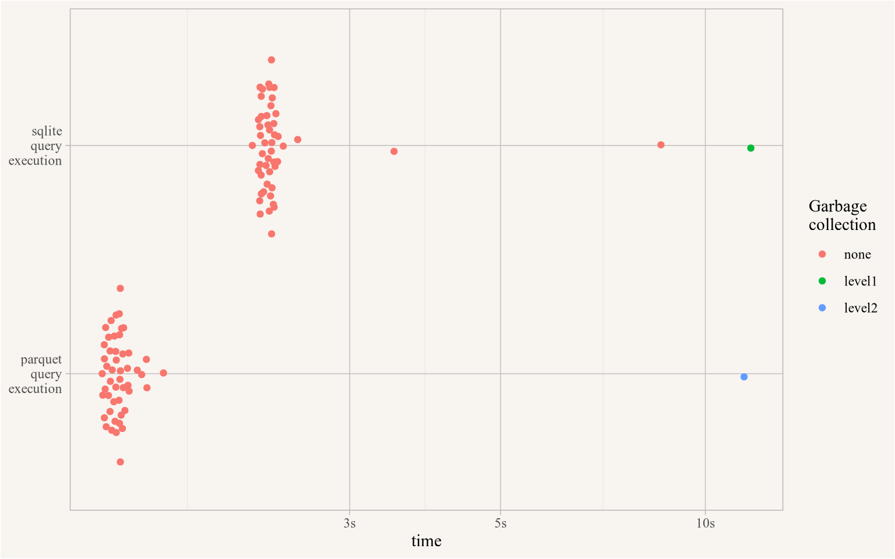
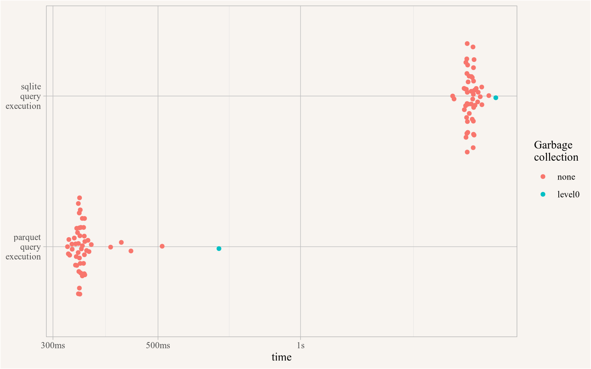

::: {.cell}

```{.r .cell-code  code-fold="true"}
library(tidyverse)
library(cansim)
library(bench)

cansim_repartition_cached_table("46-10-0070",new_partitioning = c()) # Ensure we are starting with unpartitioned parquet
```
:::


With version 0.4 **cansim** package got a major revamp. The **cansim** package has been available con CRAN since late 2018 and has undergone number of improvements since then. It started out focused on retrieving entire table data, with an emphasis on folding in metadata and making this additional layer of information easily available to users. From accessing table notes and footnotes to aid with data interpretation, to encoding the hierarchical structure within each dimension into the data frame to allow for filtering by sub-categories.

We then added support to query data by vector, or table and coordinate, for targeted data retrieval. And we enhanced the ability to access and browse the list of available StatCan tables, and retrieve their metadata without downloading the table first.

In 2021 we added support for more permanent caching of tables in SQLite, which makes it easier and faster to work with the data, especially for slowly updating tables, while warning users if the cached SQLite table becomes stale and there is a newer version available. This means users don't have to re-download the table between R sessions, and querying data becomes much faster with database level filtering as well as summarizing while significantly reducing the memory footprint.

By further enhancing access to table metadata without downloading the table first we now also enrich data queries by vector or table and coordinate with the full metadata, giving context to how the downloaded data fits into the larger data table by e.g. providing the full levels of each data dimension.

While the functionality is now quite extensive, there was one particular issue that emerged for us and others that diminished the usefulness of the package: **Some tables are very large, which makes working with these tables cumbersome in several ways:**

* The basic `get_cansim()` function takes a long time to download and parse the data. It also has a fairly large memory footprint, which can be a problem for users with limited memory.
* A good way to deal with this has been to use `get_cansim_sqlite()` to cache the data as SQLite table after downloading it. However, even while this significantly reduces the memory footprint, the initial parsing to SQLite and indexing takes even longer than accessing the data via `get_cansim()`. And the storage space taken is larger than the initial CSV file, which is less than ideal. For some StatCan tables the resulting SQLite database can exceed 20Gb or even 40Gb, and having a couple of these cached noticeably eats into the local storage space.

# Enter parquet
To get around the issues of long import times and large storage requirements for caching SQLite tables, we decided to give [parquet](https://parquet.apache.org/) a try as alternative storage format. And this works extremely well for StatCan table data. Initial parsing to parquet is very fast with radically reduced storage space, by over one order of magnitude, for very large tables even over two orders of magnitude. Via the `arrow` package and `dbplyr` integration we can query the parquet files directly with dplyr verbs in pretty much the same way we accessed the tables via SQLite. Access speed when filtering data is still quite fast, roughly comparable to SQLite. However, if data is filtered in predictable ways, e.g. by geography or another dimension, we can specify a partition for the parquet data along one or several dimensions and significantly reduces access times, especially for queries that filter along those dimensions, resulting in access times faster than SQLite. At the same time we also implemented *feather* as an alternative data storage type, which preforms similarly to *parquet* for initial parsing and retrieval times but takes up more storage space.

Adding new storage methods required some mild changes to the interface when caching data in a database via `get_cansim_sqlite`.

# Transition guide

If you have not been making use of the sqlite capabilities of **cansim** in the past then nothing changed. But you should consider making use of the new database capabilities, especially when working with large tables.

If you have been working with the sqlite capabilities your old code will still run, but emit a deprecation warning. You should transition your code by globally renaming `get_cansim_sqlite` to `get_cansim_connection`. This will from now on use *parquet* format instead of sqlite. If you want to keep making use of *sqlite* instead, you should set the `format` parameter as follows.

`get_cansim_sqlite(...)` --> `get_cansim_connection(..., format="sqlite")`

Everything else works exactly like before, the different storage formats are hidden within the `get_cansim_connection` function. 

If you have a lot of older sqlite tables it might be worthwhile to remove these to preserve disk space. Previous versions of **cansim** had the functions `list_cansim_sqlite_cached_tables()` and `remove_cansim_sqlite_cached_table()` to list cached data and remove select tables. The functionality of these has been transitioned over to `list_cansim_cached_tables()` and `remove_cansim_cached_tables()` with identical syntax, except the addition of the `format` parameter. `remove_cansim_cached_tables()` can also remove several tables at once and accepts (filtered) output from `list_cansim_cached_tables()` as input for the `cansimTableNumber` argument as an alternative way to remove tables. For example


::: {.cell}

```{.r .cell-code}
list_cansim_cached_tables() |> 
  filter(dataFormat=="sqlite") |> 
  remove_cansim_cached_tables()
```
:::


will remove all cached *sqlite* tables.

# parquet in action

To showcase the changes to the **cansim** package we choose table ["Investment status of residential properties" (46-10-0070)](https://www150.statcan.gc.ca/t1/tbl1/en/tv.action?pid=4610007001), the tables comes as a 254.41MB compressed archive, containing metadata and a 6.45GB CSV file. This is quite large and going by the [hilarious warnings](https://www150.statcan.gc.ca/n1/tbl/csv/46100070-eng.zip) StatCan put on the download page it seems that StatCan is aware that the data format is less than ideal.

Looking at storage space taken by each format we see the dramatic reduction in storage space when using *parquet*.


::: {.cell}

```{.r .cell-code}
list_cansim_cached_tables() |>
  filter(cansimTableNumber=="46-10-0070") |>
  arrange(rawSize) |>
  select(cansimTableNumber,dataFormat,niceSize) 
```

::: {.cell-output .cell-output-stdout}

```
# A tibble: 3 × 3
  cansimTableNumber dataFormat niceSize
  <chr>             <chr>      <chr>   
1 46-10-0070        parquet    368.7 Mb
2 46-10-0070        feather    1.8 Gb  
3 46-10-0070        sqlite     11.5 Gb 
```


:::
:::


To showcase data querying we reproduce an outlier search that was quite popular back when this data table first came out, looking for metro areas or census agglomerations with the highest share of not owner-occupied condominium apartment units, termed as "investor" units in this dataset. To not be totally irresponsible we restrict ourselves to regions with at least 1000 condominium apartment units. 

The interface to access data via these data formats is identical as demonstrated here, with the slight exception that sqlite database connections should be disconnected after use. Execution times for the queries in the first three tabs is around 500 milliseconds on our machine, execution time for the traditional call is a lot longer because data first has be downloaded and the entire dataset gets normalized before the filtering operation.

::: {.panel-tabset .nav-pills}

## parquet


::: {.cell}

```{.r .cell-code}
get_cansim_connection("46-10-0070") |> # parquet is the default format
  filter(Estimates %in% c("Percentage - investment status","Number"),
         `Period of construction`=="Total, all periods of construction",
         `Property type`=="Condominium apartment",
         `Ownership type`=="Total, all ownership types",
         `Investment status`=="Investment property",
         REF_DATE=="2020",
         nchar(GeoUID)==3) |> # only CMAs
  collect_and_normalize() |>
  select(GeoUID,GEO,Estimates,val_norm) |>
  pivot_wider(names_from=Estimates,values_from=val_norm) |>
  filter(Number>=1000) |> # filter out ares with few condo apartments
  arrange(-`Percentage - investment status`) |>
  head(4)
```

::: {.cell-output .cell-output-stdout}

```
# A tibble: 4 × 4
  GeoUID GEO                                     Number Percentage - investmen…¹
  <chr>  <fct>                                    <dbl>                    <dbl>
1 544    Woodstock, Census agglomeration (CA)      1705                    0.95 
2 562    Sarnia, Census agglomeration (CA)         1465                    0.869
3 555    London, Census metropolitan area (CMA)   29530                    0.864
4 556    Chatham-Kent, Census agglomeration (CA)   1225                    0.839
# ℹ abbreviated name: ¹​`Percentage - investment status`
```


:::
:::


## feather


::: {.cell}

```{.r .cell-code}
get_cansim_connection("46-10-0070",format="feather") |>
  filter(Estimates %in% c("Percentage - investment status","Number"),
         `Period of construction`=="Total, all periods of construction",
         `Property type`=="Condominium apartment",
         `Ownership type`=="Total, all ownership types",
         `Investment status`=="Investment property",
         REF_DATE=="2020",
         nchar(GeoUID)==3) |> # only CMAs
  collect_and_normalize() |>
  select(GeoUID,GEO,Estimates,val_norm) |>
  pivot_wider(names_from=Estimates,values_from=val_norm) |>
  filter(Number>=1000) |> # filter out ares with few condo apartments
  arrange(-`Percentage - investment status`) |>
  head(4)
```

::: {.cell-output .cell-output-stdout}

```
# A tibble: 4 × 4
  GeoUID GEO                                     Number Percentage - investmen…¹
  <chr>  <fct>                                    <dbl>                    <dbl>
1 544    Woodstock, Census agglomeration (CA)      1705                    0.95 
2 562    Sarnia, Census agglomeration (CA)         1465                    0.869
3 555    London, Census metropolitan area (CMA)   29530                    0.864
4 556    Chatham-Kent, Census agglomeration (CA)   1225                    0.839
# ℹ abbreviated name: ¹​`Percentage - investment status`
```


:::
:::


## sqlite


::: {.cell}

```{.r .cell-code}
get_cansim_connection("46-10-0070",format="sqlite") |>
  filter(Estimates %in% c("Percentage - investment status","Number"),
         `Period of construction`=="Total, all periods of construction",
         `Property type`=="Condominium apartment",
         `Ownership type`=="Total, all ownership types",
         `Investment status`=="Investment property",
         REF_DATE=="2020",
         nchar(GeoUID)==3) |> # only CMAs
  collect_and_normalize(disconnect = TRUE) |>
  select(GeoUID,GEO,Estimates,val_norm) |>
  pivot_wider(names_from=Estimates,values_from=val_norm) |>
  filter(Number>=1000) |> # filter out ares with few condo apartments
  arrange(-`Percentage - investment status`) |>
  head(4)
```

::: {.cell-output .cell-output-stdout}

```
# A tibble: 4 × 4
  GeoUID GEO                                     Number Percentage - investmen…¹
  <chr>  <fct>                                    <dbl>                    <dbl>
1 544    Woodstock, Census agglomeration (CA)      1705                    0.95 
2 562    Sarnia, Census agglomeration (CA)         1465                    0.869
3 555    London, Census metropolitan area (CMA)   29530                    0.864
4 556    Chatham-Kent, Census agglomeration (CA)   1225                    0.839
# ℹ abbreviated name: ¹​`Percentage - investment status`
```


:::
:::


## traditional


::: {.cell}

```{.r .cell-code}
get_cansim("46-10-0070") |>
  filter(Estimates %in% c("Percentage - investment status","Number"),
         `Period of construction`=="Total, all periods of construction",
         `Property type`=="Condominium apartment",
         `Ownership type`=="Total, all ownership types",
         `Investment status`=="Investment property",
         REF_DATE=="2020",
         nchar(GeoUID)==3) |> # only CMAs
  select(GeoUID,GEO,Estimates,val_norm) |>
  pivot_wider(names_from=Estimates,values_from=val_norm) |>
  filter(Number>=1000) |> # filter out ares with few condo apartments
  arrange(-`Percentage - investment status`) |>
  head(4)
```

::: {.cell-output .cell-output-stdout}

```
# A tibble: 4 × 4
  GeoUID GEO                                     Number Percentage - investmen…¹
  <chr>  <fct>                                    <dbl>                    <dbl>
1 544    Woodstock, Census agglomeration (CA)      1705                    0.95 
2 562    Sarnia, Census agglomeration (CA)         1465                    0.869
3 555    London, Census metropolitan area (CMA)   29530                    0.864
4 556    Chatham-Kent, Census agglomeration (CA)   1225                    0.839
# ℹ abbreviated name: ¹​`Percentage - investment status`
```


:::
:::


:::

At this point it is probably prudent to note that this outlier search surfaced data quirks, spotlighting regions with a high number of purpose-built rental apartments that were legally structured as condominium as we have documented in detail previously. [@investing-in-definitions-and-framing.2023] The varying shares of "investor"-owned condos is mostly a function of differences how purpose-built rental apartments are structured in different regions, not that investors identified Woodstock as a particularly good place to invest. StatCan is [now explicitly acknowledging this issue](https://bsky.app/profile/jensvb.bsky.social/post/3l5mmhst2b62w) in their [Daily article](https://www150.statcan.gc.ca/n1/daily-quotidien/241003/dq241003a-eng.htm) on new releases of this table, but this has had little impact on media reporting in [highly misleading news reporting on this](https://www.cbc.ca/news/canada/london/london-ontario-investment-property-1.6739784), even for [artices that specifically highlighed the four regions from our outlier search](https://www.theglobeandmail.com/business/article-investors-own-big-chunk-of-ontarios-condo-market/), none of these have seen corrections.


The takeaway is that when hunting for outliers there is a good chance that one simply discovers data quirks instead of a surprising real phenomenon on the ground.


A more useful application might be to try and understand how the share of investment condominium apartments has varied over time. For this we can utilize database level summarizing, maybe looking at the spread between maximum and minimum share over the three years of data in each region.


::: {.cell}

```{.r .cell-code}
get_cansim_connection("46-10-0070") |>
  filter(Estimates %in% c("Percentage - investment status"),
         `Period of construction`=="Total, all periods of construction",
         `Property type`=="Condominium apartment",
         `Ownership type`=="Total, all ownership types",
         `Investment status`=="Investment property",
         nchar(GeoUID)==3) |> # only CMAs
  summarize(years=n(),
            mean=mean(VALUE,na.rm=TRUE),
            min=min(VALUE,na.rm=TRUE),
            max=max(VALUE,na.rm=TRUE),
           .by=c(GeoUID,GEO)) |>
  mutate(spread=max-min) |>
  slice_max(spread,n=10,with_ties = FALSE) |>
  arrange(-spread) |>
  collect()
```

::: {.cell-output .cell-output-stdout}

```
# A tibble: 10 × 7
   GeoUID GEO                                     years  mean   min   max spread
   <chr>  <chr>                                   <int> <dbl> <dbl> <dbl>  <dbl>
 1 210    Kentville, Census agglomeration (CA)        3  50     0   100    100  
 2 215    Truro, Census agglomeration (CA)            3  49.0  40    62.5   22.5
 3 586    Timmins, Census agglomeration (CA)          3  71.2  60.2  77.1   16.9
 4 110    Summerside, Census agglomeration (CA)       2  54.1  46.7  61.5   14.8
 5 610    Brandon, Census agglomeration (CA)          3  44.3  35.3  50     14.7
 6 310    Saint John, Census metropolitan area (…     3  34.8  29.9  42.5   12.6
 7 965    Terrace, Census agglomeration (CA)          3  72    65.5  76.9   11.4
 8 225    Cape Breton, Census agglomeration (CA)      3  26.8  22.2  33.3   11.1
 9 335    Edmundston, Census agglomeration (CA)       3  18.7  14.3  25     10.7
10 305    Moncton, Census metropolitan area (CMA)     3  22.3  16.5  26.3    9.8
```


:::
:::


Here the entire filtering and summarizing of the data happened during the data retrieval process, these operations are fast and have a low memory footprint.

# Query execution speed

To quantify the performance of *parquet* we profile this summary query. The SQLite database is indexed on the individual columns and not on column interactions, which reduces the advantage of SQLite over (unpartitioned) *parquet* compared to scenarios where we filter only on a single dimension, but in real world applications that's rarely the case anyway. So this should give a decent benchmark of general performance.


To start out we compare execution speed of the above query.


::: {.cell}

```{.r .cell-code  code-fold="true"}
bb<-bench::mark("parquet\nquery\nexecution"=get_cansim_connection("46-10-0070") |>
                filter(Estimates %in% c("Percentage - investment status"),
                       `Period of construction`=="Total, all periods of construction",
                       `Property type`=="Condominium apartment",
                       `Ownership type`=="Total, all ownership types",
                       `Investment status`=="Investment property",
                       nchar(GeoUID)==3) |> # only CMAs
                summarize(years=n(),
                          mean=mean(VALUE,na.rm=TRUE),
                          min=min(VALUE,na.rm=TRUE),
                          max=max(VALUE,na.rm=TRUE),
                          .by=c(GeoUID,GEO)) |>
                mutate(spread=max-min) |>
                slice_max(spread,n=10,with_ties = FALSE) |>
                arrange(-spread) |>
                collect(),
                "sqlite\nquery\nexecution"=get_cansim_connection("46-10-0070",format="sqlite") |>
                filter(Estimates %in% c("Percentage - investment status"),
                       `Period of construction`=="Total, all periods of construction",
                       `Property type`=="Condominium apartment",
                       `Ownership type`=="Total, all ownership types",
                       `Investment status`=="Investment property",
                       nchar(GeoUID)==3) |> # only CMAs
                summarize(years=n(),
                          mean=mean(VALUE,na.rm=TRUE),
                          min=min(VALUE,na.rm=TRUE),
                          max=max(VALUE,na.rm=TRUE),
                          .by=c(GeoUID,GEO)) |>
                mutate(spread=max-min) |>
                slice_max(spread,n=10,with_ties = FALSE) |>
                arrange(-spread) |>
                collect(),iterations=50)
plot(bb) +
  labs("Query execution time comparisons",
        y=NULL,
       colour="Garbage\ncollection")
```

::: {.cell-output-display}
{width=768}
:::
:::


On this query *parquet* performs slightly better, averaging 1.36s compared to 2.29s for *sqlite*. Similarly, for memory footprint *parquet* compares favourably with 2.62MB for *parquet* and 4.54MB for *sqlite*.

For large tables like this it makes sense to partition the *parquet* data, which functions somewhat like an index for SQLite. The package creates single variable indexes for SQLite by default, partitioning for *parquet* works only along a single dimension, or a combination of dimensions more similar to a multi-index in SQLite. There are a number of choices along which dimension how to partition, a fairly generic one that works for a lot of use cases would be to index by geographic region, with the understanding that we often restrict queries by region. For our particular query we are profiling we filter by only considering metro areas and census agglomerations.


::: {.cell}

```{.r .cell-code  code-fold="true"}
tictoc::tic()
cansim_repartition_cached_table("46-10-0070",new_partitioning = c("GeoUID")) 
duration <- tictoc::toc()
```
:::


Repartitioning for this database took 7.3 seconds, not worth it if we are only doing a couple of queries, but it has the potential to save quite a bit of time if we query data repeatedly, depending how much this speeds up queries.


::: {.cell}

```{.r .cell-code  code-fold="true"}
bb2<-bench::mark("parquet\nquery\nexecution"=get_cansim_connection("46-10-0070") |>
                filter(Estimates %in% c("Percentage - investment status"),
                       `Period of construction`=="Total, all periods of construction",
                       `Property type`=="Condominium apartment",
                       `Ownership type`=="Total, all ownership types",
                       `Investment status`=="Investment property",
                       nchar(GeoUID)==3) |> # only CMAs
                summarize(years=n(),
                          mean=mean(VALUE,na.rm=TRUE),
                          min=min(VALUE,na.rm=TRUE),
                          max=max(VALUE,na.rm=TRUE),
                          .by=c(GeoUID,GEO)) |>
                mutate(spread=max-min) |>
                slice_max(spread,n=10,with_ties = FALSE) |>
                arrange(-spread) |>
                collect(),
                "sqlite\nquery\nexecution"=get_cansim_connection("46-10-0070",format="sqlite") |>
                filter(Estimates %in% c("Percentage - investment status"),
                       `Period of construction`=="Total, all periods of construction",
                       `Property type`=="Condominium apartment",
                       `Ownership type`=="Total, all ownership types",
                       `Investment status`=="Investment property",
                       nchar(GeoUID)==3) |> # only CMAs
                summarize(years=n(),
                          mean=mean(VALUE,na.rm=TRUE),
                          min=min(VALUE,na.rm=TRUE),
                          max=max(VALUE,na.rm=TRUE),
                          .by=c(GeoUID,GEO)) |>
                mutate(spread=max-min) |>
                slice_max(spread,n=10,with_ties = FALSE) |>
                arrange(-spread) |>
                collect(),iterations=50)
plot(bb2) +
  labs("Query execution time comparisons, single level parquet partitioning",
       y=NULL,
       colour="Garbage\ncollection")
```

::: {.cell-output-display}
{width=768}
:::
:::


When partitioned by geography the query time for *parquet* drops significantly averaging 342ms, easily justifying the time spent repartitioning when running the query 50 times for the profiler. Memory footprint stays essentially unchanged. The somewhat small penalty for repartitioning shrinks even further if we partition data right at import. One downside of partitioning is that it increases the storage space taken up on disk as compression is less efficient on partitioned data.


# Other changes

Other changes in the new version include a more principled approach to column order. Column order is more standardized and also carries across querying data by vector or coordinate. This might cause some short-term disruptions if people have been relying on the particular column order, but makes things more consistent in the long run. In particular, data queried in different ways looks identical, although the row order might differ and has to be set manually if people rely on row order.

We also started to implement more systematic unit testing to ensure more stable ongoing package development. And the package also got some speed boost in various places and more robust data handling under the hood. In short **cansim** got better, and the new *parquet* option makes for a much better way to work with large tables by speeding up data import, dramatically reducing the storage requirements, and reducing the memory footprint.

# Upshot

For people who have exclusively relied on `get_cansim` I recommend transitioning some uses over to `get_cansim_connection()`, possibly setting the `refresh="auto"` option to ensure they are always working with the latest data. From a coding perspective the cost is the additional `collect_and_normalize()` call, but the speedup when filtering before collecting is well worth it.

As usual, the code for this post is [available on GitHub](https://github.com/mountainMath/mountain_doodles/blob/main/posts/2025-02-23-cansim-revamp/index.qmd) for anyone to reproduce or adapt for their own purposes.


<details>

<summary>Reproducibility receipt</summary>


::: {.cell}

```{.r .cell-code}
## datetime
Sys.time()
```

::: {.cell-output .cell-output-stdout}

```
[1] "2025-02-23 20:40:01 PST"
```


:::

```{.r .cell-code}
## repository
git2r::repository()
```

::: {.cell-output .cell-output-stdout}

```
Local:    main /Users/jens/R/mountain_doodles
Remote:   main @ origin (https://github.com/mountainMath/mountain_doodles.git)
Head:     [bd04212] 2025-02-24: text tweaks
```


:::

```{.r .cell-code}
## Session info
sessionInfo()
```

::: {.cell-output .cell-output-stdout}

```
R version 4.4.2 (2024-10-31)
Platform: aarch64-apple-darwin20
Running under: macOS Sequoia 15.3.1

Matrix products: default
BLAS:   /Library/Frameworks/R.framework/Versions/4.4-arm64/Resources/lib/libRblas.0.dylib 
LAPACK: /Library/Frameworks/R.framework/Versions/4.4-arm64/Resources/lib/libRlapack.dylib;  LAPACK version 3.12.0

locale:
[1] en_US.UTF-8/en_US.UTF-8/en_US.UTF-8/C/en_US.UTF-8/en_US.UTF-8

time zone: America/Vancouver
tzcode source: internal

attached base packages:
[1] stats     graphics  grDevices utils     datasets  methods   base     

other attached packages:
 [1] bench_1.1.4     cansim_0.4      lubridate_1.9.4 forcats_1.0.0  
 [5] stringr_1.5.1   dplyr_1.1.4     purrr_1.0.4     readr_2.1.5    
 [9] tidyr_1.3.1     tibble_3.2.1    ggplot2_3.5.1   tidyverse_2.0.0

loaded via a namespace (and not attached):
 [1] bit_4.5.0.1               gtable_0.3.6             
 [3] jsonlite_1.8.9            compiler_4.4.2           
 [5] tidyselect_1.2.1          git2r_0.33.0             
 [7] assertthat_0.2.1          arrow_18.1.0.1           
 [9] scales_1.3.0              yaml_2.3.10              
[11] fastmap_1.2.0             R6_2.6.1                 
[13] generics_0.1.3            knitr_1.48               
[15] htmlwidgets_1.6.4         munsell_0.5.1            
[17] pillar_1.10.1             tzdb_0.4.0               
[19] rlang_1.1.5               stringi_1.8.4            
[21] xfun_0.50                 bit64_4.6.0-1            
[23] timechange_0.3.0          cli_3.6.4                
[25] withr_3.0.2               magrittr_2.0.3           
[27] mountainmathHelpers_0.1.4 digest_0.6.37            
[29] grid_4.4.2                rstudioapi_0.16.0        
[31] hms_1.1.3                 lifecycle_1.0.4          
[33] vctrs_0.6.5               evaluate_1.0.3           
[35] glue_1.8.0                colorspace_2.1-1         
[37] rmarkdown_2.28            tools_4.4.2              
[39] pkgconfig_2.0.3           htmltools_0.5.8.1        
```


:::
:::


</details>


