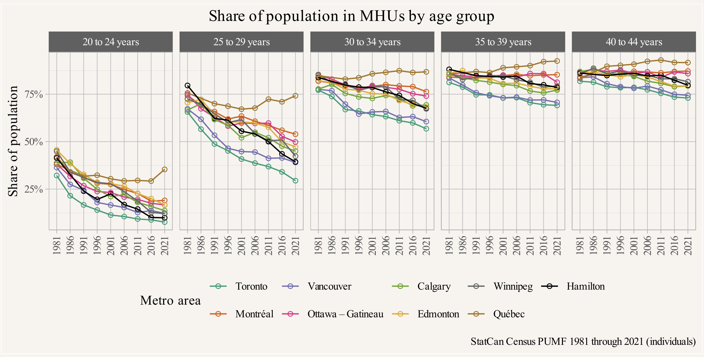
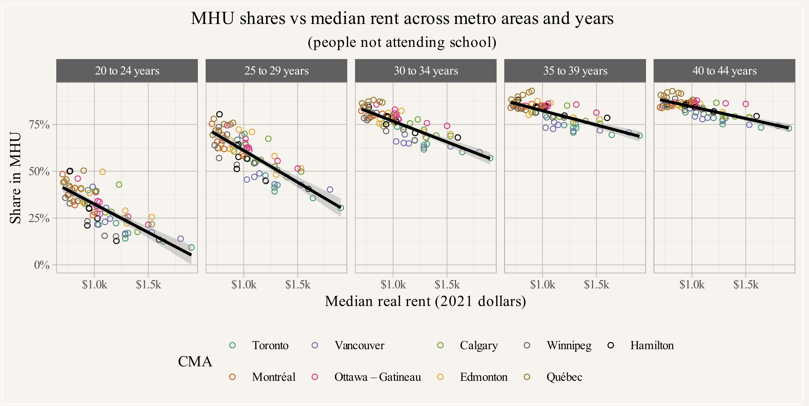
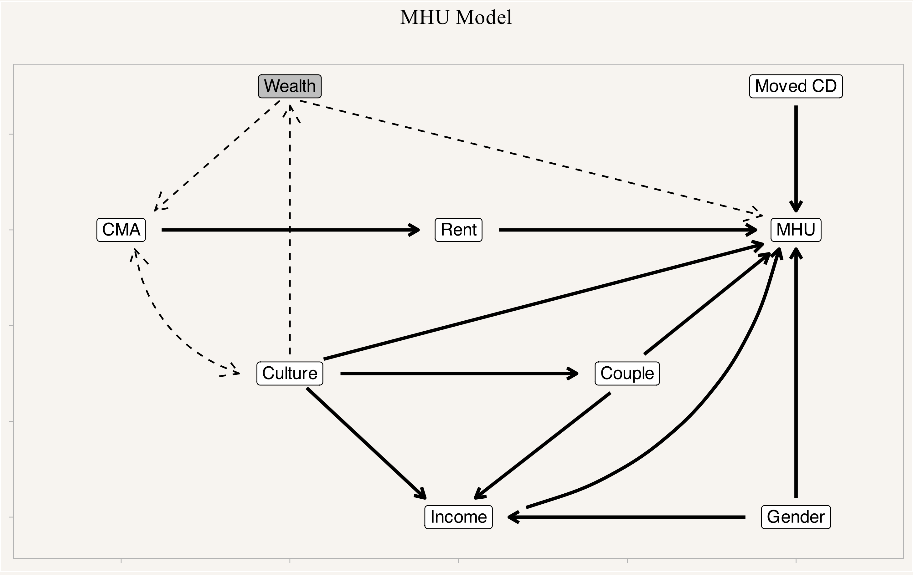
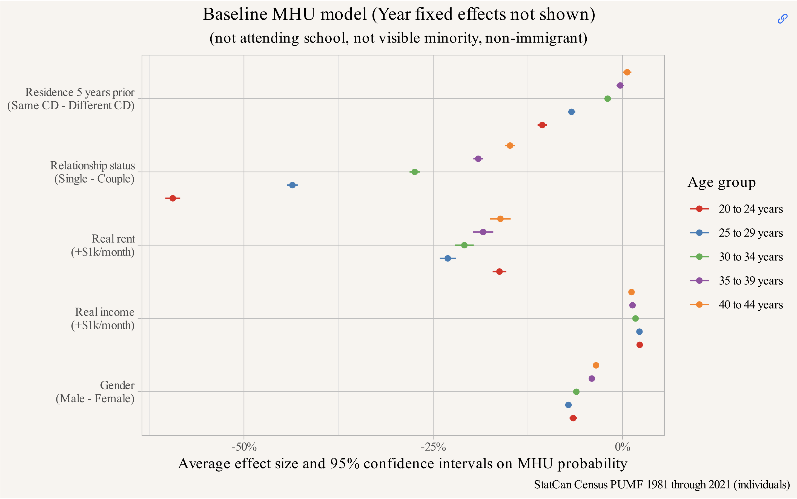
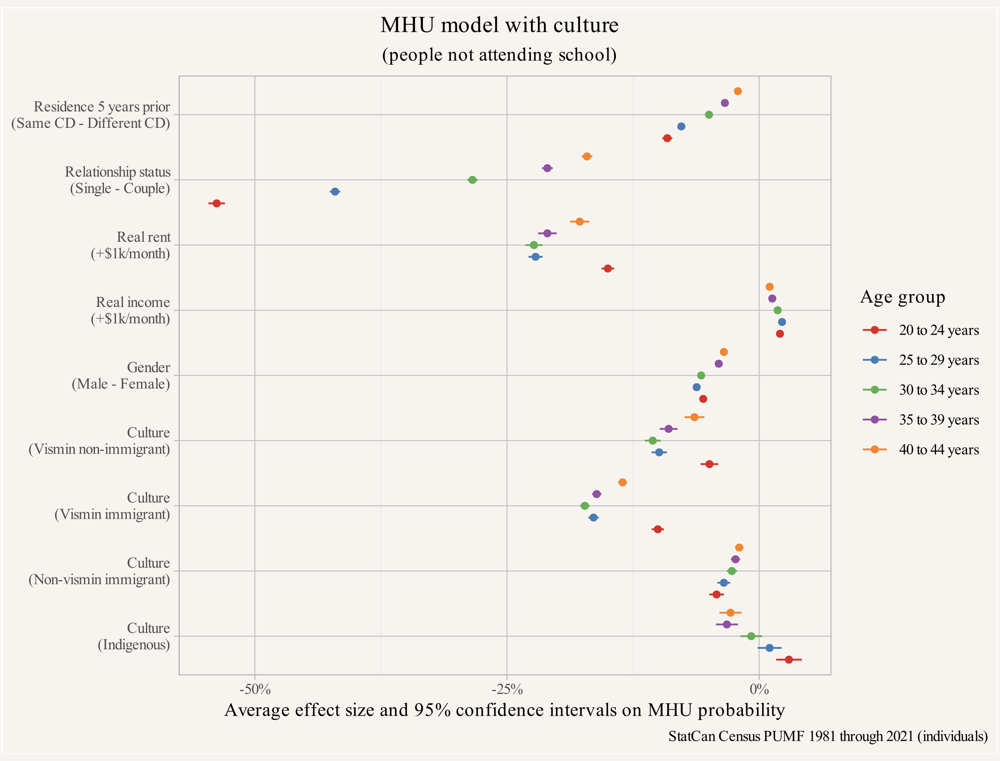

<i>(Joint with Nathan Lauster and cross-posted at <a href="https://homefreesociology.com/2025/03/11/housing-shortage-as-an-explanation-for-family-and-household-change/" target="_blank">HomeFreeSociology</a>)</i>

In our new paper "The new rules: housing shortage as an explanation for family and household change across large metro areas in Canada, 1981-2021" [@mhu.2025] ([preprint and replication code](https://mountainmath.github.io/family_household_change/)) we estimate the impacts of housing shortage on the substantial variation we see in family and household structures, both across large metro areas in Canada and across time, focusing on 1981 through 2021. 

We set up the paper by describing the historical backstory to a cultural shift toward households that look like Minimal Household Units (MHU). Following Ermisch & Overton we describe four basic MHU living arrangements as becoming more broadly desirable:

* living alone,
* living as a single parent of dependent child(ren),
* living as a couple without children, and
* living as a couple with dependent child(ren).

The shift toward MHU arrangements maps onto rising desire for privacy and autonomy and a decreasing tolerance for various forms of servanthood, boarding, and lodging arrangements that used to be more common. This declining tolerance was also often directed at lodging houses and apartment buildings, ultimately resulting in various states of housing shortage across Canada. We provide a long-term view of rents across Canadian metropolitan areas as a measure of evolving housing shortages.

It's fun to track the positions of metropolitan areas over time, for instance following the oil busts and booms through Calgary or watching as Vancouver moved from middle of the pack to begin vying with Toronto for highest rents between 1971 and 1981, but overall we're interested in the widening variation in shortage between metros. Metropolitan housing shortage, of course, can make it more or less difficult to achieve MHU living arrangements. We're able to track this relationship for recent decades, gathering data on rents and minimal household unit status across nine major metropolitan areas within Canada. Conceptualizing household change as being driven by a variety of factors, we establish a robust relationship whereby lower rents sort more young adults (age 20-44) into minimal household units (MHU) over this time period.

Rising rents may also be a sign of improving quality of housing services, deflating rents by incomes instead of CPI offers another point of view that at least partially filters out effects of improving housing quality, as these are generally driven by income growth. Refining our methods leaves us with the shorter 1981 through 2021 time period, where we see significant variation in rents and incomes and across metro areas. Both real incomes (of young adults) and real rents have generally increased, but the rent-to-income ratio has diverged in interesting patterns that enable robust estimates of the effects of rents and incomes on household formation. 

The share of young adults not in minimum household units by age bracket follows a related pattern across metro areas and census years.

Putting this together with rents reveals a simple pattern, whereby higher rents correlate with lower MHU shares.

But is there a causal interpretation of this relationship? To investigate this we conceptualize the processes by which young adults sort into households by MHU status in the following way:

We focus on metro level prevailing rents, as determined by housing markets and regulations at the metro area level, as our primary determinant of interest with respect to MHU status, while including other important determinants for precision and to close potential backdoor paths mediated by "Culture" (and to a lesser degree incomes) as given by varying cultural makeup across metro areas. Wealth is an important variable that remains unfortunately unmeasured and likely has some confounding impact on our estimates, however we believe this remains only a minor concern.

We estimate our model by utilizing individual level census public use microdata files (PUMF) in a logit regression. As a baseline that does not consider the role of Canada's growing cultural diversity we first restrict the model to the non-immigrant non-visible minority sub-population.

This shows a clear impact of rents on the probability of living in a minimum household unit vs doubling up. As expected, other factors also matter, in particular couple status and incomes. Couple status is not unrelated to housing outcomes and lacks a clear causal interpretation.

But what happens when we add "Culture" into the model and try to assess it's impact on the relationship? Given the model utilizing data back to 1981, and working under the constraints of variables available in the PUMF data (not having access to the full sample of the census for this work), we lack the ability to include fine subgroups. Instead we settle for broad categories built from visible minority status and immigrant generation.^[We estimate a model with finer categories in the Appendix of the paper based only on the most recent three census years.]

Our results do show an impact of "Culture", especially for immigrants, as the estimated effect sizes are now averaged across the overall population. For an apples-to-apples comparison of the models including and excluding culture we can estimate the effect size of the culture model on the same baseline population we used in the baseline model.

If our model was successful in capturing all confounding effects we would expect that the effect sizes of the baseline and "Culture" model estimated on the baseline population to be identical, but we do notice some slight shifts. We attribute most of these to the unmeasured "Wealth" factor, which differs systematically across cultural groups and by immigration status. Additionally this comparison reveals hints of wealth-based sorting, some of the effects of which get soaked up in our mobility variable.

# Takeaways

We find broad support for a strong relationship between rents and the the likelihood that households will form into minimal household units, and that this relationship is causal. It serves as an important reminder that the form and size of **households are malleable**, and at least partially outcomes of housing pressure.

This has important implications for policy! Existing household arrangements should not be taken as the simple product of preferences of household members, and assuming households to remain fixed under policy interventions can introduce substantial collider bias threatening the validity of analysis. Our results indicate that housing policy should pay special attention to the malleability of households. Many household-based measures of housing pressure, like shelter cost to household income ratios, fail to incorporate how the composition of households itself reflects housing pressure. Moreover, as households split up into MHU, it often decreases aggregate household-based affordability measures despite being viewed as preferable by household members. This suggests that MHU formation should be directly incorporated into policy analysis to complement affordability-based metrics in order to better understand how housing shortage works and avoid misspecification of the welfare function.

The tight causal relationship between rents and the share of people in MHU can serve as a useful proxy for housing pressures brought on by shortage. This strong relationship also offers a clear direction to fixing our housing problems. To increase MHU shares it is necessary to address the underlying housing shortage by increasing the total amount of housing available. On a fundamental level this is a consequence of the "pigeonhole principle" and the mechanical relationship between dwellings and households.

The relationship of rents and MHU to shortage also highlights the importance of thinking through systemic effects when contemplating housing policy. Doubling up is the main mechanism by which people adjust to housing pressures. Unfortunately contemporary housing analysis and literature often forget this in suggesting that increasing housing supply primarily serves in-migrants. This is problematic insofar as it leads to misunderstandings about how housing works as a system, and can easily lead to counter-productive policy recommendations. For additional examples of potentially counter-productive policies, a policy freezing rents may help current tenants, but does little to alleviate underlying shortage, and correspondingly we wouldn't expect it to have much effect on MHU status. Similarly, policies, as with some occupancy restrictions, that reinforce the move toward MHU shouldn't be expected to drive down rents, and may, indeed, have the opposite effect, as well as driving up homelessness. It's only by alleviating underlying housing shortage that we expect to see a rise in welfare, as measured by both a decline in rents and a rise in MHU, and in line with our results above.

This post has no code, but all the images are taken from [our paper](https://www.tandfonline.com/doi/full/10.1080/1081602X.2024.2448986) that comes will [full replication code](https://github.com/mountainMath/family_household_change/blob/main/family_household_change.qmd).
