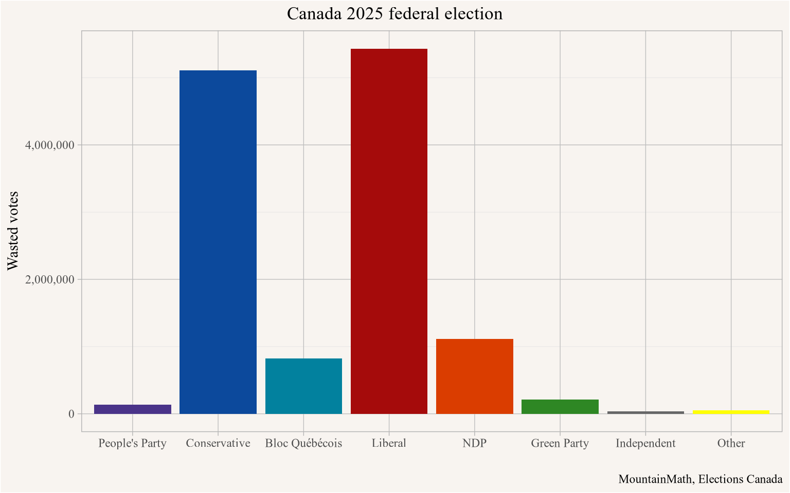

::: {.cell}

```{.r .cell-code}
library(tidyverse)
#remotes::install_github("mountainmath/mountainmathHelpers")
library(mountainmathHelpers)
library(sf)
library(rmapshaper)
library(cancensus)

my_theme <- list(
  labs(caption="MountainMath, Elections Canada")
)
```
:::


Following our posts on the [2019 election](https://doodles.mountainmath.ca/blog/2019/10/22/elections-fun/) and [2021 election](https://doodles.mountainmath.ca/posts/2021-09-25-elections-fun-2021-edition/) we might as well re-use the code to run a high-level analysis of the 2025 federal election results. And also include the obligatory "land does not vote - people do" map pioneered by [Karim Douïeb](https://bsky.app/profile/karimdouieb.bsky.social). And thanks to [quarto](https://quarto.org) supporting [observable.js](https://observablehq.com/documentation/cells/observable-javascript) we can now embed the interactive maps directly into the post, as we did with the [2024 BC election results](https://doodles.mountainmath.ca/posts/2024-10-20-bc-election-2024/).

Initially I was writing this on election day, with the goal of getting this up and then updating it regularly as the results come in. But the Elections Canada webpage stopped reporting results to the general public and it became too much of a pain. Ridings that have not been called by CBC are coloured in a lighter tone, those will disappear as the remaining ridings get called and the results are updated.


::: {.cell}

```{.r .cell-code}
get_cbc_data <- function() {
library(httr)
cbc_url <- "https://canopy.cbc.ca/live/elections/prov/FED2025/all/"


cbc_data<-content(GET(cbc_url))$data$ridings %>% 
  lapply(function(r){
  ridings<-tibble(id="1",ridingNumber=r$ridingNumber,name=r$englishName,totalVoters=r$totalVoters,totalPolls=r$totalPolls,
         resultStatus=paste0(unlist(r$resultStatus),collapse=", "),
         isCandidateElected=r$isCandidateElected,pollsReported=r$pollsReported,
         totalVotesReported=r$totalVotesReported,candidateVotesLead=r$candidateVotesLead,
         leadingPartyCode=r$leadingPartyCode)
  parties <- r$parties %>% lapply(function(p){
    tibble(id="1",partyId=p$partyId,englishCode=p$englishCode,candidateFirstName=p$candidateFirstName,
           candidateLastName=p$candidateLastName,votesPercentage=p$votesPercentage,votesLead=p$votesLead,
           votes=p$votes,candidateId=p$candidateId)
  }) |>
    bind_rows()
  full_join(ridings,parties,by="id") %>% select(-id)
}) |>
  bind_rows() |>
  mutate(called=isCandidateElected==1) |>
  mutate(District=gsub("’","'",name) |> gsub("œ","oe",x=_))

  cbc_data
}

get_electoral_areas <- function(refresh=FALSE){
  simpleCache({
    geos <-get_shapefile("https://ftp.maps.canada.ca/pub/elections_elections/Electoral-districts_Circonscription-electorale/federal_electoral_districts_boundaries_2023/FED_CA_2023_EN-SHP.zip") %>%
      rmapshaper::ms_simplify(0.1)
    clip <- get_statcan_geographies("2021",level="PR") |>
      st_transform(st_crs(geos)) |>
      ms_simplify(0.05,sys=TRUE) |>
      st_union() |>
      st_make_valid() 

    geos |>
      st_intersection(st_union(clip)) |>
      st_collection_extract("POLYGON") |>
      st_make_valid() |>
      rmapshaper::ms_simplify(0.5) |>
      st_collection_extract("POLYGON") |>
      mutate(FEDUID=as.character(FED_NUM))
    }, "canada_electoral_district_geos_2023",refresh = refresh) 
}


get_election_results <- function(){
  url="https://enr.elections.ca/DownloadResults.aspx"
  r <- httr::GET(url)
  text_data <- httr::content(r,type="text")
  
  rename_lookup <- c(
    "FEDUID"="Electoral district number - Numéro de la circonscription",
    "District"="Electoral district name",
    "Type"="Type of results*",
    "Surname"="Surname - Nom de famille",
    "Middle name(s)"="Middle name(s) - Autre(s) prénom(s)",
    "Given name"="Given name - Prénom",
    "Party"="Political affiliation",
    "Votes"="Votes obtained - Votes obtenus",
    "Votes_pct"="% Votes obtained - Votes obtenus %",
    "Rejected"="Rejected ballots - Bulletins rejetés***",
    "Total"="Total number of ballots cast - Nombre total de votes déposés"
  )
  read_tsv(text_data,skip=1,col_types = cols(.default="c")) %>%
    rename(!!!rename_lookup) %>%
    select(names(rename_lookup)) %>%
    filter(!is.na(FEDUID),!is.na(District)) %>%
    mutate_at(c("Votes","Votes_pct","Rejected","Total"),as.numeric) %>%
    mutate(Name=paste0(`Given name`," ",Surname)) %>%
    mutate(Party=recode(Party,"NDP-New Democratic Party"="NDP")) %>%
    mutate(Party=coalesce(Party,"Other"))
}

party_colours <- c(
  "People's Party"="#4a3389",
  Conservative="#0C499C",
  "Bloc Québécois"="#02819E",
  Liberal="#A50B0B",
  NDP="#DA3D00",
  "Green Party"="#2E8724",
  "Independent"="#676767",
  #"Undecided"="#676767",
  Other="yellow",
  "No results"="#444444"
)

previous_results <- read_csv("https://www.elections.ca/res/rep/tra/2023rep/csv/Transposition_343_FED.csv") |>
  mutate(FEDUID=as.character(FED_NUM)) |>
  select(FEDUID,District=FED_EN,Party=Political_Party_EN,Votes=Transposed_Votes,Votes_pct=Percent) |>
  mutate(Party=gsub(" Party of Canada","",Party) |> recode("New Democratic Party"="NDP","Green"="Green Party"))


clean_parties <- function(data) {
 data %>%
    mutate(Party=ifelse(Party %in% names(party_colours),Party,"Other")) %>%
    mutate(Party=coalesce(Party,"Other")) %>%
    mutate(Party=factor(Party,levels=names(party_colours)))
}

cleaned_previous_results <- previous_results |>
  summarise(Votes=sum(Votes,na.rm=TRUE),
            .by=c("FEDUID","District","Party")) |>
  mutate(Total=sum(Votes),.by=FEDUID) |>
  mutate(Name=Party)

geos <- get_electoral_areas() %>%
  st_transform(lambert_conformal_conic_at(.))
```
:::

::: {.cell}

```{.r .cell-code}
cbc_data <- simpleCache(get_cbc_data(),"cbc_election_results_2025_05_01_14_15")

not_called<- cbc_data%>% filter(!called) %>% pull(District)%>% unique
called_districts<- cbc_data%>% filter(called) %>% pull(District)%>% unique

new_results <- get_election_results()  %>%
  mutate(Type=str_to_title(Type)) |>
  #filter(Type=="validated" | (!validated & Type !="validated")) %>%
  mutate(Party=recode(Party,"People's Party - PPC"="People's Party"))

results <- new_results |> 
  select(-Surname, `Middle name(s)`, `Given name`) |>
  left_join(cleaned_previous_results |> 
              mutate(previous_winner=Votes==max(Votes,na.rm=TRUE),.by=FEDUID) |>
              select(FEDUID,Party,previous_winner), 
            by=c("FEDUID","Party")) |>
  mutate(dd=gsub("--","-",District)) |>
  mutate(called=dd %in% called_districts) |>
  mutate(Type=factor(Type,levels=c("Preliminary","Validated","Judicially Certified"),ordered = TRUE)) |>
  mutate(maxType=max(Type),.by=FEDUID) |>
  filter(Type==max(Type),.by=FEDUID)

stopifnot(sum(sort(unique(results$dd))!=sort(unique(cbc_data$District)))==0) # make sure we don't miss any


tmp <- tempfile("results_2025.csv")
#dd$called=sample(c(TRUE,FALSE), nrow(dd), TRUE)
results |>
  mutate(Registered=Total) |>
  mutate(Total=sum(Votes,na.rm=TRUE),.by=FEDUID) |>
  filter(Party %in% names(party_colours)) |>
  select(FEDUID,Candidate=Name,Party,Votes,called,previous_winner,Type,Registered,Total) |>
  write_csv(tmp)
dummy <- file_to_s3_gzip(tmp,"mountainmath","elections/results_2025.csv")
```
:::

::: {.cell crop='true' clip='true'}

```{.r .cell-code}
map_data <- geos |>
  select(FEDUID) |>
  left_join(results |>
              clean_parties() |>
              slice_max(n=1,order_by=Votes, with_ties = FALSE,by=FEDUID),by="FEDUID") |>
  mutate(Party=if_else(Total==0,"No results",Party))

ggplot(map_data,aes(fill=Party)) +
  geom_sf(size=0.1) +
  scale_fill_manual(values=party_colours) +
  coord_sf(datum=NA) +
  theme(legend.position = "bottom") +
  labs(title="Canada federal election 2025") 
```

::: {.cell-output-display}
{width=768}
:::
:::


This map makes it virtually impossible to get a good reading of the distribution of votes. There are a couple of ways around this. 

For example, one could break out the areas with electoral districts too small to make a visible impact on the map, or use a cartogram, like shown on the [Wikipedia page of the 2021 federal election](https://en.wikipedia.org/wiki/2021_Canadian_federal_election).

Another way to structure a cartogram is to scale geographic regions to the size of their (voting) population, as can be seen in the following graph.


::: {.cell crop='true'}

```{.r .cell-code}
# this takes forever
cartogram_data <- simpleCache({
  library(cartogram)
  map_data |>
    st_cast("POLYGON") |>
    mutate(a=st_area(geometry) |> as.numeric()) |>
    mutate(area_rank=rank(a),
           total_area=sum(a),.by=FEDUID) |>
    mutate(pop=Total*a/total_area) |>
    ms_simplify(keep=0.1) |>
    cartogram_cont(weight="pop",
                   itermax = 500,
                   maxSizeError = 1.01,
                   prepare = "adjust",
                   threshold = 0.05,
                   verbose = TRUE)
}, "continuous_cartogram.rds") |>
  select(District) |>
  left_join(results |> filter(Votes==max(Votes),.by=FEDUID),by="District")


cartogram_data |>
  ggplot(aes(fill=Party)) +
  geom_sf(size=0.1) +
  scale_fill_manual(values=party_colours) +
  coord_sf(datum=NA) +
  theme(legend.position = "bottom") +
  labs(title="Canada federal election 2025")
```

::: {.cell-output-display}
{width=768}
:::
:::


While this fairly accurately represents the "colour" of the vote, most of the geographic references are lost and it is only of limited usefulness. Although interesting how Canada gets pinched at Hudson Bay with low population areas collapsed.

Another way to bridge the gap is to animate a map that moves between a cartographic view of Canada and a Dorling cartogram as popularized by [Karim Douïeb](https://bsky.app/profile/karimdouieb.bsky.social), as as we have done for past election. The following is a live animation morphing between the map and the cartogram, with tooltips providing added interactivity and details on ridings.


:::::{.cell}

```{.js .cell-code code-fold="undefined" startFrom="254" source-offset="0"}
vote_map_animation = {
  const height = width*ratio ;
  const svg = d3.select(DOM.svg(width, height))
      .attr("viewBox", "0 0 960 600")
      .style("width", "100%")
      .style("height", "auto");

   debugger;
  // render map
  const path = d3.geoPath(projection);

   svg.append("g")
     .selectAll("path")
     .data(districts)
     .enter().append("path")
     .attr("class", "districtShape")
     .attr("fill", d => d.properties.called ? party_colors[d.properties.winner.Party] : party_colors2[d.properties.winner.Party])  
     .attr("d", path)
     .attr("stroke", "white")
     .attr("stroke-width", 0.5)
     .append("title")
     .text(tooltip) 
   
  setInterval(() => {
    svg.selectAll(".districtShape")
      .transition()
      .delay(d => 5 * d.properties.rank)
      .duration(5000)
      .attrTween('d', function(d, i) {
        return flubber.toCircle(path(d), d.x, d.y, d.properties.radius, {maxSegmentLength: 2});
      })

    svg.selectAll(".districtShape")
      .transition()
      .delay(d => 10000 + 5 * d.properties.rank)
      .duration(5000)
      .attrTween('d', function(d, i) {
        return flubber.fromCircle(d.x, d.y, d.properties.radius, path(d), {maxSegmentLength: 2});
      })
  }, 25000)

  return svg.node();
}
```

::::{.cell-output .cell-output-display}

:::{#ojs-cell-1 nodetype="declaration"}
:::
::::
:::::


::: {.cell}

```{.r .cell-code}
plot_data <- results %>%
  clean_parties %>%
  mutate(Share=Votes/Total) %>%
  group_by(District) %>%
  mutate(r=rank(Share)) %>%
  mutate(LagShare=lag(Share,order_by = r)) %>%
  top_n(1) %>%
  mutate(margin=Share-LagShare)

plurality <- plot_data %>% ungroup %>% filter(Share>0.5) %>% count()
```
:::


This still loses a lot of nuance. The colour is determined by who won the district, the animation reveals no information on how wide or narrow the margin of victory was. Or how the other candidates performed. 

## Winning vote share
With more than 2 candidates in each riding, one does not necessarily require a plurality of votes to win. 217 out of the 343 candidates won with over 50% of the vote in their district, that's almost double of what we saw in the last election.
The largest vote share any winning candidate got was 84%, the lowest was 34%, both numbers up a little from what we saw in the last election. 


::: {.cell}

```{.r .cell-code}
ggplot(plot_data ,aes(x=reorder(District,Share),y=Share,fill=Party)) +
  geom_bar(stat="identity") +
  coord_flip() +
  scale_fill_manual(values=party_colours) +
  my_theme +
  scale_y_continuous(labels=scales::percent) +
  theme(axis.text.y = element_blank()) +
  labs(title="Canada 2025 federal election",x="Voting districts",y="Vote share of winning candidate")
```

::: {.cell-output-display}
{width=768}
:::
:::

::: {.cell}

```{.r .cell-code}
top_party <- plot_data %>% arrange(-Share) %>% head(1) %>% pull(Party) %>% as.character()

top_sweep <- plot_data %>% 
  ungroup %>%
  arrange(-Share) %>% 
  mutate(n=row_number()) %>%
  filter(Party != head(.,1)$Party) %>%
  pull(n) %>%
  min -1
```
:::


In the last election the top 4 spots in terms of vote share were taken by the Conservatives, this time around the Conservatives swept the top 23 spots.

## Distribution of votes
We can expand this view to show the vote share by party for each district.


::: {.cell}

```{.r .cell-code}
all_data <- results %>% 
  clean_parties %>%
  mutate(Share=Votes/Total) %>%
  group_by(District) %>%
  mutate(winner=Votes==max(Votes)) %>%
  ungroup %>%
  mutate(District=factor(District,levels=group_by(.,District) %>% 
                           filter(Party %in% c("People's Party","Conservative")) %>% 
                           summarize(Share=sum(Share,na.rm=TRUE),.groups="drop") %>% 
                           arrange(Share) %>% 
                           pull(District),ordered = TRUE))

ggplot(all_data ,aes(x=District,y=Share,fill=fct_rev(Party))) +
  geom_bar(stat="identity") +
  coord_flip() +
  scale_fill_manual(values=party_colours) +
  my_theme +
  scale_y_continuous(labels=scales::percent) +
  theme(axis.text.y = element_blank()) +
  labs(title="Canada 2025 federal election",x="Voting districts",y="Vote share",fill="Party")
```

::: {.cell-output-display}
{width=768}
:::
:::


## Wasted votes
With our first-past-the-post system, we can also take a look at "wasted" votes. We define these as votes that have no bearing on the outcome. For winners it's the vote margin by which they won, for the ones that did not win their district it's the entirety of their votes. 


::: {.cell}

```{.r .cell-code}
waste_data <- results %>% 
  clean_parties %>%
  group_by(District) %>%
  mutate(r=rank(-Votes)) %>%
  left_join(filter(.,r==2) %>% select(District,required=Votes),by="District") %>%
  mutate(winner=Votes==max(Votes)) %>%
  mutate(waste=ifelse(winner,Votes-required-1,Votes)) %>%
  group_by(Party) %>%
  summarize(waste=sum(waste),.groups="drop")

ggplot(waste_data ,aes(x=Party,y=waste,fill=fct_rev(Party))) +
  geom_bar(stat="identity") +
  scale_fill_manual(values=party_colours,guide='none') +
  my_theme +
  scale_y_continuous(labels=scales::comma) +
  labs(title="Canada 2025 federal election",x="",y="Wasted votes",fill="Party")
```

::: {.cell-output-display}
{width=768}
:::
:::


The parties that got the most votes are naturally also the ones with the most votes to waste. 
Wasted votes is a somewhat artificial system that does not necessarily reflect how parties would have performed under a different voting system. We will need to take a closer look for that.

## First-past-the-post vs proportional representation
How would the parties have fared under a proportional representation system (PR) instead of first-past-the-post (FPTP)? There are many different kinds of proportional representation systems out there, but they generally try to approximate a seat distribution that mirrors the overall vote share. For simplicity we will simply take the overall vote share as a proxy for what a proportional representation system might have yielded. Well, kind of. The votes were cast under the expectation of a FPTP system, if we had switched to some kind of proportional representation or ranked ballot system some people would likely have voted differently and the outcome would have been different. We should view the PR alternative view as a first approximation to a PR outcome, if people were voting under a PR system the outcome could possibly be quite different.


::: {.cell}

```{.r .cell-code}
pr_name_data <- cancensus::list_census_regions("CA16") %>% filter(level=="PR") %>% arrange(as.integer(region))
pr_names <- set_names(pr_name_data$name,pr_name_data$region)
pr_share_data <- all_data %>% 
  mutate(PR=substr(FEDUID,1,2)) %>%
  group_by(PR,Party) %>%
  summarize(Votes=sum(Votes),Seats=sum(winner),.groups="drop") %>%
  group_by(PR) %>%
  mutate(Share=Votes/sum(Votes)) %>%
  mutate(Province=pr_names[PR] %>% as.character) %>%
  mutate(Province=factor(Province,levels=group_by(.,Province) %>% 
                           filter(Party %in% c("People's Party","Conservative")) %>% 
                           summarize(Share=sum(Share,na.rm=TRUE),.groups="drop") %>% 
                           arrange(Share) %>% 
                           pull(Province),ordered = TRUE)) %>%
  ungroup %>%
  select(-PR) %>%
  rename(FPTP=Seats,PR=Votes)  
```
:::

::: {.cell}

```{.r .cell-code}
pr_share_data %>%
  group_by(Party) %>%
  summarize(FPTP=sum(FPTP),PR=sum(PR),.groups="drop") %>%
  mutate(PR=PR/sum(PR)) %>%
  gather(key="Voting system",value="value",c("FPTP","PR")) %>%
ggplot(aes(x=`Voting system`,y=value,fill=fct_rev(Party))) +
  geom_bar(stat="identity",position = "fill") +
  coord_flip() +
  scale_fill_manual(values=party_colours) +
  my_theme +
  scale_y_continuous(labels=scales::percent) +
  theme(legend.position = "bottom") +
  labs(title="Canada 2025 federal election, comparing FPTP to PR with 5% minimum vote cutoff",
       subtitle="(preliminary results)",
       x="Voting system",y="Share of seats",fill="Party") 
```

::: {.cell-output-display}
{width=768}
:::
:::


Last time the Liberals were the big winner of FPTP, as was Bloc Québécois. This time around again the Liberals profited most from FPTP, at cost to the NDP^[Some people would likely change their voting behaviour if the voting system changed, this comparison makes the simplifying and somewhat unrealistic assumption that this won't happen and voting behaviour remains unchanged.] But overall, the election outcome would not have been that much different in who forms government under either system, but there is a difference in whether it's a minority or majority government.


We can run this by individual province to see how well each province is represented in terms of first-past-the-post vs proportional representation.


::: {.cell}

```{.r .cell-code}
pr_share_data %>%
  gather(key="Voting system",value="Share",c("FPTP","PR")) %>%
ggplot(aes(x=Province,y=Share,fill=fct_rev(Party))) +
  geom_bar(stat="identity",position = "fill") +
  coord_flip() +
  scale_fill_manual(values=party_colours) +
  my_theme +
  facet_wrap("`Voting system`") +
  scale_y_continuous(labels=scales::percent) +
  theme(legend.position = "bottom") +
  labs(title="Canada 2025 federal election, comparing FPTP vs PR by province", 
       x="Province",y="Share of seats",fill="Party")
```

::: {.cell-output-display}
{width=768}
:::
:::


## Upshot
There is endless fun to be had with elections data. As usual, the code for this post, including the pre-processing for the animation, is [available on GitHub](https://github.com/mountainMath/doodles/blob/master/content/posts/2025-04-28-elections-fun---2025-edition/index.qmd) for anyone to adapt and dig deeper into elections data.


## Update (May 10th)
I have been re-running the code occasionally as Elections Canada updated results. And seats flipped, which happened twice since the election was called on election night.

Additionally, I got a [question about showing seat flips](https://bsky.app/profile/thomassomething.bsky.social/post/3loud5jbzp22h). With the redistricting in 2023 we now have more elecoral districts than in 2021 and not all ridings are comparable. Of course people also moved in the meantime, so it's not the same people voting. Understanding this we can take the 2021 votes redistributed over the new electoral ridings used in the 2025 election and compare the 2025 outcome to the hypothetical outcome of the 2021 vote redistributed over the 2025 electoral riding boundaries. 


::: {.cell}

```{.r .cell-code}
map_data2 <- map_data |> 
  filter(Votes==max(Votes),.by=FEDUID) |>
  left_join(previous_results |> filter(Votes==max(Votes,na.rm = TRUE),.by=FEDUID) |> select(FEDUID,PreviousParty=Party),
            by="FEDUID") |>
  mutate(flip=Party!=PreviousParty) 

flips <- map_data2 |>
    filter(flip) |>
    mutate(PRUID=substr(FEDUID,1,2)) |>
    left_join(list_census_regions("2021") |> 
                  filter(level=="PR") |> 
                  mutate(name=fct_reorder(name,pop)) |>
                  select(PRUID=region,Province=name),
              by="PRUID") |> st_drop_geometry() |> 
  count(Party) |>
  pivot_wider(names_from = Party,values_from=n)

flips_lost <- map_data2 |>
    filter(flip) |>
    mutate(PRUID=substr(FEDUID,1,2)) |>
    left_join(list_census_regions("2021") |> 
                  filter(level=="PR") |> 
                  mutate(name=fct_reorder(name,pop)) |>
                  select(PRUID=region,Province=name),
              by="PRUID") |> st_drop_geometry() |> 
  count(PreviousParty) |>
  pivot_wider(names_from = PreviousParty,values_from=n)

map_data2 |>
  filter(flip) |>
  mutate(PRUID=substr(FEDUID,1,2)) |>
  left_join(list_census_regions("2021") |> 
              filter(level=="PR") |> 
              mutate(name=fct_reorder(name,pop)) |>
              select(PRUID=region,Province=name),
            by="PRUID") |>
  ggplot(aes(y=Province,fill=PreviousParty)) +
  geom_bar() +
  scale_fill_manual(values=party_colours) +
  facet_wrap(~Party,labeller=as_labeller(c("Conservative"="Conservative 2025","Liberal"="Liberal 2025"))) +
  labs(title="Flipped seats 2025 vs redistricted 2021 federal election results",
       y=NULL,x="Number of seats",
       fill="2021 winner")
```

::: {.cell-output-display}
{width=768}
:::
:::


This shows that overall the Liberals flipped 28 seats and the Conservatives flipped 28 in their favour, while the liberals lost 16 and the Conservatives lost 11 seats compared to the redistributed 2021 votes. No other parties picked up seats. The biggest losers in this election were the NDP who lost 17 seats, while the Bloc Québécois lost 11 seats and the Green Party lost 1 seat.


<details>
<summary>Remaining Observable code</summary>


:::::{.cell}

```{.js .cell-code code-fold="undefined" startFrom="542" source-offset="0"}
applySimulation = (nodes) => {
  const simulation = d3.forceSimulation(nodes)
    .force("cx", d3.forceX().x(d => width / 2).strength(0.02))
    .force("cy", d3.forceY().y(d => width * (5/8) / 2).strength(0.02))
    .force("x", d3.forceX().x(d => d.properties.centroid ? d.properties.centroid[0] : 0).strength(0.3))
    .force("y", d3.forceY().y(d => d.properties.centroid ? d.properties.centroid[1] : 0).strength(0.3))
    .force("charge", d3.forceManyBody().strength(-1))
    .force("collide", d3.forceCollide().radius(d => d.properties.radius + nodePadding).strength(1.2))
    .stop()

  let i = 0; 
  while (simulation.alpha() > 0.01 && i < 200) {
    simulation.tick(); 
    i++;
    console.log(`${Math.round(100*i/200)}%`)
  }

  return simulation.nodes();
}
```

::::{.cell-output .cell-output-display}

:::{#ojs-cell-2 nodetype="declaration"}
:::
::::
:::::

:::::{.cell}

```{.js .cell-code code-fold="undefined" startFrom="564" source-offset="0"}
spreadDistricts = applySimulation(districts)
```

::::{.cell-output .cell-output-display}

:::{#ojs-cell-3 nodetype="declaration"}
:::
::::
:::::

:::::{.cell}

```{.js .cell-code code-fold="undefined" startFrom="568" source-offset="0"}
maxRadius = 10
```

::::{.cell-output .cell-output-display}

:::{#ojs-cell-4 nodetype="declaration"}
:::
::::
:::::

:::::{.cell}

```{.js .cell-code code-fold="undefined" startFrom="572" source-offset="0"}
radiusScale = {
  const populationMax = districts.map(d => d.properties.Total).reduce((a, b) => Math.max(a, b), 0);
  return d3.scaleSqrt()
    .domain([0, populationMax])
    .range([1, maxRadius]) 
}
```

::::{.cell-output .cell-output-display}

:::{#ojs-cell-5 nodetype="declaration"}
:::
::::
:::::

:::::{.cell}

```{.js .cell-code code-fold="undefined" startFrom="582" source-offset="0"}
ratio = 0.8
```

::::{.cell-output .cell-output-display}

:::{#ojs-cell-6 nodetype="declaration"}
:::
::::
:::::

:::::{.cell}

```{.js .cell-code code-fold="undefined" startFrom="586" source-offset="0"}
nodePadding = 0.3
```

::::{.cell-output .cell-output-display}

:::{#ojs-cell-7 nodetype="declaration"}
:::
::::
:::::

:::::{.cell}

```{.js .cell-code code-fold="undefined" startFrom="590" source-offset="0"}
tooltip = f => {
  const p = f.properties;
  const w = p.winner;
  return [
        p.District,
        `${p.Type} winner: ${w.Candidate} - (${w.Party})`,
  `${format.comma(p.Total)} votes counted`,
          p.results.filter(d => d.Votes>0).map(d => {
            return `${d.Party}:   ${format.comma(d.Votes)} (${format.percent(d.Votes/p.Total)})`
          }).join("\n")
        ].join("\n")
}
```

::::{.cell-output .cell-output-display}

:::{#ojs-cell-8 nodetype="declaration"}
:::
::::
:::::

:::::{.cell}

```{.js .cell-code code-fold="undefined" startFrom="607" source-offset="0"}
party_colors = {
  return {
    Liberal:"#A50B0B",
    Conservative:"#0C499C",
    "Bloc Québécois":"#02819E",
    NDP:"#DA3D00",
    Independent:"#676767",
    "Green Party":"#2E8724",
    "Other": "#aaaa11",
    "No results":"#808080",
  }
}
```

::::{.cell-output .cell-output-display}

:::{#ojs-cell-9 nodetype="declaration"}
:::
::::
:::::

:::::{.cell}

```{.js .cell-code code-fold="undefined" startFrom="622" source-offset="0"}
party_colors2 = {
  return {
    Liberal: "#ce7474",
    Conservative: "#83ACF5",
    "Bloc Québécois": "#03aad0",
    NDP: "#FFB38D",
    Independent: "#FFCBB8",
    "Green Party": "#84DA80"
  }
}
```

::::{.cell-output .cell-output-display}

:::{#ojs-cell-10 nodetype="declaration"}
:::
::::
:::::

:::::{.cell}

```{.js .cell-code code-fold="undefined" startFrom="637" source-offset="0"}
format = ({
  density: (x) => x > 1000 ? d3.format(".2s")(x) : d3.format(".3r")(x),
  percent: d3.format(".1%"),
  comma: d3.format(",.0f")
})
```

::::{.cell-output .cell-output-display}

:::{#ojs-cell-11 nodetype="declaration"}
:::
::::
:::::

:::::{.cell}

```{.js .cell-code code-fold="undefined" startFrom="645" source-offset="0"}
projection =  d3.geoIdentity().reflectY(true).fitSize([960, 600], canada)
```

::::{.cell-output .cell-output-display}

:::{#ojs-cell-12 nodetype="declaration"}
:::
::::
:::::

:::::{.cell}

```{.js .cell-code code-fold="undefined" startFrom="649" source-offset="0"}
districts = canada.features.map(f => {
  f.properties.centroid=projection([f.properties.X,f.properties.Y]);
  return f;
});
```

::::{.cell-output .cell-output-display}

:::{#ojs-cell-13 nodetype="declaration"}
:::
::::
:::::

:::::{.cell}

```{.js .cell-code code-fold="undefined" startFrom="656" source-offset="0"}
canada = { 
  const url = "https://s3.ca-central-1.amazonaws.com/mountainmath/elections/election_2025.json.gz";
  const canada = await d3.json(url);
  const results = await d3.csv("https://mountainmath.s3.ca-central-1.amazonaws.com/elections/results_2025.csv")
  
  const canada_results =  [...new Set(results.map(d => d.FEDUID))]
    .reduce((hash, elem) => {
      const rs = results.filter(r => r.FEDUID === elem)
        .map(d=> {d.Votes=parseInt(d.Votes);
                  d.Total=parseInt(d.Total);
                  d.Registered=parseInt(d.Registered);
                  return(d)})
        .sort((a,b) => b.Votes-a.Votes)
      hash[elem] = {results:rs,
                    subTotal:d3.sum(rs, d => d.Votes),
                    Type:rs[0].Type,
                    called:rs[0].called==="TRUE",
                    winner:rs[0]}
      return hash
          }, {})
  
  const voteMax = d3.max(Object.keys(canada_results), d => canada_results[d].winner.Total)
  const radiusScale = d3.scaleSqrt()
      .domain([0, voteMax])
      .range([1, maxRadius]) 
  
  canada.features.forEach(d => {
    const rp = canada_results[d.properties.FEDUID.toString()]
      d.properties = {
        ...d.properties,
        ...rp,
        x: d.properties.X,
        y: d.properties.Y,
        radius: d.properties.main ? radiusScale(rp.winner.Total) : 0
      }
  })

  debugger;
  
  return canada; 
}
```

::::{.cell-output .cell-output-display}

:::{#ojs-cell-14 nodetype="declaration"}
:::
::::
:::::

:::::{.cell}

```{.js .cell-code code-fold="undefined" startFrom="701" source-offset="0"}
d3 = require("d3@5")
```

::::{.cell-output .cell-output-display}

:::{#ojs-cell-15 nodetype="declaration"}
:::
::::
:::::

:::::{.cell}

```{.js .cell-code code-fold="undefined" startFrom="705" source-offset="0"}
turf = require("@turf/turf@5")
```

::::{.cell-output .cell-output-display}

:::{#ojs-cell-16 nodetype="declaration"}
:::
::::
:::::

:::::{.cell}

```{.js .cell-code code-fold="undefined" startFrom="709" source-offset="0"}
flubber = require('https://unpkg.com/flubber')
```

::::{.cell-output .cell-output-display}

:::{#ojs-cell-17 nodetype="declaration"}
:::
::::
:::::


</details>


<details>

<summary>Reproducibility receipt</summary>


::: {.cell}

```{.r .cell-code}
## datetime
Sys.time()
```

::: {.cell-output .cell-output-stdout}

```
[1] "2025-05-10 22:22:37 PDT"
```


:::

```{.r .cell-code}
## repository
git2r::repository()
```

::: {.cell-output .cell-output-stdout}

```
Local:    main /Users/jens/R/mountain_doodles
Remote:   main @ origin (https://github.com/mountainMath/mountain_doodles.git)
Head:     [f5465af] 2025-05-11: update code to report judicial recount results where available.
```


:::

```{.r .cell-code}
## Session info
sessionInfo()
```

::: {.cell-output .cell-output-stdout}

```
R version 4.5.0 (2025-04-11)
Platform: aarch64-apple-darwin20
Running under: macOS Sequoia 15.4.1

Matrix products: default
BLAS:   /Library/Frameworks/R.framework/Versions/4.5-arm64/Resources/lib/libRblas.0.dylib 
LAPACK: /Library/Frameworks/R.framework/Versions/4.5-arm64/Resources/lib/libRlapack.dylib;  LAPACK version 3.12.1

locale:
[1] en_US.UTF-8/en_US.UTF-8/en_US.UTF-8/C/en_US.UTF-8/en_US.UTF-8

time zone: America/Vancouver
tzcode source: internal

attached base packages:
[1] stats     graphics  grDevices utils     datasets  methods   base     

other attached packages:
 [1] httr_1.4.7                cancensus_0.5.8          
 [3] rmapshaper_0.5.0          sf_1.0-20                
 [5] mountainmathHelpers_0.1.4 lubridate_1.9.4          
 [7] forcats_1.0.0             stringr_1.5.1            
 [9] dplyr_1.1.4               purrr_1.0.4              
[11] readr_2.1.5               tidyr_1.3.1              
[13] tibble_3.2.1              ggplot2_3.5.2            
[15] tidyverse_2.0.0          

loaded via a namespace (and not attached):
 [1] gtable_0.3.6       xfun_0.52          htmlwidgets_1.6.4  lattice_0.22-6    
 [5] tzdb_0.5.0         vctrs_0.6.5        tools_4.5.0        generics_0.1.3    
 [9] curl_6.2.2         parallel_4.5.0     proxy_0.4-27       pkgconfig_2.0.3   
[13] KernSmooth_2.23-26 RColorBrewer_1.1-3 lifecycle_1.0.4    git2r_0.36.2      
[17] compiler_4.5.0     farver_2.1.2       codetools_0.2-20   htmltools_0.5.8.1 
[21] class_7.3-23       yaml_2.3.10        pillar_1.10.2      crayon_1.5.3      
[25] classInt_0.4-11    tidyselect_1.2.1   digest_0.6.37      stringi_1.8.7     
[29] labeling_0.4.3     fastmap_1.2.0      grid_4.5.0         cli_3.6.5         
[33] magrittr_2.0.3     e1071_1.7-16       withr_3.0.2        scales_1.4.0      
[37] sp_2.2-0           bit64_4.6.0-1      timechange_0.3.0   rmarkdown_2.29    
[41] bit_4.6.0          hms_1.1.3          evaluate_1.0.3     knitr_1.50        
[45] V8_6.0.3           rlang_1.1.6        Rcpp_1.0.14        glue_1.8.0        
[49] DBI_1.2.3          rstudioapi_0.17.1  vroom_1.6.5        jsonlite_2.0.0    
[53] R6_2.6.1           units_0.8-7       
```


:::
:::


</details>