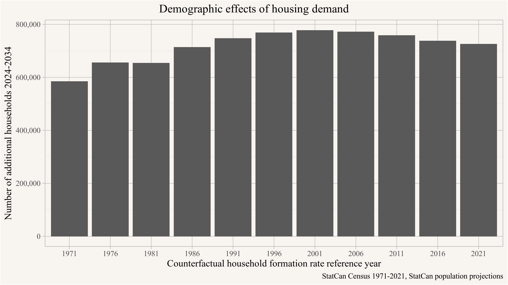

<p style="text-align:center;"><i>(Joint with Nathan Lauster and cross-posted at <a href="https://homefreesociology.com/2025/06/08/metrics-mechanisms-and-mismatch-immigration-and-other-components-of-housing-demand-in-canada/" target="_blank">HomeFreeSociology</a>)</i></p>


::: {.cell}

```{.r .cell-code}
library(tidyverse)
library(canpumf)
library(cansim)
library(mountainmathHelpers)
library(cancensus)
library(tinytable)
library(cmhc)

source(here::here("R/mhr_pumf.R"))
source(here::here("R/mhu.R"))
source(here::here("R/census_import.R"))
```
:::


Last week StatCan published a report on **Housing use of immigrants and non-permanent residents in ownership and rental markets** [@statisticscanada_housing_use.2025]. The report aims to understand the housing consumption of populations in different categories, namely non-permanent residents, immigrants (new and overall), and Canadian-born residents. The data are based on the 2021 Census and used to produce a novel metric in the form of housing occupancy rates for these groups. The goal of the study is to aid "developing effective housing policies and urban planning strategies".

We like adding and thinking through novel housing metrics, so this kind of study is potentially useful. But there are some issues below the surface with how the metric has been thought through in this report that we want to latch on and nit-pick. Partially because we have thought quite a bit about related issues, and partially because the particular problems in the report mirror problems in how we have historically planned for housing, leading right up to our current housing shortages. We want to highlight some of these issues. But we also take this as an opportunity to broaden the scope and look more generally at why it is important to go beyond incorporating population growth when developing housing policies and urban planning strategies, and put some numbers onto different components of latent housing demand and demand growth.

More abstractly, our nit-pick of the study is on two points, one substantive and one petty.

The substantive nit-pick relates to a fairly common approach in descriptive stats where people try to avoid making assumptions. This may be especially relevant when the report is by a national statistical agency that wants to avoid any suspicion of bias. The approach to descriptive analysis we have taken on these pages can be described as a "concept first" approach, where we start by working to define what we're talking about and try to make our assumptions clear, drawing upon causal pathways relevant to the questions we are interested in, and then describing data embedded in that context.[^1] Reasonable people might disagree which is the better way to go about things, but we are [not alone in thinking that "science before statistics" is the more useful approach.](https://bsky.app/profile/dingdingpeng.the100.ci/post/3lqi563mrus23) Whatever your thinking, this post will highlight some differences that arise from choosing between these approaches.

[^1]: This of course does not mean that assumptions can be disconnected from data, rather often this is an iterative process where we check how well our assumptions align with the data and adjust as needed.

The petty nit-pick is of the "your aren't talking about something else that I think you should be talking about" type, taking the report as an excuse to talk about those other things too. What makes it a criticism is that some of the phenomena described in the StatCan report are not causally tied to immigration per se, and are better explained by other mechanisms that impact housing consumption. So thinking through broader processes is helpful even when only interested in a narrow part of housing consumption.

# The StatCan report findings

The report abstract outlines the main findings:

> The analysis of the 2021 Census data shows that immigrants typically exhibit higher housing occupancy in the ownership and rental markets compared with Canadian-born individuals.

While there is a specific technical context in which this statement can be viewed as true, in the context of the aims of the study it is not. As we will explain, this statement is an artifact of not thinking through the underlying mechanisms.

The report continues

> In their initial years after admission, immigrants have lower housing occupancy rates than Canadian-born individuals. Over time, however, their housing occupancy rises significantly, driven by a substantial growth in homeownership—underscoring the lasting impact of immigration on the ownership market.

The first sentence is true, the second one correctly describes an increase in occupancy rates when following immigrants over time, or rather when observing successive immigrant cohorts, but it gets the causal mechanisms wrong in the subsequent explanation. This is a stronger version of what can go wrong when doing "stats without science".

For the rest of the post we will look at these issues in detail.

# Measuring housing consumption

In order to measure the "housing use of immigrants and non-permanent residents" the study aims to estimate "housing unit occupancy rates" which it defines as "the number of dwellings per 1,000 people" for immigrants and NPRs, contrasting these to the occupancy rates for Canadian-born residents.

As the StatCan report points out, this is a question under discussion, and we have done quite similar work in the past to understand how changes in immigration and non-permanent resident intake policies impact housing demand. Only we used PUMF data instead of the full census sample that was used in the StatCan study.

The immediate difficulty with the approach taken by StatCan is that households are complex, and there are many situations where a household mixes members of the three categories; non-permanent residents, immigrants, and non-immigrant Canadians. The study sidesteps this issue by classifying housing consumption at the household level via the immigration status of the "primary household maintainer". The statistics will likely be impacted somewhat by this choice vs other ways to select a representative household person. It would be interesting to look at mixed couples, for instance, to see how (largely arbitrary) reporting of the primary maintainer ends up placing them as immigrants or non-immigrants, but these effects might cancel each other out and could likely be managed [@statisticscanada_maintainers.2024]. To arrive at a *housing occupancy rate* the number of primary household maintainers is then divided by the total number of people (in private households) in each group. This choice of denominator is a potentially bigger problem, as we'll discuss ahead.

To understand how this plays out we reproduce the results of the report using PUMF data in @fig-immigration-status-housing-consumption. For good measure we also add in 2016 data, recognizing that 2021 was a COVID-directed year that experienced significant shocks in the housing market as well as to immigration, and in particular the non-permanent resident and recent immigrant populations.


::: {.cell}

```{.r .cell-code}
young_children <- c("0 to 4 years","5 to 6 years", "7 to 9 years","10 to 11 years","12 to 14 years")
old_children <- c("15 to 17 years", "18 to 19 years")

years <- c("2016","2021")
pumf_data <- years |>
  lapply(\(year)
         get_pumf("Census",year) |> 
           label_pumf_data(rename_columns = FALSE) |>
           mutate(Year=year)) |>
  list_rbind() |>
  mutate(SUBSIDY=recode(SUBSIDY,"No, not a subsidized dwelling"="Not subsidized",
                        "Yes, a subsidized dwelling"="Subsidized")) |>
  mutate(HHTYPE=recode(HHTYPE,
                      "One-census-family household without additional persons: Lone parent family"=
                        "One-census-family household without additional persons: one-parent family",
                      "One-census-family household with additional persons: Lone parent family"=
                        "One-census-family household with additional persons: one-parent family",
                      "Non-census-family household: one-person household"=
                        "Non-census-family households One person household",
                      "Non-census-family household: two-or-more-person non-census-family household"=
                        "Non-census-family household: Two or more person non-census-family household")) |>
  mutate(living_with_parents = CFSTAT %in% c("Child of a couple",
                                             "Child of a lone parent",
                                             "Child of a parent in a one-parent family",
                                             "Person not in a census family but living with other relatives")) |>
  mutate(dependen_child = (AGEGRP %in% young_children) | 
           ((AGEGRP %in% old_children) & living_with_parents & PRIHM!="Person is primary maintainer"))

year_colours <- setNames(sanzo::duos$c114,years)
```
:::

::: {.cell}

```{.r .cell-code}
bind_rows(
  pumf_data |>
    filter(IMMSTAT != "Not available"),
  pumf_data |>
    filter(IMMSTAT != "Not available") |>
    filter(YRIMM %in% c("2011", "2012", "2013", "2014", "2015 to 2016") & Year=="2016" |
             YRIM %in% c("2016", "2017", "2018", "2019", "2020 to 2021") & Year=="2021") |>
    mutate(IMMSTAT=factor("Recent immigrants"))
) |>
  summarize(across(matches("WEIGHT|WT\\d+"),sum),
            .by=c(Year,IMMSTAT,PRIHM)) |>
  pivot_longer(matches("WEIGHT|WT\\d+"),
               names_to="Weight",
               values_to="Count") |>
  mutate(rate=Count/sum(Count)*1000,.by=c(Year,IMMSTAT,Weight)) |>
  filter(PRIHM=="Person is primary maintainer") |>
  ggplot(aes(y=IMMSTAT,x=rate,fill=Year)) +
  geom_col(position="dodge",
           data=~filter(.,Weight=="WEIGHT")) +
  geom_errorbar(position=position_dodge(width = .9),
                width = 0.5,
                data=~summarize(.,
                                q1=quantile(rate,0.1),
                                rate=quantile(rate,0.5),
                                q9=quantile(rate,0.9),
                                .by=c(Year,IMMSTAT)),
                aes(xmin=q1,xmax=q9)) +
  geom_text(aes(label=scales::comma(rate,accuracy=1),x=x),
            hjust=1.3,size=3,
            position=position_dodge(width = .9),
            data=~filter(.,Weight=="WEIGHT") |> mutate(x=50)) +
  scale_fill_manual(values=year_colours) +
  guides(fill=guide_legend(reverse = TRUE)) +
  labs(title="Housing occupancy by immigration status",
       y=NULL,x="Number of housing units occupied per 1,000 people",
       caption="StatCan Cenusus 2016, 2021 PUMF (individuals)")
```

::: {.cell-output-display}
{#fig-immigration-status-housing-consumption fig-pos='H'}
:::
:::


These numbers are in line with the StatCan report derived from the full sample, and we added error bars to reflect uncertainty from drawing from the PUMF subsample (assuming no other measurement problems). Of note, patterns for 2021 are relatively similar to 2016, except for recent immigrants, where we might be seeing a Covid effect worth returning to.

In the meantime, let's talk about the metric. The denominator here causes a number of issues that are likely to impact the results. The report mentions a particular issue arising from the non-uniformity of households, where household members span several immigration categories. In particular the report draws attention to the prevalence of Canadian-born children in immigrant households. These children, like all children under the age of 15 (and most children under the age of 20), don't show up as household maintainers, so they don't count into numerators of these ratios. However these children do show up in the denominator -- but for the Canadian born population. In effect, the measure inherently strips away the Canadian born status of children of immigrants in the numerator, identifying their status with the primary householder. But the status is reapplied to these children in the denominator. This treatment of children inherently biases the housing occupancy measure upward for immigrants and downward for the Canadian born.

The StatCan study argues that using Canadian-born children of immigrants as part of the denominator for Canadian-born population makes sense because it "*aligns with the study’s objective of estimating the housing units needed to 'absorb' a specific number of immigrants*". But this logic is flawed on three accounts. For one it implicitly claims that children of immigrants aren't causally tied to immigrants. Elementary school biology tells us this is wrong, and we should put "science before statistics" and use that knowledge.[^2]

[^2]: It might be correct to treat the children this way if all or the vast majority of Canadian-born children living in immigrant households were adopted, but this is clearly an unreasonable assumption.

The second issue is that [children under 15 by definition cannot be "household maintainers" in Canadian data](https://www12.statcan.gc.ca/census-recensement/2021/ref/dict/az/definition-eng.cfm?ID=households-menage008), so the ratio constructed in the StatCan report compares statistics taken from two different populations. If children under 15 are mechanically excluded from the numerator, why include them in the denominator? The report does not address this question, and this again is a question that can only be resolved by properly conceptualizing the underling mechanisms when constructing metrics.

The third issue is related and comes with the failure to think more broadly about the metric in the context of the report's aims and guiding questions. To understand how to construct a useful metric we need to think about how people consume housing. Children might reasonably be considered housing consumers within their homes, but they're not independent consumers of homes. In other words, children take up space and are often given their own room. So thinking about children's housing consumption as distinct from adults makes sense if we're thinking about housing in terms of rooms, or floor space. But if we're just thinking about housing consumption in terms of who consumes an independent dwelling as a unit of housing, as adopted in the metric at hand, then children just shouldn't count. Children's consumption of independent dwellings is effectively zero in Canada. Dependent children are broadly seen as not taking up additional housing units but being part of the housing unit the parents occupy. This is what motivates the StatCan definition of Household Maintainer to be restricted to the population aged 15 years or older as a hard cutoff, but in practice the issue goes beyond that.

Nobody would expect a 15 or 16 year old to be a household maintainer. At age 17 (in early May) we might run into edge cases, especially with children attending post-secondary programs and living alone or in other living arrangements away from their family home. But even here they often won't be recorded as such by the Census. Realistically speaking we only expect to see measurable impacts of independent housing consumption around age 18, especially picking up children at the end of their first year in university or other training. For the purpose of the report a useful compromise might be to set the cutoff at the age of 20, but still include the few cases of people below that age who aren't identified as living with their parents (or grandparents).[^3]

[^3]: There is an argument to be made to bump that up to 25, given how the census codes children attending post-secondary education often as living with their parents even if they live elsewhere during the regular semester. For reference, in recognition of the complexities of transition to adulthood and independence, the [BC government](https://news.gov.bc.ca/releases/2024CFD0004-000480) now supports children in care to live with foster families up to age 19, and provides further support to transition up to age 27.

Thinking through how household formation, and the consumption of housing functions in Canada (as measured in number of housing units) leads us to exclude dependent children below some age from the metric as they are generally not seen as being part of the demand for dwelling units. @fig-immigration-status-housing-consumption-no-children shows the impact when removing dependent children under the age of 20 from the metric.[^4]

[^4]: To be precise, we removed all children under the age of 15, and people under the age of 20 if they lived with parents or other relatives and were not flagged as primary household maintainer.


::: {.cell}

```{.r .cell-code}
housing_demand_no_children <- bind_rows(
  pumf_data |>
    filter(IMMSTAT != "Not available"),
  pumf_data |>
    filter(IMMSTAT != "Not available") |>
    filter(YRIMM %in% c("2011", "2012", "2013", "2014", "2015 to 2016") & Year=="2016" |
             YRIM %in% c("2016", "2017", "2018", "2019", "2020 to 2021") & Year=="2021") |>
    mutate(IMMSTAT=factor("Recent immigrants"))
) |>
  filter(PRIHM!="Not applicable") |>
  filter(!dependen_child) |>
  summarize(across(matches("WEIGHT|WT\\d+"),sum),
            .by=c(Year,IMMSTAT,PRIHM)) |>
  pivot_longer(matches("WEIGHT|WT\\d+"),
               names_to="Weight",
               values_to="Count") |>
  mutate(rate=Count/sum(Count)*1000,.by=c(Year,IMMSTAT,Weight)) |>
  filter(PRIHM=="Person is primary maintainer")

housing_demand_no_children |> 
  ggplot(aes(y=IMMSTAT,x=rate,fill=Year)) +
  geom_col(position="dodge",
           data=~filter(.,Weight=="WEIGHT")) +
  geom_errorbar(position=position_dodge(width = .9),
                width = 0.5,
                data=~summarize(.,
                                q1=quantile(rate,0.1),
                                rate=quantile(rate,0.5),
                                q9=quantile(rate,0.9),
                                .by=c(Year,IMMSTAT)),
                aes(xmin=q1,xmax=q9)) +
  geom_text(aes(label=scales::comma(rate,accuracy=1),x=x),
            hjust=1.3,size=3,
            position=position_dodge(width = .9),
            data=~filter(.,Weight=="WEIGHT") |> mutate(x=50)) +
  scale_fill_manual(values=year_colours) +
  guides(fill=guide_legend(reverse = TRUE)) +
  labs(title="Housing occupancy by immigration status",
       y=NULL,x="Number of housing units occupied per 1,000 population\n(excluding dependent children under 20 years old)",
       caption="StatCan Cenusus 2016, 2021 PUMF (individuals)")
```

::: {.cell-output-display}
{#fig-immigration-status-housing-consumption-no-children fig-pos='H'}
:::
:::


This simple adjustment pushes the housing consumption of Canadian born residents above that of immigrants, falling back in line with general expectations. In effect, we can see that the seeming immigrant overconsumption of housing is a simple artifact of choices about measurement. This is acknowledged in the report, but not fully carried through in terms of its implications, especially regarding later comparisons.

The adjustment also widens the gap between non-permanent residents and immigrants as well as Canadian-born residents, again in line with expectations. To return to the difference between results for recent immigrants in 2016 relative to 2021, its worth keeping in mind that Canada experienced a dramatic drop in immigration in 2020. This means the category of Recent Immigrants (arriving within the last five years) was more heavily weighted by those who had been in Canada longer in 2021. Recent immigrants coming in at essentially the same (for 2021) or slightly lower consumption rate than non-permanent residents (for 2016) is curious. This may speak to aspects of both selection and transitions between groups, but also to choice of household reference person. Let's look at this a bit more in-depth.

We can provide a first-hand example of transitions between groups. One of us arrived as a solo NPR with an individual housing occupancy rate of 1. Then we applied for permanent residence as an immigrant and partnered up with another NPR turned immigrant to reach a housing occupancy rate of 0.5. This offers a clear illustration of how immigrants might end up with lower housing occupancy than NPRs. Carrying the example forward, we then had two children. It would make sense if this dropped our housing occupancy rate to 0.25 (four people living in a single dwelling). But since we were immigrants and the children were born in Canada, they don't count toward our housing occupancy. Instead they somehow count toward lowering the housing occupancy of Canadian born primary household maintainers writ large. In addition to providing a potential explanation for the drop in consumption between NPR and recent immigrants rooted in transitions, the anecdote here demonstrates how the metric at hand ultimately fails to scale to the individual level - illustrating how and why the StatCan version doesn't make sense. But can we do more with the Census data at hand?

The finer breakdowns below and the following analysis sheds some light onto further potential explanations for differences and we will see that to a large extent they are also a product of immigrant selection mechanisms. In this context it's good to remember that the census [has difficulty capturing non-permanent residents](https://www12.statcan.gc.ca/census-recensement/2021/ref/98-303/index-eng.cfm), generally picking up only around 50% of the non-permanent resident population. NPR's ties to Canada can be quite fluid, and they may not recognize that they have to fill out the census. There is reason to suspect that under-coverage for international students and temporary foreign workers is especially high, and that their housing consumption is especially low. Additionally, temporary foreign workers in collective housing, as is often the case for farm workers, are not covered in either the StatCan study nor in the PUMF data we used. In summary, there is good reason to suspect that housing occupancy rates of the non-permanent residents captured in the census significantly over-estimate the occupancy rates of the overall non-permanent resident population in Canada.

We can expand on the immigrant categories slightly by using the full range provided in the PUMF data in @fig-immcat5-consumption. Of note, admission categories are only collected for immigrants who landed after 1980, providing us the extra general purpose category of immigrants landing prior to this time.


::: {.cell}

```{.r .cell-code}
pumf_data |>
  filter(IMMCAT5 != "Not available") |>
  filter(!dependen_child) |>
  filter(PRIHM!="Not applicable") |>
  summarize(across(matches("WEIGHT|WT\\d+"),sum),
            .by=c(Year,IMMCAT5,PRIHM)) |>
  pivot_longer(matches("WEIGHT|WT\\d+"),
               names_to="Weight",
               values_to="Count") |>
  mutate(rate=Count/sum(Count)*1000,Total=sum(Count),.by=c(Year,IMMCAT5,Weight)) |>
  filter(PRIHM=="Person is primary maintainer") |>
  ggplot(aes(y=IMMCAT5,x=rate,fill=Year)) +
  geom_col(position="dodge",
           data=~filter(.,Weight=="WEIGHT")) +
  geom_errorbar(position=position_dodge(width = .9),
                width = 0.5,
                data=~summarize(.,
                                q1=quantile(rate,0.1),
                                rate=quantile(rate,0.5),
                                q9=quantile(rate,0.9),
                                .by=c(Year,IMMCAT5)),
                aes(xmin=q1,xmax=q9)) +
  geom_text(aes(label=scales::comma(rate,accuracy=1),x=x),
            hjust=1.3,size=3,
            position=position_dodge(width = .9),
            data=~filter(.,Weight=="WEIGHT") |> mutate(x=50)) +
  scale_fill_manual(values=year_colours) +
  guides(fill=guide_legend(reverse = TRUE)) +
  labs(title="Housing occupancy by immigration status",
       y=NULL,x="Number of housing units occupied per 1,000 population\n(excluding dependent children under 20 years old)",
       caption="StatCan Cenusus 2016, 2021 PUMF (individuals)")
```

::: {.cell-output-display}
{#fig-immcat5-consumption fig-pos='H'}
:::
:::


Here we can see curiously high housing consumption for immigrants that landed before 1980, as well as interesting consumption patterns across the other immigrant categories. In particular refugees appear to consume more housing than economic immigrants, and almost as much housing as non-immigrants. To understand what's going on here again leads us to go beyond just looking at frequencies but also to pay attention to the data generation process. Refugees interact with housing in different ways from other groups, and that's important to understand.


# Policy-relevant analysis

This gets us to the main part of our post; how can we make data analysis policy relevant? Descriptive analysis that looks at frequencies, how people currently use housing, is a useful starting point, but it falls short of being useful for guiding policy.

For descriptive analysis the first question is how the metrics used align with the question one is interested in. In this case the question of interest is housing consumption, in terms of number of housing units, by various groups. The metric is occupancy rates, as defined by number of household maintainers in a given group divided by total population in that group. And the goal of the exercise is to guide policy intervention, which means we can't avoid thinking about things causally. It's not enough to just report frequencies observed in the data, we need to pay attention to the causal structure guiding how population interacts with housing. Failing to do so will likely lead to misguided policy.

So what does paying attention to the causal structure mean? Several things.

As already discussed above, we should remove dependent children from this denominator since they aren't viewed as requiring independent housing in the Canadian context. Moreover in the data source at hand children under 15 aren't even eligible to be part of the numerator population, calling into question the meaning and usefulness of the ratio. Our choice to drop dependent children under 20 from the denominator is just one of many that could be used to build a better metric here.

More broadly, analysis all too often simply draws upon present frequencies and projects them into the future. In the context of housing this plays a large part in our accumulated housing shortage, where policy makers have interpreted observed housing consumption rates as revealed preference instead of as constrained choices reflecting limitations on available housing stock. Very little attention has been paid to the drivers of household formation and housing consumption. This includes demographic factors, but also income and wealth. Ignoring these drivers of demand helps explain the past 50 years of failure to increase housing supply to match increased demand. [@planning-for-scarcity.2022] The report acknowledges that, noting that the housing occupancy rates "reflect housing use constrained by factors such as financial resources, living preferences and housing supply availability", but the report fails to incorporate that knowledge into the analysis.

The curious differences in housing consumption across various groups in @fig-immcat5-consumption are entirely driven by features of the data generation process that we have thus far ignored. It's useful to go back to first principles and understand what drives household formation. As we have explained in the past, this is mostly driven by age, income and wealth, as well as couple status of the individual, set against the cost of housing at the regional level. [@housing_shortages_doubled_up_households.2024; @mhu.2025] Immigrants who landed before 1980 distinguish themselves from the other groups most obviously by age, and the high housing consumption is a reflection of that, as opposed to a particular feature of their immigrant status. Similarly, the StatCan report breaks out statistics for recent immigrants, which tend to be younger. Their registering with a lower housing occupancy rate is again at least partially driven by age - as opposed to their immigration status - although income plays another role and it's an unfortunate reality that labour force integration of recent immigrants is slow in Canada, leading to lower incomes, even for economic immigrants selected for by their skill level.


::: {.cell}

```{.r .cell-code}
subsidized_breakdown <- pumf_data |>
  filter(IMMCAT5 != "Not available") |>
  filter(!dependen_child) |>
  filter(PRIHM!="Not applicable") |>
  summarize(across(matches("WEIGHT|WT\\d+"),sum),
            cases=n(),
            .by=c(Year,IMMCAT5,PRIHM,SUBSIDY)) |>
  pivot_longer(matches("WEIGHT|WT\\d+"),
               names_to="Weight",
               values_to="Count") |>
  mutate(rate=Count/sum(Count)*1000,.by=c(Year,IMMCAT5,Weight,SUBSIDY)) |>
  filter(PRIHM=="Person is primary maintainer") |>
  filter(SUBSIDY != "Not available") |>
  mutate(s_share=Count/sum(Count),.by=c(Weight,IMMCAT5,Year))

subsidized_summary <- subsidized_breakdown |>
  filter(Weight=="WEIGHT",SUBSIDY == "Subsidized") |>
  select(Year,name=IMMCAT5,value=s_share) |>
  pivot_wider()

refugee_vs_economic <- subsidized_summary |>
  filter(Year=="2021") |>
  mutate(ratio=Refugees/`Economic immigrants`) |>
  pull(ratio)
refugee_vs_canadian <- subsidized_summary |>
  filter(Year=="2021") |>
  mutate(ratio=Refugees/`Non-immigrants`) |>
  pull(ratio)
```
:::


For refugees the mechanism governing their housing consumption is quite different. Refugees in Canada disproportionately live in subsidized housing, at a rate 4.9 times higher that of economic immigrants and 3 times that of of Canadian-born householders. Subsidized rents, along with rules frequently preventing the sharing of non-market housing, mean refugees don't double up as often as other people do in the market. Once we consider ratios of those in subsidized and non-subsidized (and ownership) housing separately, the distinct effect observed for refugees basically disappears, as shown in @fig-subsidy-consumption.


::: {.cell}

```{.r .cell-code}
subsidized_breakdown |> 
  mutate(SUBSIDY=recode(SUBSIDY,"Not applicable"="Owner","Not subsidized"="Market rental","Subsidized"="Subsidized rental")) |>
  #filter(cases>500) |>
  ggplot(aes(y=IMMCAT5,x=rate,fill=Year)) +
  geom_col(position="dodge",
           data=~filter(.,Weight=="WEIGHT")) +
  geom_errorbar(position=position_dodge(width = .9),
                width = 0.5,
                data=~summarize(.,
                                q1=quantile(rate,0.1),
                                rate=quantile(rate,0.5),
                                q9=quantile(rate,0.9),
                                .by=c(Year,IMMCAT5,SUBSIDY)),
                aes(xmin=q1,xmax=q9)) +
  geom_text(aes(label=scales::comma(rate,accuracy=1),x=x),
            hjust=0,size=3,
            position=position_dodge(width = .9),
            data=~filter(.,Weight=="WEIGHT") |> mutate(x=50)) +
  scale_fill_manual(values=year_colours) +
  guides(fill=guide_legend(reverse = TRUE)) +
  facet_wrap(~SUBSIDY) +
  labs(title="Housing occupancy by immigration status and subsidized housing status",
       y=NULL,x="Number of housing units occupied per 1,000 people\n(excluding dependent children under 20 years old)",
       caption="StatCan Cenusus 2016, 2021 PUMF (individuals)")
```

::: {.cell-output-display}
{#fig-subsidy-consumption fig-pos='H'}
:::
:::


That's not to say that, for the purpose of estimating the housing consumption of future refugees, the crude rates aren't useful. They can be, and here they're likely a decent estimate for the expected housing consumption under our current housing system. But peeling back the layers of how and why these occupancy ratios come about helps understand how things fit together, highlighting the role, for instance, of the subsidized housing sector. And that's especially important for policy considerations of how you might want to change the current housing system.

# Age

Age is a major factor in determining household formation. For the purpose of understanding the immediate impact of immigrants and non-permanent residents on housing consumption this is not important, but it is if one wants to understand processes over a longer period of time. The StatCan report examines how different immigrant cohorts (by year of immigration) consume housing by tenure. The report frames this as studying trends of immigrants over time, which requires strong additional assumptions about housing markets and immigrant populations remaining comparable over time. There's no reason to believe these assumptions are reasonable.[^5]

[^5]: In fact, in the report StatCan does point out that they are making an assumption here and compare of recent immigrants over the past several censuses as a sanity check. But the housing occupancy rates they list show a huge variation in occupancy rates of recent immigrants, with 261 units per 1000 residents in 2001 increasing to 464 in 2021, directly contradicting their assumption, but fitting well with interpretations of many recent migrants from China as homemaking migrants [@lauster2017labor].

The report goes on to explain the increase in occupancy rates they observe for older immigrant cohorts as follows:

> Newcomers tend to have larger households, often living with extended family members such as parents and grandparents, to reduce costs and address economic constraints. As immigrants settle, household sizes typically decrease because of children moving out, increased economic stability and adaptation to Canadian norms of nuclear families.

The report gives no evidence to the interpretation that newcomer's "living with extended family members such as parents and grandparents" is responsible for the observed patterns, and the framing suggests a naive understanding on how people in Canada live together in households. A quick check in the data as done in @fig-multi-family-immigrant shows that while around 10% of recent immigrants live in multi-family households, which includes multi-generational households, this share is fairly low and does not change much across immigrant cohorts until very far back in time when it becomes important to account for aging and mortality.


::: {.cell}

```{.r .cell-code}
pumf_data |>
  filter(IMMSTAT == "Immigrants") |>
  mutate(imm_year = coalesce(YRIMM,YRIM)) |>
  filter(imm_year!="Not available") |>
  mutate(yy=str_extract(imm_year,"\\d{4}$") |> as.integer()) |>
  mutate(imm_year=fct_reorder(imm_year,yy)) |>
  filter(HHTYPE!="Not available") |>
  filter(imm_year!="Not available") |>
  summarize(across(matches("WEIGHT|WT\\d+"),sum),.by=c(HHTYPE,Year,imm_year)) |>
  pivot_longer(matches("WEIGHT|WT\\d+"),
               names_to="Weight",
               values_to="Count") |>
  mutate(Share= Count/sum(Count),.by=c(Year,imm_year,Weight)) |>
  filter(HHTYPE=="Multiple-census-family household") |>
  ggplot(aes(x=imm_year,y=Share,fill=Year)) +
  geom_col(position="dodge",data=~filter(.,Weight=="WEIGHT")) +
  geom_errorbar(position=position_dodge(width = .9),
                width = 0.5,
                data=~summarize(.,
                                q1=quantile(Share,0.1),
                                Share=quantile(Share,0.5),
                                q9=quantile(Share,0.9),
                                .by=c(Year,imm_year,HHTYPE)),
                aes(ymin=q1,ymax=q9)) +
  facet_wrap(~Year,ncol=1,scales="free_x") +
  scale_fill_manual(values=year_colours,guide = "none") +
  scale_y_continuous(labels=scales::percent) +
  theme(axis.text.x = element_text(angle=45,hjust=1)) +
  labs(title="Immigrants in multi-family households",
       y="Share of immigrants by preriod of immigration",
       x="Period of immigration",
       caption="StatCan Cenusus 2016, 2021 PUMF (individuals)")
```

::: {.cell-output-display}
{#fig-multi-family-immigrant fig-pos='H'}
:::
:::


In @fig-immigrant-household-type we complement this by looking at all household living arrangements of recent immigrants (within the past 5 years) compared to that of immigrants who landed 10 to 15 years ago.


::: {.cell}

```{.r .cell-code}
recent_immigrants <- pumf_data |>
  mutate(recent_immigrant = case_when(
    YRIMM %in% c("2015 to 2016") | YRIM %in% c("2020 to 2021") ~ "Recent immigrants",
    YRIMM %in% c("2001","2002","2003","2004","2005") | YRIM %in% c("2006","2007","2008","2009","2010") ~ 
      "Immigrated 10-15 year ago",
    #IMMSTAT == "Non-immigrants" ~ "Canadian born",
    TRUE ~ "Else"
  ))

recent_immigrants |>
  filter(recent_immigrant!="Else",
         HHTYPE!="Not available") |>
  summarize(across(matches("WEIGHT|WT\\d+"),sum),.by=c(HHTYPE,Year,recent_immigrant)) |>
  pivot_longer(matches("WEIGHT|WT\\d+"),
               names_to="Weight",
               values_to="Count") |>
  mutate(Share= Count/sum(Count),.by=c(Year,recent_immigrant,Weight)) |>
  ggplot(aes(y=fct_rev(HHTYPE),x=Share,fill=Year)) +
  geom_col(position="dodge",data=~filter(.,Weight=="WEIGHT")) +
  geom_errorbar(position=position_dodge(width = .9),
                width = 0.5,
                data=~summarize(.,
                                q1=quantile(Share,0.1),
                                Share=quantile(Share,0.5),
                                q9=quantile(Share,0.9),
                                .by=c(Year,recent_immigrant,HHTYPE)),
                aes(xmin=q1,xmax=q9)) +
  scale_fill_manual(values=year_colours) +
  facet_wrap(~recent_immigrant) +
  scale_x_continuous(labels=scales::percent) +
  theme(legend.position = "bottom") +
  labs(title="Living arrangements of select immigrant cohorts",
       y=NULL,x="Share in living arrangement",
       caption="StatCan Cenusus 2016, 2021 PUMF (individuals)")
```

::: {.cell-output-display}
{#fig-immigrant-household-type fig-pos='H'}
:::
:::


This shows that there are many ways that people double up besides in multi-family households. Indeed roommate households, as captured in the last category, exceed multi-family households as a category containing recent immigrants in 2021. The share living in couple and couple with children households without additional persons are both larger for the cohort that immigrated 10-15 years ago compared to the one that immigrated in the year and a bit before the census, demonstrating the further moves toward partnering and childbearing that we expect to see with all populations as they age and settle into their lives, including their careers.

With some understanding of these processes we can now broaden our view on housing demand from other factors, beyond the addition of immigrants and net NPRs. This brings us to the second stage of this post, after which we will return to the question of changes in housing occupancy rates of subsequent immigrant cohorts and will be able to properly interpret these changes.

# Existing housing shortfall, demographic effects, income growth, and population growth

For housing policy and planning purposes we need to understand all processes that impact our housing market. In media and public discussions there has been a lot of emphasis on the housing consumption of immigrants and non-permanent residents, but comparatively little on other factors contributing to our housing pressures.

Taking a more comprehensive view on this is a difficult task, and in the following we will heavily rely on previous work we have done. We also want to point out that the estimates come with varying degrees of uncertainty, in particular when it comes to estimating the existing housing shortfall. The goal of this section is less to provide an exact number for housing demand but to provide a broad overview of the factors that make up that demand, and ballpark estimates of the constituent components that are suitable for judging their relative size.

## Existing housing shortfall

We start with the existing housing shortfall because it's a key ingredient in understanding the housing need for all other factors. The existing housing shortfall impacts how people distribute over housing. In particular, the housing occupancy rates we observed in the StatCan report and in the analysis above are impacted by existing housing shortages. The StatCan report acknowledges this in the first paragraph of their abstract: "*These rates reflect housing use constrained by factors such as financial resources, living preferences and housing supply availability.*" Taking these rates observed under housing scarcity to plan for future housing need implicitly encodes the value statement that our current housing shortfall is good and we should plan for continued housing scarcity. By contrast, only after understanding and taking account of our current housing shortfall can we plan adequately for future growth.

Making sense of the concept of "housing shortfall" requires a clear counterfactual scenario. In their Supply Gap work CMHC asks how much more housing is needed to restore affordability to 2004 levels. [@cmhc_supply_2022; @cmhc_supply_2023] Mike Moffatt asks how much housing is needed to bring household formation to the level seen outside of Ontario and British Columbia (The Rest of Canada, ROC metric). [@moffatt_2022] We have looked at differences in household composition across metro areas [@what-s-a-household.2017], using household formation rates in metro Montréal and Québec City as counterfactuals, and also considering historic changes in household formation rates and counterfactual scenarios to restore household formation to that seen in earlier years [@estimating-suppressed-household-formation.2022; @still-short-suppressed-households-in-2021.2022]. We have also drawn upon and advanced the concept of Minimum Household Units to derive counterfactual scenarios [@housing-outcomes.2023; @housing_shortages_doubled_up_households.2024; @mhu.2025] as well as considering family units. [@doubling-up-distinguishing-families-from-households.2024] In a further scenario we estimate how much housing the market could profitably build as the counter-factual housing shortfall. [@housing-targets.2023]

All these methods have advantages and disadvantages, and the size of the estimated shortfall critically depends on the choice of counterfactual scenario and its underlying assumptions. Additionally there are questions at what geographic levels these estimates should be estimated. Some regions, for example the Québec City metro area, have seen increased household formation over time driven by rising incomes and a housing supply that kept pace with demand. In this case, applying historic rates of doubling up would worsen housing outcomes. The geographically heterogeneous nature of housing outcomes, and how they evolve over time, requires delicate considerations for how to aggregate shortfall estimates up to the national level. Local differences in housing shortage also haunt the analysis of differences in the housing occupancy of immigrants, as we will see ahead.


::: {.cell}

```{.r .cell-code}
shortfall_low <- 1100000
shortfall_high <- 2500000
```
:::


We are separating out the work to give an overview of how these different methods to estimate housing shortfall fit together into a separate post. Suffice to say, depending on the choice of method, the existing housing shortfall estimate for 2021 can range from around 1,100k to over 2.5M housing units. These correspond to roughly setting national household formation rates equal to those observed in Montréal and Québec in 2021, respectively. An upper limit would be to provide enough housing to eliminate all doubling up, which would yield an additional 4.4M households.

These are estimates for the housing shortfall in 2021, it's 4 years later now and the shortfall may well have changed. Given the large range of shortfall estimates based on different methods, the 4 year gap in estimates is probably not the biggest problem and we are just going to keep these fixed for now. Doing further work on shortfall estimates, like CMHC is already doing when they are updating their supply gap model, but also complementing this with alternative counterfactual scenarios and methods to derive more up-to-date estimates, would be very useful and worthwhile to invest time in.

## Demographic effects

Canada's population is ageing, and older people tend to consume more housing in terms of number of housing units. This leads to an increase of housing demand from demographic drivers alone. We have looked into the underlying processes in detail in the past. [@estimating-suppressed-household-formation.2022; @housing-outcomes.2023; @still-short-suppressed-households-in-2021.2022; @tenure-and-household-independence-across-the-life-course-1981-2021.2024; @housing_shortages_doubled_up_households.2024; @mhu.2025]

We can estimate the demographic effect on housing demand by taking StatCan population projections by age that already include mortality effects, and apply age-specific household maintainer rates from a fixed year. This translates population into age-expected households, and we can split these expected households into changes in household size and changes in population growth. The change in household size is the demographic effect, that we can then express in terms of additional households formed, assuming households form at the same rate as they did in the reference year. @fig-demographic-contribution shows the resulting demographic contribution to housing demand based on a range of reference years used for the underlying age-specific household formation rates.


::: {.cell}

```{.r .cell-code}
hmr_all <- simpleCache(get_phm_timeline(),"hmr_data_all.rds",path=here::here("data"),refresh=FALSE)

census_base <- seq(2006,2021,5) |>
  as.character() |>
  map_df(\(y){
    provinces <- get_census(y,regions=list(C="01"),level="PR") |>
      select(Region=`Region Name`,GeoUID,Population,Households,Dwellings) |>
      mutate(Region=gsub(" \\(.+","",Region)) |>
      mutate(Year=y) 
    
    cmas <- get_census(y,regions=list(CMA=c("59933","35505","24505","35535","24462","48825","48835"))) |>
      select(Region=`Region Name`,GeoUID,PR_UID,Population,Households,Dwellings) |>
      mutate(Region=gsub(" \\(.+","",Region)) |>
      mutate(Year=y) |>
      mutate(PR_UID=coalesce(PR_UID,substr(GeoUID,1,2)))
    
    stopifnot(nrow(cmas)==7)
    
    bind_rows(provinces,cmas |> 
                mutate(GeoUID=PR_UID) |>
                select(-Region) |>
                left_join(provinces |> select(Region,GeoUID),by="GeoUID") |>
                mutate(across(c(Population,Households,Dwellings),~-.x))) |>
      mutate(Region=case_when(GeoUID %in% unique(cmas$PR_UID) ~ paste0("Rest of ",Region), TRUE ~ Region)) |>
      bind_rows(cmas) |>
      summarize(across(c(Population,Households,Dwellings),sum),.by=c(Region,Year)) 
  }) |>
  mutate(Region=recode(Region,"Ottawa - Gatineau"="Ottawa – Gatineau"))

pop_projections <- get_cansim_connection("17-10-0057",refresh="auto") |>
  filter(Gender=="Total - gender",
         `Projection scenario`=="Projection scenario M1: medium-growth",
         GEO=="Canada") |>
  collect_and_normalize()

hmr_canada <- hmr_all  |>
  mutate(AGEGRP=recode(AGEGRP,"85 years ond over"="85 years and over",
                       "18 to 19 years"="15 to 19 years",
                       "15 to 17 years"="15 to 19 years")) |>
  summarize(Count=sum(Count),.by=c(Year,AGEGRP,PRIHM)) |>
  mutate(hmr=Count/sum(Count),Total=sum(Count),.by=c(Year,AGEGRP)) |>
  filter(PRIHM) |>
  filter(AGEGRP !="Not available")

pop_projections_match <- pop_projections %>%
  filter(`Age group` %in% categories_for_level(.,"Age group", 2)) |>
  mutate(`Age group`=recode(`Age group`,
                            "100 years and over"="85 years and over",
                            "85 to 89 years"="85 years and over",
                            "90 to 94 years"="85 years and over",
                            "95 to 99 years"="85 years and over")) |>
  summarize(value=sum(val_norm),.by=c(`Age group`,Date)) |>
  mutate(`Age group`=droplevels(`Age group`))

hh_sizes <- pop_projections_match |>
  left_join(hmr_canada |>  
              select(Year,`Age group`=AGEGRP,hmr) |>
              complete(Year,`Age group`=levels(pop_projections_match$`Age group`),fill=list(hmr=0)) |>
              mutate(`Age group`=factor(`Age group`,levels=levels(pop_projections_match$`Age group`))),
            by="Age group",relationship = "many-to-many") |>
  mutate(hh=hmr*value) |>
  summarize(hh=sum(hh),
            pop=sum(value),
            .by=c(Date,Year))


hh_contribution <- hh_sizes |>
  filter(Date %in% c("2024-07-01","2034-07-01")) |>
  mutate(hhsize=pop/hh,
         ratio=hh/pop) |>
  mutate(gap=ratio-lag(ratio,order_by = Date),
         .by=Year) |>
  filter(Date=="2034-07-01") |>
  mutate(hhgap=gap*pop)
```
:::


::: {.cell}

```{.r .cell-code}
demographic_growth <- hh_contribution$hhgap |> mean()
hh_contribution |>
  ggplot(aes(x=Year,y=hhgap)) +
  geom_col() +
  scale_y_continuous(labels=scales::comma) +
  labs(title="Demographic effects of housing demand",
       y="Number of additional households 2024-2034",
       x="Counterfactual household formation rate reference year",
       caption="StatCan Census 1971-2021, StatCan population projections")
```

::: {.cell-output-display}
{#fig-demographic-contribution fig-pos='H'}
:::
:::


In summary, we should expect around 720,000 households to form over the next 10 years just based on the demographic shifts associated with an aging population. These estimates are taken at the national level, so this likely under-estimates the actual demand by mixing areas where household formation has increased with those where household formation has decreased. And housing consumption is sticky; older population have seen increased housing consumption even when younger populations have seen theirs deteriorate. A more careful analysis would follow cohorts and likely arrive at a higher estimate. [@housing-outcomes.2023; @tenure-and-household-independence-across-the-life-course-1981-2021.2024] But this will suffice as a rough estimate.

## Income growth

Income growth is a key driver of housing consumption. Rich people, counting both income and wealth, consume more housing. This manifests itself in nicer and larger dwellings, but also in consuming more overall housing units. These additional housing units can take the form of vacation homes. But more importantly for our purposes, higher income increases household formation by children moving out of their parent's place earlier, leaving roommate setups earlier, splitting up multi-generational households into nearby independent dwelling units, and people generally doubling up at lower rates. When rising incomes are not met with increased housing supply this can, perversely, lead to decreased affordability at the lower end of the income spectrum.

Consider the case when a population and its demographic structure stays fixed, and housing supply also remains fixed, but incomes rise. Income effects are heterogeneous, triggering increased household formation for those who see income boosts. Since the housing stock is fixed, by the pigeonhole principle this increased household formation has to be matched by increased doubling up further down the (new) income spectrum. The aggregate change to affordability depends on the relative sizes of the demand elasticity of household formation and the price elasticity to income. These elasticities are difficult to estimate and the relative sizes likely depend on the particularities of housing markets, but some researchers have estimated that in aggregate rising incomes on the backdrop of a fixed housing supply lead to decreased aggregate affordability. [@meen2008] The effects of income on demand only further emphasize how freezing housing supply is bad.


::: {.cell}

```{.r .cell-code}
fudge_factor <- 1/1.75
rent_elasticity <- 0.04
income_to_rent_elasticity <- 0.1
income_elasticity=income_to_rent_elasticity*rent_elasticity
income_elasticity_f=income_elasticity*fudge_factor
income_growth <- 2^(1/50)-1
household_growth_income_f <- income_elasticity_f*income_growth*100
household_growth_income_f_10 = (household_growth_income_f+1)^10 -1
additional_hh <- household_growth_income_f_10 * hh_sizes |> 
  filter(Date=="2034-07-01") |>
  summarize(hh_mean=mean(hh),hh_max=max(hh),hh_min=min(hh)) |>
  pull(hh_mean) 
```
:::


We have done some work to estimate the impact of income growth on housing demand, but have not explicitly solved for this. For key household formation age groups the impact of income on household formation, controlling for couple status and age, and with it age-related increases in income, is about 0.1 times that of rent, with the opposite sign.[^6] [@mhu.2025] This means that in the Vancouver setting a 1% increase in real incomes results to an increase in household demand by about 0.4%. For all of Canada this is likely an over-estimate, and assuming the housing shortfall is reduced in Vancouver, it would also reduce Vancouver's elasticity. A back of the envelope guesstimation suggests that maybe reducing this by a factor of 1.5 or even 2 might give a reasonable ballpark estimate. For the sake of this post we will use a fudge factor of 1.75 to reduce the elasticity to 0.2%.

[^6]: This is not the total effect of income, but only the portion not explained by couple status and age. There are some caveats in that it's not clear how well these effects can be separated, but in our setup where we treat demographic effects separately and considering this partial effect avoids double-counting. An alternative approach would be to re-structure the estimates to prioritize the total effect of income and then consider the residual impact of age and coupling up on household formation.

Historically real age-adjusted family incomes in Canada have grown by about 1.4% per year, so we can expect, including our fudge factor, a 0.32% increase in household demand per year, or about 3.2% over the next decade. Using this ballpark estimate, that results in demand for roughly an additional 620,000 households from income growth as a ballpark estimate. Overall, the impact of income growth on housing demand remains under-studied and could use further research.

## Population growth


::: {.cell}

```{.r .cell-code}
housing_demand_no_children_rates <- housing_demand_no_children |>
  filter(Weight=="WEIGHT",Year=="2021") |>
  select(name=IMMSTAT,value=rate) |> 
  pivot_wider() 
pr_demand_census <-  housing_demand_no_children_rates$`Non-permanent residents`/housing_demand_no_children_rates$`Non-immigrants`
imm_demand_census <- housing_demand_no_children_rates$Immigrants/housing_demand_no_children_rates$`Non-immigrants`
recent_imm_demand_census <- housing_demand_no_children_rates$`Recent immigrants`/housing_demand_no_children_rates$`Non-immigrants`

recent_immigrants_raw = housing_demand_no_children_rates$`Recent immigrants`
```
:::


Lastly, we can try and estimate the impact of population growth on housing demand. Given fixed boundaries, population growth combines information about births, deaths, and net migration. Births and deaths largely filter through slow-moving age structures in generating population-level housing demand (see effects of age above). Deaths of single person householders reduce housing consumption, but do not offer justifiable policy levers. Outside of these forces and at the national level, short-term variation in our population growth mostly comes from external migration, and resulting housing demand again depends on assumptions about housing consumption of immigrants and non-permanent residents. Setting aside the justifiability of policy levers here, which [should not be assumed](https://www.liberalcurrents.com/closed-borders-are-the-line-in-the-sand/), we have seen that the housing demand of non-permanent resident adults is very similar to that of recent immigrants, both sitting at about 75% that of Canadian-born adults. As discussed above, the estimate for non-permanent residents is likely a significant over-estimate. At the same time, recent changes to Canada's immigration and NPR intake regime means that the total non-resident population will likely decline over the next 10 years as permit holders finish school or see their work permits expire. Some of the NPRs will physically depart Canada. Others will simply change their status, transitioning into permanent residents and showing up in our immigrant population instead.

The StatCan population projection scenarios have this transition happen rather fast, wrapping up by mid-2027. This seems overly optimistic to us, we suspect that this transition will likely take a couple of years longer.[^7] But either way, it is good to remember that net NPR is a stationary process and will revert to near zero over longer time periods.[^8]

[^7]: The NPR and immigration projections are based on current and expected future policy will be based in external input from IRCC, with StatCan likely being reluctant to deviate from IRCC guidance.

[^8]: A surprising number of people in the public immigration discourse who should know better seem to not understand this and think of net NPR growth as similar to growth due to immigration, that latter of which is an I(1) process. These are fundamentally different processes and there is a lot of public confusion and misinformation out there because of this mixup. It of course does not help that people often fail to clearly distinguish in their language between immigration and external in-migration.

Given the comparatively small effect of changes to net NPR over a 10 year timeframe, as well as the high uncertainty of NPR housing consumption because of high under-coverage of exactly the categories that are likely to see the highest reductions, we won't distinguish changes in net NPR and immigration and just look at the combined effects. Moreover, changes in natural growth are quite small, so we will just take the projected change in overall population as roughly proxying for immigration and apply housing consumption rates of recent immigrants.


::: {.cell}

```{.r .cell-code}
naive_housing_demand_growth <- hh_sizes |> 
  filter(Date %in% c("2024-07-01","2034-07-01")) |>
  summarize(hh=mean(hh),
            .by=Date) |>
  pivot_wider(names_from=Date,values_from="hh") |>
  mutate(diff=`2034-07-01`-`2024-07-01`) |>
  pull(diff) 

net_pop_growth <- pop_projections |> 
  filter(`Age group` == "All ages") |>
  filter(Date %in% c("2024-07-01","2034-07-01")) |>
  select(name=Date,value=val_norm) |>
  pivot_wider() |>
  mutate(diff=`2034-07-01`-`2024-07-01`) |>
  pull(diff)

imm_growth <- recent_imm_demand_census * (naive_housing_demand_growth-demographic_growth) 
imm_growth2 <- recent_immigrants_raw * net_pop_growth
hh_contribution2 <- naive_housing_demand_growth-imm_growth2
```
:::


Using the M1 population projections and subtracting out our estimates of housing demand growth due to demographic shifts gives roughly 790,000 from population growth due to immigration. We note that the assumed housing occupancy rate differential between recent immigrants and the Canadian-born population is the product of recent immigrants having lower incomes, as well as the cost of housing being high, making it harder to secure independent living on these lower incomes.[^9] If the housing shortfall is reduced, and rents accordingly fall, the gap between the household formation rates of recent immigrants and the Canadian-born population will likely shrink.

[^9]: Cultural norms and preferences for independent living do play a role too, but economic factors dominate. [@mhu.2025]

## Translating households into housing


::: {.cell}

```{.r .cell-code}
moving_vacancies <- 0.05
```
:::


These previous sections provided various estimates on household growth or demand. To fully translate this into housing growth we need to add in moving vacancies. Generally a 5% bump to all estimates is a good ballpark to ensure people can move freely and housing is available. In the past planning has often skipped this step, effectively resulting in net attrition. This is not the largest problem with past past planning practices when it comes to projections for housing demand, but it's a simple one to fix.[^10]

[^10]: Metro Vancouver blurs this distinction by mislabelling their *household projections* as *dwelling projections* in their growth strategy, adding additional shrinking on top of the other issues in their methods that systematically lead to housing shortages. [@metro-vancouver-planning-regimes.2023]

Additionally we want to point out that these estimates are about net additions, so actual new housing production needs to be significantly higher to make up for demolitions and deconversions.

## Putting everything together


::: {.cell}

```{.r .cell-code}
teardown_rate <- 0.07
total_growth <- additional_hh + imm_growth + demographic_growth
total_with_shortfall <- c(total_growth+shortfall_low,total_growth+shortfall_high)
total_with_shortfall_and_vacancy <- total_with_shortfall * (1 + moving_vacancies)
total_with_shortfall_vacancy_teardown <- total_with_shortfall_and_vacancy * (1 + teardown_rate) 

demand_components <- tibble(Component=c("Existing shortfall","Ageing","Income growth","External migration"),
                            low=c(shortfall_low,demographic_growth,additional_hh,imm_growth),
                            high=c(shortfall_high,demographic_growth,additional_hh,imm_growth)) |>
  mutate(across(c(low,high),~.x * (1 + moving_vacancies)*(1 + teardown_rate))) |>
  mutate(Component=factor(Component,levels=c("Existing shortfall","Ageing","Income growth","External migration"))) 
```
:::


Putting all the estimates above together we get demand of about 2,100,000 additional households from demographic shifts, immigration, and income growth over the next decade. Adding this to the existing housing shortage gets us to 3,200,000 to 4,600,000 additional households. Factoring in moving vacancies to translate this into housing units bumps that up to 3,400,000 to 4,900,000 additional net new housing units needed. Accounting for teardowns and deconversions, roughly estimated at 7% of new construction, we arrive at a need between 3,600,000 and 5,200,000 housing completions over the next decade.

We summarize these in @fig-housing-demand-components. These estimates come with various degrees of uncertainty, and here we use a gradient fade to indicate the particularly large area of uncertainty in the estimate of the existing housing shortfall.


::: {.cell}

```{.r .cell-code}
demand_components |>
  mutate(gap=high-low) |> 
  ggplot(aes(y=Component)) +
  geom_tile(stat="identity",aes(width=low,x=low/2),height=0.9,fill="grey35") +
  ggpattern::geom_tile_pattern(stat="identity",aes(width=gap,x=low+gap/2),height=0.9,
                               pattern="gradient",pattern_orientation="horizontal",
                               pattern_fill="grey35",pattern_fill2="#F8F4F0",pattern_density=0.1) +
  scale_x_continuous(labels=~scales::comma(.x,scale=10^-6,suffix="M"),breaks=seq(0,3,0.5)*10^6) +
  labs(title="Comparison of components of housing demand over next 10 years",
       y=NULL,x="Number of dwelling units")
```

::: {.cell-output-display}
{#fig-housing-demand-components fig-pos='H'}
:::
:::


We can compare these estimates of housing demand to historical rates of housing completions across Canadian population centres[^11] as shown in @fig-cananda-centres-completions.

[^11]: CMHC used to have an estimate of completions for all of Canada which ran slightly higher than the completions it enumerated in the population centres it surveys, for the ballpark estimates in this post we will gloss over this difference.


::: {.cell}

```{.r .cell-code}
# completions <- get_cmhc(survey = "Scss", series = "Completions", dimension = "Dwelling Type", 
#                         breakdown = "Historical Time Periods", geoFilter = "All", geo_uid = "01") 
completions2 <- get_cmhc(survey = "Scss", series = "Completions", dimension = "Dwelling Type", 
                        breakdown = "Historical Time Periods", geo_uid = "01",frequency="Annual") 
completions2 |>
  filter(`Dwelling Type`=="All") |>
  mutate(Year=strftime(Date,"%Y")) |>
  ggplot(aes(x=as.integer(Year),y=Value)) +
  geom_bar(stat="identity") +
  scale_y_continuous(labels=scales::comma) +
  labs(title="Completions in Canadian population centres",
       y="Annual number of housing units",
       x=NULL,
       caption="CMHC Scss")
```

::: {.cell-output-display}
{#fig-cananda-centres-completions fig-pos='H'}
:::
:::


This indicates that adopting the goal of doubling completions over the next decade is roughly in line with the expected increase in housing demand combined with digging our way out of our current housing shortfall. Doubling construction won't happen instantly but ramp up over time, so it will likely take longer to make up for our shortfall, but this puts us on the right path. It remains to be seen how successful Canada will be in meeting this ambitious goal.

Comparing this to the CMHC Supply Gap estimates [@cmhc_supply_2022; @cmhc_supply_2023], which uses a different counterfactual scenario, we see that they estimate a need for around 3.5M additional housing units over a decade above and beyond business as usual construction, which is at the upper end of our estimates.

# Housing demand beyond number of dwelling units

Much of our housing discussions are focused on the number of dwelling units, at the expense of other important aspects of housing demand like housing quality and size. There are two main reasons for this. Firstly, in many provinces we don't have good (publicly available) metrics to systematically measure housing quality and size.[^12]

[^12]: In BC, where in principle we have good housing data maintained and curated by BC Assessment, information on housing quality and size (with exception on information on size of the majority of purpose-built rental units), is in principle available, but in practice locked away from the public so that BC Assessment can sell the data to cover around 3% to 4% of their budget and save the average property owner about 15 cents a month on the BC Assessment property tax bill. We continue to think this is a mistake, and some provinces make this data publicly available, e.g. Nova Scotia, enabling transparent analysis on aspects of the housing stock beyond just the number of dwelling units.

The second reason is that quality and size are not core issues in our housing crisis in Canada. The market functions reasonably well to enable people to renovate their unit as they wish, and while they often remain constrained by regulations from building small units, builders are generally free to build larger units if they see that demand for them rises.[^13] In fact, historically a lot of construction labour in Canada has shifted from new construction to repair and renovation construction as shown in @fig-new-repair-construction.[^14]

[^13]: As our housing shortage accumulated over the years builders have responded for increased demand for smaller units as people are changing how they trade privacy and space when navigating whether they want to live in their own separate dwelling unit or double up in a potentially larger one with others.

[^14]: Another angle on this is the popular refrain that productivity in the construction sector, typically measured as number of construction workers per newly completed unit of housing, has remained stagnant. This is at least partially due to an increase in the share of construction workers who don't actually work to complete new housing but who renovate old housing, with the overall share of investment into repair construction rising from around 20% in in 60s to well over 40% now.


::: {.cell}

```{.r .cell-code}
get_cansim_vector(c(new="v62144023",reno="v62144024")) |>
  select(Date,name=label,value=val_norm) |>
  pivot_wider() |>
  ggplot(aes(x=Date,y=reno/(new+reno)))+
  geom_line() +
  scale_y_continuous(labels=scales::percent) +
  labs(title="Investment in residential construction, share going to renovations",
       x=NULL,
       y="Share of investment going toward renovations",
       caption="StatCan vectors v62144023 and v62144024")
```

::: {.cell-output-display}
{#fig-new-repair-construction fig-pos='H'}
:::
:::


The StatCan report also talks about housing demand by tenure or by structural type. Here the analysis largely ignores the confounding issues of regional variation in housing stock and immigrant concentration in big cities, let alone how the addition of immigrants to small cities can lead to their growth into bigger ones. Moreover, tenure choice is of course highly endogenous to housing prices and rents. Changes to affordability will change shares of renters and owners throughout the entire population, not just for newcomers. There are real tradeoffs to buying vs. renting, and people do make choices, but treating observed frequencies of tenure as revealing static underlying preferences is wrong. People choose within constraints. Ignoring this for either newcomers or long-time residents is akin to planning by gaslight - telling folks they want something different than they want. There are lots of renters who would really like to buy but just can't afford to.

The issue gets even worse when trying to "plan for" housing by structural type by looking at observed frequencies. When it comes to structural type, our housing market is highly distorted by zoning, where the kind of housing allowed interacts with location in ways that clearly disrupt any attempt to read underlying preferences from market outcomes. Any plan that seriously attempts to deal with our latent and growing housing demand will have to tackle zoning restrictions or invite large costs of sprawl (or both), which in turn will fundamentally change how people make tradeoffs. And again, this affects everyone.

After all, outside of a narrow portion of the subsidized sector, new housing isn't set aside for or primarily occupied by immigrants, most of whom will likely find a home in older housing. In the 2021 census we see that around 11% of Canadian households moved (or newly formed) in the previous year, and of the population which moved only 15% moved from outside of Canada. When restricting to buildings built in the preceding 5 years, only 10% of householders are led by people who lived outside of Canada five years prior. [@distributional-effects-of-adding-housing.2024] Planning new housing based on assumed preferences of newcomers is not useful and underlines why it is so important to pay attention to causal mechanisms even when doing descriptive statistics. Especially when trying to inform policy. This kind exercise meant to inform planning without paying sufficient attention to the mechanism of how the housing system actually works is unfortunately still quite common.

# So what causes rising housing consumption of immigrants over time?

Armed with this understanding we can come back to the question about why immigrants consume more housing over time. There remain very real concerns about reading immigrant experiences sideways (from a cross-section of cohorts) rather than directly across time (following cohorts), and these concerns are compounded by the changing origin and selection criteria applied to immigrants between cohorts. Where immigrants are coming from and how they're selected can have big effects on things like how much equity they might be bringing! But we will set this aside. We already saw that some explanations offered in the report, e.g. that immigrants initially form multi-family households but then adapt to Canadian norms over time, do not explain much about housing consumption over time. The StatCan report also suggest that immigrant occupancy rates are "driven by a substantial growth in homeownership", suggesting that homeownership causally increases household formation rates. This seems far fetched from the perspective of how we generally understand housing and household formation.

We can more usefully split this question about change in immigrant housing consumption over time into two parts, one that looks at why housing consumption is initially low compared to those born in Canada and the other why it rises over time.

For the first, we need to understand the selection process for immigrants. Immigrants to Canada often apply and get accepted as a family rather than as individuals. This means that recent immigrants are often already coupled up when they arrive to Canada, lowering their housing consumption. We can see that very clearly in @fig-immigrant-couples, where the coupling rate of new immigrants exceeds the coupling rate of the Canadian born across nearly all ages. For this we took *recent immigrants* to be those who landed in the three years preceeding the census to have a robust enough sample to split by age group.


::: {.cell}

```{.r .cell-code}
pumf_data |>
  mutate(recent_immigrant = case_when(
    YRIMM %in% c("2013","2014","2015 to 2016") | YRIM %in% c("2018","2019","2020 to 2021") ~ "Recent immigrants",
    IMMSTAT == "Non-immigrants" ~ "Canadian born",
    TRUE ~ "Else"
  )) |>
  mutate(Couple=MARSTH %in% c("Legally married (and not separated)","Living common law","Married")) |>
  filter(MARSTH != "Not available") |>
  summarize(across(matches("WEIGHT|WT\\d+"),sum),.by=c(Couple, Year, recent_immigrant,AGEGRP)) |>
  pivot_longer(matches("WEIGHT|WT\\d+"),names_to="Weight",values_to="Count") |>
  mutate(Share=Count/sum(Count),.by=c(Year,recent_immigrant,AGEGRP,Weight)) |>
  filter(recent_immigrant!="Else",
         AGEGRP != "Not available") |>
  mutate(Share=if_else(is.na(Share) & Count==0,0,Share)) |>
  filter(Couple==TRUE) |>
  ggplot(aes(x=AGEGRP,y=Share)) +
  geom_bar(stat="identity", data=~filter(.,Weight=="WEIGHT")) +
  geom_errorbar(position=position_dodge(width = .9),
                width = 0.5,
                data=~summarize(.,
                                q1=quantile(Share,0.1),
                                Share=quantile(Share,0.5),
                                q9=quantile(Share,0.9),
                                .by=c(Year,recent_immigrant,AGEGRP)),
                aes(ymin=q1,ymax=q9)) +
  facet_grid(Year~recent_immigrant) +
  scale_y_continuous(labels=scales::percent) +
  theme(axis.text.x = element_text(angle=45, hjust=1)) +
  labs(title="Coupling up rates of recent immigrants and Canadian born by age",
       y="Share coupled up",
       x="Age group",
       caption="StatCan 2016, 2021 Census PUMF (individuals)")
```

::: {.cell-output-display}
{#fig-immigrant-couples fig-pos='H'}
:::
:::


Looking more closely we observe that recent immigrants of all age groups until about 70 years old are coupled up at higher rates than the Canadian born population, and we know that high rates of coupling up reduce housing occupancy rates. This is a product of how Canada selects for immigrants. <!--At the same time we see significant variation between 2016 and 2021. The exact causes for this variation are not clear, but may well indicate a pandemic effect.-->

Apart from coupling, our general understanding of how housing and household formation works tells us that age and income are likely factors in explaining the initial housing occupancy rates of recent immigrants, as well as that of previous cohorts proxying changes over time. To start we look at income, where we want to compare recent immigrants to those landing ten years prior to get a sideways glance at trajectory. We set our landing dates for the comparison two years prior to the census in order to ensure that income data (covering previous tax year) actually gets captured. More precisely, we are interested in the economic resources available to families, so we will work with adjusted family income deciles. In @fig-immigrant-incomes we adjust for age to remove age effects (where incomes generally rise with age) to just focus in on immigrant status and year of immigration.


::: {.cell}

```{.r .cell-code}
all_deciles <- pumf_data$EFDECILE |> levels() |> setdiff("Not available")
decile_recodes <- setNames(all_deciles[grepl("^In ",all_deciles)],all_deciles[!grepl("^In ",all_deciles)])
age_dist <- pumf_data |>
  filter(!dependen_child) |>
  filter(Year=="2021") |>
  summarize(Population=sum(WEIGHT),
            .by=c(AGEGRP))

pumf_data |>
  mutate(recent_immigrant = case_when(
    YRIMM %in% c("2014","2013") | YRIM %in% c("2019","2018") ~ "Recent immigrants",
    YRIMM %in% c("2004","2003") | YRIM %in% c("2009","2008") ~ "10 year immigrants",
    IMMSTAT == "Non-immigrants" ~ "Canadian born",
    TRUE ~ "Else"
  )) |>
  mutate(recent_immigrant=factor(recent_immigrant,levels = c("Recent immigrants","10 year immigrants","Canadian born","Else"))) |>
  mutate(EFDECILE=recode(EFDECILE,!!!decile_recodes)) |>
  summarize(across(matches("WEIGHT|WT\\d+"),sum),.by=c(recent_immigrant, Year, EFDECILE,AGEGRP)) |>
  pivot_longer(matches("WEIGHT|WT\\d+"),names_to="Weight",values_to="Count") |>
  #mutate(Share=Count/sum(Count),.by=c(Year,recent_immigrant,AGEGRP)) |>
  filter(recent_immigrant!="Else",
         EFDECILE != "Not available") |>
  inner_join(age_dist,by="AGEGRP") |>
  summarise(Count=weighted.mean(Count,Population),.by=c(Year,recent_immigrant,EFDECILE)) |>
  mutate(Share=Count/sum(Count),.by=c(Year,recent_immigrant)) |>
  ggplot(aes(y=recent_immigrant,x=Share,fill=fct_rev(EFDECILE))) +
  geom_bar(stat="identity") +
  facet_wrap(~Year) +
  scale_fill_viridis_d(direction = -1) +
  scale_x_continuous(labels=scales::percent) +
  labs(title="Adjusted family income of immigrants and Canadian born",
       x="Share in adjusted family income decile, excluding dependent children under 20, aged-adjusted to 2021",
       y=NULL,
       fill="Adjusted after tax\nfamily income decile",
       caption="StatCan 2016, 2021 Census PUMF (individuals)")
```

::: {.cell-output-display}
{#fig-immigrant-incomes fig-pos='H'}
:::
:::


This shows that in the years after landing immigrant families have tend to have significantly lower income available to them than their Canadian born counterparts. While the immigrant cohort in Canada for 10 years remains behind the income distribution of the Canadian born, they more closely approximate it, demonstrating the process of "catching up" we expect to see with immigrants settling into the Canadian labour market. This increase in income over time will drive independent household formation.

At the same time, immigrants, like all people, age. And like income, as explained previously, this also drives independence as people feel higher pressure to form their own households and families, generally cohering with our understanding of Minimal Household Units. Some differences in cultural acceptance to alternatives likely remains, but most of the drivers of household formation for both immigrants and non-immigrants alike in Canada are economic and demographic. [@mhu.2025]

These processes, income growth and aging, that drive increased housing consumption of immigrants over time could of course be understood as part of the consequence of immigration. At the same time, these processes also act on all other Canadians, and in the context of guiding housing policy or planning, the value of separating this out for immigrants is of questionable value.

# Upshot

There are several takeaways from this discussion. Firstly, it's important to embed discussions about housing demand within a solid theoretical framework of household formation and its underlying processes. Wherever possible analysis estimating housing demand - including descriptive analysis - should make these underlying assumptions explicit. Doing so allows us to construct meaningful metrics. More importantly, any analysis that aims to inform policy needs to be based in a clear causal understanding of the underlying mechanisms, even if the goal is just to provide descriptive analysis.

When looking at the components of latent housing demand and demand growth in Canada we note that housing demand due to immigration is similar in magnitude to the growth in housing demand due to aging of the existing population or to demand growth due to income growth. Additionally, the accumulated housing shortage is on the order of the combined expected demand growth over the next 10 years. Despite this, much of the public discussion on housing focuses exclusively on demand due to immigration, at best highlighting the poor grasp on housing by the general public and it's reflection in media coverage, at worst highlighting an unfortunate pattern of immigrant scapegoating.


As usual, the code for this post is [available on GitHub](https://github.com/mountainMath/mountain_doodles/blob/main/posts/2025-06-08-metrics-mechanisms-and-mismatch-immigration-and-other-components-of-housing-demand-in-canada/index.qmd) for anyone to reproduce or adapt for their own purposes.


<details>

<summary>Reproducibility receipt</summary>


::: {.cell}

```{.r .cell-code}
## datetime
Sys.time()
```

::: {.cell-output .cell-output-stdout}

```
[1] "2025-06-08 18:49:26 PDT"
```


:::

```{.r .cell-code}
## repository
git2r::repository()
```

::: {.cell-output .cell-output-stdout}

```
Local:    main /Users/jens/R/mountain_doodles
Remote:   main @ origin (https://github.com/mountainMath/mountain_doodles.git)
Head:     [b835ccf] 2025-05-29: first time buyer lorenz curves key image and remove double entry
```


:::

```{.r .cell-code}
## Session info
sessionInfo()
```

::: {.cell-output .cell-output-stdout}

```
R version 4.5.0 (2025-04-11)
Platform: aarch64-apple-darwin20
Running under: macOS Sequoia 15.5

Matrix products: default
BLAS:   /Library/Frameworks/R.framework/Versions/4.5-arm64/Resources/lib/libRblas.0.dylib 
LAPACK: /Library/Frameworks/R.framework/Versions/4.5-arm64/Resources/lib/libRlapack.dylib;  LAPACK version 3.12.1

locale:
[1] en_US.UTF-8/en_US.UTF-8/en_US.UTF-8/C/en_US.UTF-8/en_US.UTF-8

time zone: America/Vancouver
tzcode source: internal

attached base packages:
[1] stats     graphics  grDevices utils     datasets  methods   base     

other attached packages:
 [1] cmhc_0.2.11               tinytable_0.9.0          
 [3] cancensus_0.5.8           mountainmathHelpers_0.1.4
 [5] cansim_0.4.3              canpumf_0.3.0            
 [7] lubridate_1.9.4           forcats_1.0.0            
 [9] stringr_1.5.1             dplyr_1.1.4              
[11] purrr_1.0.4               readr_2.1.5              
[13] tidyr_1.3.1               tibble_3.2.1             
[15] ggplot2_3.5.2             tidyverse_2.0.0          

loaded via a namespace (and not attached):
 [1] generics_0.1.4     stringi_1.8.7      hms_1.1.3          digest_0.6.37     
 [5] magrittr_2.0.3     evaluate_1.0.3     grid_4.5.0         timechange_0.3.0  
 [9] RColorBrewer_1.1-3 fastmap_1.2.0      rprojroot_2.0.4    jsonlite_2.0.0    
[13] httr_1.4.7         viridisLite_0.4.2  scales_1.4.0       codetools_0.2-20  
[17] cli_3.6.5          ggpattern_1.1.4    crayon_1.5.3       rlang_1.1.6       
[21] gridpattern_1.3.1  bit64_4.6.0-1      cachem_1.1.0       sanzo_0.1.0       
[25] withr_3.0.2        yaml_2.3.10        parallel_4.5.0     tools_4.5.0       
[29] tzdb_0.5.0         memoise_2.0.1      here_1.0.1         assertthat_0.2.1  
[33] curl_6.2.3         vctrs_0.6.5        R6_2.6.1           git2r_0.36.2      
[37] lifecycle_1.0.4    bit_4.6.0          vroom_1.6.5        arrow_20.0.0.2    
[41] pkgconfig_2.0.3    pillar_1.10.2      gtable_0.3.6       glue_1.8.0        
[45] xfun_0.52          tidyselect_1.2.1   rstudioapi_0.17.1  knitr_1.50        
[49] farver_2.1.2       htmltools_0.5.8.1  labeling_0.4.3     rmarkdown_2.29    
[53] compiler_4.5.0    
```


:::
:::


</details>


