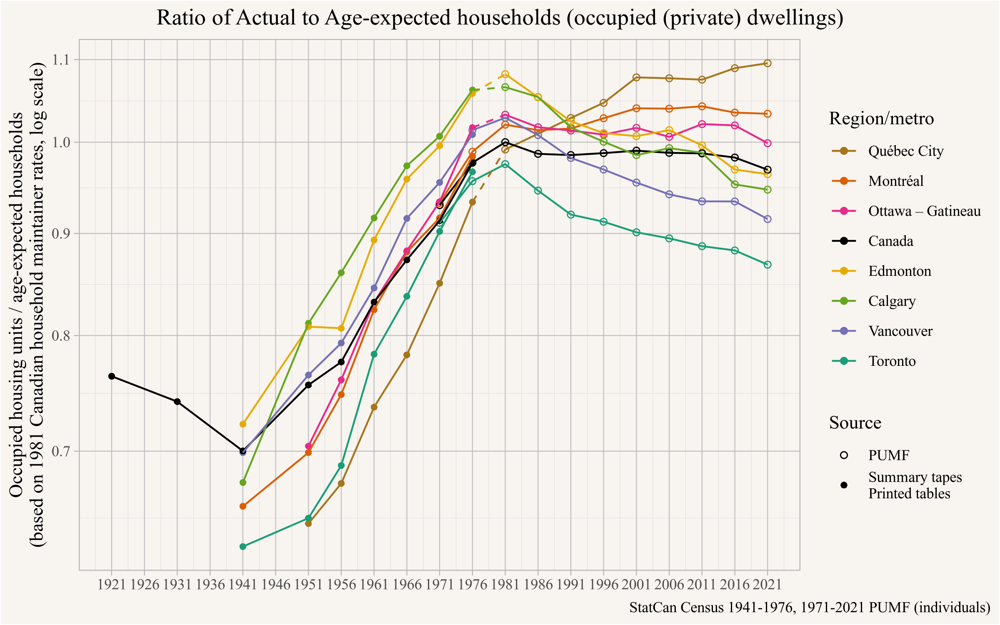

<p style="text-align:center;"><i>(Joint with Nathan Lauster and cross-posted at <a href="https://homefreesociology.com/2025/07/06/housing-is-a-housing-problem/" target="_blank">HomeFreeSociology</a>)</i></p>


::: {.cell}

:::


The now well-know slogan [Homelessness is a housing problem](https://homelessnesshousingproblem.com) [@colburn2022] alludes to the fact that structural homelessness is caused by housing shortages, a topic that we recently examined in the Canadian context. [@homelessness-and-rents-in-canada.2025] In this post we want to take this to the logical conclusion and explain that **housing is a housing problem**. By this we mean that while, just like with homelessness, there are individual factors that explain why some people struggle finding adequate housing and others don't, on a structural level the biggest issue is simply that we don't have enough housing.

This might seem obvious, especially if we are familiar with the work on homelessness, which sits at the extreme of housing insecurity. But a surprising number of people keep insisting that the primary problem is not shortage but something else: The main culprit is sometimes the [*financialization of housing*](https://spacing.ca/toronto/2019/07/09/perks-the-risks-of-the-financialization-of-housing/), or [*individual investors*](https://www.theglobeandmail.com/real-estate/vancouver/article-the-dark-side-of-investor-driven-housing/), or simply [*greed*](https://www.thestar.com/opinion/contributors/greedy-landlords-make-moving-within-toronto-too-expensive/article_ec47ce70-6be6-5261-befe-97ef70c7dddf.html), or [not about the lack of housing overall, but just the lack of *affordable housing*](https://www.ubcm.ca/about-ubcm/latest-news/bcs-housing-supply-keeping-pace-population-growth) (hint, this might be connected to the lack of housing overall).

We want to give a simple explanation for why these arguments fall short. This is not to say that fixing the housing shortage will solve all housing problems, but that fixing the housing shortage is necessary to solve most of our housing problems. Correspondingly, every kind of housing that adds on net to supply can help. Moreover a good chunk of the other issues that keep getting brought up are downstream of shortage. It is also clear that just adding new housing to the market to fix the shortage probably won't be sufficient to ensure everyone has adequate access to the housing they need. As we have argued regularly we also need more non-market housing or cash supports to make this work. [@homelessness-and-rents-in-canada.2025; @housing-targets.2023; @distributional-effects-of-adding-housing.2024] But adding lots of new housing to the market in lots of different forms should almost certainly be part of the solution to fixing our housing shortage.

A secondary point we are making in this post is that the singular focus on "affordability", generally measured via shelter cost to household income ratios, is problematic and needs augmenting with other measures. Taken on its own it is likely to misguide us. In technical terms, a utility function that focuses on shelter cost and household income is misspecified and not well-aligned with measuring housing outcomes as experienced by individuals.

# A hypothetical example

Maybe the best way to understand the problem is to take an extreme example that addresses all of the common arguments against supply being the main problem. Let's assume, by some mechanism, we could socialize the entire housing supply overnight. That eliminates any forms of *financialization*, *individual investors*, *greed* or profit motive, and government could set rents to eliminate any *affordability* concerns. What could housing in Canada look like under that scenario?

## Allocation

The first question is how would housing get allocated under such a system? In real life, we've seen a few examples, for instance in China [@forrest2012shaping] and Russia [@zavisca2008property], where after a period of initial upheaval housing was generally allocated by work unit. But these systems famously didn't last. For simplicity let's assume that on the day the housing stock got nationalized everyone happened to want to move - but only locally (perhaps imagine something like China's hukou system preventing interregional migration and set aside the [Charter Right violations](https://www.justice.gc.ca/eng/csj-sjc/rfc-dlc/ccrf-ccdl/check/art6.html) entailed). Let's also imagine government gets to allocate housing for everyone. Ignoring problems of how to allocate housing of different quality and location, government might want to allocate each family unit a home according to their needs, at a minimum by number of bedrooms.

But right off the bat this runs into a major problem: In most metro areas there are already a lot more family units than homes. Some families or unattached individuals will have to share homes and government will have to decide who and how. Some may enjoy sharing a home and one might imagine government setting up a system where people can volunteer to share a home rather than to get one of their own, but that probably requires giving out some perks (or exercising some coercion). To understand how this would play out we first need an estimate how many homes we are short and how many would have to share.

Fortunately that's an easy question to answer since we have worked this out in the past, although the answer depends a bit on what kind of sharing we think is acceptable as a baseline. Our current rules in how we allocate non-market housing might give some guidance to that question. Non-market housing providers generally won't issue lease agreements to doubled-up households and tenants who do share their non-market home with others run the risk of losing their benefits. One exception here is adult children who often are allowed in the parent's household. To get a rough idea how we might distribute housing, we offer two metrics: a) the number of housing units required to avoid all doubling up (with some allowances for collage-aged kids) shown in @fig-no-doubling-up, [@housing_shortages_doubled_up_households.2024] and b) the number of homes needed so that every family unit can have their own home, with more generous allowances of adult children living with parents shown in @fig-doubling-up-families.[^1] [@doubling-up-distinguishing-families-from-households.2024]

[^1]: The family unit estimate suffers from under-counts, and it counts all adult children living with parents as part of the parent's family unit irrespective of age.

{#fig-no-doubling-up}

{#fig-doubling-up-families}

No matter which metric we pick, we end up with a significant number of families and individuals who would have to share homes, and in some metro areas that number is excessively high - to the level that it would require very strong government incentives to get enough people to share homes in order to make the numbers work. Some doubling up is voluntary, and metro regions at the lower end of the spectrum put some rough bounds on how much that might be given our general economic conditions in Canada. Of note, during the eras of state and work unit allocation in China and Russia, doubled up families remained strikingly common, with lengthy queues for young adults to achieve apartments of their own [@forrest2012shaping; @zavisca2008property]. For instance, as Zavisca notes, "In 1985, the Soviet government estimated that 40 million new housing units, or a doubling of the housing stock, would be needed to provide separate dwellings for all families." Dispensing with the trappings of capitalism did not, in fact, solve housing shortage.

## Back to our current system

In our current system it's not government giving out incentives to share housing, it's the market generating high rents for a scarce resource. We can see the relationship directly by plotting prevailing rents against the number of homes needed to avoid all doubling up in @fig-rents-doubling-up. [@housing_shortages_doubled_up_households.2024]

{#fig-rents-doubling-up}

Prevailing rents and prevalence of doubling up are tightly linked. People double up to pool income and make rent work. Rents, in turn, are mostly set by the wealthiest and most desperate person (or couple) who wants to escape their doubled-up living situation and form their own household. Doubling up is the main mechanism by which people adapt to a housing shortage, and in a (mostly) market driven housing system rents and prices adjust to sort people into minimal household units and doubled-up households.

# No free lunch

The bottom line is that there is no free lunch. Rents are high because we don't have enough housing. If all housing were socialized overnight the shortage would still be there and government would have to resort to coercion, queuing, or provision of high incentives to find enough people to double up in the existing housing stock. There is no way to solve this problem without building more housing. As government built more housing, use of line-ups, force, and incentives could drop. This, of course, is not so different from the relationship between rents and doubled-up households in our current market system. Rents, and people's living situations, adapt to shortages and rents will fall as fewer people are forced to double up.[^2] There are some other factors that matter too, income and wealth of the population as well as some cultural preferences for sharing, but that does not materially change this relationship. [@mhu.2025]

[^2]: These cross-sectional estimates can be interpreted as long-run elasticities of rents to the mismatch of minimal household units and the housing supply. This holds under the assumption that metro areas are near equilibrium, measuring the same relationship across several censuses supports this assumption.

## Tweaking allocation

In our hypothetical example we changed the allocation mechanism while keeping the housing stock fixed. This re-shuffles who has to double up but does not change the number of families and unattached individuals that have to double up. Other softer changes to the housing system, for example introducing vacancy control, similarly just change the allocation mechanism, but in a different way. Here it's not government deciding who has to double up, or giving out incentives for people to double up, but private landlords. If market mechanisms were tweaked to prevent rents from rising between tenants, a lot more people could theoretically afford to live on their own instead of doubling up. But without adding more housing as the number of potential household balloons, landlords are simply left with other mechanisms to decide who gets to rent the unit. Generally this will be who the landlord perceives as a "good renter", which in many cases will be wealthier people, and families or individuals who seem most likely to pay or least likely to complain or damage the apartment. Maybe acquaintances or those bearing gifts. Probably not doubled up households, who after all add more wear and tear without bringing in more rent (this is why landlords aren't generally fond of children! [@lauster2011no]) Ultimately, freezing rents entails either further restricting landlord control and moving toward full state allocation, or it tends to introduce new means of assortment that may lead to those most in need doubling up even more -- or left entirely without housing. After all, insofar as doubling up represents the slack we have in our housing system, without doubling up any shortage of housing means people will have to leave the region or become homeless. Changing the allocation mechanism in a way that directly reduces doubling up without adding housing can have disastrous consequences.

# A History of Progress Interrupted

@fig-rents-doubling-up directly links rents to how people manage to live. A theory about housing that can't, or does not even attempt to explain why so many people remain doubled up in some markets, is simply not a serious theory about housing. This problem can sneak into analysis through taking existing households and their sizes for granted [as reflecting people's differing preferences to live together](https://theconversation.com/ontarios-affordable-housing-task-force-report-does-not-address-the-real-problems-176869) rather than differing constraints on their ability to live alone. Failing to note the flexibility of households in accommodating slack in our housing markets can lead to denial about our underlying housing shortages.

At an individual level we mostly experience housing as an affordability problem. When we say that housing in a specific region is unaffordable we may not mean that the housing we live in right now is unaffordable. For example, a 30 year old child living with parents likely lives in housing their (combined) household can easily afford. What we mean is that the housing outcomes we aspire to, the same outcomes that our peers in other parts of the country achieve, are out of reach in the region we live in. And while there may be good reasons why housing is somewhat more expensive in some parts of the country, there is no good reason why rents and prices have to vary as dramatically as they do.

At the systems level we see that collectively these housing aspirations can only be fulfilled if we have enough housing. We suggest making doubling up a primary target for housing policy. This lens avoids a lot of the pitfalls when using other metrics like Core Housing Need that are plagued by collider bias and lose sensitivity once our housing shortage is large enough. [@housing-targets.2023] What's more, reducing doubled up households ties back to a history of housing progress. The rapid rise in household formation in post-war Canada until the early 1980s was seen as a great success for Canadian housing. [@wargon.1979; @miron.1988; @miron1989] Through the 1980s, however, these improvements were reversed in much of Canada, with household formation slipping in all metro areas outside of Quebec after 1981 as shown in @fig-canada-cma-age-expected-households. This happened despite real incomes continuing to rise.


::: {.cell}
::: {.cell-output-display}
{#fig-canada-cma-age-expected-households}
:::
:::


Age-expected households are the number of households one would expect to see if age-specific household formation rates were equal to those in a fixed year, in our case 1981 when household formation peaked in Canada. The ratio of actual observed households to age-expected households based on the 1981 standard for Canada demonstrates where we've seen substantial backsliding since. Toronto and Vancouver really stand out! But really everywhere outside of Quebec (except for metropolitan Ottawa, which of course is partly in Quebec) has seen interruption to their progress in household formation since 1981.

To dive a bit further into the technicalities of assembling this figure, we split the time series into parts where the data was derived from the PUMF and that derived from published census tables and electronic summary tapes, these data series are not strictly comparable because the PUMF data allows for filtering on the population in private households, whereas the older data looks at the total population which is not quite the right metric to use here. In cases where the time series don't overlap we connect them via dashed lines. Moreover, in older censuses the *households* concept was somewhat floating in definition as well as how enumerators coded this. [@wargon.1979; @harris1994]. Misalignment is small if age data as well as households counts are for the entire population, including households in collective dwellings, but larger discrepancies emerge if e.g. ages are reported for the entire population but household counts are only reported for private households, as is the case in the 1976 summary tapes. We adjusted the 1976 ratio to roughly account for this discrepancy. Some of the fields in the [1961](https://mdl.library.utoronto.ca/collections/numeric-data/census-canada/1961/statistics) and [1966](https://mdl.library.utoronto.ca/collections/numeric-data/census-canada/1966/statistics) summary tape data have coding issues, we replaced some of the data with manually entered data from the printed tables as appropriate. Consistency of reporting for older censuses is less clear and actual values may differ somewhat from the values we report in the graph, discrepancies because of inconsistencies in the consideration of private vs collective dwellings can result in a roughly 3% deviation from our reported ratios. Our time series for Canada exhibits a large kink in 1941 that we cannot explain, some caution in interpreting data for that year is advisable. The concept of Metropolitan areas (or "greater cities") was introduced in 1941 and is not available prior to that. Metropolitan area boundaries adjust over time.

Age-expected households were previously suggested as input for econometric modelling [@dipasquale1994housing] to avoid collider bias when modelling housing demand elasticities, although unfortunately this insight seems to have become forgotten in much of the more recent economics literature, where people too often assume households as fixed and unresponsive to prices and rents, or household formation elasticities are under-estimated. Given the large changes in household formation over time and across metro areas shown in @fig-canada-cma-age-expected-households misspecifying structural equation models by ignoring or under-estimating household formation leads to substantial collider bias. <!-- that permeates the literature. It is not uncommon to see researchers assume that e.g. building five additional housing units will trigger five household moving in from a different region, instead of four units getting occupied up by people already in the region via un-doubling and one taken up by an additional net in-migrant. We are planing to go into detail on this using examples from the recent housing literature in a future post.-->

The decline in household formation since 1981 cannot be explained by changes in cultural makeup. Cultural factors do play some small role, but these trends also hold when only looking at the non-immigrant non-visible minority sub-population in Canada and there is strong evidence that the main cause is increasing housing scarcity and, with it, increasing housing costs. [@mhu.2025]

We are not alone in pointing out that our standard household-based measures we use in Canada to monitor housing, like Core Housing Need, are insufficient, and calling for also tracking household living arrangements. This is particularly clear when looking at the period from 1941 to 1981 when Canada made a lot of progress in improving housing outcomes, while standard affordability measures did not change much. In 1989 John Miron observed:

> The analysis of affordability problems should not focus exclusively on the ratio of shelter cost to income. To do so is to view the outcome of the past forty years unduly harshly. Affordability measures should focus on how the opportunities for alternative housing have been improved over time. A nonfamily individual who now spends 40% of her income on a housing unit may feel much better off than her predecessor who had spent less on housing but shared her dwelling with others or lodged elsewhere. While not denying that this may still constitute an affordability problem, we should recognize that an important kind of progress has been made here. [@miron1989]

The key insight here is that the utility function commonly used for housing outcomes that only looks at household income and shelter costs, is discontinuous across household formation, and more importantly, carries the opposite sign from how individuals experience their change in overall housing outcomes when un-doubling.

Miron continues:

> To focus exclusively on shelter-cost-to-income ratios as an indicator of affordable housing is thus too narrow. Those who point to the declining affordability of housing to the "average" household miss an important point. Given the large income and price elasticities of household formation among nonfamily individuals, each new program to improve affordability may well have the effect merely of increasing the number of newly-forming low-income households paying a high percentage of their income on housing.

We note that people who see their shelter costs to income ratio go up when un-doubling generally form their own household because they feel it improves their overall housing outcomes despite reducing their affordability. Facilitating un-doubling is thus a worthy goal in its own right and leads to material improvement, albeit one that is not captured by commonly used metrics.

# Doubling Up as a Metric

The last sentence of Miron's paper is still very relevant today:

> Especially in light of the household formation elasticities, what exactly are the benefits to be gained by further improving affordability, and how are they best measured? What are the costs involved, and are present tools to improve affordability the most cost-effective way of achieving the gains? Unfortunately, there has been little careful analysis of these issues.

We have wrangled with these questions and suggest that Minimal Household Units provide a useful framework to monitor improvements in housing outcomes. [@mhu.2025] This can be augmented with a range of related metrics, for example the ones exemplified in @fig-no-doubling-up, @fig-doubling-up-families, or @fig-canada-cma-age-expected-households.

Miron made his observations after looking back at 40 years of improving housing outcomes between 1941 to 1981 [@miron.1988; @miron1989], while we have been making the same observation when looking back at the last 40 years 1981 to 2021, except during that period we saw deteriorating housing outcomes. During those last four decades Household formation did not go back as much as it grew in the preceding four decades, and they did not decrease in all of Canada, Quebec saw continued gains. But improving housing outcomes seems natural and we don't think much about them, while deteriorating (or even stagnant) housing outcomes are painful and much more visceral, especially while incomes are still rising and many other aspects of life are continuing to improve. At the same time the main metrics we use to monitor housing outcomes, chiefly shelter cost to income ratios, have failed to capture the great improvements in housing outcomes 1941 to 1981 as observed by Miron, and they have done a fairly poor job at capturing the decline since as we have pointed out previously. [@housing-outcomes.2023]

With Canada's renewed effort to undo our housing shortage we accumulated over the past 40 years maybe now is the right time to develop better metrics that allow us to track progress.

# Conclusion

Housing is a Housing Problem. Which is to say there's not enough of it. Vacancy rates are a direct measure of shortages immediately available to apartment hunters, but short-term variation means they aren't always linked to underlying structural problems. Prices and rents can point toward shortages, but only if we accept underlying market dynamics of supply and demand (which we pretty much do in the Canadian context). Here we want to make it plain that there is also a relatively straightforward demographic measure of housing shortage rooted in the flexibility of the household. Doubling up within existing households offers a degree of slack to markets where there aren't enough dwellings to go around. Doubling up can make housing appear more affordable. But doubling up also represents a hardship, as well as a ready pool of demand exerting price pressure. As such, it's important to track rates of doubling up (and/or actual v. expected household formation) in order to better understand housing hardship related to shortage. Elevating household formation and doubling up to a primary metric to measure housing progress also serves as an important compliment to traditional affordability metrics used in Canada that suffer from collider bias that makes it difficult to use them to track progress in solving housing problems.

As an important bonus, tracking doubling up demonstrates how shortage is at the heart of Canada's housing problems. There's no simple solution, for instance involving a tweak to allocation, that will solve our housing problems without adding a lot more housing. We've done it before, adding a lot more housing in the post-war years, both market and non-market (but mostly market) and it mostly worked! Things got better! Since 1981, it's clear this project has stalled, and we simply haven't kept up. That sounds like a housing problem.

As usual, the code for this post is [available on GitHub](https://github.com/mountainMath/mountain_doodles/blob/main/posts/2025-07-06-housing-is-a-housing-problem/index.qmd) for anyone to reproduce or adapt for their own purposes.


<details>

<summary>Reproducibility receipt</summary>


::: {.cell}
::: {.cell-output .cell-output-stdout}

```
[1] "2025-07-06 17:37:10 PDT"
```


:::

::: {.cell-output .cell-output-stdout}

```
Local:    main /Users/jens/R/mountain_doodles
Remote:   main @ origin (https://github.com/mountainMath/mountain_doodles.git)
Head:     [6f4ad19] 2025-06-09: add categories
```


:::

::: {.cell-output .cell-output-stdout}

```
R version 4.5.1 (2025-06-13)
Platform: aarch64-apple-darwin20
Running under: macOS Sequoia 15.5

Matrix products: default
BLAS:   /Library/Frameworks/R.framework/Versions/4.5-arm64/Resources/lib/libRblas.0.dylib 
LAPACK: /Library/Frameworks/R.framework/Versions/4.5-arm64/Resources/lib/libRlapack.dylib;  LAPACK version 3.12.1

locale:
[1] en_US.UTF-8/en_US.UTF-8/en_US.UTF-8/C/en_US.UTF-8/en_US.UTF-8

time zone: America/Vancouver
tzcode source: internal

attached base packages:
[1] stats     graphics  grDevices utils     datasets  methods   base     

other attached packages:
 [1] mountainmathHelpers_0.1.4 canpumf_0.3.0            
 [3] cansim_0.4.3              lubridate_1.9.4          
 [5] forcats_1.0.0             stringr_1.5.1            
 [7] dplyr_1.1.4               purrr_1.0.4              
 [9] readr_2.1.5               tidyr_1.3.1              
[11] tibble_3.3.0              ggplot2_3.5.2            
[13] tidyverse_2.0.0          

loaded via a namespace (and not attached):
 [1] generics_0.1.4     stringi_1.8.7      hms_1.1.3          digest_0.6.37     
 [5] magrittr_2.0.3     evaluate_1.0.4     grid_4.5.1         timechange_0.3.0  
 [9] RColorBrewer_1.1-3 fastmap_1.2.0      rprojroot_2.0.4    jsonlite_2.0.0    
[13] httr_1.4.7         scales_1.4.0       codetools_0.2-20   cli_3.6.5         
[17] rlang_1.1.6        bit64_4.6.0-1      withr_3.0.2        yaml_2.3.10       
[21] tools_4.5.1        tzdb_0.5.0         here_1.0.1         curl_6.4.0        
[25] assertthat_0.2.1   vctrs_0.6.5        R6_2.6.1           git2r_0.36.2      
[29] lifecycle_1.0.4    bit_4.6.0          arrow_20.0.0.2     pkgconfig_2.0.3   
[33] pillar_1.10.2      gtable_0.3.6       glue_1.8.0         xfun_0.52         
[37] tidyselect_1.2.1   rstudioapi_0.17.1  knitr_1.50         farver_2.1.2      
[41] htmltools_0.5.8.1  rmarkdown_2.29     compiler_4.5.1    
```


:::
:::


</details>

