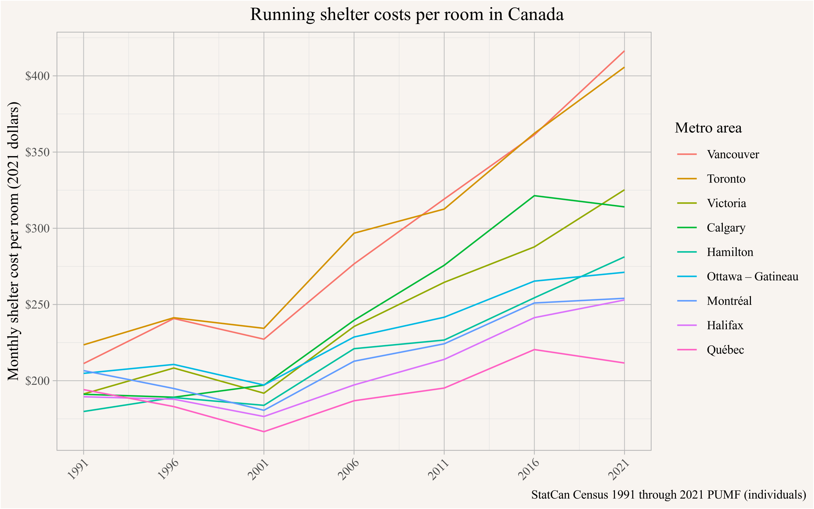
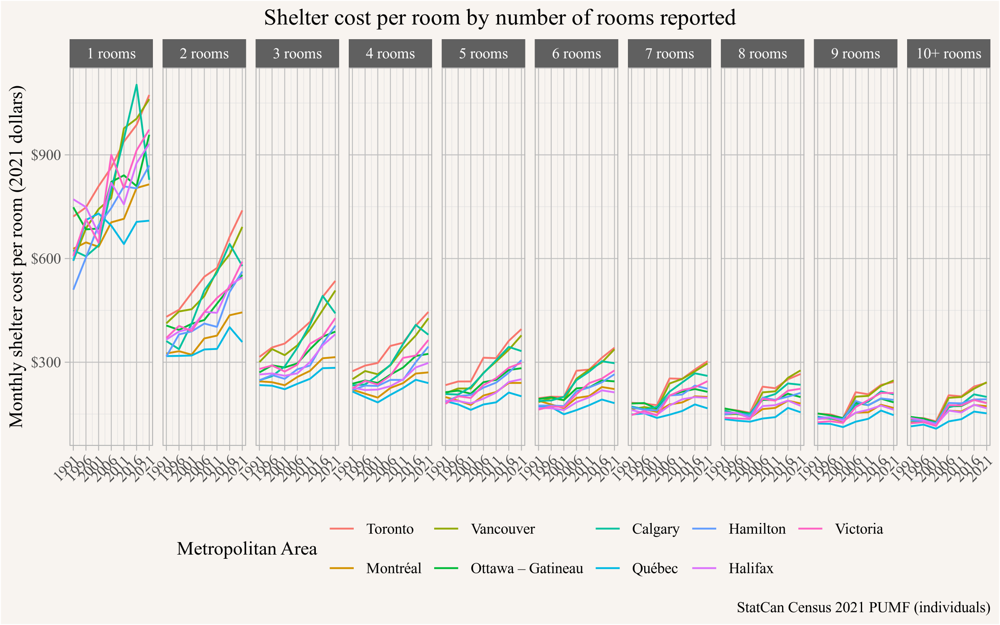
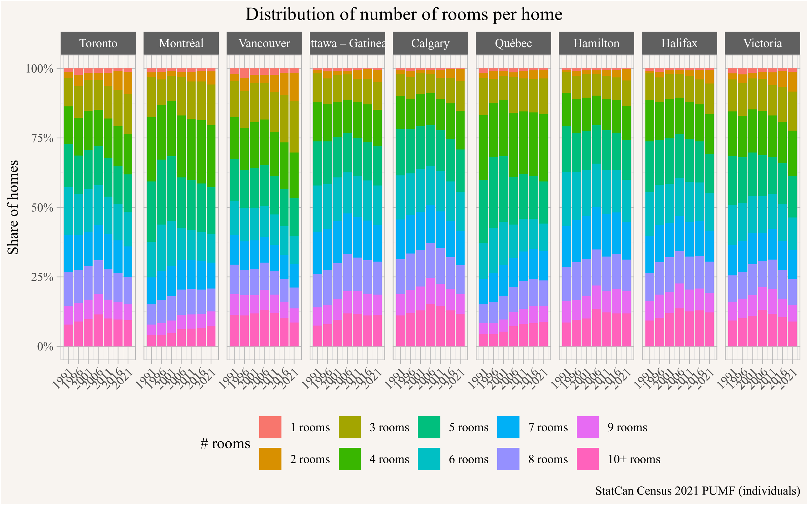
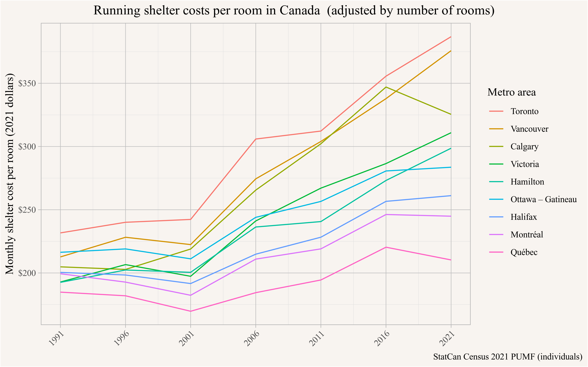
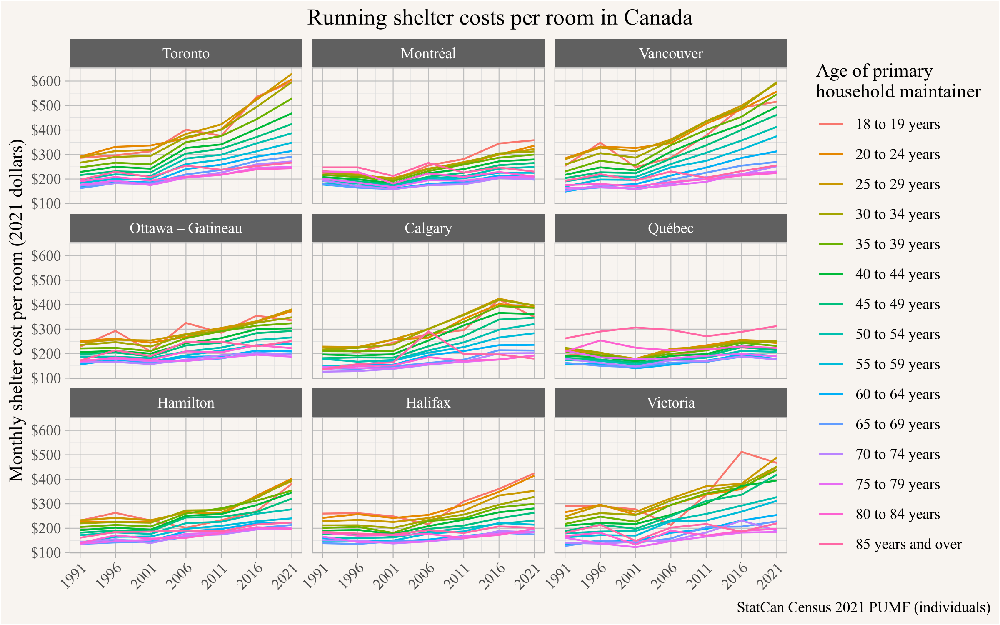
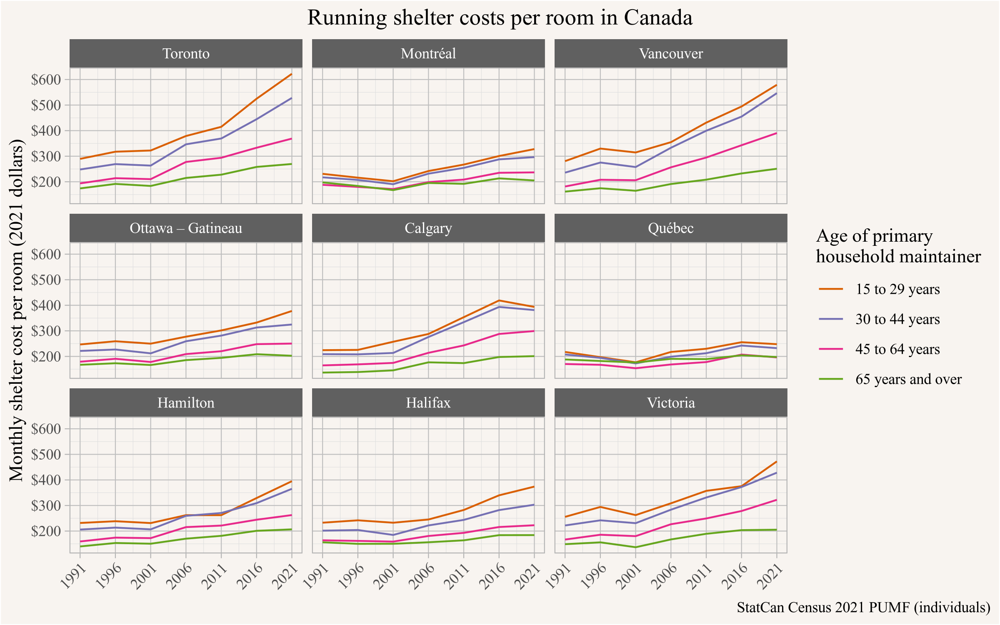
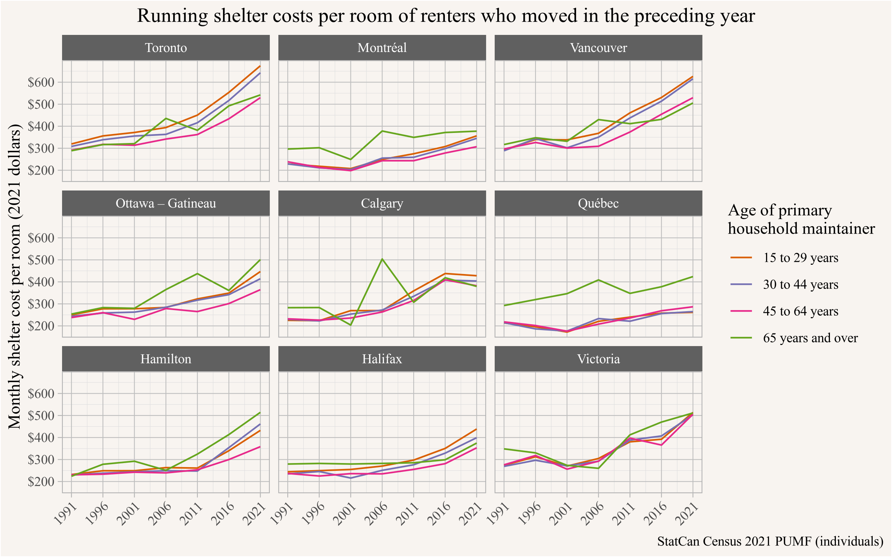
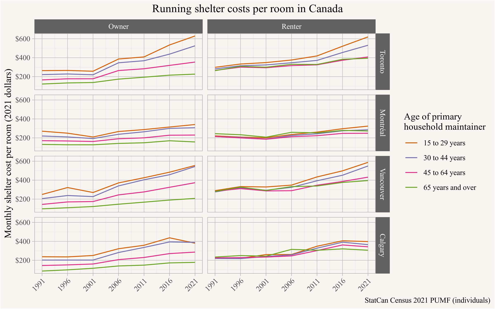
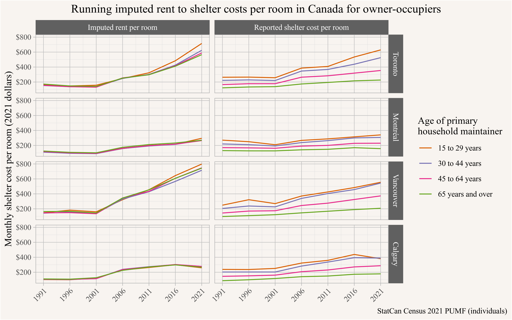

<p style="text-align:center;"><i>(Joint with Nathan Lauster and cross-posted at <a href="https://homefreesociology.com/2025/10/25/age-disparity-in-shelter-cost-per-room/" target="_blank">HomeFreeSociology</a>)</i></p>


::: {.cell}

```{.r .cell-code}
library(tidyverse, warn.conflicts = FALSE)
library(canpumf)
library(cansim)
```
:::


Residential floor space offers a common denominator for trying to standardize across a range of housing metrics (e.g. price per square foot). Unfortunately we don't have it in the Census in Canada, but we can play around with rooms to get some pretty similar results. Here we investigate how shelter costs per room have changed over time, across various regions, and by age group to construct some comparable figures to those recently coming out of the UK.

Long story short: shelter cost per room has been getting more expensive, especially for young folks, and in those metro areas where we see the greatest housing shortages, and the age discrepancy mostly comes from older folks locking in past prices, especially as they transition into ownership.

# New Metric!

We are suckers for experimenting with new metrics to understand housing pressures and got nerd-sniped by figures on shelter cost per square meter of floorspace in the UK put out by the [Resolution Foundation](https://www.resolutionfoundation.org/major-programme/housing-indicators/housing-affordability/?section=HC%20sqm), in particular the breakdown of shelter cost per square meter by age groups as flagged by [Ant Breach on Bluesky](https://bsky.app/profile/antbreach.bsky.social/post/3m3heqfnyi22q), and referenced by [Deny Sullivan ](https://bsky.app/profile/denysullivan.bsky.social/post/3m3igygsa6c2f) asking for Canadian stats.

# Room

In Canada we don't know of a good data source on square footage and shelter costs by age breakdown, but we can achieve something similar by looking at shelter cost per room. Of note for current [Census definitions](https://www12.statcan.gc.ca/census-recensement/2021/ref/dict/az/Definition-eng.cfm?ID=dwelling-logements012), number of rooms includes "kitchens, bedrooms and finished rooms in the attic or basement" but excludes "bathrooms, halls, vestibules and rooms used solely for business purposes," with specific judgments otherwise left to the respondent. As a specific example, consider a studio apartment where the kitchen was partially behind a wall. The number of rooms might be listed as one or two, depending upon the respondent. This kind of ambiguity is built into the rooms measure. But we have looked at number of rooms as a metric for household tightness before [@housing-outcomes.2023], and while it is far from perfect (with sizes of rooms, as well as how we divide homes into rooms, changing over time and likely differing across regions in addition to inherent ambiguity), we believe it still offers a somewhat decent proxy for the size of homes. 


::: {.cell}

```{.r .cell-code}
get_combined_pumf_data <- function() {
  
  inflation <- mountainmathHelpers::simpleCache(
    get_cansim_vector("v41693271") |>
      mutate(Year=as.integer(strftime(Date,"%Y"))) |>
      mutate(CPI=val_norm / val_norm[Year==2021]) |>
      select(Year,CPI), 
    "inflation_annual_oct_2025.rds",path=here::here("data"))
  

  years <- seq(1991,2021,5)
 
  pumf_list <- years |>
    lapply(\(year) get_pumf("Census",year) |>
             label_pumf_data(rename_columns = FALSE) |>
             mutate(Year=year)) |>
  setNames(years)
  
  year_age_to_age_group <- function(age_column) {
    cut(as.numeric(na_if(age_column,"Not available")),breaks=c(-Inf,15,18,seq(20,85,by=5),Inf),
        labels=c("0 to 14 years","15 to 17 years","18 to 19 years",
                 "20 to 24 years","25 to 29 years",
                 "30 to 34 years","35 to 39 years","40 to 44 years",
                 "45 to 49 years","50 to 54 years","55 to 59 years",
                 "60 to 64 years","65 to 69 years","70 to 74 years",
                 "75 to 79 years","80 to 84 years","85 years and over"),
        right=FALSE)
  }

  select_columns_r <- c("ROOM","AGEGRP","PRIHM","SHELCO","WEIGHT","CMA","MOB1","TENUR","VALUE")
  
  pumf_all_r <- bind_rows(
    pumf_list[["2021"]] |> 
      select(all_of(select_columns_r)) |> 
      mutate(VALUE=as.integer(VALUE)) |>
      mutate(Year=2021),
    pumf_list[["2016"]] |> 
      mutate(ROOM=ROOMS) |> 
      select(all_of(select_columns_r)) |> 
      mutate(VALUE=as.integer(VALUE) |> na_if(99999999)|> na_if(88888888)) |>
      mutate(Year=2016),
    pumf_list[["2011"]] |> 
      mutate(SHELCO=coalesce(na_if(OMP,"9999") |> na_if("8888"),
                             na_if(GROSRT,"9999") |> na_if("8888")) |>
               as.numeric()) |>
      select(all_of(select_columns_r)) |> 
      mutate(VALUE=as.integer(VALUE) |> na_if(9999999)|> na_if(8888888)) |>
      mutate(Year=2011),
    pumf_list[["2006"]] |> mutate(SHELCO=coalesce(na_if(OMP,"9999") |> na_if("8888"),
                                                  na_if(GROSRT,"9999") |> na_if("8888")) |>
                                    as.numeric()) |>
      select(all_of(select_columns_r)) |> 
      mutate(VALUE=as.integer(VALUE) |> na_if(9999999)|> na_if(8888888)) |>
      mutate(Year=2006),
    pumf_list[["2001"]] |> mutate(SHELCO=coalesce(na_if(OMPP,"9999") |> na_if("8888")|> na_if("Not applicable"),
                                                  na_if(GROSRTP,"9999") |> na_if("8888")|> na_if("Not applicable")) |>
                                    as.numeric()) |>
      rename(ROOM=ROOMP,PRIHM=PRMAINP,WEIGHT=WEIGHTP,CMA=CMAP,MOB1=MOB1P,TENUR=TENURP,VALUE=VALUEP) |>
      mutate(AGEGRP=year_age_to_age_group(AGEP)) |>
      select(all_of(select_columns_r)) |> 
      mutate(VALUE=as.integer(na_if(VALUE,"Not applicable"))) |>
      mutate(Year=2001),
    pumf_list[["1996"]] |> mutate(SHELCO=coalesce(na_if(OMPP,"9999") |> na_if("8888")|> na_if("Not applicable"),
                                                  na_if(GROSRTP,"9999") |> na_if("8888")|> na_if("Not applicable")) |>
                                    as.numeric()) |>
      rename(ROOM=ROOMP,PRIHM=PRMAINP,WEIGHT=WEIGHTP,CMA=CMAPUMFP,MOB1=MOB1P,TENUR=TENURP,VALUE=VALUEP) |>
      mutate(AGEGRP=year_age_to_age_group(AGEP)) |>
      select(all_of(select_columns_r)) |> 
      mutate(VALUE=as.integer(VALUE) |> na_if(999999)|> na_if(888888)) |>
      mutate(Year=1996),
    pumf_list[["1991"]] |> mutate(SHELCO=coalesce(na_if(OMPP,"9999") |> na_if("8888") |> na_if("Not applicable"),
                                                  na_if(GROSRTP,"9999") |> na_if("8888") |> na_if("Not applicable")) |>
                                    as.numeric()) |>
      rename(ROOM=ROOMP,PRIHM=PRMAINP,WEIGHT=WEIGHTP,CMA=CMAPUMFP,MOB1=MOB1P,TENUR=TENURP,VALUE=VALUEP) |>
      mutate(AGEGRP=year_age_to_age_group(AGEP)) |>
      select(all_of(select_columns_r)) |> 
      mutate(VALUE=as.integer(na_if(VALUE,"Not applicable"))) |>
      mutate(Year=1991),
  ) |>
    left_join(inflation, by="Year") |>
    mutate(SHELCO_real = SHELCO/CPI) |>
    mutate(rooms=case_when(ROOM=="Not available" ~ NA,
                           ROOM=="NOT APPLICABLE" ~ NA,
                           ROOM=="Not applicable" ~ NA,
                           ROOM=="One room" ~ "1",
                           ROOM=="Two rooms" ~ "2",
                           ROOM=="Three rooms" ~ "3",
                           ROOM=="Four rooms" ~ "4",
                           ROOM=="Five rooms" ~ "5",
                           ROOM=="Six rooms" ~ "6",
                           ROOM=="Seven rooms" ~ "7",
                           ROOM=="Eight rooms" ~ "8",
                           ROOM=="Nine rooms" ~ "9",
                           ROOM=="Ten rooms" ~ "10",
                           ROOM=="Ten or more rooms" ~ "10",
                           ROOM=="Ten or >rooms"~"10",
                           ROOM=="Eleven rooms or more" ~ "11",
                           ROOM=="Eleven or more rooms" ~ "11",
                           TRUE ~ substr(ROOM,1,2))) |>
    mutate(rooms=as.numeric(rooms)) |>
    mutate(CMA=recode(CMA,"Regina - 705 and Saskatoon - 725"="Regina – Saskatoon",
                      "Regina(705) + Saskatoon(725)"="Regina – Saskatoon",
                      "Regina/Saskatoon"="Regina – Saskatoon",
                      "Ottawa-Hull"="Ottawa – Gatineau",
                      "Ottawa Hull"="Ottawa – Gatineau",
                      "Quebec"="Québec",
                      "Montreal"="Montréal")) |>
    mutate(TENUR=recode(TENUR,
                        "Renter or Dwelling provided by the local government, First Nation or Indian band"="Renter",
                        "Owned by a member of the household"="Owner",
                        "Rented or Band housing"="Renter",
                        "Owned (with or without mortgage)"="Owner",
                        "Rented (for cash, other) or Band housing"="Renter",
                        "Owned - with or without mortgage"="Owner",
                        "Rented - for cash, other or Band housing"="Renter",
                        "OwndWithWoutMortgage"="Owner",
                        "Rented Band Housing"="Renter",
                        "Owned (with or without mort.)"="Owner",
                        "Rented-cash/other or band hsg."="Renter")) %>%
    mutate(CMA=factor(CMA,levels= summarize(.,people=sum(WEIGHT),.by=CMA) |> arrange(-people) |> pull(CMA)))
  
  pumf_all_r
}

pumf_all_r <- mountainmathHelpers::simpleCache(get_combined_pumf_data(),"combined_pumf_data.rds")
```
:::


# Shelter costs per room

Shelter costs, [as measured in the census](https://www12.statcan.gc.ca/census-recensement/2021/ref/dict/az/Definition-eng.cfm?ID=households-menage033), capture how much households are directly paying on an ongoing monthly basis to maintain their shelter, including utilities, condominium fees, and property taxes. This differs from measuring the value of housing services consumed, a more theoretical quantity. For example an owner household in a fully paid-off home may have very low ongoing shelter costs, but the value of the housing services they consume is much higher, which we estimate by imputing the rent they pay themselves. Shelter costs can be thought of as capturing how much people feel directly pressured by the housing market rather than measuring the value of their housing services.

To make shelter cost more comparable across homes we normalize it by the number of rooms in the home as a proxy for the size of the home. One could also normalize by the number of bedrooms, but that data is only available for the 2011 through 2021 censuses and we are interested in longer timelines for this post.


::: {.cell}

```{.r .cell-code}
pd_all <- pumf_all_r |>
  filter(PRIHM %in% c("Person is primary maintainer","Primary household maintainer",
                      "PrimaryHhldMaintainr")) |>
  filter(!is.na(rooms)) |>
  mutate(rooms=pmin(rooms,10)) |>
  summarize(
    avg_shelco_per_room = weighted.mean(SHELCO_real/rooms, w = WEIGHT, na.rm=TRUE),
    people=sum(WEIGHT),
    .by = c(CMA,Year)
  ) 
```
:::


One decision we have to make is over what universe we are estimating this metric. There are two natural choices; we can estimate this over people or over households. With an eye to the rest of the post we choose to estimate this over households.

@fig-shelter-cost-per-room shows the shelter cost per room across time for several large Canadian metro areas.


::: {.cell}

```{.r .cell-code}
filter_metros <- function(data) {
  data |>
    filter(grepl("Toron|Vancou|Calga|Montré|Ottaw|Québ|Edom|Halifax|Victor|Hamil",CMA))
}

pd_all |>
  filter_metros() %>%
  mutate(CMA=factor(CMA,levels=filter(.,Year==2021) |> arrange(-avg_shelco_per_room) |> pull(CMA))) |>
  #filter(AGEGRP != "18 to 19 years") |>
  ggplot(aes(x=Year, y=avg_shelco_per_room, colour=CMA)) +
  geom_line() +
  scale_x_continuous(breaks=seq(1991,2021,by=5)) +
  scale_y_continuous(labels=scales::dollar_format(prefix="$")) +
  theme(axis.text.x = element_text(angle=45, hjust=1)) +
  labs(title="Running shelter costs per room in Canada",
       colour="Metro area",
       y="Monthly shelter cost per room (2021 dollars)",
       x=NULL,
       caption="StatCan Census 1991 through 2021 PUMF (individuals)") 
```

::: {.cell-output-display}
{#fig-shelter-cost-per-room fig-pos='H'}
:::
:::


As one might expect, Vancouver and Toronto stand out with particularly high shelter costs per room, and also strong growth in the metric since 1991. At the other end of the spectrum, Québec City metro area shows low and fairly flat shelter cost per room.

# Economies of Scale and Location Tradeoffs

Importantly, we shouldn't expect shelter cost per room to linearly scale up with the size of a dwelling overall. After all, we already know that the room metric excludes things like bathrooms - and sometimes even kitchens - which are needed to support a dwelling, but not on a per room basis. So there should be economies of scale with respect to dwellings where having more rooms becomes cheaper on a per room basis. We illustrate this with @fig-shelter-cost-per-room-by-rooms.


::: {.cell}

```{.r .cell-code}
shelter_cost_per_room <- pumf_all_r |>
  filter(PRIHM %in% c("Person is primary maintainer","Primary household maintainer",
                      "PrimaryHhldMaintainr")) |>
  filter(!is.na(rooms)) |>
  mutate(rooms=pmin(rooms,10)) |>
  #filter(AGEGRP != "15 to 17 years") |>
  summarize(
    avg_shelco_per_room = weighted.mean(SHELCO_real/rooms, w = WEIGHT, na.rm=TRUE),
    avg_shelco_per_room2 = weighted.mean(SHELCO_real/sqrt(rooms), w = WEIGHT, na.rm=TRUE),
    .by = c(rooms,CMA,Year)
  ) 


shelter_cost_per_room |>
  mutate(name=paste0(rooms," rooms") |> recode("10 rooms"="10+ rooms") |> fct_reorder(rooms)) |>
  filter_metros() |>
  ggplot(aes(x=Year, y=avg_shelco_per_room,colour=CMA)) +
  geom_line() +
  scale_x_continuous(breaks=seq(1991,2021,by=5)) +
  scale_y_continuous(labels=scales::dollar_format(prefix="$")) +
  theme(axis.text.x = element_text(angle=45, hjust=1),
        legend.position = "bottom") +
  labs(title="Shelter cost per room by number of rooms reported",
       colour="Metropolitan Area",
       y="Monthly shelter cost per room (2021 dollars)",
       x=NULL,
       caption="StatCan Census 2021 PUMF (individuals)") +
  facet_grid(~name)
```

::: {.cell-output-display}
{#fig-shelter-cost-per-room-by-rooms fig-pos='H'}
:::
:::


Importantly, we're also probably picking up some within metro area location effects here. That is, more central locations tend to have more studio and 1BR apartments, while locations further out toward the suburbs tend to have larger detached houses. So proximity to jobs and amenities may be folded into our estimates of costs per room as well, and also help explain why they vary over number of rooms. This helps set up our discussion of age effects.

In this context it's also useful to understand how the distribution of the number of rooms per home has changed over time and differs across geographies, as shown in @fig-room-over-time.


::: {.cell}

```{.r .cell-code}
room_over_time <- pumf_all_r |>
  filter(PRIHM %in% c("Person is primary maintainer","Primary household maintainer",
                      "PrimaryHhldMaintainr")) |>
  filter(!is.na(rooms)) |>
  mutate(rooms=pmin(rooms,10)) |>
  #filter(AGEGRP != "15 to 17 years") |>
  summarize(
    count = sum(WEIGHT),
    .by = c(rooms,CMA,Year)
  )


room_over_time |>
  mutate(name=paste0(rooms," rooms") |> recode("10 rooms"="10+ rooms") |> fct_reorder(rooms)) |>
  filter_metros() |>
  ggplot(aes(x=Year, y=count,fill=name)) +
  geom_col(position="fill") +
  scale_x_continuous(breaks=seq(1991,2021,by=5)) +
  scale_y_continuous(labels=scales::percent) +
  theme(axis.text.x = element_text(angle=45, hjust=1),
        legend.position = "bottom") +
  labs(title="Distribution of number of rooms per home",
       fill="# rooms",
       y="Share of homes",
       x=NULL,
       caption="StatCan Census 2021 PUMF (individuals)") +
  facet_grid(~CMA)
```

::: {.cell-output-display}
{#fig-room-over-time fig-pos='H'}
:::
:::


The low share of especially 1-room homes in some regions explains the volatility in the shelter cost per room metric for 1-room homes. We also note that the share of low-room count homes increases especially in regions with growing housing shortages, which likely contributes to the increase in shelter cost per room over time. This is consistent with the explanation that the increase in the number of low-room homes is driven by people's desire for privacy of their own home, and being forced to economize on size where they face less competition from people economizing by doubling up. 

This suggests that adjusting for the changing distribution of the number of rooms per home across geographies and time might be useful to account for the economies of scale relating overall floor space to the number of rooms, while at the same time cautioning against doing this because of higher rent/sf for smaller units and variations in the distribution of the number of rooms being driven by housing shortages. For the rest of the post we will keep it simple and not adjust for the number of rooms, but @fig-shelter-cost-per-room-adjusted shows the shelter cost per room adjusted for the changing distribution of the number of rooms per home to help gauge the potential impacts of doing such adjustment to our baseline @fig-shelter-cost-per-room.


::: {.cell}

```{.r .cell-code}
pd_all_adj <- pumf_all_r |>
  filter(PRIHM %in% c("Person is primary maintainer","Primary household maintainer",
                      "PrimaryHhldMaintainr")) |>
  filter(!is.na(rooms)) |>
  mutate(rooms=pmin(rooms,10)) |>
  summarize(
    avg_shelco_per_room = weighted.mean(SHELCO_real/rooms, w = WEIGHT, na.rm=TRUE),
    people=sum(WEIGHT),
    .by = c(CMA,Year,rooms)
  ) |>
  left_join(
    room_over_time |>
      filter_metros() |>
      summarise(total_rooms = sum(count), .by = c(rooms)),
    by=c("rooms")
  ) |>
  summarize(
    avg_shelco_per_room = weighted.mean(avg_shelco_per_room, w = total_rooms),
    .by = c(CMA,Year)
  )


pd_all_adj |>
  filter_metros() %>%
  mutate(CMA=factor(CMA,levels=filter(.,Year==2021) |> arrange(-avg_shelco_per_room) |> pull(CMA))) |>
  #filter(AGEGRP != "18 to 19 years") |>
  ggplot(aes(x=Year, y=avg_shelco_per_room, colour=CMA)) +
  geom_line() +
  scale_x_continuous(breaks=seq(1991,2021,by=5)) +
  scale_y_continuous(labels=scales::dollar_format(prefix="$")) +
  theme(axis.text.x = element_text(angle=45, hjust=1)) +
  labs(title="Running shelter costs per room in Canada  (adjusted by number of rooms)",
       colour="Metro area",
       y="Monthly shelter cost per room (2021 dollars)",
       x=NULL,
       caption="StatCan Census 2021 PUMF (individuals)") 
```

::: {.cell-output-display}
{#fig-shelter-cost-per-room-adjusted fig-pos='H'}
:::
:::


As one would expect, adjusting for the distribution of number of rooms dampens the growth in shelter cost per room for Toronto and Vancouver, which saw the largest increases in the share of low-room count homes, and increases the relative position of Calgary, which has a large share of high-room count homes. But the overall patterns remain similar to the unadjusted results.

If one wanted to refine the results of this post one could take a more principled approach and choose a more structured way to adjust for the changing distribution of the number of rooms, similar to what we did when constructing first-time buyer Lorentz curves. [@first-time-buyer-lorenz-curves.2020; @first-time-buyer-lorenz-curves-revisited.2024]


::: {.cell}

```{.r .cell-code}
pd_all_r <- pumf_all_r |>
  filter(PRIHM %in% c("Person is primary maintainer","Primary household maintainer",
                      "PrimaryHhldMaintainr")) |>
  filter(!is.na(rooms),
         AGEGRP != "Not available") |>
  mutate(rooms=pmin(rooms,10)) |>
  summarize(
    avg_shelco_per_room = weighted.mean(SHELCO_real/rooms, w = WEIGHT, na.rm=TRUE),
    people=sum(WEIGHT),
    .by = c(AGEGRP,CMA,Year)
  )  
```
:::


# Age

We were drawn into this because of the age disparity in the UK data, and we want to understand the shelter cost per room by age. How do running shelter costs per room differ for people in different age groups? Here we first need to revisit the question of the universe over which we are estimating this metric. For example, for 25 to 29 year olds, do we mostly care about the experience of those who formed independent households or do we also want to consider the experience of those living with their parents? We expect these two groups to face very different shelter cost pressures. In this post we mostly care about the former, so we again look at the household level and code the age group based on the age of the primary household maintainer, with the breakdown shown in @fig-shelter-cost-per-room-by-age.


::: {.cell}

```{.r .cell-code}
pd_all_r |>
  filter_metros() |>
  filter(AGEGRP != "15 to 17 years") |>
  #filter(AGEGRP != "18 to 19 years") |>
  ggplot(aes(x=Year, y=avg_shelco_per_room,colour=AGEGRP)) +
  geom_line() +
  scale_x_continuous(breaks=seq(1991,2021,by=5)) +
  scale_y_continuous(labels=scales::dollar_format(prefix="$")) +
  theme(axis.text.x = element_text(angle=45, hjust=1)) +
  labs(title="Running shelter costs per room in Canada",
       colour="Age of primary\nhousehold maintainer",
       y="Monthly shelter cost per room (2021 dollars)",
       x=NULL,
       caption="StatCan Census 2021 PUMF (individuals)") +
  facet_wrap(~CMA)
```

::: {.cell-output-display}
{#fig-shelter-cost-per-room-by-age fig-pos='H'}
:::
:::


This shows a fairly consistent pattern with younger people having higher shelter costs per room, and shelter costs per room declining as we move upward through the age groups. There is variance in the size of the spread, as well as how it increased over time. And the sample gets thin for some age groups in some regions, in particular the 18 to 19 year old bracket, leading to some noise. The Québec City metro area again stands out with it's low spread and fairly flat development over time. Toronto and Vancouver again show the largest spread and largest increase.

Following the lead of how the UK data was sliced, @fig-shelter-cost-per-room-by-coarse-age arranges the information into coarser age groups for easier readability.


::: {.cell}

```{.r .cell-code}
recode_broad_age_groups <- function(data){
  data |>
    mutate(AGEGRP=recode(AGEGRP,
           "15 to 17 years"="15 to 29 years",
           "18 to 19 years"="15 to 29 years",
           "20 to 24 years"="15 to 29 years",
           "25 to 29 years"="15 to 29 years",
           "30 to 34 years"="30 to 44 years",
           "35 to 39 years"="30 to 44 years",
           "40 to 44 years"="30 to 44 years",
           "45 to 49 years"="45 to 64 years",
           "50 to 54 years"="45 to 64 years",
           "55 to 59 years"="45 to 64 years",
           "60 to 64 years"="45 to 64 years",
           "65 to 69 years"="65 years and over",
           "70 to 74 years"="65 years and over", 
           "75 to 79 years"="65 years and over",
           "80 to 84 years"="65 years and over",
           "85 years and over"="65 years and over",
           "0 to 4 years" = "0 to 14 years",
           "5 to 6 years" = "0 to 14 years",
           "7 to 9 years" = "0 to 14 years",
           "10 to 11 years"  = "0 to 14 years",   
           "12 to 14 years" = "0 to 14 years")
  )
}

grouped_age_data <- pumf_all_r |>
  filter(PRIHM %in% c("Person is primary maintainer","Primary household maintainer",
                      "PrimaryHhldMaintainr")) |>
  filter(!is.na(rooms),
         AGEGRP != "Not available") |>
  mutate(rooms=pmin(rooms,10)) |>
  #filter(AGEGRP != "15 to 17 years") |>
  recode_broad_age_groups() |>
    summarize(
    avg_shelco_per_room = weighted.mean(SHELCO_real/rooms, w = WEIGHT, na.rm=TRUE),
    rooms=sum(rooms*WEIGHT),
    people=sum(WEIGHT),
    .by = c(AGEGRP,CMA,Year)
  ) 

coarse_age_colours <- setNames(RColorBrewer::brewer.pal(5,"Dark2"),
                               c("0 to 14 years","15 to 29 years","30 to 44 years",
                                 "45 to 64 years","65 years and over"))

grouped_age_data |>
  filter_metros() |>
  ggplot(aes(x=Year, y=avg_shelco_per_room,colour=AGEGRP)) +
  geom_line() +
  scale_color_manual(values=coarse_age_colours) +
  scale_x_continuous(breaks=seq(1991,2021,by=5)) +
  scale_y_continuous(labels=scales::dollar_format(prefix="$")) +
  theme(axis.text.x = element_text(angle=45, hjust=1)) +
  labs(title="Running shelter costs per room in Canada",
       colour="Age of primary\nhousehold maintainer",
       y="Monthly shelter cost per room (2021 dollars)",
       x=NULL,
       caption="StatCan Census 2021 PUMF (individuals)") +
  facet_wrap(~CMA)
```

::: {.cell-output-display}
{#fig-shelter-cost-per-room-by-coarse-age fig-pos='H'}
:::
:::


This is a good time to pause and think about how one might interpret this information. Increases in cost over time track fairly well with our understanding of housing shortages, with Québec City demonstrating very little shortage and Vancouver and Toronto demonstrating a lot. [@housing_shortages_doubled_up_households.2024] The differences by age are more difficult to interpret, they could be due to older people having been able to lock in housing costs in the past, having bought a home quite some time ago or benefiting from rent control after renting for a long time. But it could also be that older people tend to live in roomier places in the suburbs, benefiting from economies of scale, while younger people choose to live in more central locations, near more amenities, or in higher quality homes, which tend to have higher rents and prices. To disentangle this we can condition on renters, which removes the effects of e.g. people having low shelter costs because they have paid down their mortgage. We can also condition on recent movers to remove most of the effect of rent control. @fig-shelter-cost-per-room-by-coarse-age-renter-movers shows how this group fares over time.


::: {.cell}

```{.r .cell-code}
movers_cats <- c("Non-migrants", "Different CSD, same census division", "Different CD, same province", "Interprovincial migrants", "External migrants", "Movers: Non-migrants", "Movers: Migrants: Internal migrants: Intraprovincial migrants: Different CSD, same census division - CD", "Movers: Migrants: Internal migrants: Intraprovincial migrants: Different CD, same province", "Movers: Migrants: Internal migrants: Interprovincial migrants", "Movers: Migrants: External migrants", "MoversNonmigrant", "DifferentCSDSameCD", "DifferentCDSameProv", "InterprovinclMigrant", "External Migrants", "Intraprovincial movers", "Interprovincial movers")

grouped_age_data_movers <- pumf_all_r |>
  filter(PRIHM %in% c("Person is primary maintainer","Primary household maintainer",
                      "PrimaryHhldMaintainr")) |>
  filter(MOB1 %in% movers_cats) |>
  filter(TENUR=="Renter") |>
  filter(!is.na(rooms),
         AGEGRP != "Not available") |>
  mutate(rooms=pmin(rooms,10)) |>
  #filter(AGEGRP != "15 to 17 years") |>
  recode_broad_age_groups() |>
    summarize(
    avg_shelco_per_room = weighted.mean(SHELCO_real/rooms, w = WEIGHT, na.rm=TRUE),
    rooms=sum(rooms*WEIGHT),
    people=sum(WEIGHT),
    cases=n(),
    .by = c(AGEGRP,CMA,Year)
  ) 

grouped_age_data_movers |>
  filter_metros() |>
  ggplot(aes(x=Year, y=avg_shelco_per_room,colour=AGEGRP)) +
  geom_line() +
  scale_color_manual(values=coarse_age_colours) +
  scale_x_continuous(breaks=seq(1991,2021,by=5)) +
  scale_y_continuous(labels=scales::dollar_format(prefix="$")) +
  theme(axis.text.x = element_text(angle=45, hjust=1)) +
  labs(title="Running shelter costs per room of renters who moved in the preceding year",
       colour="Age of primary\nhousehold maintainer",
       y="Monthly shelter cost per room (2021 dollars)",
       x=NULL,
       caption="StatCan Census 2021 PUMF (individuals)") +
  facet_wrap(~CMA)
```

::: {.cell-output-display}
{#fig-shelter-cost-per-room-by-coarse-age-renter-movers fig-pos='H'}
:::
:::


This considerably narrows the spread across age groups. Data on recent renter movers in the senior age bracket should be interpreted with some caution due to the low number of cases in our sample, but overall trends indicated an interesting reversal for the senior age bracket which now shows up on top in many metro areas. Given our selection, it's possible that in some cases shelter costs here might be picking up on ways that seniors newly moving into retirement communities and assisted living facilities see the costs of extra services bundled into their rents. Nevertheless, Toronto and Vancouver still show younger age groups with higher shelter costs per room, which is consistent with the hypothesis that some of the spread could be due to different preferences in location and roominess tradeoffs. 

But there are some other factors that might play into this too. Household formation and tenure choice are both downstream of housing pressures, so conditioning on them can lead to collider bias, as we have previously explained. [@housing-outcomes.2023; @mhu.2025; @housing_shortages_doubled_up_households.2024]. We have proposed two measures of *housing frustration* based on household formation and tenure choice that can help quantify these pressures [@tenure-and-household-independence-across-the-life-course-1981-2021.2024], as shown in @fig-housing-frustration that we include here again for convenience. The housing frustration metric shows very high levels of suppressed household formation especially in Vancouver and Toronto that could explain some of the age patterns we see here via selection of richer folks into independent households among younger age groups. The question about tenure choice is more complicated and the relationship to the different spreads between age groups is less clear. 

{#fig-housing-frustration}


We can dig down a little deeper by examining how owners and renters differ in their ability to lock in lower shelter costs over time. @fig-shelter-cost-per-room-by-coarse-age-tenure splits the data by tenure, for a smaller selection of metro areas to keep things simple.


::: {.cell}

```{.r .cell-code}
tenure_age_data <- pumf_all_r |>
  filter(PRIHM %in% c("Person is primary maintainer","Primary household maintainer",
                      "PrimaryHhldMaintainr")) |>
  filter(!is.na(rooms),
         AGEGRP != "Not available") |>
  filter(TENUR %in% c("Renter","Owner")) |>
  mutate(rooms=pmin(rooms,10)) |>
  #filter(AGEGRP != "15 to 17 years") |>
  recode_broad_age_groups() |>
    summarize(
    avg_shelco_per_room = weighted.mean(SHELCO_real/rooms, w = WEIGHT, na.rm=TRUE),
    rooms=sum(rooms*WEIGHT),
    people=sum(WEIGHT),
    .by = c(AGEGRP,CMA,Year,TENUR)
  ) 


tenure_age_data |>
  filter_metros() |>
  filter(grepl("Toronto|Vancouver|Calgary|Montr",CMA)) |>
  ggplot(aes(x=Year, y=avg_shelco_per_room,colour=AGEGRP)) +
  geom_line() +
  scale_color_manual(values=coarse_age_colours) +
  scale_x_continuous(breaks=seq(1991,2021,by=5)) +
  scale_y_continuous(labels=scales::dollar_format(prefix="$")) +
  theme(axis.text.x = element_text(angle=45, hjust=1)) +
  labs(title="Running shelter costs per room in Canada",
       colour="Age of primary\nhousehold maintainer",
       y="Monthly shelter cost per room (2021 dollars)",
       x=NULL,
       caption="StatCan Census 2021 PUMF (individuals)") +
  facet_grid(CMA~TENUR)
```

::: {.cell-output-display}
{#fig-shelter-cost-per-room-by-coarse-age-tenure fig-pos='H'}
:::
:::


Here we see how owners diverge more than renters. Some of this divergence may reflect the effects of the roominess-location tradeoff and economies of scale, insofar as households tend to move toward the suburbs as they age. But it's also the case that older owners are especially likely to have locked in lower shelter costs by buying increasingly expensive properties earlier in time than in younger owners, and they've also had longer to pay down their mortgages. For renters, by contrast, both young and old are relatively more exposed to the current housing market. Nevertheless, comparing back to @fig-shelter-cost-per-room-by-coarse-age-renter-movers it does appear that older renters in Toronto and Vancouver may still be benefiting from a cushion due to rent control interacting with longer term tenancies.

@fig-shelter-cost-per-room-by-coarse-age-imputed-rent offers another way to look at age variation for owners. As noted earlier, actual shelter costs are distinct from housing services consumed, with the latter incorporating a measure of rent that owner-occupiers are understood to be paying to themselves. Here we compare the value of housing services consumed, as measured by imputed rent - which we estimate by applying a 4% [CAP rate](https://en.wikipedia.org/wiki/Capitalization_rate) to the reported value of each home - to the reported running shelter costs that we have been using so far.


::: {.cell}

```{.r .cell-code}
imputed_rent_age_data <- pumf_all_r |>
  filter(PRIHM %in% c("Person is primary maintainer","Primary household maintainer",
                      "PrimaryHhldMaintainr")) |>
  filter(!is.na(rooms),
         AGEGRP != "Not available") |>
  filter(TENUR %in% c("Owner")) |>
  mutate(rooms=pmin(rooms,10)) |>
  #filter(AGEGRP != "15 to 17 years") |>
  recode_broad_age_groups() |>
    summarize(
    avg_shelco_per_room = weighted.mean(SHELCO_real/rooms, w = WEIGHT, na.rm=TRUE),
    avg_imputed_rent_per_room= weighted.mean((VALUE/CPI*0.04/12)/rooms, w = WEIGHT, na.rm=TRUE),
    rooms=sum(rooms*WEIGHT),
    people=sum(WEIGHT),
    .by = c(AGEGRP,CMA,Year,TENUR)
  ) 


imputed_rent_age_data |>
  pivot_longer(matches("avg_")) |>
  mutate(name=recode(name,
                       "avg_shelco_per_room"="Reported shelter cost per room",
                       "avg_imputed_rent_per_room"="Imputed rent per room")) |>
  filter_metros() |>
  filter(grepl("Toronto|Vancouver|Calgary|Montr",CMA)) |>
  ggplot(aes(x=Year, y=value,colour=AGEGRP)) +
  geom_line() +
  scale_color_manual(values=coarse_age_colours) +
  scale_x_continuous(breaks=seq(1991,2021,by=5)) +
  scale_y_continuous(labels=scales::dollar_format(prefix="$")) +
  theme(axis.text.x = element_text(angle=45, hjust=1)) +
  labs(title="Running imputed rent to shelter costs per room in Canada for owner-occupiers",
       colour="Age of primary\nhousehold maintainer",
       y="Monthly shelter cost per room (2021 dollars)",
       x=NULL,
       caption="StatCan Census 2021 PUMF (individuals)") +
  facet_grid(CMA~name)
```

::: {.cell-output-display}
{#fig-shelter-cost-per-room-by-coarse-age-imputed-rent fig-pos='H'}
:::
:::


The age divergence mostly disappears when we look at housing services consumed by owners. This underscores the takeaway from @fig-shelter-cost-per-room-by-coarse-age-renter-movers that the main driver of the spread between age groups is not a preference effect, but rather how renters tend to gradually become owners and longer term owners are able to lock in lower shelter costs over time. Savings, including building up equity, can also help older owners cash out when they move and put up large downpayments on new homes. So even if older owners are theoretically paying themselves high rents as owner-occupiers of their new homes, the mortgage payments contributing directly to their shelter costs stay lower than for younger homeowners.


# Upshot
What does all of this mean for our understanding of housing pressures faced by different age groups in Canada? We know from a lot of our previous work, and as shown in @fig-housing-frustration, that younger people are forming households at successively lower rates in areas with growing housing shortages. At the same time, we see that young people increasingly face higher shelter costs per room compared to their older compatriots. @fig-shelter-cost-per-room-by-coarse-age-renter-movers leads us to believe that this cannot be simply explained by changing preferences of younger people. Instead, the divergence shown in @fig-shelter-cost-per-room-by-age and @fig-shelter-cost-per-room-by-coarse-age seems mostly due to older people having on average lived in their homes longer and having locked in lower shelter costs in the past, often while transitioning from renter to homeowner. This means that older people are, on average, still somewhat insulated from current pressures in the housing market, and younger people, on average, face the brunt of the current housing shortage in Canada. Worth noting that these averages, of course, still hide a great deal of variability within each age group.

Household formation and housing costs are connected. Rising housing costs depress household formation, and in turn shortages that mechanically lead to depressed household formation also heighten competition for any housing coming to market. These are two sides of the same coin, as evidenced when directly comparing housing costs to household formation. [@housing-is-a-housing-problem.2025]

At the same time it's important to recognize that this is not a Canada-wide problem. The Québec City metro area has managed to avoid housing shortages, and real prices per room have remained fairly flat. Rising incomes in Québec City have allowed households to form at increasing rates, with the result being improved housing outcomes. This may in part be due to the Québec City metro area not facing the same population pressures as some of the other regions. But we can also see that Calgary, the metro area with the highest population growth among our sample, has done a much better job at keeping up with demand and mitigating housing shortages than some of the lower growth regions.

As usual, the code for this post is [available on GitHub](https://github.com/mountainMath/mountain_doodles/blob/main/posts/2025-10-25-age-disparity-in-shelter-cost-per-room/index.qmd) for anyone to reproduce or adapt for their own purposes.


<details>

<summary>Reproducibility receipt</summary>


::: {.cell}

```{.r .cell-code}
## datetime
Sys.time()
```

::: {.cell-output .cell-output-stdout}

```
[1] "2025-10-25 21:37:45 PDT"
```


:::

```{.r .cell-code}
## repository
git2r::repository()
```

::: {.cell-output .cell-output-stdout}

```
Local:    main /Users/jens/R/mountain_doodles
Remote:   main @ origin (https://github.com/mountainMath/mountain_doodles.git)
Head:     [841cf37] 2025-10-26: key image for extra school tax calculator post
```


:::

```{.r .cell-code}
## Session info 
sessionInfo()
```

::: {.cell-output .cell-output-stdout}

```
R version 4.5.1 (2025-06-13)
Platform: aarch64-apple-darwin20
Running under: macOS Tahoe 26.0.1

Matrix products: default
BLAS:   /Library/Frameworks/R.framework/Versions/4.5-arm64/Resources/lib/libRblas.0.dylib 
LAPACK: /Library/Frameworks/R.framework/Versions/4.5-arm64/Resources/lib/libRlapack.dylib;  LAPACK version 3.12.1

locale:
[1] en_US.UTF-8/en_US.UTF-8/en_US.UTF-8/C/en_US.UTF-8/en_US.UTF-8

time zone: America/Vancouver
tzcode source: internal

attached base packages:
[1] stats     graphics  grDevices utils     datasets  methods   base     

loaded via a namespace (and not attached):
 [1] vctrs_0.6.5               cli_3.6.5                
 [3] knitr_1.50                rlang_1.1.6              
 [5] xfun_0.53                 generics_0.1.4           
 [7] S7_0.2.0                  jsonlite_2.0.0           
 [9] glue_1.8.0                git2r_0.36.2             
[11] htmltools_0.5.8.1         mountainmathHelpers_0.1.4
[13] scales_1.4.0              rmarkdown_2.30           
[15] grid_4.5.1                evaluate_1.0.5           
[17] tibble_3.3.0              fastmap_1.2.0            
[19] yaml_2.3.10               lifecycle_1.0.4          
[21] compiler_4.5.1            dplyr_1.1.4              
[23] RColorBrewer_1.1-3        pkgconfig_2.0.3          
[25] rstudioapi_0.17.1         farver_2.1.2             
[27] digest_0.6.37             R6_2.6.1                 
[29] tidyselect_1.2.1          pillar_1.11.1            
[31] magrittr_2.0.4            tools_4.5.1              
[33] gtable_0.3.6              ggplot2_4.0.0            
```


:::
:::


</details>

### References

::: {#refs}
:::
