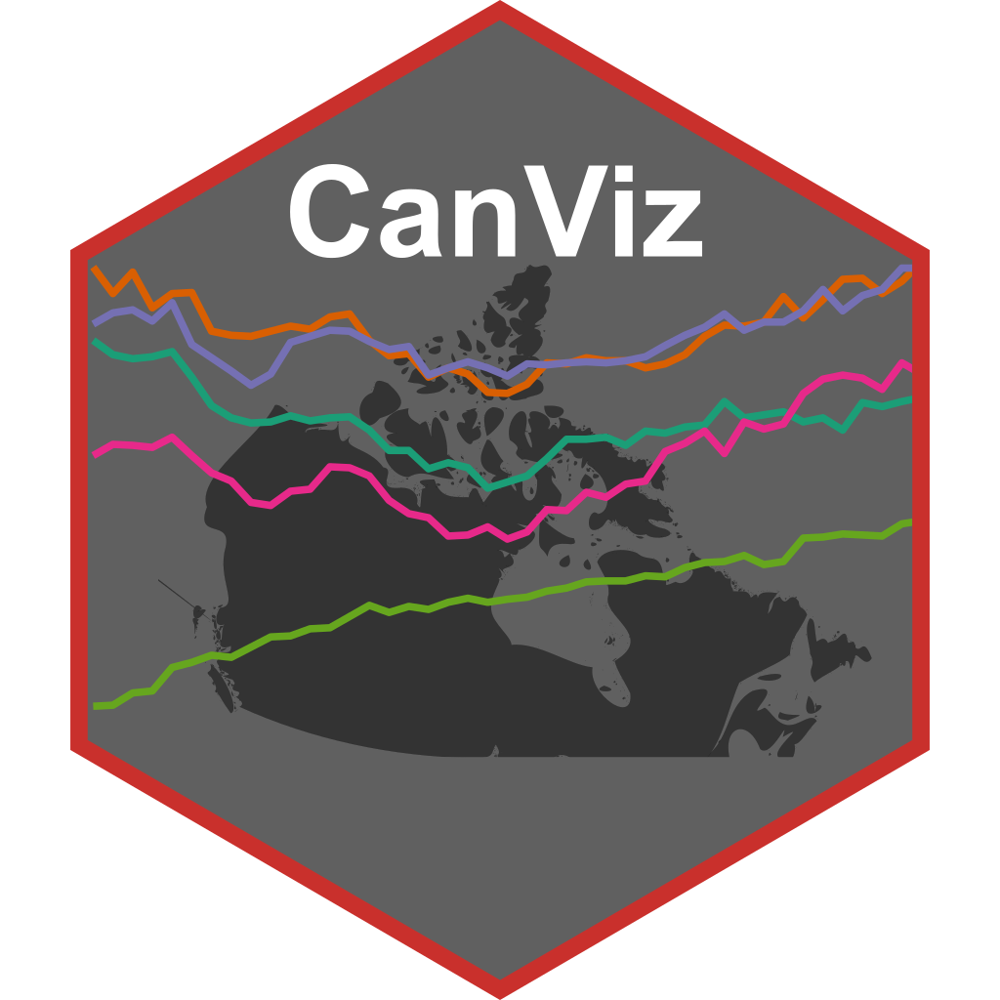

Over the holidays I had some downtime jet-lagged in the early morning and then on various train rides, and I decided to try my hand on a little side project. I had various versions of this in the back of my mind for a while, and got recently reminded of this after discussions with Stephen Rouse who not long ago built something along those lines.

The idea is simple, build a web app to dynamically explore StatCan (or other) data, select time series, and plot them interactively, without needing any specialized tools. Ideally with the ability to download the selected data or the resulting graph. With the [cansim R package](https://mountainmath.github.io/cansim/) [Dmitry Shkolnik](https://www.dshkol.com) and I have built powerful functionality to do this for R users and have full flexibility and control, including offline use. But not everyone is comfortable in R, and making Canadian data more accessible to a broader audience is something dear to my heart. And tools like [CensusMapper](https://censusmapper.ca/) have shown that there is a real appetite for easy to use web based tools to explore Canadian data, with high usage and engagement since I built this over ten years ago.

# Why now?

The main reason I haven’t done this before is that it takes time. But this that has fundamentally changed over the last year or so. This kind of web-app is a fairly simple and straight-forward application using standard javascript frameworks and StatCan APIs. And LLMs, in particular Claude Code, can do most of the work for this kind of thing with only a little hand-holding, dramatically accelerating development of such an app. Taking it from a week (estimated) of full time work to just a couple of (longish) train rides with most of the time spent reading while the LLM is noodling away writing code, only requiring intermittent intervention, updated instructions, and occasional hand holding and reading of code when it gets stuck to give more pinpointed instructions to guide it back on track. Plus some light manual editing at the end for fine-tuning.

# Building the app

There is nothing special about the process, LLMs, and in particular Claude Code, have found wide adoption in the industry and this is a fairly standard workflow. But many outsiders don't have a view into how LLMs are rapidly changing processes in the industry and there probably is value to quickly sketch the process of creating this kind of web app aimed at a broader audience.

Two years ago the way such an app would have gotten created is by someone with strong familiarity of front end web frameworks to collaborate with someone familiar with StatCan data and how people use data to sketch out and develop the app. Or a single person combining those skills, but that is rare. Just a year ago half of the front-end work would have been shortcut by asking an LLM to write a bare-bones template to get things started, cutting the front-end work in half. Today all that's required is a bit of superficial knowledge of front-end web frameworks to guide the process at a high level, trouble-shoot, and at the end manually refine things a bit.

How does it work? Pretty simple. To get it started I dropped into the Claude Code console, selected Sonnet 4.5 as the model^[I don't use Claude extensively and am on the lowest-cost plan, picking Sonnet over the newer Haiku gave me a bit more mileage although I might have missed out in terms of performance of the model.], enter *plan mode* and instructed Claude to plan a static web app leveraging [StatCan API](https://www.statcan.gc.ca/en/developers/wds/user-guide) using [react](https://react.dev) and [observable plot](https://observablehq.com/plot/) for graphing. It should allow browsing StatCan tables, browse and select dimensions and members from specific tables, and fetch the corresponding data and metadata and plot the result.

Claude took some time to browse the StatCan API specifications, did some web searches, and presented me with a detailed implementation plan. I asked it to make some tweaks and then gave it the go ahead to build the app. Claude noodled along and came back 20 minutes later with a somewhat functional bare-bones implementation. Some more back and forth pointing it to various problems in the app, and I had a basic app. All in all it took maybe an hour and half to get there, much of the time on my side was spent making coffee and preparing breakfast while Claude was doing work in the background.

That's when the bulk of the work started. This bare-bones version was usable, but barely so. What was needed is to help Claude design (and rearrange) the UI elements to make them more intuitive and informative, to properly access and parse the metadata and integrate it so users understand what they are doing. At this point it also required to also check through the code and tell Claude to redesign some parts. Partially because I have changed my mind on some UI choices and workflows half way, and partially with an eye toward future extensions. And to fit my idiosyncratic preferences.

Then came a phase to optimize the caching and API calls to minimize loading time for users and drag on StatCan APIs. This again required some hand-holding and quite specific instructions.

The last phase was a bit more tedious the goal was to fine-tune the user flows through the app and add styling. This involved a mixture of instructions to Claude and light manual editing of code. Some of this would probably have gone faster if I had taken full control and made all edits myself, but offloading a bunch of that to Claude gave me more time to read and was a net positive in terms of my time. That's pretty much it.

I should add that while this sounds (and was) stupendously easy to do, it does require some expertise to give the right directions to Claude. Expertise both in terns of a detailed understanding the data and StatCan APIs, as well as user needs and common use cases. And expertise in front-end web frameworks to give clear instructions on how to implement the app and to effectively troubleshoot when Claude manoeuvred itself into a corner. Claude will get better at the some of this, in particular the last part. Already at this point one can probably trade lack of expertise in front-end development for more annoying back and forth with Claude to get things working. It's a gradient of being super-effective in instructions and needing more back and forth with Claude to resolve issues, and I was definitely not always all that effective and wasted some time (and tokens) in the process.

There were also some quintessential LLM moments. Proper handling of dates and time zones was one such example where Claude Code struggled. Which goes back to the nature of LLMs, and the fact that there is an awful lot of code out there that does not handle dates and time zones properly and LLMs lack the ability to independently reason out the correct algorithm. This could have probably been resolved by repeatedly pointing out to Claude that some results were incorrect, with Claude repeatedly trying to fix it and probably succeeding at some point. But I decided to shortcut the process and just intervene manually to fix it. When one gets to non-standard tasks, or tasks that have often gotten implemented poorly in the wild, LLMs struggle and manual intervention is often easier.

# The app

The app itself is quite straight-forward, it has three pages, one for data discovery, one for selecting time series, and one for plotting.

## Data discovery

The landing page allows for browsing the 8,000+ StatCan data tables and, importantly, filtering and searching the tables to aid data discovery. Doing so interactively is quite convenient and in many way beats my previous preferred way of doing this via the **cansim** R package. The web app allows to filter by subject, survey, frequency, current vs archived status, geographic breakdown, reference date, and keywords in the table title or description. The keyword search tries to strike a balance between powerful search functionality and simplicity of use, allowing for exact match phrase search (in quotes) and allowing for exclusion of phrases (prefixed with a minus sign). 

This makes it easy to find relevant tables. 

## Data selection

Once a table is selected the user can proceed to the data selection page. Here one can explore the table dimensions and select individual members from each dimension to filter the data down to the desired time series to generate the appropriate coordinates. Once done, the selected time series can be added to the plot but generating the appropriate vectors.^[In theory this step could get skipped, one important advantage of using vectors instead of table and coordinates to fetch the data is that some combinations of members aren't valid, and the app will at this stage notify users of such cases. A disadvantage is that some tables, in paticular census tables, don't have vectors, so they can't currently be plotted. But the current plot setup is focused on time series and not set up to plot point in time data like a single year census. [CensusMapper](https://censusmapper.ca) is a better tool for exploring census data interactively, although CensusMapper only hosts census profile data and not the finer cross tabulations.]

## Plotting

Once data has been selected we can plot it. Going on the plot page will load the data for the selected vectors and plot the time series. For convenience there are some limited options to customize the plot. Individual series can be turned on or off in the plot and the time range can be narrowed down via brushing to aid dynamic exploration. 

For added convenience there is functionality to download the data as CSV or the graph as PNG, as well as the R code to pull in the data in R using the **cansim** R package and reproduce the graph.

The app can be accessed at [canviz.mountainmath.ca](https://canviz.mountainmath.ca). There are still some quirks right now that I will iron out as I find time, but it's quite functional. Give it a whirl!



# Next steps 

This is a basic version of the app I had in mind, there are lots of ways to expand it and make it more useful:

* Most importantly bringing in different data sources, for example integrating [CMHC data](https://mountainmath.github.io/cmhc/), [Bank of Canada data](https://mountainmath.github.io/canbank/) which I have already done for R users. 
* Allow for more advanced plotting options, including custom functions to allow combining of several time series. 
* Add ways to save several views/user states so that users can build up and share a repertoire of graphs they can revisit as data updates.
* Provide more stable data access, some StatCan APIs can be unavailable for some time between midnight and 8:30am eastern, and every now and then the StatCan APIs go down during daytime too. These are quite annoying design failures of the StatCan API, it's hard to understand how in this day and age StatCan designed a system with this much planned downtime (and high propensity for unplanned downtime).
* Add functionality for selecting different dimensions for the x-axis, not just time.
* Add functionality for visualizing data on a map, at least for high level geographies.
* See where users take this and learn about use cases I have not thought about and continue to improve user experience.
* Add in ways to display uncertainty (when available) and information on resolution/rounding of data.
* Be more principled about units. That includes better handling of log scale depending on the data type (e.g. percentage or index data, and making log scale the default for some data types), and warning users if they plot the different data types on the same graph. 
* Be more principled about aggregating data depending on the data type, for example use geometric and arithmetic mean as appropriate
* Add functionality for showing year over year change or month over month change.

Some of these can be implemented within the current standalone web app framework, others require setting up a dedicated server that can store user information. And possibly setting up a separate database server to improve data availability and stability.

