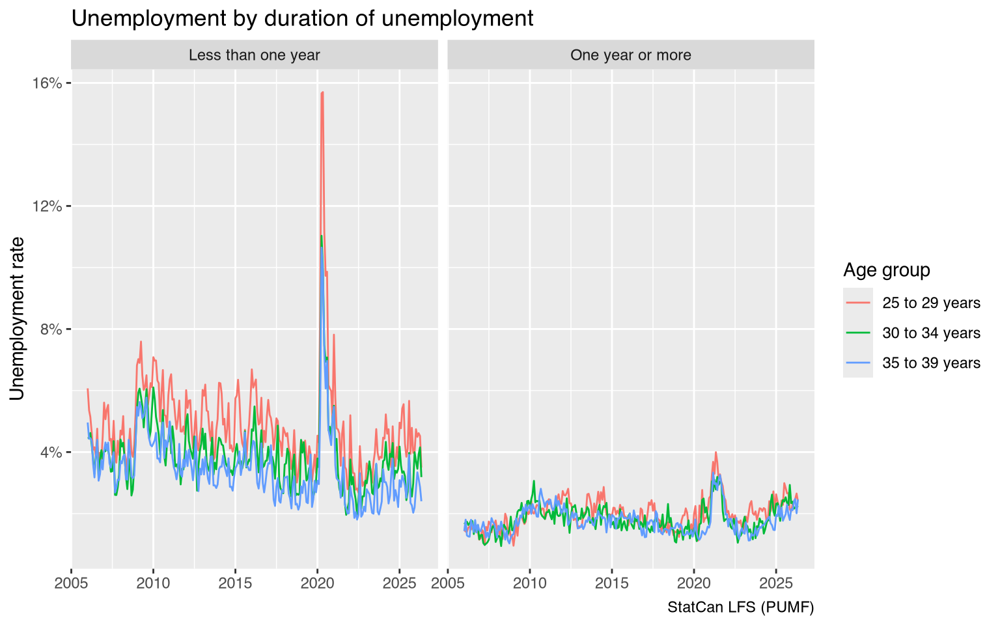
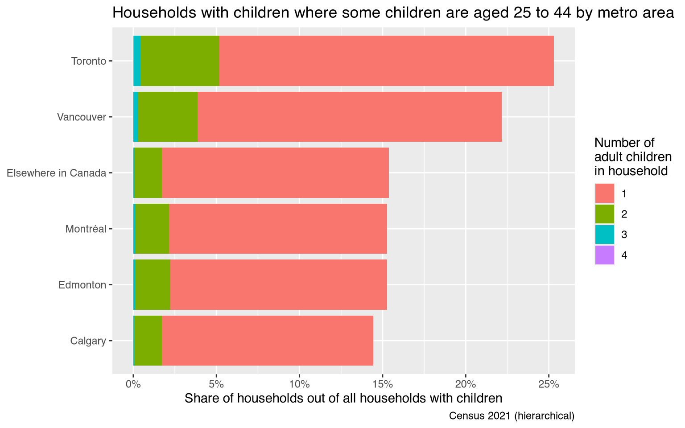
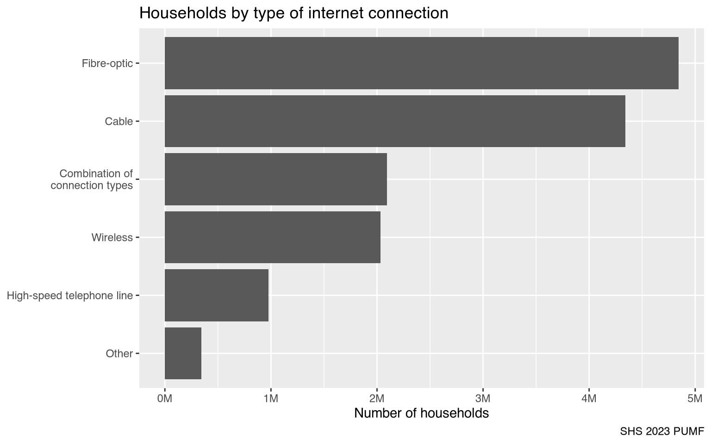
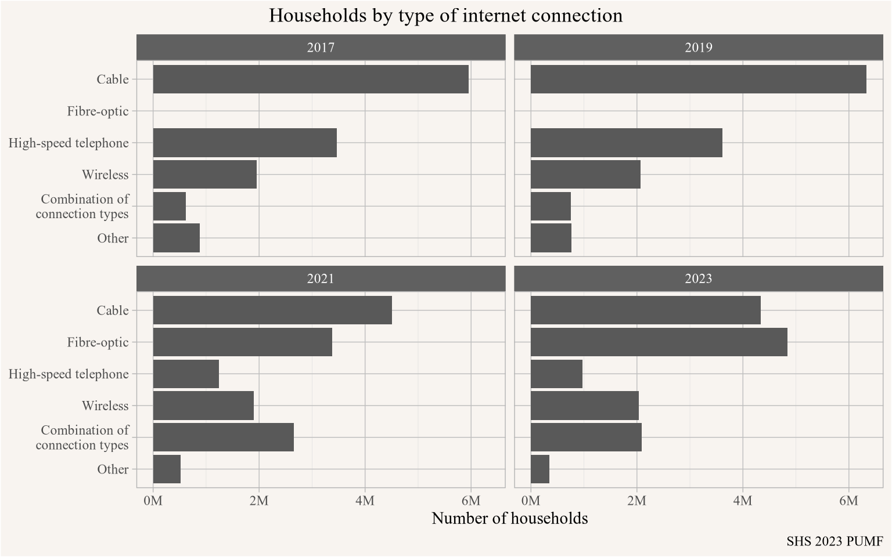
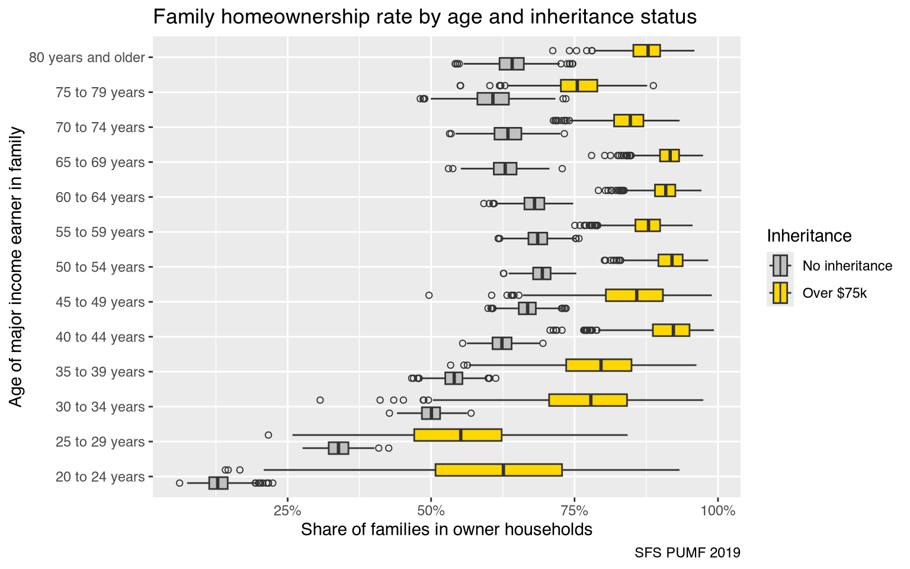
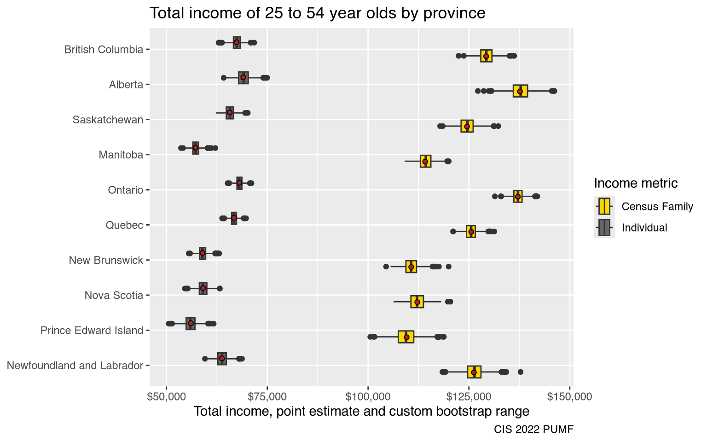

We have built an ecosystem of R packages for accessing and working with Canadian data, [**canpumf**](https://mountainmath.github.io/canpumf/) is the latest addition to this. It facilitates finding, parsing, and working with StatCan PUMF data.

# TL;DR

PUMF data is a valuable piece of StatCan's data products. But it's mostly ungoverned and comes in a large variety of formats, encodings, and lack of machine-readable metadata.

Sometimes people get caught up in arguments whether data like this qualifies as *open data* or merely *available data*, but the space between to two can be bridged to a large extent from the outside by creating metadata out of the bits that are available and parsing the data into a useful form.

The [**canpumf** package](https://mountainmath.github.io/canpumf/) is such a bridge, it sieves through the messiness of PUMF data, creates machine-readable metadata, and provides it in a highly structured and efficient analysis-ready form to users.


# What is PUMF data?

Public Use Micro File (PUMF) data is (nominally) record level survey data. It's derived from (processed) survey data by choosing a subsample of variables and survey rows, processing aimed at further de-anonymizing the individual survey responses, and assigning of weights to allow of scaling the PUMF data to the full target population.

PUMF data is inherently more noisy than the full survey data, it's a compromise between maintaining anonymity of individual responses and removing barriers to using the data. Full survey data [may be available](https://www.statcan.gc.ca/en/microdata) in the StatCan Research Data Centre (RDC) or virtual environments (vDL), research proposals seeking to access full microdata get vetted, researchers require security clearance, training and swearing in to gain access to the data, and results have to be vetted by Statistics Canada before they can be shared publicly. PUMF data is available for direct download or upon request via EFT and results of analysis can be shared immediately.


# A little bit of history

We have had a long love-hate relationship with PUMF data. It started out with envy, where we knew we could answer interesting questions with PUMF data but could not get access. StatCan data used to be all closed up. Only in February 2012 did StatCan adopt an Open Data License. Initially this covered a lot of StatCan products, but not PUMF data. PUMF data still came with a restrictive license, but started to get distributed more freely via the so-called Data Liberation Initiative, which got privileged access to the data to redistribute to a closed group of entities, notably universities.

Only in October 2018 did PUMF data get covered by StatCan's Open Data License. That was quite exciting, it meant that work based on PUMF data became generally reproducible. And it was when we started to increasingly work with PUMF data. The initial excitement got muted fairly fast though. While StatCan PUMF data is very rich and useful, it is completely ungoverned. People who are used to the NDM will have a hard time grasping the depth of this. There is no standard format, data ships in a large variety of data formats. Same with character encodings, it's a zoo. And there is no machine-readable metadata, and the metadata that does exist is inconsistent, misses information, and sometimes is just plain wrong. It's a complete and unconditional surrender to chaos. The LFS is the only instance where StatCan recently did make an attempt to standardize their PUMF data and clean up old data.

But as mentioned above, the data is also extremely useful, and it's better to have it, even with all the trouble it brings. Our initial approach was focused on answering questions we had for a long time, and we wrote ad-hoc import scripts for specific PUMF series and versions and labelled some of the data. But it became hard to manage and coordinate our diffuse scripts, we frequently lost track of which the latest most advanced import script was.

This was the love-hate phase, we loved having access to the data, but hated that there was no machine-readable metadata and that it was such a pain to extract variable and value labels, and missing data codes.

# **canpumf**

The solution of course is, and this is the beauty of open data, to write a package that that does all the painful metadata parsing, guessing of character encoding, harmonization and validation under the hood and hands the user clean labelled and validated data. Unfortunately, that's also a lot of work, but we started with this in 2021 with the  **canpumf** package. 

## What problem does **canpumf** solve?

StatCan PUMF data is *extremely* messy. It comes in a wide variety of formats and in most cases without clean machine-readable metadata. Modern reproducible and adaptable workflows using the data are nearly impossible, severely curtailing the usability of the data. The **canpumf** package aims to provide a unified interface to StatCan PUMF data to acquire, parse, structure, and work with the data in modern data analysis pipelines.

We started this work in 2021 when we worked on a provincial government project involving PUMF data and wanted to ensure our deliverable were fully reproducible and ideally the client could re-run it on new data when new PUMF data gets released. We built on the code we had for census data to expanded it to cover PUMF series used in the project. And from then on slowly built out coverage. StatCan expanded the list of PUMF that became available via direct download. But the general structure of the package remained messy and we have kept this package as a purely development version up until now. The initial idea of the package being general enough to parse new versions of a series proved illusionary, the variation in how StatCan would publish data, metadata, or chose character encodings proved to large even within a fixed PUMF series.

## The new **canpumf**


::: {.cell}

```{.r .cell-code}
library(tidyverse)
library(canpumf)
```
:::


Several problems remained with the old **canpumf**. One was that it requires loading PUMF data into memory, which works ok for small surveys but unnecessarily stresses resources for large ones. Labelling of PUMF variables was optional and a second step that was time-consuming and had to be done every time data is loaded. Working with lots of PUMF data in the meantime we feel like we have a clear preference how this should work: Column names should remain in the short form by default for easy access when typing, learning their meaning from the metadata is fairly simple and works well in situations where one frequently works with a particular PUMF series. For rarely used PUMF column names can quickly be labelled if desired. Variable labels on the other hand should always be coded for categorical variables, having clear-text labels provides clarity and avoids mistakes when working with PUMF data. There are a lot more labels than column names, learning them over time is not realistic.

The main design decisions are:

* Create a list for PUMF data accessible via the package.
* Add robust metadata parsing from SAS, SPSS, STATA command files, or DBF or CSV data, or PDF codebooks, and save this information for later querying and parsing of data.
* Create a registry with manual overrides, designed to be extendable as new PUMF data becomes available to facilitate quickly integrating them into the package.
* Parse data into DuckDB on first read so it remains available in a highly efficient queryable form, with categorical data stored as ENUM (translating to R factors) for efficiency while maintaining human readable labels.

The last part constitutes a breaking change, in the past `get_pumf` would load data into memory. To translate workflows the following two lines give (mostly) equivalent results:

* **Old version:** `get_pumf(....) |> label_pumf_data(rename_columns = FALSE)`
* **New version:** `get_pumf(....) |> collect()`

One added feature is that the new version is fully bilingual with a language parameter to select the desired language, defaulting to English. (A handful of PUMF files supported in this package remain English only because StatCan did not ship any French language command files, the primary way the package parses metadata.)

One other change is the handling of **LFS** PUMF data. The LFS is probably the most-used PUMF dataset, and it's the only one where StatCan has paid attention to proper metadata. (There are still occasional problems with some year/month versions of LFS metadata.) Also, LFS PUMF data, while coming out at a monthly frequency, is highly consistent over time with only very minor changes over the years. So for LFS PUMF data we decided to go a slightly different route and parse all LFS data into the same DuckDB table. This makes querying longitudinal LFS data easy and fast. We also have helper functions to add derived columns to harmonize some of the changes over time, in particular the switch from SEX to GENDER in reporting the data in a derived GENDER_SEX column that privileges GENDER and backfills it with SEX for older PUMF versions while preserving the original columns as they were. And a function that adds a SURVDATE variable built from the survey month and year.

## Why DuckDB?

Going to some kind of queryable database form is needed to make working with PUMF data more efficient. In the old version, just loading e.g. the 2021 census PUMF data and labelling the categorical variables would take a couple of minutes. Which is fine in principle, but annoying. The other consideration is storage space, in particular when working with labelled data. And the way PUMF data is typically used, which usually only require a handful of columns at a time.

This points toward parquet or DuckDB as good choices, given their columnar form and compression, and in the case of DuckDB the ENUM variable type that translates naturally to R factors. Parquet offers generally somewhat lower disk space usage, but DuckDB is not far behind and affords more flexibility. In particular, it allows for easy appending of data for monthly LFS updates, as well as a good way to accommodate PUMF surveys with multiple modules, where some modules only relate to a subset of the full data and the modules can be stored in separate tables in the same DuckDB database so they can easily be joined if needed. Similarly, users can create tables with derived data and store them as a separate table in the same database without messing directly with the original StatCan data. The package uses that for storing custom bootstrap weights it can generate to aid analysis.

## The metadata problem

In principle the work behind the **canpumf** package should be straight-forward. Figure out where the publicly available PUMF data sits and can get downloaded, implement data download functionality, parse the data and metadata and import it into DuckDB in a principled way coding the variable labels on categorical variables and setting NAs on numerical variables as appropriate. In practice this all breaks down because, with the exception of the LFS **StatCan does not ship machine-readable metadata with their PUMF**. And even LFS data metadata at times contains inconsistencies. StatCan has no uniform data nor metadata standards for PUMF data, every team cooks their own soup. And even within a survey, the way data and metadata is encoded can change survey version to survey version.

No uniform machine readable metadata does not mean that there is no metadata at all. There is unstructured metadata in accompanying documentation, usually in PDF form, but sometimes in docx or rtf or txt. There are also codebooks for importing data into proprietary legacy platforms, like SAS, SPSS, Stata and others. These "command files" are mini programs meant to read data into one of these legacy platforms and apply labels there, so they contain information on labels that can be extracted with enough effort. There is quite a bit of variation on how this is done in these command files, but they still more structured than the documentation in PDFs.

Each PUMF file comes as a zip archive containing the data, command files, and documentation, and there are also no standards how this archive should be structured. This adds another layer of complexity, requiring the package to be able to deal flexibly with how a particular survey group in a particular survey version decided to structure the files within the archive.

Additionally, the data comes with inconsistent character encodings, sometimes it's in UTF-8 as one would expect, but mostly it's in CP1252 (Windows) encoding, sometimes Latin1 (which has some subtle differences), or CP850 (remember MS DOS?). This inconsistency means the encoding also has to be determined dynamically. It does not help that StatCan likes using en-dashes and em-dashes -- without consideration for when usage would be appropriate and if they should be used at all in codebooks.

This complete failure in data governance creates enormous friction when trying to systematically work with StatCan PUMF data. The lack of structure requires scripts that are flexible enough to deal with all the quirks and moods of each StatCan survey processing team, but at the same time be robust enough to yield reliable data. 

The majority of the work in this package is to robustly parse these *command files* to extract the metadata needed to import the data into DuckDB. In particular, for categorical (qualitative) variables all the value labels need to get extracted, and for numerical variables NA values need to be properly identified and coded. And in some cases, when not enough information is present to do this well, there needs to be a way for semi-manual overrides. And in some cases no command files with variable and value labels exists, which requires scraping them out of the PDF documentation. And while building robust general scripts to do this seems like it should work, in the end it's easier to develop a set of scripts and approaches and pin specific approaches to specific PUMF series and versions. It's a mess. Right now **canpumf** has several high-level metadata parse strategies to cover the various ways how metadata is delivered for different PUMF, and within these there are a range of sub-processes and overrides to deal with select PUMF-specific quirks.

This requires manually checking through data imports, and creating an extensive test suite to prevent regressions as parsers are adapted to deal with more and more different ways StatCan survey processing teams decide to structure things. Right now the package has roughly 15k unit and integration tests to make sure everything works as expected and to guard against regressions when modifying and expanding data parsing scripts when adding new PUMF datasets.

The real problem is that we don't have the patience for this, it's tedious manual labour that requires iteratively building robust codebook parsers, niche regexp knowledge, looking things up in PDF documentation for verification, setting up manual interventions and structuring the code so it does not fall apart the next time someone sneezes. Fortunately for me our sidekick Claude is very happy to take this on, is meticulous when it comes to this kind of thing, as excellent handle on regexp, never complains, and is willing to spend endless time chasing down edge cases. The end result is that Claude took all our diverse import scripts and converted them into more robust centralized versions, plus a registry of manual overrides and instructions which codebooks to prioritize for which PUMF series and versions. And a more principled way of injecting manual values in cases where StatCan codebooks simply did not cover the full range of values in the data or were deficient in other ways. In some cases, e.g. the 1991 Census (individuals), English metadata is missing entirely from the StatCan-provided PUMF and had to be added manually.

### Problems and fixes

This systematic process unearthed some real problems. For example, in the 1981 individuals PUMF (from EFT) there are inconsistencies between the PDF documentation and the SPSS command files. Following the SPSS command files causes missing variable labels, following the PDF makes that problem disappear. For example, this was observed with columns FAOCC81 and MAOCC81. What makes this peculiar is that FAOCC81 is labelled as "Occupation, 1981 of Husband or Male Lone Parent" in the PDF documentation and MAOCC81 is labelled as "Occupation, 1981 of Wife or Female Lone Parent", which is opposite of what the starting letters "F" and "M" might suggest. So it's understandable that one might have mixed that up when writing the SPSS command files, but it does raise questions. The same problem occurs with WKACTMA and WKACTFA. These two cases were detected because of label mismatch when following the SPSS command file instructions, it could be that the problem is more wide spread though, we did a bit of digging and the FALFACT and MALFACT also have the same pattern of different column labels in the SPSS command files and the census, so we swapped them too. It's also a bit concerning that this problem persists over 40 years later.


## How does it work?

For the end user the complexity is hidden and things just *magically* work. Simply call `get_pumf(...)`, specifying your PUMF series and version, e.g. `get_pumf(series = "Census", version = "2021 (hierarchical)")` and the package fetches the data, parses the codebooks, labels the values, stores it in an efficient DuckDB database and hands back a connection to the data table. This is explained in more detail in [one of the package vignettes](https://mountainmath.github.io/canpumf/articles/pipeline.html). This can take some time depending on the speed of the internet connection. The second time this is called it skips all the importing and just returns the database connection.

## LFS

The LFS is, next to the censuses, probably the most-used PUMF. It comes out every month and is given special treatment in the package due to the regular updates and high uniformity. The package imports the LFS into the same DuckDB database, starting from 2006 which is from when the data is available via direct download. Passing the `refresh = "auto"` option ensures that all available data is downloaded, from January 2006 though to the most recent available month.


::: {.cell}

```{.r .cell-code}
lfs_pumf <- get_pumf("LFS",refresh="auto")
```
:::


And it's blazing fast. Having the data in a database means that one can very quickly cross-tabulate and aggregate data. For example, right now there are 25,287,947 rows in the LFS PUMF. In @fig-youth-unemployment we showcase a typical LFS query, calculating the unemployment rate for various age groups split by whether they have been unemployed for less than a year or a year or more. It takes less than half a second to run that and extract the timeline data. All with a very low memory footprint. Gone are the times where we take a long time to load all data into memory, cut down on the number of variables early in the process, have variable labels (not just column names) hard-wired in our brain just so we can work with the data. Now we have properly labelled variables, optionally labelled variables (column names), and fast access to the entire PUMF data.


::: {.cell}

```{.r .cell-code}
unemployment_stats <- lfs_pumf |> 
  filter(LFSSTAT !="Not in labour force") |>
  filter(AGE_12 %in% c("25 to 29 years","30 to 34 years", "35 to 39 years")) |>
  mutate(jd=case_when(is.na(DURJLESS) ~ "Not applicable",
                      DURJLESS<12 ~ "Less than one year",
                      TRUE ~ "One year or more")) |>
  mutate(Date=as.Date(paste0(SURVYEAR,"-",SURVMNTH,"-01"))) |>
  summarize(Count=sum(FINALWT),.by=c(Date,jd,AGE_12)) |>
  mutate(Share=Count/sum(Count),.by=c(Date,AGE_12)) |>
  filter(jd!="Not applicable")


unemployment_stats |>
  ggplot(aes(x=Date,y=Share,colour=AGE_12)) +
  geom_line() +
  facet_wrap(~jd) +
  scale_y_continuous(labels=scales::percent_format()) +
  labs(title="Unemployment by duration of unemployment",
       y="Unemployment rate",x=NULL,
       colour="Age group",
       caption="StatCan LFS (PUMF)")
```

::: {.cell-output-display}
{#fig-youth-unemployment width=768}
:::
:::

Note how just looking at the code it's impossible to tell if `lfs_pumf` holds all the data in memory, or if it is just a database connection. We could formally call `collect()` before plotting the data, but there is no need, ggplot takes care of this.

One difference is that we should close the DuckDB connection when we are done working with it.


::: {.cell}

```{.r .cell-code}
close_pumf(lfs_pumf)
```
:::


The **canpumf** package by default hands back a readonly connection, which avoids issues when connections aren't properly closed and then re-opened.


## Census

The census is the bread and butter survey, and the census PUMF is extremely useful. As an example, consider the question how many households have an adult child living with parents by metro area. The 2021 individuals PUMF can answer the question how many adult children are living with parents, but in some households may house more than one adult child. To understand the question in terms of households we turn to the hierarchical PUMF.


::: {.cell}

```{.r .cell-code}
pumf_2021h <- get_pumf("Census","2021 (hierarchical)") 
```
:::


For this we filter on people who are coded as children in a family, and discard those 45 years or older as these likely resemble situations where children take care of elderly parents rather than children who are to some degree dependent on their parents.

To count households we divide the weights by the (filtered) number of children in each household.


::: {.cell}

```{.r .cell-code}
child_ages <- c("0 to 9 years", "10 to 14 years", "15 to 19 years", "20 to 24 years")
old_ages <- c("45 to 49 years", "50 to 54 years", "55 to 64 years", "65 to 74 years", "75 years and over")
pumf_2021h |>
  filter(AGEGRP != "Not available", !(AGEGRP %in% old_ages)) |>
  filter(CFSTAT %in% c("Child of a couple","Child of a parent in a one-parent family")) |>
  mutate(child = AGEGRP %in% child_ages) |>
  mutate(adults = sum(as.integer(!child)), 
         n=n(),
         .by=HH_ID) |> # count adults per household
  summarize(Count=sum(WEIGHT/n),.by=c(CMA,adults)) |> # count households
  mutate(Share=Count/sum(Count),.by=CMA) |>
  filter(adults>0) |>
  mutate(total_share=sum(Share),.by=CMA) |>
  mutate(CMA=case_when(grepl("^Other",CMA) ~ "Elsewhere in Canada",TRUE ~ CMA)) |>
  ggplot(aes(y=reorder(CMA,total_share),x=Share, fill=factor(adults))) +
  geom_col() +
  scale_x_continuous(labels=scales::percent_format()) +
  labs(title="Households with children where some children are aged 25 to 44 by metro area",
       x="Share of households out of all households with children",
       y=NULL,
       fill="Number of\nadult children\nin household",
       caption="Census 2021 (hierarchical)")
```

::: {.cell-output-display}
{width=768}
:::
:::


Unsurprisingly, the share of households with children that house adult children (aged 25 through 44) is highest in Toronto, closely followed by Vancouver. These two metro areas also have elevated levels of households with more than one adult child in this age range.


::: {.cell}

```{.r .cell-code}
close_pumf(pumf_2021h)
```
:::


## SHS

The SHS offers detailed spending patterns that can be explored, as an example we look at the type of internet connection people have. Here we also show how to access the variable labels.


::: {.cell}

```{.r .cell-code}
shs_2023 <- get_pumf("SHS","2023")

pumf_var_labels(shs_2023) |> 
  filter(grepl("Internet connection",label_en))
```

::: {.cell-output .cell-output-stdout}

```
# A tibble: 5 × 3
  name     label_en                                                label_fr     
  <chr>    <chr>                                                   <chr>        
1 INTCON_H Type of Internet connection - High-speed telephone line Type de conn…
2 INTCON_C Type of Internet connection - Cable                     Type de conn…
3 INTCON_W Type of Internet connection - Wireless                  Type de conn…
4 INTCON_F Type of Internet connection - Fibre-optic               Type de conn…
5 INTCON_O Type of Internet connection - Other                     Type de conn…
```


:::
:::


::: {.cell}

```{.r .cell-code}
shs_2023 |>
  select(TR070,TR038,WEIGHTD) |>
  collect() |>
  ggplot(aes(x=TR070,y=TR038,weight=WEIGHTD)) +
  geom_point(shape=21) +
  geom_smooth(method="lm") +
  scale_x_continuous(labels=scales::dollar_format(),trans="log") +
  scale_y_continuous(labels=scales::dollar_format(),trans="log") +
  labs()
```
:::


Based on this we summarize the SHS data, apply clear-text column names, and reshape the data to count the types of internet connections households have, collapsing households having more than one type of internet connection into a "Combination" category.


::: {.cell}

```{.r .cell-code}
internet_connection_2023 <- shs_2023 |>
  summarise(Count=sum(WEIGHTD),
            .by=matches("INTCON_")) |>
  label_pumf_columns() |>
  collect()


internet_connection_2023 |>
  mutate(case=row_number()) |>
  pivot_longer(matches("Type of Internet connection")) |>
  filter(value!="No") |>
  mutate(name=gsub("Type of Internet connection - ","",name)) |>
  mutate(label=case_when(n()>1 ~ "Combination of\nconnection types",
                              TRUE ~ name[1]),
         .by=case) |>
  summarize(Count=first(Count), label=first(label),.by=case) |>
  summarize(Count=sum(Count), .by=label) |>
  ggplot(aes(y=reorder(label,Count),x=Count)) +
  geom_col() +
  scale_x_continuous(labels=scales::comma_format(scale = 10^-6, suffix="M")) +
  labs(title="Households by type of internet connection",
       x="Number of households",
       y=NULL,
       caption="SHS 2023 PUMF")
```

::: {.cell-output-display}
{width=768}
:::
:::


::: {.cell}

```{.r .cell-code}
close_pumf(shs_2023)
```
:::


If we want to understand how these trends have changed over time we can iterate through the SHS versions. This exploits that there is some uniformity in naming across years that only need mild modifications. When iterating through this we explicitly turn off registering the DuckDB connection with the RStudio Connections Pane to avoid conflicts in the vectorized call.


::: {.cell}

```{.r .cell-code}
internet_connection <- seq(2017,2023,2) |>
  as.character() |>
  map_df(\(y){
    shs_pumf <- get_pumf("SHS",y, register_connection = FALSE) 
    weight_column <- colnames(shs_pumf)[grepl("WEIGHT",colnames(shs_pumf))]
    d <- shs_pumf |>
      summarise(Count=sum(!!as.name(weight_column)),
                .by=matches("INTCON_")) |>
      label_pumf_columns() |>
      collect() |>
      mutate(Year=as.character(y))
    close_pumf(shs_pumf)
    d
  })

internet_connection |>
  mutate(case=row_number()) |>
  pivot_longer(matches("Type of Internet connection")) |>
  filter(value!="No") |>
  mutate(name=gsub("Type of Internet connection - ","",name)) |>
  mutate(label=case_when(n()>1 ~ "Combination of\nconnection types",
                              TRUE ~ gsub(" line$","",name[1])),
         .by=case) |>
  summarize(Count=first(Count), label=first(label),.by=c(Year,case)) |>
  summarize(Count=sum(Count), .by=c(Year,label)) |>
  ggplot(aes(y=reorder(label,Count),x=Count)) +
  geom_col() +
  facet_wrap(~Year) +
  scale_x_continuous(labels=scales::comma_format(scale = 10^-6, suffix="M")) +
  labs(title="Households by type of internet connection",
       x="Number of households",
       y=NULL,
       caption="SHS 2023 PUMF")
```

::: {.cell-output-display}
{width=768}
:::
:::

Fibre-optic started to get broken out in 2021 data, and has been growing rapidly as an option overtaking the long-running top option of cable internet by 2023.

## Bootstrap weights

The package has the built-in ability to generate bootstrap weights, either for tables in memory on the fly, or right in DuckDB in a separate table that can be linked against the data. Some PUMF data ship with bootstrap weights, but many don't, and this makes it easy to assess sampling variance. The weights can be stratified if desired, by default weights for the LFS are stratified by survey month and year.

The SFS is a survey that ships with bootstrap weights. A main advantage of shipping the data with bootstrap weights allows to ensure that bootstrapping respects relevant strata.


::: {.cell}

```{.r .cell-code}
sfs_data <- get_pumf("SFS","2019")

sfs_inheritance <- sfs_data |>
  mutate(inheritance = case_when(is.na(PINHERT) ~ "No inheritance",
                                 PINHERT<= 0 ~ "Zero inheritance",
                                 PINHERT<=75000 ~ "Less than $75k",
                                 TRUE ~ "Over $75k")) |>
  mutate(own=PFTENUR != "Do not own") |>
  summarise(Count=sum(PWEIGHT),
            across(matches("BSW_\\d+"),sum),
            cases=n(),
            .by=c(PAGEMIEG,own,inheritance)) |>
  collect() |>
  pivot_longer(matches("BSW_\\d+"), names_to="Weight",values_to="Value") |>
  mutate(Share=Count/sum(Count),
         Share_w=Value/sum(Value),
         sum_cases=sum(cases),
         .by=c(Weight,PAGEMIEG,inheritance)) |>
  mutate(inheritance=factor(inheritance, levels=c("No inheritance","Less than $75k","Over $75k")))

sfs_data |> close_pumf()

sfs_inheritance |>
  filter(PAGEMIEG!="Under 20 years") |>
  filter(sum_cases>=5, own) |>
  filter(inheritance %in% c("No inheritance","Over $75k")) |>
  ggplot(aes(y=PAGEMIEG)) +
  geom_boxplot(aes(x=Share_w, fill=inheritance), shape=1) +
  scale_x_continuous(labels=scales::percent_format()) +
  scale_fill_manual(values=c("#C0C0C0","gold")) +
  labs(title="Family homeownership rate by age and inheritance status",
       x="Share of families in owner households",
       y="Age of major income earner in family", 
       fill="Inheritance",
       caption="SFS PUMF 2019")
```

::: {.cell-output-display}
{width=768}
:::
:::


::: {.cell}

```{.r .cell-code}
cis_pumf <- get_pumf("CIS","2022")

prime_working_age <- c("25 to 29 years", "30 to 34 years", "35 to 39 years", 
                       "40 to 44 years", "45 to 49 years", "50 to 54 years" )

cis_income <- cis_pumf |>
  add_bootstrap_weights("FWEIGHT", n_replicates = 1000L) |>
  filter(AGEGP %in% prime_working_age) |>
  summarize(across(matches("FWEIGHT|CPBSW\\d+"),
                   list(P=\(x)sum(x*TTINC)/sum(x),
                        CF=\(x)sum(x*CFTTINC)/sum(x))),
            .by = PROV) |>
  collect()

cis_pumf |> close_pumf()

cis_income |>
  pivot_longer(matches("_P$|_CF$"),names_pattern = "(.+)_(.+)",
               names_to=c("Weight","Type")) |>
  ggplot(aes(y=PROV, x=value, fill=Type, group = interaction(Type,PROV))) +
  geom_boxplot(data = ~filter(.,grepl("CPBSW\\d+",Weight))) +
  geom_point(data = ~filter(.,Weight=="FWEIGHT"),
             fill="firebrick",shape=21, position = position_dodge(width=0.8)) +
  scale_x_continuous(labels=scales::dollar_format()) +
  scale_fill_manual(labels=c("P"="Individual","CF"="Census Family"),
                    values=c("P"="grey40","CF"="gold")) +
  labs(title="Total income of 25 to 54 year olds by province",
       y=NULL,x="Total income, point estimate and custom bootstrap range",
       fill="Income metric",
       caption="CIS 2022 PUMF")
```

::: {.cell-output-display}
{width=768}
:::
:::


# Upshot

[**canpumf**](https://mountainmath.github.io/canpumf/) can't completely fill the void of missing metadata and other messiness with StatCan PUMF data, but it can get close. And make working with the data easy. It's designed to automatically detect encoding, sources for scraping metadata and building metadata and validating results so that new PUMF data that has not been explicitly tested against the package can get ingested. It allows reading and copying manual overrides for existing PUMF so they can be adapted to fit new PUMF.

Issues remain, hopefully StatCan will move towards more predictable metadata or even clean machine-readable metadata like in the LFS going forward, facilitating automatic data processing and import. Either way, [**canpumf**](https://mountainmath.github.io/canpumf/)  greatly simplifies working with StatCan PUMF data and is suitable for use in reproducible workflows.


<details>

<summary>Reproducibility receipt</summary>


::: {.cell}

```{.r .cell-code}
## datetime
Sys.time()
```

::: {.cell-output .cell-output-stdout}

```
[1] "2026-07-03 09:19:32 PDT"
```


:::

```{.r .cell-code}
## repository
git2r::repository()
```

::: {.cell-output .cell-output-stdout}

```
Local:    main /Users/jens/R/mountain_doodles
Remote:   main @ origin (https://github.com/mountainMath/mountain_doodles.git)
Head:     [62f53a9] 2026-07-03: canpumf post
```


:::

```{.r .cell-code}
## Session info 
sessionInfo()
```

::: {.cell-output .cell-output-stdout}

```
R version 4.6.0 (2026-04-24)
Platform: aarch64-apple-darwin23
Running under: macOS Tahoe 26.5.1

Matrix products: default
BLAS:   /Library/Frameworks/R.framework/Versions/4.6/Resources/lib/libRblas.0.dylib 
LAPACK: /Library/Frameworks/R.framework/Versions/4.6/Resources/lib/libRlapack.dylib;  LAPACK version 3.12.1

locale:
[1] en_US.UTF-8/en_US.UTF-8/en_US.UTF-8/C/en_US.UTF-8/en_US.UTF-8

time zone: America/Vancouver
tzcode source: internal

attached base packages:
[1] stats     graphics  grDevices utils     datasets  methods   base     

other attached packages:
 [1] canpumf_0.5.2   lubridate_1.9.5 forcats_1.0.1   stringr_1.6.0  
 [5] dplyr_1.2.1     purrr_1.2.2     readr_2.2.0     tidyr_1.3.2    
 [9] tibble_3.3.1    ggplot2_4.0.3   tidyverse_2.0.0

loaded via a namespace (and not attached):
 [1] gtable_0.3.6              xfun_0.59                
 [3] htmlwidgets_1.6.4         tzdb_0.5.0               
 [5] vctrs_0.7.3               tools_4.6.0              
 [7] generics_0.1.4            curl_7.1.0               
 [9] parallel_4.6.0            blob_1.3.0               
[11] pkgconfig_2.0.3           dbplyr_2.6.0             
[13] RColorBrewer_1.1-3        S7_0.2.2                 
[15] lifecycle_1.0.5           compiler_4.6.0           
[17] farver_2.1.2              git2r_0.36.2             
[19] duckplyr_1.2.1            mountainmathHelpers_0.1.4
[21] htmltools_0.5.9           yaml_2.3.12              
[23] pillar_1.11.1             crayon_1.5.3             
[25] cachem_1.1.0              tidyselect_1.2.1         
[27] rvest_1.0.5               digest_0.6.39            
[29] stringi_1.8.7             duckdb_1.5.4             
[31] labeling_0.4.3            fastmap_1.2.0            
[33] grid_4.6.0                cli_3.6.6                
[35] magrittr_2.0.5            utf8_1.2.6               
[37] withr_3.0.3               scales_1.4.0             
[39] bit64_4.8.2               timechange_0.4.0         
[41] rmarkdown_2.31            httr_1.4.8               
[43] bit_4.6.0                 otel_0.2.0               
[45] hms_1.1.4                 memoise_2.0.1            
[47] evaluate_1.0.5            knitr_1.51               
[49] rlang_1.2.0               glue_1.8.1               
[51] DBI_1.3.0                 selectr_0.6-0            
[53] xml2_1.6.0                collections_0.3.12       
[55] rstudioapi_0.19.0         vroom_1.7.1              
[57] jsonlite_2.0.0            R6_2.6.1                 
```


:::
:::


</details>

### References

::: {#refs}
:::


